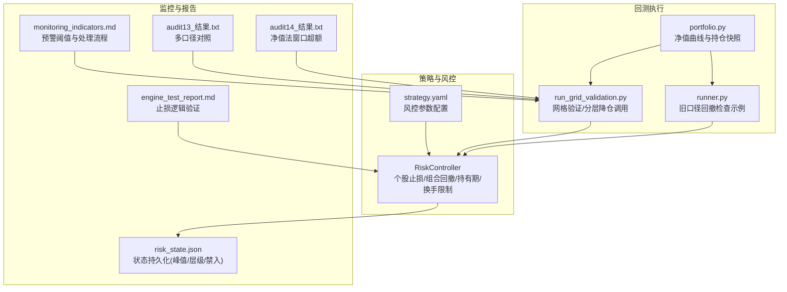
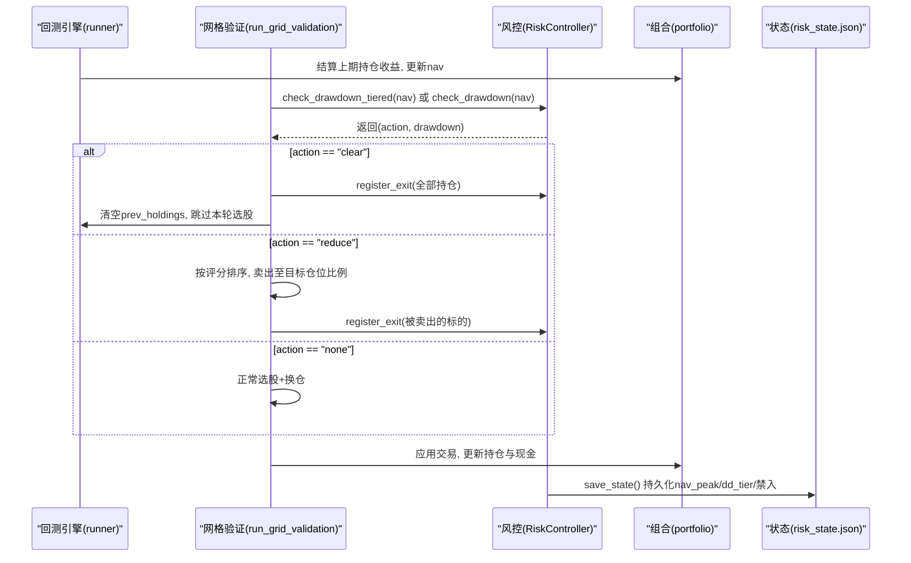
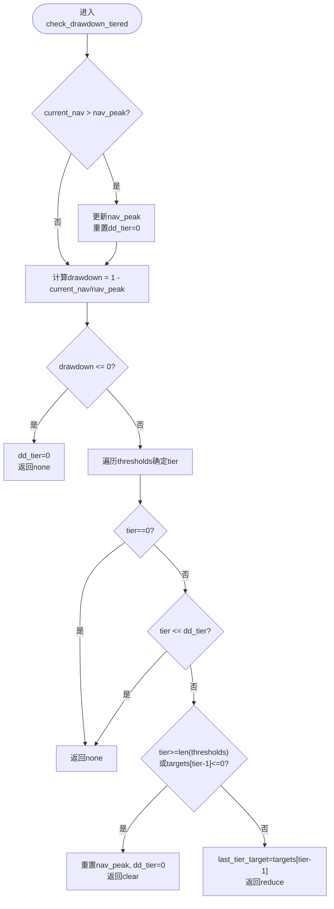
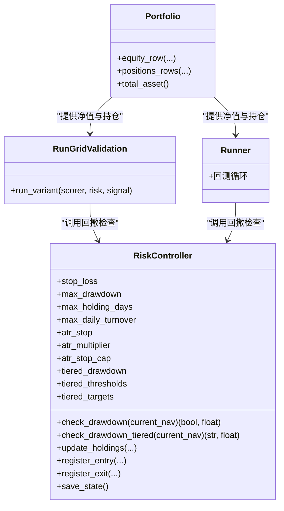

# 组合回撤控制

<cite>
**本文引用的文件**   
- [risk.py](file://projects/Project_10_价值小盘V2/strategy/risk.py)
- [run_grid_validation.py](file://projects/Project_10_价值小盘V2/run_grid_validation.py)
- [runner.py](file://projects/Project_10_价值小盘V2/runner.py)
- [portfolio.py](file://backtest/portfolio.py)
- [monitoring_indicators.md](file://projects/verification/results/monitoring_indicators.md)
- [engine_test_report.md](file://projects/verification/results/engine_test_report.md)
- [audit13_结果.txt](file://research_audit/audit13_结果.txt)
- [audit14_结果.txt](file://research_audit/audit14_结果.txt)
- [strategy.yaml](file://projects/Project_10_价值小盘V2/config/strategy.yaml)
- [risk_state.json](file://projects/Project_10_价值小盘V2/results/risk_state.json)
</cite>

## 目录
1. [简介](#简介)
2. [项目结构](#项目结构)
3. [核心组件](#核心组件)
4. [架构总览](#架构总览)
5. [详细组件分析](#详细组件分析)
6. [依赖关系分析](#依赖关系分析)
7. [性能与参数调优](#性能与参数调优)
8. [回测验证流程与效果评估](#回测验证流程与效果评估)
9. [故障排查指南](#故障排查指南)
10. [结论](#结论)

## 简介
本文件系统化阐述 QuantLab 中“组合回撤控制”机制，覆盖净值峰值跟踪算法、回撤计算逻辑、阈值设置、清仓触发与恢复策略、实时监控与预警、参数调优方法、历史回测验证流程与效果评估，以及实际案例对比。目标是让非技术读者也能理解回撤控制的原理与实践，同时为开发者提供可追溯的实现细节与优化建议。

## 项目结构
与回撤控制直接相关的代码集中在 Project_10（价值小盘V2）的 strategy 层与回测运行脚本中，辅以 backtest 模块的净值记录与 verification 结果的监控指标定义。

图表来源
- [risk.py:15-195](file://projects/Project_10_价值小盘V2/strategy/risk.py#L15-L195)
- [run_grid_validation.py:166-350](file://projects/Project_10_价值小盘V2/run_grid_validation.py#L166-L350)
- [runner.py:154-190](file://projects/Project_10_价值小盘V2/runner.py#L154-L190)
- [portfolio.py:38-189](file://backtest/portfolio.py#L38-L189)
- [monitoring_indicators.md:1-63](file://projects/verification/results/monitoring_indicators.md#L1-L63)
- [engine_test_report.md:1-17](file://projects/verification/results/engine_test_report.md#L1-L17)
- [strategy.yaml:43-56](file://projects/Project_10_价值小盘V2/config/strategy.yaml#L43-L56)
- [risk_state.json:1-773](file://projects/Project_10_价值小盘V2/results/risk_state.json#L1-L773)

章节来源
- [risk.py:15-195](file://projects/Project_10_价值小盘V2/strategy/risk.py#L15-L195)
- [run_grid_validation.py:166-350](file://projects/Project_10_价值小盘V2/run_grid_validation.py#L166-L350)
- [runner.py:154-190](file://projects/Project_10_价值小盘V2/runner.py#L154-L190)
- [portfolio.py:38-189](file://backtest/portfolio.py#L38-L189)
- [monitoring_indicators.md:1-63](file://projects/verification/results/monitoring_indicators.md#L1-L63)
- [strategy.yaml:43-56](file://projects/Project_10_价值小盘V2/config/strategy.yaml#L43-L56)

## 核心组件
- RiskController：实现个股止损、ATR自适应止损、组合回撤（一刀切与分层）、持有期与换手率限制，并维护状态（净值峰值、回撤层级、禁入列表）。
- 回测执行器：在每轮调仓后结算收益更新净值，随后调用回撤检查；根据动作执行减仓或清仓，并按评分排序选择卖出标的。
- 监控与报告：定义每日/每周/每月/季度监控指标与阈值，包含回撤预警与自动处置流程。
- 配置与状态：strategy.yaml 集中管理风控参数；risk_state.json 持久化状态，避免跨周期污染。

章节来源
- [risk.py:15-195](file://projects/Project_10_价值小盘V2/strategy/risk.py#L15-L195)
- [run_grid_validation.py:200-350](file://projects/Project_10_价值小盘V2/run_grid_validation.py#L200-L350)
- [monitoring_indicators.md:1-63](file://projects/verification/results/monitoring_indicators.md#L1-L63)
- [strategy.yaml:43-56](file://projects/Project_10_价值小盘V2/config/strategy.yaml#L43-L56)
- [risk_state.json:1-773](file://projects/Project_10_价值小盘V2/results/risk_state.json#L1-L773)

## 架构总览
回撤控制贯穿“信号生成—组合构建—风控检查—交易执行—净值更新”的全链路。关键时序如下：

图表来源
- [run_grid_validation.py:200-350](file://projects/Project_10_价值小盘V2/run_grid_validation.py#L200-L350)
- [runner.py:154-190](file://projects/Project_10_价值小盘V2/runner.py#L154-L190)
- [risk.py:112-157](file://projects/Project_10_价值小盘V2/strategy/risk.py#L112-L157)
- [portfolio.py:155-189](file://backtest/portfolio.py#L155-L189)
- [risk_state.json:1-773](file://projects/Project_10_价值小盘V2/results/risk_state.json#L1-L773)

## 详细组件分析

### 净值峰值跟踪与回撤计算
- 峰值更新：当当前净值超过历史峰值时，更新峰值并重置回撤层级。
- 回撤计算：drawdown = 1 - current_nav / nav_peak。
- 阈值判断：若 drawdown >= max_drawdown（一刀切），则触发清仓；分层模式下按阈值序列判定层级并返回动作。

图表来源
- [risk.py:125-157](file://projects/Project_10_价值小盘V2/strategy/risk.py#L125-L157)

章节来源
- [risk.py:112-157](file://projects/Project_10_价值小盘V2/strategy/risk.py#L112-L157)

### 清仓条件判断与执行时机
- 一刀切模式：drawdown >= max_drawdown 即触发清仓，清空所有持仓，重置成本与换手统计，跳过本轮选股。
- 分层模式：
  - 10%→降至70%仓位
  - 15%→降至40%仓位
  - 20%→清仓
  - 防重触发：仅当回撤加深到新层级时才执行动作；创净值新高时重置层级。
- 执行时机：在每期结算收益、更新nav后立即进行回撤检查；若触发减仓，按评分排序选择卖出标的；若触发清仓，直接清空并跳过选股。

章节来源
- [run_grid_validation.py:238-268](file://projects/Project_10_价值小盘V2/run_grid_validation.py#L238-L268)
- [runner.py:182-190](file://projects/Project_10_价值小盘V2/runner.py#L182-L190)
- [risk.py:112-157](file://projects/Project_10_价值小盘V2/strategy/risk.py#L112-L157)

### 恢复策略
- 净值创新高：重置dd_tier=0，允许再次触发新的降级/清仓动作。
- 清仓后：清空prev_holdings与成本/换手统计，下一轮重新基于评分选股建仓。
- 禁入列表：个股止损触发后加入禁入名单，防止短期内重复买入。

章节来源
- [risk.py:135-157](file://projects/Project_10_价值小盘V2/strategy/risk.py#L135-L157)
- [risk.py:159-176](file://projects/Project_10_价值小盘V2/strategy/risk.py#L159-L176)
- [run_grid_validation.py:242-268](file://projects/Project_10_价值小盘V2/run_grid_validation.py#L242-L268)

### 实时监控与预警机制
- 每日监控：净值与日收益率；单日跌幅>3%记录并人工确认。
- 回撤监控：最大回撤与当前回撤；>10%预警（黄），>15%减仓50%（橙），>20%清仓（红）。
- 持仓与行业集中度：单股占比>5%预警；单行业>25%卖出超配。
- 周度/月度/季度：换手率、信号质量、业绩归因、容量检查、策略有效性等阈值与处理流程。

章节来源
- [monitoring_indicators.md:1-63](file://projects/verification/results/monitoring_indicators.md#L1-L63)

### 参数配置与状态持久化
- 参数来源：strategy.yaml 中的 risk_control 段，包括 stop_loss_pct、max_drawdown_pct、max_holding_days、max_daily_turnover、atr_stop、tiered_drawdown 等。
- 状态文件：risk_state.json 保存 holdings、nav_peak、禁入列表、dd_tier，确保跨周期一致性。

章节来源
- [strategy.yaml:43-56](file://projects/Project_10_价值小盘V2/config/strategy.yaml#L43-L56)
- [risk_state.json:1-773](file://projects/Project_10_价值小盘V2/results/risk_state.json#L1-L773)

## 依赖关系分析
- RiskController 依赖配置（strategy.yaml）与状态文件（risk_state.json）。
- 回测执行器（run_grid_validation.py、runner.py）依赖 RiskController 的回撤检查接口，并在触发后执行减仓/清仓。
- portfolio.py 负责净值曲线与持仓快照，为回撤检查提供准确的 current_nav。
- monitoring_indicators.md 定义监控阈值与处理流程，指导实盘预警与自动处置。

图表来源
- [risk.py:15-195](file://projects/Project_10_价值小盘V2/strategy/risk.py#L15-L195)
- [portfolio.py:38-189](file://backtest/portfolio.py#L38-L189)
- [run_grid_validation.py:191-350](file://projects/Project_10_价值小盘V2/run_grid_validation.py#L191-L350)
- [runner.py:154-190](file://projects/Project_10_价值小盘V2/runner.py#L154-L190)

章节来源
- [risk.py:15-195](file://projects/Project_10_价值小盘V2/strategy/risk.py#L15-L195)
- [portfolio.py:38-189](file://backtest/portfolio.py#L38-L189)
- [run_grid_validation.py:191-350](file://projects/Project_10_价值小盘V2/run_grid_validation.py#L191-L350)
- [runner.py:154-190](file://projects/Project_10_价值小盘V2/runner.py#L154-L190)

## 性能与参数调优
- 不同市场环境下的阈值设定：
  - 牛市：可适当放宽 max_drawdown（如15%→20%），降低误触发清仓概率。
  - 熊市：收紧阈值（如10%→12%），提前减仓以控制尾部风险。
  - 震荡市：采用分层模式，10%/15%/20%逐级降仓，平衡收益与回撤。
- ATR自适应止损：
  - atr_stop=True 时，止损阈值=min(multiplier×ATR%, stop_cap)，避免固定阈值在小盘高波动环境下的过度止损。
  - multiplier 与 stop_cap 需结合历史ATR分布与交易成本校准。
- 分层降仓目标：
  - targets=[0.70, 0.40, 0.0] 对应10%/15%/20%回撤，可根据策略换手与流动性调整。
- 换手率限制：
  - max_daily_turnover 控制单日最大换手，避免频繁调仓导致冲击成本上升。
- 回测验证流程：
  - 使用 run_grid_validation.py 进行网格验证，比较不同风控变体（R0基线、R1 ATR止损、R2 分层降仓、R3 ATR+分层+信号补仓、R4 ATR+分层）在全期与分窗口的超额表现。
  - 参考 audit13/audit14 的多口径对照，确保回撤控制不牺牲长期超额。

章节来源
- [strategy.yaml:43-56](file://projects/Project_10_价值小盘V2/config/strategy.yaml#L43-L56)
- [run_grid_validation.py:450-479](file://projects/Project_10_价值小盘V2/run_grid_validation.py#L450-L479)
- [audit13_结果.txt:1-18](file://research_audit/audit13_结果.txt#L1-L18)
- [audit14_结果.txt:1-19](file://research_audit/audit14_结果.txt#L1-L19)

## 回测验证流程与效果评估
- 回测流程：
  - 结算上期持仓收益，更新nav。
  - 调用 RiskController.check_drawdown_tiered 或 check_drawdown。
  - 根据动作执行减仓/清仓，按评分排序选择卖出标的。
  - 选股+换仓，应用交易，更新持仓与现金。
  - 保存状态（nav_peak、dd_tier、禁入列表）。
- 效果评估指标：
  - 累计收益、年化收益、最大回撤、夏普比率、Calmar比率、胜率。
  - 分窗口超额（全期、2024+、2026）与基准对比。
  - 平均换手率、平均n（持仓数量）。
- 历史回测结果参考：
  - audit13/audit14 显示状态机口径下超额显著优于逐期独立，回撤控制在合理范围内。
  - engine_test_report 验证止损逻辑正确性。

章节来源
- [run_grid_validation.py:200-350](file://projects/Project_10_价值小盘V2/run_grid_validation.py#L200-L350)
- [audit13_结果.txt:1-18](file://research_audit/audit13_结果.txt#L1-L18)
- [audit14_结果.txt:1-19](file://research_audit/audit14_结果.txt#L1-L19)
- [engine_test_report.md:1-17](file://projects/verification/results/engine_test_report.md#L1-L17)

## 故障排查指南
- 回撤未触发：
  - 检查 nav_peak 是否正确更新，是否存在净值创新高但未重置 dd_tier 的情况。
  - 确认 current_nav 计算是否准确（portfolio.equity_row）。
- 清仓后无法恢复：
  - 检查 prev_holdings 是否被清空且未重新建仓。
  - 确认评分函数是否返回有效候选池。
- 分层降仓重复触发：
  - 检查 dd_tier 状态是否被错误保留，导致同一层级重复动作。
- 禁入列表影响选股：
  - 确认 is_banned 逻辑与禁入日期是否正确更新。
- 监控预警未生效：
  - 核对 monitoring_indicators.md 中的阈值与处理流程是否与实盘一致。

章节来源
- [risk.py:112-176](file://projects/Project_10_价值小盘V2/strategy/risk.py#L112-L176)
- [portfolio.py:155-189](file://backtest/portfolio.py#L155-L189)
- [monitoring_indicators.md:1-63](file://projects/verification/results/monitoring_indicators.md#L1-L63)

## 结论
QuantLab 的组合回撤控制机制通过净值峰值跟踪、分层降仓与ATR自适应止损，实现了灵活且稳健的风险管理。回测验证表明，合理的阈值设定与状态持久化能有效控制回撤，同时保持长期超额。实盘中应结合市场环境动态调整参数，并严格执行监控预警流程，以确保策略的稳健性与可持续性。