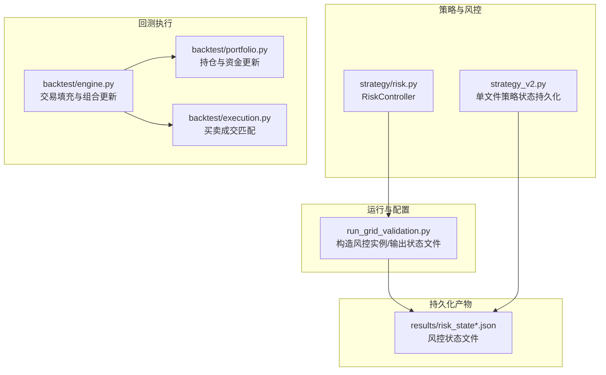
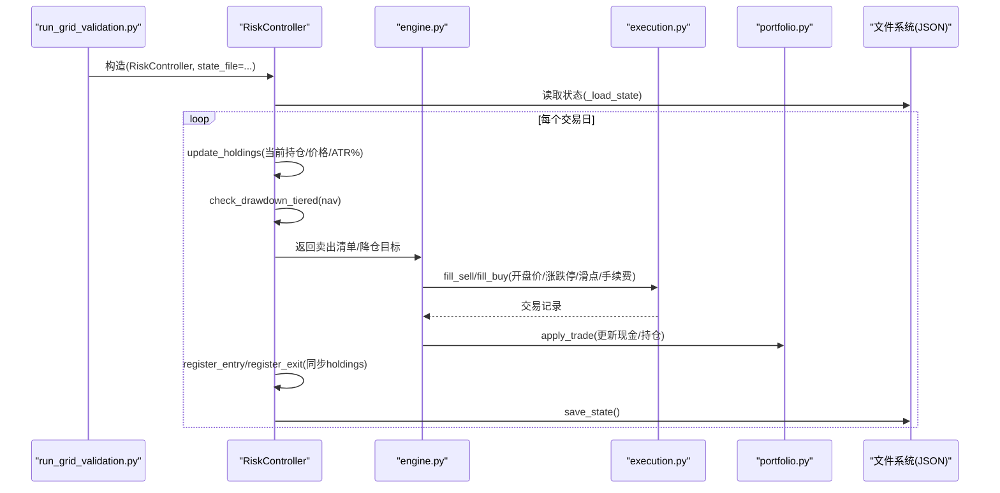
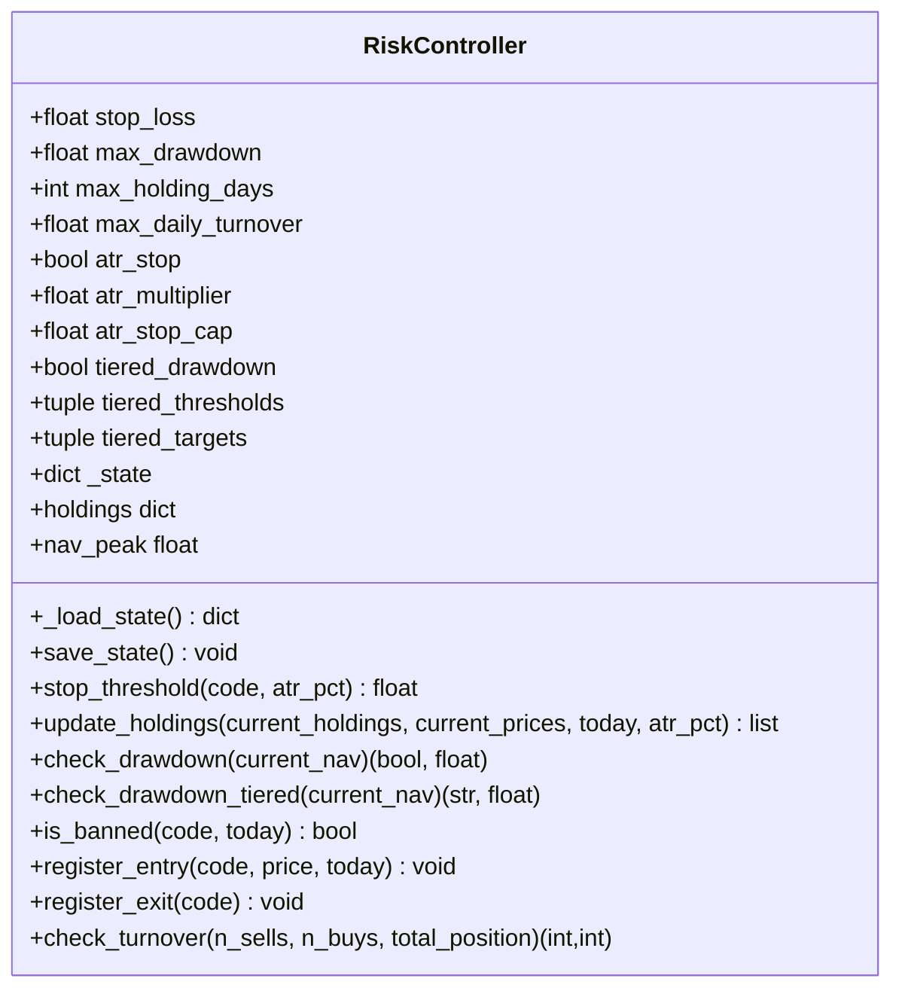
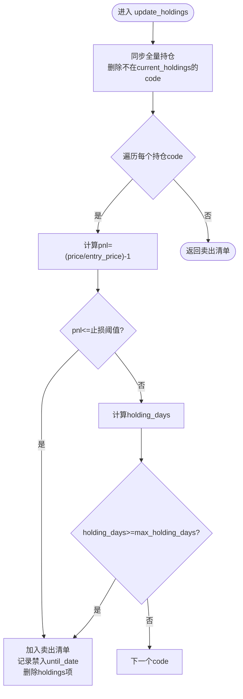
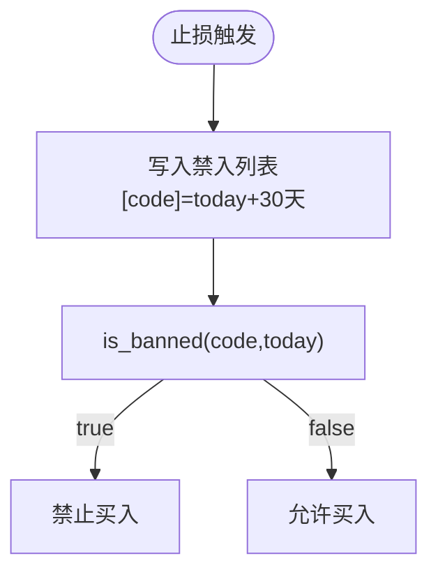
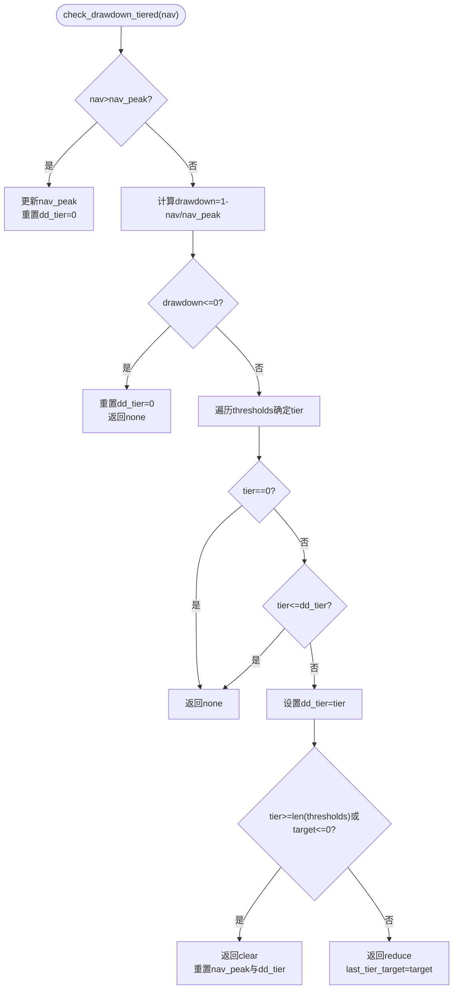
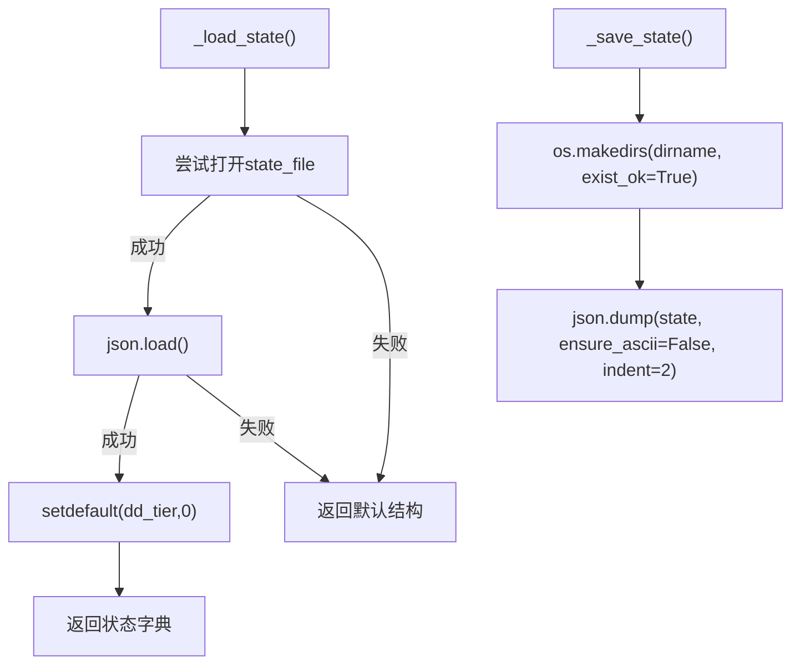
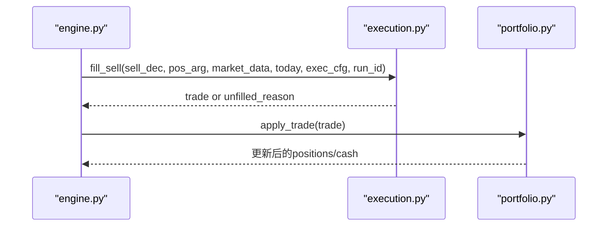
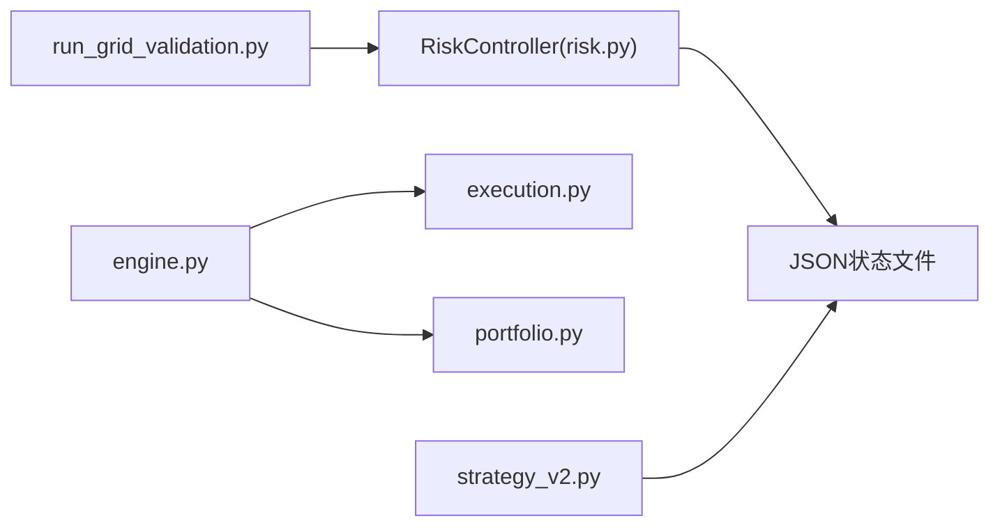

# 风控状态管理

<cite>
**本文引用的文件**   
- [risk.py](file://projects/Project_10_价值小盘V2/strategy/risk.py)
- [run_grid_validation.py](file://projects/Project_10_价值小盘V2/run_grid_validation.py)
- [risk_state.json](file://projects/Project_10_价值小盘V2/results/risk_state.json)
- [risk_state_baseline.json](file://projects/Project_10_价值小盘V2/results/risk_state_baseline.json)
- [engine.py](file://backtest/engine.py)
- [portfolio.py](file://backtest/portfolio.py)
- [execution.py](file://backtest/execution.py)
- [strategy_v2.py](file://projects/Project_10_价值小盘V2/strategy_v2.py)
- [miniQMT实盘对接_生产级完善方案.md](file://miniQMT实盘对接_生产级完善方案.md)
</cite>

## 目录
1. [引言](#引言)
2. [项目结构](#项目结构)
3. [核心组件](#核心组件)
4. [架构总览](#架构总览)
5. [详细组件分析](#详细组件分析)
6. [依赖关系分析](#依赖关系分析)
7. [性能考量](#性能考量)
8. [故障排查指南](#故障排查指南)
9. [结论](#结论)
10. [附录：状态文件格式与操作指南](#附录状态文件格式与操作指南)

## 引言
本文件系统性梳理 QuantLab 的风控状态管理机制，重点覆盖：
- 风控状态的持久化存储（JSON 格式、数据结构、读写流程）
- 持仓状态管理（买入登记、卖出登记、持有期跟踪）
- 禁入列表管理（触发条件、期限设置、自动恢复）
- 净值峰值跟踪与回撤计算（分层降仓与清仓逻辑）
- 状态文件的备份与恢复机制（异常处理、数据完整性）
- 最佳实践与故障排查方法
- 状态文件结构示例与实际操作指南

## 项目结构
与风控状态管理直接相关的代码与数据主要位于以下位置：
- 策略层风控模块：projects/Project_10_价值小盘V2/strategy/risk.py
- 网格验证入口（构造并调用风控对象、生成不同配置的状态文件）：projects/Project_10_价值小盘V2/run_grid_validation.py
- 回测执行引擎（交易填充、组合更新）：backtest/engine.py, backtest/portfolio.py, backtest/execution.py
- 单文件策略（含独立状态持久化实现）：projects/Project_10_价值小盘V2/strategy_v2.py
- miniQMT 实盘对接文档（Broker 状态持久化参考）：miniQMT实盘对接_生产级完善方案.md
- 结果目录中的风控状态 JSON 文件：projects/Project_10_价值小盘V2/results/risk_state*.json

图表来源
- [risk.py:1-195](file://projects/Project_10_价值小盘V2/strategy/risk.py#L1-L195)
- [run_grid_validation.py:166-185](file://projects/Project_10_价值小盘V2/run_grid_validation.py#L166-L185)
- [engine.py:328-353](file://backtest/engine.py#L328-L353)
- [portfolio.py:117-150](file://backtest/portfolio.py#L117-L150)
- [execution.py:95-203](file://backtest/execution.py#L95-L203)
- [strategy_v2.py:408-427](file://projects/Project_10_价值小盘V2/strategy_v2.py#L408-L427)

章节来源
- [risk.py:1-195](file://projects/Project_10_价值小盘V2/strategy/risk.py#L1-L195)
- [run_grid_validation.py:166-185](file://projects/Project_10_价值小盘V2/run_grid_validation.py#L166-L185)

## 核心组件
- RiskController：风控状态机核心类，负责止损、持有期、换手率限制、回撤控制（一刀切与分层）、禁入列表、净值峰值跟踪以及状态持久化。
- 回测执行链路：engine 驱动每日调仓与交易填充，portfolio 维护组合与持仓，execution 完成买卖匹配与费用滑点计算。
- 单文件策略：strategy_v2.py 提供独立的 JSON 状态持久化能力（cash、holdings、entry_prices/dates、nav_peak、当日委托等）。
- Broker 状态持久化（参考）：miniQMT 文档中给出订单与成交状态持久化的实现范式，可作为扩展风控状态持久化的参考。

章节来源
- [risk.py:15-61](file://projects/Project_10_价值小盘V2/strategy/risk.py#L15-L61)
- [engine.py:328-353](file://backtest/engine.py#L328-L353)
- [portfolio.py:117-150](file://backtest/portfolio.py#L117-L150)
- [execution.py:95-203](file://backtest/execution.py#L95-L203)
- [strategy_v2.py:408-427](file://projects/Project_10_价值小盘V2/strategy_v2.py#L408-L427)
- [miniQMT实盘对接_生产级完善方案.md:650-686](file://miniQMT实盘对接_生产级完善方案.md#L650-L686)

## 架构总览
风控状态管理的整体流程如下：
- 初始化阶段：RiskController 从 state_file 加载状态；若不存在则使用默认结构。
- 交易日循环：
  - 根据当前价格与持仓信息，调用 update_holdings 判断个股止损与持有期退出，生成卖出清单。
  - 调用 check_drawdown_tiered 或 check_drawdown 进行组合回撤检查，决定降仓或清仓动作。
  - 通过 register_entry/register_exit 同步买入/卖出登记到 holdings。
  - 定期调用 save_state 将 _state 写入 JSON 文件。
- 回测执行：engine 调用 execution.fill_buy/fill_sell 生成交易，portfolio.apply_trade 更新组合与持仓。
- 单文件策略：在 handlebar/init 中加载/保存全局状态，保证跨 bar 的连续性。

图表来源
- [run_grid_validation.py:166-185](file://projects/Project_10_价值小盘V2/run_grid_validation.py#L166-L185)
- [risk.py:74-110](file://projects/Project_10_价值小盘V2/strategy/risk.py#L74-L110)
- [risk.py:125-157](file://projects/Project_10_价值小盘V2/strategy/risk.py#L125-L157)
- [engine.py:328-353](file://backtest/engine.py#L328-L353)
- [execution.py:95-203](file://backtest/execution.py#L95-L203)
- [portfolio.py:117-150](file://backtest/portfolio.py#L117-L150)

## 详细组件分析

### RiskController：风控状态机
- 状态结构
  - holdings：code -> {entry_date, entry_price}
  - nav_peak：历史净值峰值
  - 禁入列表：code -> until_date（止损后禁入到期日）
  - dd_tier：已触发的回撤分层（用于防重触发）
- 关键方法
  - _load_state/save_state：JSON 读写，确保目录存在，异常时回退默认结构
  - stop_threshold：固定止损或 ATR 自适应止损（min(multiplier*ATR%, cap)）
  - update_holdings：同步全量持仓、止损判定、最长持有期退出
  - check_drawdown/check_drawdown_tiered：回撤阈值与分层降仓/清仓
  - is_banned/register_entry/register_exit：禁入检查与买卖登记
  - check_turnover：按最大日换手率对买卖数量进行缩放
- 复杂度与健壮性
  - 每日 O(N) 遍历持仓，N 为持仓数量
  - 读 JSON 失败时回退默认结构，避免崩溃
  - 写 JSON 前创建目录，减少 IO 错误

图表来源
- [risk.py:15-195](file://projects/Project_10_价值小盘V2/strategy/risk.py#L15-L195)

章节来源
- [risk.py:39-61](file://projects/Project_10_价值小盘V2/strategy/risk.py#L39-L61)
- [risk.py:62-73](file://projects/Project_10_价值小盘V2/strategy/risk.py#L62-L73)
- [risk.py:74-110](file://projects/Project_10_价值小盘V2/strategy/risk.py#L74-L110)
- [risk.py:112-157](file://projects/Project_10_价值小盘V2/strategy/risk.py#L112-L157)
- [risk.py:159-186](file://projects/Project_10_价值小盘V2/strategy/risk.py#L159-L186)

### 持仓状态管理（买入登记、卖出登记、持有期维护）
- 买入登记：register_entry(code, price, today) 记录 entry_date 与 entry_price
- 卖出登记：register_exit(code) 从 holdings 移除
- 持有期：update_holdings 中计算 holding_days = (today - entry_date).days，超过 max_holding_days 强制卖出
- 同步全量持仓：每次 update_holdings 会清理不在 current_holdings 中的 code，保持状态一致性

图表来源
- [risk.py:74-110](file://projects/Project_10_价值小盘V2/strategy/risk.py#L74-L110)

章节来源
- [risk.py:166-176](file://projects/Project_10_价值小盘V2/strategy/risk.py#L166-L176)
- [risk.py:74-110](file://projects/Project_10_价值小盘V2/strategy/risk.py#L74-L110)

### 禁入列表管理（股票禁入条件、期限设置、自动恢复）
- 触发条件：个股止损触发时，向“禁入列表”写入 until_date = today + timedelta(days=30)
- 禁入检查：is_banned(code, today) 比较 today 与 until_date，未到期则禁止买入
- 自动恢复：当 today > until_date 时，视为禁入期结束，不再阻止买入

图表来源
- [risk.py:96-102](file://projects/Project_10_价值小盘V2/strategy/risk.py#L96-L102)
- [risk.py:159-164](file://projects/Project_10_价值小盘V2/strategy/risk.py#L159-L164)

章节来源
- [risk.py:96-102](file://projects/Project_10_价值小盘V2/strategy/risk.py#L96-L102)
- [risk.py:159-164](file://projects/Project_10_价值小盘V2/strategy/risk.py#L159-L164)

### 净值峰值跟踪与回撤计算（分层降仓与清仓）
- 峰值更新：当 current_nav > nav_peak 时更新 nav_peak，并重置 dd_tier
- 回撤计算：drawdown = 1.0 - current_nav / nav_peak
- 分层阈值：tiered_thresholds 定义多级回撤阈值（如 10%/15%/20%），对应 targets（如 70%/40%/0%）
- 防重触发：dd_tier 记录已触发层级，仅在回撤加深到新层级时返回动作
- 清仓条件：达到最高层级或 target<=0 时返回 clear，同时重置 nav_peak 与 dd_tier

图表来源
- [risk.py:125-157](file://projects/Project_10_价值小盘V2/strategy/risk.py#L125-L157)

章节来源
- [risk.py:125-157](file://projects/Project_10_价值小盘V2/strategy/risk.py#L125-L157)

### 状态文件的备份与恢复机制（异常处理、数据完整性）
- 读取：_load_state 尝试打开 JSON，解析失败则忽略异常并返回默认结构；兼容旧字段（setdefault("dd_tier", 0)）
- 写入：save_state 先创建目录，再写入 JSON；ensure_ascii=False 保留中文键名
- 单文件策略：strategy_v2.py 的 _load_state/_save_state 提供类似的健壮读写（try/except 包裹）
- Broker 参考：miniQMT 文档中的 _save_state/_load_state 展示了订单与成交状态持久化范式，可用于扩展风控状态

图表来源
- [risk.py:39-61](file://projects/Project_10_价值小盘V2/strategy/risk.py#L39-L61)
- [strategy_v2.py:408-427](file://projects/Project_10_价值小盘V2/strategy_v2.py#L408-L427)
- [miniQMT实盘对接_生产级完善方案.md:650-686](file://miniQMT实盘对接_生产级完善方案.md#L650-L686)

章节来源
- [risk.py:39-61](file://projects/Project_10_价值小盘V2/strategy/risk.py#L39-L61)
- [strategy_v2.py:408-427](file://projects/Project_10_价值小盘V2/strategy_v2.py#L408-L427)
- [miniQMT实盘对接_生产级完善方案.md:650-686](file://miniQMT实盘对接_生产级完善方案.md#L650-L686)

### 回测执行与组合更新（与风控状态联动）
- engine 在 pending 卖出决策时，调用 fill_sell 匹配开盘价、涨跌停、滑点与手续费，成功后 portfolio.apply_trade 更新持仓与现金
- execution.fill_buy 同理，考虑涨停、无效价格、最小手数等约束
- 这些步骤与风控状态（holdings、禁入列表、回撤动作）共同决定最终交易行为

图表来源
- [engine.py:328-353](file://backtest/engine.py#L328-L353)
- [execution.py:95-203](file://backtest/execution.py#L95-L203)
- [portfolio.py:117-150](file://backtest/portfolio.py#L117-L150)

章节来源
- [engine.py:328-353](file://backtest/engine.py#L328-L353)
- [execution.py:95-203](file://backtest/execution.py#L95-L203)
- [portfolio.py:117-150](file://backtest/portfolio.py#L117-L150)

## 依赖关系分析
- RiskController 依赖 pandas 进行日期与时间处理，依赖 os/json 进行状态持久化
- run_grid_validation.py 构造 RiskController 实例并传入 state_file，生成不同的 risk_state*.json
- engine/portfolio/execution 构成回测执行链，与风控状态协同工作
- strategy_v2.py 提供独立的状态持久化实现，可作为风控状态持久化的补充参考

图表来源
- [run_grid_validation.py:166-185](file://projects/Project_10_价值小盘V2/run_grid_validation.py#L166-L185)
- [risk.py:1-195](file://projects/Project_10_价值小盘V2/strategy/risk.py#L1-L195)
- [engine.py:328-353](file://backtest/engine.py#L328-L353)
- [execution.py:95-203](file://backtest/execution.py#L95-L203)
- [portfolio.py:117-150](file://backtest/portfolio.py#L117-L150)
- [strategy_v2.py:408-427](file://projects/Project_10_价值小盘V2/strategy_v2.py#L408-L427)

章节来源
- [run_grid_validation.py:166-185](file://projects/Project_10_价值小盘V2/run_grid_validation.py#L166-L185)
- [risk.py:1-195](file://projects/Project_10_价值小盘V2/strategy/risk.py#L1-L195)

## 性能考量
- 每日 O(N) 遍历持仓，N 为持仓数量；建议控制持仓规模与频率
- JSON 读写开销较小，但频繁写入可能影响 I/O；建议在关键节点（如收盘、重大事件）集中保存
- ATR 自适应止损需要额外计算 atr_pct，建议缓存或批量计算以减少重复计算
- 分层回撤检查为 O(T)，T 为阈值数量，通常很小，可忽略

[本节为通用指导，不直接分析具体文件]

## 故障排查指南
- 状态文件无法加载
  - 现象：程序启动时报错或回退默认状态
  - 排查：检查 state_file 路径是否存在、权限是否足够、JSON 是否损坏
  - 解决：修复 JSON 或重新生成；确认 _load_state 的 try/except 捕获了异常
- 禁入列表未生效
  - 现象：止损后仍可买入该股票
  - 排查：确认 is_banned 比较逻辑是否正确（日期格式与时区）
  - 解决：校验 until_date 与 today 的比较，确保日期字符串一致
- 回撤分层未触发
  - 现象：达到阈值但未降仓或清仓
  - 排查：检查 dd_tier 是否被误置导致重复跳过；确认 thresholds/targets 配置
  - 解决：重置 dd_tier 或修正阈值配置
- 持仓不一致
  - 现象：holdings 与实际组合不一致
  - 排查：确认 register_entry/register_exit 是否在交易完成后调用；检查 engine 与 portfolio 的 apply_trade 逻辑
  - 解决：对齐交易与登记顺序，必要时增加对账逻辑

章节来源
- [risk.py:39-61](file://projects/Project_10_价值小盘V2/strategy/risk.py#L39-L61)
- [risk.py:159-164](file://projects/Project_10_价值小盘V2/strategy/risk.py#L159-L164)
- [risk.py:125-157](file://projects/Project_10_价值小盘V2/strategy/risk.py#L125-L157)
- [engine.py:328-353](file://backtest/engine.py#L328-L353)
- [portfolio.py:117-150](file://backtest/portfolio.py#L117-L150)

## 结论
QuantLab 的风控状态管理以 RiskController 为核心，结合 JSON 持久化与回测执行链路，实现了稳健的止损、持有期、换手率与回撤控制。通过分层回撤与禁入列表，系统在极端行情下具备更强的风险控制能力。状态文件的健壮读写与清晰的职责划分，使得系统易于扩展与维护。

[本节为总结，不直接分析具体文件]

## 附录：状态文件格式与操作指南

### 风控状态 JSON 结构示例
- 顶层字段
  - holdings：code -> {entry_date, entry_price}
  - nav_peak：数值型，历史净值峰值
  - 禁入列表：code -> until_date（YYYY-MM-DD）
  - dd_tier：整数，已触发的回撤分层（0 表示未触发）
- 示例文件
  - risk_state.json：包含大量持仓与禁入列表条目
  - risk_state_baseline.json：基线配置下的状态快照

章节来源
- [risk_state.json:1-773](file://projects/Project_10_价值小盘V2/results/risk_state.json#L1-L773)
- [risk_state_baseline.json:1-200](file://projects/Project_10_价值小盘V2/results/risk_state_baseline.json#L1-L200)

### 实际操作指南
- 初始化与加载
  - 构造 RiskController 时传入 state_file 路径
  - 首次运行若无状态文件，将使用默认结构
- 交易日更新
  - 在每个交易日结束后调用 save_state 持久化
  - 在策略或回测循环中调用 update_holdings/check_drawdown_tiered 更新状态
- 备份与恢复
  - 备份：复制 results/risk_state*.json 到安全位置
  - 恢复：将备份文件放回原路径，重启程序即可加载
- 调试与验证
  - 使用 run_grid_validation.py 生成不同配置的状态文件（grid_state_*.json）
  - 对比不同配置下的风险指标与状态差异

章节来源
- [run_grid_validation.py:166-185](file://projects/Project_10_价值小盘V2/run_grid_validation.py#L166-L185)
- [risk.py:39-61](file://projects/Project_10_价值小盘V2/strategy/risk.py#L39-L61)