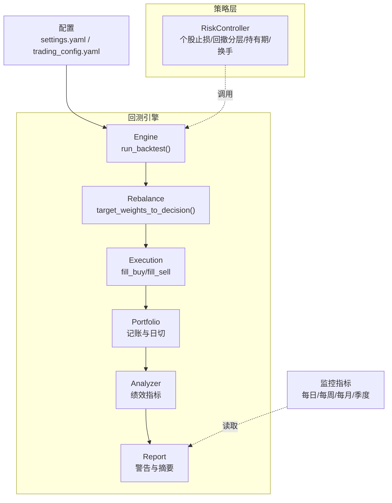
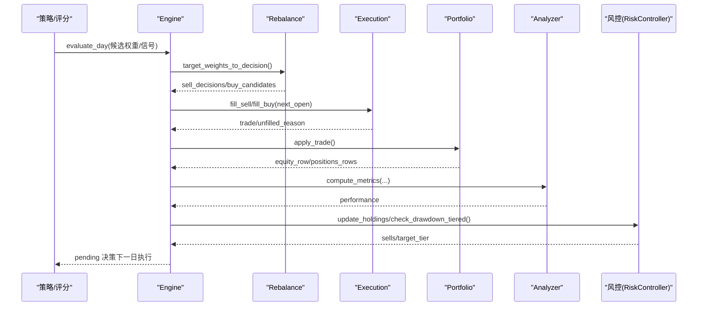
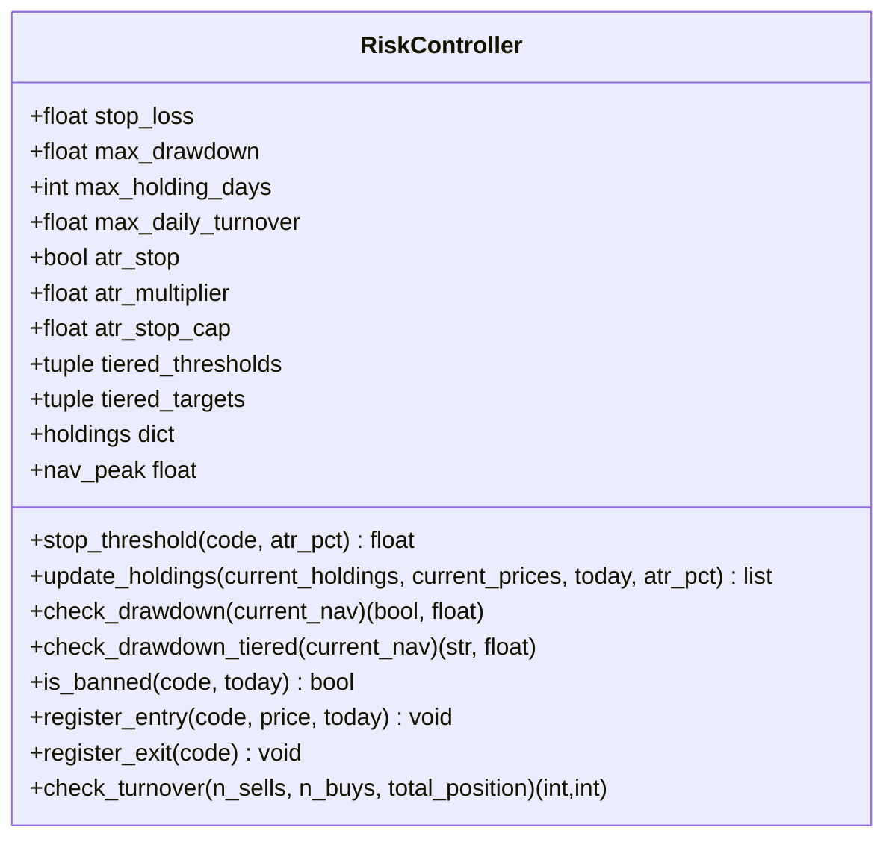
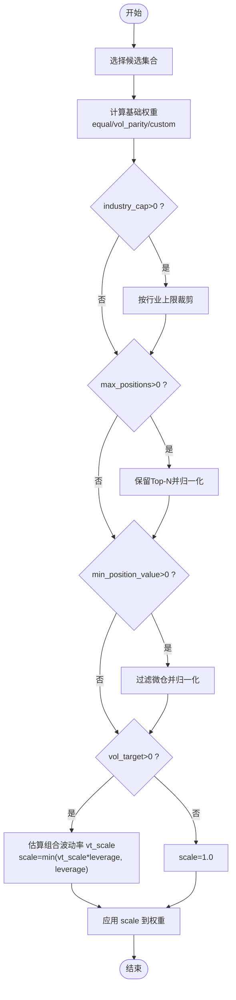
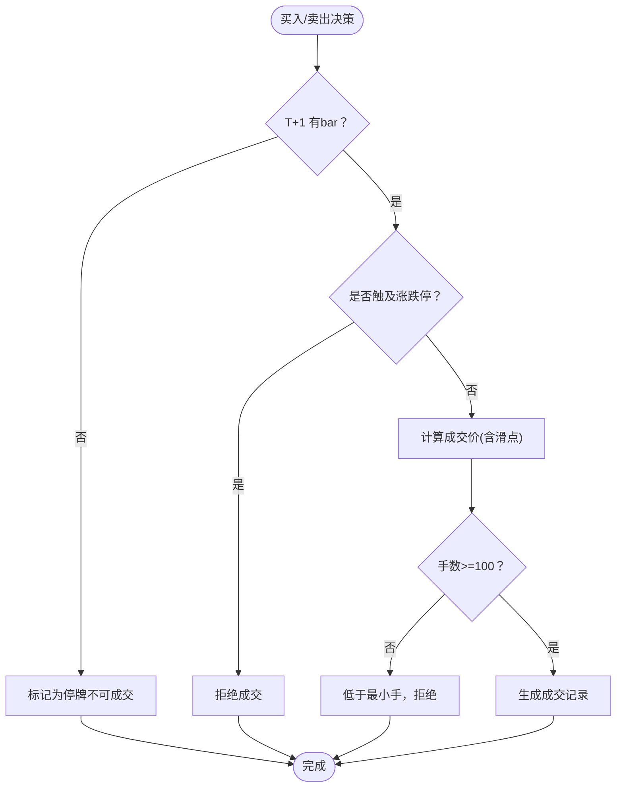
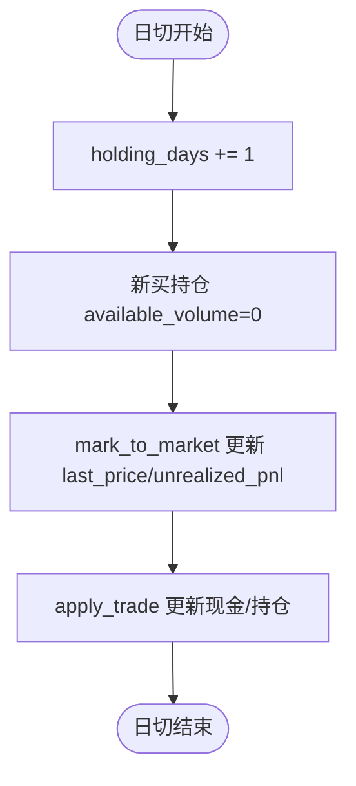
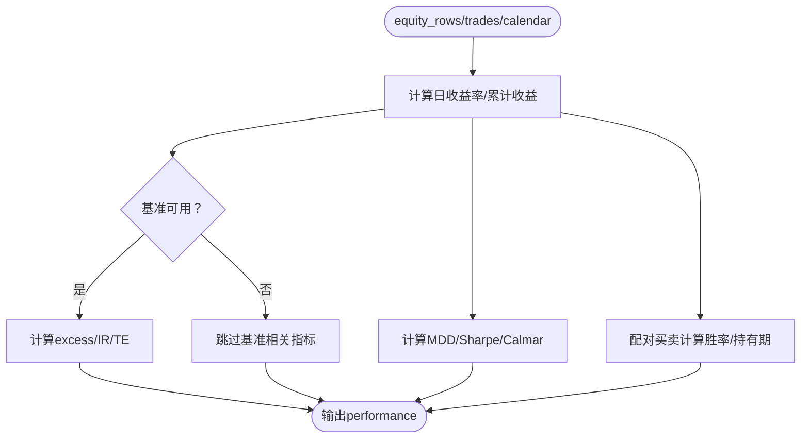
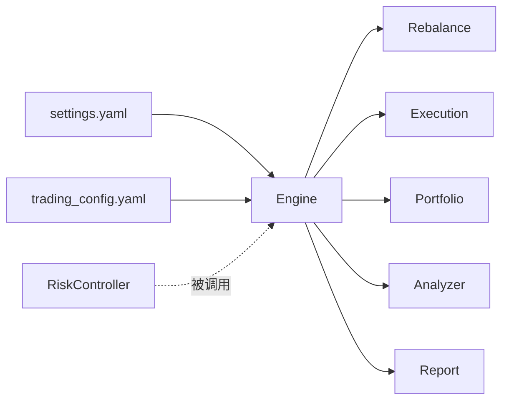

# 风险控制机制

<cite>
**本文引用的文件**   
- [risk.py](file://projects/Project_10_价值小盘V2/strategy/risk.py)
- [engine.py](file://backtest/engine.py)
- [portfolio.py](file://backtest/portfolio.py)
- [execution.py](file://backtest/execution.py)
- [rebalance.py](file://backtest/rebalance.py)
- [analyzer.py](file://backtest/analyzer.py)
- [report.py](file://backtest/report.py)
- [settings.yaml](file://config/settings.yaml)
- [trading_config.yaml](file://config/trading_config.yaml)
- [monitoring_indicators.md](file://projects/verification/results/monitoring_indicators.md)
- [risk_state.json](file://projects/Project_10_价值小盘V2/results/risk_state.json)
</cite>

## 目录
1. [引言](#引言)
2. [项目结构](#项目结构)
3. [核心组件](#核心组件)
4. [架构总览](#架构总览)
5. [详细组件分析](#详细组件分析)
6. [依赖关系分析](#依赖关系分析)
7. [性能与容量考量](#性能与容量考量)
8. [故障排查指南](#故障排查指南)
9. [结论](#结论)
10. [附录：参数调优与回测验证流程](#附录参数调优与回测验证流程)

## 引言
本文件面向 QuantLab 的风控体系，系统化阐述“事前风控、事中监控、事后分析”的完整闭环。重点覆盖：
- 多层次风控设计：个股止损、组合回撤分层降仓、持有期与换手限制
- 仓位控制算法：单票上限、行业集中度、总仓位与波动率目标
- 止损止盈机制：固定比例止损、ATR 自适应止损、时间止损（持有期）
- 异常检测与自动熔断：涨跌停/停牌处理、系统异常、市场异常、策略异常
- 实时监控指标与告警：净值、回撤、持仓集中度、流动性、换手率等
- 参数调优与历史回测验证方法，以及实际案例与效果评估

## 项目结构
QuantLab 的风控能力由“策略层风控 + 回测引擎执行约束 + 组合记账 + 指标计算 + 报告输出”共同构成。关键路径如下：
- 策略层风控：RiskController 负责个股止损、组合回撤分层降仓、持有期与换手限制
- 回测引擎：engine.py 串联数据、策略、执行、组合与指标
- 执行层：execution.py 实现涨跌停/停牌拦截、滑点与手续费、T+1 可用规则
- 组合记账：portfolio.py 维护现金、市值、持仓成本与未实现盈亏
- 指标与报告：analyzer.py 计算收益/回撤/夏普等；report.py 生成警告块
- 配置：settings.yaml 与 trading_config.yaml 提供全局与实盘风控参数

**图表来源** 
- [engine.py:237-619](file://backtest/engine.py#L237-L619)
- [rebalance.py:114-195](file://backtest/rebalance.py#L114-L195)
- [execution.py:95-204](file://backtest/execution.py#L95-L204)
- [portfolio.py:38-189](file://backtest/portfolio.py#L38-L189)
- [analyzer.py:96-176](file://backtest/analyzer.py#L96-L176)
- [report.py:78-108](file://backtest/report.py#L78-L108)
- [settings.yaml:1-69](file://config/settings.yaml#L1-L69)
- [trading_config.yaml:1-62](file://config/trading_config.yaml#L1-L62)

**章节来源**
- [engine.py:237-619](file://backtest/engine.py#L237-L619)
- [rebalance.py:114-195](file://backtest/rebalance.py#L114-L195)
- [execution.py:95-204](file://backtest/execution.py#L95-L204)
- [portfolio.py:38-189](file://backtest/portfolio.py#L38-L189)
- [analyzer.py:96-176](file://backtest/analyzer.py#L96-L176)
- [report.py:78-108](file://backtest/report.py#L78-L108)
- [settings.yaml:1-69](file://config/settings.yaml#L1-L69)
- [trading_config.yaml:1-62](file://config/trading_config.yaml#L1-L62)

## 核心组件
- RiskController：实现个股止损（固定或 ATR 自适应）、组合回撤分层降仓、最长持有期、单日换手限制，并持久化状态（禁入列表、净值峰值、已触发层级）。
- Engine：编排回测主循环，注入基准、执行交易、更新组合、聚合诊断与指标。
- Execution：按 next_open 模型成交，内置涨跌停/停牌拦截、滑点、佣金印花税、最小手约束与 T+1 可用。
- Portfolio：记录现金、市值、持仓成本、未实现盈亏与持股天数，支持日切与 T+1 解冻。
- Analyzer：计算总收益、年化、最大回撤、夏普、Calmar、胜率、平均持有期、超额与信息比率、跟踪误差。
- Report：汇总样本期、基准可用性、数据去重、WAL 同步等警告信息。
- 配置：settings.yaml 定义回测与因子预处理；trading_config.yaml 定义实盘风控阈值与调度。

**章节来源**
- [risk.py:15-195](file://projects/Project_10_价值小盘V2/strategy/risk.py#L15-L195)
- [engine.py:237-619](file://backtest/engine.py#L237-L619)
- [execution.py:95-204](file://backtest/execution.py#L95-L204)
- [portfolio.py:38-189](file://backtest/portfolio.py#L38-L189)
- [analyzer.py:96-176](file://backtest/analyzer.py#L96-L176)
- [report.py:78-108](file://backtest/report.py#L78-L108)
- [settings.yaml:1-69](file://config/settings.yaml#L1-L69)
- [trading_config.yaml:1-62](file://config/trading_config.yaml#L1-L62)

## 架构总览
下图展示从信号到成交、风控干预与指标输出的端到端流程。

**图表来源** 
- [engine.py:324-443](file://backtest/engine.py#L324-L443)
- [rebalance.py:114-195](file://backtest/rebalance.py#L114-L195)
- [execution.py:95-204](file://backtest/execution.py#L95-L204)
- [portfolio.py:103-189](file://backtest/portfolio.py#L103-L189)
- [analyzer.py:96-176](file://backtest/analyzer.py#L96-L176)
- [risk.py:74-157](file://projects/Project_10_价值小盘V2/strategy/risk.py#L74-L157)

## 详细组件分析

### 风险控制器 RiskController（个股止损/组合回撤分层/持有期/换手）
- 个股止损阈值：固定 stop_loss 或 ATR 自适应（multiplier * ATR% 且不超过 cap）
- 组合回撤分层：阈值序列与目标仓位序列，带状态防重复触发；创新高重置层级
- 持有期限制：超过 max_holding_days 强制卖出
- 换手限制：按 (n_sells + n_buys)/total_position 缩放可操作数量
- 状态持久化：holdings、nav_peak、禁入列表、dd_tier

**图表来源** 
- [risk.py:15-195](file://projects/Project_10_价值小盘V2/strategy/risk.py#L15-L195)

**章节来源**
- [risk.py:15-195](file://projects/Project_10_价值小盘V2/strategy/risk.py#L15-L195)
- [risk_state.json:1-773](file://projects/Project_10_价值小盘V2/results/risk_state.json#L1-L773)

### 仓位控制与再平衡（单票上限/行业集中度/总仓位/波动率目标）
- 基础权重：等权、vol_parity、custom
- 行业集中度：industry_cap > 0 时裁剪暴露
- 最大持仓数：max_positions 保留 top-N 并归一化
- 最小头寸价值：min_position_value 过滤微仓
- 波动率目标与杠杆：vt_scale = vol_target / est_vol，scale = min(vt_scale * target_leverage, target_leverage)，确保 gross 不超过 target_leverage

**图表来源** 
- [rebalance.py:114-195](file://backtest/rebalance.py#L114-L195)

**章节来源**
- [rebalance.py:114-195](file://backtest/rebalance.py#L114-L195)

### 执行与交易约束（涨跌停/停牌/T+1/滑点与费用）
- next_open 模型：T+1 开盘价成交
- 涨跌停拦截：根据板块规则（主板/双创/北交/ST）判断 open_pct 是否触及
- 停牌处理：无 bar 则不成交
- 最小手：按 100 股向下取整
- 滑点与费用：slippage、commission_rate、tax_rate

**图表来源** 
- [execution.py:95-204](file://backtest/execution.py#L95-L204)

**章节来源**
- [execution.py:95-204](file://backtest/execution.py#L95-L204)

### 组合记账与日切（T+1 可用、未实现盈亏、持股天数）
- mark_to_market：按当日收盘价更新 last_price 与 unrealized_pnl
- advance_holding_days：每日递增 holding_days，解冻 available_volume
- apply_trade：买入锁定新仓（available_volume=0），卖出扣减可用量

**图表来源** 
- [portfolio.py:76-151](file://backtest/portfolio.py#L76-L151)

**章节来源**
- [portfolio.py:38-189](file://backtest/portfolio.py#L38-L189)

### 绩效与风控指标（收益/回撤/夏普/胜率/基准对比）
- 收益与风险：总收益、年化、最大回撤、夏普、Calmar
- 交易统计：买卖次数、胜率、平均持有期
- 基准对比：超额收益、信息比率、跟踪误差（需基准可用）

**图表来源** 
- [analyzer.py:96-176](file://backtest/analyzer.py#L96-L176)

**章节来源**
- [analyzer.py:96-176](file://backtest/analyzer.py#L96-L176)

### 监控指标与告警（每日/每周/每月/季度）
- 每日：净值与日收益（单日跌幅>3%预警）、回撤（>10%/15%/20%分级处置）、持仓集中度（单股>5%预警）、行业集中度（>25%预警）
- 每周：换手率（周换手>30%预警）、信号质量（ROE/负债率阈值）
- 每月：业绩归因（连续跑输基准评估）
- 季度：策略有效性（信息比率/胜率阈值）
- 风控回顾：止损/止盈次数、最大单笔亏损（>10%检查参数）

**章节来源**
- [monitoring_indicators.md:1-69](file://projects/verification/results/monitoring_indicators.md#L1-L69)

### 配置与参数（全局与实盘）
- settings.yaml：回测起止、初始资金、佣金/滑点、基准、因子中性化/标准化等
- trading_config.yaml：实盘账户、单股/总仓位上限、止损/回撤/持有期/换手阈值、委托超时/重试、调度与通知

**章节来源**
- [settings.yaml:1-69](file://config/settings.yaml#L1-L69)
- [trading_config.yaml:1-62](file://config/trading_config.yaml#L1-L62)

## 依赖关系分析
- Engine 依赖 Rebalance、Execution、Portfolio、Analyzer、Report
- RiskController 独立于执行层，通过接口在 Engine 循环中调用
- 配置驱动行为：settings.yaml 影响回测与因子；trading_config.yaml 驱动实盘风控与调度

**图表来源** 
- [engine.py:237-619](file://backtest/engine.py#L237-L619)
- [settings.yaml:1-69](file://config/settings.yaml#L1-L69)
- [trading_config.yaml:1-62](file://config/trading_config.yaml#L1-L62)

**章节来源**
- [engine.py:237-619](file://backtest/engine.py#L237-L619)

## 性能与容量考量
- 波动率目标与杠杆：通过 vt_scale 动态调节敞口，避免杠杆被静默压制
- 行业集中度与最小头寸：降低尾部风险与无效交易
- 换手限制：控制冲击成本与过度交易
- 基准缺失与 WAL 同步：报告层给出明确警告，提示数据可用性

[本节为通用指导，无需代码引用]

## 故障排查指南
- 涨跌停/停牌导致无法成交：检查 execution 的 limit_up_at_open/limit_down_at_open/suspended 原因
- T+1 可用问题：确认 advance_holding_days 调用时机与 available_volume 更新
- 基准不可用：查看 report 的 BENCHMARK_DISABLED 与 data_wal_detected 警告
- 短样本期：sample_period_warning 提示样本不足，谨慎解读结果

**章节来源**
- [execution.py:95-204](file://backtest/execution.py#L95-L204)
- [portfolio.py:90-151](file://backtest/portfolio.py#L90-L151)
- [report.py:78-108](file://backtest/report.py#L78-L108)
- [engine.py:479-522](file://backtest/engine.py#L479-L522)

## 结论
QuantLab 的风控体系以 RiskController 为核心，结合回测引擎的执行约束与组合记账，形成“事前风控—事中监控—事后分析”的闭环。通过 ATR 自适应止损、分层回撤降仓、行业集中度与波动率目标等多维手段，有效抑制极端风险与过度暴露；配合完善的监控指标与告警机制，保障策略稳健运行。

[本节为总结性内容，无需代码引用]

## 附录：参数调优与回测验证流程
- 参数范围建议
  - 止损阈值：固定 5%-10%，ATR 倍数 1.5-3.0，cap 8%-12%
  - 回撤分层：阈值 10%/15%/20%，目标仓位 70%/40%/0%
  - 行业集中度：15%-25%
  - 波动率目标：0.08-0.15，杠杆上限 1.0-1.5
  - 换手限制：0.20-0.40
- 回测验证步骤
  - 使用 engine.run_backtest 生成 equity/trades/performance
  - 观察 analyzer 指标与 report 警告
  - 调整 risk.py 参数后复跑，对比 MDD、夏普、胜率、换手
  - 校验 trading_config.yaml 与 settings.yaml 的一致性
- 实际案例参考
  - 监控指标文档定义了多级阈值与处置动作，可作为生产监控基线
  - risk_state.json 展示了持仓与禁入列表的状态结构，便于定位风控触发点

**章节来源**
- [analyzer.py:96-176](file://backtest/analyzer.py#L96-L176)
- [report.py:78-108](file://backtest/report.py#L78-L108)
- [monitoring_indicators.md:1-69](file://projects/verification/results/monitoring_indicators.md#L1-L69)
- [risk_state.json:1-773](file://projects/Project_10_价值小盘V2/results/risk_state.json#L1-L773)
- [trading_config.yaml:1-62](file://config/trading_config.yaml#L1-L62)
- [settings.yaml:1-69](file://config/settings.yaml#L1-L69)