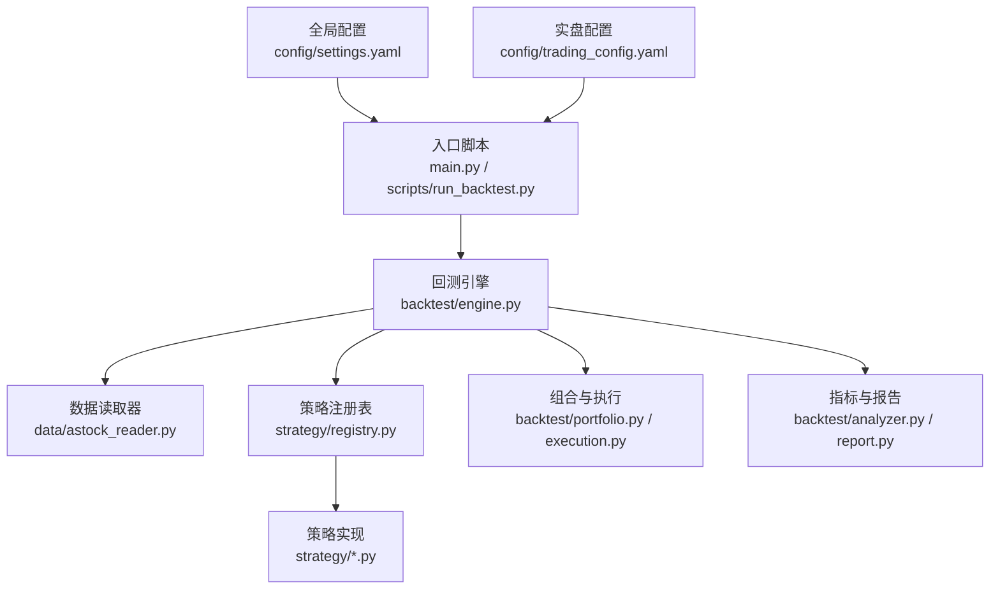
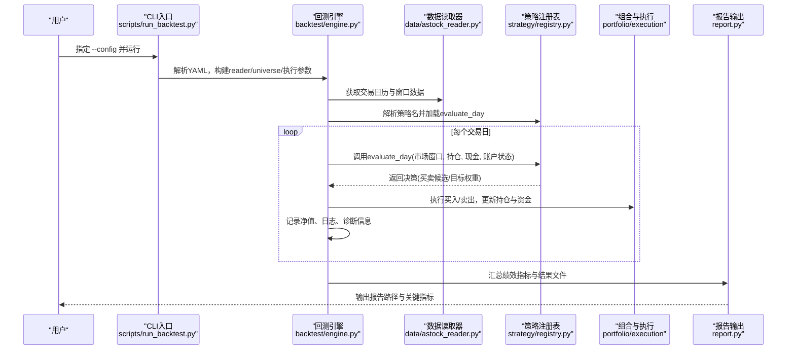
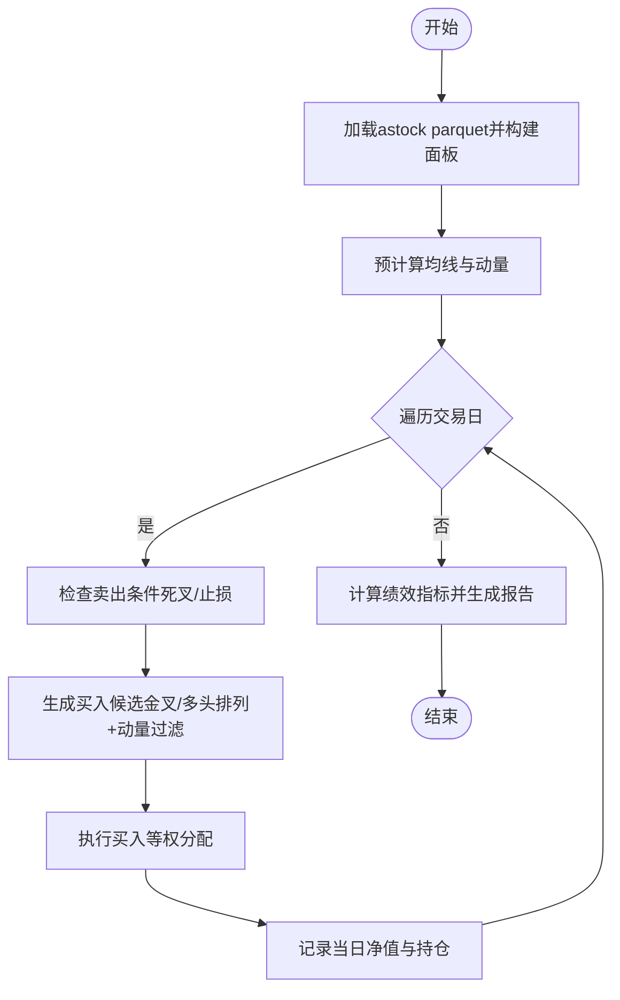
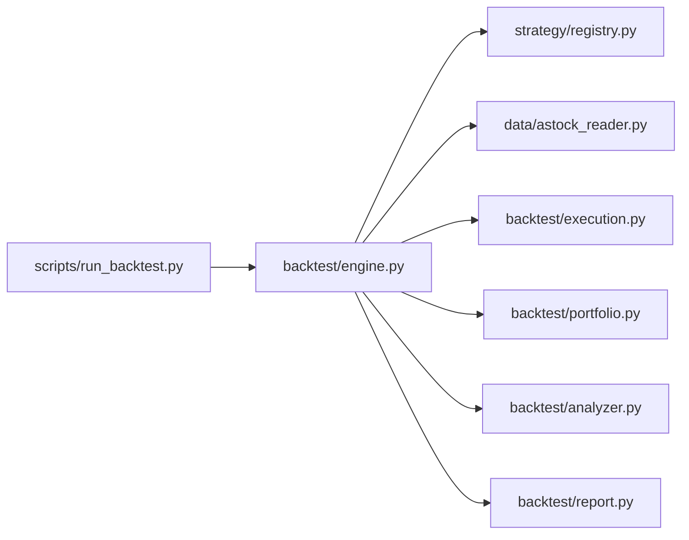

# 快速开始

<cite>
**本文引用的文件**   
- [main.py](file://main.py)
- [requirements.txt](file://requirements.txt)
- [setup.py](file://setup.py)
- [config/settings.yaml](file://config/settings.yaml)
- [config/trading_config.yaml](file://config/trading_config.yaml)
- [scripts/run_backtest.py](file://scripts/run_backtest.py)
- [backtest/engine.py](file://backtest/engine.py)
- [strategy/registry.py](file://strategy/registry.py)
- [data/astock_reader.py](file://data/astock_reader.py)
- [factors/base.py](file://factors/base.py)
- [projects/Project_02_双均线趋势策略/run_backtest.py](file://projects/Project_02_双均线趋势策略/run_backtest.py)
- [projects/Project_02_双均线趋势策略/strategy/dual_ma.py](file://projects/Project_02_双均线趋势策略/strategy/dual_ma.py)
- [config/atr_lowvol_fw.yaml](file://config/atr_lowvol_fw.yaml)
- [scripts/update_data.py](file://scripts/update_data.py)
</cite>

## 目录
1. [简介](#简介)
2. [项目结构](#项目结构)
3. [核心组件](#核心组件)
4. [架构总览](#架构总览)
5. [详细组件分析](#详细组件分析)
6. [依赖关系分析](#依赖关系分析)
7. [性能注意事项](#性能注意事项)
8. [故障排除指南](#故障排除指南)
9. [结论](#结论)
10. [附录](#附录)

## 简介
本指南面向量化交易新手，帮助你在最短时间内完成 QuantLab 的环境搭建与首次回测。你将了解：
- 系统要求与环境配置（Python、依赖库、数据源）
- 配置文件结构与关键项（settings.yaml、trading_config.yaml）
- 运行第一个回测、开发简单策略、计算因子
- 常见问题与排错建议

## 项目结构
QuantLab 采用“模块化 + 扁平注册”的架构：
- backtest：回测引擎、执行、组合、报告等
- strategy：策略注册与实现
- data：数据读取（astock parquet、基准指数等）
- factors：因子基类与常用因子
- config：全局与实盘配置
- projects：示例项目（如双均线策略）
- scripts：命令行工具（回测、数据更新等）

图表来源
- [main.py:1-104](file://main.py#L1-L104)
- [scripts/run_backtest.py:1-132](file://scripts/run_backtest.py#L1-L132)
- [backtest/engine.py:1-619](file://backtest/engine.py#L1-L619)
- [strategy/registry.py:1-115](file://strategy/registry.py#L1-L115)
- [data/astock_reader.py:1-192](file://data/astock_reader.py#L1-L192)

章节来源
- [main.py:1-104](file://main.py#L1-L104)
- [scripts/run_backtest.py:1-132](file://scripts/run_backtest.py#L1-L132)

## 核心组件
- 回测引擎：负责加载数据、按交易日驱动策略、执行委托、记录净值与交易明细、汇总绩效指标
- 策略注册：通过装饰器将 evaluate_day 函数注册到 registry，支持自动发现与命名空间隔离
- 数据读取：astock parquet 只读读取器，提供窗口切片、日历、覆盖度、收盘价访问
- 因子基类：提供截尾、标准化、排序等通用预处理方法，便于扩展自定义因子
- 配置管理：settings.yaml 控制全局参数；trading_config.yaml 控制实盘账号、风控、调度等

章节来源
- [backtest/engine.py:237-619](file://backtest/engine.py#L237-L619)
- [strategy/registry.py:1-115](file://strategy/registry.py#L1-L115)
- [data/astock_reader.py:25-192](file://data/astock_reader.py#L25-L192)
- [factors/base.py:1-52](file://factors/base.py#L1-L52)

## 架构总览
下图展示了从入口脚本到回测引擎、数据读取、策略执行、组合管理与报告输出的完整流程。

图表来源
- [scripts/run_backtest.py:42-127](file://scripts/run_backtest.py#L42-L127)
- [backtest/engine.py:237-619](file://backtest/engine.py#L237-L619)
- [strategy/registry.py:24-44](file://strategy/registry.py#L24-L44)
- [data/astock_reader.py:71-126](file://data/astock_reader.py#L71-L126)

## 详细组件分析

### 环境搭建与依赖安装
- Python 版本：建议使用 Python 3.9+（pandas>=2.0、numpy>=1.24 的要求）
- 必要依赖：pandas、numpy、pyyaml、scipy、lightgbm（可选）、xtquant（仅实盘需要）
- 虚拟环境创建与依赖安装步骤：
  - 创建虚拟环境并激活
  - 安装核心依赖：pip install -r requirements.txt
  - 若需 QMT 实盘，运行 setup.py 以复制 xtquant 并验证导入
  - 准备 astock 数据（parquet），可通过 scripts/update_data.py 增量更新

章节来源
- [requirements.txt:1-29](file://requirements.txt#L1-L29)
- [setup.py:1-82](file://setup.py#L1-L82)
- [scripts/update_data.py:1-135](file://scripts/update_data.py#L1-L135)

### 配置文件结构
- settings.yaml（全局配置）
  - project：项目名称、版本、根路径
  - data：数据源类型与路径（astock daily/finance/basic）、缓存开关与过期天数
  - backtest：回测起止日期、初始资金、佣金、滑点、基准代码
  - logging：日志级别与目录
  - factors：因子预处理（中性化、标准化、缩尾）与方法选择
  - strategy：默认股票池与市值区间
  - trading：指向 trading_config.yaml，默认关闭实盘
- trading_config.yaml（实盘配置）
  - account：QMT账号、路径、会话ID
  - trading：初始资金、仓位上限、佣金、印花税、滑点
  - risk：止损比例、最大回撤、最长持有天数、单日最大换手
  - order：委托超时、重试次数、价格容差、未成交撤单
  - schedule：盘前、开盘、午后检查、风控间隔、尾盘处理
  - data：主数据源与路径、缓存目录
  - strategy：策略名称、股票池、选股数量、调仓频率、因子权重

章节来源
- [config/settings.yaml:1-69](file://config/settings.yaml#L1-L69)
- [config/trading_config.yaml:1-59](file://config/trading_config.yaml#L1-L59)

### 运行第一个回测
- 使用框架原生 CLI（推荐）：
  - 准备 atr_lowvol_fw.yaml（包含 backtest/data/universe/execution/strategy_params）
  - 运行 python -m scripts.run_backtest --config config/atr_lowvol_fw.yaml
  - 查看 reports 目录下生成的 equity_curve.csv、trades.csv、summary.json、report.md
- 使用 main.py（示例 Project_01）：
  - 运行 python main.py --strategy project_01
  - 该入口会加载 Project_01 的策略评分与数据面板，并调用 research.multi_factor_ic.backtest 进行回测

章节来源
- [scripts/run_backtest.py:42-127](file://scripts/run_backtest.py#L42-L127)
- [config/atr_lowvol_fw.yaml:1-49](file://config/atr_lowvol_fw.yaml#L1-L49)
- [main.py:28-93](file://main.py#L28-L93)

### 开发简单策略（双均线趋势策略）
- 策略逻辑要点：
  - 预计算短期与长期均线，生成金叉/死叉信号
  - 动量过滤避免暴涨股
  - 每日根据信号选择候选股，执行等权买入
  - 死叉或触发止损时卖出
- 回测脚本：
  - 读取 astock parquet，构建面板，过滤 ST/停牌
  - 遍历交易日，执行买卖与止损，记录净值与交易明细
  - 输出 HTML 报告与 CSV 文件

图表来源
- [projects/Project_02_双均线趋势策略/run_backtest.py:60-235](file://projects/Project_02_双均线趋势策略/run_backtest.py#L60-L235)
- [projects/Project_02_双均线趋势策略/strategy/dual_ma.py:20-93](file://projects/Project_02_双均线趋势策略/strategy/dual_ma.py#L20-L93)

章节来源
- [projects/Project_02_双均线趋势策略/run_backtest.py:1-417](file://projects/Project_02_双均线趋势策略/run_backtest.py#L1-L417)
- [projects/Project_02_双均线趋势策略/strategy/dual_ma.py:1-93](file://projects/Project_02_双均线趋势策略/strategy/dual_ma.py#L1-L93)

### 因子计算与预处理
- 因子基类 FactorBase：
  - compute(panel, fin_ffill, **kwargs)：子类实现具体计算
  - winsorize/zscore/rank_normalize：通用预处理方法
- 使用建议：
  - 在 panel 上按时间序列滚动计算，确保无未来函数
  - 对横截面进行标准化与缩尾，提升稳定性
  - 结合财务数据（fin_ffill）做基本面因子

章节来源
- [factors/base.py:1-52](file://factors/base.py#L1-L52)

## 依赖关系分析
- 入口脚本依赖回测引擎与数据读取器
- 回测引擎依赖策略注册表、执行模块、组合模块、指标与报告
- 数据读取器为只读接口，屏蔽底层存储差异（parquet/DuckDB）
- 策略通过装饰器注册，避免硬编码耦合

图表来源
- [scripts/run_backtest.py:1-132](file://scripts/run_backtest.py#L1-L132)
- [backtest/engine.py:1-619](file://backtest/engine.py#L1-L619)
- [strategy/registry.py:1-115](file://strategy/registry.py#L1-L115)
- [data/astock_reader.py:1-192](file://data/astock_reader.py#L1-L192)

章节来源
- [scripts/run_backtest.py:1-132](file://scripts/run_backtest.py#L1-L132)
- [backtest/engine.py:1-619](file://backtest/engine.py#L1-L619)

## 性能注意事项
- 数据读取：
  - 仅读取所需列，降低内存占用（astock reader 已裁剪列）
  - 使用 MultiIndex 与 searchsorted 加速窗口切片
- 回测循环：
  - 预计算均线与信号，避免重复计算
  - 使用 O(1) 视图切片减少拷贝开销
- 指标计算：
  - 基准收益与超额收益仅在数据连续时启用，避免断点影响
- 报告输出：
  - 批量写入 CSV/JSON/Markdown，避免频繁 IO

章节来源
- [data/astock_reader.py:48-66](file://data/astock_reader.py#L48-L66)
- [backtest/engine.py:121-146](file://backtest/engine.py#L121-L146)
- [backtest/engine.py:446-489](file://backtest/engine.py#L446-L489)

## 故障排除指南
- 无法找到 astock parquet：
  - 检查 data.astock_reader 中 ASTOCK_DAILY_PATH 是否与实际路径一致
  - 确认文件存在且包含 trade_date/ts_code 列
- 回测无数据或空日历：
  - 检查 start_date/end_date 是否在数据范围内
  - 确认 universe.csv 中的代码在数据集中存在
- 基准数据不可用：
  - 检查 benchmark_db_path 是否存在且包含对应代码的收盘价
  - 若缺失过多日期，引擎会禁用 IR/excess 并给出警告
- xtquant 导入失败：
  - 运行 setup.py 复制 xtquant 到系统 Python 并验证导入
  - 确认 QMT 安装路径与 trading_config.yaml 中的 path/session_id 一致
- 策略未注册：
  - 确保策略模块顶层使用 @register_strategy("name") 装饰 evaluate_day
  - 检查 strategy/registry 自动发现是否跳过非目标模块

章节来源
- [data/astock_reader.py:35-66](file://data/astock_reader.py#L35-L66)
- [backtest/engine.py:38-99](file://backtest/engine.py#L38-L99)
- [setup.py:15-61](file://setup.py#L15-L61)
- [strategy/registry.py:24-44](file://strategy/registry.py#L24-L44)

## 结论
通过以上步骤，你可以快速搭建 QuantLab 环境并完成首次回测。建议从简单的双均线策略入手，逐步理解数据读取、策略注册、执行与报告的完整链路。随后可尝试自定义因子与更复杂的组合约束，利用框架提供的通用能力提升策略稳健性。

## 附录
- 数据更新：使用 scripts/update_data.py 增量更新 astock parquet 并重新生成 CSV
- 实盘启动：配置 trading_config.yaml 后，通过 start_trading.bat 启动（需先登录 QMT）

章节来源
- [scripts/update_data.py:117-135](file://scripts/update_data.py#L117-L135)
- [config/trading_config.yaml:1-59](file://config/trading_config.yaml#L1-L59)