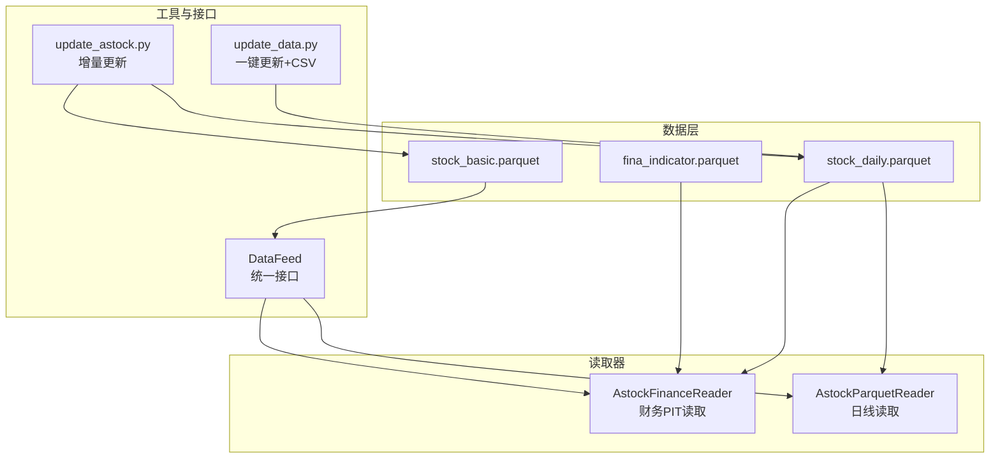
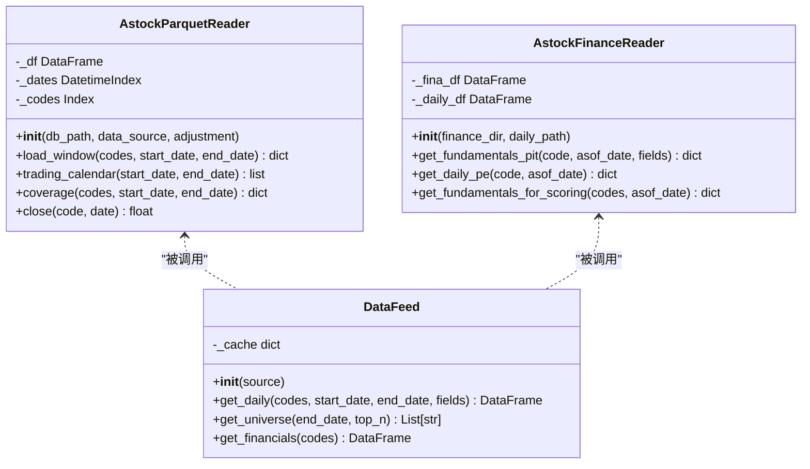
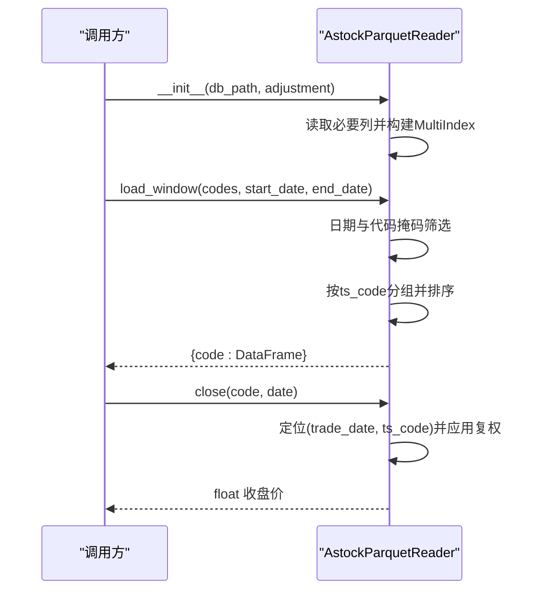
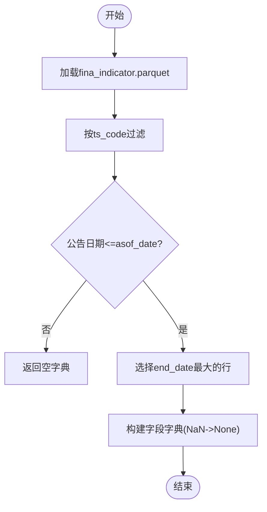
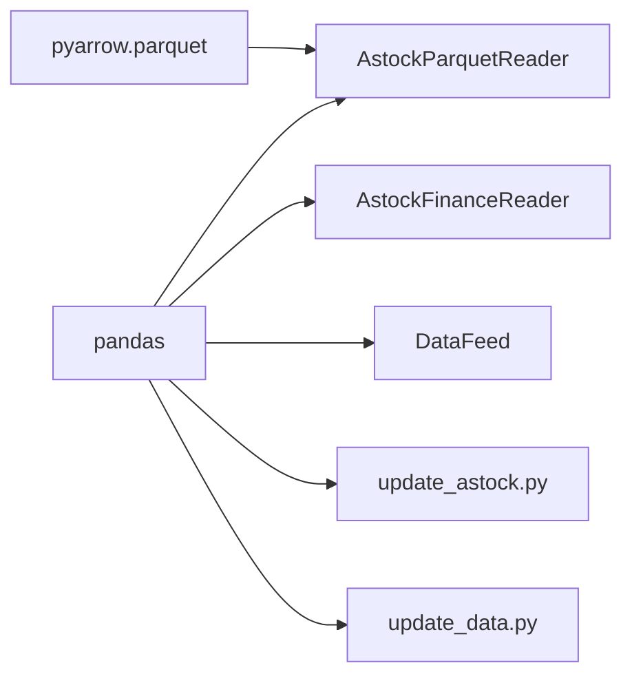

# AStock 数据读取器

<cite>
**本文引用的文件**   
- [data/astock_reader.py](file://data/astock_reader.py)
- [data/astock_finance_reader.py](file://data/astock_finance_reader.py)
- [scripts/update_astock.py](file://scripts/update_astock.py)
- [scripts/update_data.py](file://scripts/update_data.py)
- [data/feed.py](file://data/feed.py)
- [config/settings.yaml](file://config/settings.yaml)
</cite>

## 目录
1. [简介](#简介)
2. [项目结构](#项目结构)
3. [核心组件](#核心组件)
4. [架构总览](#架构总览)
5. [详细组件分析](#详细组件分析)
6. [依赖关系分析](#依赖关系分析)
7. [性能与优化](#性能与优化)
8. [故障排查指南](#故障排查指南)
9. [结论](#结论)
10. [附录：数据模型与字段说明](#附录数据模型与字段说明)

## 简介
本文件为 QuantLab 的 AStock 数据读取器提供系统化文档，重点覆盖以下方面：
- astock parquet 文件格式的组织结构与数据模型（stock_daily.parquet、fina_indicator.parquet、stock_basic.parquet）
- PIT（Point-in-Time）安全机制与前视偏差规避策略
- 财务数据的填充策略（ffill）与时间对齐逻辑
- 读取与处理 astock 数据的具体示例（日期过滤、字段选择、数据转换等）
- 数据预处理流程与优化技巧
- 常见问题与解决方案

## 项目结构
AStock 相关代码集中在 data 与 scripts 目录中，核心由两个读取器组成：
- AstockParquetReader：日线行情与基础指标的 Parquet 读取器
- AstockFinanceReader：财务指标与日度 PE 快照的 PIT 安全读取器
- update_astock.py：增量更新 daily、minute、basic 的脚本
- update_data.py：一键更新 astock parquet 并生成 CSV 的工具
- feed.py：统一数据源接口（支持 astock 与 duckdb）
- settings.yaml：全局配置（路径、回测参数、因子预处理开关等）

图表来源
- [data/astock_reader.py:25-69](file://data/astock_reader.py#L25-L69)
- [data/astock_finance_reader.py:26-60](file://data/astock_finance_reader.py#L26-L60)
- [scripts/update_astock.py:52-92](file://scripts/update_astock.py#L52-L92)
- [scripts/update_data.py:85-134](file://scripts/update_data.py#L85-L134)
- [data/feed.py:17-78](file://data/feed.py#L17-L78)

章节来源
- [data/astock_reader.py:1-69](file://data/astock_reader.py#L1-L69)
- [data/astock_finance_reader.py:1-60](file://data/astock_finance_reader.py#L1-L60)
- [scripts/update_astock.py:1-219](file://scripts/update_astock.py#L1-L219)
- [scripts/update_data.py:1-134](file://scripts/update_data.py#L1-L134)
- [data/feed.py:1-78](file://data/feed.py#L1-L78)
- [config/settings.yaml:1-69](file://config/settings.yaml#L1-L69)

## 核心组件
- AstockParquetReader：只读读取 stock_daily.parquet，按 MultiIndex (trade_date, ts_code) 组织，提供 load_window/trading_calendar/coverage/close 方法，支持 raw/qfq/hfq 复权。
- AstockFinanceReader：读取 fina_indicator.parquet 与 stock_daily.parquet，实现 PIT 安全的财务查询与日度 PE 快照获取。
- DataFeed：统一接口封装 astock/duckdb 两种数据源，提供 get_daily/get_universe/get_financials 等方法。
- update_astock.py：将本地历史、全量包与增量包合并，原子写入 stock_daily.parquet 与 stock_basic.parquet。
- update_data.py：增量更新 stock_daily.parquet 并生成 QMT 所需的 CSV 快照。

章节来源
- [data/astock_reader.py:25-192](file://data/astock_reader.py#L25-L192)
- [data/astock_finance_reader.py:26-200](file://data/astock_finance_reader.py#L26-L200)
- [data/feed.py:17-78](file://data/feed.py#L17-L78)
- [scripts/update_astock.py:52-92](file://scripts/update_astock.py#L52-L92)
- [scripts/update_data.py:85-134](file://scripts/update_data.py#L85-L134)

## 架构总览
AStock 读取器的整体架构围绕“只读 Parquet + 内存索引”展开：
- 初始化时按需列读取 stock_daily.parquet，构建 MultiIndex 并缓存日期与代码索引，降低后续筛选开销
- 财务读取器懒加载 fina_indicator.parquet 与 stock_daily.parquet，通过 ann_date/f_ann_date 与 end_date 实现 PIT 可见性判断
- 统一接口 DataFeed 屏蔽底层差异，上层策略无需关心具体数据源

图表来源
- [data/astock_reader.py:25-192](file://data/astock_reader.py#L25-L192)
- [data/astock_finance_reader.py:26-200](file://data/astock_finance_reader.py#L26-L200)
- [data/feed.py:17-78](file://data/feed.py#L17-L78)

## 详细组件分析

### AstockParquetReader（日线读取器）
- 设计要点
  - 只读模式，避免对 E:/astock 写入
  - 输出列与 DuckDBDailyReader 对齐：date/open/high/low/close/vol/amount 等
  - 使用 MultiIndex (trade_date, ts_code) 进行高效筛选
  - 支持 raw/qfq/hfq 三种复权方式，基于 adj_factor 计算
- 关键流程
  - 初始化：探测 parquet schema，仅读取必要列，构造 MultiIndex，缓存 _dates/_codes
  - load_window：按 codes 与日期范围筛选，分组后按 code 返回 DataFrame；可选复权
  - trading_calendar：返回区间内交易日字符串列表
  - coverage：统计数据源、时间跨度、代码覆盖率
  - close：单点价格访问，支持复权

图表来源
- [data/astock_reader.py:35-116](file://data/astock_reader.py#L35-L116)
- [data/astock_reader.py:163-185](file://data/astock_reader.py#L163-L185)

章节来源
- [data/astock_reader.py:25-192](file://data/astock_reader.py#L25-L192)

### AstockFinanceReader（财务PIT读取器）
- 设计要点
  - 财务数据来自 fina_indicator.parquet，PE 快照来自 stock_daily.parquet
  - PIT 规则：记录在 asof_date 可见当且仅当公告日期（优先 f_ann_date，否则 ann_date）<= asof_date
  - 对同一 code，在所有可见记录中选择 end_date 最大的行作为结果
  - 日度 PE 快照天然反前视，额外要求 trade_date <= asof_date
- 关键流程
  - get_fundamentals_pit：按 code 过滤 -> 公告日期过滤 -> 选最大 end_date -> 返回指定字段字典
  - get_daily_pe：按 code 与 trade_date <= asof_date 过滤 -> 取最后一行 -> 返回 static_pe/dynamic_pe
  - get_fundamentals_for_scoring：批量获取 PE 字典供评分模块使用

图表来源
- [data/astock_finance_reader.py:66-129](file://data/astock_finance_reader.py#L66-L129)

章节来源
- [data/astock_finance_reader.py:26-200](file://data/astock_finance_reader.py#L26-L200)

### DataFeed（统一数据源接口）
- 作用：屏蔽 astock/duckdb 差异，提供统一的 get_daily/get_universe/get_financials
- astock 分支：从 stock_daily.parquet 读取并缓存，支持字段选择与日期过滤
- universe：按成交额排序选取 Top N 股票池

章节来源
- [data/feed.py:17-78](file://data/feed.py#L17-L78)

### 增量更新脚本（update_astock.py / update_data.py）
- update_astock.py
  - daily：合并本地(<2026-01-01)、全量包(2026年)、增量包，去重后原子写入
  - minute：按周期与 code 拆分增量包，并行处理，原子替换
  - basic：合并 stock_basic.parquet，按 ts_code 去重
- update_data.py
  - 增量更新 stock_daily.parquet
  - 生成 QMT 所需 CSV（包含 pb、pe_ttm、circ_mv、amount、roe 等）

章节来源
- [scripts/update_astock.py:52-92](file://scripts/update_astock.py#L52-L92)
- [scripts/update_astock.py:95-178](file://scripts/update_astock.py#L95-L178)
- [scripts/update_astock.py:181-199](file://scripts/update_astock.py#L181-L199)
- [scripts/update_data.py:85-134](file://scripts/update_data.py#L85-L134)

## 依赖关系分析
- AstockParquetReader 依赖 pandas、pyarrow.parquet，用于高效读取与列裁剪
- AstockFinanceReader 依赖 pandas，懒加载两个 parquet 文件
- DataFeed 依赖 pandas，内部缓存减少重复 IO
- 更新脚本依赖 pandas，使用 filters 与 drop_duplicates 保证一致性

图表来源
- [data/astock_reader.py:47-56](file://data/astock_reader.py#L47-L56)
- [data/astock_finance_reader.py:42-60](file://data/astock_finance_reader.py#L42-L60)
- [data/feed.py:1-78](file://data/feed.py#L1-L78)
- [scripts/update_astock.py:1-219](file://scripts/update_astock.py#L1-L219)
- [scripts/update_data.py:1-134](file://scripts/update_data.py#L1-L134)

章节来源
- [data/astock_reader.py:47-56](file://data/astock_reader.py#L47-L56)
- [data/astock_finance_reader.py:42-60](file://data/astock_finance_reader.py#L42-L60)
- [data/feed.py:1-78](file://data/feed.py#L1-L78)
- [scripts/update_astock.py:1-219](file://scripts/update_astock.py#L1-L219)
- [scripts/update_data.py:1-134](file://scripts/update_data.py#L1-L134)

## 性能与优化
- 列裁剪：AstockParquetReader 初始化时仅读取必要列，显著降低内存占用
- 索引化：构建 MultiIndex (trade_date, ts_code)，利用 level 筛选提升速度
- 缓存：DataFeed 缓存已读取的 DataFrame；AstockFinanceReader 懒加载财务与日度数据
- 增量更新：update_astock.py 使用原子写入与去重，避免脏写与重复数据
- 复权计算：仅在需要时应用 adj_factor，避免不必要的计算

章节来源
- [data/astock_reader.py:47-69](file://data/astock_reader.py#L47-L69)
- [data/astock_finance_reader.py:42-60](file://data/astock_finance_reader.py#L42-L60)
- [data/feed.py:71-78](file://data/feed.py#L71-L78)
- [scripts/update_astock.py:42-50](file://scripts/update_astock.py#L42-L50)

## 故障排查指南
- FileNotFoundError：parquet 路径不存在或拼写错误
  - 检查 ASTOCK_DAILY_PATH、DEFAULT_FINANCE_DIR、ASTOCK_BASIC 等路径配置
  - 参考 [data/astock_reader.py:40-41](file://data/astock_reader.py#L40-L41)、[data/astock_finance_reader.py:44-47](file://data/astock_finance_reader.py#L44-L47)
- ValueError：adjustment 参数非法或 codes 为空
  - 确保 adjustment ∈ {"raw","qfq","hfq"}；传入非空 codes
  - 参考 [data/astock_reader.py:36-37](file://data/astock_reader.py#L36-L37)、[data/astock_reader.py:77-78](file://data/astock_reader.py#L77-L78)
- 无数据返回：日期区间或代码不匹配
  - 确认日期格式与交易日历一致；检查 codes 是否在数据集中
  - 参考 [data/astock_reader.py:87-91](file://data/astock_reader.py#L87-L91)
- PIT 结果为空：公告日期晚于 asof_date 或 end_date 缺失
  - 检查 f_ann_date/ann_date 与 end_date 字段；确保 asof_date 合理
  - 参考 [data/astock_finance_reader.py:93-108](file://data/astock_finance_reader.py#L93-L108)
- 复权异常：adj_factor 为 0 或负数
  - qfq 计算需 latest_adj > 0；hfq 直接乘 adj_factor
  - 参考 [data/astock_reader.py:105-110](file://data/astock_reader.py#L105-L110)、[data/astock_reader.py:174-182](file://data/astock_reader.py#L174-L182)

章节来源
- [data/astock_reader.py:36-41](file://data/astock_reader.py#L36-L41)
- [data/astock_reader.py:77-91](file://data/astock_reader.py#L77-L91)
- [data/astock_finance_reader.py:44-47](file://data/astock_finance_reader.py#L44-L47)
- [data/astock_finance_reader.py:93-108](file://data/astock_finance_reader.py#L93-L108)
- [data/astock_reader.py:105-110](file://data/astock_reader.py#L105-L110)
- [data/astock_reader.py:174-182](file://data/astock_reader.py#L174-L182)

## 结论
AStock 数据读取器以 Parquet 为核心载体，结合 MultiIndex 与列裁剪实现高性能只读访问；财务数据通过 PIT 机制严格避免前视偏差，确保回测与实盘的一致性。配合增量更新脚本与统一接口，形成完整的数据管线，满足量化研究对准确性与效率的双重需求。

## 附录：数据模型与字段说明

### stock_daily.parquet（日线行情与基础指标）
- 主键：MultiIndex (trade_date, ts_code)
- 常用字段：
  - trade_date：交易日期
  - ts_code：股票代码（tushare 格式，如 "000001.SZ"）
  - open/high/low/close：开盘/最高/最低/收盘
  - vol：成交量
  - amount：成交额
  - adj_factor：复权因子
  - circ_mv：流通市值
  - pe_ttm：滚动市盈率
  - pb：市净率
  - ps_ttm：滚动市销率
  - dv_ttm：滚动股息率
  - turnover_rate：换手率
  - is_st：是否 ST
- 读取示例（概念性步骤）：
  - 使用 AstockParquetReader.load_window 按 codes 与日期范围筛选
  - 通过 adjustment 控制 raw/qfq/hfq 复权
  - 参考 [data/astock_reader.py:47-69](file://data/astock_reader.py#L47-L69)、[data/astock_reader.py:71-116](file://data/astock_reader.py#L71-L116)

章节来源
- [data/astock_reader.py:47-69](file://data/astock_reader.py#L47-L69)
- [data/astock_reader.py:71-116](file://data/astock_reader.py#L71-L116)

### fina_indicator.parquet（季度财务指标）
- 关键字段：
  - ts_code：股票代码
  - end_date：报告期（季度末）
  - ann_date/f_ann_date：公告日期（优先 f_ann_date）
  - eps/roe/gross_margin/netprofit_margin/bps/q_profit_yoy：财务指标
- PIT 读取示例（概念性步骤）：
  - 使用 AstockFinanceReader.get_fundamentals_pit(code, asof_date, fields)
  - 公告日期 <= asof_date 的记录可见，选择最大 end_date
  - 参考 [data/astock_finance_reader.py:66-129](file://data/astock_finance_reader.py#L66-L129)

章节来源
- [data/astock_finance_reader.py:66-129](file://data/astock_finance_reader.py#L66-L129)

### stock_basic.parquet（股票基本信息）
- 关键字段：
  - ts_code：股票代码
  - industry：行业分类
  - list_date/delist_date：上市/退市日期
- 用途：行业映射、股票池过滤
- 读取示例（概念性步骤）：
  - 使用 DataFeed 或 pd.read_parquet 直接读取
  - 参考 [scripts/gen_qmt_csv.py:73-88](file://scripts/gen_qmt_csv.py#L73-L88)

章节来源
- [scripts/gen_qmt_csv.py:73-88](file://scripts/gen_qmt_csv.py#L73-L88)

### 财务数据填充策略（ffill）与时间对齐
- 现状说明：当前 AstockFinanceReader 未内置 ffill 逻辑；如需连续财务值，应在上层数据处理阶段进行填充
- 建议做法：
  - 在面板数据构建后，按 code 分组对财务列执行 ffill
  - 与交易日对齐：以 trade_date 为基准，确保财务值与行情日期一一对应
  - 注意：PIT 可见性已在读取阶段保证，ffill 不应跨越公告日期引入未来信息

章节来源
- [data/astock_finance_reader.py:66-129](file://data/astock_finance_reader.py#L66-L129)

### 读取与处理示例（概念性步骤）
- 日期过滤：使用 load_window 的 start_date/end_date 参数
- 字段选择：在 available 列表中挑选需要的列
- 数据转换：根据业务需求进行复权、标准化、截面排名等操作
- 参考：
  - [data/astock_reader.py:71-116](file://data/astock_reader.py#L71-L116)
  - [data/feed.py:71-78](file://data/feed.py#L71-L78)

章节来源
- [data/astock_reader.py:71-116](file://data/astock_reader.py#L71-L116)
- [data/feed.py:71-78](file://data/feed.py#L71-L78)