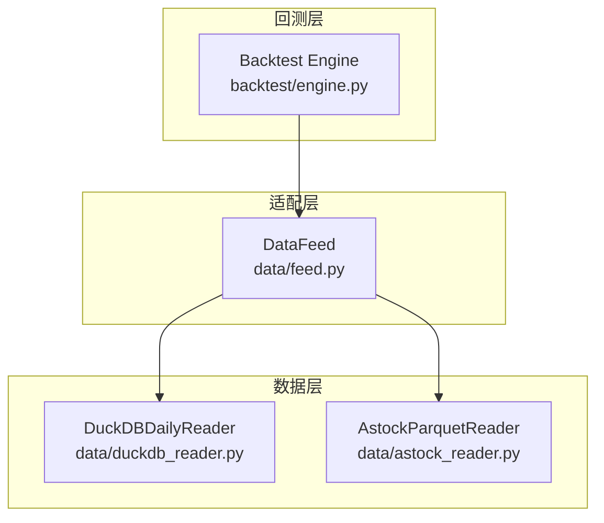
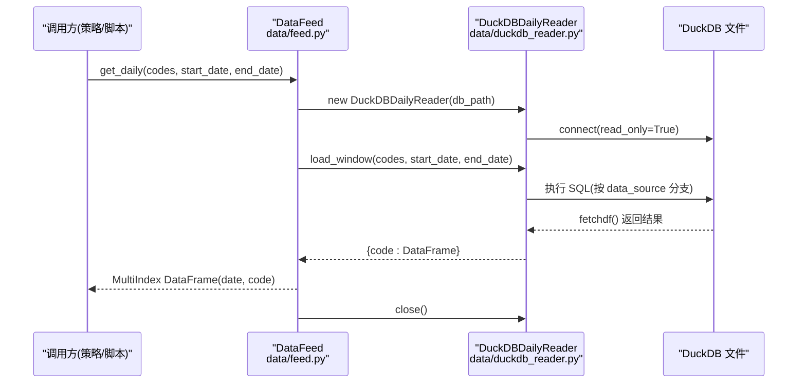
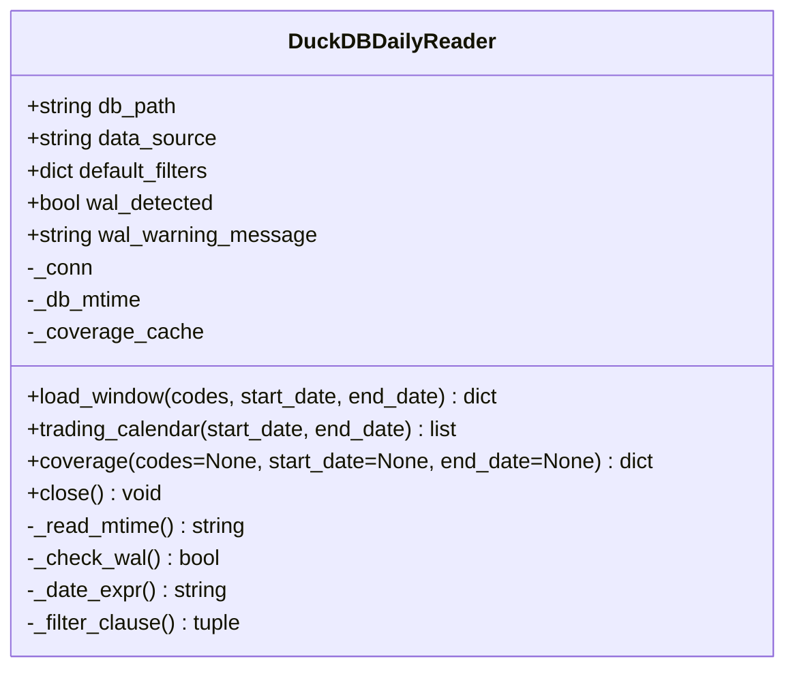
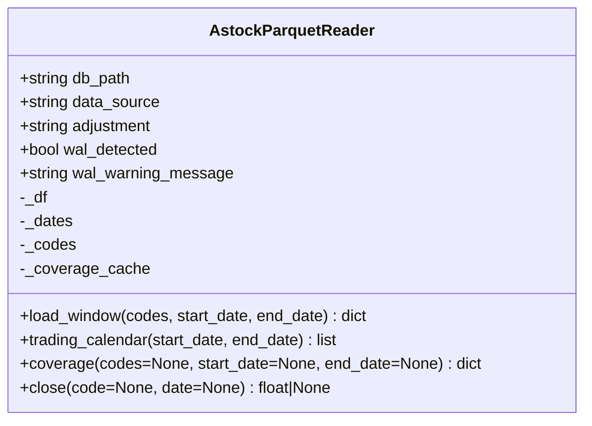
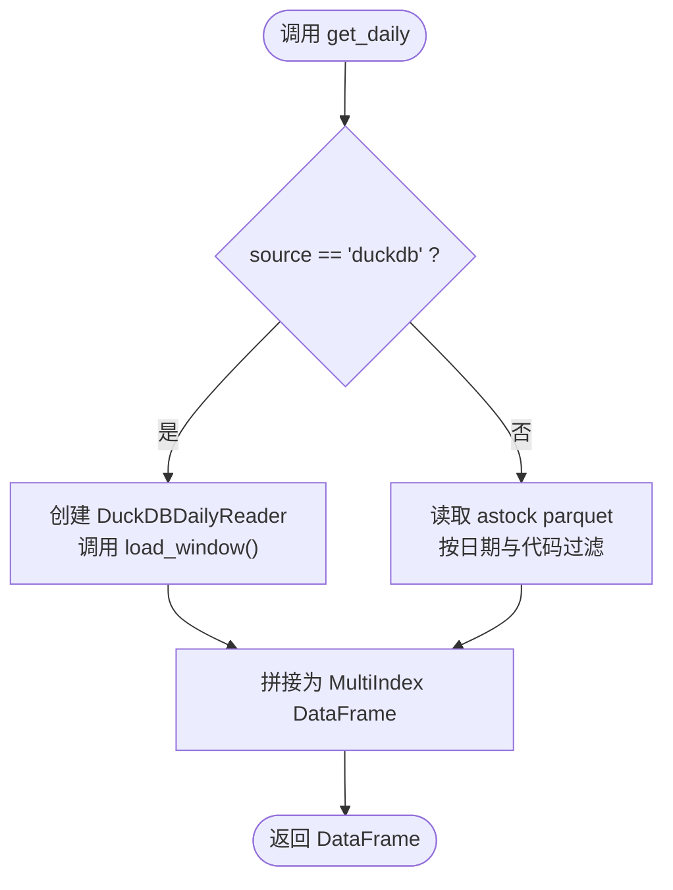
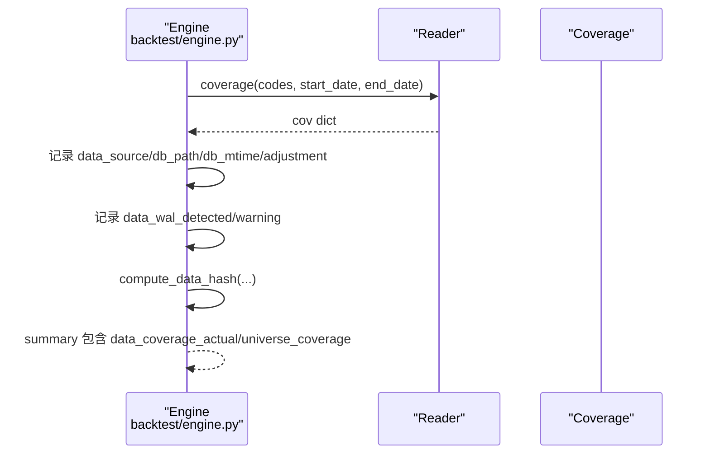
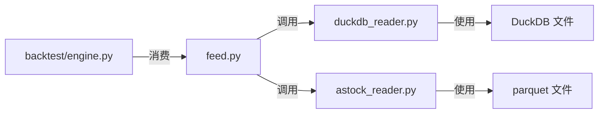

# DuckDB 数据读取器

<cite>
**本文引用的文件**   
- [data/duckdb_reader.py](file://data\duckdb_reader.py)
- [data/astock_reader.py](file://data\astock_reader.py)
- [data/feed.py](file://data\feed.py)
- [backtest/engine.py](file://backtest\engine.py)
</cite>

## 目录
1. [简介](#简介)
2. [项目结构](#项目结构)
3. [核心组件](#核心组件)
4. [架构总览](#架构总览)
5. [详细组件分析](#详细组件分析)
6. [依赖关系分析](#依赖关系分析)
7. [性能与内存优化](#性能与内存优化)
8. [故障排查指南](#故障排查指南)
9. [结论](#结论)
10. [附录：使用示例与最佳实践](#附录使用示例与最佳实践)

## 简介
本文件面向 QuantLab 的 DuckDB 数据读取器，系统性阐述其设计目标、实现原理与使用方式。DuckDB 作为高性能列式数据库，在金融时序数据的本地分析中具备显著优势：向量化执行、零拷贝导出到 Pandas、强大的 SQL 能力以及极低的 I/O 开销。本项目通过 DuckDBDailyReader 统一封装对两种不同 schema 的数据源访问（金策智算 v0.2 与 qmt_self_owned v0.3），并以一致的接口暴露给回测引擎与上层策略。

## 项目结构
与 DuckDB 读取器相关的代码主要位于 data 模块，同时被 backtest 引擎与 feed 层调用：
- data/duckdb_reader.py：DuckDB 只读读取器，支持多 schema、WAL 检测、覆盖范围查询等
- data/astock_reader.py：与 DuckDBDailyReader 同接口的 astock parquet 读取器，便于对比与切换
- data/feed.py：统一数据源接口，内部根据 source 选择 astock 或 duckdb 路径
- backtest/engine.py：回测主循环，记录数据源元信息、覆盖率与 WAL 告警

**图表来源** 
- [data/duckdb_reader.py:35-132](file://data\duckdb_reader.py#L35-L132)
- [data/astock_reader.py:25-116](file://data\astock_reader.py#L25-L116)
- [data/feed.py:17-124](file://data\feed.py#L17-L124)
- [backtest/engine.py:545-578](file://backtest\engine.py#L545-L578)

**章节来源**
- [data/duckdb_reader.py:1-215](file://data\duckdb_reader.py#L1-L215)
- [data/astock_reader.py:1-192](file://data\astock_reader.py#L1-L192)
- [data/feed.py:1-197](file://data\feed.py#L1-L197)
- [backtest/engine.py:500-619](file://backtest\engine.py#L500-L619)

## 核心组件
- DuckDBDailyReader：统一的只读 DuckDB 读取器，支持两种 schema 路径，提供 load_window()、trading_calendar()、coverage()、close() 等方法
- AstockParquetReader：与 DuckDBDailyReader 保持相同接口的 parquet 读取器，用于对比与兼容
- DataFeed：统一入口，按 source 路由到 astock 或 duckdb 读取器
- Backtest Engine：消费 reader 的 coverage 与 WAL 状态，写入运行摘要

关键职责划分：
- 连接管理：read_only 模式连接、mtime 缓存、WAL 检测
- SQL 构建：按 data_source 动态生成日期表达式与过滤条件
- 结果转换：将 DuckDB 结果集转换为 {code: DataFrame} 的统一格式
- 覆盖范围：统计最小/最大日期、去重行数、缺失股票集合

**章节来源**
- [data/duckdb_reader.py:35-132](file://data\duckdb_reader.py#L35-L132)
- [data/astock_reader.py:25-116](file://data\astock_reader.py#L25-L116)
- [data/feed.py:17-124](file://data\feed.py#L17-L124)
- [backtest/engine.py:545-578](file://backtest\engine.py#L545-L578)

## 架构总览
DuckDB 读取器在系统中的位置与交互如下：

**图表来源** 
- [data/feed.py:106-124](file://data\feed.py#L106-L124)
- [data/duckdb_reader.py:90-132](file://data\duckdb_reader.py#L90-L132)

**章节来源**
- [data/feed.py:106-124](file://data\feed.py#L106-L124)
- [data/duckdb_reader.py:90-132](file://data\duckdb_reader.py#L90-L132)

## 详细组件分析

### DuckDBDailyReader 类
- 初始化
  - 校验 data_source 是否受支持
  - 校验 db_path 是否存在
  - 设置 default_filters（qmt_self_owned 默认 adjustment='hfq', source='xtquant'）
  - 以 read_only 模式建立连接，记录 mtime，检测 WAL
- 日期表达式与过滤
  - _date_expr(): 根据 data_source 决定 trade_date 或 CAST(trade_time AS DATE)
  - _filter_clause(): 将 default_filters 转为 AND 子句与参数列表
- load_window()
  - 校验 codes 非空
  - 检查请求区间是否在 coverage[min_date, max_date] 内
  - 构造 SQL：IN 占位符 + BETWEEN 日期范围 + 可选 QUALIFY ROW_NUMBER（v0.2）
  - 执行并 fetchdf()，统一输出列 date/open/high/low/close/vol/amount
  - 按 code 分组为字典 {code: DataFrame}
- trading_calendar()
  - 返回指定区间的交易日字符串列表
- coverage()
  - 缓存全局覆盖范围（min/max 日期、去重后行数、原始行数、去重计数、db_mtime）
  - 可选针对 codes/date 范围计算 universe_coverage（存在/缺失股票集合）
- close()/__del__()
  - 安全关闭连接

**图表来源** 
- [data/duckdb_reader.py:35-215](file://data\duckdb_reader.py#L35-L215)

**章节来源**
- [data/duckdb_reader.py:35-215](file://data\duckdb_reader.py#L35-L215)

### AstockParquetReader 类（对比与兼容）
- 与 DuckDBDailyReader 保持相同方法签名，便于引擎无感切换
- 仅读取必要列以降低内存占用，构建 (trade_date, ts_code) MultiIndex
- load_window() 基于 pandas 掩码筛选，并按 code 分组输出
- 支持 raw/qfq/hfq 调整因子处理（若存在 adj_factor）
- close(code, date) 支持单点取值并应用复权

**图表来源** 
- [data/astock_reader.py:25-192](file://data\astock_reader.py#L25-L192)

**章节来源**
- [data/astock_reader.py:25-192](file://data\astock_reader.py#L25-L192)

### DataFeed 统一接口
- get_daily(source="astock"/"duckdb") 路由到对应实现
- _get_duckdb_daily() 创建 DuckDBDailyReader，调用 load_window()，拼接为 MultiIndex DataFrame
- _get_astock_daily() 直接读取 parquet 并做日期与代码过滤

**图表来源** 
- [data/feed.py:17-124](file://data\feed.py#L17-L124)

**章节来源**
- [data/feed.py:17-124](file://data\feed.py#L17-L124)

### Backtest Engine 集成
- 从 reader 获取 data_source、db_path、db_mtime、adjustment
- 汇总 coverage 与 universe_coverage，记录 WAL 告警
- 计算 data_hash 并写入 summary

**图表来源** 
- [backtest/engine.py:545-578](file://backtest\engine.py#L545-L578)

**章节来源**
- [backtest/engine.py:545-578](file://backtest\engine.py#L545-L578)

## 依赖关系分析
- DuckDBDailyReader 依赖 duckdb 库进行只读连接与 SQL 执行
- AstockParquetReader 依赖 pandas/pyarrow 读取 parquet
- DataFeed 依赖上述两个读取器，并在运行时选择
- Backtest Engine 依赖 reader 的 coverage 与 WAL 状态，用于结果可追溯性与稳定性保障

**图表来源** 
- [data/duckdb_reader.py:22-28](file://data\duckdb_reader.py#L22-L28)
- [data/astock_reader.py:13-19](file://data\astock_reader.py#L13-L19)
- [data/feed.py:106-124](file://data\feed.py#L106-L124)
- [backtest/engine.py:545-578](file://backtest\engine.py#L545-L578)

**章节来源**
- [data/duckdb_reader.py:22-28](file://data\duckdb_reader.py#L22-L28)
- [data/astock_reader.py:13-19](file://data\astock_reader.py#L13-L19)
- [data/feed.py:106-124](file://data\feed.py#L106-L124)
- [backtest/engine.py:545-578](file://backtest\engine.py#L545-L578)

## 性能与内存优化
- 列式存储与向量化执行：DuckDB 原生列存与 SIMD 加速，适合 OHLCV 聚合与窗口函数
- 只读连接与 WAL 检测：避免写锁竞争；当检测到 .wal 时提示同步未完成，确保哈希稳定
- 去重策略：v0.2 使用 QUALIFY ROW_NUMBER 保证同日唯一；v0.3 由上游保证唯一性
- 内存控制：astock 读取器仅加载必要列，减少内存峰值；DuckDB 通过 fetchdf() 零拷贝导出
- 查询优化：IN 占位符 + BETWEEN 范围过滤，减少扫描面；trading_calendar 与 coverage 预计算降低重复查询成本

[本节为通用指导，不直接分析具体文件]

## 故障排查指南
- 文件不存在：构造函数会抛出 FileNotFoundError，请确认 db_path 正确
- 数据为空：load_window() 在 codes 为空或区间无数据时抛出 ValueError
- WAL 警告：当检测到 .wal 文件时，说明上游正在同步，建议等待同步完成后再运行
- 覆盖范围越界：请求区间超出 min_date/max_date 会报错，请先用 coverage() 检查
- 字段缺失：astock 读取器要求 trade_date/ts_code 列存在，否则无法构建索引

**章节来源**
- [data/duckdb_reader.py:42-57](file://data\duckdb_reader.py#L42-L57)
- [data/duckdb_reader.py:63-75](file://data\duckdb_reader.py#L63-L75)
- [data/duckdb_reader.py:90-98](file://data\duckdb_reader.py#L90-L98)
- [data/astock_reader.py:60-66](file://data\astock_reader.py#L60-L66)

## 结论
DuckDBDailyReader 为 QuantLab 提供了高性能、可扩展且稳定的日线数据读取能力。通过统一的接口与明确的 schema 分支，既保证了向后兼容，又提升了查询效率与可维护性。结合 DataFeed 的路由机制与 Backtest Engine 的可追溯性记录，整个数据管线具备良好的鲁棒性与可观测性。

[本节为总结，不直接分析具体文件]

## 附录：使用示例与最佳实践

### 使用 DuckDB 高效查询与分析
- 基本用法
  - 创建 DataFeed("duckdb")，调用 get_daily(codes, start_date, end_date) 获取面板数据
  - 使用 trading_calendar() 获取交易日序列，配合回测窗口
  - 使用 coverage() 检查数据覆盖范围与缺失股票
- 推荐实践
  - 优先使用 IN + BETWEEN 缩小查询范围
  - 合理设置 default_filters（如 adjustment/source）以减少不必要数据
  - 在并发场景下避免在 WAL 未清理时运行，确保 data_hash 稳定

**章节来源**
- [data/feed.py:106-124](file://data\feed.py#L106-L124)
- [data/duckdb_reader.py:90-132](file://data\duckdb_reader.py#L90-L132)

### load_window() 工作原理与参数配置
- 参数
  - codes：股票代码列表（必填）
  - start_date/end_date：起止日期（字符串，YYYY-MM-DD）
- 行为
  - 校验区间是否在 coverage 范围内
  - 根据 data_source 生成 SQL（含日期表达式与去重逻辑）
  - 返回 {code: DataFrame}，列名统一为 date/open/high/low/close/vol/amount

**章节来源**
- [data/duckdb_reader.py:90-132](file://data\duckdb_reader.py#L90-L132)

### 与 astock 数据源的集成与格式转换
- DataFeed 根据 source 选择 astock 或 duckdb 读取器
- astock 读取器将 parquet 数据转换为与 DuckDB 一致的 {code: DataFrame} 格式
- 支持 raw/qfq/hfq 复权处理（若存在 adj_factor）

**章节来源**
- [data/feed.py:71-104](file://data\feed.py#L71-L104)
- [data/astock_reader.py:71-116](file://data\astock_reader.py#L71-L116)

### 大数据集与并发访问场景
- 大数据集
  - 使用 IN + BETWEEN 限制扫描范围
  - 利用 coverage() 预先评估数据规模与缺失情况
  - 分批次加载与处理，避免一次性加载过多代码
- 并发访问
  - DuckDB 以 read_only 模式打开，避免写锁冲突
  - 检测 .wal 文件，提示上游同步未完成，避免不稳定结果

**章节来源**
- [data/duckdb_reader.py:54-57](file://data\duckdb_reader.py#L54-L57)
- [data/duckdb_reader.py:63-75](file://data\duckdb_reader.py#L63-L75)