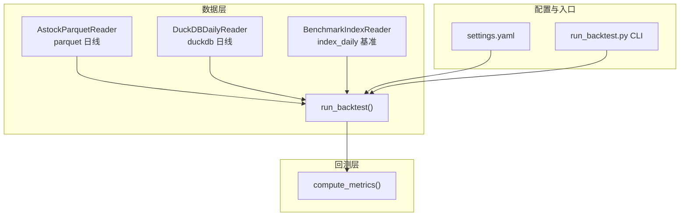
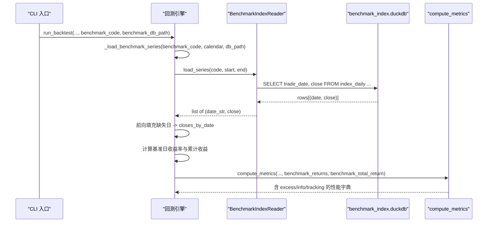
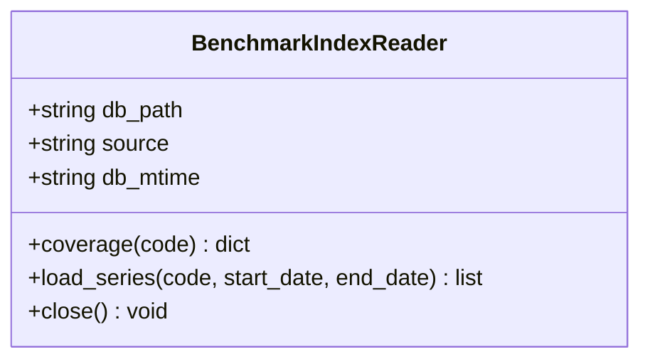
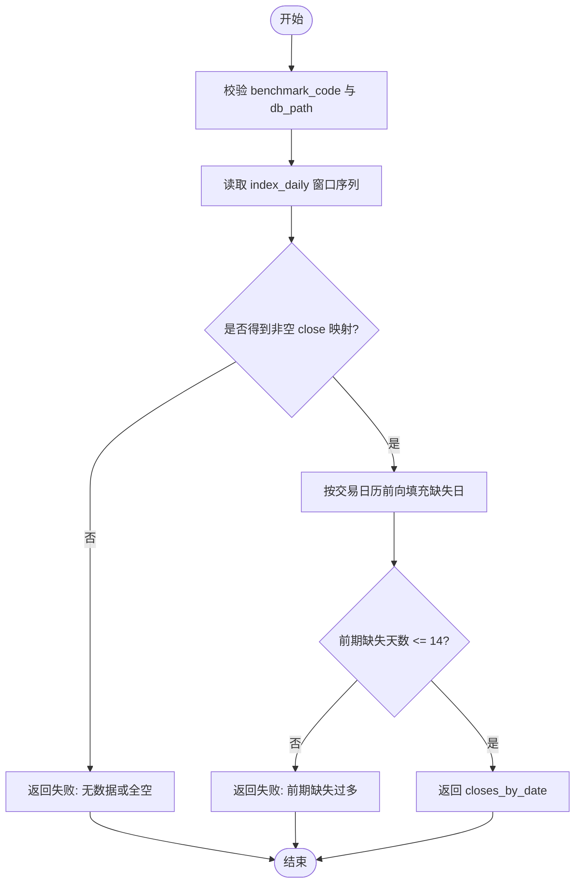
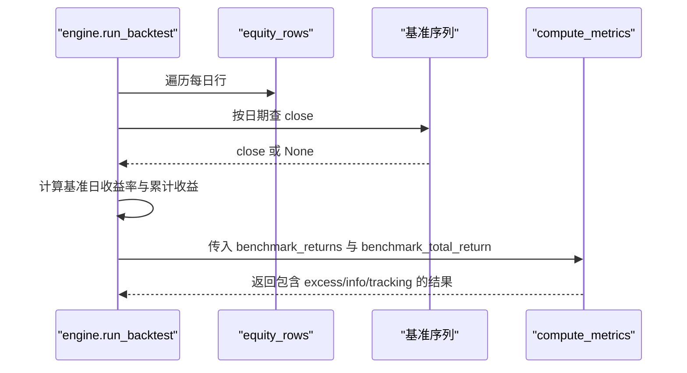
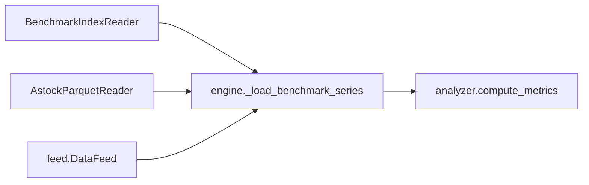

# 基准数据读取器

<cite>
**本文引用的文件**   
- [benchmark_reader.py](file://data/benchmark_reader.py)
- [engine.py](file://backtest/engine.py)
- [analyzer.py](file://backtest/analyzer.py)
- [astock_reader.py](file://data/astock_reader.py)
- [feed.py](file://data/feed.py)
- [run_backtest.py](file://scripts/run_backtest.py)
- [settings.yaml](file://config/settings.yaml)
</cite>

## 目录
1. [简介](#简介)
2. [项目结构](#项目结构)
3. [核心组件](#核心组件)
4. [架构总览](#架构总览)
5. [详细组件分析](#详细组件分析)
6. [依赖关系分析](#依赖关系分析)
7. [性能考量](#性能考量)
8. [故障排查指南](#故障排查指南)
9. [结论](#结论)
10. [附录：使用示例与配置说明](#附录使用示例与配置说明)

## 简介
本文件面向 QuantLab 的“基准数据读取器”，系统性说明基准指数（如沪深300、中证500等）的数据结构与存储格式、加载方式、时间序列对齐机制，以及与个股数据的关联逻辑和绩效归因计算。同时给出质量检查与异常处理策略，并指导如何添加自定义基准指数。

## 项目结构
QuantLab 将基准数据与个股数据解耦：
- 基准数据通过独立的只读 DuckDB 文件提供，表名为 index_daily，由外部同步脚本维护。
- 个股日线数据通过 parquet 或 DuckDB 两种 reader 提供，二者遵循一致的 duck-typed 接口。
- 回测引擎在运行过程中按需加载基准序列，并与交易日历对齐，用于计算超额收益与信息比率等指标。

图表来源 
- [astock_reader.py:25-70](file://data/astock_reader.py#L25-L70)
- [benchmark_reader.py:21-35](file://data/benchmark_reader.py#L21-L35)
- [engine.py:237-296](file://backtest/engine.py#L237-L296)
- [settings.yaml:22-28](file://config/settings.yaml#L22-L28)
- [run_backtest.py:96-114](file://scripts/run_backtest.py#L96-L114)

章节来源
- [astock_reader.py:25-70](file://data/astock_reader.py#L25-L70)
- [benchmark_reader.py:21-35](file://data/benchmark_reader.py#L21-L35)
- [engine.py:237-296](file://backtest/engine.py#L237-L296)
- [settings.yaml:22-28](file://config/settings.yaml#L22-L28)
- [run_backtest.py:96-114](file://scripts/run_backtest.py#L96-L114)

## 核心组件
- BenchmarkIndexReader：只读读取 benchmark_index.duckdb 的 index_daily 表，返回按交易日升序的 (date_str, close_float) 列表。
- 回测引擎 _load_benchmark_series：根据交易日历向前补齐缺失日，生成覆盖全窗口的 {date: close} 映射，并计算逐日基准收益率与累计收益。
- analyzer.compute_metrics：当基准可用时，计算超额收益、信息比率、跟踪误差等；不可用时返回 None。
- AstockParquetReader / feed.DataFeed：为个股数据提供统一接口，便于与基准进行对齐比较。

章节来源
- [benchmark_reader.py:21-63](file://data/benchmark_reader.py#L21-L63)
- [engine.py:38-99](file://backtest/engine.py#L38-L99)
- [analyzer.py:96-176](file://backtest/analyzer.py#L96-L176)
- [astock_reader.py:71-116](file://data/astock_reader.py#L71-L116)
- [feed.py:17-41](file://data/feed.py#L17-L41)

## 架构总览
下图展示基准数据从磁盘到回测指标的完整调用链与数据流。

图表来源 
- [engine.py:38-99](file://backtest/engine.py#L38-L99)
- [engine.py:445-488](file://backtest/engine.py#L445-L488)
- [analyzer.py:96-176](file://backtest/analyzer.py#L96-L176)
- [benchmark_reader.py:52-63](file://data/benchmark_reader.py#L52-L63)

## 详细组件分析

### BenchmarkIndexReader（基准指数读取器）
- 职责：以只读模式连接 DuckDB，查询 index_daily 表，返回指定 code 与 source 在日期窗口内的收盘价序列。
- 数据结构：
  - 输入：code（指数代码，如 000300.SH）、start_date、end_date（YYYY-MM-DD）。
  - 输出：list of (date_str, close_float)，按 trade_date 升序。
- 关键方法：
  - __init__(db_path, source="xtquant")：校验文件存在并以只读模式连接，记录数据库修改时间。
  - coverage(code)：返回该指数的行数、最小/最大日期。
  - load_series(code, start_date, end_date)：拉取窗口内收盘价序列。
  - close()：关闭连接。
- 错误处理：
  - 文件不存在抛出 FileNotFoundError，调用方应降级为 benchmark_available=False。
  - 空结果视为无数据，上层需做可用性判断。

图表来源 
- [benchmark_reader.py:21-73](file://data/benchmark_reader.py#L21-L73)

章节来源
- [benchmark_reader.py:21-73](file://data/benchmark_reader.py#L21-L73)

### 回测引擎中的基准加载与对齐（_load_benchmark_series）
- 功能：
  - 校验 benchmark_code 与 benchmark_db_path。
  - 基于交易日历向前扩展起始日（默认额外 120 天），确保策略可计算长窗口指标。
  - 调用 BenchmarkIndexReader 获取序列，构建 {date: close} 映射。
  - 对交易日历进行前向填充，保证每个交易日都有基准收盘价。
  - 若前期缺失超过容忍阈值（14 天），则放弃使用基准。
- 返回值：(closes_by_date, note)。note 为空表示成功，否则为失败原因。

图表来源 
- [engine.py:38-99](file://backtest/engine.py#L38-L99)

章节来源
- [engine.py:38-99](file://backtest/engine.py#L38-L99)

### 基准收益率与累计收益计算（engine 后处理）
- 遍历 equity_rows，按日期查找基准收盘价，计算日收益率；若出现 None 或 0，则禁用 IR/excess。
- 计算基准累计收益：首尾收盘价比值减一。
- 将基准收益率与策略日收益率对齐，传入 compute_metrics 计算超额与信息比率。

图表来源 
- [engine.py:445-488](file://backtest/engine.py#L445-L488)
- [analyzer.py:96-176](file://backtest/analyzer.py#L96-L176)

章节来源
- [engine.py:445-488](file://backtest/engine.py#L445-L488)
- [analyzer.py:96-176](file://backtest/analyzer.py#L96-L176)

### 个股数据读取器（对比与对齐）
- AstockParquetReader：
  - 支持 raw/qfq/hfq 复权，输出列与 DuckDBDailyReader 一致（date, open, high, low, close, vol, amount 等）。
  - 提供 load_window(codes, start_date, end_date)、trading_calendar、coverage、close(code, date) 等方法。
- feed.DataFeed：
  - 统一 astock 与 duckdb 日线读取接口，便于上层切换数据源。

章节来源
- [astock_reader.py:25-116](file://data/astock_reader.py#L25-L116)
- [feed.py:17-41](file://data/feed.py#L17-L41)

## 依赖关系分析
- 基准读取器仅依赖 duckdb，不 ATTACH 其他库，保持只读与最小化耦合。
- 回测引擎依赖基准读取器与指标计算模块，完成数据对齐与绩效度量。
- 个股读取器与基准读取器通过统一的日期字符串（YYYY-MM-DD）与交易日历实现对齐。

图表来源 
- [benchmark_reader.py:21-35](file://data/benchmark_reader.py#L21-L35)
- [engine.py:38-99](file://backtest/engine.py#L38-L99)
- [analyzer.py:96-176](file://backtest/analyzer.py#L96-L176)
- [astock_reader.py:25-70](file://data/astock_reader.py#L25-L70)
- [feed.py:17-41](file://data/feed.py#L17-L41)

章节来源
- [benchmark_reader.py:21-35](file://data/benchmark_reader.py#L21-L35)
- [engine.py:38-99](file://backtest/engine.py#L38-L99)
- [analyzer.py:96-176](file://backtest/analyzer.py#L96-L176)
- [astock_reader.py:25-70](file://data/astock_reader.py#L25-L70)
- [feed.py:17-41](file://data/feed.py#L17-L41)

## 性能考量
- 基准读取为只读 DuckDB 查询，避免 ATTACH 与写操作，降低锁竞争与开销。
- 引擎在加载基准前会提前扩展起始日，减少频繁重算长窗口指标的成本。
- 前向填充缺失日采用线性扫描，复杂度与交易日历长度线性相关，整体开销可控。
- 个股数据读取建议按需选择字段，减少内存占用（参考 AstockParquetReader 的列裁剪）。

[本节为通用性能建议，不直接分析具体文件]

## 故障排查指南
- 基准文件不存在：
  - 现象：初始化 BenchmarkIndexReader 抛出 FileNotFoundError。
  - 处理：调用方捕获异常并将 benchmark_available 置为 False，继续回测但不计算 IR/excess。
- 窗口内无数据或 close 全空：
  - 现象：_load_benchmark_series 返回失败 note。
  - 处理：检查 benchmark_code 与 source 是否正确，确认 index_daily 表数据完整性。
- 前期缺失过多：
  - 现象：缺失天数超过 14 天，引擎放弃使用基准。
  - 处理：补充历史数据或调整回测起始日。
- 基准序列断点或起点价格为 0：
  - 现象：engine 后处理阶段发现 None/0，禁用 IR/excess。
  - 处理：清洗数据，修复缺失与异常值。

章节来源
- [benchmark_reader.py:27-35](file://data/benchmark_reader.py#L27-L35)
- [engine.py:45-99](file://backtest/engine.py#L45-L99)
- [engine.py:445-488](file://backtest/engine.py#L445-L488)

## 结论
QuantLab 的基准数据读取器以只读 DuckDB 为核心，配合回测引擎的时间对齐与异常容错，提供了稳健的基准序列加载能力。通过与个股数据读取器的统一接口设计，实现了灵活的数据源切换与高效的绩效归因计算。建议在数据维护与回测配置中严格校验路径与代码，确保基准可用性与指标有效性。

[本节为总结性内容，不直接分析具体文件]

## 附录：使用示例与配置说明

### 数据结构与存储格式
- 存储位置：benchmark_index.duckdb（独立文件，由外部同步脚本维护）。
- 表名：index_daily。
- 关键字段：trade_date（交易日）、close（收盘价）、source（数据来源，默认 xtquant）、code（指数代码）。
- 读取接口：BenchmarkIndexReader.load_series(code, start_date, end_date) 返回 [(date_str, close_float), ...]。

章节来源
- [benchmark_reader.py:21-63](file://data/benchmark_reader.py#L21-L63)

### 加载方法与时间序列对齐
- 加载流程：
  - 校验 benchmark_code 与 benchmark_db_path。
  - 扩展起始日（默认 120 天）以确保长窗口指标可用。
  - 读取 index_daily 序列，构建 {date: close} 映射。
  - 按交易日历前向填充缺失日，生成完整序列。
- 对齐机制：
  - 以交易日历为准，缺失日使用前一个有效收盘价填充。
  - 若前期缺失超过 14 天，则禁用基准。

章节来源
- [engine.py:38-99](file://backtest/engine.py#L38-L99)

### 获取基准数据进行绩效对比与归因分析
- 在回测中启用基准：
  - 通过 run_backtest 参数传入 benchmark_code 与 benchmark_db_path。
  - 引擎自动计算基准日收益率与累计收益，并传入 compute_metrics。
- 指标输出：
  - 当基准可用且序列连续时，返回 excess_return、information_ratio、tracking_error。
  - 若基准不可用或存在断点，上述指标为 None。

章节来源
- [engine.py:445-488](file://backtest/engine.py#L445-L488)
- [analyzer.py:96-176](file://backtest/analyzer.py#L96-L176)

### 基准数据与个股数据的关联方式与计算逻辑
- 关联键：日期字符串（YYYY-MM-DD）与交易日历。
- 计算逻辑：
  - 基准日收益率 = close_t / close_{t-1} - 1。
  - 基准累计收益 = close_end / close_start - 1。
  - 超额收益 = 策略累计收益 - 基准累计收益。
  - 信息比率 = 平均日超额 / 标准差 × sqrt(252)。
  - 跟踪误差 = 日超额标准差 × sqrt(252)。

章节来源
- [engine.py:445-488](file://backtest/engine.py#L445-L488)
- [analyzer.py:78-94](file://backtest/analyzer.py#L78-L94)

### 质量检查与异常处理机制
- 文件级检查：
  - 基准文件不存在 → FileNotFoundError，调用方降级。
- 数据级检查：
  - 窗口内无数据或 close 全空 → 返回失败 note。
  - 前期缺失 > 14 天 → 禁用基准。
  - 序列断点或起点价格为 0 → 禁用 IR/excess。
- 日志与诊断：
  - 引擎记录 benchmark_note 与警告信息，便于定位问题。

章节来源
- [benchmark_reader.py:27-35](file://data/benchmark_reader.py#L27-L35)
- [engine.py:45-99](file://backtest/engine.py#L45-L99)
- [engine.py:445-488](file://backtest/engine.py#L445-L488)

### 自定义基准指数的添加与配置
- 步骤：
  - 准备 index_daily 表数据，包含 code、trade_date、close、source 字段。
  - 将数据写入 benchmark_index.duckdb（由 sync_xtquant_index_to_duckdb.py 维护）。
  - 在回测配置中设置 benchmark_code 与 benchmark_db_path。
- 配置位置：
  - settings.yaml 中 backtest.benchmark 可指定默认指数代码。
  - run_backtest.py 中可通过 bt.get("benchmark_code", ...) 与 bt.get("benchmark_db_path", ...) 传入。

章节来源
- [settings.yaml:22-28](file://config/settings.yaml#L22-L28)
- [run_backtest.py:106-107](file://scripts/run_backtest.py#L106-L107)
- [engine.py:32](file://backtest/engine.py#L32)