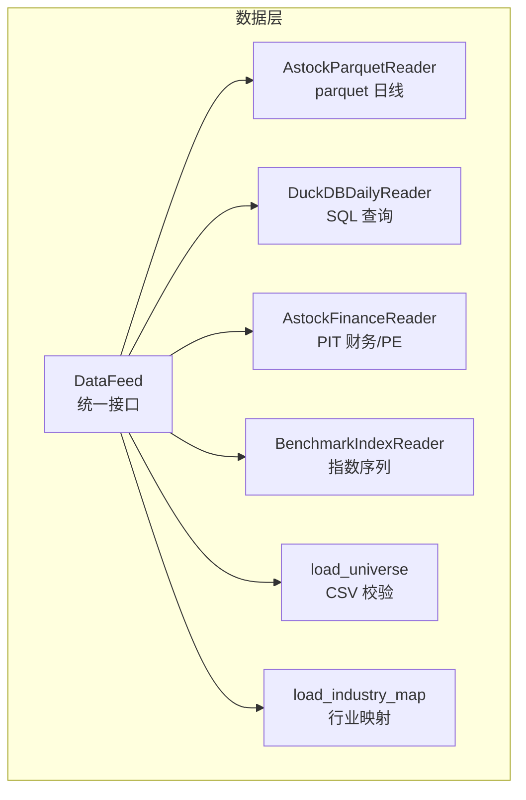
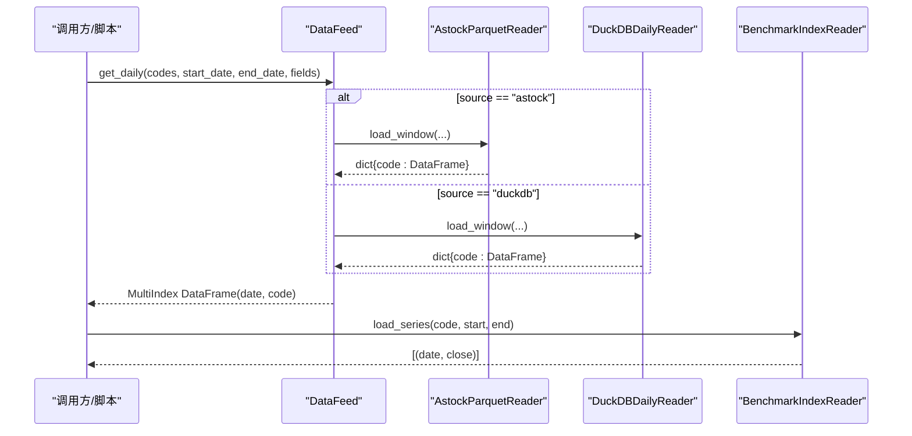
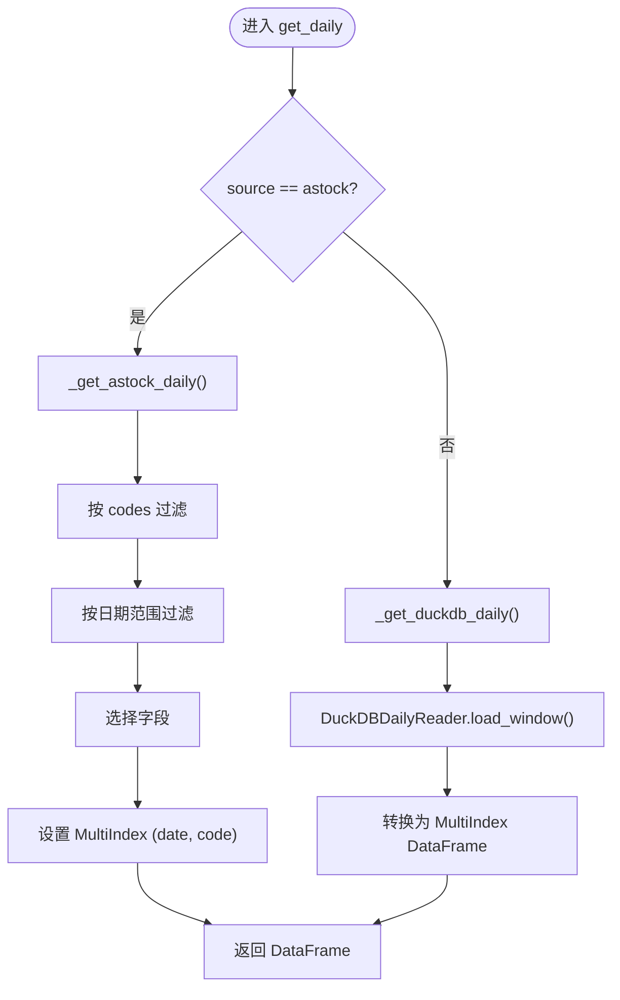
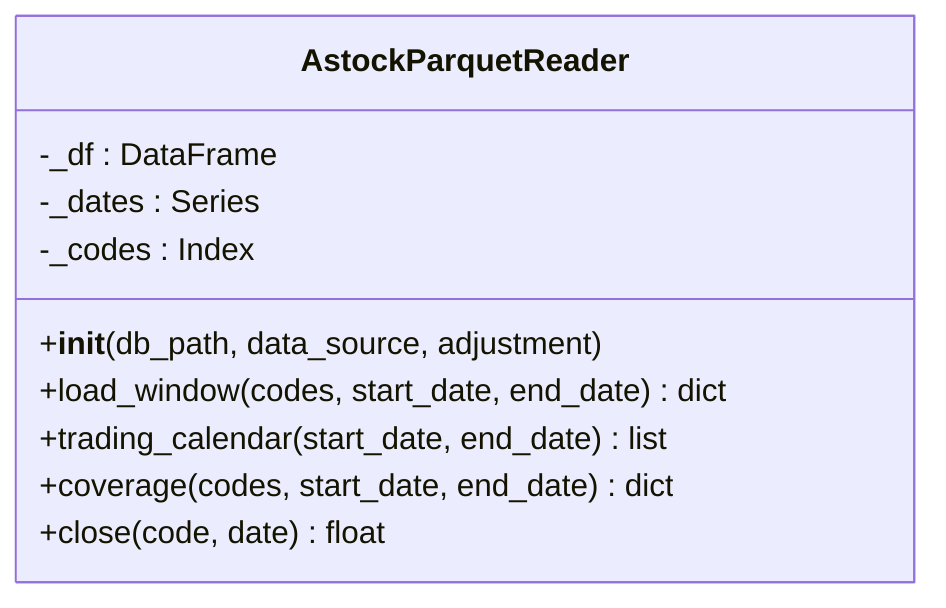
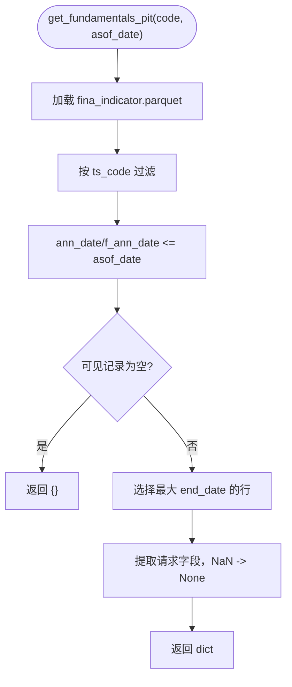
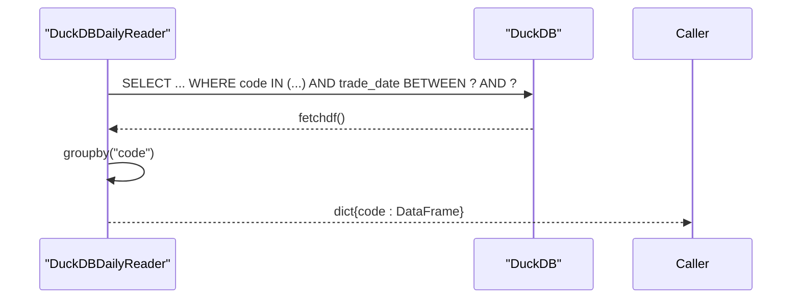
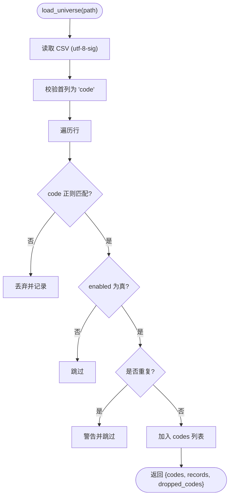
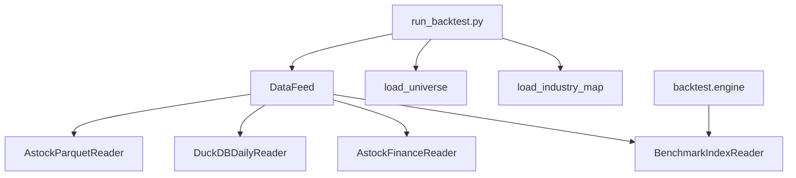

# 数据层架构

<cite>
**本文引用的文件**   
- [data/feed.py](file://data/feed.py)
- [data/astock_reader.py](file://data/astock_reader.py)
- [data/astock_finance_reader.py](file://data/astock_finance_reader.py)
- [data/duckdb_reader.py](file://data/duckdb_reader.py)
- [data/benchmark_reader.py](file://data/benchmark_reader.py)
- [data/universe.py](file://data/universe.py)
- [data/industry_map.py](file://data/industry_map.py)
- [scripts/run_backtest.py](file://scripts/run_backtest.py)
- [backtest/engine.py](file://backtest/engine.py)
- [config/settings.yaml](file://config/settings.yaml)
</cite>

## 目录
1. [引言](#引言)
2. [项目结构](#项目结构)
3. [核心组件](#核心组件)
4. [架构总览](#架构总览)
5. [详细组件分析](#详细组件分析)
6. [依赖关系分析](#依赖关系分析)
7. [性能考量](#性能考量)
8. [故障排查指南](#故障排查指南)
9. [结论](#结论)
10. [附录：扩展新数据源与使用示例](#附录：扩展新数据源与使用示例)

## 引言
本文件面向 QuantLab 的数据层，系统性阐述统一数据接口 DataFeed 的设计理念与实现原理，说明如何通过单一接口访问多种数据源（本地 parquet 与 DuckDB）。文档深入解析 astock 数据读取器（parquet 格式、PIT 财务数据、复权处理）、DuckDB 读取器的优势与使用场景（SQL 查询、性能优化、内存管理），并解释股票池管理与基准数据读取机制。最后给出数据预处理与缓存策略的最佳实践，以及扩展新数据源的代码级指导。

## 项目结构
数据层位于 data 目录下，围绕“统一接口 + 多实现”的解耦设计组织：
- feed.py：统一入口 DataFeed，按 source 路由到具体读取器；提供 get_panel 兼容旧接口。
- astock_reader.py：AstockParquetReader，以 parquet 为数据源，提供与 DuckDBDailyReader 一致的 duck-typed 接口。
- astock_finance_reader.py：AstockFinanceReader，基于 PIT 原则读取财务指标与日频 PE。
- duckdb_reader.py：DuckDBDailyReader，通过 SQL 直接查询 DuckDB，支持不同 schema 路径。
- benchmark_reader.py：BenchmarkIndexReader，独立读取指数序列。
- universe.py：从 CSV 加载并校验股票池。
- industry_map.py：行业映射表加载与进程级缓存。

图表来源
- [data/feed.py:17-135](file://data/feed.py#L17-L135)
- [data/astock_reader.py:25-116](file://data/astock_reader.py#L25-L116)
- [data/astock_finance_reader.py:26-130](file://data/astock_finance_reader.py#L26-L130)
- [data/duckdb_reader.py:35-132](file://data/duckdb_reader.py#L35-L132)
- [data/benchmark_reader.py:21-63](file://data/benchmark_reader.py#L21-L63)
- [data/universe.py:27-61](file://data/universe.py#L27-L61)
- [data/industry_map.py:16-36](file://data/industry_map.py#L16-L36)

章节来源
- [data/feed.py:1-197](file://data/feed.py#L1-L197)
- [data/astock_reader.py:1-192](file://data/astock_reader.py#L1-L192)
- [data/astock_finance_reader.py:1-200](file://data/astock_finance_reader.py#L1-L200)
- [data/duckdb_reader.py:1-215](file://data/duckdb_reader.py#L1-L215)
- [data/benchmark_reader.py:1-73](file://data/benchmark_reader.py#L1-L73)
- [data/universe.py:1-62](file://data/universe.py#L1-L62)
- [data/industry_map.py:1-41](file://data/industry_map.py#L1-L41)

## 核心组件
- DataFeed：统一数据入口，封装 astock 与 duckdb 两种数据源，提供 get_daily、get_universe、get_financials 等接口，内部维护简单缓存。
- AstockParquetReader：只读 parquet 读取器，构造时按需列读取，构建 MultiIndex，支持 load_window/trading_calendar/coverage/close 等 duck-typed 方法，并提供 qfq/hfq 复权。
- AstockFinanceReader：PIT 安全读取财务指标与日频 PE，避免未来信息泄露。
- DuckDBDailyReader：连接 DuckDB 数据库，执行 SQL 查询，返回对齐的列集合，支持不同 schema 路径与 WAL 检测。
- BenchmarkIndexReader：独立读取指数序列，用于回测基准对比。
- Universe Loader：CSV 校验与去重，生成可用股票池。
- Industry Map：行业映射表加载与进程级缓存。

章节来源
- [data/feed.py:17-135](file://data/feed.py#L17-L135)
- [data/astock_reader.py:25-116](file://data/astock_reader.py#L25-L116)
- [data/astock_finance_reader.py:26-130](file://data/astock_finance_reader.py#L26-L130)
- [data/duckdb_reader.py:35-132](file://data/duckdb_reader.py#L35-L132)
- [data/benchmark_reader.py:21-63](file://data/benchmark_reader.py#L21-L63)
- [data/universe.py:27-61](file://data/universe.py#L27-L61)
- [data/industry_map.py:16-36](file://data/industry_map.py#L16-L36)

## 架构总览
统一接口 DataFeed 屏蔽底层差异，上层只需调用 get_daily/get_universe/get_financials。根据 source 参数动态选择 astock 或 duckdb 实现。回测引擎通过 run_backtest 接收 reader 实例，benchmark 由 BenchmarkIndexReader 单独加载。

图表来源
- [data/feed.py:28-124](file://data/feed.py#L28-L124)
- [data/astock_reader.py:71-116](file://data/astock_reader.py#L71-L116)
- [data/duckdb_reader.py:90-132](file://data/duckdb_reader.py#L90-L132)
- [data/benchmark_reader.py:52-63](file://data/benchmark_reader.py#L52-L63)

## 详细组件分析

### 统一数据接口 DataFeed
- 设计理念：单一入口、多后端实现、结果标准化（MultiIndex DataFrame）。
- 关键能力：
  - get_daily：按 source 路由到 astock 或 duckdb 实现，返回 (date, code) 多级索引 DataFrame。
  - get_universe：基于成交额排序选取 top_n 股票池。
  - get_financials：当前仅 astock 实现，返回原始财务记录。
  - get_panel：兼容旧接口的面板构建，包含常用字段与财务指标的填充。
- 缓存策略：内存中缓存 astock parquet 全量数据，减少重复 IO。

图表来源
- [data/feed.py:28-124](file://data/feed.py#L28-L124)

章节来源
- [data/feed.py:17-135](file://data/feed.py#L17-L135)
- [data/feed.py:137-181](file://data/feed.py#L137-L181)

### Astock 数据读取器（parquet）
- 数据结构：parquet 存储 trade_date/ts_code 作为普通列，构造 MultiIndex 以匹配 duck-typed 契约。
- 列裁剪：构造时仅读取必要列，降低内存占用。
- 窗口读取：load_window 按 codes 与日期范围筛选，输出对齐列集（date/open/high/low/close/vol/amount 等）。
- 复权处理：支持 raw/qfq/hfq，基于 adj_factor 对价格列进行复权。
- 覆盖度与日历：trading_calendar/coverage 提供统计信息与缺失检测。
- 单点取值：close(code, date) 支持复权后的收盘价读取。

图表来源
- [data/astock_reader.py:25-116](file://data/astock_reader.py#L25-L116)
- [data/astock_reader.py:118-185](file://data/astock_reader.py#L118-L185)

章节来源
- [data/astock_reader.py:25-116](file://data/astock_reader.py#L25-L116)
- [data/astock_reader.py:118-185](file://data/astock_reader.py#L118-L185)

### Astock 财务读取器（PIT）
- PIT 规则：公告日 ann_date/f_ann_date <= asof_date 的记录可见；取可见记录中 end_date 最大的季度。
- 字段映射：默认字段包括 eps、roe、gross_margin、netprofit_margin、bps、q_profit_yoy 等。
- 日频 PE：stock_daily 中的 pe/pe_ttm 天然反前瞻，结合 trade_date <= asof_date 保证一致性。
- 评分便捷：get_fundamentals_for_scoring 聚合 PE 字典供评分模块使用。

图表来源
- [data/astock_finance_reader.py:66-129](file://data/astock_finance_reader.py#L66-L129)

章节来源
- [data/astock_finance_reader.py:26-130](file://data/astock_finance_reader.py#L26-L130)
- [data/astock_finance_reader.py:135-174](file://data/astock_finance_reader.py#L135-L174)
- [data/astock_finance_reader.py:180-191](file://data/astock_finance_reader.py#L180-L191)

### DuckDB 数据读取器
- 优势：
  - SQL 查询：直接在数据库端完成过滤、去重（QUALIFY ROW_NUMBER）、排序，减少内存与网络传输。
  - Schema 适配：支持 jince_zhisuan 与 qmt_self_owned 两种路径，默认过滤器可配置。
  - WAL 检测：并发同步时发出警告，确保数据哈希稳定性。
  - 内存友好：fetchdf 后按 code 分组，逐 code 产出 DataFrame，避免一次性拼接大表。
- 关键方法：
  - load_window：按 codes 与日期范围查询，返回对齐列集。
  - trading_calendar：获取交易日历。
  - coverage：统计覆盖度与缺失情况。
  - close：关闭连接。

图表来源
- [data/duckdb_reader.py:90-132](file://data/duckdb_reader.py#L90-L132)
- [data/duckdb_reader.py:134-144](file://data/duckdb_reader.py#L134-L144)
- [data/duckdb_reader.py:146-205](file://data/duckdb_reader.py#L146-L205)

章节来源
- [data/duckdb_reader.py:35-132](file://data/duckdb_reader.py#L35-L132)
- [data/duckdb_reader.py:134-205](file://data/duckdb_reader.py#L134-L205)

### 股票池管理与基准数据读取
- 股票池：universe.py 从 CSV 加载，校验 code 格式、去重、enabled 标记，空池抛出异常。
- 基准数据：benchmark_reader.py 独立读取 index_daily 表，返回 (date, close) 序列，engine 在回测前加载并补齐缺失值。

图表来源
- [data/universe.py:27-61](file://data/universe.py#L27-L61)

章节来源
- [data/universe.py:27-61](file://data/universe.py#L27-L61)
- [data/benchmark_reader.py:21-63](file://data/benchmark_reader.py#L21-L63)
- [backtest/engine.py:55-99](file://backtest/engine.py#L55-L99)

### 行业映射
- 功能：从 stock_basic.parquet 加载 ts_code -> industry 映射，进程级缓存避免重复 IO。
- 使用：当策略启用 industry_cap 时按需加载。

章节来源
- [data/industry_map.py:16-36](file://data/industry_map.py#L16-L36)
- [scripts/run_backtest.py:82-91](file://scripts/run_backtest.py#L82-L91)

## 依赖关系分析
- DataFeed 依赖 AstockParquetReader 与 DuckDBDailyReader，二者遵循相同 duck-typed 接口。
- AstockFinanceReader 依赖 parquet 财务与日频数据。
- BenchmarkIndexReader 独立于市场数据 reader，专用于指数序列。
- scripts.run_backtest 组装 reader、universe、industry_map 并调用 backtest.engine.run_backtest。
- engine 在回测过程中加载基准序列并进行缺失值补齐。

图表来源
- [data/feed.py:17-135](file://data/feed.py#L17-L135)
- [scripts/run_backtest.py:29-116](file://scripts/run_backtest.py#L29-L116)
- [backtest/engine.py:55-99](file://backtest/engine.py#L55-L99)

章节来源
- [data/feed.py:17-135](file://data/feed.py#L17-L135)
- [scripts/run_backtest.py:29-116](file://scripts/run_backtest.py#L29-L116)
- [backtest/engine.py:55-99](file://backtest/engine.py#L55-L99)

## 性能考量
- parquet 列裁剪：AstockParquetReader 构造时仅读取必要列，显著降低内存占用。
- 索引与过滤：利用 MultiIndex 与布尔掩码进行高效筛选，避免全表扫描。
- DuckDB SQL 下推：过滤、去重、排序在数据库端完成，减少 Python 侧数据处理开销。
- 内存分组：DuckDBDailyReader 按 code 分组迭代，避免一次性拼接超大 DataFrame。
- 缓存策略：DataFeed 内存缓存 astock parquet；industry_map 进程级缓存；finance reader 懒加载。
- WAL 检测：并发同步时提前告警，避免数据不一致导致的哈希不稳定。

[本节为通用性能建议，不直接分析具体文件]

## 故障排查指南
- 文件不存在：
  - astock parquet 缺失 → FileNotFoundError（astock_reader.py）。
  - DuckDB 文件缺失 → FileNotFoundError（duckdb_reader.py）。
  - benchmark DuckDB 缺失 → FileNotFoundError（benchmark_reader.py）。
- 数据范围越界：
  - 请求区间超出覆盖范围 → ValueError（duckdb_reader.py coverage 检查）。
  - 请求区间无数据 → ValueError（astock_reader.py load_window 空结果）。
- 股票池无效：
  - CSV 首列非 code → ValueError（universe.py）。
  - 无有效代码 → ValueError（universe.py）。
- 基准数据问题：
  - 基准窗口内无数据或 close 全空 → 回测失败提示（engine.py）。
- WAL 并发写入：
  - 检测到 .wal 文件 → 警告提示（duckdb_reader.py）。

章节来源
- [data/astock_reader.py:35-41](file://data/astock_reader.py#L35-L41)
- [data/duckdb_reader.py:42-48](file://data/duckdb_reader.py#L42-L48)
- [data/benchmark_reader.py:27-32](file://data/benchmark_reader.py#L27-L32)
- [data/duckdb_reader.py:90-97](file://data/duckdb_reader.py#L90-L97)
- [data/astock_reader.py:77-91](file://data/astock_reader.py#L77-L91)
- [data/universe.py:27-31](file://data/universe.py#L27-L31)
- [data/universe.py:58-59](file://data/universe.py#L58-L59)
- [backtest/engine.py:67-73](file://backtest/engine.py#L67-L73)
- [data/duckdb_reader.py:63-75](file://data/duckdb_reader.py#L63-L75)

## 结论
QuantLab 数据层通过 DataFeed 统一接口屏蔽底层差异，提供一致的多数据源访问方式。AstockParquetReader 与 DuckDBDailyReader 分别满足本地 parquet 与高性能 SQL 查询需求；AstockFinanceReader 保障 PIT 安全；BenchmarkIndexReader 独立支撑基准数据。配合股票池校验与行业映射，形成完整的数据供给链。建议在大规模回测中优先使用 DuckDB 路径以获得更好的性能与可扩展性，同时保持 DataFeed 的统一调用以降低耦合。

[本节为总结性内容，不直接分析具体文件]

## 附录：扩展新数据源与使用示例

### 扩展新数据源（步骤）
- 定义新的 Reader 类，实现以下 duck-typed 接口：
  - load_window(codes, start_date, end_date) → dict{code: DataFrame}
  - trading_calendar(start_date, end_date) → list[str]
  - coverage(codes=None, start_date=None, end_date=None) → dict
  - close(code=None, date=None) → float | None
- 在 DataFeed 中添加分支，按新的 source 名称路由到新 Reader。
- 若需要财务数据，参考 AstockFinanceReader 的 PIT 逻辑实现。

章节来源
- [data/astock_reader.py:25-116](file://data/astock_reader.py#L25-L116)
- [data/duckdb_reader.py:35-132](file://data/duckdb_reader.py#L35-L132)
- [data/feed.py:28-124](file://data/feed.py#L28-L124)

### 使用示例（路径引用）
- 回测入口：scripts/run_backtest.py 展示如何创建 AstockParquetReader、加载 universe、industry_map，并调用 run_backtest。
- 基准读取：backtest/engine.py 展示如何加载 BenchmarkIndexReader 并补齐缺失值。
- 统一接口：data/feed.py 展示 DataFeed.get_daily/get_universe/get_financials 的使用。

章节来源
- [scripts/run_backtest.py:29-116](file://scripts/run_backtest.py#L29-L116)
- [backtest/engine.py:55-99](file://backtest/engine.py#L55-L99)
- [data/feed.py:28-124](file://data/feed.py#L28-L124)

### 数据模型与使用模式
- Panel 数据结构：get_panel 返回包含常用字段（close/open/volume/amount/pe_ttm/pb/circ_mv/pct_chg/turnover_rate）的 DataFrame，财务指标经 pivot_table 与 reindex(method="ffill") 填充。
- MultiIndex DataFrame：统一使用 (date, code) 多级索引，便于时间序列与横截面操作。
- 列对齐：所有 reader 输出对齐至标准列集（date/open/high/low/close/vol/amount 等），确保下游兼容性。

章节来源
- [data/feed.py:137-181](file://data/feed.py#L137-L181)
- [data/astock_reader.py:71-116](file://data/astock_reader.py#L71-L116)
- [data/duckdb_reader.py:90-132](file://data/duckdb_reader.py#L90-L132)

### 配置与环境
- settings.yaml 提供全局数据源、缓存、回测、因子与策略配置项，便于集中管理。

章节来源
- [config/settings.yaml:10-19](file://config/settings.yaml#L10-L19)
- [config/settings.yaml:22-28](file://config/settings.yaml#L22-L28)
- [config/settings.yaml:38-49](file://config/settings.yaml#L38-L49)
- [config/settings.yaml:52-63](file://config/settings.yaml#L52-L63)