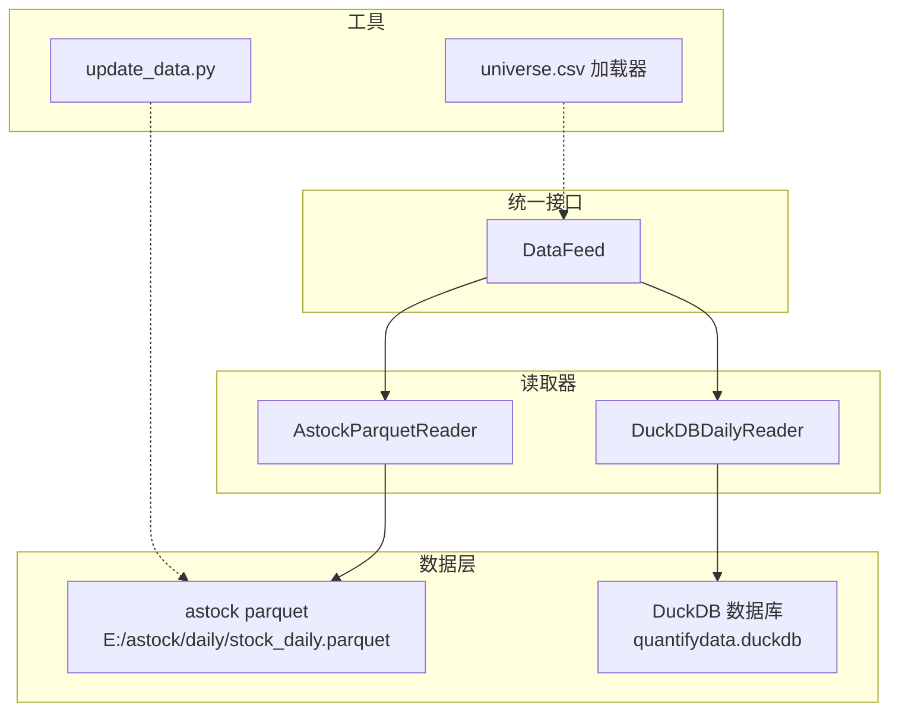
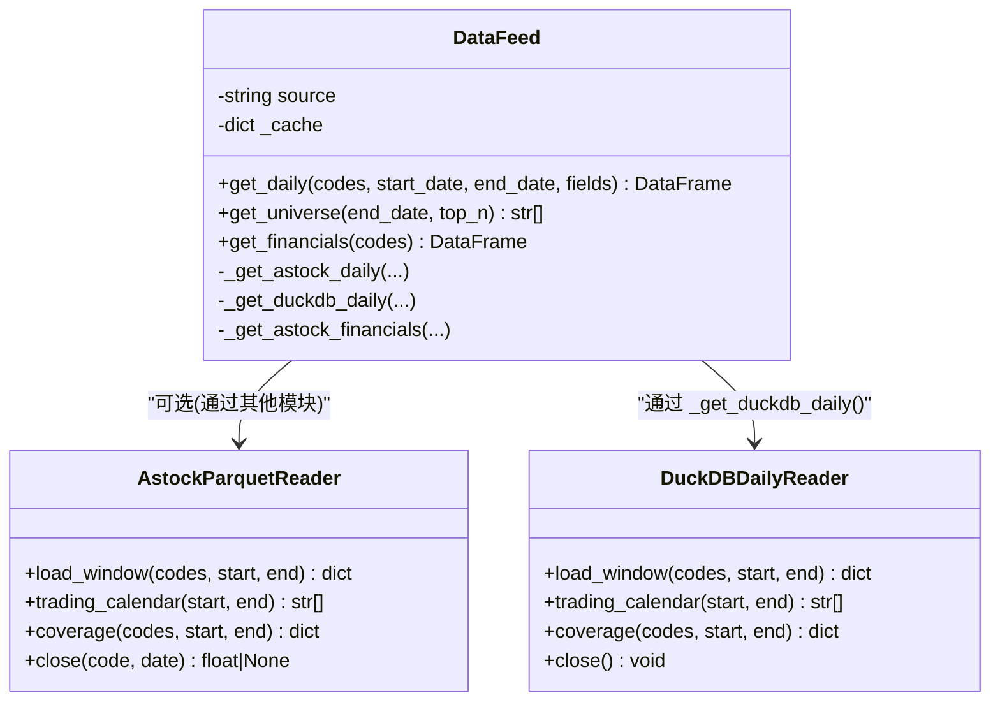
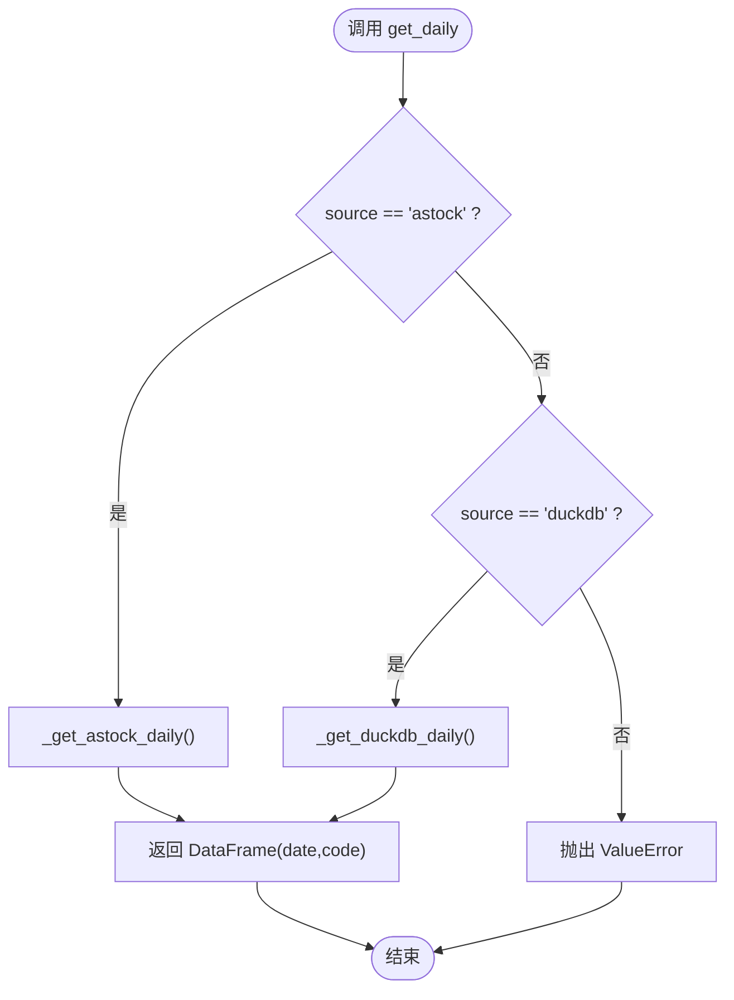
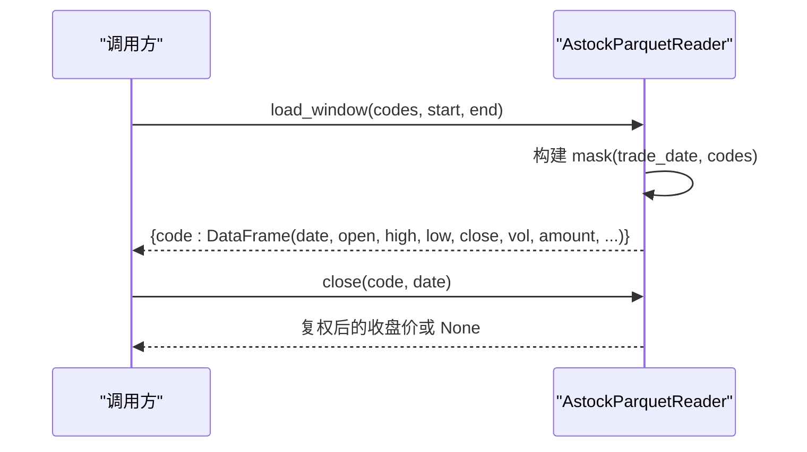
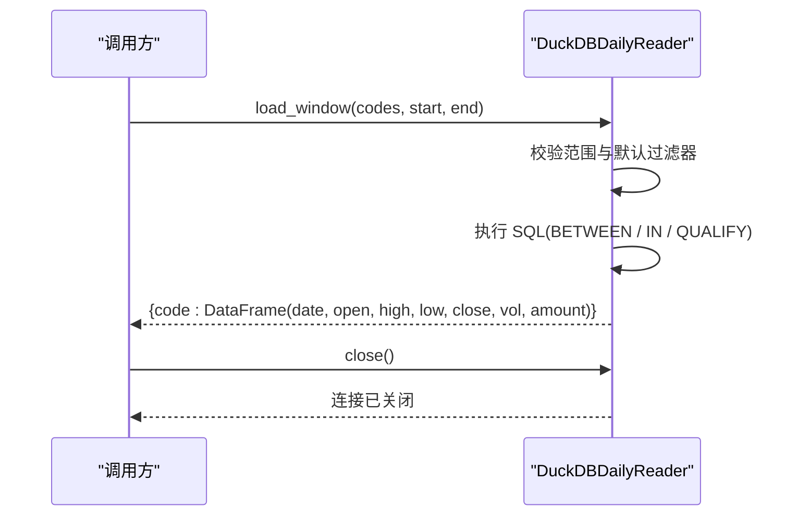
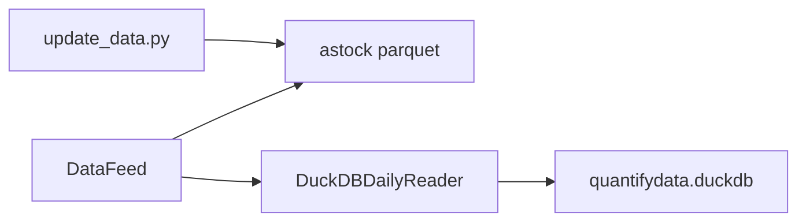

# 统一数据接口 DataFeed

<cite>
**本文引用的文件**   
- [data/feed.py](file://data/feed.py)
- [data/astock_reader.py](file://data/astock_reader.py)
- [data/duckdb_reader.py](file://data/duckdb_reader.py)
- [data/universe.py](file://data/universe.py)
- [scripts/update_data.py](file://scripts/update_data.py)
</cite>

## 目录
1. [简介](#简介)
2. [项目结构](#项目结构)
3. [核心组件](#核心组件)
4. [架构总览](#架构总览)
5. [详细组件分析](#详细组件分析)
6. [依赖关系分析](#依赖关系分析)
7. [性能与缓存优化](#性能与缓存优化)
8. [错误处理与数据校验](#错误处理与数据校验)
9. [使用示例与最佳实践](#使用示例与最佳实践)
10. [扩展指南：新增数据源实现](#扩展指南新增数据源实现)
11. [故障排查](#故障排查)
12. [结论](#结论)

## 简介
本文件为 QuantLab 的统一数据接口 DataFeed 提供完整文档。DataFeed 通过单一抽象接口屏蔽底层数据源差异，支持 astock parquet 与 DuckDB 两种读取路径，并提供统一的日线、股票池与财务数据获取能力。文档涵盖设计理念、方法语义、参数说明、缓存机制、错误处理、性能优化以及扩展新数据源的规范与实践。

## 项目结构
DataFeed 位于 data 模块中，围绕“统一接口 + 多实现”的架构组织：
- data/feed.py：统一接口 DataFeed 类与便捷函数 get_panel()
- data/astock_reader.py：AstockParquetReader（与 DuckDBDailyReader 同构的 duck-typed 读取器）
- data/duckdb_reader.py：DuckDBDailyReader（基于 DuckDB 的只读读取器）
- data/universe.py：Universe CSV 加载与校验工具
- scripts/update_data.py：数据更新脚本（用于维护 astock parquet 与衍生 CSV）

图表来源 
- [data/feed.py:17-41](file://data/feed.py#L17-L41)
- [data/astock_reader.py:25-70](file://data/astock_reader.py#L25-L70)
- [data/duckdb_reader.py:35-58](file://data/duckdb_reader.py#L35-L58)
- [data/universe.py:27-61](file://data/universe.py#L27-L61)
- [scripts/update_data.py:37-82](file://scripts/update_data.py#L37-L82)

章节来源
- [data/feed.py:17-41](file://data/feed.py#L17-L41)
- [data/astock_reader.py:25-70](file://data/astock_reader.py#L25-L70)
- [data/duckdb_reader.py:35-58](file://data/duckdb_reader.py#L35-L58)
- [data/universe.py:27-61](file://data/universe.py#L27-L61)
- [scripts/update_data.py:37-82](file://scripts/update_data.py#L37-L82)

## 核心组件
- DataFeed：统一数据访问入口，封装 source 路由与缓存
- AstockParquetReader：按列裁剪、MultiIndex 构建、窗口查询、调整因子处理
- DuckDBDailyReader：只读连接、SQL 过滤、去重策略、覆盖度统计
- Universe 加载器：CSV 校验、去重、启用标志解析
- update_data.py：增量合并 parquet、生成衍生指标 CSV

章节来源
- [data/feed.py:17-41](file://data/feed.py#L17-L41)
- [data/astock_reader.py:25-70](file://data/astock_reader.py#L25-L70)
- [data/duckdb_reader.py:35-58](file://data/duckdb_reader.py#L35-L58)
- [data/universe.py:27-61](file://data/universe.py#L27-L61)
- [scripts/update_data.py:37-82](file://scripts/update_data.py#L37-L82)

## 架构总览
DataFeed 采用“工厂式路由 + 适配器模式”：
- 构造时指定 source（"astock" 或 "duckdb"）
- get_daily() 根据 source 分派到具体实现
- 内部 _cache 缓存已加载的 parquet 数据，避免重复 IO
- 财务数据直接读取 parquet 并按 ts_code 过滤

图表来源 
- [data/feed.py:17-41](file://data/feed.py#L17-L41)
- [data/astock_reader.py:25-70](file://data/astock_reader.py#L25-L70)
- [data/duckdb_reader.py:35-58](file://data/duckdb_reader.py#L35-L58)

## 详细组件分析

### DataFeed 类
- 设计目标：以统一 API 暴露日线、股票池、财务数据；隐藏数据源差异
- 关键方法
  - get_daily(codes, start_date, end_date, fields)：返回 MultiIndex DataFrame（date, code）
  - get_universe(end_date, top_n)：按成交额排序选取最近交易日的 top_n 代码
  - get_financials(codes)：返回财务指标表（当前仅 astock 路径有效）
- 内部缓存：_cache 存储 astock parquet 全量数据，避免重复读取

图表来源 
- [data/feed.py:28-41](file://data/feed.py#L28-L41)

章节来源
- [data/feed.py:17-41](file://data/feed.py#L17-L41)
- [data/feed.py:43-69](file://data/feed.py#L43-L69)
- [data/feed.py:71-134](file://data/feed.py#L71-L134)

### AstockParquetReader
- 只读读取，按列裁剪降低内存占用
- 自动构建 (trade_date, ts_code) MultiIndex 以匹配 duck-typed 契约
- load_window() 支持日期区间与代码过滤，输出对齐 DuckDBDailyReader
- close(code, date) 支持单值收盘价读取并应用复权因子

图表来源 
- [data/astock_reader.py:71-116](file://data/astock_reader.py#L71-L116)
- [data/astock_reader.py:163-185](file://data/astock_reader.py#L163-L185)

章节来源
- [data/astock_reader.py:25-70](file://data/astock_reader.py#L25-L70)
- [data/astock_reader.py:71-116](file://data/astock_reader.py#L71-L116)
- [data/astock_reader.py:163-185](file://data/astock_reader.py#L163-L185)

### DuckDBDailyReader
- 只读连接，默认按 adjustment/source 过滤
- load_window() 执行 SQL 查询，按 code/date 分组输出字典
- coverage() 返回数据覆盖度统计（最小/最大日期、去重行数等）
- close() 安全关闭连接

图表来源 
- [data/duckdb_reader.py:90-132](file://data/duckdb_reader.py#L90-L132)
- [data/duckdb_reader.py:146-205](file://data/duckdb_reader.py#L146-L205)
- [data/duckdb_reader.py:207-215](file://data/duckdb_reader.py#L207-L215)

章节来源
- [data/duckdb_reader.py:35-58](file://data/duckdb_reader.py#L35-L58)
- [data/duckdb_reader.py:90-132](file://data/duckdb_reader.py#L90-L132)
- [data/duckdb_reader.py:146-205](file://data/duckdb_reader.py#L146-L205)

### Universe 加载器
- 首列必须为 code，正则校验股票代码格式
- enabled 字段解析（false/0/no/空视为禁用）
- 去重保留首次出现，记录丢弃原因
- 空结果抛错，保证下游可用性

章节来源
- [data/universe.py:27-61](file://data/universe.py#L27-L61)

## 依赖关系分析
- DataFeed 对 astock 路径直接读取 parquet；对 duckdb 路径通过 DuckDBDailyReader 间接读取
- AstockParquetReader 与 DuckDBDailyReader 保持 duck-typed 一致性，便于替换
- update_data.py 负责维护 astock parquet 与衍生 CSV，确保数据新鲜度

图表来源 
- [data/feed.py:17-41](file://data/feed.py#L17-L41)
- [data/astock_reader.py:25-70](file://data/astock_reader.py#L25-L70)
- [data/duckdb_reader.py:35-58](file://data/duckdb_reader.py#L35-L58)
- [scripts/update_data.py:37-82](file://scripts/update_data.py#L37-L82)

章节来源
- [data/feed.py:17-41](file://data/feed.py#L17-L41)
- [data/astock_reader.py:25-70](file://data/astock_reader.py#L25-L70)
- [data/duckdb_reader.py:35-58](file://data/duckdb_reader.py#L35-L58)
- [scripts/update_data.py:37-82](file://scripts/update_data.py#L37-L82)

## 性能与缓存优化
- DataFeed._cache：缓存 astock parquet 全量数据，避免重复 IO
- AstockParquetReader：仅读取回测所需列，显著降低内存占用
- DuckDBDailyReader：只读连接、SQL 层面过滤与去重，减少 Python 侧计算
- get_universe()：基于成交额排序，快速筛选头部标的
- get_panel()：将财务指标透视并按交易日前向填充，避免缺失值影响

章节来源
- [data/feed.py:20-26](file://data/feed.py#L20-L26)
- [data/feed.py:43-63](file://data/feed.py#L43-L63)
- [data/astock_reader.py:47-56](file://data/astock_reader.py#L47-L56)
- [data/duckdb_reader.py:90-132](file://data/duckdb_reader.py#L90-L132)
- [data/feed.py:137-181](file://data/feed.py#L137-L181)

## 错误处理与数据校验
- DataFeed.get_daily()：未知 source 抛出 ValueError
- AstockParquetReader：adjustment 非法、文件不存在、索引列缺失均抛错
- DuckDBDailyReader：data_source 非法、文件不存在、请求范围超出覆盖度抛错
- Universe 加载器：首列非 code、无效代码、空结果均抛错或警告

章节来源
- [data/feed.py:36-41](file://data/feed.py#L36-L41)
- [data/astock_reader.py:35-41](file://data/astock_reader.py#L35-L41)
- [data/duckdb_reader.py:42-48](file://data/duckdb_reader.py#L42-L48)
- [data/duckdb_reader.py:90-97](file://data/duckdb_reader.py#L90-L97)
- [data/universe.py:27-61](file://data/universe.py#L27-L61)

## 使用示例与最佳实践
以下为典型用法步骤（不展示具体代码内容，仅提供路径参考）：
- 初始化 DataFeed
  - 参考：[data/feed.py:188-196](file://data/feed.py#L188-L196)
- 获取股票池（按成交额排序）
  - 参考：[data/feed.py:43-63](file://data/feed.py#L43-L63)
- 查询日线数据（MultiIndex DataFrame）
  - 参考：[data/feed.py:28-41](file://data/feed.py#L28-L41)
- 查询财务数据（astock 路径）
  - 参考：[data/feed.py:65-69](file://data/feed.py#L65-L69)
- 构建面板与财务前向填充
  - 参考：[data/feed.py:137-181](file://data/feed.py#L137-L181)

最佳实践
- 优先使用 get_universe() 动态选择标的，避免静态池带来的生存偏差
- 在 get_daily() 中明确 fields 列表，减少不必要列传输
- 对 DuckDB 路径，合理设置 default_filters 以减少数据扫描
- 对 astock 路径，利用 _cache 避免重复读取大文件

## 扩展指南：新增数据源实现
目标：在不改动 DataFeed 上层调用的前提下，新增一种数据源（例如本地 SQLite、云端 API）。

步骤
- 定义新的读取器类，遵循 duck-typed 接口（至少实现 load_window/coding/date 过滤），如 AstockParquetReader 与 DuckDBDailyReader 所示
- 在 DataFeed 中添加分支逻辑，识别新的 source 字符串并路由到新实现
- 若需要缓存，复用 _cache 键名约定，避免冲突
- 完善错误处理与数据校验，确保异常信息清晰可定位

建议规范
- 输入输出对齐：统一 date/code 维度与列名（open/high/low/close/vol/amount 等）
- 只读约束：禁止写入底层数据源
- 覆盖度报告：提供 coverage() 以便上层做范围校验
- 资源清理：提供 close() 并在 finally 中调用

章节来源
- [data/astock_reader.py:25-70](file://data/astock_reader.py#L25-L70)
- [data/duckdb_reader.py:35-58](file://data/duckdb_reader.py#L35-L58)
- [data/feed.py:28-41](file://data/feed.py#L28-L41)

## 故障排查
常见问题与定位
- FileNotFoundError：检查 astock parquet 或 DuckDB 文件路径是否存在
  - 参考：[data/astock_reader.py:40-41](file://data/astock_reader.py#L40-L41)、[data/duckdb_reader.py:47-48](file://data/duckdb_reader.py#L47-L48)
- ValueError：codes 为空、日期范围越界、source 未知、adjustment 非法
  - 参考：[data/astock_reader.py:77-91](file://data/astock_reader.py#L77-L91)、[data/duckdb_reader.py:90-97](file://data/duckdb_reader.py#L90-L97)、[data/feed.py:36-41](file://data/feed.py#L36-L41)
- 数据为空：确认 universe 是否有效、日期范围是否正确
  - 参考：[data/universe.py:58-61](file://data/universe.py#L58-L61)
- WAL 检测告警：DuckDB 同步中导致哈希不稳定，等待同步完成再跑
  - 参考：[data/duckdb_reader.py:63-75](file://data/duckdb_reader.py#L63-L75)

章节来源
- [data/astock_reader.py:40-41](file://data/astock_reader.py#L40-L41)
- [data/duckdb_reader.py:47-48](file://data/duckdb_reader.py#L47-L48)
- [data/duckdb_reader.py:63-75](file://data/duckdb_reader.py#L63-L75)
- [data/universe.py:58-61](file://data/universe.py#L58-L61)
- [data/feed.py:36-41](file://data/feed.py#L36-L41)

## 结论
DataFeed 通过统一接口屏蔽了 astock parquet 与 DuckDB 的差异，提供了稳定高效的日线、股票池与财务数据访问能力。借助缓存、列裁剪、SQL 过滤与前向填充等优化手段，在保证正确性的同时显著提升性能。未来扩展新数据源只需遵循 duck-typed 接口与路由规范，即可无缝接入现有生态。