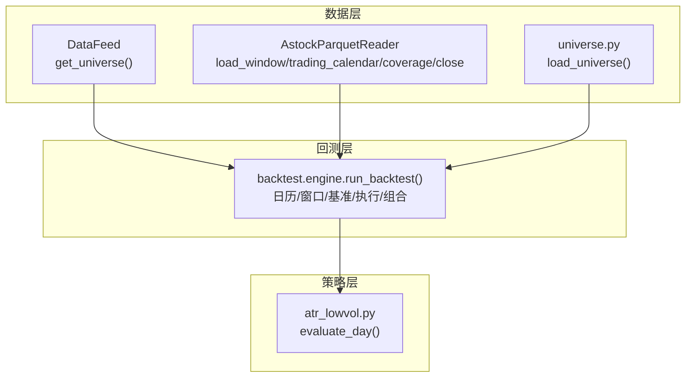
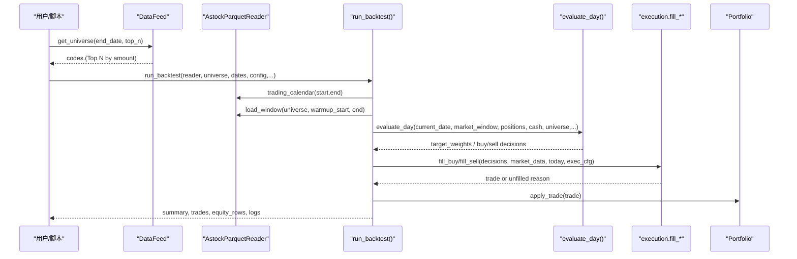
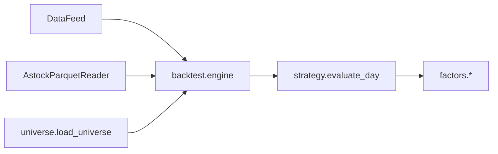

# 股票池管理

<cite>
**本文引用的文件**   
- [data/feed.py](file://data/feed.py)
- [data/universe.py](file://data/universe.py)
- [data/astock_reader.py](file://data/astock_reader.py)
- [backtest/engine.py](file://backtest/engine.py)
- [strategy/atr_lowvol.py](file://strategy/atr_lowvol.py)
- [projects/Project_01_多因子IC小盘Alpha/research/multi_factor_ic/data_loader.py](file://projects/Project_01_多因子IC小盘Alpha/research/multi_factor_ic/data_loader.py)
- [config/settings.yaml](file://config/settings.yaml)
</cite>

## 目录
1. [简介](#简介)
2. [项目结构](#项目结构)
3. [核心组件](#核心组件)
4. [架构总览](#架构总览)
5. [详细组件分析](#详细组件分析)
6. [依赖关系分析](#依赖关系分析)
7. [性能考量](#性能考量)
8. [故障排查指南](#故障排查指南)
9. [结论](#结论)
10. [附录：示例与最佳实践](#附录示例与最佳实践)

## 简介
本文件面向 QuantLab 股票池管理系统，系统性阐述股票池的定义、筛选规则（按成交额排序、流动性筛选、ST股过滤等）、动态构建与调整方法，以及回测引擎的集成方式与数据同步机制。文档同时覆盖新股上市、退市处理、更新策略与维护最佳实践，并给出质量评估与监控指标建议，帮助读者从入门到生产级使用。

## 项目结构
QuantLab 将“数据读取”“股票池定义”“回测执行”“策略选股”分层组织：
- 数据层：统一数据接口与专用 reader（parquet/DuckDB）
- 股票池层：CSV 静态池 + 数据源动态池（按成交额/流动性/ST 过滤）
- 回测层：引擎负责日历、窗口切片、基准对齐、交易执行与组合记账
- 策略层：在调仓日输出目标权重或买卖决策，内部可包含 ST/流动性/波动率等门控

图表来源
- [data/feed.py:43-63](file://data/feed.py#L43-L63)
- [data/astock_reader.py:25-70](file://data/astock_reader.py#L25-L70)
- [data/universe.py:27-61](file://data/universe.py#L27-L61)
- [backtest/engine.py:237-326](file://backtest/engine.py#L237-L326)
- [strategy/atr_lowvol.py:78-165](file://strategy/atr_lowvol.py#L78-L165)

章节来源
- [data/feed.py:1-197](file://data/feed.py#L1-L197)
- [data/astock_reader.py:1-192](file://data/astock_reader.py#L1-L192)
- [data/universe.py:1-62](file://data/universe.py#L1-L62)
- [backtest/engine.py:1-619](file://backtest/engine.py#L1-L619)
- [strategy/atr_lowvol.py:1-165](file://strategy/atr_lowvol.py#L1-L165)

## 核心组件
- DataFeed.get_universe(): 基于日线数据，按最近交易日成交额降序返回 Top N 代码列表，支持指定截止日期。
- AstockParquetReader: 提供 load_window/trading_calendar/coverage/close 四方法契约，供回测引擎高效拉取 OHLCV 与衍生字段（含 turnover_rate、is_st）。
- backtest.engine.run_backtest(): 主循环，串联 reader -> strategy -> execution -> portfolio -> metrics；支持 universe_by_date（PIT 模式）实现按日快照的动态股票池。
- data/universe.load_universe(): 加载 CSV 静态股票池，校验 code 格式、去重、enabled 开关、空池报错。
- 策略 evaluate_day(): 在调仓日对 universe 进行流动性（换手率区间）、ST 过滤、ATR% 阈值、质量（ROE>0）、动量（12-1月收益>0）门控后，按 ATR% 升序选出持仓。

章节来源
- [data/feed.py:43-63](file://data/feed.py#L43-L63)
- [data/astock_reader.py:71-116](file://data/astock_reader.py#L71-L116)
- [backtest/engine.py:237-326](file://backtest/engine.py#L237-L326)
- [data/universe.py:27-61](file://data/universe.py#L27-L61)
- [strategy/atr_lowvol.py:99-141](file://strategy/atr_lowvol.py#L99-L141)

## 架构总览
下图展示“数据源 -> 股票池 -> 回测引擎 -> 策略”的数据流与控制流。

图表来源
- [data/feed.py:43-63](file://data/feed.py#L43-L63)
- [data/astock_reader.py:71-116](file://data/astock_reader.py#L71-L116)
- [backtest/engine.py:265-326](file://backtest/engine.py#L265-L326)
- [strategy/atr_lowvol.py:99-165](file://strategy/atr_lowvol.py#L99-L165)
- [backtest/engine.py:328-373](file://backtest/engine.py#L328-L373)

## 详细组件分析

### 1) DataFeed.get_universe(): 按成交额排序的动态股票池
- 输入参数
  - end_date: 截止日期（可选），用于限定最新可用交易日
  - top_n: 返回数量（默认 500）
- 处理逻辑
  - 通过 get_daily() 获取 MultiIndex DataFrame（date, code）
  - 定位最新日期（或 <= end_date 的最新交易日）
  - 若存在 amount 列，按 amount 降序取前 top_n 作为股票池
  - 若无 amount 列，则直接取前 top_n 行
- 适用场景
  - 快速构建流动性优先的股票池
  - 配合回测中的 universe_by_date 实现 PIT 动态池

章节来源
- [data/feed.py:43-63](file://data/feed.py#L43-L63)

### 2) AstockParquetReader: 数据读取与字段契约
- 关键能力
  - load_window(codes, start_date, end_date): 返回 {code: DataFrame}，包含 date/open/high/low/close/vol/amount/circ_mv/pe_ttm/pb/ps_ttm/dv_ttm/turnover_rate/is_st
  - trading_calendar(start_date, end_date): 返回交易日字符串列表
  - coverage(...): 返回数据覆盖信息（最小/最大日期、代码数、去重统计等）
  - close(code, date): 单点收盘价查询（支持复权）
- 设计要点
  - 仅读取必要列，降低内存占用
  - 以 trade_date/ts_code 为 MultiIndex，便于高效切片
  - 支持 raw/qfq/hfq 三种复权方式

章节来源
- [data/astock_reader.py:25-70](file://data/astock_reader.py#L25-L70)
- [data/astock_reader.py:71-116](file://data/astock_reader.py#L71-L116)
- [data/astock_reader.py:118-161](file://data/astock_reader.py#L118-L161)
- [data/astock_reader.py:163-185](file://data/astock_reader.py#L163-L185)

### 3) backtest.engine.run_backtest(): 回测主循环与 PIT 动态池
- 核心流程
  - 计算交易日历与预热窗口
  - 拉取市场数据窗口，预计算 cut_index 加速每日切片
  - 加载基准序列并对齐日历
  - 支持 universe_by_date（PIT 模式）：按交易日推进，维护 per_day_universe
  - 调用策略 evaluate_day，得到目标权重或买卖决策
  - 执行成交、更新组合、记录日志与诊断
- 关键参数
  - universe: 静态股票池（list of code）
  - universe_by_date: {as_of_date_str: [codes]}，启用 PIT 动态池
  - fundamentals_reader: 可选基本面读取器，注入 aux_data 给策略评分
  - industry_map: 行业上限控制映射

章节来源
- [backtest/engine.py:237-326](file://backtest/engine.py#L237-L326)
- [backtest/engine.py:298-309](file://backtest/engine.py#L298-L309)
- [backtest/engine.py:384-443](file://backtest/engine.py#L384-L443)

### 4) data/universe.load_universe(): 静态 CSV 股票池
- 规则
  - 首列必须为 code，且匹配正则 ^\d{6}\.(SZ|SH)$
  - enabled 字段支持 false/0/no/空视为禁用
  - 重复 code 保留首次出现，后续跳过并告警
  - 空池抛出异常
- 输出
  - codes: 有效代码列表
  - records: 包含 code/name/sector/enabled 的结构化记录
  - dropped_codes: 被丢弃的代码列表

章节来源
- [data/universe.py:27-61](file://data/universe.py#L27-L61)

### 5) 策略选股与流动性/ST 门控（以 atr_lowvol 为例）
- 调仓频率：由配置决定（如 monthly/quarterly）
- 候选过滤
  - 历史长度 >= min_history
  - 换手率区间 [turnover_min, turnover_max]
  - is_st == False
  - ATR% <= atr_pct_max
  - 质量门控：ROE > 0（可配置）
  - 动量门控：12-1 月收益 > 0（可配置）
- 排序与选择：按 ATR% 升序选取前 n_hold 只
- 输出：target_weights（等权）或 sell/buy 决策

章节来源
- [strategy/atr_lowvol.py:99-141](file://strategy/atr_lowvol.py#L99-L141)
- [strategy/atr_lowvol.py:139-141](file://strategy/atr_lowvol.py#L139-L141)

### 6) 动态滚动股票池（市值区间）示例
- 思路：在面板数据上按日期滚动，计算当日流通市值排名，取区间 [START, END) 作为当日股票池
- 用途：消除生存偏差，贴近实盘可交易范围

章节来源
- [projects/Project_01_多因子IC小盘Alpha/research/multi_factor_ic/data_loader.py:35-50](file://projects/Project_01_多因子IC小盘Alpha/research/multi_factor_ic/data_loader.py#L35-L50)

## 依赖关系分析
- DataFeed 依赖 astock parquet 或 DuckDB 数据源
- AstockParquetReader 提供 reader 契约，被 backtest.engine 消费
- backtest.engine 依赖 strategy.registry 注册策略，调用 evaluate_day
- 策略依赖 factors（如 ATR、ROE）与调度模块（rebalance 频率）
- 静态股票池由 data/universe 提供，可与动态池并行使用

图表来源
- [data/feed.py:43-63](file://data/feed.py#L43-L63)
- [data/astock_reader.py:71-116](file://data/astock_reader.py#L71-L116)
- [data/universe.py:27-61](file://data/universe.py#L27-L61)
- [backtest/engine.py:237-326](file://backtest/engine.py#L237-L326)
- [strategy/atr_lowvol.py:99-165](file://strategy/atr_lowvol.py#L99-L165)

## 性能考量
- 数据读取
  - 仅读取必要列，避免全表扫描
  - 使用 MultiIndex 与 searchsorted 预计算 cut_index，实现 O(1) 每日切片
- 内存与缓存
  - AstockParquetReader 缓存 _dates/_codes/_coverage_cache
  - DataFeed 对 parquet 做简单缓存
- 基准对齐
  - 基准缺失时向前填充，减少断点对指标的影响
- 建议
  - 合理设置 warmup 天数，确保指标稳定
  - 使用 universe_by_date 避免全量代码每次切片

章节来源
- [data/astock_reader.py:47-70](file://data/astock_reader.py#L47-L70)
- [backtest/engine.py:121-146](file://backtest/engine.py#L121-L146)
- [backtest/engine.py:38-99](file://backtest/engine.py#L38-L99)

## 故障排查指南
- 常见错误
  - 空股票池：CSV 未包含有效 code 或全部 disabled
  - 无交易日历：起止日期内无数据
  - 基准不可用：路径不存在或窗口内无数据
  - 未成交订单：停牌/涨跌停/ST限制导致
- 定位方法
  - 检查 reader.coverage() 的 universe_coverage 字段，确认 missing codes
  - 查看 daily_logs 中 unfilled_order 原因
  - 核对 is_st/turnover_rate/amount 字段是否存在与取值范围
- 修复建议
  - 修正 CSV 编码与首列名
  - 扩大时间窗口或调整起始日期
  - 补充基准数据库或放宽窗口要求
  - 在策略层增加流动性/ST 过滤，减少不可成交标的

章节来源
- [data/universe.py:58-61](file://data/universe.py#L58-L61)
- [backtest/engine.py:265-268](file://backtest/engine.py#L265-L268)
- [backtest/engine.py:328-373](file://backtest/engine.py#L328-L373)

## 结论
QuantLab 的股票池管理兼顾静态与动态两种模式：CSV 静态池保证可追溯与一致性，DataFeed 与 AstockParquetReader 提供高吞吐数据读取与灵活筛选；回测引擎通过 universe_by_date 实现 PIT 动态池，策略层内置流动性与 ST 门控，形成从数据到交易的完整闭环。通过合理的更新策略与监控指标，可在实盘中稳健运行。

## 附录：示例与最佳实践

### 1) get_universe() 方法与参数说明
- 方法位置：data/feed.py
- 参数
  - end_date: 截止日期（可选）
  - top_n: 返回数量（默认 500）
- 行为
  - 基于最近交易日成交额降序返回 Top N 代码
  - 若无 amount 列，退化为顺序截取

章节来源
- [data/feed.py:43-63](file://data/feed.py#L43-L63)

### 2) 动态构建与调整股票池（示例思路）
- 按成交额排序：使用 DataFeed.get_universe(end_date, top_n)
- 流动性筛选：在策略层按 turnover_rate 区间过滤
- ST 过滤：依据 is_st 字段剔除
- 滚动市值区间：参考 multi_factor_ic/data_loader.get_universe_at_date()

章节来源
- [data/feed.py:43-63](file://data/feed.py#L43-L63)
- [strategy/atr_lowvol.py:114-120](file://strategy/atr_lowvol.py#L114-L120)
- [projects/Project_01_多因子IC小盘Alpha/research/multi_factor_ic/data_loader.py:35-50](file://projects/Project_01_多因子IC小盘Alpha/research/multi_factor_ic/data_loader.py#L35-L50)

### 3) 与回测引擎集成与数据同步
- 静态池：传入 universe=list(codes)
- 动态池：传入 universe_by_date={as_of_date: [codes]}，引擎自动推进 per_day_universe
- 数据同步：reader.trading_calendar 与 load_window 保证日历与窗口一致

章节来源
- [backtest/engine.py:298-309](file://backtest/engine.py#L298-L309)
- [backtest/engine.py:265-278](file://backtest/engine.py#L265-L278)

### 4) 股票池更新策略与维护最佳实践
- 更新频率
  - 日线级：每日收盘后更新 universe_by_date 快照
  - 周度/月度：结合调仓频率批量生成快照
- 数据质量
  - 校验 code 格式与 enabled 状态
  - 监控 missing codes 比例与覆盖率
- 特殊事件
  - 新股上市：纳入 universe_by_date 快照，确保有足够历史窗口
  - 退市/ST：及时移除或标记，避免参与选股与交易

章节来源
- [data/universe.py:27-61](file://data/universe.py#L27-L61)
- [backtest/engine.py:298-309](file://backtest/engine.py#L298-L309)

### 5) 股票池质量评估与监控指标
- 覆盖率：universe_coverage.codes_with_missing / universe_size
- 流动性分布：日均成交额分位数、换手率区间占比
- ST 占比：is_st=True 的比例
- 可交易性：未成交订单比例与原因分布
- 稳定性：每日股票池 Jaccard 相似度（相邻日）

章节来源
- [backtest/engine.py:562-574](file://backtest/engine.py#L562-L574)
- [data/astock_reader.py:128-161](file://data/astock_reader.py#L128-L161)

### 6) 配置项参考
- settings.yaml 中定义了默认股票池类别（small_cap/mid_cap/large_cap）及市值区间，可作为动态池的辅助约束

章节来源
- [config/settings.yaml:52-63](file://config/settings.yaml#L52-L63)