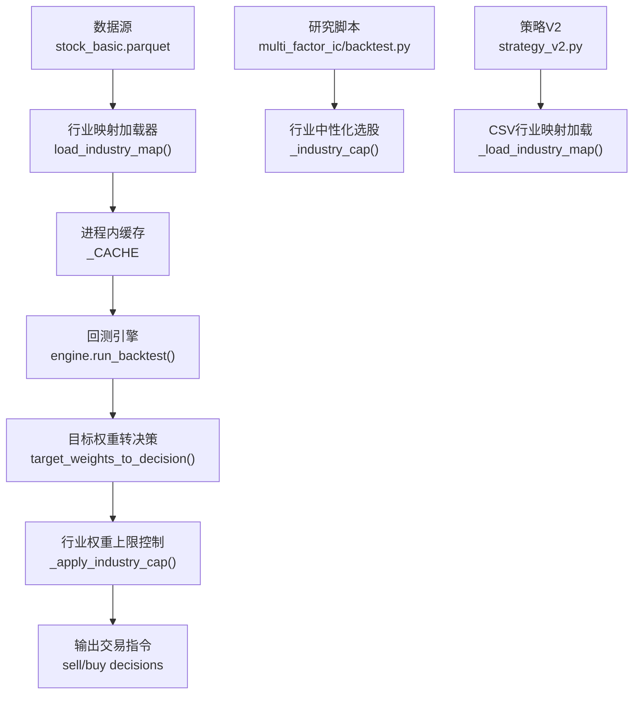
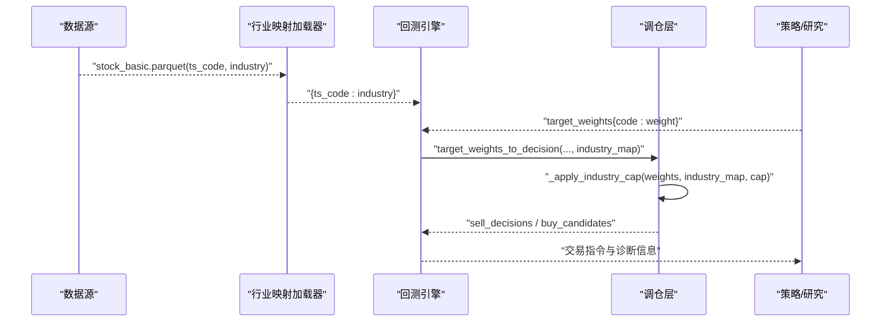
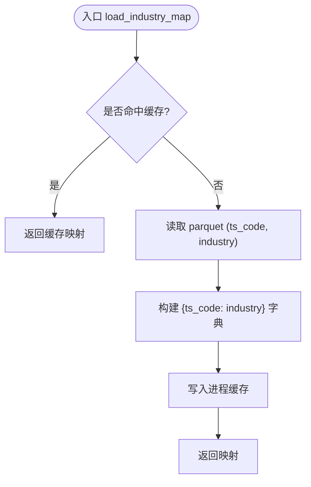
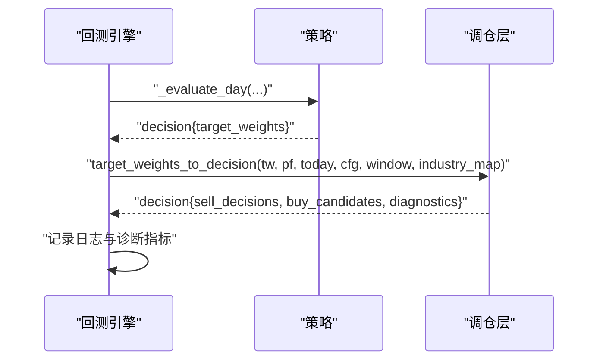
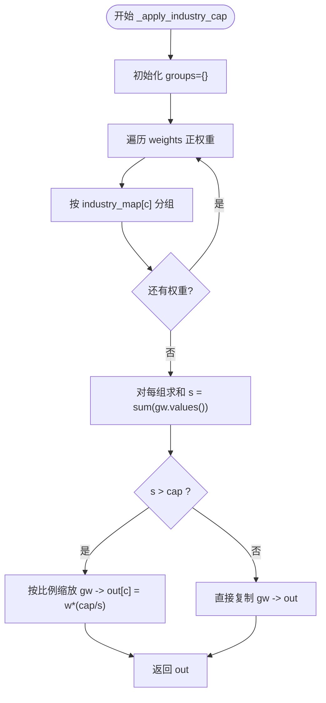
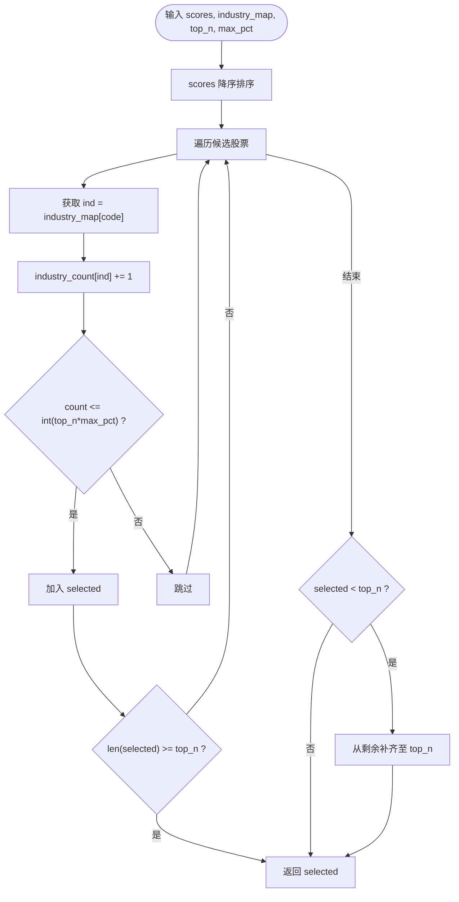
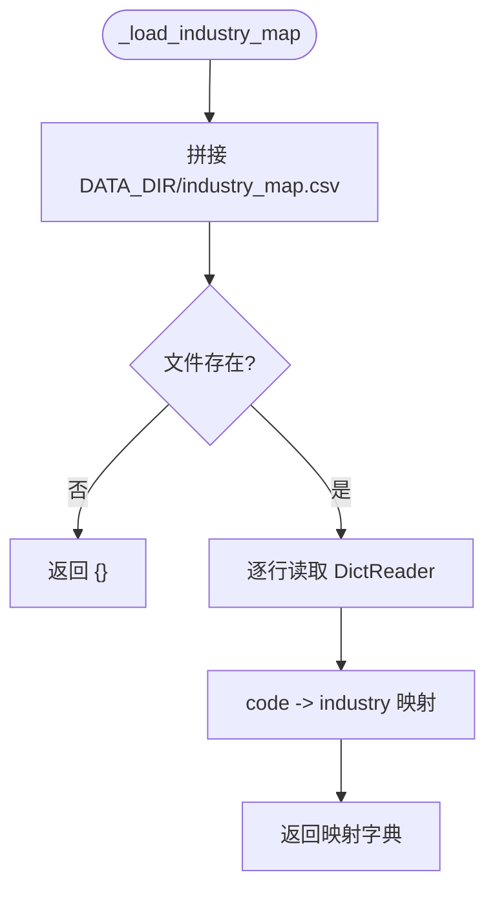
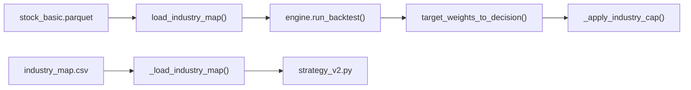

# 行业映射系统

<cite>
**本文引用的文件**   
- [data/industry_map.py](file://data/industry_map.py)
- [backtest/engine.py](file://backtest/engine.py)
- [backtest/rebalance.py](file://backtest/rebalance.py)
- [projects/Project_01_多因子IC小盘Alpha/research/multi_factor_ic/backtest.py](file://projects/Project_01_多因子IC小盘Alpha/research/multi_factor_ic/backtest.py)
- [projects/Project_10_价值小盘V2/strategy_v2.py](file://projects/Project_10_价值小盘V2/strategy_v2.py)
- [config/settings.yaml](file://config/settings.yaml)
- [config/atr_lowvol_fw.yaml](file://config/atr_lowvol_fw.yaml)
- [config/atr_lowvol_fw_leveraged.yaml](file://config/atr_lowvol_fw_leveraged.yaml)
</cite>

## 目录
1. [简介](#简介)
2. [项目结构](#项目结构)
3. [核心组件](#核心组件)
4. [架构总览](#架构总览)
5. [详细组件分析](#详细组件分析)
6. [依赖关系分析](#依赖关系分析)
7. [性能考量](#性能考量)
8. [故障排查指南](#故障排查指南)
9. [结论](#结论)
10. [附录](#附录)

## 简介
本文件面向 QuantLab 的行业映射与行业中性化能力，系统性说明：
- 行业分类标准与映射来源（申万行业、证监会行业等口径的接入方式）
- 行业标签生成逻辑与更新机制
- 在回测引擎中的行业权重上限控制（industry_cap）
- 行业分组分析与行业中性化选股示例
- 行业数据在因子分析与策略开发中的应用场景
- 行业轮动策略的数据支持与实现思路
- 行业分类变更与异常情况的处理策略

## 项目结构
QuantLab 中与行业映射相关的代码主要分布在以下位置：
- 数据层：加载 stock_basic.parquet 中的 industry 字段，构建 ts_code -> 行业 的映射字典
- 回测层：将行业映射作为 overlay 注入到调仓阶段，执行单行业权重上限控制
- 研究层：在多因子 IC 研究中实现“按行业计数”的中性化选股
- 实盘/策略层：从 CSV 加载行业映射，用于盘中风控与交易过滤

**图表来源** 
- [data/industry_map.py:16-36](file://data/industry_map.py#L16-L36)
- [backtest/engine.py:257-423](file://backtest/engine.py#L257-L423)
- [backtest/rebalance.py:64-82](file://backtest/rebalance.py#L64-L82)
- [projects/Project_01_多因子IC小盘Alpha/research/multi_factor_ic/backtest.py:14-39](file://projects/Project_01_多因子IC小盘Alpha/research/multi_factor_ic/backtest.py#L14-L39)
- [projects/Project_10_价值小盘V2/strategy_v2.py:161-177](file://projects/Project_10_价值小盘V2/strategy_v2.py#L161-L177)

**章节来源**
- [data/industry_map.py:1-41](file://data/industry_map.py#L1-L41)
- [backtest/engine.py:250-449](file://backtest/engine.py#L250-L449)
- [backtest/rebalance.py:1-281](file://backtest/rebalance.py#L1-L281)
- [projects/Project_01_多因子IC小盘Alpha/research/multi_factor_ic/backtest.py:1-200](file://projects/Project_01_多因子IC小盘Alpha/research/multi_factor_ic/backtest.py#L1-L200)
- [projects/Project_10_价值小盘V2/strategy_v2.py:160-359](file://projects/Project_10_价值小盘V2/strategy_v2.py#L160-L359)

## 核心组件
- 行业映射加载器
  - 功能：读取 parquet 中的 ts_code 与 industry 字段，返回 {ts_code: industry} 映射；支持进程级缓存与强制刷新
  - 关键点：路径绝对化后缓存；缺失行业时返回空串；提供 clear_cache() 清空缓存
- 回测引擎集成
  - 功能：在 run_backtest 中接收 industry_map 参数，并在 target_weights_to_decision 调用处传入
  - 关键点：industry_map 为可选 overlay，不影响主流程，失败会降级并记录日志
- 行业权重上限控制
  - 功能：对每个行业的总权重进行上限 cap 控制，按比例缩放该行业内各标的权重
  - 关键点：未映射行业标记为 UNKNOWN；cap<=0 时关闭；比例缩放保持相对权重不变
- 研究层行业中性化选股
  - 功能：在评分排序基础上限制单行业入选数量（top_n * max_pct），不足时再补足
  - 关键点：适用于月度/双月/季度等多频回测；可对比中性化前后绩效
- 策略层行业映射加载
  - 功能：从 CSV 加载 ts_code, industry 列，构建映射字典供策略使用
  - 关键点：容错读取，不存在文件或列名异常时返回空映射

**章节来源**
- [data/industry_map.py:16-41](file://data/industry_map.py#L16-L41)
- [backtest/engine.py:257-423](file://backtest/engine.py#L257-L423)
- [backtest/rebalance.py:64-82](file://backtest/rebalance.py#L64-L82)
- [projects/Project_01_多因子IC小盘Alpha/research/multi_factor_ic/backtest.py:14-39](file://projects/Project_01_多因子IC小盘Alpha/research/multi_factor_ic/backtest.py#L14-L39)
- [projects/Project_10_价值小盘V2/strategy_v2.py:161-177](file://projects/Project_10_价值小盘V2/strategy_v2.py#L161-L177)

## 架构总览
下图展示行业映射在回测与研究中的整体流转：数据源经加载器生成映射，回测引擎在调仓阶段应用行业上限控制，研究脚本在选股阶段应用行业中性化。

**图表来源** 
- [data/industry_map.py:16-36](file://data/industry_map.py#L16-L36)
- [backtest/engine.py:408-423](file://backtest/engine.py#L408-L423)
- [backtest/rebalance.py:101-162](file://backtest/rebalance.py#L101-L162)

## 详细组件分析

### 行业映射加载器（Parquet 源）
- 输入：parquet 文件路径（默认 ASTOCK_BASIC_PATH），包含 ts_code 与 industry 列
- 输出：{ts_code: industry} 映射字典；缺失行业时值为空串
- 缓存：按绝对路径缓存至 _CACHE；支持 refresh=True 强制重读；提供 clear_cache()
- 错误处理：文件不存在抛出 FileNotFoundError

**图表来源** 
- [data/industry_map.py:16-36](file://data/industry_map.py#L16-L36)

**章节来源**
- [data/industry_map.py:1-41](file://data/industry_map.py#L1-L41)

### 回测引擎中的行业映射注入
- 入口：run_backtest 接受 industry_map 参数
- 调用点：在每日评估后，若策略返回 target_weights，则调用 target_weights_to_decision 并传入 industry_map
- 容错：转换失败会捕获异常并降级为空的 sell/buy 列表，同时记录警告日志

**图表来源** 
- [backtest/engine.py:408-423](file://backtest/engine.py#L408-L423)
- [backtest/rebalance.py:101-162](file://backtest/rebalance.py#L101-L162)

**章节来源**
- [backtest/engine.py:250-449](file://backtest/engine.py#L250-L449)
- [backtest/rebalance.py:101-162](file://backtest/rebalance.py#L101-L162)

### 行业权重上限控制（industry_cap）
- 触发条件：配置项 industry_cap > 0
- 算法：按行业分组汇总权重，若某行业总权重大于 cap，则对该行业内所有标的权重按比例缩放，使总和降至 cap
- 未映射处理：未知行业标记为 UNKNOWN，单独成组参与计算
- 日志：当发生裁剪时记录 before/after 暴露度变化

**图表来源** 
- [backtest/rebalance.py:64-82](file://backtest/rebalance.py#L64-L82)

**章节来源**
- [backtest/rebalance.py:64-82](file://backtest/rebalance.py#L64-L82)

### 研究层行业中性化选股（TOP-N + 行业计数）
- 目的：在评分排序基础上限制单行业入选数量，避免行业集中度过高
- 方法：按 scores 降序遍历，统计各行业已选数量，超过 top_n * max_pct 则跳过；若最终不足 top_n，再从剩余补齐
- 适用：月度/双月/季度等多频回测；可与动态 universe 结合

**图表来源** 
- [projects/Project_01_多因子IC小盘Alpha/research/multi_factor_ic/backtest.py:14-39](file://projects/Project_01_多因子IC小盘Alpha/research/multi_factor_ic/backtest.py#L14-L39)

**章节来源**
- [projects/Project_01_多因子IC小盘Alpha/research/multi_factor_ic/backtest.py:1-200](file://projects/Project_01_多因子IC小盘Alpha/research/multi_factor_ic/backtest.py#L1-L200)

### 策略层行业映射加载（CSV 源）
- 功能：从 DATA_DIR/industry_map.csv 读取 ts_code, industry 列，构建映射字典
- 容错：文件不存在或读取异常时返回空映射，保证策略继续运行
- 用途：盘中风控、交易过滤、行业暴露监控等

**图表来源** 
- [projects/Project_10_价值小盘V2/strategy_v2.py:161-177](file://projects/Project_10_价值小盘V2/strategy_v2.py#L161-L177)

**章节来源**
- [projects/Project_10_价值小盘V2/strategy_v2.py:160-359](file://projects/Project_10_价值小盘V2/strategy_v2.py#L160-L359)

## 依赖关系分析
- 数据依赖
  - Parquet 源：E:/astock/basic/stock_basic.parquet（Tushare 口径，industry 字段）
  - CSV 源：DATA_DIR/industry_map.csv（ts_code, industry）
- 模块依赖
  - backtest.engine 依赖 backtest.rebalance 的 target_weights_to_decision
  - backtest.rebalance 依赖 industry_map 字典进行行业分组与上限控制
  - 研究脚本依赖 industry_map 进行中性化选股
  - 策略 V2 依赖 CSV 映射进行盘中风控

**图表来源** 
- [data/industry_map.py:16-36](file://data/industry_map.py#L16-L36)
- [backtest/engine.py:257-423](file://backtest/engine.py#L257-L423)
- [backtest/rebalance.py:64-82](file://backtest/rebalance.py#L64-L82)
- [projects/Project_10_价值小盘V2/strategy_v2.py:161-177](file://projects/Project_10_价值小盘V2/strategy_v2.py#L161-L177)

**章节来源**
- [data/industry_map.py:1-41](file://data/industry_map.py#L1-L41)
- [backtest/engine.py:250-449](file://backtest/engine.py#L250-L449)
- [backtest/rebalance.py:1-281](file://backtest/rebalance.py#L1-L281)
- [projects/Project_10_价值小盘V2/strategy_v2.py:160-359](file://projects/Project_10_价值小盘V2/strategy_v2.py#L160-L359)

## 性能考量
- 缓存策略
  - 进程级缓存 _CACHE 避免重复读取 parquet，提升多次回测效率
  - 建议定期 clear_cache() 或在数据更新后强制 refresh=True
- 计算复杂度
  - _apply_industry_cap 时间复杂度 O(N)，N 为选中标的数；空间复杂度 O(G)，G 为行业组数
  - 研究层中性化选股遍历一次候选集，O(N)
- 内存占用
  - parquet 仅读取必要列（ts_code, industry），降低 IO 与内存压力
- 建议
  - 大样本回测时优先使用 parquet 源与缓存
  - 对高频调仓策略，尽量复用同一份 industry_map，避免重复加载

[本节为通用指导，不直接分析具体文件]

## 故障排查指南
- 常见错误
  - FileNotFoundError：stock_basic parquet 路径不存在或不可访问
  - industry_map 为空：CSV 文件缺失或列名不一致导致映射为空
  - 行业权重上限未生效：industry_cap 配置为 0 或未传入 industry_map
- 定位步骤
  - 检查 parquet/CSV 路径与列名是否正确
  - 确认 industry_cap 配置值大于 0
  - 查看回测日志中的 warnings 与 logs，定位裁剪与降级信息
- 恢复措施
  - 更新数据文件路径或修复列名
  - 调整 strategy_config 中的 industry_cap 与 position_sizing
  - 使用 clear_cache() 或 refresh=True 强制刷新映射

**章节来源**
- [data/industry_map.py:25-27](file://data/industry_map.py#L25-L27)
- [backtest/rebalance.py:64-82](file://backtest/rebalance.py#L64-L82)
- [backtest/engine.py:423-432](file://backtest/engine.py#L423-L432)

## 结论
QuantLab 的行业映射系统通过统一的数据加载与缓存机制，为回测与研究提供了稳定可靠的行业标签来源。在回测层，industry_cap overlay 以最小侵入的方式实现对行业暴露的控制；在研究层，行业中性化选股有效降低行业集中度风险。结合配置驱动的策略框架，用户可灵活切换不同行业分类标准与风控参数，支撑因子分析、组合优化与行业轮动策略的开发与验证。

[本节为总结性内容，不直接分析具体文件]

## 附录

### 行业分类标准与映射关系说明
- 申万行业分类
  - 数据来源：stock_basic.parquet 的 industry 字段（Tushare 口径）
  - 映射格式：{ts_code: 行业名称}
  - 更新机制：定期刷新 parquet，调用 load_industry_map(refresh=True) 重建映射
- 证监会行业分类
  - 接入方式：可通过 CSV 文件（ts_code, industry）加载，字段含义与申万一致
  - 切换方法：替换 DATA_DIR/industry_map.csv 的内容，策略层自动读取
- 特殊处理
  - 缺失行业：返回空串或“未知”，在回测中归入 UNKNOWN 组
  - 分类变更：历史映射需保留版本，避免前视偏差；建议在回测中使用 PIT 口径

**章节来源**
- [data/industry_map.py:16-36](file://data/industry_map.py#L16-L36)
- [projects/Project_10_价值小盘V2/strategy_v2.py:161-177](file://projects/Project_10_价值小盘V2/strategy_v2.py#L161-L177)

### 行业标签生成与更新机制
- 生成流程
  - 读取 parquet/CSV -> 构建映射字典 -> 进程缓存 -> 回测/研究/策略使用
- 更新策略
  - 数据更新后调用 clear_cache() 或 refresh=True
  - 多策略共享同一份映射，确保一致性

**章节来源**
- [data/industry_map.py:16-41](file://data/industry_map.py#L16-L41)

### 获取股票行业信息与行业分组分析示例
- 获取行业信息
  - 使用 load_industry_map() 获取 {ts_code: industry}
  - 在研究脚本中通过 build_industry_map(basic_df) 构建映射
- 行业分组分析
  - 基于映射对 stocks 进行 groupby(industry) 统计市值、收益、波动等
  - 结合回测结果输出行业贡献度与暴露度报告

**章节来源**
- [data/industry_map.py:16-36](file://data/industry_map.py#L16-L36)
- [projects/Project_01_多因子IC小盘Alpha/research/multi_factor_ic/backtest.py:306-314](file://projects/Project_01_多因子IC小盘Alpha/research/multi_factor_ic/backtest.py#L306-L314)

### 行业数据在因子分析与策略开发中的应用
- 因子中性化
  - 配置 settings.yaml 中 factors.neutralize_method=industry，按行业中性化因子暴露
- 组合构建
  - 使用 industry_cap 控制单行业权重上限，避免行业集中风险
  - 结合 vol_target 与 leverage 实现风险预算与杠杆管理

**章节来源**
- [config/settings.yaml:46-49](file://config/settings.yaml#L46-L49)
- [config/atr_lowvol_fw.yaml:41-44](file://config/atr_lowvol_fw.yaml#L41-L44)
- [config/atr_lowvol_fw_leveraged.yaml:39-42](file://config/atr_lowvol_fw_leveraged.yaml#L39-L42)

### 行业轮动策略的数据支持与实现思路
- 数据支持
  - 行业映射用于分组统计行业收益、波动、动量等指标
  - 回测引擎支持按行业暴露约束的动态调仓
- 实现思路
  - 按月/季度计算行业得分（如动量、估值、盈利质量）
  - 选择得分最高的若干行业，等权或风险平价分配
  - 使用 industry_cap 限制单行业权重，避免过度集中

[本节为概念性说明，不直接分析具体文件]

### 行业分类变更与特殊情况处理
- 分类变更
  - 历史映射版本化管理，避免未来数据泄漏
  - 在回测中使用 PIT 口径，确保当日有效的行业标签
- 特殊情况
  - 停牌/涨跌停：策略层检测并跳过相关标的
  - 缺失行业：归入 UNKNOWN 组，不影响整体逻辑

**章节来源**
- [projects/Project_10_价值小盘V2/strategy_v2.py:187-231](file://projects/Project_10_价值小盘V2/strategy_v2.py#L187-L231)