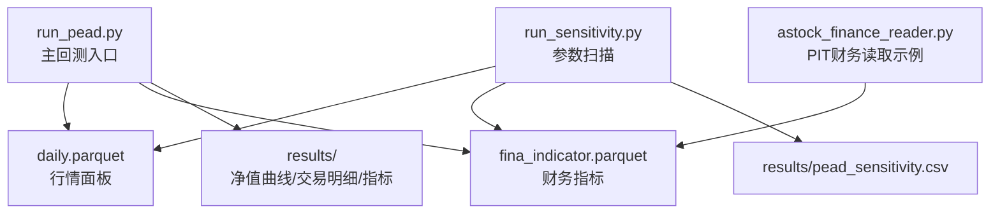
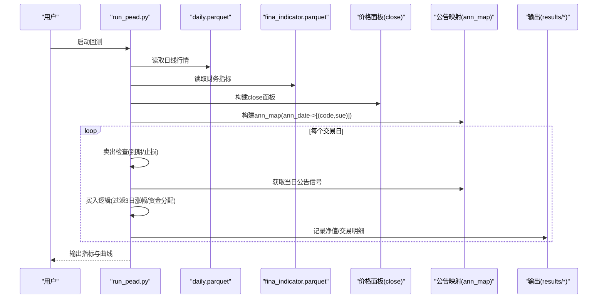
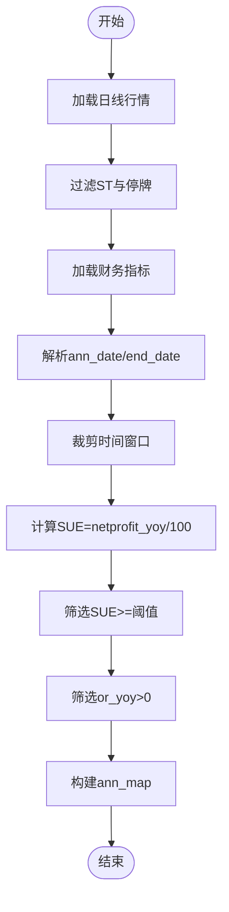
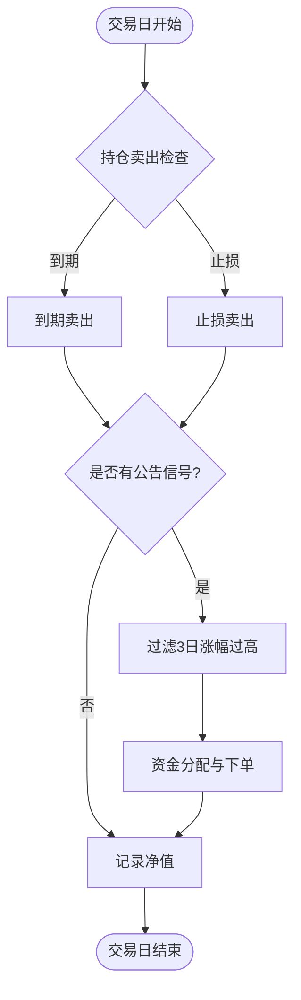
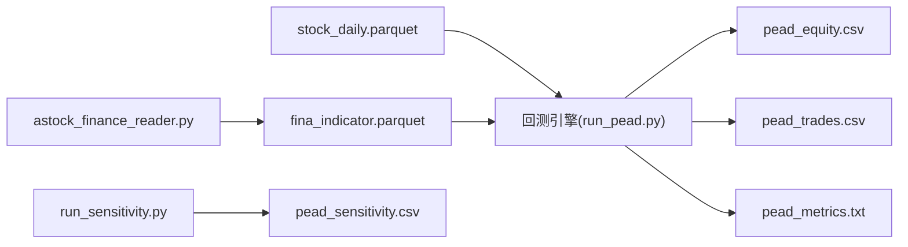

# PEAD盈余漂移策略

<cite>
**本文引用的文件**   
- [run_pead.py](file://projects/Project_03_PEAD盈余漂移/run_pead.py)
- [run_sensitivity.py](file://projects/Project_03_PEAD盈余漂移/run_sensitivity.py)
- [pead_metrics.txt](file://projects/Project_03_PEAD盈余漂移/results/pead_metrics.txt)
- [pead_equity.csv](file://projects/Project_03_PEAD盈余漂移/results/pead_equity.csv)
- [pead_trades.csv](file://projects/Project_03_PEAD盈余漂移/results/pead_trades.csv)
- [pead_sensitivity.csv](file://projects/Project_03_PEAD盈余漂移/results/pead_sensitivity.csv)
- [astock_finance_reader.py](file://data/astock_finance_reader.py)
</cite>

## 目录
1. [引言](#引言)
2. [项目结构](#项目结构)
3. [核心组件](#核心组件)
4. [架构总览](#架构总览)
5. [详细组件分析](#详细组件分析)
6. [依赖关系分析](#依赖关系分析)
7. [性能与回测指标解读](#性能与回测指标解读)
8. [敏感性测试与参数优化](#敏感性测试与参数优化)
9. [交易执行细节](#交易执行细节)
10. [行为金融学意义与中国市场适用性](#行为金融学意义与中国市场适用性)
11. [故障排查指南](#故障排查指南)
12. [结论](#结论)
13. [附录：可复现实验配置与扩展建议](#附录可复现实验配置与扩展建议)

## 引言
本案例围绕A股市场的“盈余公告异常收益（PEAD）”异象，构建事件驱动型多因子策略。该策略以财报公告日为事件触发点，基于净利润同比增速（作为盈余惊喜代理）筛选高正惊喜标的，在公告日买入并持有固定周期，辅以止损控制与短期涨幅过滤，力求捕捉公告后价格缓慢上行的漂移效应。文档从理论基础、数据与信号构造、回测引擎、交易执行、结果解读到行为金融解释，提供完整的技术与实操说明，便于研究者在中国市场进行验证与拓展。

## 项目结构
本项目将PEAD策略封装于独立项目中，包含主回测脚本、敏感性分析脚本以及结果输出目录。关键路径如下：
- 回测主程序：projects/Project_03_PEAD盈余漂移/run_pead.py
- 敏感性分析：projects/Project_03_PEAD盈余漂移/run_sensitivity.py
- 结果输出：results/pead_equity.csv、pead_trades.csv、pead_metrics.txt、pead_sensitivity.csv
- 财务数据读取工具：data/astock_finance_reader.py（PIT安全读取示例）

图表来源
- [run_pead.py:1-214](file://projects/Project_03_PEAD盈余漂移/run_pead.py#L1-L214)
- [run_sensitivity.py:1-186](file://projects/Project_03_PEAD盈余漂移/run_sensitivity.py#L1-L186)
- [astock_finance_reader.py:1-200](file://data/astock_finance_reader.py#L1-L200)

章节来源
- [run_pead.py:1-214](file://projects/Project_03_PEAD盈余漂移/run_pead.py#L1-L214)
- [run_sensitivity.py:1-186](file://projects/Project_03_PEAD盈余漂移/run_sensitivity.py#L1-L186)
- [astock_finance_reader.py:1-200](file://data/astock_finance_reader.py#L1-L200)

## 核心组件
- 事件识别与信号构造
  - 使用净利润同比增速（netprofit_yoy）除以100得到SUE（盈余惊喜），仅保留SUE大于阈值的样本，同时要求营收同比增长为正（or_yoy > 0）。
  - 公告日映射：ann_date -> [(ts_code, sue)]，用于按交易日批量处理信号。
- 回测引擎
  - 每日循环：先检查持仓卖出条件（到期或止损），再根据当日公告信号进行买入，最后计算组合净值。
  - 资金分配：等权分配至当前可用仓位上限（MAX_STOCKS），单票最低资金门槛过滤。
- 绩效统计
  - 累计收益、年化收益、最大回撤、夏普比率、Calmar比率、胜率、交易次数。
- 敏感性分析
  - 对SUE阈值、持有期、止损幅度进行多组参数扫描，输出对比CSV。

章节来源
- [run_pead.py:56-154](file://projects/Project_03_PEAD盈余漂移/run_pead.py#L56-L154)
- [run_pead.py:165-208](file://projects/Project_03_PEAD盈余漂移/run_pead.py#L165-L208)
- [run_sensitivity.py:16-105](file://projects/Project_03_PEAD盈余漂移/run_sensitivity.py#L16-L105)

## 架构总览
下图展示PEAD策略的数据流与模块交互：

图表来源
- [run_pead.py:30-163](file://projects/Project_03_PEAD盈余漂移/run_pead.py#L30-L163)

章节来源
- [run_pead.py:30-163](file://projects/Project_03_PEAD盈余漂移/run_pead.py#L30-L163)

## 详细组件分析

### 事件驱动与信号构造
- 数据准备
  - 过滤ST与停牌股票，限定时间窗口（START_DATE至END_DATE）。
  - 财务字段选择：ts_code、end_date、ann_date、netprofit_yoy、or_yoy、roe。
  - 日期解析与范围裁剪，确保ann_date有效且处于回测区间内。
- SUE计算与筛选
  - SUE = netprofit_yoy / 100.0；仅保留SUE >= 阈值的样本。
  - 附加过滤：or_yoy > 0，保证营收增长为正。
- 公告映射
  - ann_map[ann_date] = [(ts_code, sue), ...]，用于按日批量处理。

图表来源
- [run_pead.py:31-78](file://projects/Project_03_PEAD盈余漂移/run_pead.py#L31-L78)

章节来源
- [run_pead.py:31-78](file://projects/Project_03_PEAD盈余漂移/run_pead.py#L31-L78)

### 回测引擎与持仓管理
- 卖出规则
  - 持有天数达到HOLDING_PERIOD即到期卖出。
  - 若日内收盘价相对买入价跌幅达到STOP_LOSS则止损卖出。
- 买入规则
  - 仅在当日存在公告信号时尝试买入。
  - 过滤未来3日涨幅超过阈值的标的（避免追高）。
  - 等权分配资金至剩余可用仓位，单票最低资金门槛过滤。
- 净值计算
  - 每日汇总现金与持仓市值，写入净值曲线。

图表来源
- [run_pead.py:86-163](file://projects/Project_03_PEAD盈余漂移/run_pead.py#L86-L163)

章节来源
- [run_pead.py:86-163](file://projects/Project_03_PEAD盈余漂移/run_pead.py#L86-L163)

### 绩效统计与输出
- 指标计算
  - 总收益、年化收益、最大回撤、夏普比率、Calmar比率、胜率、交易次数。
- 输出文件
  - pead_equity.csv：每日净值与持仓数量
  - pead_trades.csv：逐笔交易明细（含原因、收益率、SUE）
  - pead_metrics.txt：核心指标摘要

章节来源
- [run_pead.py:165-208](file://projects/Project_03_PEAD盈余漂移/run_pead.py#L165-L208)

### 敏感性分析
- 参数空间
  - SUE阈值（如30%/50%/80%）、持有期（30/45/60天）、止损幅度（-8%/-10%/-12%）。
- 评估维度
  - 年化收益、夏普比率、最大回撤等。
- 输出
  - pead_sensitivity.csv：不同参数组合的绩效对比。

章节来源
- [run_sensitivity.py:148-174](file://projects/Project_03_PEAD盈余漂移/run_sensitivity.py#L148-L174)

## 依赖关系分析
- 数据依赖
  - daily.parquet：包含多只股票的收盘价、是否ST、停牌类型等。
  - fina_indicator.parquet：包含公司财务指标与公告日期。
- 工具依赖
  - astock_finance_reader.py：提供PIT安全的财务数据读取方法，可用于更严谨的事件研究。
- 输出依赖
  - results目录下的CSV与TXT文件供后续分析与可视化。

图表来源
- [run_pead.py:1-214](file://projects/Project_03_PEAD盈余漂移/run_pead.py#L1-L214)
- [run_sensitivity.py:1-186](file://projects/Project_03_PEAD盈余漂移/run_sensitivity.py#L1-L186)
- [astock_finance_reader.py:1-200](file://data/astock_finance_reader.py#L1-L200)

章节来源
- [run_pead.py:1-214](file://projects/Project_03_PEAD盈余漂移/run_pead.py#L1-L214)
- [run_sensitivity.py:1-186](file://projects/Project_03_PEAD盈余漂移/run_sensitivity.py#L1-L186)
- [astock_finance_reader.py:1-200](file://data/astock_finance_reader.py#L1-L200)

## 性能与回测指标解读
- 基准回测结果（默认参数）
  - 总收益：-40.9%
  - 年化收益：-7.8%
  - 最大回撤：-61.7%
  - 夏普比率：-0.50
  - Calmar比率：-0.13
  - 胜率：27%
  - 交易次数：1950
- 解读要点
  - 负收益与较大回撤表明在当前参数下，策略未能有效捕捉PEAD漂移，需进一步调整信号质量与风控。
  - 低胜率提示止损触发频繁或买入时机不佳，需审视SUE阈值与短期涨幅过滤。
  - 交易次数较多，说明信号密度较高，但盈利占比不足。

章节来源
- [pead_metrics.txt:1-8](file://projects/Project_03_PEAD盈余漂移/results/pead_metrics.txt#L1-L8)

## 敏感性测试与参数优化
- 参数组合与结果概览
  - 基线：SUE>30%，持有60天，止损-8% → 年化-8.2%，夏普-0.37
  - 提高SUE阈值：SUE>50% → 年化-8.8%，夏普-0.42
  - 更高SUE阈值：SUE>80% → 年化-9.2%，夏普-0.44
  - 缩短持有期：30天 → 年化-11.7%，夏普-0.71
  - 放宽止损：-10% → 年化-6.0%，夏普-0.23
  - 组合优化：SUE>50%，持有30天，止损-10% → 年化-8.3%，夏普-0.47
  - 激进组合：SUE>80%，持有30天，止损-10% → 年化-10.6%，夏普-0.64
  - 中间方案：SUE>50%，持有45天，止损-12% → 年化-7.6%，夏普-0.34
- 观察与建议
  - 提高SUE阈值并未显著改善表现，反而增加回撤与降低夏普。
  - 缩短持有期导致波动加剧，夏普下降明显。
  - 放宽止损能略微提升年化，但风险暴露增大。
  - 建议结合行业与市值分组进行分层回测，寻找更具稳健性的参数区间。

章节来源
- [pead_sensitivity.csv:1-10](file://projects/Project_03_PEAD盈余漂移/results/pead_sensitivity.csv#L1-L10)

## 交易执行细节
- 公告日买入时机
  - 在公告日当天，若存在有效信号且通过3日涨幅过滤，则按等权分配买入。
- 持仓管理
  - 持有到期（固定天数）或触发止损时卖出。
  - 每日更新净值，记录交易明细。
- 卖出信号
  - 到期：持有天数达到HOLDING_PERIOD。
  - 止损：日内价格相对买入价跌幅达到STOP_LOSS。
- 成本与滑点
  - 买入与卖出均考虑佣金、印花税与滑点，影响净收益。

章节来源
- [run_pead.py:90-154](file://projects/Project_03_PEAD盈余漂移/run_pead.py#L90-L154)

## 行为金融学意义与中国市场适用性
- 理论背景
  - PEAD源于投资者对盈余信息的反应不足，公告后价格逐步调整形成漂移。
  - 行为偏差包括保守主义、锚定效应与注意力分散，导致信息消化滞后。
- 中国市场特征
  - 散户占比高、信息传播速度快但理解深度有限，可能放大或削弱漂移效应。
  - 监管与交易制度（T+1、涨跌停）影响短期价格行为，需在策略中考虑。
- 策略启示
  - 使用SUE作为盈余惊喜代理，结合营收增长过滤，提升信号质量。
  - 通过短期涨幅过滤避免公告日过度反应，减少追高风险。
  - 中国市场中，行业与市值异质性显著，建议分层回测与动态权重。

## 故障排查指南
- 常见问题
  - 数据缺失：确认daily与financ文件路径正确，日期格式解析无误。
  - 信号过少：降低SUE阈值或放宽or_yoy过滤。
  - 回撤过大：收紧止损或缩短持有期。
  - 交易失败：检查停牌与ST过滤逻辑，确保代码存在于价格面板。
- 调试建议
  - 打印每日持仓与交易明细，定位问题日期与标的。
  - 使用astock_finance_reader.py进行PIT校验，避免前视偏差。

章节来源
- [run_pead.py:31-78](file://projects/Project_03_PEAD盈余漂移/run_pead.py#L31-L78)
- [astock_finance_reader.py:66-129](file://data/astock_finance_reader.py#L66-L129)

## 结论
本案例构建了基于PEAD异象的事件驱动策略，实现了从数据准备、信号构造、回测执行到结果输出的完整流程。当前默认参数下策略表现不佳，主要受限于信号质量与风控设置。通过敏感性分析发现，提高SUE阈值与缩短持有期并未带来显著改善，需进一步优化信号与风险管理。建议在行业与市值层面进行分层回测，并结合行为金融学视角调整策略逻辑，以提升在中国市场的适用性与稳健性。

## 附录：可复现实验配置与扩展建议
- 参数配置
  - 初始资金、时间窗口、SUE阈值、持有期、止损幅度、佣金、印花税、滑点等。
- 扩展方向
  - 引入更多财务指标（如ROE、毛利率）增强信号质量。
  - 加入行业中性与市值中性，控制风格暴露。
  - 动态权重分配，依据SUE强度与流动性调整仓位。
  - 结合宏观与情绪因子择时，降低系统性风险。

章节来源
- [run_pead.py:9-22](file://projects/Project_03_PEAD盈余漂移/run_pead.py#L9-L22)
- [run_sensitivity.py:148-174](file://projects/Project_03_PEAD盈余漂移/run_sensitivity.py#L148-L174)