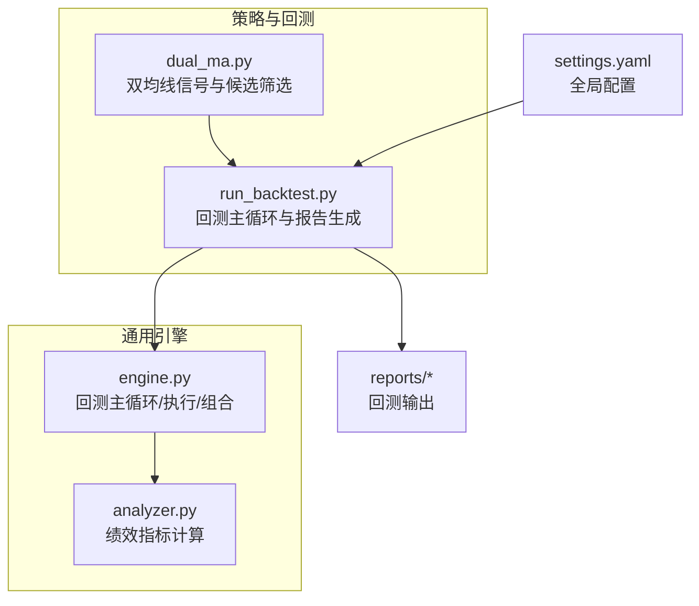
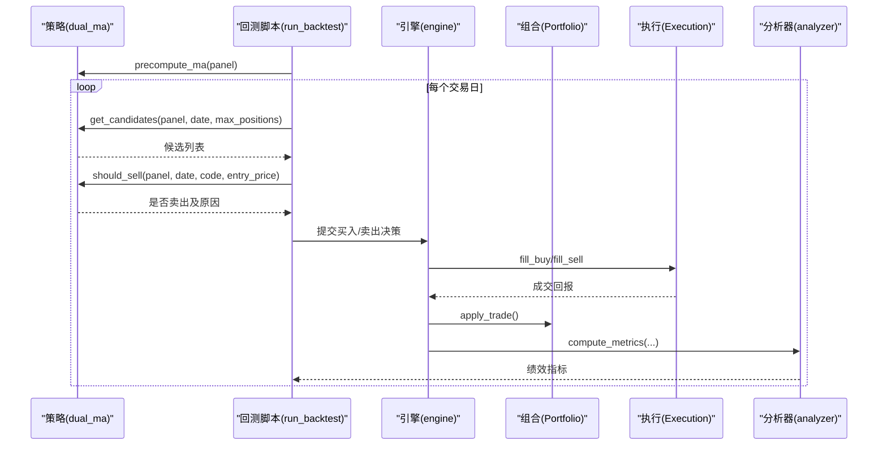
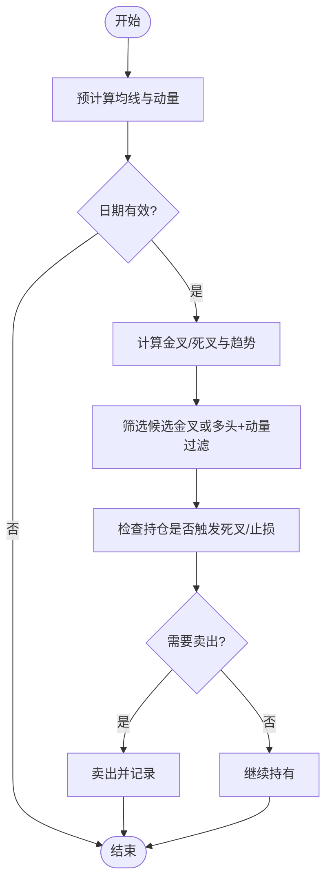
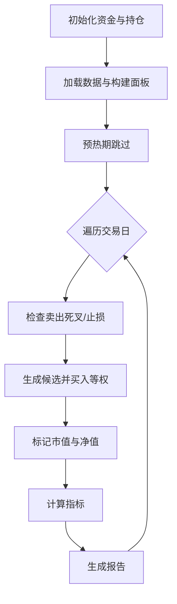
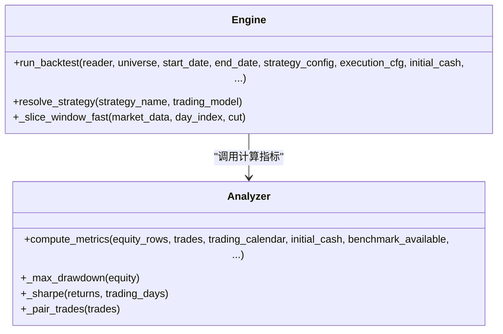
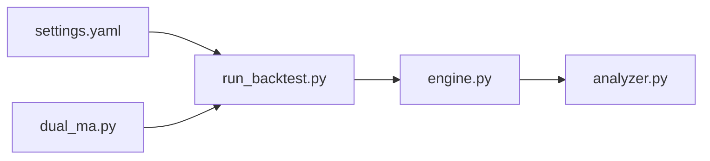

# 双均线趋势策略

<cite>
**本文引用的文件**   
- [dual_ma.py](file://projects/Project_02_双均线趋势策略/strategy/dual_ma.py)
- [run_backtest.py](file://projects/Project_02_双均线趋势策略/run_backtest.py)
- [engine.py](file://backtest/engine.py)
- [analyzer.py](file://backtest/analyzer.py)
- [settings.yaml](file://config/settings.yaml)
- [equity.csv](file://projects/Project_02_双均线趋势策略/reports/equity.csv)
- [trades.csv](file://projects/Project_02_双均线趋势策略/reports/trades.csv)
</cite>

## 目录
1. [引言](#引言)
2. [项目结构](#项目结构)
3. [核心组件](#核心组件)
4. [架构总览](#架构总览)
5. [详细组件分析](#详细组件分析)
6. [依赖关系分析](#依赖关系分析)
7. [性能与回测指标](#性能与回测指标)
8. [参数优化方法](#参数优化方法)
9. [风险控制措施](#风险控制措施)
10. [回测结果解读](#回测结果解读)
11. [代码示例与配置说明](#代码示例与配置说明)
12. [适用环境与市场特征](#适用环境与市场特征)
13. [故障排查指南](#故障排查指南)
14. [结论](#结论)

## 引言
本案例围绕“双均线趋势策略”展开，系统阐述其理论基础（短期与长期均线的含义、金叉死叉信号、趋势判断逻辑），并深入解析策略实现细节（均线周期选择、买卖信号生成、仓位管理规则）。同时给出参数优化方法（网格搜索、滚动窗口优化、样本外测试）、风险控制（止损、止盈、最大持仓限制）以及回测结果解读（收益曲线、交易次数、胜率赔率、最大回撤等）。最后提供完整代码路径与配置说明，帮助初学者快速上手。

## 项目结构
本项目采用“策略+回测脚本+通用引擎”的模块化组织：
- 策略层：双均线策略实现位于 projects/Project_02_双均线趋势策略/strategy/dual_ma.py
- 回测入口：独立可运行的回测脚本 run_backtest.py
- 通用回测引擎：backtest/engine.py 与 backtest/analyzer.py 提供统一的数据切片、执行、组合管理与绩效计算
- 全局配置：config/settings.yaml 定义数据源、回测默认参数等
- 输出报告：reports 目录下包含 equity.csv、trades.csv 等结果文件

图表来源
- [dual_ma.py:1-93](file://projects/Project_02_双均线趋势策略/strategy/dual_ma.py#L1-L93)
- [run_backtest.py:1-417](file://projects/Project_02_双均线趋势策略/run_backtest.py#L1-L417)
- [engine.py:1-619](file://backtest/engine.py#L1-L619)
- [analyzer.py:1-176](file://backtest/analyzer.py#L1-L176)
- [settings.yaml:1-69](file://config/settings.yaml#L1-L69)

章节来源
- [dual_ma.py:1-93](file://projects/Project_02_双均线趋势策略/strategy/dual_ma.py#L1-L93)
- [run_backtest.py:1-417](file://projects/Project_02_双均线趋势策略/run_backtest.py#L1-L417)
- [engine.py:1-619](file://backtest/engine.py#L1-L619)
- [analyzer.py:1-176](file://backtest/analyzer.py#L1-L176)
- [settings.yaml:1-69](file://config/settings.yaml#L1-L69)

## 核心组件
- 双均线信号模块（dual_ma.py）
  - 预计算短期与长期简单移动平均线（SMA），并基于交叉事件生成金叉/死叉信号；同时计算动量以过滤暴涨股
  - 提供候选股票获取函数与卖出条件判断（死叉或止损）
- 回测主循环（run_backtest.py）
  - 加载全A股票池（按流通市值取前4000只），构建面板数据，预热期后逐日执行买入/卖出逻辑
  - 记录净值曲线、交易明细、止损事件，并生成HTML报告
- 通用回测引擎（engine.py, analyzer.py）
  - engine.py 负责数据切片、执行填充、组合状态更新、基准对齐与汇总
  - analyzer.py 计算总收益、年化收益、最大回撤、夏普比率、胜率、平均持有天数等

章节来源
- [dual_ma.py:1-93](file://projects/Project_02_双均线趋势策略/strategy/dual_ma.py#L1-L93)
- [run_backtest.py:1-417](file://projects/Project_02_双均线趋势策略/run_backtest.py#L1-L417)
- [engine.py:1-619](file://backtest/engine.py#L1-L619)
- [analyzer.py:1-176](file://backtest/analyzer.py#L1-L176)

## 架构总览
双均线策略的回测流程由“策略信号 + 回测主循环 + 引擎执行 + 指标计算”构成。策略侧仅负责信号与候选筛选，回测脚本负责资金分配、交易成本与净值跟踪，引擎提供统一的执行与组合管理，分析器输出标准化绩效指标。

图表来源
- [dual_ma.py:20-93](file://projects/Project_02_双均线趋势策略/strategy/dual_ma.py#L20-L93)
- [run_backtest.py:60-236](file://projects/Project_02_双均线趋势策略/run_backtest.py#L60-L236)
- [engine.py:237-619](file://backtest/engine.py#L237-L619)
- [analyzer.py:96-176](file://backtest/analyzer.py#L96-L176)

## 详细组件分析

### 双均线信号模块（dual_ma.py）
- 均线计算与缓存
  - 使用滚动窗口计算短期与长期 SMA，并缓存以避免重复计算
  - 通过比较相邻日的短长均线关系识别金叉/死叉
- 动量过滤
  - 计算近MOMENTUM_WINDOW日收益率作为动量，用于剔除暴涨股
- 候选与卖出逻辑
  - 候选：满足“金叉或多头排列”且“动量在合理范围”的股票
  - 卖出：触发“死叉”或“止损”时卖出

图表来源
- [dual_ma.py:20-93](file://projects/Project_02_双均线趋势策略/strategy/dual_ma.py#L20-L93)

章节来源
- [dual_ma.py:1-93](file://projects/Project_02_双均线趋势策略/strategy/dual_ma.py#L1-L93)

### 回测主循环（run_backtest.py）
- 数据准备
  - 从 parquet 读取全A日线，按最新交易日选取流通市值前4000只，过滤ST与停牌
  - 构建 (trade_date, ts_code) 面板，仅保留 close 列
- 回测参数
  - 初始资金、最大持仓数、佣金、印花税、滑点
- 每日流程
  - 先检查卖出条件（死叉/止损），再根据候选列表进行等权买入
  - 记录净值、交易明细与止损事件
- 指标与报告
  - 计算总收益、年化收益、最大回撤、夏普比率、胜率、交易次数等
  - 输出 CSV 与 HTML 报告

图表来源
- [run_backtest.py:60-236](file://projects/Project_02_双均线趋势策略/run_backtest.py#L60-L236)

章节来源
- [run_backtest.py:1-417](file://projects/Project_02_双均线趋势策略/run_backtest.py#L1-L417)

### 通用引擎与分析器（engine.py, analyzer.py）
- engine.py
  - 统一回测主循环：数据切片、执行填充、组合更新、基准对齐、日志与诊断聚合
  - 支持 next_open 交易模型（T收盘信号，T+1开盘成交）
- analyzer.py
  - 纯 numpy 计算绩效：总收益、年化收益、最大回撤、夏普比率、Calmar、胜率、平均持有天数、超额收益、信息比率、跟踪误差

图表来源
- [engine.py:237-619](file://backtest/engine.py#L237-L619)
- [analyzer.py:96-176](file://backtest/analyzer.py#L96-L176)

章节来源
- [engine.py:1-619](file://backtest/engine.py#L1-L619)
- [analyzer.py:1-176](file://backtest/analyzer.py#L1-L176)

## 依赖关系分析
- 策略与回测脚本
  - run_backtest.py 直接导入 dual_ma.py 的策略函数与常量
- 回测脚本与引擎
  - 虽然 run_backtest.py 自包含回测逻辑，但框架内另有 engine.py 提供统一引擎能力，便于扩展多策略与复杂执行
- 配置与数据
  - settings.yaml 提供数据路径与默认回测参数，便于统一环境管理

图表来源
- [settings.yaml:1-69](file://config/settings.yaml#L1-L69)
- [run_backtest.py:1-417](file://projects/Project_02_双均线趋势策略/run_backtest.py#L1-L417)
- [dual_ma.py:1-93](file://projects/Project_02_双均线趋势策略/strategy/dual_ma.py#L1-L93)
- [engine.py:1-619](file://backtest/engine.py#L1-L619)
- [analyzer.py:1-176](file://backtest/analyzer.py#L1-L176)

章节来源
- [settings.yaml:1-69](file://config/settings.yaml#L1-L69)
- [run_backtest.py:1-417](file://projects/Project_02_双均线趋势策略/run_backtest.py#L1-L417)
- [dual_ma.py:1-93](file://projects/Project_02_双均线趋势策略/strategy/dual_ma.py#L1-L93)
- [engine.py:1-619](file://backtest/engine.py#L1-L619)
- [analyzer.py:1-176](file://backtest/analyzer.py#L1-L176)

## 性能与回测指标
- 指标体系
  - 总收益、年化收益、最大回撤、夏普比率、胜率、买入/卖出次数、止损次数、回测天数与年数
- 计算方法
  - 最大回撤基于净值序列峰值回撤
  - 夏普比率基于日收益率均值与标准差，年化因子为 sqrt(252)
  - 胜率基于配对交易的盈亏统计
- 数据来源
  - equity.csv 提供净值曲线
  - trades.csv 提供交易明细与盈亏百分比

章节来源
- [run_backtest.py:238-279](file://projects/Project_02_双均线趋势策略/run_backtest.py#L238-L279)
- [analyzer.py:96-176](file://backtest/analyzer.py#L96-L176)
- [equity.csv:1-200](file://projects/Project_02_双均线趋势策略/reports/equity.csv#L1-L200)
- [trades.csv:1-200](file://projects/Project_02_双均线趋势策略/reports/trades.csv#L1-L200)

## 参数优化方法
- 网格搜索
  - 对短期与长期均线周期、动量窗口与上限进行网格遍历，评估各参数组合的回测表现
  - 参考项目中其他策略的参数对比方式，可批量运行并保存结果
- 滚动窗口优化（Walk-Forward）
  - 将历史数据划分为训练与验证窗口，滚动推进，避免时间序列泄露
  - 适用于检验参数稳定性与适应市场变化
- 样本外测试
  - 使用未参与优化的时间段进行最终验证，确保策略稳健性
- 实施建议
  - 在 run_backtest.py 中封装参数循环，输出不同参数的 equity.csv 与 trades.csv，并进行指标对比

章节来源
- [run_backtest.py:60-236](file://projects/Project_02_双均线趋势策略/run_backtest.py#L60-L236)
- [A股量化框架_五大扩展模块.md:88-116](file://A股量化框架_五大扩展模块.md#L88-L116)

## 风险控制措施
- 止损设置
  - 固定比例止损（如 -5%），当持仓亏损达到阈值即卖出
- 止盈规则
  - 当前实现未内置止盈，可通过价格目标或移动止盈扩展
- 最大持仓限制
  - 控制同时持有的股票数量（如 50 只），避免过度分散导致单笔收益稀释
- 交易成本与滑点
  - 考虑佣金、印花税与滑点，确保回测贴近真实交易

章节来源
- [dual_ma.py:8-14](file://projects/Project_02_双均线趋势策略/strategy/dual_ma.py#L8-L14)
- [run_backtest.py:50-56](file://projects/Project_02_双均线趋势策略/run_backtest.py#L50-L56)
- [run_backtest.py:102-190](file://projects/Project_02_双均线趋势策略/run_backtest.py#L102-L190)

## 回测结果解读
- 收益曲线
  - equity.csv 展示每日净值变化，观察整体趋势与波动
- 交易次数与胜率
  - trades.csv 统计买入/卖出次数与盈亏百分比，计算胜率与平均持有天数
- 最大回撤
  - 从净值曲线计算峰值回撤，衡量极端风险
- 止损事件
  - 统计止损触发频率与亏损幅度，评估风控有效性

章节来源
- [equity.csv:1-200](file://projects/Project_02_双均线趋势策略/reports/equity.csv#L1-L200)
- [trades.csv:1-200](file://projects/Project_02_双均线趋势策略/reports/trades.csv#L1-L200)
- [run_backtest.py:238-279](file://projects/Project_02_双均线趋势策略/run_backtest.py#L238-L279)

## 代码示例与配置说明
- 策略实现
  - 双均线信号与候选筛选：[dual_ma.py](file://projects/Project_02_双均线趋势策略/strategy/dual_ma.py)
- 回测入口
  - 独立回测脚本：[run_backtest.py](file://projects/Project_02_双均线趋势策略/run_backtest.py)
- 全局配置
  - 数据源与默认回测参数：[settings.yaml](file://config/settings.yaml)
- 输出结果
  - 净值曲线与交易明细：[equity.csv](file://projects/Project_02_双均线趋势策略/reports/equity.csv)、[trades.csv](file://projects/Project_02_双均线趋势策略/reports/trades.csv)

章节来源
- [dual_ma.py:1-93](file://projects/Project_02_双均线趋势策略/strategy/dual_ma.py#L1-L93)
- [run_backtest.py:1-417](file://projects/Project_02_双均线趋势策略/run_backtest.py#L1-L417)
- [settings.yaml:1-69](file://config/settings.yaml#L1-L69)
- [equity.csv:1-200](file://projects/Project_02_双均线趋势策略/reports/equity.csv#L1-L200)
- [trades.csv:1-200](file://projects/Project_02_双均线趋势策略/reports/trades.csv#L1-L200)

## 适用环境与市场特征
- 趋势行情
  - 双均线策略在单边上涨或下跌趋势中表现较好，金叉/死叉信号能有效捕捉趋势延续
- 震荡行情
  - 在横盘震荡中易产生频繁假信号，需结合动量过滤与止损控制降低损耗
- 流动性与波动性
  - 高波动环境下止损更易触发，需调整止损阈值与持仓上限
- 样本外稳健性
  - 通过滚动窗口与样本外测试验证参数在不同市场环境下的稳定性

[本节为概念性内容，不直接分析具体文件]

## 故障排查指南
- 数据缺失或异常
  - 检查 parquet 数据路径与字段完整性，确保 close、is_st、suspend_type 等字段可用
- 回测无交易或交易极少
  - 确认预热期设置与候选筛选条件是否过于严格
- 净值异常波动
  - 检查交易成本与滑点设置，核对止损与死叉触发逻辑
- 引擎与执行问题
  - 若使用 engine.py，检查 next_open 模型与执行填充逻辑是否正确

章节来源
- [run_backtest.py:31-48](file://projects/Project_02_双均线趋势策略/run_backtest.py#L31-L48)
- [run_backtest.py:102-190](file://projects/Project_02_双均线趋势策略/run_backtest.py#L102-L190)
- [engine.py:237-619](file://backtest/engine.py#L237-L619)

## 结论
双均线趋势策略以简洁有效的信号机制为基础，配合严格的止损与持仓控制，能够在趋势市场中取得稳定收益。通过网格搜索与滚动窗口优化，可提升参数稳健性与样本外表现。建议在震荡市场中加强过滤与风控，并结合动量与波动性指标进一步优化策略效果。

[本节为总结性内容，不直接分析具体文件]