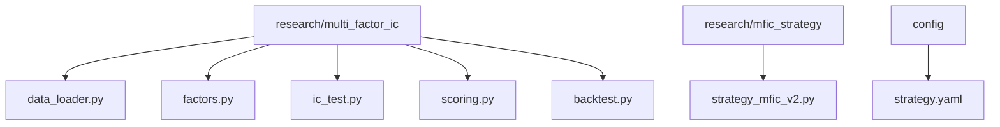
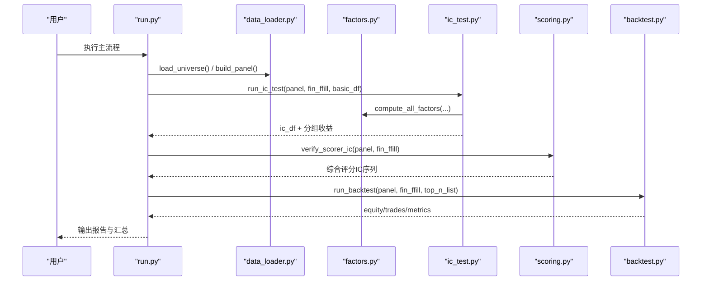
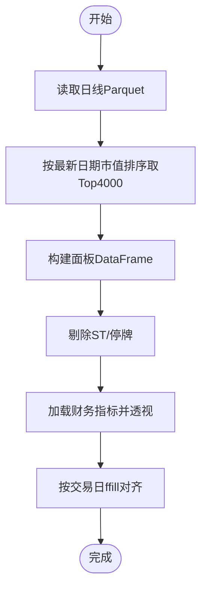
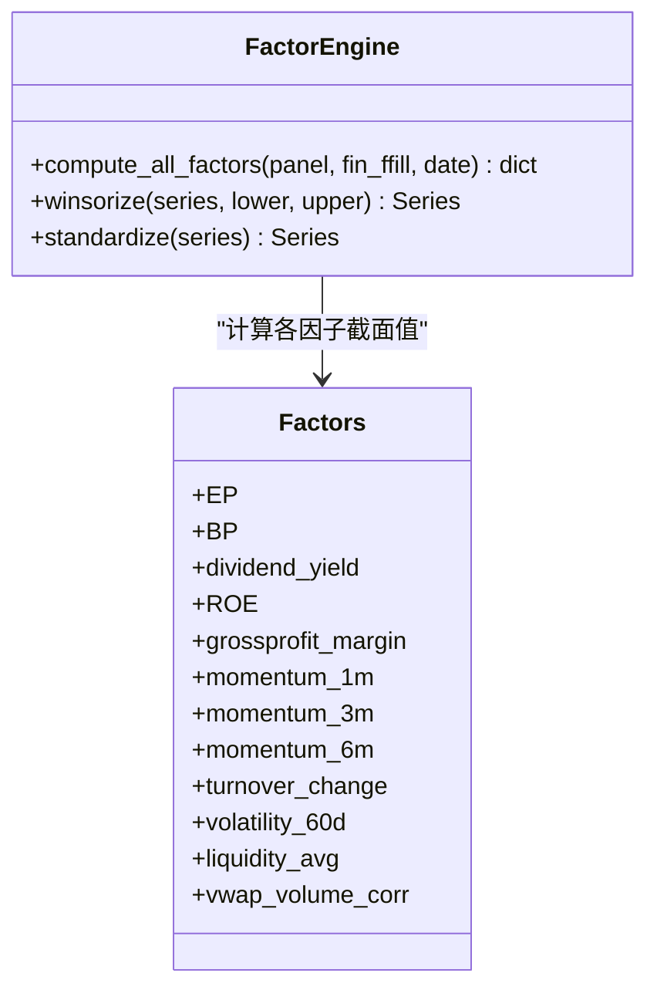
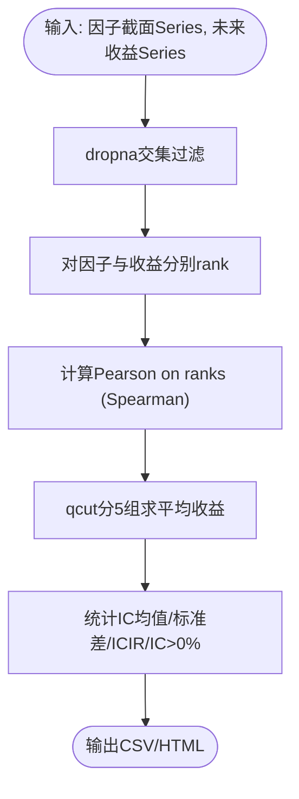
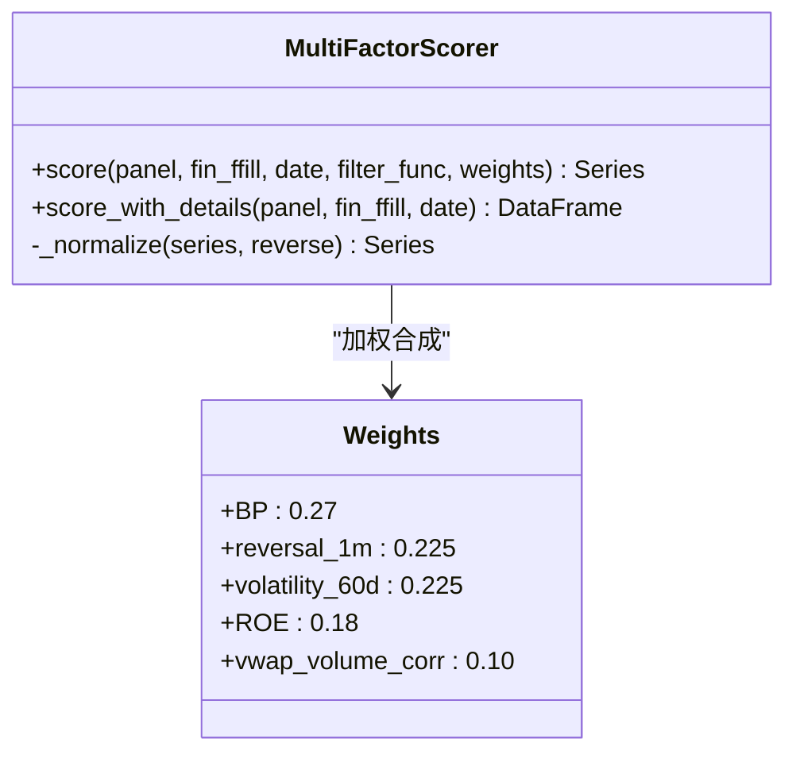
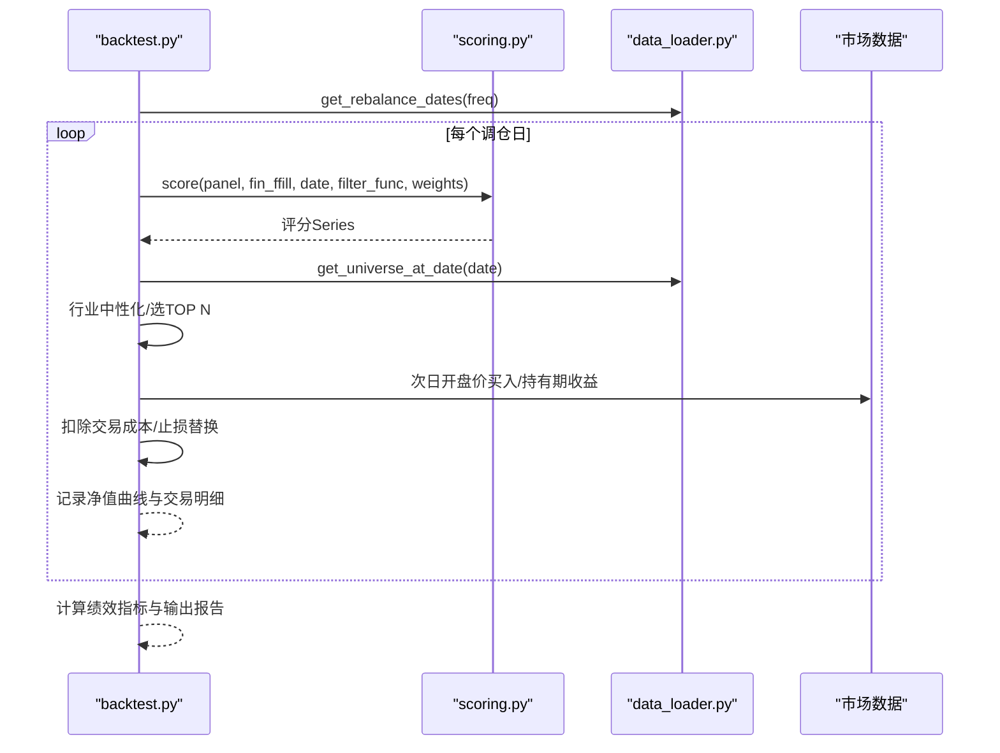
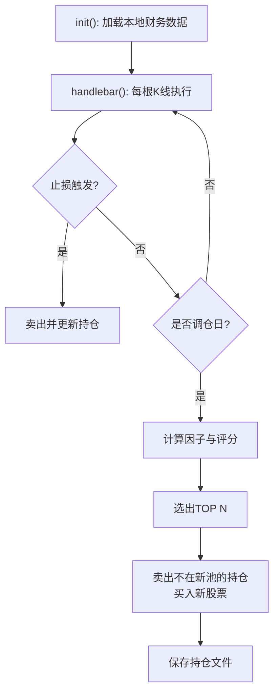
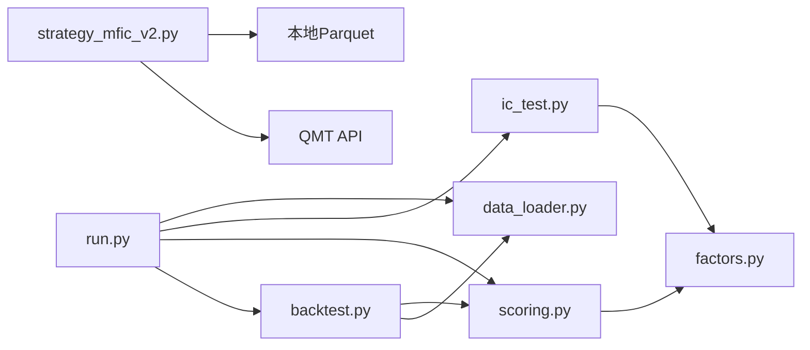

# 多因子IC小盘Alpha策略

<cite>
**本文引用的文件**   
- [项目入口或共享任务本.md](file://projects/Project_01_多因子IC小盘Alpha/项目入口或共享任务本.md)
- [strategy.yaml](file://projects/Project_01_多因子IC小盘Alpha/config/strategy.yaml)
- [run.py](file://projects/Project_01_多因子IC小盘Alpha/research/multi_factor_ic/run.py)
- [config.py](file://projects/Project_01_多因子IC小盘Alpha/research/multi_factor_ic/config.py)
- [data_loader.py](file://projects/Project_01_多因子IC小盘Alpha/research/multi_factor_ic/data_loader.py)
- [factors.py](file://projects/Project_01_多因子IC小盘Alpha/research/multi_factor_ic/factors.py)
- [ic_test.py](file://projects/Project_01_多因子IC小盘Alpha/research/multi_factor_ic/ic_test.py)
- [scoring.py](file://projects/Project_01_多因子IC小盘Alpha/research/multi_factor_ic/scoring.py)
- [backtest.py](file://projects/Project_01_多因子IC小盘Alpha/research/multi_factor_ic/backtest.py)
- [strategy_mfic_v2.py](file://projects/Project_01_多因子IC小盘Alpha/research/mfic_strategy/strategy_mfic_v2.py)
- [IC策略_10万本金实盘参数回测.md](file://projects/Project_01_多因子IC小盘Alpha/specs/IC策略_10万本金实盘参数回测.md)
</cite>

## 目录
1. [引言](#引言)
2. [项目结构](#项目结构)
3. [核心组件](#核心组件)
4. [架构总览](#架构总览)
5. [详细组件分析](#详细组件分析)
6. [依赖关系分析](#依赖关系分析)
7. [性能与稳定性考量](#性能与稳定性考量)
8. [故障排查指南](#故障排查指南)
9. [结论与实战建议](#结论与实战建议)
10. [附录：配置与复现实例](#附录配置与复现实例)

## 引言
本案例文档围绕“多因子IC小盘Alpha策略”展开，系统阐述因子选择逻辑（IC计算、有效性检验、中性化处理）、IC分析方法（截面IC、时序IC、ICIR、相关性）、组合构建流程（筛选标准、权重分配、调仓频率）、回测结果解读（收益曲线、风险指标、交易统计、归因），并提供完整代码路径与配置文件说明，帮助读者学习与复现。该策略聚焦中证500+中证1000区间的小盘股，通过价值、质量、反转、低波等因子加权评分，结合动态滚动选股池与止损机制，追求稳健的超额收益。

## 项目结构
本项目以“研究—回测—部署”为主线组织：
- research/multi_factor_ic：因子计算、IC测试、评分器、回测引擎与对比实验
- research/mfic_strategy：QMT单文件部署版策略
- config：策略参数与回测/实盘配置
- data：数据加载与面板构建
- specs：策略规格与回测报告

图表来源
- [run.py:1-66](file://projects/Project_01_多因子IC小盘Alpha/research/multi_factor_ic/run.py#L1-L66)
- [data_loader.py:1-151](file://projects/Project_01_多因子IC小盘Alpha/research/multi_factor_ic/data_loader.py#L1-L151)
- [factors.py:1-140](file://projects/Project_01_多因子IC小盘Alpha/research/multi_factor_ic/factors.py#L1-L140)
- [ic_test.py:1-206](file://projects/Project_01_多因子IC小盘Alpha/research/multi_factor_ic/ic_test.py#L1-L206)
- [scoring.py:1-262](file://projects/Project_01_多因子IC小盘Alpha/research/multi_factor_ic/scoring.py#L1-L262)
- [backtest.py:1-716](file://projects/Project_01_多因子IC小盘Alpha/research/multi_factor_ic/backtest.py#L1-L716)
- [strategy_mfic_v2.py:1-416](file://projects/Project_01_多因子IC小盘Alpha/research/mfic_strategy/strategy_mfic_v2.py#L1-L416)
- [strategy.yaml:1-62](file://projects/Project_01_多因子IC小盘Alpha/config/strategy.yaml#L1-L62)

章节来源
- [项目入口或共享任务本.md:1-54](file://projects/Project_01_多因子IC小盘Alpha/项目入口或共享任务本.md#L1-L54)

## 核心组件
- 数据层：统一从Parquet读取日线与财务数据，构建宽面板，支持动态滚动universe与ST/停牌过滤
- 因子层：EP/BP/股息率/ROE/毛利率/动量(1m,3m,6m)/换手变化/波动率/流动性/VWAP量价相关；提供去极值与标准化
- IC层：Spearman秩相关计算截面IC，分组收益、IC均值/标准差/ICIR、HTML报告输出
- 评分层：MultiFactorScorer实现因子方向调整、z-score归一化、加权合成与基础安全过滤
- 回测层：月度/双月/季度等多频回测，行业中性化、交易成本、止损替换、绩效指标与HTML报告
- 部署层：QMT单文件策略，本地财务数据+实时价格，盘中止损与双月调仓

章节来源
- [data_loader.py:1-151](file://projects/Project_01_多因子IC小盘Alpha/research/multi_factor_ic/data_loader.py#L1-L151)
- [factors.py:1-140](file://projects/Project_01_多因子IC小盘Alpha/research/multi_factor_ic/factors.py#L1-L140)
- [ic_test.py:1-206](file://projects/Project_01_多因子IC小盘Alpha/research/multi_factor_ic/ic_test.py#L1-L206)
- [scoring.py:1-262](file://projects/Project_01_多因子IC小盘Alpha/research/multi_factor_ic/scoring.py#L1-L262)
- [backtest.py:1-716](file://projects/Project_01_多因子IC小盘Alpha/research/multi_factor_ic/backtest.py#L1-L716)
- [strategy_mfic_v2.py:1-416](file://projects/Project_01_多因子IC小盘Alpha/research/mfic_strategy/strategy_mfic_v2.py#L1-L416)

## 架构总览
整体流程：数据加载 → 面板构建 → 因子计算 → IC测试 → 评分器验证 → 组合回测 → 报告生成。

图表来源
- [run.py:1-66](file://projects/Project_01_多因子IC小盘Alpha/research/multi_factor_ic/run.py#L1-L66)
- [data_loader.py:1-151](file://projects/Project_01_多因子IC小盘Alpha/research/multi_factor_ic/data_loader.py#L1-L151)
- [factors.py:1-140](file://projects/Project_01_多因子IC小盘Alpha/research/multi_factor_ic/factors.py#L1-L140)
- [ic_test.py:1-206](file://projects/Project_01_多因子IC小盘Alpha/research/multi_factor_ic/ic_test.py#L1-L206)
- [scoring.py:1-262](file://projects/Project_01_多因子IC小盘Alpha/research/multi_factor_ic/scoring.py#L1-L262)
- [backtest.py:1-716](file://projects/Project_01_多因子IC小盘Alpha/research/multi_factor_ic/backtest.py#L1-L716)

## 详细组件分析

### 数据层：面板构建与动态Universe
- 全市场候选池：按最新交易日流通市值排序取前4000只，避免生存偏差
- 动态滚动Universe：在回测日基于当日市值排名区间[301,1801)筛选，消除静态池偏差
- 面板字段：close/open/pe_ttm/pb/dv_ratio/turnover_rate/total_mv/circ_mv/vol/amount/pct_chg
- 财务数据：roe/grossprofit_margin/netprofit_margin/bps/ocfps，按季填充至交易日
- ST/停牌过滤：剔除ST与特定停牌类型

图表来源
- [data_loader.py:19-121](file://projects/Project_01_多因子IC小盘Alpha/research/multi_factor_ic/data_loader.py#L19-L121)

章节来源
- [data_loader.py:19-151](file://projects/Project_01_多因子IC小盘Alpha/research/multi_factor_ic/data_loader.py#L19-L151)

### 因子层：计算与预处理
- 因子定义：EP/BP/股息率/ROE/毛利率/动量(1m,3m,6m)/换手变化/波动率(60d)/流动性(20d log amount)/VWAP量价相关(-rank(corr(rank(VWAP), rank(vol)), 5))
- 去极值：winsorize(1%,99%)
- 标准化：截面z-score
- 方向处理：反转与低波因子取负，使“因子值越小得分越高”
- VWAP量价相关：使用向量化rolling corr避免慢速groupby-apply

图表来源
- [factors.py:18-140](file://projects/Project_01_多因子IC小盘Alpha/research/multi_factor_ic/factors.py#L18-L140)

章节来源
- [factors.py:18-140](file://projects/Project_01_多因子IC小盘Alpha/research/multi_factor_ic/factors.py#L18-L140)

### IC层：截面IC、分组收益与ICIR
- 截面IC：Spearman秩相关计算因子值与未来20日收益的相关性
- 分组收益：按因子值分5组（Q1~Q5）计算平均收益
- 统计指标：IC均值、IC标准差、ICIR=均值/标准差、IC>0占比
- 输出：CSV与HTML报告，便于可视化与归档

图表来源
- [ic_test.py:31-114](file://projects/Project_01_多因子IC小盘Alpha/research/multi_factor_ic/ic_test.py#L31-L114)
- [ic_test.py:117-206](file://projects/Project_01_多因子IC小盘Alpha/research/multi_factor_ic/ic_test.py#L117-L206)

章节来源
- [ic_test.py:31-206](file://projects/Project_01_多因子IC小盘Alpha/research/multi_factor_ic/ic_test.py#L31-L206)

### 评分层：MultiFactorScorer
- 基础安全过滤：PE>0, PB>0, ROE≥-20（考虑财报披露滞后45天）
- 自定义过滤叠加：如市值过滤（circ_mv区间），与基础过滤叠加生效
- 因子方向：反转/低波取负，其他正向
- 归一化：去极值→z-score→加权合成→0~100尺度
- 已知Bug修复：filter_func与基础过滤叠加、默认市值过滤移除、NaN初始化避免被过滤股票参与TOP N排序

图表来源
- [scoring.py:29-139](file://projects/Project_01_多因子IC小盘Alpha/research/multi_factor_ic/scoring.py#L29-L139)

章节来源
- [scoring.py:29-186](file://projects/Project_01_多因子IC小盘Alpha/research/multi_factor_ic/scoring.py#L29-L186)

### 回测层：组合构建与绩效评估
- 调仓频率：支持W/2W/M/2M/Q，默认双月
- 持仓方式：等权，可选行业中性化（单行业≤25%）
- 交易成本：单边0.2%，月度全换手扣两次
- 动态Universe：按回测日市值排名区间筛选
- 止损替换：盘中止损触发后卖出并替换最高评分不在持仓的股票
- 绩效指标：年化收益、最大回撤、夏普比率、胜率、调仓次数、止损次数等

图表来源
- [backtest.py:47-170](file://projects/Project_01_多因子IC小盘Alpha/research/multi_factor_ic/backtest.py#L47-L170)
- [backtest.py:428-676](file://projects/Project_01_多因子IC小盘Alpha/research/multi_factor_ic/backtest.py#L428-L676)

章节来源
- [backtest.py:47-716](file://projects/Project_01_多因子IC小盘Alpha/research/multi_factor_ic/backtest.py#L47-L716)

### 部署层：QMT单文件策略
- 初始化：从本地astock parquet加载PB/PE_TTM/circ_mv/ROE等财务数据
- 调仓：双月末收盘后打分，次日开盘价成交
- 止损：盘中实时检查，触发后卖出并替换
- 资金：单票上限2%，均分资金，保留现金缓冲
- 日志：写入持仓与交易记录，便于复盘

图表来源
- [strategy_mfic_v2.py:170-416](file://projects/Project_01_多因子IC小盘Alpha/research/mfic_strategy/strategy_mfic_v2.py#L170-L416)

章节来源
- [strategy_mfic_v2.py:170-416](file://projects/Project_01_多因子IC小盘Alpha/research/mfic_strategy/strategy_mfic_v2.py#L170-L416)

## 依赖关系分析
- run.py作为入口，串联data_loader、ic_test、scoring、backtest模块
- factors.py为所有因子计算的底层实现
- scoring.py依赖factors与ic_test中的工具函数
- backtest.py依赖scoring与data_loader，支持industry_map与动态universe
- strategy_mfic_v2.py独立部署，依赖本地parquet与QMT API

图表来源
- [run.py:1-66](file://projects/Project_01_多因子IC小盘Alpha/research/multi_factor_ic/run.py#L1-L66)
- [data_loader.py:1-151](file://projects/Project_01_多因子IC小盘Alpha/research/multi_factor_ic/data_loader.py#L1-L151)
- [factors.py:1-140](file://projects/Project_01_多因子IC小盘Alpha/research/multi_factor_ic/factors.py#L1-L140)
- [ic_test.py:1-206](file://projects/Project_01_多因子IC小盘Alpha/research/multi_factor_ic/ic_test.py#L1-L206)
- [scoring.py:1-262](file://projects/Project_01_多因子IC小盘Alpha/research/multi_factor_ic/scoring.py#L1-L262)
- [backtest.py:1-716](file://projects/Project_01_多因子IC小盘Alpha/research/multi_factor_ic/backtest.py#L1-L716)
- [strategy_mfic_v2.py:1-416](file://projects/Project_01_多因子IC小盘Alpha/research/mfic_strategy/strategy_mfic_v2.py#L1-L416)

章节来源
- [run.py:1-66](file://projects/Project_01_多因子IC小盘Alpha/research/multi_factor_ic/run.py#L1-L66)

## 性能与稳定性考量
- 因子计算优化：VWAP量价相关采用向量化rolling corr，避免慢速groupby-apply
- 面板构建：宽表+透视表对齐财务数据，减少重复IO
- 动态Universe：消除生存偏差，提升回测真实性
- 止损替换：降低极端回撤，提高资金利用率
- 交易成本：合理假设单边0.2%，小资金可更低
- 风险点：小市值流动性不足、风格切换、财报披露滞后导致ROE缺失

章节来源
- [factors.py:104-140](file://projects/Project_01_多因子IC小盘Alpha/research/multi_factor_ic/factors.py#L104-L140)
- [data_loader.py:66-121](file://projects/Project_01_多因子IC小盘Alpha/research/multi_factor_ic/data_loader.py#L66-L121)
- [backtest.py:428-676](file://projects/Project_01_多因子IC小盘Alpha/research/multi_factor_ic/backtest.py#L428-L676)

## 故障排查指南
- filter_func不生效：确保返回布尔Series并与panel索引对齐，且与基础过滤叠加而非替换
- 评分NaN参与排序：total初始化为NaN，避免被过滤股票得到0分而进入TOP N
- 财务数据缺失：ROE按财报披露滞后45天查找，若缺失则用-∞或0填充
- 动态Universe为空：检查get_universe_at_date的市值排名区间与日期匹配
- QMT下单失败：确认账户ID、标的列表、tick数据可用性

章节来源
- [scoring.py:68-139](file://projects/Project_01_多因子IC小盘Alpha/research/multi_factor_ic/scoring.py#L68-L139)
- [data_loader.py:35-51](file://projects/Project_01_多因子IC小盘Alpha/research/multi_factor_ic/data_loader.py#L35-L51)
- [strategy_mfic_v2.py:216-240](file://projects/Project_01_多因子IC小盘Alpha/research/mfic_strategy/strategy_mfic_v2.py#L216-L240)

## 结论与实战建议
- 因子选择：BP最强正向，反转与低波显著负向（即低波与反转效应），ROE弱正向兜底
- 组合构建：等权TOP80，双月调仓，动态滚动Universe，止损-12%
- 回测表现：年化约15.5%，夏普约0.50，最大回撤约-20.5%，胜率约55%
- 适用场景：小盘股超额收益稳定，容量瓶颈在流动性阈值（推荐2000万以上）
- 风险提示：小市值滑点、风格反转、极端行情下的止损执行可靠性

章节来源
- [strategy.yaml:1-62](file://projects/Project_01_多因子IC小盘Alpha/config/strategy.yaml#L1-L62)
- [IC策略_10万本金实盘参数回测.md:1-94](file://projects/Project_01_多因子IC小盘Alpha/specs/IC策略_10万本金实盘参数回测.md#L1-L94)

## 附录：配置与复现实例
- 策略配置：strategy.yaml中定义因子权重、市值/成交额过滤、回测参数、实盘参数与QMT账户
- 运行入口：run.py依次执行数据加载、IC测试、评分验证、回测汇总
- 关键路径：
  - 数据与面板：data_loader.py
  - 因子计算：factors.py
  - IC测试：ic_test.py
  - 评分器：scoring.py
  - 回测引擎：backtest.py
  - QMT部署：strategy_mfic_v2.py

章节来源
- [strategy.yaml:1-62](file://projects/Project_01_多因子IC小盘Alpha/config/strategy.yaml#L1-L62)
- [run.py:1-66](file://projects/Project_01_多因子IC小盘Alpha/research/multi_factor_ic/run.py#L1-L66)