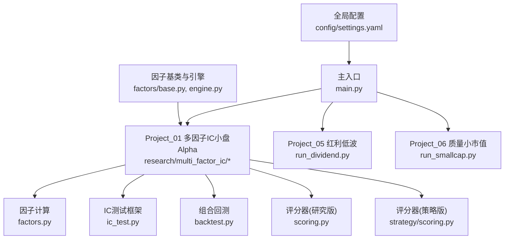
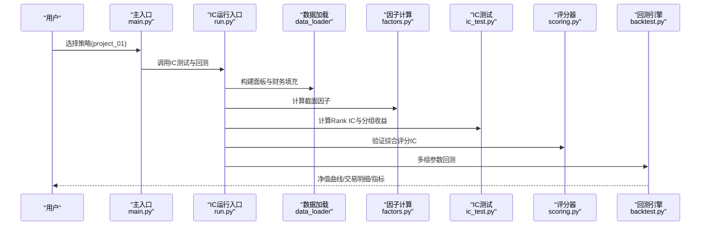
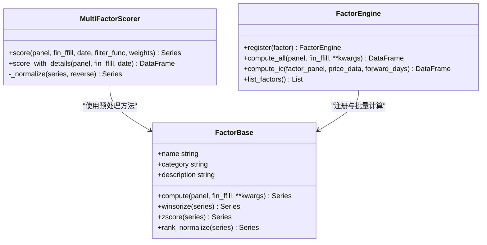
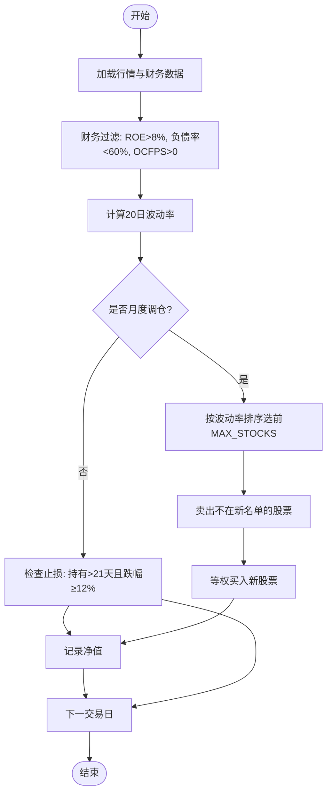
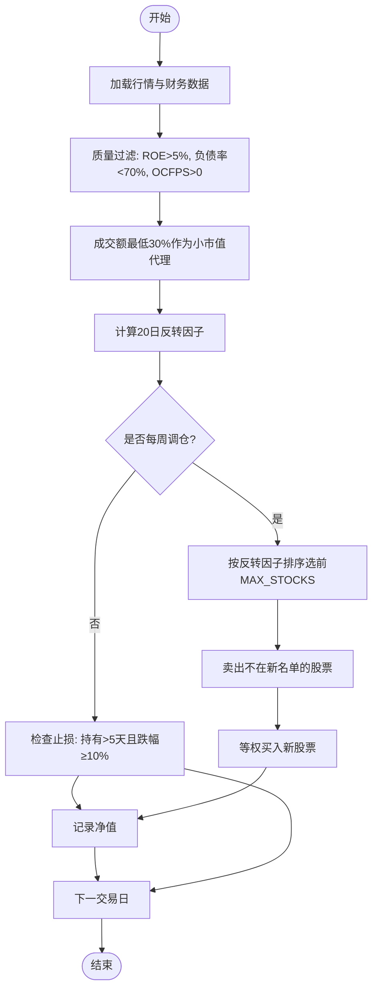
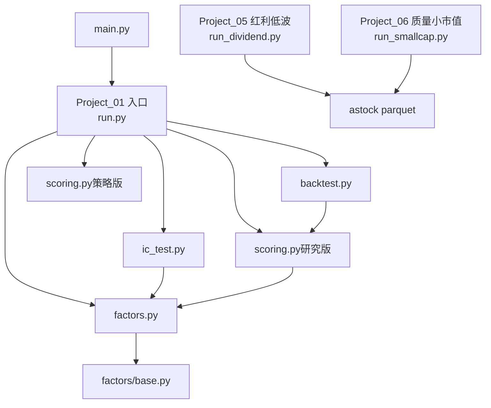

# 实际案例分析

<cite>
**本文引用的文件**   
- [main.py](file://main.py)
- [settings.yaml](file://config/settings.yaml)
- [run.py](file://projects/Project_01_多因子IC小盘Alpha/research/multi_factor_ic/run.py)
- [factors.py](file://projects/Project_01_多因子IC小盘Alpha/research/multi_factor_ic/factors.py)
- [ic_test.py](file://projects/Project_01_多因子IC小盘Alpha/research/multi_factor_ic/ic_test.py)
- [backtest.py](file://projects/Project_01_多因子IC小盘Alpha/research/multi_factor_ic/backtest.py)
- [scoring.py（研究版）](file://projects/Project_01_多因子IC小盘Alpha/research/multi_factor_ic/scoring.py)
- [scoring.py（策略版）](file://projects/Project_01_多因子IC小盘Alpha/strategy/scoring.py)
- [strategy.yaml](file://projects/Project_01_多因子IC小盘Alpha/config/strategy.yaml)
- [run_dividend.py](file://projects/Project_05_红利低波/run_dividend.py)
- [run_smallcap.py](file://projects/Project_06_质量小市值/run_smallcap.py)
- [base.py](file://factors/base.py)
- [engine.py](file://factors/engine.py)
</cite>

## 目录
1. [引言](#引言)
2. [项目结构](#项目结构)
3. [核心组件](#核心组件)
4. [架构总览](#架构总览)
5. [详细组件分析](#详细组件分析)
6. [依赖关系分析](#依赖关系分析)
7. [性能与回测要点](#性能与回测要点)
8. [故障排查指南](#故障排查指南)
9. [结论](#结论)
10. [附录：配置与复现实例](#附录配置与复现实例)

## 引言
本案例文档围绕 QuantLab 中的三类实战策略展开：多因子 IC 小盘 Alpha、红利低波、质量小市值。每个案例均从策略背景、理论基础、实现细节、参数调优、结果解读与经验总结进行系统阐述，并给出可复现的入口与配置文件路径，帮助读者快速上手与二次开发。

## 项目结构
QuantLab 采用“项目化”组织方式，每个策略位于独立的 projects 子目录下，包含数据、因子、评分、回测与报告等模块；同时提供全局配置 settings.yaml 与统一入口 main.py。

图表来源 
- [main.py:1-104](file://main.py#L1-L104)
- [settings.yaml:1-69](file://config/settings.yaml#L1-L69)
- [run.py:1-66](file://projects/Project_01_多因子IC小盘Alpha/research/multi_factor_ic/run.py#L1-L66)
- [factors.py:1-140](file://projects/Project_01_多因子IC小盘Alpha/research/multi_factor_ic/factors.py#L1-L140)
- [ic_test.py:1-206](file://projects/Project_01_多因子IC小盘Alpha/research/multi_factor_ic/ic_test.py#L1-L206)
- [backtest.py:1-716](file://projects/Project_01_多因子IC小盘Alpha/research/multi_factor_ic/backtest.py#L1-L716)
- [scoring.py（研究版）:1-262](file://projects/Project_01_多因子IC小盘Alpha/research/multi_factor_ic/scoring.py#L1-L262)
- [scoring.py（策略版）:1-158](file://projects/Project_01_多因子IC小盘Alpha/strategy/scoring.py#L1-L158)
- [base.py:1-52](file://factors/base.py#L1-L52)
- [engine.py:1-86](file://factors/engine.py#L1-L86)

章节来源
- [main.py:1-104](file://main.py#L1-L104)
- [settings.yaml:1-69](file://config/settings.yaml#L1-L69)

## 核心组件
- 因子层：提供截面因子计算、标准化与截尾处理，支持价值、质量、动量/反转、波动率、流动性与量价相关等多类因子。
- IC 评估层：按月度调仓日计算 Rank IC、分组收益与统计摘要，输出 HTML 报告。
- 评分与选股层：将多因子归一化后加权合成综合评分，支持行业中性化与动态 Universe。
- 回测层：支持等权持仓、双月/月度/季度调仓、交易成本扣除、止损替换与绩效指标计算。
- 工程化：统一的因子基类与引擎，便于扩展新因子与批量 IC 测试。

章节来源
- [factors.py:1-140](file://projects/Project_01_多因子IC小盘Alpha/research/multi_factor_ic/factors.py#L1-L140)
- [ic_test.py:1-206](file://projects/Project_01_多因子IC小盘Alpha/research/multi_factor_ic/ic_test.py#L1-L206)
- [scoring.py（研究版）:1-262](file://projects/Project_01_多因子IC小盘Alpha/research/multi_factor_ic/scoring.py#L1-L262)
- [backtest.py:1-716](file://projects/Project_01_多因子IC小盘Alpha/research/multi_factor_ic/backtest.py#L1-L716)
- [base.py:1-52](file://factors/base.py#L1-L52)
- [engine.py:1-86](file://factors/engine.py#L1-L86)

## 架构总览
下图展示多因子 IC 小盘 Alpha 策略从数据到回测的整体流程，以及三个案例的并行入口。

图表来源 
- [main.py:28-73](file://main.py#L28-L73)
- [run.py:24-66](file://projects/Project_01_多因子IC小盘Alpha/research/multi_factor_ic/run.py#L24-L66)
- [factors.py:34-139](file://projects/Project_01_多因子IC小盘Alpha/research/multi_factor_ic/factors.py#L34-L139)
- [ic_test.py:78-114](file://projects/Project_01_多因子IC小盘Alpha/research/multi_factor_ic/ic_test.py#L78-L114)
- [scoring.py（研究版）:197-242](file://projects/Project_01_多因子IC小盘Alpha/research/multi_factor_ic/scoring.py#L197-L242)
- [backtest.py:47-170](file://projects/Project_01_多因子IC小盘Alpha/research/multi_factor_ic/backtest.py#L47-L170)

## 详细组件分析

### 多因子 IC 小盘 Alpha 策略
- 策略背景：在中小市值范围内，通过价值、质量、反转与低波等因子的稳健叠加，获取超额收益；结合 VWAP 量价相关因子增强短期信号。
- 理论基础：
  - 价值因子（BP/EP）：估值越低预期回报越高。
  - 质量因子（ROE）：盈利质量与持续性。
  - 反转因子（1m）：短期均值回归在小盘更显著。
  - 低波因子（volatility_60d）：低波动股票长期风险调整后收益更优。
  - 量价因子（vwap_volume_corr）：VWAP与成交量的相关性作为微观结构信号。
- 实现细节：
  - 因子计算：截面值计算、Winsorize 与 Z-score 标准化、方向调整（反转/低波取负）。
  - 评分合成：权重配置（BP 30%、反转 25%、低波 25%、ROE 20%，或含 VWAP 10% 的变体），最终归一到 0~100。
  - 选股与约束：小盘过滤（circ_mv < 30亿）、成交额过滤、可选行业中性化（单行业≤25%）。
  - 回测逻辑：次日收盘价买入，等权持仓，双月调仓，单边交易成本 0.2%，动态滚动 Universe 消除生存偏差。
  - 止损机制：盘中止损触发后卖出并替换为最高评分未持仓标的，避免资金闲置。
- 参数调优：
  - top_n（10/20/30/80）对收益与回撤的影响。
  - 调仓频率（周/双周/月/双月/季）对比。
  - 止损阈值（-8%/-12%/-16%）对胜率与回撤的改善。
- 结果解读：
  - 年化收益约 15.5%，夏普约 0.50，最大回撤约 -20.5%，胜率约 55%（以策略配置为准）。
  - IC 统计显示各因子稳定性与方向一致性，分组收益呈现单调性更佳。
- 经验总结：
  - 小盘反转与低波在短周期内贡献显著，需配合严格的数据清洗与未来函数规避。
  - 行业中性化有助于降低风格暴露，提升跨市场稳定性。
  - 止损替换能显著降低尾部风险，但需权衡换手与交易成本。

图表来源 
- [scoring.py（研究版）:40-139](file://projects/Project_01_多因子IC小盘Alpha/research/multi_factor_ic/scoring.py#L40-L139)
- [engine.py:9-86](file://factors/engine.py#L9-L86)
- [base.py:9-52](file://factors/base.py#L9-L52)

章节来源
- [factors.py:1-140](file://projects/Project_01_多因子IC小盘Alpha/research/multi_factor_ic/factors.py#L1-L140)
- [ic_test.py:1-206](file://projects/Project_01_多因子IC小盘Alpha/research/multi_factor_ic/ic_test.py#L1-L206)
- [backtest.py:1-716](file://projects/Project_01_多因子IC小盘Alpha/research/multi_factor_ic/backtest.py#L1-L716)
- [scoring.py（研究版）:1-262](file://projects/Project_01_多因子IC小盘Alpha/research/multi_factor_ic/scoring.py#L1-L262)
- [scoring.py（策略版）:1-158](file://projects/Project_01_多因子IC小盘Alpha/strategy/scoring.py#L1-L158)
- [strategy.yaml:1-62](file://projects/Project_01_多因子IC小盘Alpha/config/strategy.yaml#L1-L62)

### 红利低波策略
- 策略背景：选取高分红且低波动的股票，追求稳定收益与较低回撤，适合稳健型资金。
- 理论基础：
  - 分红因子：高股息率与现金流充裕的企业具备防御属性。
  - 低波动因子：历史波动率低，下行风险相对可控。
  - 质量过滤：ROE 与负债率筛选，确保基本面健康。
- 实现细节：
  - 选股标准：ROE>8%、负债率<60%、经营性现金流为正；在候选池内按近20日波动率排序，选波动率最低的前 N 只。
  - 权重分配：等权分配，单票上限不超过总资金的 95% 比例限制。
  - 调仓机制：月度调仓，卖出不在新名单的股票，买入新标的。
  - 风险控制：持有超 21 个交易日且跌幅≥12% 触发止损卖出。
  - 回测设置：初始资金 100万，佣金 0.025%、印花税 0.1%、滑点 0.1%。
- 参数调优：
  - MAX_STOCKS（如 30）对分散度与交易成本的影响。
  - STOP_LOSS（如 -12%）对回撤与胜率的作用。
  - 波动率窗口（20日）与财务口径对齐。
- 结果解读：
  - 输出净值曲线、交易明细与关键指标（总收益、年化、最大回撤、夏普、Calmar、胜率）。
- 经验总结：
  - 低波+高质量是稳健策略的核心，注意财报披露滞后与停牌/ST过滤。
  - 月度调仓可降低换手，但需关注极端行情下的止损执行。

图表来源 
- [run_dividend.py:21-204](file://projects/Project_05_红利低波/run_dividend.py#L21-L204)

章节来源
- [run_dividend.py:1-204](file://projects/Project_05_红利低波/run_dividend.py#L1-L204)

### 质量小市值策略
- 策略背景：在质量筛选基础上聚焦小市值（以成交额代理），叠加短期反转因子，捕捉小盘股的均值回归与流动性溢价。
- 理论基础：
  - 质量因子：ROE、负债率、现金流保障企业质量。
  - 小市值代理：成交额最低 30% 近似小盘股池。
  - 反转因子：过去 20 日跌幅越大，短期反弹概率更高。
- 实现细节：
  - 质量过滤：ROE>5%、负债率<70%、OCFPS>0。
  - 小市值筛选：成交额分位数 0.30 以下。
  - 选股排序：按 20 日反转因子降序，选前 MAX_STOCKS 只。
  - 调仓机制：每周调仓，止损线 -10%，持有至少 5 个交易日后触发止损。
  - 回测设置：初始资金 100万，佣金 0.025%、印花税 0.1%、滑点 0.2%。
- 参数调优：
  - MAX_STOCKS（如 40）与换手率的平衡。
  - 反转窗口（20日）与止损阈值的匹配。
  - 小市值代理的准确性与真实市值数据的替代方案。
- 结果解读：
  - 输出净值曲线、交易明细与关键指标，关注小盘股的高波动与尾部风险。
- 经验总结：
  - 小市值策略对数据质量敏感，需严格过滤 ST/停牌与异常值。
  - 高频调仓带来较高换手，需精确估计滑点与冲击成本。

图表来源 
- [run_smallcap.py:21-212](file://projects/Project_06_质量小市值/run_smallcap.py#L21-L212)

章节来源
- [run_smallcap.py:1-212](file://projects/Project_06_质量小市值/run_smallcap.py#L1-L212)

## 依赖关系分析
- 主入口 main.py 负责加载全局配置与调度 Project_01 的回测流程。
- Project_01 内部依赖 factors.py（因子计算）、ic_test.py（IC评估）、scoring.py（评分器）、backtest.py（回测引擎）。
- 因子基类 base.py 与引擎 engine.py 提供通用能力，便于扩展。
- 其他两个策略（红利低波、质量小市值）为独立脚本，直接读取 parquet 数据并执行回测。

图表来源 
- [main.py:28-73](file://main.py#L28-L73)
- [run.py:24-66](file://projects/Project_01_多因子IC小盘Alpha/research/multi_factor_ic/run.py#L24-L66)
- [factors.py:1-140](file://projects/Project_01_多因子IC小盘Alpha/research/multi_factor_ic/factors.py#L1-L140)
- [ic_test.py:1-206](file://projects/Project_01_多因子IC小盘Alpha/research/multi_factor_ic/ic_test.py#L1-L206)
- [scoring.py（研究版）:1-262](file://projects/Project_01_多因子IC小盘Alpha/research/multi_factor_ic/scoring.py#L1-L262)
- [backtest.py:1-716](file://projects/Project_01_多因子IC小盘Alpha/research/multi_factor_ic/backtest.py#L1-L716)
- [scoring.py（策略版）:1-158](file://projects/Project_01_多因子IC小盘Alpha/strategy/scoring.py#L1-L158)
- [base.py:1-52](file://factors/base.py#L1-L52)
- [run_dividend.py:1-204](file://projects/Project_05_红利低波/run_dividend.py#L1-L204)
- [run_smallcap.py:1-212](file://projects/Project_06_质量小市值/run_smallcap.py#L1-L212)

章节来源
- [main.py:1-104](file://main.py#L1-L104)
- [run.py:1-66](file://projects/Project_01_多因子IC小盘Alpha/research/multi_factor_ic/run.py#L1-L66)

## 性能与回测要点
- 数据准备：
  - 使用 parquet 格式提升读取效率，合理划分日期区间与 Universe。
  - 财务数据需按披露滞后对齐，避免未来函数。
- 因子计算：
  - 向量化操作优先（unstack + rolling corr），减少 groupby-apply 的开销。
  - Winsorize 与 Z-score 标准化保证因子分布稳定。
- 回测优化：
  - 动态滚动 Universe 消除幸存者偏差。
  - 交易成本与滑点需与实际一致，避免过度乐观。
  - 止损替换机制提高资金使用效率，但需控制换手。
- 指标计算：
  - 年化收益按实际日历天数估算，样本不足时仅报累计收益。
  - 夏普比率基于期频收益率与无风险利率拆分。

章节来源
- [factors.py:104-139](file://projects/Project_01_多因子IC小盘Alpha/research/multi_factor_ic/factors.py#L104-L139)
- [backtest.py:173-230](file://projects/Project_01_多因子IC小盘Alpha/research/multi_factor_ic/backtest.py#L173-L230)

## 故障排查指南
- 常见错误：
  - 因子索引不对齐导致评分 NaN：确保 compute_all_factors 返回 Series 与 panel 索引一致。
  - 未来函数泄漏：使用前一日收盘价计算动量/反转，财务数据按披露滞后对齐。
  - 停牌/ST 未过滤：需在数据层剔除异常标的。
  - 止损执行时机：使用 D-1 收盘判断，D 日开盘执行，避免前视。
- 调试建议：
  - 打印每日候选池与评分 TOP N，核对选股逻辑。
  - 导出交易明细与止损事件，定位异常交易。
  - 逐步关闭动态 Universe 与行业中性化，定位问题来源。

章节来源
- [scoring.py（研究版）:4-7](file://projects/Project_01_多因子IC小盘Alpha/research/multi_factor_ic/scoring.py#L4-L7)
- [backtest.py:428-676](file://projects/Project_01_多因子IC小盘Alpha/research/multi_factor_ic/backtest.py#L428-L676)

## 结论
- 多因子 IC 小盘 Alpha 策略通过价值、质量、反转与低波的稳健叠加，在小市值范围内取得可观的风险调整后收益；结合 VWAP 量价相关与止损替换，进一步提升稳定性。
- 红利低波策略强调基本面质量与低波动，适合稳健资金；月度调仓与止损控制是关键。
- 质量小市值策略聚焦小盘股的均值回归与流动性溢价，需严格数据清洗与成本控制。
- 建议在实盘前进行充分的参数扫描与压力测试，并结合行业中性化与动态 Universe 提升鲁棒性。

## 附录：配置与复现实例
- 多因子 IC 小盘 Alpha：
  - 入口：[run.py:24-66](file://projects/Project_01_多因子IC小盘Alpha/research/multi_factor_ic/run.py#L24-L66)
  - 因子与评分：[factors.py:34-139](file://projects/Project_01_多因子IC小盘Alpha/research/multi_factor_ic/factors.py#L34-L139)、[scoring.py（研究版）:40-139](file://projects/Project_01_多因子IC小盘Alpha/research/multi_factor_ic/scoring.py#L40-L139)
  - 回测与止损：[backtest.py:47-170](file://projects/Project_01_多因子IC小盘Alpha/research/multi_factor_ic/backtest.py#L47-L170)、[backtest_stop_loss:428-676](file://projects/Project_01_多因子IC小盘Alpha/research/multi_factor_ic/backtest.py#L428-L676)
  - 策略配置：[strategy.yaml:1-62](file://projects/Project_01_多因子IC小盘Alpha/config/strategy.yaml#L1-L62)
- 红利低波：
  - 入口与回测：[run_dividend.py:21-204](file://projects/Project_05_红利低波/run_dividend.py#L21-L204)
- 质量小市值：
  - 入口与回测：[run_smallcap.py:21-212](file://projects/Project_06_质量小市值/run_smallcap.py#L21-L212)
- 全局配置：
  - [settings.yaml:1-69](file://config/settings.yaml#L1-L69)