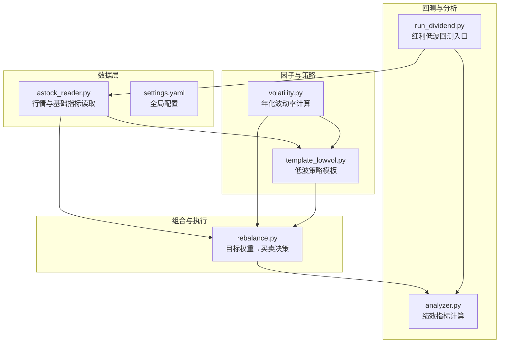
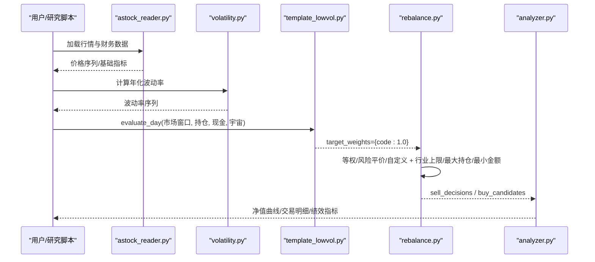
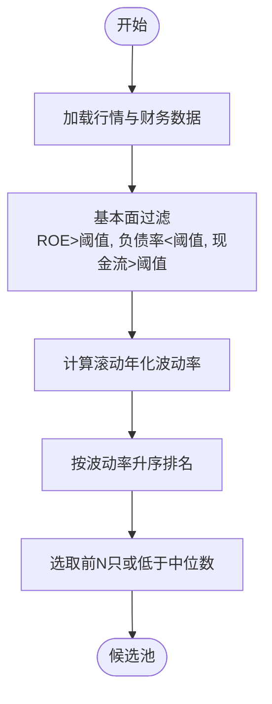
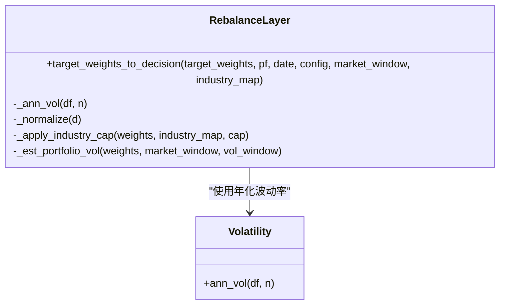
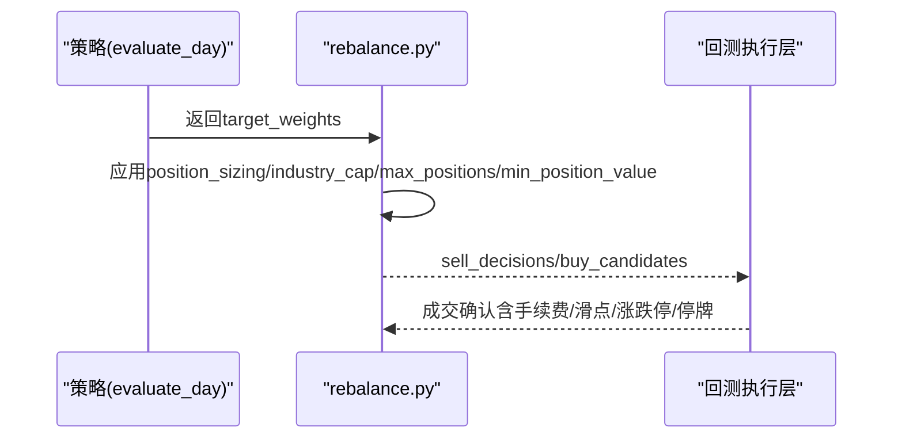
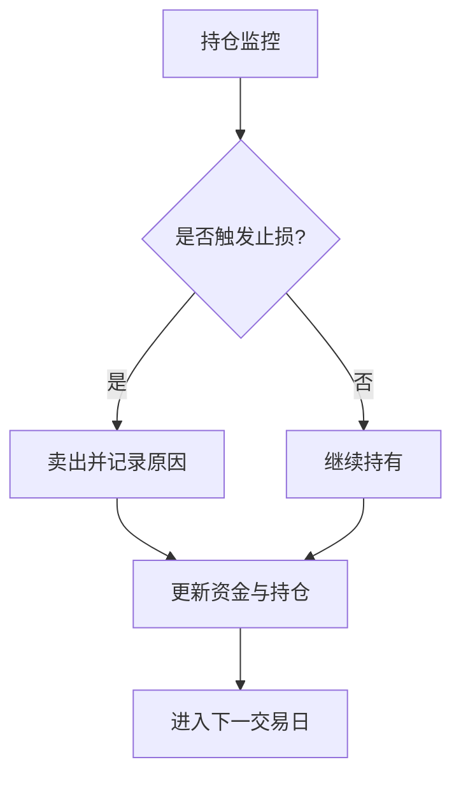
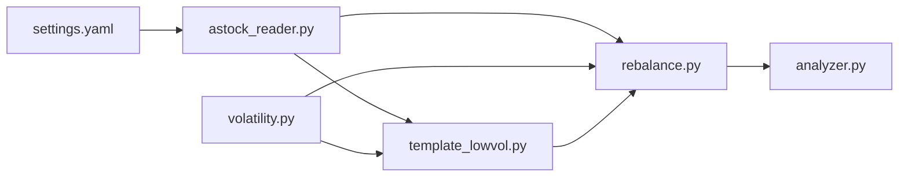
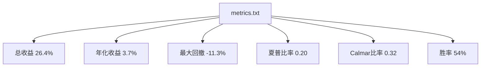

# 红利低波策略

<cite>
**本文引用的文件**   
- [run_dividend.py](file://projects/Project_05_红利低波/run_dividend.py)
- [dividend_metrics.txt](file://projects/Project_05_红利低波/results/dividend_metrics.txt)
- [dividend_equity.csv](file://projects/Project_05_红利低波/results/dividend_equity.csv)
- [template_lowvol.py](file://strategy/template_lowvol.py)
- [rebalance.py](file://backtest/rebalance.py)
- [volatility.py](file://factors/volatility.py)
- [settings.yaml](file://config/settings.yaml)
- [astock_reader.py](file://data/astock_reader.py)
- [analyzer.py](file://backtest/analyzer.py)
</cite>

## 目录
1. [引言](#引言)
2. [项目结构](#项目结构)
3. [核心组件](#核心组件)
4. [架构总览](#架构总览)
5. [详细组件分析](#详细组件分析)
6. [依赖关系分析](#依赖关系分析)
7. [性能与回测结果](#性能与回测结果)
8. [故障排查指南](#故障排查指南)
9. [结论](#结论)
10. [附录：参数与实现要点](#附录参数与实现要点)

## 引言
本案例围绕“红利低波”策略，系统梳理选股标准（股息率、波动率、基本面过滤）、权重分配方法（等权、市值加权、风险平价）、调仓机制（频率、交易成本、流动性）、风险控制（行业分散、个股限制、止损规则），并结合回测结果进行收益与风险分析。该策略在震荡市中具备防御特性，适合长期持有与稳健增值目标。

## 项目结构
本项目采用模块化设计，包含数据读取、因子计算、策略模板、通用组合层（再平衡）、回测引擎与分析器。红利低波策略的示例脚本位于 Project_05，同时框架提供可插拔的低波策略模板与通用的目标权重再平衡层，便于快速扩展与对比不同权重方案。

**图表来源** 
- [astock_reader.py:1-192](file://data/astock_reader.py#L1-L192)
- [settings.yaml:1-69](file://config/settings.yaml#L1-L69)
- [volatility.py:1-27](file://factors/volatility.py#L1-L27)
- [template_lowvol.py:1-94](file://strategy/template_lowvol.py#L1-L94)
- [rebalance.py:1-281](file://backtest/rebalance.py#L1-L281)
- [analyzer.py:1-176](file://backtest/analyzer.py#L1-L176)
- [run_dividend.py:1-204](file://projects/Project_05_红利低波/run_dividend.py#L1-L204)

**章节来源**
- [astock_reader.py:1-192](file://data/astock_reader.py#L1-L192)
- [settings.yaml:1-69](file://config/settings.yaml#L1-L69)

## 核心组件
- 数据读取与预处理：通过 astock_reader 加载日行情与基础指标，支持复权与列裁剪以降低内存占用；settings.yaml 统一回测起止时间、手续费、滑点与基准。
- 因子计算：volatility.py 提供年化波动率估计，供策略与组合层使用。
- 策略模板：template_lowvol.py 以“最近窗口波动率最低的前N只”作为信号，返回等权意愿，由通用组合层完成权重落地。
- 组合再平衡：rebalance.py 将目标权重转换为买卖决策，内置等权、风险平价、自定义权重模式，并支持行业上限、最大持仓数、最小持仓金额、波动率目标与杠杆上限。
- 回测入口与指标：run_dividend.py 演示红利低波的回测流程（财务过滤+低波选股+月度调仓+止损）；analyzer.py 输出夏普、最大回撤、Calmar、胜率等指标。

**章节来源**
- [astock_reader.py:1-192](file://data/astock_reader.py#L1-L192)
- [settings.yaml:1-69](file://config/settings.yaml#L1-L69)
- [volatility.py:1-27](file://factors/volatility.py#L1-L27)
- [template_lowvol.py:1-94](file://strategy/template_lowvol.py#L1-L94)
- [rebalance.py:1-281](file://backtest/rebalance.py#L1-L281)
- [analyzer.py:1-176](file://backtest/analyzer.py#L1-L176)
- [run_dividend.py:1-204](file://projects/Project_05_红利低波/run_dividend.py#L1-L204)

## 架构总览
策略从数据层获取行情与财务数据，经因子计算生成信号，再由组合层按配置落地为交易指令，最后由回测引擎统计绩效。

**图表来源** 
- [astock_reader.py:1-192](file://data/astock_reader.py#L1-L192)
- [volatility.py:1-27](file://factors/volatility.py#L1-L27)
- [template_lowvol.py:1-94](file://strategy/template_lowvol.py#L1-L94)
- [rebalance.py:1-281](file://backtest/rebalance.py#L1-L281)
- [analyzer.py:1-176](file://backtest/analyzer.py#L1-L176)

## 详细组件分析

### 选股标准：股息率、波动率、基本面过滤
- 股息率筛选：示例脚本中未直接以股息率为排序依据，但数据源包含 dv_ttm/dv_ratio 字段，可用于构建股息率因子；模板策略则以低波动为主。
- 波动率计算：使用滚动收益率标准差乘以年化因子得到年化波动率，窗口可由配置控制（如60日）。
- 基本面过滤：示例脚本对财务数据进行多条件过滤（ROE、负债率、现金流/利润等），用于剔除质量不佳标的。

**图表来源** 
- [run_dividend.py:1-204](file://projects/Project_05_红利低波/run_dividend.py#L1-L204)
- [volatility.py:1-27](file://factors/volatility.py#L1-L27)

**章节来源**
- [run_dividend.py:1-204](file://projects/Project_05_红利低波/run_dividend.py#L1-L204)
- [volatility.py:1-27](file://factors/volatility.py#L1-L27)

### 权重分配方法：等权、市值加权、风险平价
- 等权配置：默认将选中股票赋予相等权重，简单稳健。
- 风险平价：按各标的波动率的倒数分配权重，使各标的对组合波动贡献均衡。
- 自定义/市值加权：可通过 custom 模式传入自定义权重；市值加权可在策略层生成权重后交由组合层归一化。

**图表来源** 
- [rebalance.py:1-281](file://backtest/rebalance.py#L1-L281)
- [volatility.py:1-27](file://factors/volatility.py#L1-L27)

**章节来源**
- [rebalance.py:1-281](file://backtest/rebalance.py#L1-L281)
- [volatility.py:1-27](file://factors/volatility.py#L1-L27)

### 调仓机制：频率、交易成本、流动性
- 调仓频率：模板策略支持 weekly/monthly/quarterly，示例脚本采用月度调仓。
- 交易成本：佣金、印花税、滑点在回测中显式扣除，确保更贴近真实成交。
- 流动性考虑：通过最小持仓金额、最大持仓数、行业上限等约束避免过度集中与小票流动性问题。

**图表来源** 
- [template_lowvol.py:1-94](file://strategy/template_lowvol.py#L1-L94)
- [rebalance.py:1-281](file://backtest/rebalance.py#L1-L281)

**章节来源**
- [template_lowvol.py:1-94](file://strategy/template_lowvol.py#L1-L94)
- [rebalance.py:1-281](file://backtest/rebalance.py#L1-L281)
- [settings.yaml:1-69](file://config/settings.yaml#L1-L69)

### 风险控制：行业分散、个股限制、止损规则
- 行业分散：rebalance.py 支持行业上限，按比例缩放超配行业权重。
- 个股限制：最大持仓数与最小持仓金额过滤，避免过度集中与过小仓位。
- 止损规则：示例脚本设置固定止损阈值（如-12%），结合持有期检查触发卖出。

**图表来源** 
- [run_dividend.py:1-204](file://projects/Project_05_红利低波/run_dividend.py#L1-L204)

**章节来源**
- [rebalance.py:1-281](file://backtest/rebalance.py#L1-L281)
- [run_dividend.py:1-204](file://projects/Project_05_红利低波/run_dividend.py#L1-L204)

## 依赖关系分析
- 数据依赖：astock_reader.py 提供行情与基础指标，settings.yaml 定义回测参数。
- 因子依赖：volatility.py 被 template_lowvol.py 与 rebalance.py 共同使用。
- 策略与组合：template_lowvol.py 仅输出目标权重，rebalance.py 负责权重落地与风控叠加。
- 回测与分析：analyzer.py 基于净值与交易明细计算绩效指标。

**图表来源** 
- [astock_reader.py:1-192](file://data/astock_reader.py#L1-L192)
- [volatility.py:1-27](file://factors/volatility.py#L1-L27)
- [template_lowvol.py:1-94](file://strategy/template_lowvol.py#L1-L94)
- [rebalance.py:1-281](file://backtest/rebalance.py#L1-L281)
- [analyzer.py:1-176](file://backtest/analyzer.py#L1-L176)
- [settings.yaml:1-69](file://config/settings.yaml#L1-L69)

**章节来源**
- [astock_reader.py:1-192](file://data/astock_reader.py#L1-L192)
- [volatility.py:1-27](file://factors/volatility.py#L1-L27)
- [template_lowvol.py:1-94](file://strategy/template_lowvol.py#L1-L94)
- [rebalance.py:1-281](file://backtest/rebalance.py#L1-L281)
- [analyzer.py:1-176](file://backtest/analyzer.py#L1-L176)
- [settings.yaml:1-69](file://config/settings.yaml#L1-L69)

## 性能与回测结果
- 收益表现：示例回测显示总收益约26.4%，年化约3.7%。
- 风险指标：最大回撤约-11.3%，夏普比率约0.20，Calmar比率约0.32。
- 交易特征：胜率约54%，交易次数适中，体现低波与基本面过滤带来的稳健性。

**图表来源** 
- [dividend_metrics.txt:1-7](file://projects/Project_05_红利低波/results/dividend_metrics.txt#L1-L7)

**章节来源**
- [dividend_metrics.txt:1-7](file://projects/Project_05_红利低波/results/dividend_metrics.txt#L1-L7)
- [analyzer.py:1-176](file://backtest/analyzer.py#L1-L176)

## 故障排查指南
- 数据缺失或索引异常：检查 astock_reader 的 MultiIndex 与列名是否匹配，确保日期范围与代码覆盖。
- 因子计算失败：确认波动率窗口足够长，收益率序列非空且标准差有效。
- 组合层无交易：检查 target_weights 是否为空，或 min_position_value/max_positions 导致过滤过严。
- 回测指标异常：核对初始资金、交易日历对齐、基准可用性与每日收益率计算。

**章节来源**
- [astock_reader.py:1-192](file://data/astock_reader.py#L1-L192)
- [volatility.py:1-27](file://factors/volatility.py#L1-L27)
- [rebalance.py:1-281](file://backtest/rebalance.py#L1-L281)
- [analyzer.py:1-176](file://backtest/analyzer.py#L1-L176)

## 结论
红利低波策略通过低波动与基本面过滤，在震荡市中展现防御优势与长期投资价值。框架化的策略模板与通用组合层使得权重分配与风控配置灵活可控，便于在不同市场环境下迭代优化。建议结合股息率因子与更多质量因子进一步丰富选股维度，并通过风险平价与波动率目标提升组合稳定性。

## 附录：参数与实现要点
- 关键参数
  - 回测区间与资金：起始/结束日期、初始资金、手续费、滑点、基准。
  - 因子窗口：波动率估计窗口（如60日）。
  - 权重配置：position_sizing（equal/vol_parity/custom）、industry_cap、max_positions、min_position_value、vol_target、target_leverage。
  - 调仓频率：weekly/monthly/quarterly。
- 实现要点
  - 数据读取：优先读取必要列，降低内存占用；支持复权处理。
  - 因子计算：标准化与中性化可按需启用，保证截面可比性。
  - 组合层：目标权重→买卖决策，自动处理涨跌停/停牌/整数手等约束。
  - 回测分析：统一输出净值曲线、交易明细与绩效指标，便于对比与审计。

**章节来源**
- [settings.yaml:1-69](file://config/settings.yaml#L1-L69)
- [template_lowvol.py:1-94](file://strategy/template_lowvol.py#L1-L94)
- [rebalance.py:1-281](file://backtest/rebalance.py#L1-L281)
- [analyzer.py:1-176](file://backtest/analyzer.py#L1-L176)
- [run_dividend.py:1-204](file://projects/Project_05_红利低波/run_dividend.py#L1-L204)