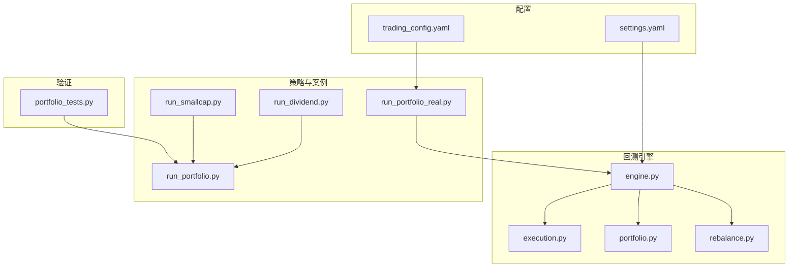
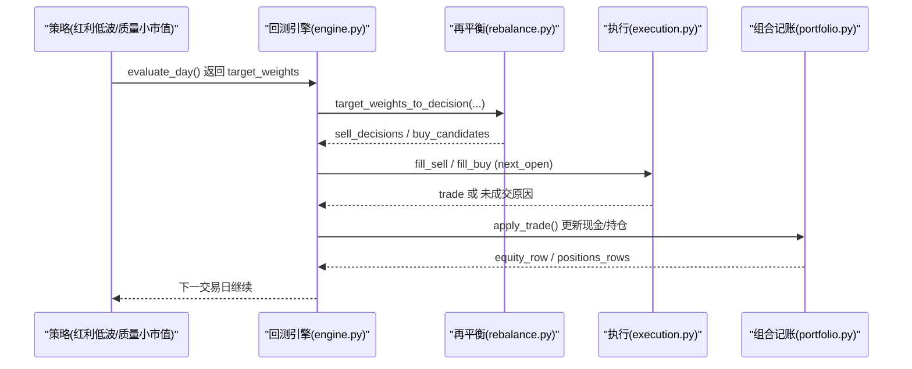
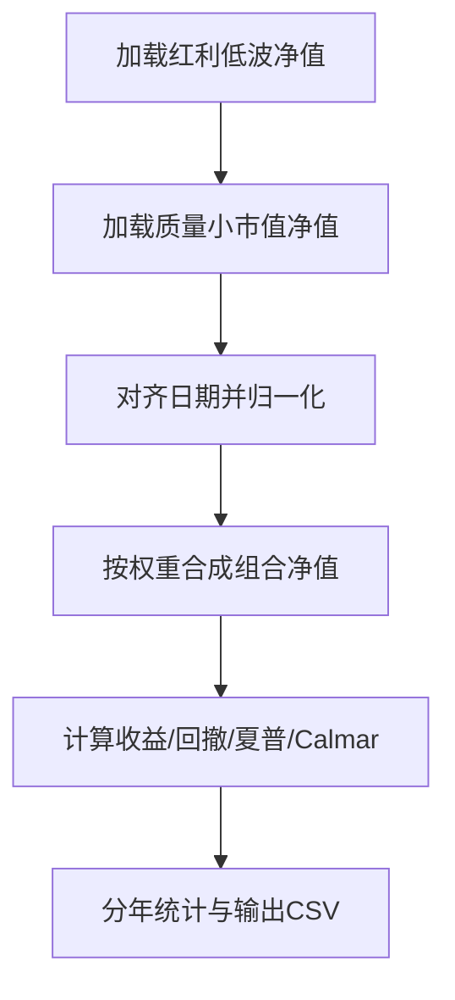
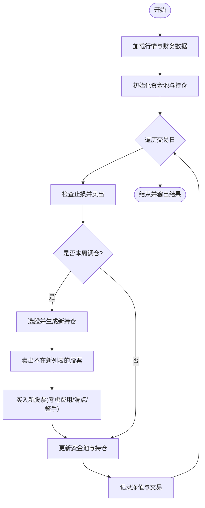
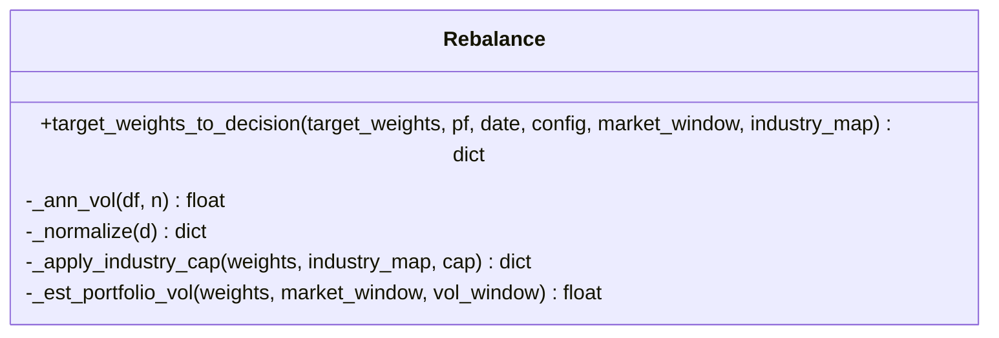
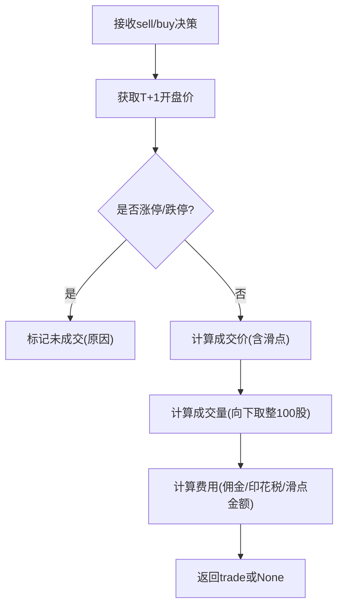
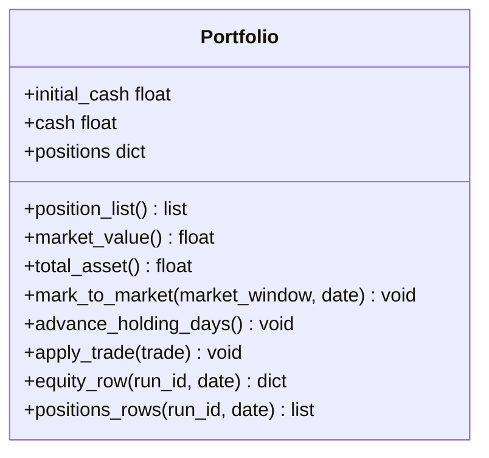
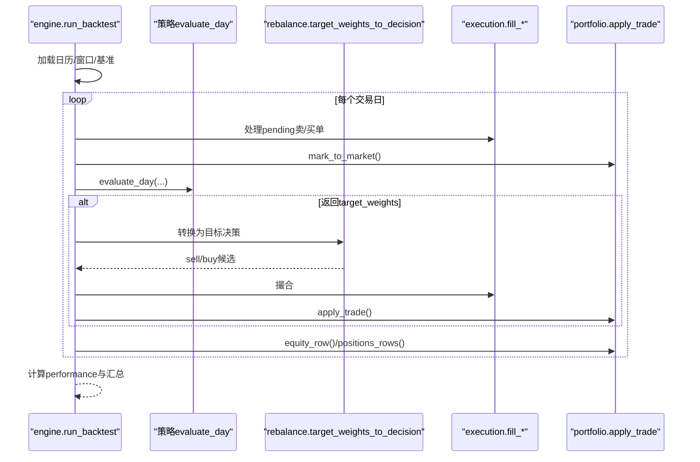
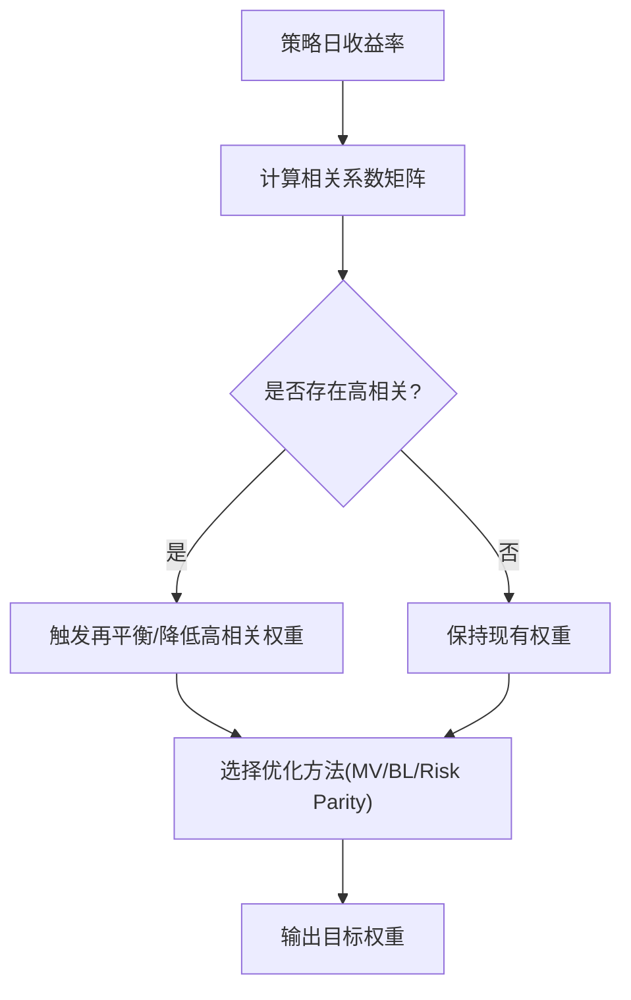
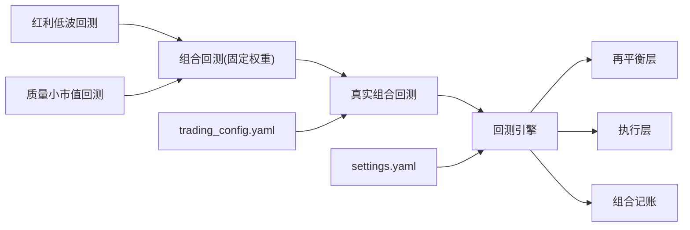

# 组合策略

<cite>
**本文引用的文件**   
- [run_portfolio.py](file://projects/Project_09_组合策略/run_portfolio.py)
- [run_portfolio_real.py](file://projects/Project_09_组合策略/run_portfolio_real.py)
- [engine.py](file://backtest/engine.py)
- [execution.py](file://backtest/execution.py)
- [portfolio.py](file://backtest/portfolio.py)
- [rebalance.py](file://backtest/rebalance.py)
- [settings.yaml](file://config/settings.yaml)
- [trading_config.yaml](file://config/trading_config.yaml)
- [run_dividend.py](file://projects/Project_05_红利低波/run_dividend.py)
- [run_smallcap.py](file://projects/Project_06_质量小市值/run_smallcap.py)
- [portfolio_tests.py](file://projects/verification/portfolio_tests.py)
- [A股量化框架_五大扩展模块.md](file://A股量化框架_五大扩展模块.md)
</cite>

## 目录
1. [引言](#引言)
2. [项目结构](#项目结构)
3. [核心组件](#核心组件)
4. [架构总览](#架构总览)
5. [详细组件分析](#详细组件分析)
6. [依赖关系分析](#依赖关系分析)
7. [性能与稳定性考量](#性能与稳定性考量)
8. [故障排查指南](#故障排查指南)
9. [结论与建议](#结论与建议)
10. [附录：配置与示例](#附录配置与示例)

## 引言
本案例围绕“多策略组合”的构建、优化、再平衡与实盘对接展开，以“红利低波 + 质量小市值”两个子策略为实例，展示从数据到净值、从权重分配到交易执行、再到绩效归因的全流程。文档重点覆盖：
- 策略相关性分析与资产配置模型
- 风险预算与权重优化（均值方差、Black-Litterman、风险平价）
- 组合再平衡机制（定期调仓、阈值触发、交易成本）
- 实盘对接（资金分配、订单执行、实时监控）
- 回测结果解读（收益曲线、贡献度、风险指标对比）
- 可复现的代码实现与配置示例

## 项目结构
本项目采用模块化组织：
- backtest：回测引擎、执行层、组合记账、目标权重再平衡
- strategy：策略注册与调度
- data：数据读取与基准
- config：全局与实盘配置
- projects：各策略与组合案例
- verification：验证与测试脚本

图表来源
- [engine.py:1-619](file://backtest/engine.py#L1-L619)
- [execution.py:1-204](file://backtest/execution.py#L1-L204)
- [portfolio.py:1-189](file://backtest/portfolio.py#L1-L189)
- [rebalance.py:1-281](file://backtest/rebalance.py#L1-L281)
- [run_portfolio.py:1-71](file://projects/Project_09_组合策略/run_portfolio.py#L1-L71)
- [run_portfolio_real.py:1-335](file://projects/Project_09_组合策略/run_portfolio_real.py#L1-L335)
- [settings.yaml:1-69](file://config/settings.yaml#L1-L69)
- [trading_config.yaml:1-62](file://config/trading_config.yaml#L1-L62)
- [portfolio_tests.py:63-104](file://projects/verification/portfolio_tests.py#L63-L104)

章节来源
- [engine.py:1-619](file://backtest/engine.py#L1-L619)
- [settings.yaml:1-69](file://config/settings.yaml#L1-L69)

## 核心组件
- 组合记账 Portfolio：维护现金、持仓、逐日盯市、T+1可用量、权益曲线与持仓快照
- 执行层 Execution：按next_open模型撮合买卖，处理涨跌停、最小手、滑点与费用
- 目标权重再平衡 Rebalance：将策略target_weights转换为sell/buy决策，支持等权、波动率倒数、自定义规模、行业上限、最大持仓数、最小头寸价值、波动率目标与杠杆约束
- 回测引擎 Engine：串联数据、策略评估、再平衡、执行、记账与指标计算
- 案例脚本：两策略独立回测与组合加权/真实回测脚本
- 配置：全局回测参数与实盘账户/风控/下单/排程配置

章节来源
- [portfolio.py:1-189](file://backtest/portfolio.py#L1-L189)
- [execution.py:1-204](file://backtest/execution.py#L1-L204)
- [rebalance.py:1-281](file://backtest/rebalance.py#L1-L281)
- [engine.py:1-619](file://backtest/engine.py#L1-L619)

## 架构总览
下图展示了从策略信号到交易落地的完整链路，以及组合层面的再平衡与风控约束。

图表来源
- [engine.py:237-444](file://backtest/engine.py#L237-L444)
- [rebalance.py:101-260](file://backtest/rebalance.py#L101-L260)
- [execution.py:95-204](file://backtest/execution.py#L95-L204)
- [portfolio.py:103-189](file://backtest/portfolio.py#L103-L189)

## 详细组件分析

### 组合构建与回测（固定权重）
- 思路：加载两策略历史净值，对齐日期并归一化，按固定权重合成组合净值，计算年化收益、最大回撤、夏普、Calmar等指标
- 适用场景：快速验证组合分散效应与稳健性

图表来源
- [run_portfolio.py:1-71](file://projects/Project_09_组合策略/run_portfolio.py#L1-L71)

章节来源
- [run_portfolio.py:1-71](file://projects/Project_09_组合策略/run_portfolio.py#L1-L71)

### 真实组合回测（动态资金分配）
- 思路：在回测中分别维护两套资金池与持仓，按周调仓；每只股票设置止损线；买入时考虑手续费与滑点，卖出时扣印花税
- 关键点：每周调仓、止损触发、最小整手、资金池隔离、净值记录

图表来源
- [run_portfolio_real.py:96-335](file://projects/Project_09_组合策略/run_portfolio_real.py#L96-L335)

章节来源
- [run_portfolio_real.py:96-335](file://projects/Project_09_组合策略/run_portfolio_real.py#L96-L335)

### 目标权重再平衡（通用抽象）
- 输入：策略target_weights（{code: weight}），当前组合状态，市场窗口，行业映射
- 处理：
  - 基础权重：等权、波动率倒数、自定义规模
  - 约束：行业上限、最大持仓数、最小头寸价值
  - 风险目标：波动率目标与杠杆上限
  - 输出：sell_decisions / buy_candidates / target_positions / diagnostics
- 优势：策略只需输出相对权重，所有风控与仓位管理由统一层完成

图表来源
- [rebalance.py:31-260](file://backtest/rebalance.py#L31-L260)

章节来源
- [rebalance.py:1-281](file://backtest/rebalance.py#L1-281)

### 执行层撮合（next_open模型）
- 规则：
  - 买入价 = T+1开盘价 × (1 + 滑点)，涨停拒绝买入
  - 卖出价 = T+1开盘价 × (1 - 滑点)，跌停拒绝卖出
  - 成交量向下取整至100股倍数
  - 费用：佣金、印花税（卖出）、滑点金额
- 未成交原因：停牌、无可用量、价格无效、涨跌停、低于最小手数等

图表来源
- [execution.py:27-204](file://backtest/execution.py#L27-L204)

章节来源
- [execution.py:1-204](file://backtest/execution.py#L1-L204)

### 组合记账与T+1可用量
- 功能：
  - 每日盯市更新last_price与未实现盈亏
  - advance_holding_days：持有天数递增，释放T+1可用量
  - apply_trade：买入锁定available_volume=0，卖出减少volume与available_volume
  - 输出equity_row与positions_rows用于报表

图表来源
- [portfolio.py:38-189](file://backtest/portfolio.py#L38-L189)

章节来源
- [portfolio.py:1-189](file://backtest/portfolio.py#L1-L189)

### 回测主循环与基准对齐
- 要点：
  - 加载日历与历史窗口，预计算cut索引加速切片
  - 基准序列对齐与缺失前向填充
  - 每日：先处理pending订单，再mark_to_market，必要时计提两融利息
  - 调用策略evaluate_day，若返回target_weights则进入rebalance层
  - 汇总诊断信息、计算performance指标

图表来源
- [engine.py:237-519](file://backtest/engine.py#L237-L519)

章节来源
- [engine.py:1-619](file://backtest/engine.py#L1-L619)

### 策略相关性分析与权重优化（概念与实现参考）
- 相关性分析：基于日收益率计算相关系数矩阵，识别高相关策略并触发再平衡降权
- 权重优化方法：
  - 均值-方差优化（Markowitz）：最大化效用函数，受限于单股/行业/换手率等约束
  - Black-Litterman：结合市场均衡与观点，得到后验期望收益进行优化
  - 风险平价：使各资产对组合风险的边际贡献相等
- 代码参考：见“五大扩展模块”中的cvxpy实现与示例

图表来源
- [portfolio_tests.py:63-104](file://projects/verification/portfolio_tests.py#L63-L104)
- [A股量化框架_五大扩展模块.md:510-952](file://A股量化框架_五大扩展模块.md#L510-L952)

章节来源
- [portfolio_tests.py:63-104](file://projects/verification/portfolio_tests.py#L63-L104)
- [A股量化框架_五大扩展模块.md:510-952](file://A股量化框架_五大扩展模块.md#L510-L952)

## 依赖关系分析
- 组合案例依赖两策略的历史净值或实时回测逻辑
- 回测引擎依赖执行层、组合记账与再平衡层
- 配置驱动全局行为（回测参数、实盘账户与风控）

图表来源
- [run_portfolio.py:1-71](file://projects/Project_09_组合策略/run_portfolio.py#L1-L71)
- [run_portfolio_real.py:1-335](file://projects/Project_09_组合策略/run_portfolio_real.py#L1-L335)
- [engine.py:1-619](file://backtest/engine.py#L1-L619)
- [rebalance.py:1-281](file://backtest/rebalance.py#L1-L281)
- [execution.py:1-204](file://backtest/execution.py#L1-L204)
- [portfolio.py:1-189](file://backtest/portfolio.py#L1-L189)
- [settings.yaml:1-69](file://config/settings.yaml#L1-L69)
- [trading_config.yaml:1-62](file://config/trading_config.yaml#L1-L62)

章节来源
- [engine.py:1-619](file://backtest/engine.py#L1-L619)
- [settings.yaml:1-69](file://config/settings.yaml#L1-L69)
- [trading_config.yaml:1-62](file://config/trading_config.yaml#L1-L62)

## 性能与稳定性考量
- 数据切片优化：使用预计算cut索引实现O(1)每日窗口切片，避免重复searchsorted
- 基准对齐：缺失值前向填充，确保连续计算
- 执行效率：next_open模型简化撮合逻辑，减少不确定性
- 内存占用：仅内存结果结构，IO集中在report层
- 风险稳定：波动率目标与杠杆上限防止过度暴露；行业上限与最小头寸过滤提升鲁棒性

[本节为通用指导，不直接分析具体文件]

## 故障排查指南
- 常见未成交原因：停牌、无可用量、价格无效、涨跌停、低于最小手数
- 日志定位：engine每日日志包含fill/unfilled_order详情；rebalance层logs记录裁剪与缩放过程
- 基准不可用：检查benchmark_db路径与数据完整性
- 两融利息：当启用杠杆且现金为负时自动计提

章节来源
- [execution.py:95-204](file://backtest/execution.py#L95-L204)
- [engine.py:324-444](file://backtest/engine.py#L324-L444)
- [rebalance.py:101-260](file://backtest/rebalance.py#L101-L260)

## 结论与建议
- 组合分散效应显著：通过低相关策略组合，可在控制回撤的同时提升风险调整后收益
- 再平衡是关键：定期调仓与阈值触发相结合，配合交易成本与流动性约束，能显著提升稳健性
- 权重优化建议：优先使用风险平价作为基线，辅以均值方差或Black-Litterman进行微调；引入行业与换手率约束
- 实盘对接要点：严格遵循next_open撮合规则，完善风控（止损、回撤、单日换手），并建立监控与告警

[本节为总结性内容，不直接分析具体文件]

## 附录：配置与示例
- 全局回测配置（settings.yaml）：数据路径、回测区间、初始资金、费用与滑点、基准、因子预处理、策略默认宇宙
- 实盘配置（trading_config.yaml）：账户信息、仓位限制、费用、风控阈值、下单超时与重试、排程、通知、数据源与策略参数
- 组合示例：
  - 固定权重组合：70%红利低波 + 30%质量小市值，输出净值与指标
  - 真实组合回测：双资金池、周调仓、止损、费用与滑点、交易明细与净值曲线

章节来源
- [settings.yaml:1-69](file://config/settings.yaml#L1-L69)
- [trading_config.yaml:1-62](file://config/trading_config.yaml#L1-L62)
- [run_portfolio.py:1-71](file://projects/Project_09_组合策略/run_portfolio.py#L1-L71)
- [run_portfolio_real.py:1-335](file://projects/Project_09_组合策略/run_portfolio_real.py#L1-L335)
- [run_dividend.py:1-204](file://projects/Project_05_红利低波/run_dividend.py#L1-L204)
- [run_smallcap.py:1-212](file://projects/Project_06_质量小市值/run_smallcap.py#L1-L212)