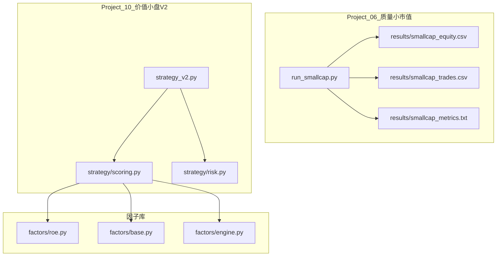
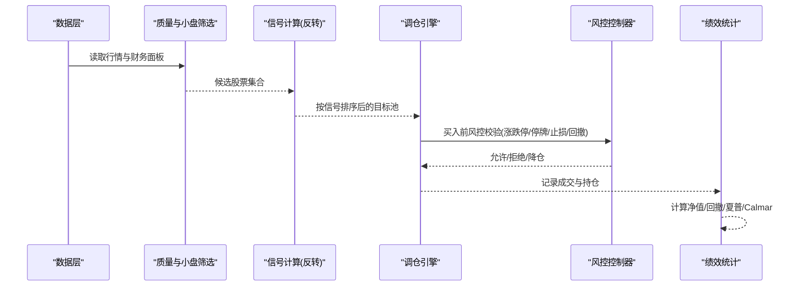
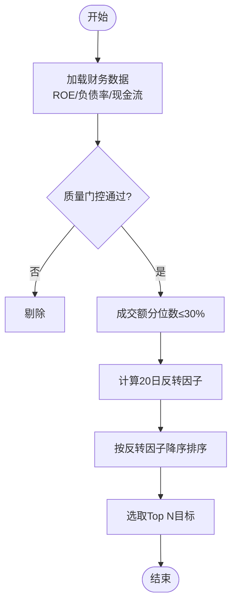
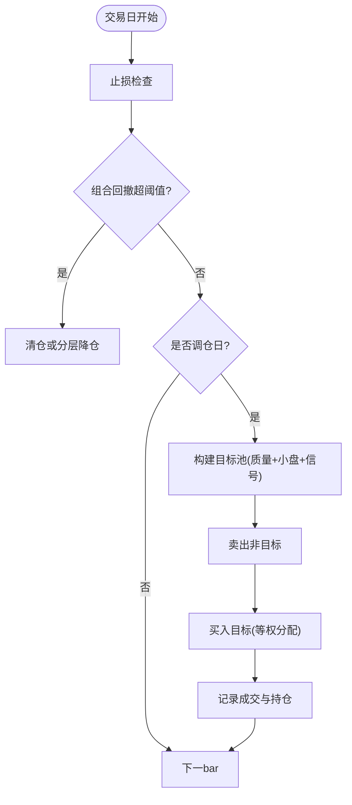
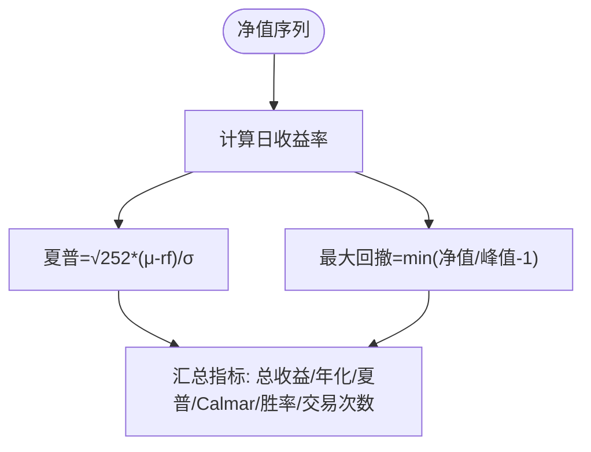
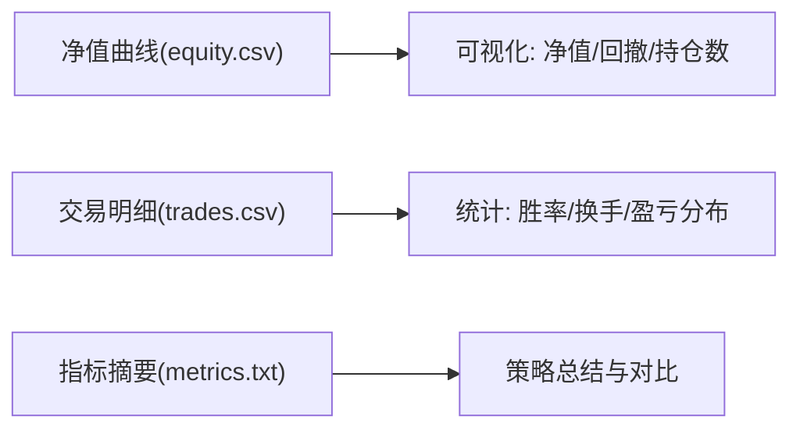
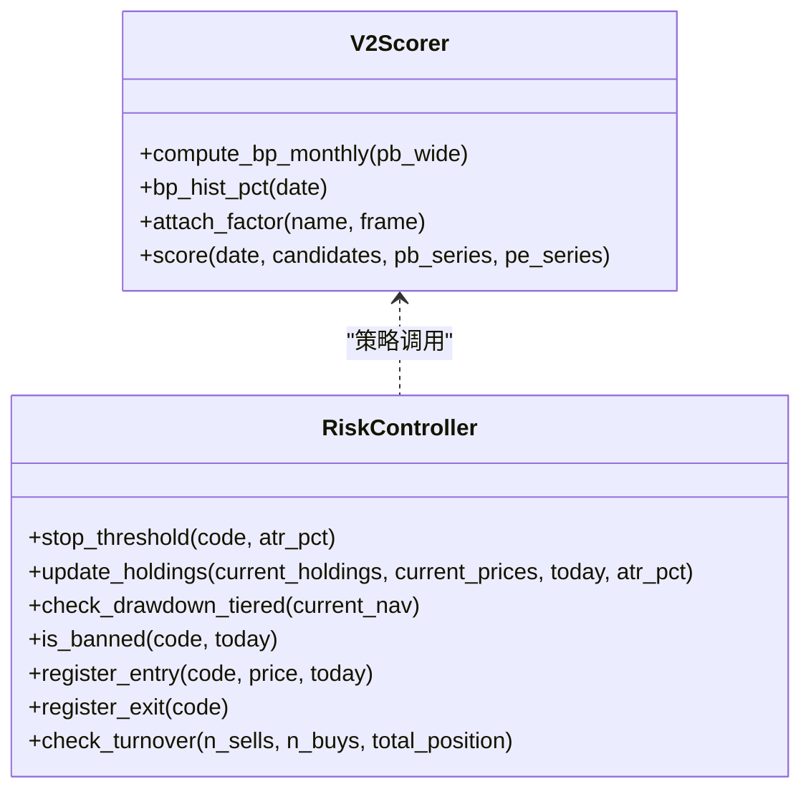
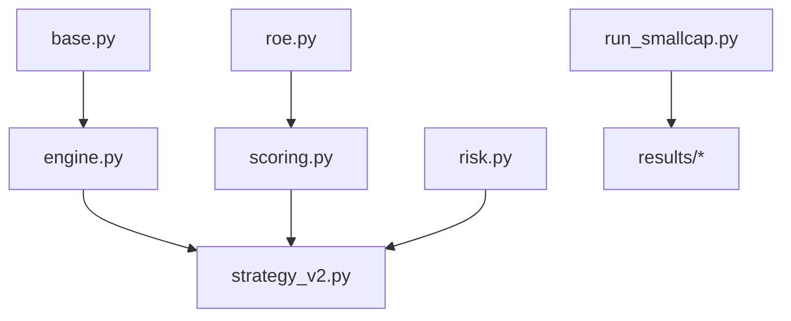

# 质量小市值策略

<cite>
**本文引用的文件**   
- [run_smallcap.py](file://projects/Project_06_质量小市值/run_smallcap.py)
- [smallcap_metrics.txt](file://projects/Project_06_质量小市值/results/smallcap_metrics.txt)
- [smallcap_equity.csv](file://projects/Project_06_质量小市值/results/smallcap_equity.csv)
- [smallcap_trades.csv](file://projects/Project_06_质量小市值/results/smallcap_trades.csv)
- [strategy_v2.py](file://projects/Project_10_价值小盘V2/strategy_v2.py)
- [scoring.py](file://projects/Project_10_价值小盘V2/strategy/scoring.py)
- [risk.py](file://projects/Project_10_价值小盘V2/strategy/risk.py)
- [roe.py](file://factors/roe.py)
- [base.py](file://factors/base.py)
- [engine.py](file://factors/engine.py)
</cite>

## 目录
1. [引言](#引言)
2. [项目结构](#项目结构)
3. [核心组件](#核心组件)
4. [架构总览](#架构总览)
5. [详细组件分析](#详细组件分析)
6. [依赖关系分析](#依赖关系分析)
7. [性能与回测评估](#性能与回测评估)
8. [故障排查指南](#故障排查指南)
9. [结论](#结论)
10. [附录：配置与复现实录](#附录配置与复现实录)

## 引言
本案例聚焦“质量+小市值”策略在A股市场的实现与评估。策略以财务质量因子（ROE、资产负债率、现金流）为核心筛选，结合流动性代理的市值分位数进行小盘暴露，辅以短期反转信号增强选股；通过周度调仓与止损控制风险，输出净值曲线、交易明细与关键绩效指标。同时引入更完善的评分与风控模块（行业中性BP、历史分位、ATR自适应止损、分层回撤降仓），为策略优化提供可复用的工程化能力。

## 项目结构
本项目包含两条主线：
- Project_06_质量小市值：轻量级回测脚本，快速验证质量+小盘+反转的选股逻辑与基础风控。
- Project_10_价值小盘V2：生产级单文件策略，具备评分器、风控控制器、订单挂单巡检与收盘对账等完整闭环。

图表来源
- [run_smallcap.py:1-212](file://projects/Project_06_质量小市值/run_smallcap.py#L1-L212)
- [strategy_v2.py:1-837](file://projects/Project_10_价值小盘V2/strategy_v2.py#L1-L837)
- [scoring.py:1-143](file://projects/Project_10_价值小盘V2/strategy/scoring.py#L1-L143)
- [risk.py:1-195](file://projects/Project_10_价值小盘V2/strategy/risk.py#L1-L195)
- [roe.py:1-43](file://factors/roe.py#L1-L43)
- [base.py:1-52](file://factors/base.py#L1-L52)
- [engine.py:1-86](file://factors/engine.py#L1-L86)

章节来源
- [run_smallcap.py:1-212](file://projects/Project_06_质量小市值/run_smallcap.py#L1-L212)
- [strategy_v2.py:1-837](file://projects/Project_10_价值小盘V2/strategy_v2.py#L1-L837)

## 核心组件
- 质量因子与筛选
  - ROE、资产负债率、经营性现金流（ocfps）作为质量门控条件，剔除低质量标的。
  - 使用最新公告期数据，避免未来函数。
- 小市值筛选
  - 以成交额分位数（最低30%）作为流动性代理，近似小盘暴露。
- 信号增强
  - 20日反转因子（跌幅越大得分越高）用于排序候选。
- 动态调整机制
  - 周度调仓；持有期检查；个股止损；组合回撤触发清仓或降仓。
- 绩效评估
  - 总收益、年化收益、最大回撤、夏普比率、Calmar比率、胜率、交易次数。
- 工程化扩展
  - V2评分器支持行业中性BP z-score与历史分位BP合成，可扩展EP与多因子。
  - 风控控制器支持ATR自适应止损、分层回撤降仓、禁入期管理、换手限制。

章节来源
- [run_smallcap.py:40-125](file://projects/Project_06_质量小市值/run_smallcap.py#L40-L125)
- [scoring.py:24-143](file://projects/Project_10_价值小盘V2/strategy/scoring.py#L24-L143)
- [risk.py:15-195](file://projects/Project_10_价值小盘V2/strategy/risk.py#L15-L195)

## 架构总览
质量小市值策略由“数据加载→质量过滤→小盘筛选→信号排序→调仓执行→风控校验→绩效统计”构成闭环。V2版本在此基础上增加了评分器与风控控制器，形成可插拔、可配置的模块化架构。

图表来源
- [run_smallcap.py:55-166](file://projects/Project_06_质量小市值/run_smallcap.py#L55-L166)
- [strategy_v2.py:439-633](file://projects/Project_10_价值小盘V2/strategy_v2.py#L439-L633)
- [scoring.py:77-138](file://projects/Project_10_价值小盘V2/strategy/scoring.py#L77-L138)
- [risk.py:74-110](file://projects/Project_10_价值小盘V2/strategy/risk.py#L74-L110)

## 详细组件分析

### 质量因子与筛选
- 质量门控
  - ROE阈值、资产负债率上限、经营性现金流为正，三者交集得到高质量标的集合。
  - 财务数据取最新公告期，避免未来函数。
- 小盘代理
  - 以成交额分位数（最低30%）近似小盘流动性特征。
- 信号排序
  - 20日反转因子（负涨跌幅越大得分越高），用于从候选池中挑选目标。

图表来源
- [run_smallcap.py:40-125](file://projects/Project_06_质量小市值/run_smallcap.py#L40-L125)
- [run_portfolio_real.py:59-92](file://projects/Project_09_组合策略/run_portfolio_real.py#L59-L92)

章节来源
- [run_smallcap.py:40-125](file://projects/Project_06_质量小市值/run_smallcap.py#L40-L125)
- [run_portfolio_real.py:59-92](file://projects/Project_09_组合策略/run_portfolio_real.py#L59-L92)

### 动态调整机制
- 定期调仓
  - 周度调仓：按自然周切换目标池，卖出不在新列表中的标的，买入新标的。
- 信号触发
  - 止损触发：个股亏损达到阈值立即卖出。
  - 组合回撤触发：超过阈值清仓或降仓。
- 仓位管理
  - 等权分配，考虑现金约束与最小交易单位（100股）。
  - V2版本支持补仓触发（持仓比例低于阈值提前补仓）。

图表来源
- [run_smallcap.py:75-166](file://projects/Project_06_质量小市值/run_smallcap.py#L75-L166)
- [strategy_v2.py:493-633](file://projects/Project_10_价值小盘V2/strategy_v2.py#L493-L633)
- [risk.py:112-157](file://projects/Project_10_价值小盘V2/strategy/risk.py#L112-L157)

章节来源
- [run_smallcap.py:75-166](file://projects/Project_06_质量小市值/run_smallcap.py#L75-L166)
- [strategy_v2.py:493-633](file://projects/Project_10_价值小盘V2/strategy_v2.py#L493-L633)
- [risk.py:112-157](file://projects/Project_10_价值小盘V2/strategy/risk.py#L112-L157)

### 绩效评估方法
- 超额收益与基准
  - 当前实现未内置基准对比，建议后续接入指数或自定义基准计算超额收益。
- 风险调整后收益
  - 夏普比率：基于日收益率均值与标准差，无风险利率采用固定值。
  - Calmar比率：年化收益除以最大回撤绝对值。
- 因子暴露分析
  - 当前为简单截面排序，未做行业中性与风格暴露控制；V2评分器已具备行业中性z-score能力，可迁移至质量因子。

图表来源
- [run_smallcap.py:168-195](file://projects/Project_06_质量小市值/run_smallcap.py#L168-L195)

章节来源
- [run_smallcap.py:168-195](file://projects/Project_06_质量小市值/run_smallcap.py#L168-L195)

### 回测结果与解读
- 收益曲线
  - smallcap_equity.csv记录了每日净值与持仓数量，可用于绘制净值曲线与持仓分布。
- 交易统计
  - smallcap_trades.csv包含每笔交易的日期、代码、原因（买入/调仓/止损）与当日盈亏百分比。
- 关键指标
  - smallcap_metrics.txt汇总了总收益、年化收益、最大回撤、夏普比率、Calmar比率、胜率与交易次数。

图表来源
- [smallcap_equity.csv:1-200](file://projects/Project_06_质量小市值/results/smallcap_equity.csv#L1-L200)
- [smallcap_trades.csv:1-200](file://projects/Project_06_质量小市值/results/smallcap_trades.csv#L1-L200)
- [smallcap_metrics.txt:1-7](file://projects/Project_06_质量小市值/results/smallcap_metrics.txt#L1-L7)

章节来源
- [smallcap_equity.csv:1-200](file://projects/Project_06_质量小市值/results/smallcap_equity.csv#L1-L200)
- [smallcap_trades.csv:1-200](file://projects/Project_06_质量小市值/results/smallcap_trades.csv#L1-L200)
- [smallcap_metrics.txt:1-7](file://projects/Project_06_质量小市值/results/smallcap_metrics.txt#L1-L7)

### 评分与风控扩展（V2）
- 评分器
  - 行业中性BP z-score + 历史分位BP合成，支持EP与多因子扩展。
  - 缓存机制提升计算效率。
- 风控控制器
  - 个股止损（固定或ATR自适应）、最长持有期、组合回撤分层降仓、禁入期、换手限制。
  - 状态持久化与恢复，保证跨日运行一致性。

图表来源
- [scoring.py:24-143](file://projects/Project_10_价值小盘V2/strategy/scoring.py#L24-L143)
- [risk.py:15-195](file://projects/Project_10_价值小盘V2/strategy/risk.py#L15-L195)

章节来源
- [scoring.py:24-143](file://projects/Project_10_价值小盘V2/strategy/scoring.py#L24-L143)
- [risk.py:15-195](file://projects/Project_10_价值小盘V2/strategy/risk.py#L15-L195)

## 依赖关系分析
- 因子库
  - base.py提供因子基类与标准化方法（截尾、z-score、rank）。
  - roe.py提供ROE as-of加载，确保点时数据无未来函数。
  - engine.py提供因子注册、批量计算与IC测试框架。
- 策略层
  - run_smallcap.py直接实现质量+小盘+反转的回测流程。
  - strategy_v2.py集成评分器与风控控制器，形成生产级闭环。

图表来源
- [base.py:1-52](file://factors/base.py#L1-L52)
- [engine.py:1-86](file://factors/engine.py#L1-L86)
- [roe.py:1-43](file://factors/roe.py#L1-L43)
- [scoring.py:1-143](file://projects/Project_10_价值小盘V2/strategy/scoring.py#L1-L143)
- [risk.py:1-195](file://projects/Project_10_价值小盘V2/strategy/risk.py#L1-L195)
- [strategy_v2.py:1-837](file://projects/Project_10_价值小盘V2/strategy_v2.py#L1-L837)
- [run_smallcap.py:1-212](file://projects/Project_06_质量小市值/run_smallcap.py#L1-L212)

章节来源
- [base.py:1-52](file://factors/base.py#L1-L52)
- [engine.py:1-86](file://factors/engine.py#L1-L86)
- [roe.py:1-43](file://factors/roe.py#L1-L43)
- [scoring.py:1-143](file://projects/Project_10_价值小盘V2/strategy/scoring.py#L1-L143)
- [risk.py:1-195](file://projects/Project_10_价值小盘V2/strategy/risk.py#L1-L195)
- [strategy_v2.py:1-837](file://projects/Project_10_价值小盘V2/strategy_v2.py#L1-L837)
- [run_smallcap.py:1-212](file://projects/Project_06_质量小市值/run_smallcap.py#L1-L212)

## 性能与回测评估
- 收益与风险
  - 总收益、年化收益、最大回撤、夏普比率、Calmar比率、胜率与交易次数已在metrics中汇总。
- 交易行为
  - 交易明细显示买入、调仓与止损的频率与盈亏分布，可用于换手与滑点敏感性分析。
- 持仓分析
  - 净值曲线中的n_pos列反映持仓数量变化，观察分散度与集中度。
- 改进方向
  - 引入基准对比计算超额收益。
  - 增加行业中性与风格暴露控制，降低系统性风险。
  - 使用真实市值数据替代成交额代理，提高小盘暴露准确性。

章节来源
- [smallcap_metrics.txt:1-7](file://projects/Project_06_质量小市值/results/smallcap_metrics.txt#L1-L7)
- [smallcap_trades.csv:1-200](file://projects/Project_06_质量小市值/results/smallcap_trades.csv#L1-L200)
- [smallcap_equity.csv:1-200](file://projects/Project_06_质量小市值/results/smallcap_equity.csv#L1-L200)

## 故障排查指南
- 数据缺失
  - 若财务数据缺失导致质量过滤为空，检查ann_date解析与空值处理。
- 停牌与涨跌停
  - 买入跳过涨停与停牌；卖出暂缓跌停与停牌，需确认市场数据可用性。
- 委托失败与重试
  - V2策略具备挂单巡检与撤单重下机制，关注日志中的重试与回滚信息。
- 对账不一致
  - 收盘对账将估算记账校准为真实成交，检查deal记录与today_orders映射。

章节来源
- [strategy_v2.py:187-232](file://projects/Project_10_价值小盘V2/strategy_v2.py#L187-L232)
- [strategy_v2.py:233-395](file://projects/Project_10_价值小盘V2/strategy_v2.py#L233-L395)
- [strategy_v2.py:655-738](file://projects/Project_10_价值小盘V2/strategy_v2.py#L655-L738)

## 结论
质量小市值策略通过财务质量门控与流动性代理的小盘暴露，结合短期反转信号，实现了在小盘股中的Alpha获取。周度调仓与止损控制有效管理下行风险。V2版本的评分器与风控控制器提供了更强的可配置性与鲁棒性，便于进一步扩展多因子与风险控制。建议在后续迭代中引入基准对比、行业中性与真实市值数据，以提升策略的稳定性和可解释性。

## 附录：配置与复现实录
- 参数与路径
  - 日线与财务数据路径、回测区间、初始资金、最大持仓、止损、手续费、印花税、滑点等参数位于run_smallcap.py。
  - 输出目录与结果文件路径同样在该文件中定义。
- 复现步骤
  - 准备astock parquet数据（日线与财务指标）。
  - 运行run_smallcap.py生成equity曲线、交易明细与指标摘要。
  - 如需生产级功能，参考strategy_v2.py与scoring.py、risk.py进行扩展。

章节来源
- [run_smallcap.py:1-20](file://projects/Project_06_质量小市值/run_smallcap.py#L1-L20)
- [run_smallcap.py:197-207](file://projects/Project_06_质量小市值/run_smallcap.py#L197-L207)