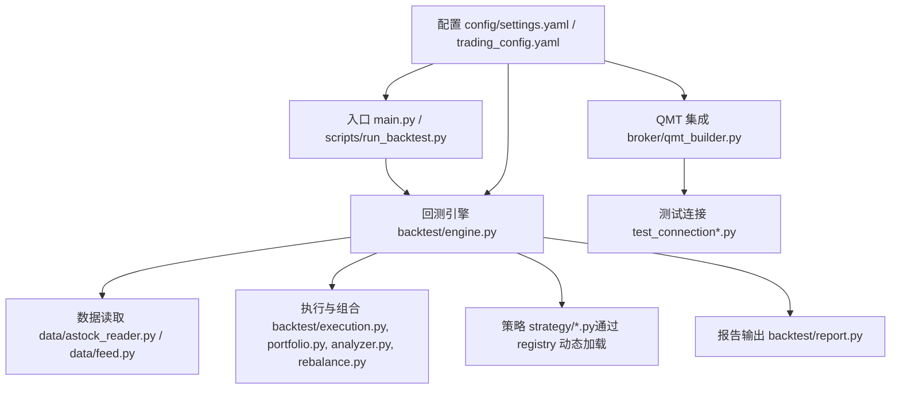
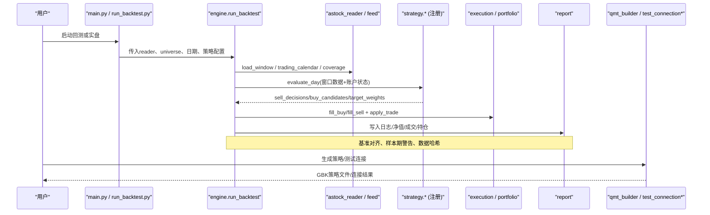
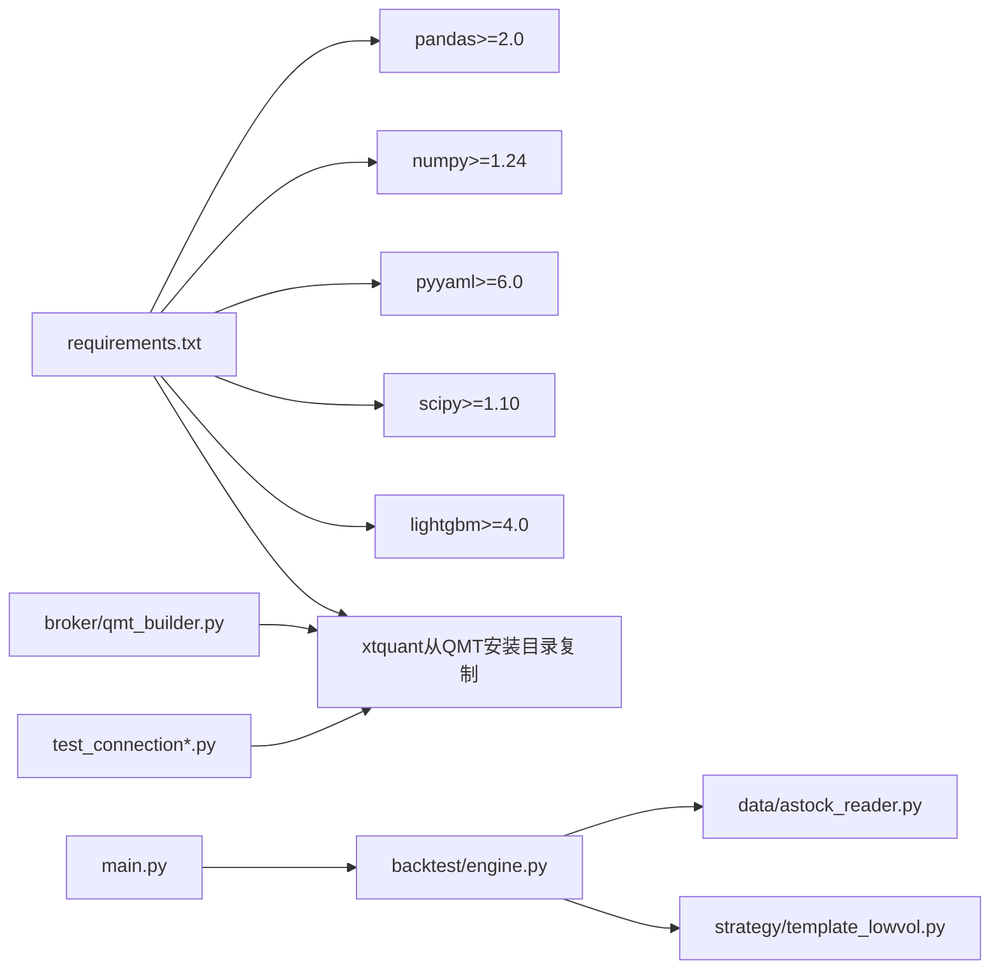

# 常见问题解答

<cite>
**本文引用的文件**   
- [main.py](file://main.py)
- [requirements.txt](file://requirements.txt)
- [setup.py](file://setup.py)
- [config/settings.yaml](file://config/settings.yaml)
- [config/trading_config.yaml](file://config/trading_config.yaml)
- [data/astock_reader.py](file://data/astock_reader.py)
- [data/feed.py](file://data/feed.py)
- [backtest/engine.py](file://backtest/engine.py)
- [broker/qmt_builder.py](file://broker/qmt_builder.py)
- [strategy/template_lowvol.py](file://strategy/template_lowvol.py)
- [scripts/run_backtest.py](file://scripts/run_backtest.py)
- [test_connection.py](file://test_connection.py)
- [test_connection_qmt.py](file://test_connection_qmt.py)
- [reports/20260803_204830_513b7f_atr_lowvol_fw/logs.txt](file://reports/20260803_204830_513b7f_atr_lowvol_fw/logs.txt)
</cite>

## 目录
1. [简介](#简介)
2. [项目结构](#项目结构)
3. [核心组件](#核心组件)
4. [架构总览](#架构总览)
5. [详细组件分析](#详细组件分析)
6. [依赖关系分析](#依赖关系分析)
7. [性能注意事项](#性能注意事项)
8. [故障排查指南](#故障排查指南)
9. [结论](#结论)
10. [附录](#附录)

## 简介
本FAQ面向使用 QuantLab 进行A股量化研究与实盘集成的用户，围绕环境配置、数据加载、策略调试、QMT集成与性能诊断五大主题，提供“现象描述—原因分析—解决步骤—预防措施”的完整排障路径。文档内容严格基于仓库内代码与配置文件，确保可操作性与可追溯性。

## 项目结构
QuantLab 采用模块化分层组织：
- 入口与运行脚本：main.py、scripts/run_backtest.py
- 回测引擎与组合层：backtest/engine.py、execution、portfolio、analyzer、rebalance、report
- 数据源与统一接口：data/astock_reader.py、data/feed.py、data/universe.py
- 策略注册与模板：strategy/template_lowvol.py、strategy/registry.py（由引擎动态导入）
- QMT集成与生成器：broker/qmt_builder.py、test_connection*.py、setup.py
- 配置中心：config/settings.yaml、config/trading_config.yaml

图表来源
- [main.py:1-104](file://main.py#L1-L104)
- [scripts/run_backtest.py:1-132](file://scripts/run_backtest.py#L1-L132)
- [backtest/engine.py:1-619](file://backtest/engine.py#L1-L619)
- [data/astock_reader.py:1-192](file://data/astock_reader.py#L1-L192)
- [data/feed.py:1-197](file://data/feed.py#L1-L197)
- [strategy/template_lowvol.py:1-94](file://strategy/template_lowvol.py#L1-L94)
- [broker/qmt_builder.py:1-386](file://broker/qmt_builder.py#L1-L386)
- [config/settings.yaml:1-69](file://config/settings.yaml#L1-L69)
- [config/trading_config.yaml:1-62](file://config/trading_config.yaml#L1-L62)

章节来源
- [main.py:1-104](file://main.py#L1-L104)
- [scripts/run_backtest.py:1-132](file://scripts/run_backtest.py#L1-L132)
- [config/settings.yaml:1-69](file://config/settings.yaml#L1-L69)
- [config/trading_config.yaml:1-62](file://config/trading_config.yaml#L1-L62)

## 核心组件
- 回测引擎：负责日历构建、市场数据切片、基准对齐、策略调用、交易执行、组合记账与指标计算。
- 数据读取器：适配 astock parquet 与 DuckDB 两种数据源，提供统一的窗口读取、交易日历、覆盖度检查与收盘价查询。
- 策略注册：支持扁平模块名注册，默认 next_open 交易模型，模板策略演示 target_weights 模式。
- QMT集成：生成GBK编码的单文件策略，封装生命周期与因子计算；提供一键安装xtquant与连接测试脚本。
- 配置系统：全局settings.yaml与实盘trading_config.yaml两级配置，控制数据源、回测参数、风控与调度。

章节来源
- [backtest/engine.py:237-619](file://backtest/engine.py#L237-L619)
- [data/astock_reader.py:25-192](file://data/astock_reader.py#L25-L192)
- [data/feed.py:17-197](file://data/feed.py#L17-L197)
- [strategy/template_lowvol.py:1-94](file://strategy/template_lowvol.py#L1-L94)
- [broker/qmt_builder.py:33-386](file://broker/qmt_builder.py#L33-L386)
- [config/settings.yaml:1-69](file://config/settings.yaml#L1-L69)
- [config/trading_config.yaml:1-62](file://config/trading_config.yaml#L1-L62)

## 架构总览
下图展示从入口到数据、策略、执行、组合与报告的端到端流程，以及QMT集成侧的生成与测试链路。

图表来源
- [main.py:28-93](file://main.py#L28-L93)
- [scripts/run_backtest.py:42-132](file://scripts/run_backtest.py#L42-L132)
- [backtest/engine.py:237-619](file://backtest/engine.py#L237-L619)
- [data/astock_reader.py:71-192](file://data/astock_reader.py#L71-L192)
- [data/feed.py:71-197](file://data/feed.py#L71-L197)
- [strategy/template_lowvol.py:46-94](file://strategy/template_lowvol.py#L46-L94)
- [broker/qmt_builder.py:33-386](file://broker/qmt_builder.py#L33-L386)
- [test_connection.py:1-117](file://test_connection.py#L1-L117)
- [test_connection_qmt.py:1-117](file://test_connection_qmt.py#L1-L117)

## 详细组件分析

### 环境配置问题
- Python版本与依赖库安装失败
  - 现象：ImportError、模块缺失、版本不兼容报错。
  - 原因：未满足 requirements.txt 的版本下限；xtquant需从QMT目录复制或使用QMT内置Python。
  - 解决步骤：
    - 使用 pip 安装 requirements.txt 中列出的核心与可选依赖。
    - 运行 setup.py 自动查找并复制 xtquant 至当前Python环境的 site-packages。
    - 若仍失败，切换到QMT内置Python解释器运行相关脚本。
  - 预防措施：
    - 在CI或本地初始化时先执行 setup.py，再运行 test_connection*.py 验证。
    - 固定Python版本与依赖版本，避免升级破坏兼容性。

- 路径配置错误
  - 现象：找不到 astock parquet、QMT路径不存在、缓存目录缺失。
  - 原因：settings.yaml 与 trading_config.yaml 中的路径与实际不一致；未创建必要目录。
  - 解决步骤：
    - 核对 settings.yaml 的 data.astock.* 路径与磁盘一致。
    - 核对 trading_config.yaml 的 account.path 指向实际QMT userdata_mini 目录。
    - 运行 setup.py 创建 logs、data、data/cache 等目录。
  - 预防措施：
    - 将路径集中管理，避免硬编码；在启动前校验关键路径存在性。

章节来源
- [requirements.txt:1-29](file://requirements.txt#L1-L29)
- [setup.py:1-82](file://setup.py#L1-L82)
- [config/settings.yaml:10-20](file://config/settings.yaml#L10-L20)
- [config/trading_config.yaml:4-10](file://config/trading_config.yaml#L4-L10)
- [test_connection.py:32-51](file://test_connection.py#L32-L51)
- [test_connection_qmt.py:32-51](file://test_connection_qmt.py#L32-L51)

### 数据加载问题
- 文件格式错误与字段缺失
  - 现象：构造MultiIndex失败、缺少 trade_date/ts_code 列、load_window返回空集合。
  - 原因：parquet结构与预期不符、列名不一致、时间格式异常。
  - 解决步骤：
    - 确认 astock parquet 包含 trade_date、ts_code 及所需字段（open/high/low/close/vol/amount等）。
    - 如为历史格式，确保已转换为 MultiIndex 或按代码逻辑重置索引。
    - 调整 adjustment 参数为 raw/qfq/hfq 之一。
  - 预防措施：
    - 在数据入库阶段校验列名与类型；对日期统一格式化；记录数据元信息（最小/最大日期、去重计数）。

- 编码问题
  - 现象：GBK策略文件无法被QMT正确解析，或中文乱码。
  - 原因：策略生成器以GBK编码输出，但编辑器/运行时编码不一致。
  - 解决步骤：
    - 使用 qmt_builder.py 生成策略并确保输出为GBK编码。
    - 在QMT环境中以GBK编码打开策略文件。
  - 预防措施：
    - 统一编码规范，禁止混用UTF-8与GBK；在CI中加入编码校验。

- 数据完整性检查与PIT安全验证
  - 现象：回测期间出现“无数据”“基准缺失”“样本期过短”警告。
  - 原因：数据覆盖不足、基准数据库缺失或断点、回测窗口不合理。
  - 解决步骤：
    - 使用 reader.coverage() 检查 universe_coverage 与 missing codes。
    - 校验 benchmark_db_path 是否存在且包含目标指数序列。
    - 根据 engine 输出的 sample_period_warning 调整回测区间。
  - 预防措施：
    - 在数据更新后重新计算 coverage；对基准数据做连续性校验；设置最小交易日阈值。

章节来源
- [data/astock_reader.py:35-69](file://data/astock_reader.py#L35-L69)
- [data/astock_reader.py:71-116](file://data/astock_reader.py#L71-L116)
- [data/astock_reader.py:128-161](file://data/astock_reader.py#L128-L161)
- [data/feed.py:71-134](file://data/feed.py#L71-L134)
- [backtest/engine.py:265-286](file://backtest/engine.py#L265-L286)
- [backtest/engine.py:445-489](file://backtest/engine.py#L445-L489)
- [backtest/engine.py:513-522](file://backtest/engine.py#L513-L522)

### 策略调试问题
- 信号生成异常
  - 现象：evaluate_day返回空决策、候选集合为空、评分全NaN。
  - 原因：非调仓日、历史长度不足、因子计算异常、权重配置不一致。
  - 解决步骤：
    - 检查 is_rebalance_day 与频率配置；确保 market_window 长度满足 min_history。
    - 核对策略因子计算逻辑与权重配置（如 FACTOR_WEIGHTS）一致性。
    - 打印 diagnostics.candidate_total/candidate_passed 定位筛选瓶颈。
  - 预防措施：
    - 在模板策略基础上扩展，保持target_weights接口稳定；增加输入校验与日志。

- 订单执行失败
  - 现象：大量 unfilled_order below_min_lot 或价格不可达。
  - 原因：资金不足导致手数低于最小交易单位、涨跌停限制、滑点与价格容差设置不当。
  - 解决步骤：
    - 检查 execution_cfg 的 slippage、price_tolerance、commission_rate。
    - 调整仓位模型（equal/vol_parity/custom）与 max_positions/min_position_value。
    - 查看 logs.txt 中的 unfilled_order 原因分类，针对性优化。
  - 预防措施：
    - 在回测阶段加入涨停/跌停/停牌拒单模拟；设置最小下单金额阈值；监控 unfilled_order_count。

- 持仓状态不一致
  - 现象：组合市值与现金变化异常、持仓天数未更新、利息计提不正确。
  - 原因：apply_trade未生效、advance_holding_days未调用、杠杆利息未计提。
  - 解决步骤：
    - 确认每笔交易都调用 pf.apply_trade(trade)。
    - 在非首日循环中调用 advance_holding_days。
    - 当 target_leverage>1 且 cash<0 时，按 margin_interest_rate 计提利息。
  - 预防措施：
    - 每日输出 equity_rows/positions_rows 并对账；在报告中汇总 unfilled_order_count 与 warnings。

章节来源
- [strategy/template_lowvol.py:46-94](file://strategy/template_lowvol.py#L46-L94)
- [backtest/engine.py:324-443](file://backtest/engine.py#L324-L443)
- [backtest/engine.py:375-380](file://backtest/engine.py#L375-L380)
- [reports/20260803_204830_513b7f_atr_lowvol_fw/logs.txt:4708-4739](file://reports/20260803_204830_513b7f_atr_lowvol_fw/logs.txt#L4708-L4739)

### QMT集成问题
- 接口调用错误
  - 现象：connect返回非0、query_stock_asset/positions失败、passorder返回0。
  - 原因：miniQMT未启动、账号未登录、路径错误或会话ID不匹配。
  - 解决步骤：
    - 使用 test_connection.py 或 test_connection_qmt.py 逐步验证 xtquant 导入、路径、连接与账户查询。
    - 核对 trading_config.yaml 的 account.id、account.path、account.session_id。
  - 预防措施：
    - 在启动脚本中前置连接检查；失败时快速退出并提示具体原因。

- 异步处理问题
  - 现象：handlebar中数据获取失败、tick为空、时序错乱。
  - 原因：QMT数据接口返回None或空数组、时间戳解析异常。
  - 解决步骤：
    - 在 qmt_builder.py 生成的策略中对 md/tick 做空值保护与长度校验。
    - 使用 _get_market_time 安全获取市场时间，避免异常中断。
  - 预防措施：
    - 对关键API加重试与超时控制；记录失败次数与最近一次成功时间。

- 账户状态同步
  - 现象：本地持仓与QMT持仓不一致、净值漂移。
  - 原因：文件持久化失败、写入权限不足、并发读写冲突。
  - 解决步骤：
    - 检查 D:/QMT_POOL/mfic_positions.json 写入是否成功；确保进程独占访问。
    - 在策略exit阶段强制刷新状态文件。
  - 预防措施：
    - 使用原子写入（临时文件+rename）；增加校验和与版本号；定期备份状态文件。

章节来源
- [test_connection.py:18-117](file://test_connection.py#L18-L117)
- [test_connection_qmt.py:14-117](file://test_connection_qmt.py#L14-L117)
- [broker/qmt_builder.py:164-370](file://broker/qmt_builder.py#L164-L370)
- [config/trading_config.yaml:4-10](file://config/trading_config.yaml#L4-L10)

### 性能问题诊断
- 内存泄漏
  - 现象：长时间运行后内存持续增长。
  - 原因：DataFrame拷贝过多、缓存未释放、大对象引用未清理。
  - 解决步骤：
    - 在 astock_reader.__del__ 中显式释放 _df/_dates/_codes/_coverage_cache。
    - 减少不必要的 copy()，优先使用视图与切片。
  - 预防措施：
    - 使用 memory_profiler 定位热点；对长生命周期对象设置上限与过期策略。

- CPU占用过高
  - 现象：回测耗时过长、CPU持续满载。
  - 原因：逐行循环计算、重复排序与聚合、未利用向量化。
  - 解决步骤：
    - 使用 _build_cut_index 与 _slice_window_fast 实现O(1)每日切片。
    - 将因子计算迁移至向量化操作，避免Python级循环。
  - 预防措施：
    - 在策略评估函数中尽量使用pandas/numpy向量化；对大数据集分块处理。

- I/O瓶颈
  - 现象：读取parquet慢、日志写入阻塞。
  - 原因：全量读取、频繁小文件写入、磁盘I/O竞争。
  - 解决步骤：
    - 仅读取所需列（astock_reader._read_cols），降低内存与I/O压力。
    - 合并日志写入，使用缓冲与异步落盘。
  - 预防措施：
    - 启用缓存（settings.yaml data.cache.enabled=true），合理设置 expire_days。

章节来源
- [data/astock_reader.py:47-69](file://data/astock_reader.py#L47-L69)
- [data/astock_reader.py:187-192](file://data/astock_reader.py#L187-L192)
- [backtest/engine.py:121-146](file://backtest/engine.py#L121-L146)
- [config/settings.yaml:16-19](file://config/settings.yaml#L16-L19)

## 依赖关系分析
QuantLab 的核心依赖包括 pandas、numpy、pyyaml、scipy、lightgbm（可选）、xtquant（QMT）。回测引擎依赖策略注册与执行模块，数据读取器依赖parquet与arrow。

图表来源
- [requirements.txt:1-29](file://requirements.txt#L1-L29)
- [main.py:1-104](file://main.py#L1-L104)
- [backtest/engine.py:1-619](file://backtest/engine.py#L1-L619)
- [data/astock_reader.py:1-192](file://data/astock_reader.py#L1-L192)
- [strategy/template_lowvol.py:1-94](file://strategy/template_lowvol.py#L1-L94)
- [broker/qmt_builder.py:1-386](file://broker/qmt_builder.py#L1-L386)
- [test_connection.py:1-117](file://test_connection.py#L1-L117)
- [test_connection_qmt.py:1-117](file://test_connection_qmt.py#L1-L117)

章节来源
- [requirements.txt:1-29](file://requirements.txt#L1-L29)
- [main.py:1-104](file://main.py#L1-L104)

## 性能注意事项
- 数据读取：优先使用 astock_reader 的列裁剪与MultiIndex切片，避免全表扫描。
- 回测循环：利用 cut_index 预计算与 iloc 视图，减少每日数据复制。
- 基准对齐：提前加载benchmark序列并进行前向填充，避免循环内查询。
- 日志与报告：批量写入，避免频繁I/O；使用结构化JSON/CSV便于后续分析。
- 缓存策略：启用 data.cache 并设置合理过期时间，减少重复计算与读取。

[本节为通用指导，无需特定文件来源]

## 故障排查指南
- 环境类
  - 现象：ImportError、路径不存在、目录缺失。
  - 排查：运行 setup.py 与 test_connection*.py；核对 settings.yaml 与 trading_config.yaml 路径。
  - 预防：在启动脚本中前置校验；记录关键路径与版本信息。

- 数据类
  - 现象：load_window空、coverage缺失、基准不可用。
  - 排查：检查 parquet 列名与日期格式；确认 benchmark_db_path；查看 engine 输出的 data_coverage_actual 与 benchmark_note。
  - 预防：数据入库后自动生成 coverage 报告；对基准数据做连续性校验。

- 策略类
  - 现象：无候选、评分异常、订单below_min_lot。
  - 排查：打印 diagnostics 与 logs；检查 rebalance_freq、min_history、execution_cfg 参数。
  - 预防：在模板策略中增加输入校验与边界条件处理；回测阶段模拟涨跌停与停牌。

- QMT类
  - 现象：连接失败、passorder返回0、持仓不同步。
  - 排查：使用 test_connection*.py 逐步验证；核对 session_id 与 path；检查状态文件写入权限。
  - 预防：在策略中增加重试与超时；使用原子写入与校验和。

章节来源
- [setup.py:1-82](file://setup.py#L1-L82)
- [test_connection.py:18-117](file://test_connection.py#L18-L117)
- [test_connection_qmt.py:14-117](file://test_connection_qmt.py#L14-L117)
- [backtest/engine.py:265-286](file://backtest/engine.py#L265-L286)
- [backtest/engine.py:445-489](file://backtest/engine.py#L445-L489)
- [reports/20260803_204830_513b7f_atr_lowvol_fw/logs.txt:4708-4739](file://reports/20260803_204830_513b7f_atr_lowvol_fw/logs.txt#L4708-L4739)

## 结论
QuantLab 提供了从数据接入、策略开发、回测执行到QMT集成的完整管线。通过严格的配置管理、健壮的数据读取与执行框架、以及完善的测试与日志体系，用户可以高效地迭代策略并安全地部署实盘。建议在生产环境中严格执行环境校验、数据覆盖率检查与连接测试，结合性能优化与故障预案，确保系统的稳定性与可维护性。

[本节为总结性内容，无需特定文件来源]

## 附录
- 常用命令
  - 回测：python -m scripts.run_backtest --config config/atr_lowvol_fw.yaml
  - 连接测试：python test_connection.py 或 python test_connection_qmt.py
  - 一键配置：python setup.py
- 关键配置项
  - settings.yaml：数据源路径、回测区间、因子预处理、策略默认股票池
  - trading_config.yaml：账号信息、交易参数、风控阈值、委托管理、调度计划、通知

[本节为补充信息，无需特定文件来源]