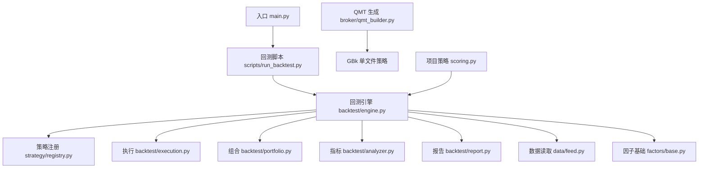
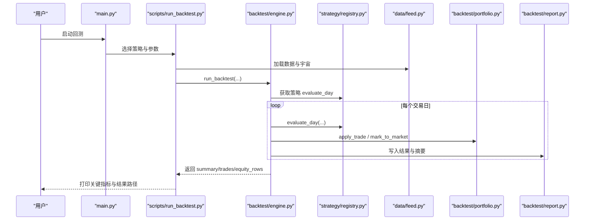
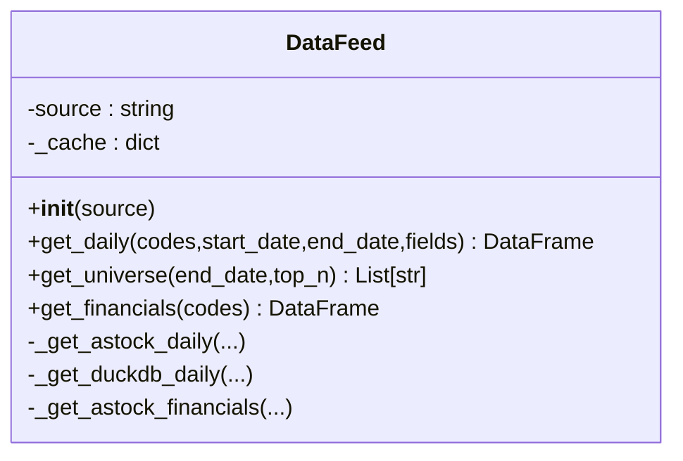
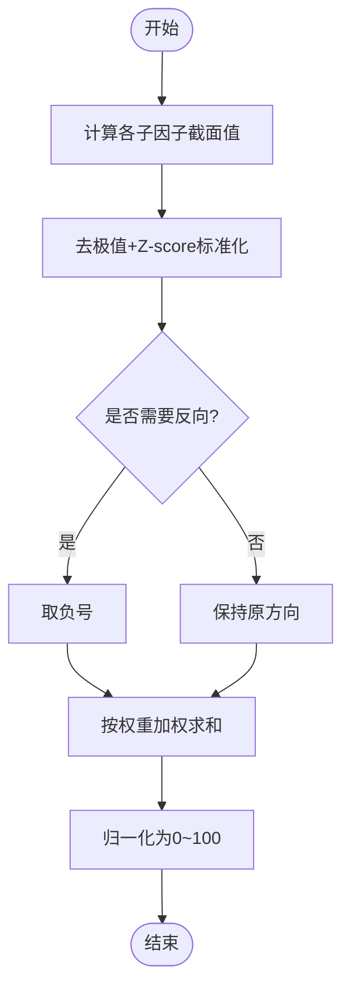
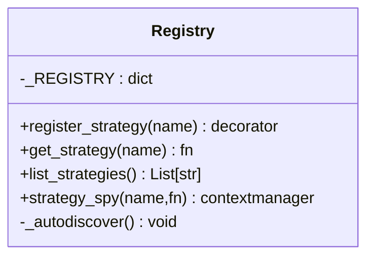
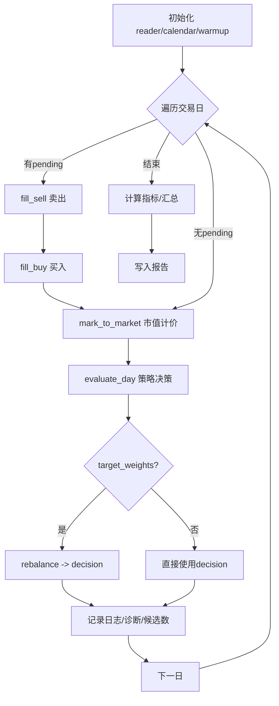
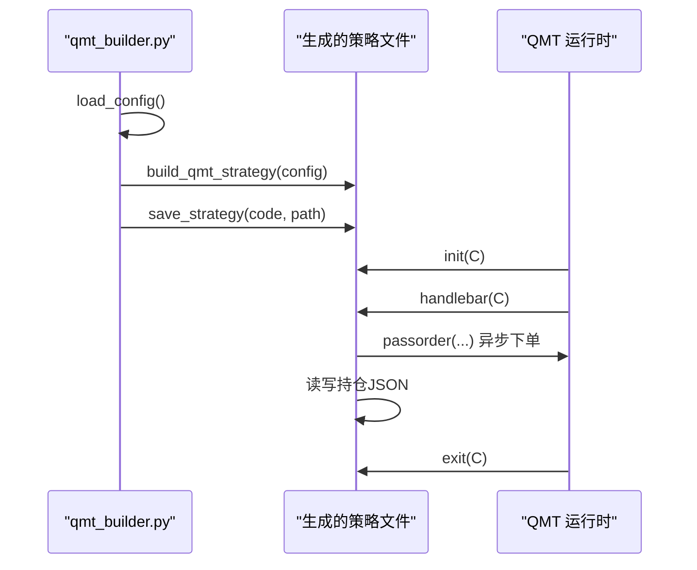
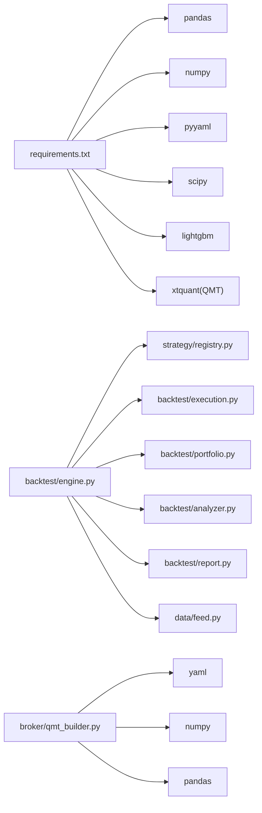

# 开发最佳实践

<cite>
**本文引用的文件**   
- [main.py](file://main.py)
- [requirements.txt](file://requirements.txt)
- [setup.py](file://setup.py)
- [.gitignore](file://.gitignore)
- [AGENTS.md](file://AGENTS.md)
- [config/settings.yaml](file://config/settings.yaml)
- [data/feed.py](file://data/feed.py)
- [factors/base.py](file://factors/base.py)
- [strategy/registry.py](file://strategy/registry.py)
- [broker/qmt_builder.py](file://broker/qmt_builder.py)
- [projects/Project_01_多因子IC小盘Alpha/strategy/scoring.py](file://projects/Project_01_多因子IC小盘Alpha/strategy/scoring.py)
- [backtest/engine.py](file://backtest/engine.py)
- [scripts/run_backtest.py](file://scripts/run_backtest.py)
- [projects/verification/engine_tests.py](file://projects/verification/engine_tests.py)
- [projects/verification/robustness_tests.py](file://projects/verification/robustness_tests.py)
- [全局复利与踩坑日志.md](file://全局复利与踩坑日志.md)
</cite>

## 目录
1. [引言](#引言)
2. [项目结构](#项目结构)
3. [核心组件](#核心组件)
4. [架构总览](#架构总览)
5. [详细组件分析](#详细组件分析)
6. [依赖关系分析](#依赖关系分析)
7. [性能考量](#性能考量)
8. [故障排查指南](#故障排查指南)
9. [结论](#结论)
10. [附录](#附录)

## 引言
本文件为 QuantLab 的开发最佳实践文档，面向研究、回测与实盘全链路。内容覆盖：代码组织结构规范（模块划分、命名约定、目录标准）、Python 编码规范（GBK 要求与 QMT 兼容、注释与错误处理模式）、调试技巧（日志策略、断点调试、性能分析）、版本控制最佳实践（分支管理、提交信息、代码审查）、质量保障（单元/集成测试、持续集成）、常见陷阱与解决方案（QMT 环境限制、第三方库兼容性、内存管理等）。读者可据此快速建立一致、稳健、可维护的开发流程。

## 项目结构
QuantLab 采用“研究-回测-策略-券商接口-项目隔离”的分层组织方式：
- data/：数据读取层，统一 DataFeed 接口，支持 astock parquet 与 DuckDB 双引擎；财务数据 PIT 安全。
- factors/：因子库与基类，提供预处理（去极值、标准化、中性化）与注册计算。
- strategy/：策略注册中心与调度，扁平化策略模块通过装饰器自动发现。
- backtest/：回测引擎、执行、组合、指标、报告等。
- broker/：券商接口层，含 QMT 单文件策略生成器与本地上下文适配器。
- projects/：策略项目隔离目录，每个项目独立配置、结果与构建产物。
- config/：三级级联配置（全局 settings.yaml、交易 trading_config.yaml、项目级 strategy.yaml）。
- scripts/：常用脚本（回测运行、数据更新、批量测试等）。
- reports/：回测输出目录（净值曲线、交易明细、摘要 JSON、Markdown 报告）。
- verification/：验证框架（引擎 B 模块、鲁棒性 D 模块、组合 E 模块、可行性 F 模块）。

图表来源 
- [main.py:1-104](file://main.py#L1-L104)
- [scripts/run_backtest.py:1-132](file://scripts/run_backtest.py#L1-L132)
- [backtest/engine.py:1-619](file://backtest/engine.py#L1-L619)
- [strategy/registry.py:1-115](file://strategy/registry.py#L1-L115)
- [data/feed.py:1-197](file://data/feed.py#L1-L197)
- [factors/base.py:1-52](file://factors/base.py#L1-L52)
- [broker/qmt_builder.py:1-386](file://broker/qmt_builder.py#L1-L386)
- [projects/Project_01_多因子IC小盘Alpha/strategy/scoring.py:1-158](file://projects/Project_01_多因子IC小盘Alpha/strategy/scoring.py#L1-L158)

章节来源
- [AGENTS.md:1-194](file://AGENTS.md#L1-L194)
- [config/settings.yaml:1-69](file://config/settings.yaml#L1-L69)

## 核心组件
- 数据层 DataFeed：统一 get_daily/get_universe/get_financials 接口，缓存与多源切换（astock/duckdb），返回 MultiIndex DataFrame。
- 因子基类 FactorBase：定义 compute 抽象方法与通用预处理（winsorize/zscore/rank_normalize）。
- 策略注册 registry：@register_strategy 装饰器 + autodiscover 扫描，get_strategy/list_strategies/test spy。
- 回测引擎 engine：run_backtest 主循环，窗口切片、基准对齐、执行填充、组合记账、指标计算、诊断聚合。
- QMT 生成器 qmt_builder：从配置组装 GBK 单文件策略，生命周期 init/handlebar/exit，内置止损与调仓逻辑。
- 项目评分 scoring：五因子加权评分（BP、反转、低波、ROE、VWAP量价），filter_func 动态过滤。

章节来源
- [data/feed.py:17-135](file://data/feed.py#L17-L135)
- [factors/base.py:9-52](file://factors/base.py#L9-L52)
- [strategy/registry.py:24-115](file://strategy/registry.py#L24-L115)
- [backtest/engine.py:237-619](file://backtest/engine.py#L237-L619)
- [broker/qmt_builder.py:33-386](file://broker/qmt_builder.py#L33-L386)
- [projects/Project_01_多因子IC小盘Alpha/strategy/scoring.py:98-158](file://projects/Project_01_多因子IC小盘Alpha/strategy/scoring.py#L98-L158)

## 架构总览
QuantLab 的端到端流程：
- 研究入口 main.py 加载配置并调用 Project_01 评分与回测管线。
- 回测运行脚本 scripts/run_backtest.py 解析 YAML、加载数据、构造 reader 与 universe，调用 engine.run_backtest。
- 引擎按交易日推进，调用策略 evaluate_day，执行 fill_buy/fill_sell，更新 Portfolio，计算指标，写入报告。
- QMT 生产路径由 broker/qmt_builder.py 生成 GBK 单文件策略，适配 QMT 生命周期与 passorder 异步下单。

图表来源 
- [main.py:28-104](file://main.py#L28-L104)
- [scripts/run_backtest.py:42-132](file://scripts/run_backtest.py#L42-L132)
- [backtest/engine.py:237-619](file://backtest/engine.py#L237-L619)
- [strategy/registry.py:96-115](file://strategy/registry.py#L96-L115)
- [data/feed.py:17-135](file://data/feed.py#L17-L135)

## 详细组件分析

### 数据层 DataFeed
- 职责：统一日线/财务数据访问，支持 astock parquet 与 duckdb 两种后端，内部缓存减少重复 IO。
- 关键点：MultiIndex(date, code) 输出；get_universe 基于成交额排序；财务数据需 PIT 安全（ann_date/f_ann_date 过滤）。
- 扩展建议：新增数据源时实现相同方法签名，保持鸭子类型。

图表来源 
- [data/feed.py:17-135](file://data/feed.py#L17-L135)

章节来源
- [data/feed.py:1-197](file://data/feed.py#L1-L197)

### 因子库与预处理
- FactorBase：定义 compute 抽象方法，提供 winsorize/zscore/rank_normalize 静态工具。
- 评分 scoring：compute_all_factors 计算截面因子，normalize 进行去极值与标准化，按权重合成综合评分。
- 注意事项：因子方向控制（反向因子取负）、缺失值处理、PIT 安全（ROE 滞后 45 天）。

图表来源 
- [factors/base.py:9-52](file://factors/base.py#L9-L52)
- [projects/Project_01_多因子IC小盘Alpha/strategy/scoring.py:23-158](file://projects/Project_01_多因子IC小盘Alpha/strategy/scoring.py#L23-L158)

章节来源
- [factors/base.py:1-52](file://factors/base.py#L1-L52)
- [projects/Project_01_多因子IC小盘Alpha/strategy/scoring.py:1-158](file://projects/Project_01_多因子IC小盘Alpha/strategy/scoring.py#L1-L158)

### 策略注册与调度
- registry：@register_strategy(name) 装饰器在模块顶层注册 evaluate_day；autodiscover 扫描 strategy/ 包触发导入；提供 list/get/spy 工具。
- 引擎集成：engine.resolve_strategy 根据扁平名加载模块并校验 trading_model。

图表来源 
- [strategy/registry.py:24-115](file://strategy/registry.py#L24-L115)

章节来源
- [strategy/registry.py:1-115](file://strategy/registry.py#L1-L115)
- [backtest/engine.py:207-234](file://backtest/engine.py#L207-L234)

### 回测引擎主循环
- 输入：reader/universe/start/end/strategy_config/execution_cfg/initial_cash/benchmark_code 等。
- 过程：加载日历与窗口、预热 warmup、每日 slice 市场数据、调用策略 evaluate_day、执行买卖、记账、记录日志与诊断、基准对齐。
- 输出：summary/trades/equity_rows/positions_rows/logs/trading_calendar。

图表来源 
- [backtest/engine.py:237-619](file://backtest/engine.py#L237-L619)

章节来源
- [backtest/engine.py:1-619](file://backtest/engine.py#L1-L619)

### QMT 策略生成器
- 功能：从配置生成 GBK 编码单文件策略，包含 init/handlebar/exit 生命周期、止损检查、调仓日判断、因子计算与评分、passorder 异步下单、持仓持久化。
- 约束：首行 # coding=gbk；Python 3.6.8 兼容语法；禁止 f-string、match/case、类型注解新语法；C.get_market_data_ex 缺少财务字段需预生成 CSV。

图表来源 
- [broker/qmt_builder.py:33-386](file://broker/qmt_builder.py#L33-L386)

章节来源
- [broker/qmt_builder.py:1-386](file://broker/qmt_builder.py#L1-L386)
- [AGENTS.md:50-81](file://AGENTS.md#L50-L81)

### 回测运行脚本
- 职责：解析 YAML 配置、加载 universe、构造 reader、可选 industry_map、调用 engine.run_backtest、写报告、打印关键指标。
- 边界：只读 E:/astock，仅写 results 目录，不引入 xtquant/passorder。

章节来源
- [scripts/run_backtest.py:1-132](file://scripts/run_backtest.py#L1-L132)

## 依赖关系分析
- 外部依赖：pandas/numpy/pyyaml/scipy/lightgbm（可选 ML）、xtquant（QMT 实盘，从 QMT 安装目录复制）。
- 内部依赖：engine 依赖 registry/execution/portfolio/analyzer/report；data.feed 依赖 astock_reader/duckdb_reader；broker.qmt_builder 依赖 yaml/json/numpy/pandas。
- 风险点：QMT Python 解释器缺 pyyaml；DuckDB 路径与 WAL 检测；benchmark_index.duckdb 可用性。

图表来源 
- [requirements.txt:1-29](file://requirements.txt#L1-L29)
- [backtest/engine.py:1-619](file://backtest/engine.py#L1-L619)
- [strategy/registry.py:1-115](file://strategy/registry.py#L1-L115)
- [data/feed.py:1-197](file://data/feed.py#L1-L197)
- [broker/qmt_builder.py:1-386](file://broker/qmt_builder.py#L1-L386)

章节来源
- [requirements.txt:1-29](file://requirements.txt#L1-L29)
- [setup.py:1-82](file://setup.py#L1-L82)

## 性能考量
- 数据读取：使用 parquet 与 DuckDB 提升 IO 效率；启用 cache 目录与过期策略（1 天）。
- 窗口切片：engine 预计算 cut_index，O(1) per-code 切片避免重复搜索。
- 基准对齐：提前加载 benchmark 序列并前向填充，避免逐日查询。
- 内存管理：面板数据按需切片，避免全量加载；财务数据 ffill 后复用。
- 并发与 WAL：检测 WAL 警告，必要时串行同步或优化数据源。

[本节为通用指导，不直接分析具体文件]

## 故障排查指南
- QMT 日志位置与编码：FormulaOutput 日志 UTF-8 落盘，源码 GBK 但输出 UTF-8，解码注意；CMOS 日期错乱时用行情时间而非系统时间。
- passorder 异步特性：正常返回 0/None，非订单号；必须短轮询反查 order_id，否则静默断链。
- 字段与方法差异：C.get_turnover_rate() 不存在；circ_mv 单位为万元；PE/PB/circ_mv 需来自预生成 CSV。
- 连接与初始化：重装/换设备后查看 XtClient_FormulaOutput_*.log 确认初始化完成；QMT 内置 Python 缺 pyyaml，import try/except fallback。
- 模拟端限制：get_trade_detail_data 仅保留当日成交/委托，隔日需导出 CSV 到共享目录。

章节来源
- [全局复利与踩坑日志.md:147-168](file://全局复利与踩坑日志.md#L147-L168)
- [AGENTS.md:50-81](file://AGENTS.md#L50-L81)

## 结论
QuantLab 以清晰分层与严格规范支撑研究与实盘一体化：数据层统一接口、因子层标准化预处理、策略注册解耦、回测引擎健壮高效、QMT 生成器保证生产合规。遵循本文档的组织、编码、调试、版本控制与质量保障实践，可显著降低集成风险、提升交付质量与可维护性。

## 附录

### 代码组织结构规范
- 模块划分：data/factors/strategy/backtest/broker/projects/config/scripts 各司其职，避免跨层耦合。
- 文件命名：snake_case，模块名简洁明确；策略模块以扁平名注册（如 atr_lowvol）。
- 目录标准：每个项目独立目录，build/ 存放 QMT 部署产物；reports/ 集中回测输出；verification/ 统一测试套件。

章节来源
- [AGENTS.md:127-133](file://AGENTS.md#L127-L133)
- [config/settings.yaml:1-69](file://config/settings.yaml#L1-L69)

### Python 编码规范（GBK 与 QMT 兼容）
- 所有 QMT 运行产物必须是 GBK 编码，首行 # coding=gbk。
- 禁止使用 Python 3.6 不支持语法（f-string、match/case、类型注解新语法等）。
- 财务数据读取必须 PIT 安全，禁止未来函数。
- 注释标准：模块级 docstring 说明用途与参数；关键逻辑添加行内注释；异常分支说明原因与恢复策略。
- 错误处理模式：try/except 捕获特定异常，记录日志并降级；对外部依赖做 fallback。

章节来源
- [AGENTS.md:50-81](file://AGENTS.md#L50-L81)
- [broker/qmt_builder.py:54-74](file://broker/qmt_builder.py#L54-L74)

### 调试技巧
- 日志策略：engine 与 report 统一日志格式；QMT FormulaOutput 区分业务与引擎日志；按级别 INFO/WARNING/ERROR 分级。
- 断点调试：本地 miniQMT 验证优先，10 秒出结果；远程仅在真实下单/涨跌停场景验证。
- 性能分析：利用 engine 的 runtime_seconds、cut_index 切片、benchmark 对齐耗时定位瓶颈；对大数据集使用 profiling。

章节来源
- [scripts/run_backtest.py:42-132](file://scripts/run_backtest.py#L42-L132)
- [backtest/engine.py:543-549](file://backtest/engine.py#L543-L549)
- [AGENTS.md:142-155](file://AGENTS.md#L142-L155)

### 版本控制最佳实践
- 分支管理：feature/* 开发分支，release/* 发布分支，hotfix/* 紧急修复；主干稳定。
- 提交信息规范：[模块] 简短描述 + 影响范围 + 关联 issue；变更清单清晰。
- 代码审查：PR 必须附带测试用例与回测报告；QMT 产物需验证编码与语法；评审关注 look-ahead、风控阈值与异步下单。

[本节为通用指导，不直接分析具体文件]

### 代码质量保障
- 单元测试：B 模块（引擎验证）覆盖已知结果、成本、涨跌停/停牌、资金约束、一致性、先卖后买、止损。
- 集成测试：D 模块（鲁棒性）覆盖子样本、牛熊分割、压力测试、成本压力、容量、未来函数、幸存者偏差。
- 持续集成：CI 应安装 requirements、运行 pytest、生成报告、校验 QMT 产物编码与语法。

章节来源
- [projects/verification/engine_tests.py:260-308](file://projects/verification/engine_tests.py#L260-L308)
- [projects/verification/robustness_tests.py:221-266](file://projects/verification/robustness_tests.py#L221-L266)

### 常见开发陷阱与解决方案
- QMT 环境限制：Python 3.6.8 兼容、缺 pyyaml、无 pyarrow；使用 CSV 数据源与 try/except fallback。
- 第三方库兼容性：pandas/numpy 版本锁定；lightgbm 可选；确保虚拟环境隔离。
- 内存管理：面板数据分块处理；缓存过期策略；避免全量加载财务数据。
- 异步下单与状态：passorder 异步、短轮询反查、订单唯一候选过滤、收盘任务时序。

章节来源
- [AGENTS.md:50-81](file://AGENTS.md#L50-L81)
- [全局复利与踩坑日志.md:147-168](file://全局复利与踩坑日志.md#L147-L168)
- [setup.py:1-82](file://setup.py#L1-L82)