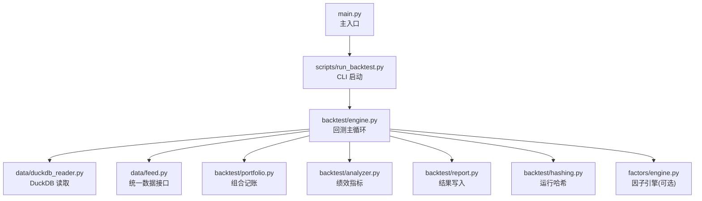
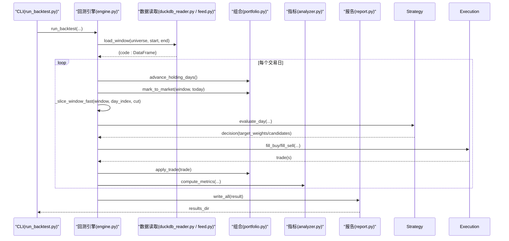
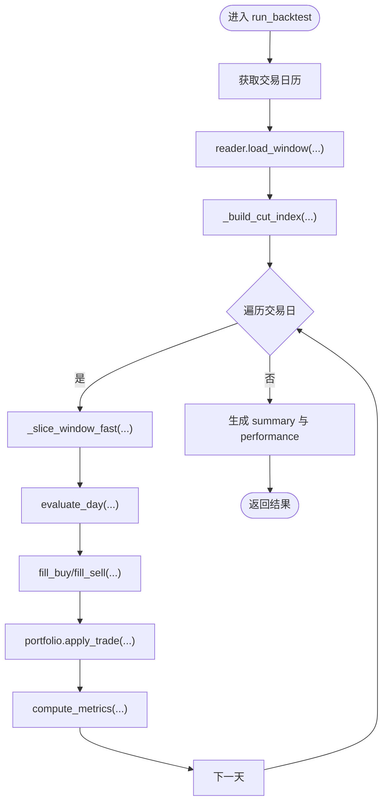
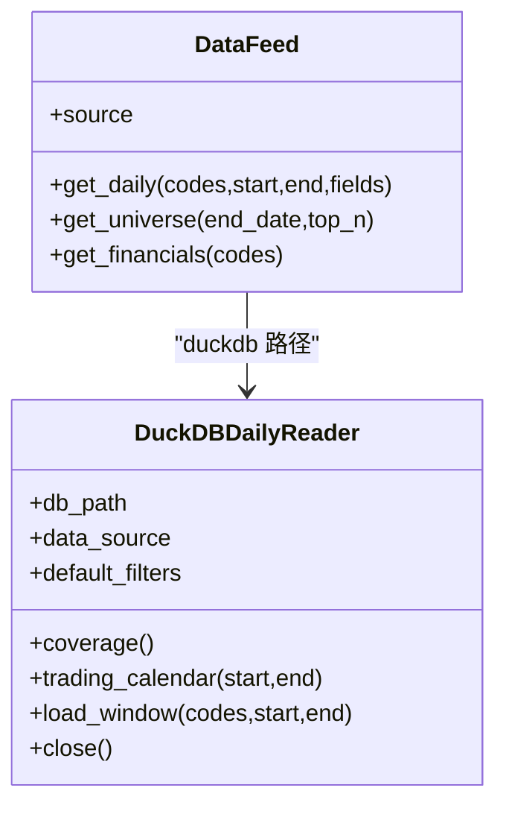
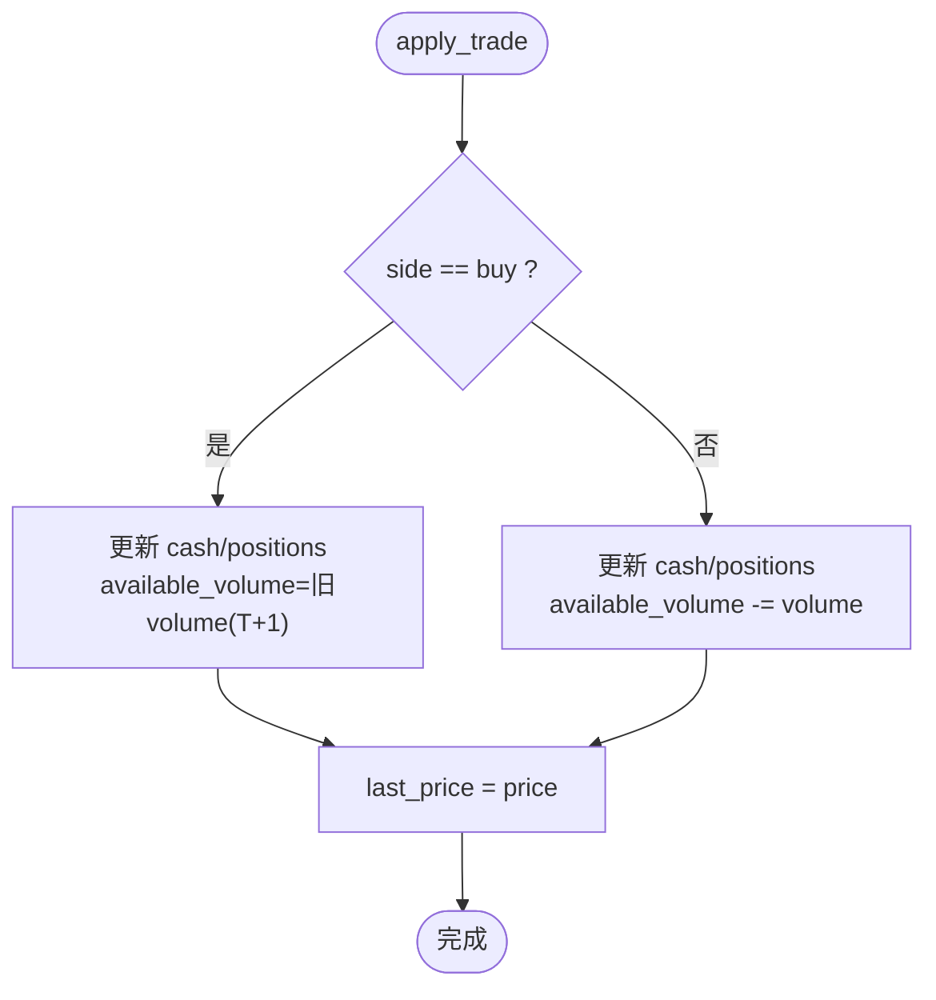
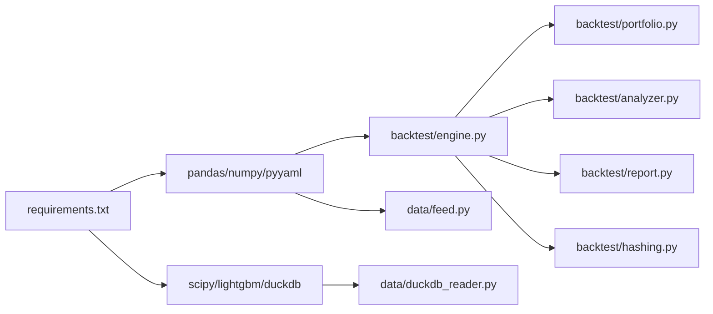

# 性能优化指南

<cite>
**本文引用的文件**   
- [main.py](file://main.py)
- [backtest/engine.py](file://backtest/engine.py)
- [backtest/analyzer.py](file://backtest/analyzer.py)
- [backtest/portfolio.py](file://backtest/portfolio.py)
- [backtest/report.py](file://backtest/report.py)
- [backtest/hashing.py](file://backtest/hashing.py)
- [data/feed.py](file://data/feed.py)
- [data/duckdb_reader.py](file://data/duckdb_reader.py)
- [factors/engine.py](file://factors/engine.py)
- [scripts/run_backtest.py](file://scripts/run_backtest.py)
- [requirements.txt](file://requirements.txt)
</cite>

## 目录
1. [引言](#引言)
2. [项目结构](#项目结构)
3. [核心组件](#核心组件)
4. [架构总览](#架构总览)
5. [详细组件分析](#详细组件分析)
6. [依赖关系分析](#依赖关系分析)
7. [性能考虑与优化策略](#性能考虑与优化策略)
8. [故障排查指南](#故障排查指南)
9. [结论](#结论)
10. [附录：监控与分析工具使用建议](#附录监控与分析工具使用建议)

## 引言
本指南面向 QuantLab 的开发者与维护者，聚焦回测系统的性能优化。内容覆盖内存管理、计算优化、I/O 优化、回测引擎与数据处理流水线优化，以及监控与瓶颈分析方法。文中所有分析与建议均基于仓库现有实现，并给出具体文件路径以便快速定位与落地。

## 项目结构
QuantLab 采用“模块化 + 扁平化”的组织方式：
- backtest：回测引擎、组合记账、执行撮合、指标计算、报告输出
- data：数据源统一接口与 DuckDB/Parquet 读取器
- factors：因子注册与 IC 评估
- scripts：命令行入口与批处理脚本
- main：主入口（兼容多策略）

**图表来源** 
- [main.py:1-104](file://main.py#L1-L104)
- [scripts/run_backtest.py:1-132](file://scripts/run_backtest.py#L1-L132)
- [backtest/engine.py:237-619](file://backtest/engine.py#L237-L619)
- [data/duckdb_reader.py:1-215](file://data/duckdb_reader.py#L1-L215)
- [data/feed.py:1-197](file://data/feed.py#L1-L197)
- [backtest/portfolio.py:1-189](file://backtest/portfolio.py#L1-L189)
- [backtest/analyzer.py:1-176](file://backtest/analyzer.py#L1-L176)
- [backtest/report.py:1-264](file://backtest/report.py#L1-L264)
- [backtest/hashing.py:1-24](file://backtest/hashing.py#L1-L24)
- [factors/engine.py:1-86](file://factors/engine.py#L1-L86)

**章节来源**
- [main.py:1-104](file://main.py#L1-L104)
- [scripts/run_backtest.py:1-132](file://scripts/run_backtest.py#L1-L132)

## 核心组件
- 回测引擎：负责日历生成、窗口切片、策略调用、交易执行、组合记账、基准对齐与指标汇总
- 数据层：统一 DataFeed 接口；DuckDB 只读 reader；Parquet 直读
- 组合记账：T+1 可用量控制、逐日盯市、权益曲线与持仓快照
- 指标计算：纯 Python/math 实现 Sharpe、MDD、年化等
- 报告输出：固定列顺序 CSV/JSON/Markdown，含 WARN 块
- 哈希系统：配置/数据/宇宙集哈希，保障可复现性

**章节来源**
- [backtest/engine.py:237-619](file://backtest/engine.py#L237-L619)
- [data/feed.py:1-197](file://data/feed.py#L1-L197)
- [data/duckdb_reader.py:1-215](file://data/duckdb_reader.py#L1-L215)
- [backtest/portfolio.py:1-189](file://backtest/portfolio.py#L1-L189)
- [backtest/analyzer.py:1-176](file://backtest/analyzer.py#L1-L176)
- [backtest/report.py:1-264](file://backtest/report.py#L1-L264)
- [backtest/hashing.py:1-24](file://backtest/hashing.py#L1-L24)

## 架构总览
下图展示一次回测从 CLI 到结果落盘的关键调用链与数据流。

**图表来源** 
- [scripts/run_backtest.py:96-118](file://scripts/run_backtest.py#L96-L118)
- [backtest/engine.py:237-619](file://backtest/engine.py#L237-L619)
- [data/duckdb_reader.py:90-132](file://data/duckdb_reader.py#L90-L132)
- [data/feed.py:106-124](file://data/feed.py#L106-L124)
- [backtest/portfolio.py:90-151](file://backtest/portfolio.py#L90-L151)
- [backtest/analyzer.py:96-176](file://backtest/analyzer.py#L96-L176)
- [backtest/report.py:245-264](file://backtest/report.py#L245-L264)

## 详细组件分析

### 回测引擎（engine.py）
- 关键优化点
  - 预计算每日切片索引：_build_cut_index 使用 searchsorted 将每日 iloc 切片降为 O(1)，避免重复过滤
  - 基准序列前向填充：_load_benchmark_series 提前补齐缺失日期，减少循环内判断
  - 诊断聚合：_aggregate_strategy_specific 按值类型分流聚合，降低字典操作开销
  - 运行时摘要：summary 中记录 data_hash/universe_hash/config_hash，便于缓存与对比
- 潜在瓶颈
  - 每日 window 构造仍涉及 dict 遍历与 DataFrame 视图复制，需关注内存峰值
  - 基准加载与校验在每次运行可能重复，可考虑进程级缓存

**图表来源** 
- [backtest/engine.py:121-147](file://backtest/engine.py#L121-L147)
- [backtest/engine.py:237-619](file://backtest/engine.py#L237-L619)

**章节来源**
- [backtest/engine.py:110-147](file://backtest/engine.py#L110-L147)
- [backtest/engine.py:237-619](file://backtest/engine.py#L237-L619)

### 数据读取（duckdb_reader.py / feed.py）
- DuckDB 只读 reader
  - 支持两种 schema，默认 qmt_self_owned，按 source/adjustment 过滤
  - WAL 检测与警告，避免并发同步导致的数据不一致
  - coverage 缓存，避免重复统计
- DataFeed 统一接口
  - astock parquet 直读与 duckdb 路径切换
  - get_universe 基于成交额排序，构建候选池

**图表来源** 
- [data/duckdb_reader.py:35-215](file://data/duckdb_reader.py#L35-L215)
- [data/feed.py:17-124](file://data/feed.py#L17-L124)

**章节来源**
- [data/duckdb_reader.py:1-215](file://data/duckdb_reader.py#L1-L215)
- [data/feed.py:1-197](file://data/feed.py#L1-L197)

### 组合记账（portfolio.py）
- T+1 可用量冻结与解冻：advance_holding_days 在每日初统一解冻
- 逐日盯市：mark_to_market 取当日 close，若无则回退 last_known_close
- 成本加权平均：买入合并时按金额+佣金重算成本价

**图表来源** 
- [backtest/portfolio.py:103-151](file://backtest/portfolio.py#L103-L151)

**章节来源**
- [backtest/portfolio.py:1-189](file://backtest/portfolio.py#L1-L189)

### 指标计算（analyzer.py）
- 纯 math 实现，无 scipy/sklearn 依赖
- 包含 MDD、Sharpe、年化、配对交易胜率、跟踪误差等
- 基准不可用时优雅降级（excess/info/tracking 置 None）

**章节来源**
- [backtest/analyzer.py:1-176](file://backtest/analyzer.py#L1-L176)

### 报告输出（report.py）
- 固定列顺序 CSV/JSON/Markdown，确保下游工具稳定解析
- 内置 WARN 块：短样本期、基准禁用、去重、WAL 检测等
- 结果目录隔离，run_id + config_name 命名

**章节来源**
- [backtest/report.py:1-264](file://backtest/report.py#L1-L264)

### 因子引擎（factors/engine.py）
- 注册式因子计算与截面 IC/ICIR 统计
- 适合批量因子研究阶段，回测阶段按需引入

**章节来源**
- [factors/engine.py:1-86](file://factors/engine.py#L1-L86)

## 依赖关系分析
- 外部依赖
  - pandas/numpy：面板与数值计算
  - pyyaml：配置解析
  - scipy：可选（当前 analyzer 未使用）
  - lightgbm：可选（ML 策略）
  - duckdb：高性能列存查询
- 内部依赖
  - engine 依赖 portfolio/analyzer/report/hashing
  - data.feed 可桥接 astock parquet 或 duckdb_reader
  - scripts.run_backtest 作为 CLI 装配 reader 与 engine

**图表来源** 
- [requirements.txt:1-29](file://requirements.txt#L1-L29)
- [backtest/engine.py:237-619](file://backtest/engine.py#L237-L619)
- [data/duckdb_reader.py:1-215](file://data/duckdb_reader.py#L1-L215)
- [data/feed.py:1-197](file://data/feed.py#L1-L197)

**章节来源**
- [requirements.txt:1-29](file://requirements.txt#L1-L29)

## 性能考虑与优化策略

### 内存管理优化
- 大数据集处理
  - 优先使用 DuckDB 列存查询并按 code/date 过滤，减少内存拷贝
  - 使用 _slice_window_fast 的预计算 cut_index，避免每日全表过滤
  - 对 panel 数据尽量保持视图而非深拷贝，必要时及时释放中间变量
- 缓存策略
  - DuckDB 的 coverage 已缓存；可考虑在进程内缓存常用 universe 与行业映射
  - 财务数据（如 ROE）可按代码分片缓存，避免重复 IO
- 垃圾回收调优
  - 长周期回测中，定期显式 del 大对象并触发 gc.collect()
  - 避免在循环内创建临时 DataFrame，尽量复用数组/列表

**章节来源**
- [backtest/engine.py:121-147](file://backtest/engine.py#L121-L147)
- [data/duckdb_reader.py:146-205](file://data/duckdb_reader.py#L146-L205)

### 计算优化技巧
- 向量化操作
  - 使用 numpy/pandas 向量化替代 Python 循环（如收益率、波动率计算）
  - 因子计算尽量以 Series/DataFrame 为单位运算，减少逐元素迭代
- 并行计算
  - 因子计算与 IC 测试可并行（进程池），注意共享内存与序列化开销
  - 数据更新脚本（update_astock.py）已使用 ProcessPoolExecutor，可借鉴
- 算法复杂度优化
  - 每日切片用 searchsorted 预索引，O(1) 访问
  - 基准序列前向填充一次性完成，避免循环内查找

**章节来源**
- [factors/engine.py:20-86](file://factors/engine.py#L20-L86)
- [scripts/update_astock.py:88-149](file://scripts/update_astock.py#L88-L149)
- [backtest/engine.py:121-147](file://backtest/engine.py#L121-L147)

### I/O 优化方案
- 数据读取加速
  - 优先 DuckDB 只读连接，利用 SQL 下推过滤与投影
  - Parquet 读取时仅选择必要字段，减少反序列化开销
- 文件存储格式选择
  - 日线/分钟线使用 Parquet 列存；财务指标按代码拆分小文件
  - 结果输出 CSV 固定列序，利于下游快速解析
- 数据库查询优化
  - 使用 IN 与 BETWEEN 条件，避免全表扫描
  - 对 jince_zhisuan 模式使用 QUALIFY ROW_NUMBER 去重，保证唯一性

**章节来源**
- [data/duckdb_reader.py:90-132](file://data/duckdb_reader.py#L90-L132)
- [data/feed.py:71-104](file://data/feed.py#L71-L104)
- [backtest/report.py:31-41](file://backtest/report.py#L31-L41)

### 回测性能优化
- 引擎优化
  - 启用 _warmup_calendar_days 预热基准与指标窗口
  - 仅在需要时加载 industry_map，避免无用 IO
- 数据处理流水线
  - 先构建 universe，再按 universe 拉取数据，缩小查询范围
  - 使用 PIT 模式（universe_by_date）避免未来函数
- 批处理策略
  - 多策略/多参数网格搜索时，按 run_id 隔离结果，避免锁竞争
  - 日志与报告异步写入，减少阻塞

**章节来源**
- [backtest/engine.py:272-278](file://backtest/engine.py#L272-L278)
- [scripts/run_backtest.py:82-92](file://scripts/run_backtest.py#L82-L92)
- [backtest/report.py:245-264](file://backtest/report.py#L245-L264)

### 监控与分析工具使用
- 内存 profiling
  - 使用 memory_profiler 对 run_backtest 主循环与数据加载进行采样
  - 关注 DataFrame 副本与中间结果峰值
- CPU 性能分析
  - 使用 cProfile 或 line_profiler 定位热点函数（如 _slice_window_fast、apply_trade）
- 瓶颈识别方法
  - 观察 logs.txt 中的 WARN 块（短样本期、基准禁用、WAL 检测）
  - 通过 summary.runtime_seconds 与 trades/equity_rows 规模估算吞吐

[本节为通用指导，不直接分析具体文件]

## 故障排查指南
- 常见问题
  - 基准不可用：检查 benchmark_db_path 与文件存在性，确认时间窗口覆盖
  - 数据去重：jince_zhisuan 模式需 QUALIFY 去重；qmt_self_owned 模式由上游保证唯一
  - WAL 检测：若检测到 .wal，等待同步完成后重跑以保证 data_hash 稳定
- 定位步骤
  - 查看 logs.txt 的 WARN/ERROR 行
  - 检查 summary.json 的 data_coverage_actual 与 sample_period_warning
  - 对比 data_hash/universe_hash/config_hash 确认输入一致性

**章节来源**
- [backtest/engine.py:38-99](file://backtest/engine.py#L38-L99)
- [data/duckdb_reader.py:63-75](file://data/duckdb_reader.py#L63-L75)
- [backtest/report.py:78-108](file://backtest/report.py#L78-L108)

## 结论
QuantLab 的回测系统在数据读取、窗口切片、组合记账与指标计算上已具备良好基础。通过进一步采用向量化与并行化、优化 I/O 与内存管理、完善监控与诊断，可在大规模回测与因子研究中显著提升吞吐与稳定性。建议优先落地以下措施：
- 全面使用 DuckDB 只读查询与字段投影
- 启用 cut_index 预索引与 warmup 预热
- 在因子研究与批处理任务中引入并行
- 建立 profiling 与日志告警机制

[本节为总结性内容，不直接分析具体文件]

## 附录：监控与分析工具使用建议
- 推荐工具
  - memory_profiler：内存占用采样
  - cProfile/line_profiler：CPU 热点定位
  - perf_counter/timeit：微基准测试
- 实践建议
  - 对 run_backtest 主循环打点计时，记录各阶段耗时
  - 对数据加载与因子计算分别采样，识别瓶颈模块
  - 结合 summary.runtime_seconds 与 trades/equity_rows 规模评估扩展性

[本节为通用指导，不直接分析具体文件]