# 最佳实践与案例

<cite>
**本文引用的文件**   
- [main.py](file://main.py)
- [requirements.txt](file://requirements.txt)
- [setup.py](file://setup.py)
- [AGENTS.md](file://AGENTS.md)
- [快速启动.md](file://快速启动.md)
- [backtest/engine.py](file://backtest/engine.py)
- [factors/base.py](file://factors/base.py)
- [data/feed.py](file://data/feed.py)
- [strategy/registry.py](file://strategy/registry.py)
- [config/settings.yaml](file://config/settings.yaml)
- [projects/Project_01_多因子IC小盘Alpha/research/multi_factor_ic/backtest.py](file://projects/Project_01_多因子IC小盘Alpha/research/multi_factor_ic/backtest.py)
- [projects/Project_05_红利低波/run_dividend.py](file://projects/Project_05_红利低波/run_dividend.py)
- [projects/Project_06_质量小市值/run_smallcap.py](file://projects/Project_06_质量小市值/run_smallcap.py)
- [research_audit/audit12_hard.py](file://research_audit/audit12_hard.py)
- [broker/qmt_builder.py](file://broker/qmt_builder.py)
</cite>

## 目录
1. [引言](#引言)
2. [项目结构](#项目结构)
3. [核心组件](#核心组件)
4. [架构总览](#架构总览)
5. [详细组件分析](#详细组件分析)
6. [依赖关系分析](#依赖关系分析)
7. [性能优化建议](#性能优化建议)
8. [常见问题解答](#常见问题解答)
9. [实际案例分析](#实际案例分析)
10. [研究审计与合规](#研究审计与合规)
11. [生产部署经验](#生产部署经验)
12. [结论](#结论)

## 引言
本文件面向 QuantLab 的研究员与工程师，系统化梳理开发最佳实践、性能优化技巧、常见问题排查、真实策略案例、研究审计要点以及生产环境部署经验。文档以仓库现有代码为依据，结合工程化规范与实战教训，帮助读者在 A 股量化研究与实盘中构建稳健、可复现、可审计的策略体系。

## 项目结构
QuantLab 采用“模块化 + 项目隔离”的组织方式：
- data/：数据读取层（astock parquet / DuckDB 双引擎），统一 DataFeed 接口
- factors/：因子库与因子引擎，提供预处理与注册机制
- strategy/：策略注册与调度，扁平化模块自动发现
- backtest/：回测引擎、执行、组合、指标计算
- broker/：QMT 单文件策略生成器与本地验证适配器
- projects/：各策略独立目录，包含配置、结果、研究脚本等
- config/：全局与交易配置
- research_audit/：研究审计脚本与结果
- scripts/：批量任务与工具脚本

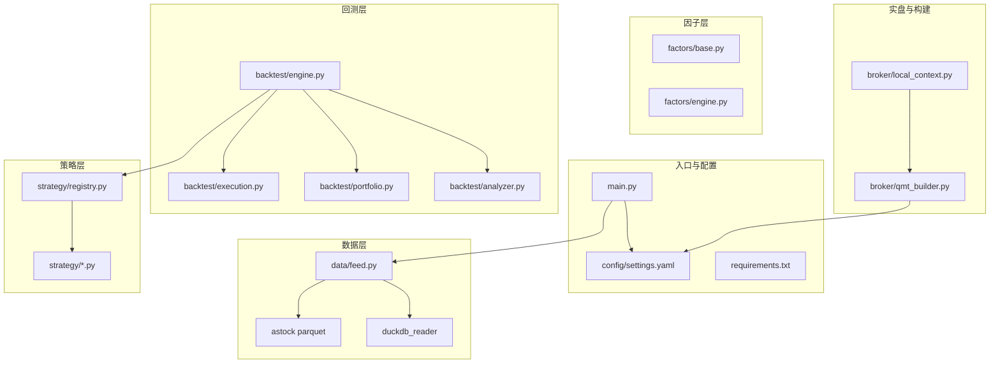

图表来源
- [main.py:1-104](file://main.py#L1-L104)
- [config/settings.yaml:1-69](file://config/settings.yaml#L1-L69)
- [data/feed.py:1-197](file://data/feed.py#L1-L197)
- [strategy/registry.py:1-115](file://strategy/registry.py#L1-L115)
- [backtest/engine.py:1-619](file://backtest/engine.py#L1-L619)
- [broker/qmt_builder.py:1-200](file://broker/qmt_builder.py#L1-L200)

章节来源
- [AGENTS.md:1-194](file://AGENTS.md#L1-L194)
- [快速启动.md:1-67](file://快速启动.md#L1-L67)

## 核心组件
- 数据层 DataFeed：统一 astock 与 duckdb 两种数据源，提供 get_daily/get_universe/get_financials 等接口，支持缓存与窗口加载
- 因子基类 FactorBase：封装 winsorize/zscore/rank_normalize 等预处理，要求实现 compute(panel, fin_ffill)
- 策略注册 registry：装饰器 @register_strategy 自动扫描 strategy/ 包并注册 evaluate_day，支持测试 spy
- 回测引擎 engine：next_open 模型，按日历驱动，调用策略 evaluate_day，执行撮合、组合更新、指标计算与汇总
- QMT 构建器 qmt_builder：将策略逻辑打包为 GBK 编码的单文件策略，适配 QMT 生命周期 init/handlebar/exit

章节来源
- [data/feed.py:1-197](file://data/feed.py#L1-L197)
- [factors/base.py:1-52](file://factors/base.py#L1-L52)
- [strategy/registry.py:1-115](file://strategy/registry.py#L1-L115)
- [backtest/engine.py:1-619](file://backtest/engine.py#L1-L619)
- [broker/qmt_builder.py:1-200](file://broker/qmt_builder.py#L1-L200)

## 架构总览
QuantLab 的端到端流程如下：
- main.py 作为回测入口，加载 settings.yaml 配置，选择策略运行
- 数据层通过 DataFeed 拉取面板数据与财务数据，PIT 安全处理
- 因子层对面板数据进行预处理与评分
- 回测引擎逐日驱动策略 evaluate_day，生成买卖决策，执行撮合与组合更新
- 指标计算与报告输出，支持基准对比与诊断信息聚合

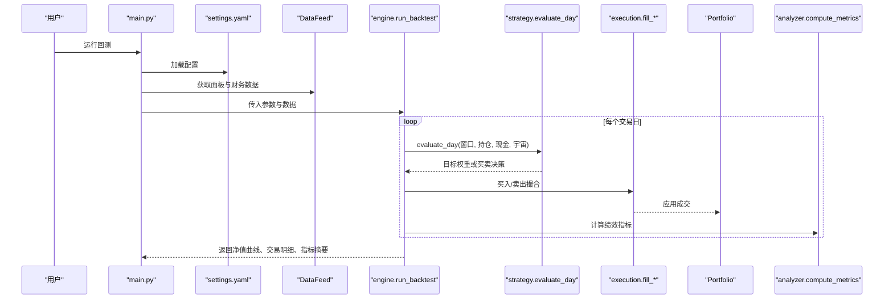

图表来源
- [main.py:28-92](file://main.py#L28-L92)
- [backtest/engine.py:237-619](file://backtest/engine.py#L237-L619)
- [strategy/registry.py:24-44](file://strategy/registry.py#L24-L44)

## 详细组件分析

### 数据层 DataFeed
- 职责：统一数据源接口，封装 astock parquet 与 DuckDB 读取逻辑
- 关键方法：get_daily、get_universe、get_financials、get_panel
- 注意事项：字段映射、MultiIndex 构建、缓存与过期时间、PIT 安全（财务数据使用 ann_date/f_ann_date）

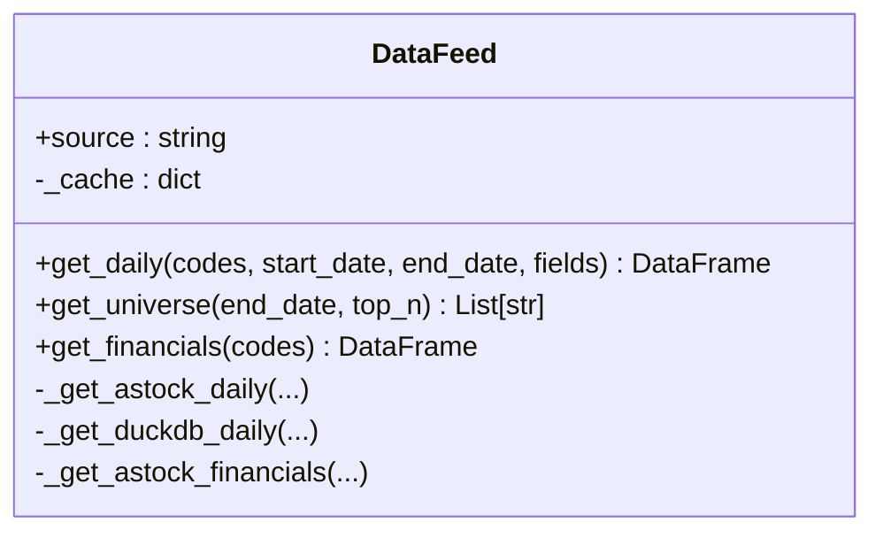

图表来源
- [data/feed.py:17-135](file://data/feed.py#L17-L135)

章节来源
- [data/feed.py:1-197](file://data/feed.py#L1-L197)

### 因子层 FactorBase
- 职责：定义因子抽象与通用预处理（截尾、标准化、排序归一化）
- 扩展点：继承 FactorBase 实现 compute(panel, fin_ffill, **kwargs)
- 建议：因子方向控制、中性化与标准化顺序遵循 winsorize → z-score → rank_normalize

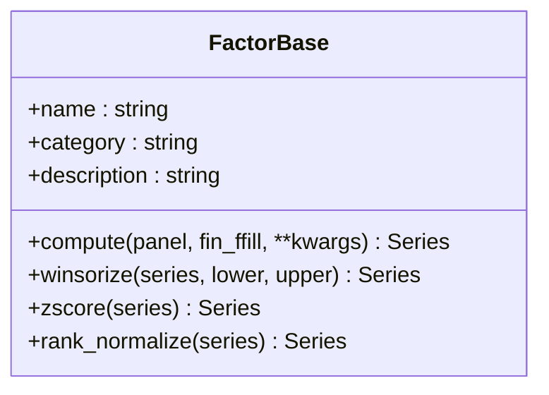

图表来源
- [factors/base.py:9-52](file://factors/base.py#L9-L52)

章节来源
- [factors/base.py:1-52](file://factors/base.py#L1-L52)

### 策略注册 registry
- 职责：装饰器注册 evaluate_day，自动扫描 strategy/ 包，支持测试替换
- 关键点：@register_strategy(name)、get_strategy(name)、autodiscover 跳过非目标模块

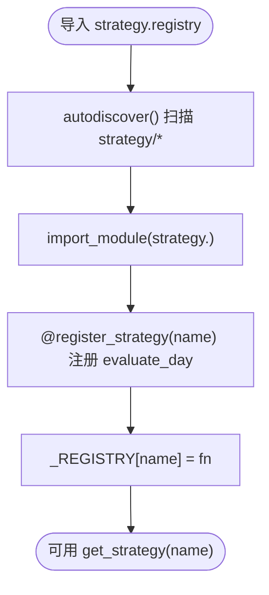

图表来源
- [strategy/registry.py:24-44](file://strategy/registry.py#L24-L44)
- [strategy/registry.py:96-114](file://strategy/registry.py#L96-L114)

章节来源
- [strategy/registry.py:1-115](file://strategy/registry.py#L1-L115)

### 回测引擎 engine
- 职责：主循环 wiring reader → strategy_core → execution → portfolio → metrics
- 关键流程：加载基准、预热窗口、每日切片、evaluate_day 决策、pending 订单处理、组合更新、指标计算
- 特性：next_open 模型、PIT universe_by_date、benchmark 对齐、样本期警告、数据哈希

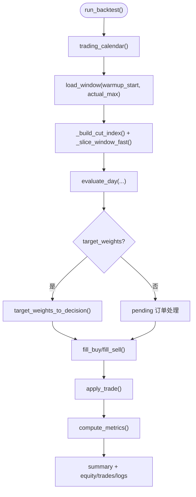

图表来源
- [backtest/engine.py:237-619](file://backtest/engine.py#L237-L619)

章节来源
- [backtest/engine.py:1-619](file://backtest/engine.py#L1-L619)

### QMT 构建器 qmt_builder
- 职责：将策略逻辑组装为 GBK 编码单文件，适配 QMT 生命周期 init/handlebar/exit
- 关键点：账户 ID 硬编码、Python 3.6.8 兼容、禁止 f-string 与新语法、passorder 异步语义、文件通信约定

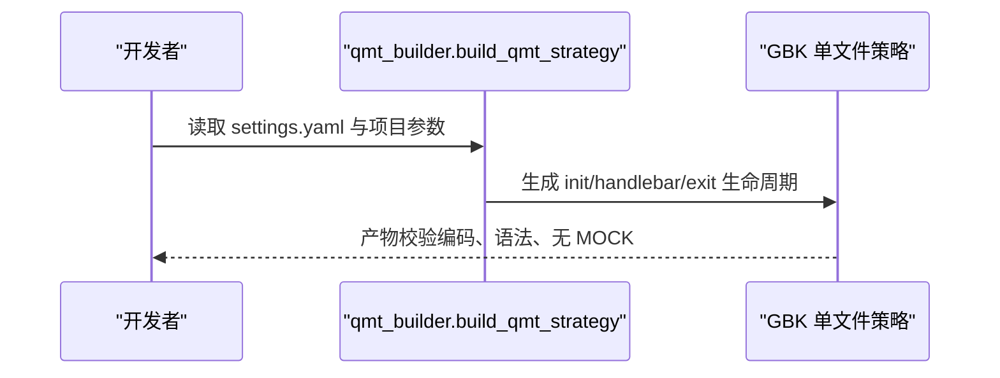

图表来源
- [broker/qmt_builder.py:33-200](file://broker/qmt_builder.py#L33-L200)

章节来源
- [broker/qmt_builder.py:1-200](file://broker/qmt_builder.py#L1-L200)

## 依赖关系分析
- 外部依赖：pandas、numpy、pyyaml、scipy、lightgbm（可选）、xtquant（QMT）
- 内部依赖：main.py → settings.yaml → data/feed.py → backtest/engine.py → strategy/registry.py → strategy/*.py
- 构建依赖：setup.py 用于一键配置 xtquant；requirements.txt 管理版本

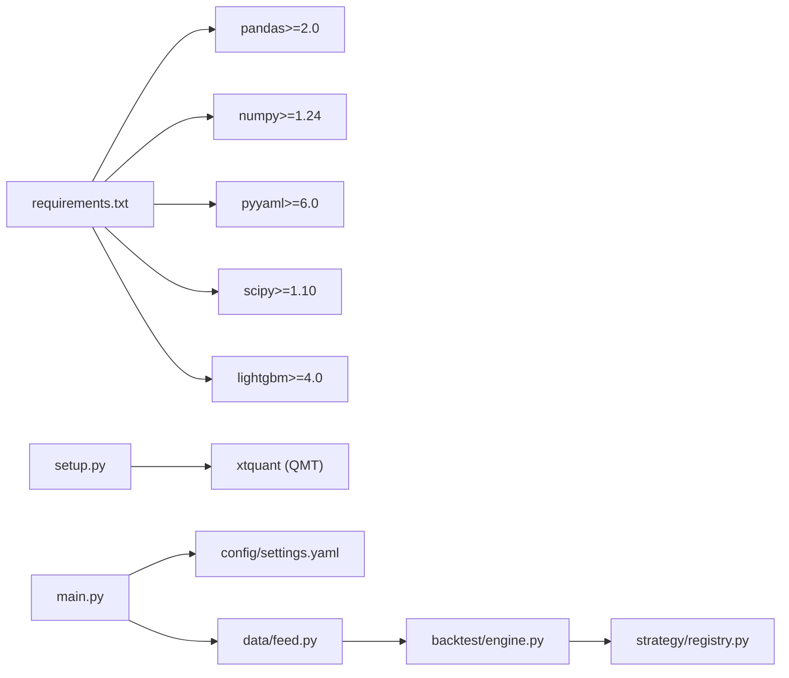

图表来源
- [requirements.txt:1-29](file://requirements.txt#L1-L29)
- [setup.py:1-82](file://setup.py#L1-L82)
- [main.py:1-104](file://main.py#L1-L104)
- [config/settings.yaml:1-69](file://config/settings.yaml#L1-L69)

章节来源
- [requirements.txt:1-29](file://requirements.txt#L1-L29)
- [setup.py:1-82](file://setup.py#L1-L82)

## 性能优化建议
- 内存管理
  - 使用 MultiIndex 面板数据时避免重复拷贝，优先 iloc 视图切片
  - 财务数据预聚合并按日期快照缓存，减少重复计算
  - 大表操作尽量向量化，避免 Python 级循环
- 计算优化
  - 因子计算采用分组 transform 与 rolling 窗口，利用 pandas/numpy 底层优化
  - 调仓频率降低（如 2M/Q）可减少计算量与交易成本
  - 基准序列预对齐与 forward-fill，避免每日查询
- I/O 优化
  - 数据缓存目录与过期策略（1 天）减少磁盘 IO
  - 使用 parquet/DuckDB 高效读取，避免全量 CSV 解析
  - 日志与结果分文件落盘，避免频繁写入

[本节为通用指导，不直接分析具体文件]

## 常见问题解答
- 环境配置问题
  - xtquant 安装失败：检查 setup.py 路径与系统 Python site-packages，确保复制成功并验证 import
  - QMT 连接失败：确认 QMT 已启动并登录账号，运行 test_connection.py
- 数据加载问题
  - astock parquet 路径不存在：核对 settings.yaml 中 data.astock.* 路径
  - DuckDB 读取异常：检查数据库文件是否存在与权限
- 策略调试问题
  - 策略未注册：确认 strategy/<name>.py 顶层有 @register_strategy(name)
  - 评估函数签名错误：ensure evaluate_day 接受 current_date/market_window/positions/cash/universe/account_state/strategy_config/aux_data
- 回测结果异常
  - 基准缺失：检查 benchmark_code 与 benchmark_db_path，确保数据覆盖
  - 样本期过短：注意 sample_period_warning，谨慎解读年化指标

章节来源
- [快速启动.md:1-67](file://快速启动.md#L1-L67)
- [config/settings.yaml:1-69](file://config/settings.yaml#L1-L69)
- [strategy/registry.py:24-44](file://strategy/registry.py#L24-L44)
- [backtest/engine.py:38-99](file://backtest/engine.py#L38-L99)

## 实际案例分析

### 多因子 IC 策略（Project_01）
- 策略要点：五因子加权（BP、反转、低波、ROE、VWAP 量价相关），月度/双月调仓，行业中性化选股，动态宇宙消除幸存者偏差
- 回测流程：评分 → 筛选 top_n → 次日开盘价成交 → 扣除双边交易成本 → 累计净值
- 关键实现：backtest.py 中的 industry_cap 约束与 _apply_tx_costs 成本扣减

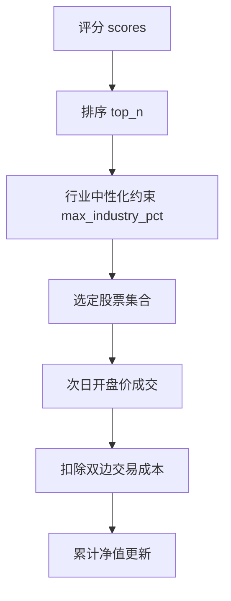

图表来源
- [projects/Project_01_多因子IC小盘Alpha/research/multi_factor_ic/backtest.py:14-44](file://projects/Project_01_多因子IC小盘Alpha/research/multi_factor_ic/backtest.py#L14-L44)
- [projects/Project_01_多因子IC小盘Alpha/research/multi_factor_ic/backtest.py:47-170](file://projects/Project_01_多因子IC小盘Alpha/research/multi_factor_ic/backtest.py#L47-L170)

章节来源
- [projects/Project_01_多因子IC小盘Alpha/research/multi_factor_ic/backtest.py:1-200](file://projects/Project_01_多因子IC小盘Alpha/research/multi_factor_ic/backtest.py#L1-L200)

### 红利低波策略（Project_05）
- 策略要点：财务过滤（ROE>8%、负债率<60%、现金流>0）+ 低波动选股（20 日波动率低于中位数），月度调仓，止损 -12%
- 回测流程：读 parquet 行情与财务 → 构建价格面板 → 计算波动率 → 选股与调仓 → 记录净值与交易

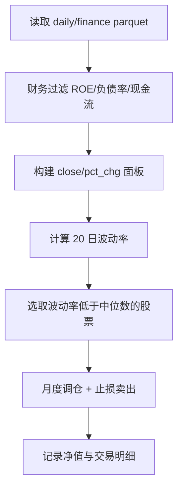

图表来源
- [projects/Project_05_红利低波/run_dividend.py:21-199](file://projects/Project_05_红利低波/run_dividend.py#L21-L199)

章节来源
- [projects/Project_05_红利低波/run_dividend.py:1-204](file://projects/Project_05_红利低波/run_dividend.py#L1-L204)

### 质量小市值策略（Project_06）
- 策略要点：质量过滤（ROE>5%、负债率<70%、现金流>0）+ 小盘代理（成交额后 30%）+ 反转因子（-20 日收益），每周调仓，止损 -10%
- 回测流程：读 parquet → 构建面板 → 计算反转因子 → 交集选股 → 周度调仓与止损 → 统计指标

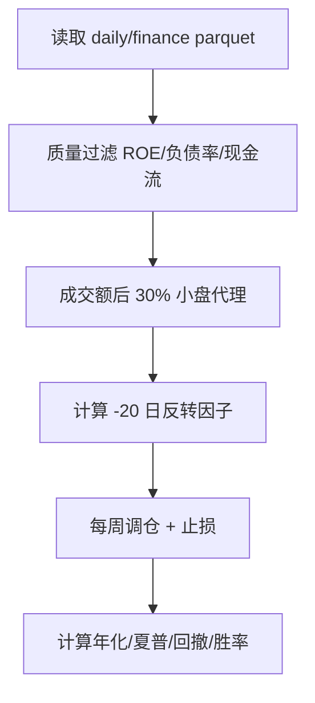

图表来源
- [projects/Project_06_质量小市值/run_smallcap.py:21-211](file://projects/Project_06_质量小市值/run_smallcap.py#L21-L211)

章节来源
- [projects/Project_06_质量小市值/run_smallcap.py:1-212](file://projects/Project_06_质量小市值/run_smallcap.py#L1-L212)

## 研究审计与合规
- 数据口径一致性
  - 财务数据必须 PIT 安全，使用 ann_date/f_ann_date 过滤，禁止未来数据泄漏
  - 宇宙选择需按日期快照（universe_by_date），避免静态池套全期导致的幸存者偏差
- 前视偏差检测
  - 复权 look-ahead、撮合 look-ahead（盘中取当日 close）均可能引入偏差，需用“盘中 vs 尾盘对照差异 >30pp 且方向反转”进行干净验证
- 过拟合防范
  - 子样本/牛熊分割/压力测试/容量测试，关注换手率与成本敏感性
  - 审计脚本示例：audit12_hard.py 包含涨跌停状态机模拟与鲁棒性检验

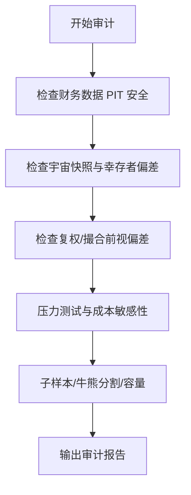

图表来源
- [research_audit/audit12_hard.py:1-200](file://research_audit/audit12_hard.py#L1-L200)

章节来源
- [AGENTS.md:111-118](file://AGENTS.md#L111-L118)
- [research_audit/audit12_hard.py:1-200](file://research_audit/audit12_hard.py#L1-L200)

## 生产部署经验
- 稳定性保障
  - QMT 策略必须是 GBK 编码单文件，首行 # coding=gbk，兼容 Python 3.6.8
  - passorder 异步接口，正常返回 0/None，订单号需反查 get_trade_detail_data
  - 委托后即时反查存在约 100ms 延迟，必须短轮询等待
- 监控告警
  - 每日导出 CSV 到共享目录（D:/QMT_POOL/），便于对账与故障恢复
  - 状态持久化（broker_state.json、positions.json、equity_curve.csv）
- 故障恢复
  - 收盘后 handlebar 不再触发，“启动时执行一次”的任务放 init 末尾，用标志防重复
  - 内置 Python 第三方包不可靠，import 必须 try/except fallback

章节来源
- [AGENTS.md:50-81](file://AGENTS.md#L50-L81)
- [AGENTS.md:157-165](file://AGENTS.md#L157-L165)
- [quickstart.md:1-67](file://快速启动.md#L1-L67)

## 结论
QuantLab 通过清晰的数据层、因子层、策略层与回测引擎分层，配合严格的审计与生产部署规范，构建了从研究到实盘的完整闭环。遵循本文的最佳实践与案例解析，可在保证数据口径一致性与前视偏差可控的前提下，持续提升策略的稳健性与可解释性，并为生产环境的稳定性与可观测性奠定基础。