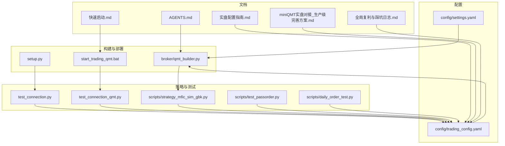
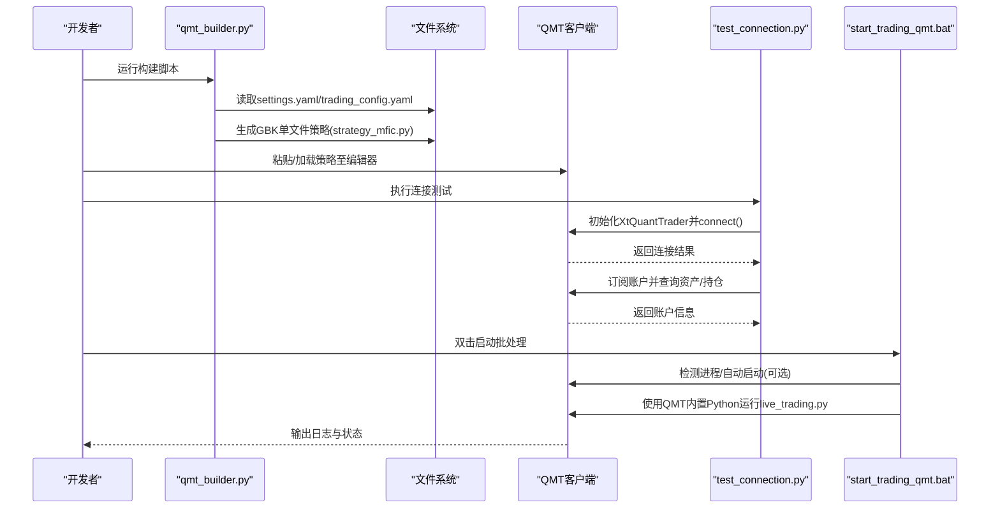
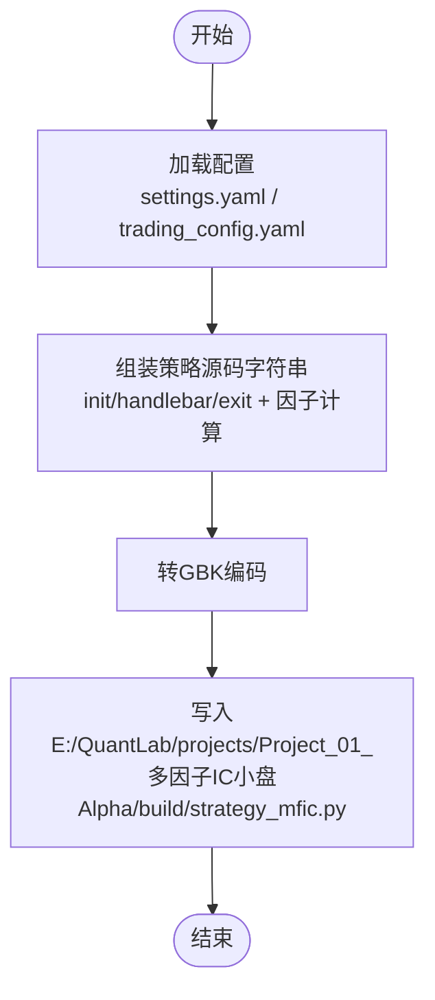
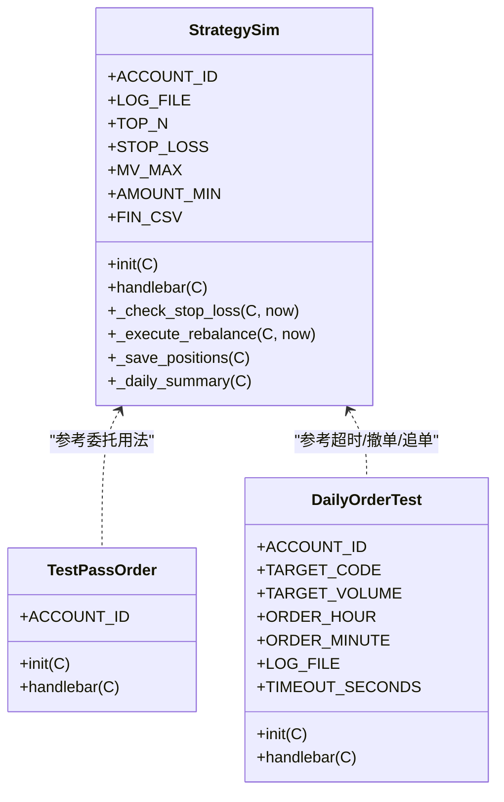
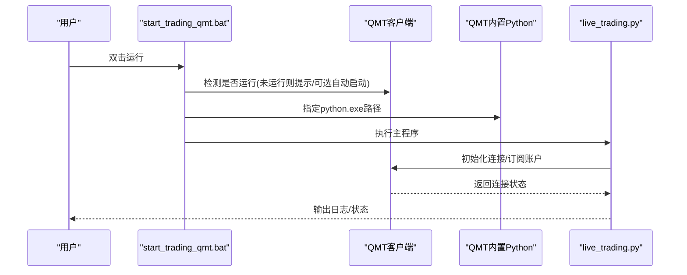
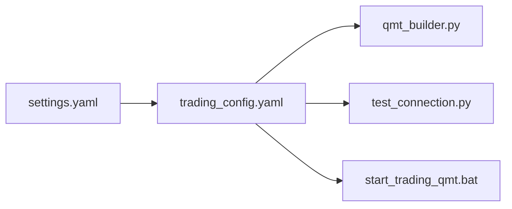
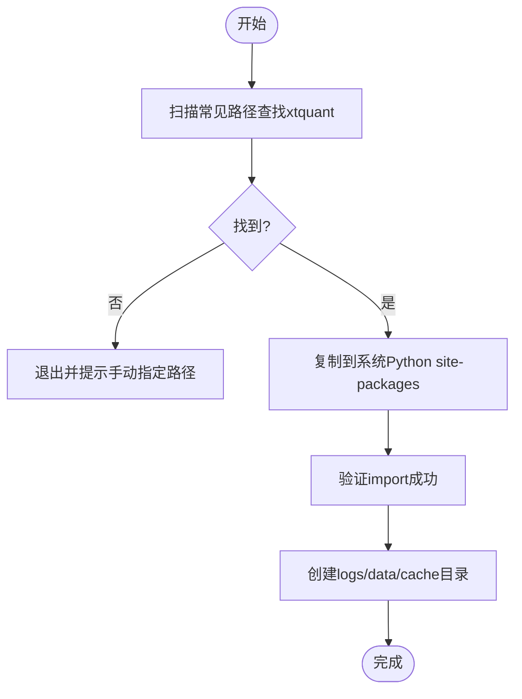
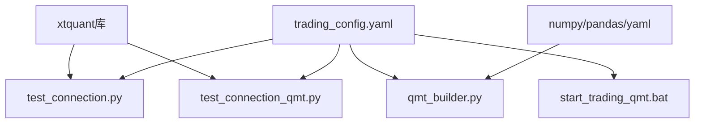

# QMT 平台部署

<cite>
**本文引用的文件**   
- [broker/qmt_builder.py](file://broker/qmt_builder.py)
- [scripts/strategy_mfic_sim_gbk.py](file://scripts/strategy_mfic_sim_gbk.py)
- [scripts/test_passorder.py](file://scripts/test_passorder.py)
- [scripts/daily_order_test.py](file://scripts/daily_order_test.py)
- [test_connection_qmt.py](file://test_connection_qmt.py)
- [test_connection.py](file://test_connection.py)
- [start_trading_qmt.bat](file://start_trading_qmt.bat)
- [config/trading_config.yaml](file://config/trading_config.yaml)
- [config/settings.yaml](file://config/settings.yaml)
- [setup.py](file://setup.py)
- [快速启动.md](file://快速启动.md)
- [实盘配置指南.md](file://实盘配置指南.md)
- [miniQMT实盘对接_生产级完善方案.md](file://miniQMT实盘对接_生产级完善方案.md)
- [全局复利与踩坑日志.md](file://全局复利与踩坑日志.md)
- [AGENTS.md](file://AGENTS.md)
</cite>

## 目录
1. [简介](#简介)
2. [项目结构](#项目结构)
3. [核心组件](#核心组件)
4. [架构总览](#架构总览)
5. [详细组件分析](#详细组件分析)
6. [依赖关系分析](#依赖关系分析)
7. [性能考虑](#性能考虑)
8. [故障排查指南](#故障排查指南)
9. [结论](#结论)
10. [附录](#附录)

## 简介
本指南面向在 QuantLab 中基于国金证券 QMT（miniQMT）进行策略开发与实盘部署的工程师与量化研究员。内容覆盖：
- QMT 环境准备（客户端安装、Python 环境、xtquant 等依赖）
- 策略文件构建流程（GBK 编码要求、单文件策略生成、依赖打包、路径配置）
- 策略部署步骤（上传、参数配置、启动验证、连接测试）
- 故障排查（连接、权限、数据源、性能）
- 生产环境优化（内存管理、线程配置、日志级别、监控集成）

## 项目结构
QuantLab 围绕“研究—回测—构建—部署”的流水线组织代码，QMT 相关能力集中在 broker、scripts、config 以及若干脚本与文档中：
- broker/qmt_builder.py：将策略逻辑与因子计算组装为 QMT 可执行的单文件 GBK 策略
- scripts/*：QMT 模拟/测试策略与委托示例（GBK 编码）
- test_connection*.py：连接测试与账户查询
- start_trading_qmt.bat：使用 QMT 内置 Python 启动实盘
- config/*.yaml：全局与实盘配置
- setup.py：一键复制 xtquant 到系统 Python
- 文档类文件：快速启动、实盘配置指南、生产级完善方案、踩坑日志、AGENTS 规范

**图表来源** 
- [config/settings.yaml:1-69](file://config/settings.yaml#L1-L69)
- [config/trading_config.yaml:1-62](file://config/trading_config.yaml#L1-L62)
- [broker/qmt_builder.py:1-386](file://broker/qmt_builder.py#L1-L386)
- [start_trading_qmt.bat:1-66](file://start_trading_qmt.bat#L1-L66)
- [setup.py:1-81](file://setup.py#L1-L81)
- [scripts/strategy_mfic_sim_gbk.py:1-340](file://scripts/strategy_mfic_sim_gbk.py#L1-L340)
- [scripts/test_passorder.py:1-48](file://scripts/test_passorder.py#L1-L48)
- [scripts/daily_order_test.py:1-227](file://scripts/daily_order_test.py#L1-L227)
- [test_connection.py:1-117](file://test_connection.py#L1-L117)
- [test_connection_qmt.py:1-117](file://test_connection_qmt.py#L1-L117)
- [快速启动.md:1-67](file://快速启动.md#L1-L67)
- [实盘配置指南.md:1-232](file://实盘配置指南.md#L1-L232)
- [miniQMT实盘对接_生产级完善方案.md:1-1516](file://miniQMT实盘对接_生产级完善方案.md#L1-L1516)
- [全局复利与踩坑日志.md:132-145](file://全局复利与踩坑日志.md#L132-L145)
- [AGENTS.md:83-183](file://AGENTS.md#L83-L183)

**章节来源**
- [config/settings.yaml:1-69](file://config/settings.yaml#L1-L69)
- [config/trading_config.yaml:1-62](file://config/trading_config.yaml#L1-L62)
- [broker/qmt_builder.py:1-386](file://broker/qmt_builder.py#L1-L386)
- [start_trading_qmt.bat:1-66](file://start_trading_qmt.bat#L1-L66)
- [setup.py:1-81](file://setup.py#L1-L81)
- [scripts/strategy_mfic_sim_gbk.py:1-340](file://scripts/strategy_mfic_sim_gbk.py#L1-L340)
- [scripts/test_passorder.py:1-48](file://scripts/test_passorder.py#L1-L48)
- [scripts/daily_order_test.py:1-227](file://scripts/daily_order_test.py#L1-L227)
- [test_connection.py:1-117](file://test_connection.py#L1-L117)
- [test_connection_qmt.py:1-117](file://test_connection_qmt.py#L1-L117)
- [快速启动.md:1-67](file://快速启动.md#L1-L67)
- [实盘配置指南.md:1-232](file://实盘配置指南.md#L1-L232)
- [miniQMT实盘对接_生产级完善方案.md:1-1516](file://miniQMT实盘对接_生产级完善方案.md#L1-L1516)
- [全局复利与踩坑日志.md:132-145](file://全局复利与踩坑日志.md#L132-L145)
- [AGENTS.md:83-183](file://AGENTS.md#L83-L183)

## 核心组件
- QMT 策略生成器（GBK 单文件）：读取配置，组装生命周期与因子计算，输出 GBK 编码的单文件策略
- QMT 模拟/测试策略：提供最小化委托、止损、调仓日判断、日志落盘等样例
- 连接测试工具：检查 xtquant、QMT 路径、会话、账号，并执行账户与持仓查询
- 启动脚本：自动检测 QMT 进程、创建日志/数据目录、调用 QMT 内置 Python 运行主程序
- 配置中心：全局 settings.yaml 与实盘 trading_config.yaml 两级配置
- 一键环境准备：setup.py 自动定位并复制 xtquant 到系统 Python

**章节来源**
- [broker/qmt_builder.py:1-386](file://broker/qmt_builder.py#L1-L386)
- [scripts/strategy_mfic_sim_gbk.py:1-340](file://scripts/strategy_mfic_sim_gbk.py#L1-L340)
- [scripts/test_passorder.py:1-48](file://scripts/test_passorder.py#L1-L48)
- [scripts/daily_order_test.py:1-227](file://scripts/daily_order_test.py#L1-L227)
- [test_connection.py:1-117](file://test_connection.py#L1-L117)
- [test_connection_qmt.py:1-117](file://test_connection_qmt.py#L1-L117)
- [start_trading_qmt.bat:1-66](file://start_trading_qmt.bat#L1-L66)
- [config/settings.yaml:1-69](file://config/settings.yaml#L1-L69)
- [config/trading_config.yaml:1-62](file://config/trading_config.yaml#L1-L62)
- [setup.py:1-81](file://setup.py#L1-L81)

## 架构总览
下图展示从配置到策略构建、再到 QMT 运行与连接的端到端流程。

**图表来源** 
- [broker/qmt_builder.py:1-386](file://broker/qmt_builder.py#L1-L386)
- [config/settings.yaml:1-69](file://config/settings.yaml#L1-L69)
- [config/trading_config.yaml:1-62](file://config/trading_config.yaml#L1-L62)
- [test_connection.py:1-117](file://test_connection.py#L1-L117)
- [start_trading_qmt.bat:1-66](file://start_trading_qmt.bat#L1-L66)

## 详细组件分析

### QMT 策略生成器（GBK 单文件）
- 功能要点
  - 读取全局与项目配置，提取资金、账号、仓位上限、止损、TOP_N、市值区间、成交额阈值、因子权重等
  - 组装 init/handlebar/exit 生命周期，包含止损检查、调仓日判定、全市场数据获取、因子计算与评分、下单与持仓持久化
  - 输出以 GBK 编码保存的单文件策略，确保 QMT 编辑器兼容
- 关键实现点
  - 安全价格解析、时间获取、交易日期判断、VWAP-成交量相关性因子
  - 通过 passorder 完成买卖委托，记录日志与持仓 JSON
  - 输出路径固定为 E:/QuantLab/projects/Project_01_多因子IC小盘Alpha/build/strategy_mfic.py（可按需修改）

**图表来源** 
- [broker/qmt_builder.py:1-386](file://broker/qmt_builder.py#L1-L386)

**章节来源**
- [broker/qmt_builder.py:1-386](file://broker/qmt_builder.py#L1-L386)

### QMT 模拟/测试策略（GBK）
- strategy_mfic_sim_gbk.py：多因子IC小盘Alpha模拟盘策略，含财务CSV加载、评分、止损、双月调仓、日志与持仓持久化
- test_passorder.py：最小化委托测试（第一根K线买入沪深A股首只股票100股）
- daily_order_test.py：每日限价下单+超时撤单+市价追单的完整流程

**图表来源** 
- [scripts/strategy_mfic_sim_gbk.py:1-340](file://scripts/strategy_mfic_sim_gbk.py#L1-L340)
- [scripts/test_passorder.py:1-48](file://scripts/test_passorder.py#L1-L48)
- [scripts/daily_order_test.py:1-227](file://scripts/daily_order_test.py#L1-L227)

**章节来源**
- [scripts/strategy_mfic_sim_gbk.py:1-340](file://scripts/strategy_mfic_sim_gbk.py#L1-L340)
- [scripts/test_passorder.py:1-48](file://scripts/test_passorder.py#L1-L48)
- [scripts/daily_order_test.py:1-227](file://scripts/daily_order_test.py#L1-L227)

### 连接测试与启动脚本
- test_connection.py / test_connection_qmt.py：检查 xtquant、QMT 路径、会话ID、账号；连接后查询资产与持仓
- start_trading_qmt.bat：设置 QMT Python 路径、检测 QMT 进程、创建日志/数据目录、调用 live_trading.py

**图表来源** 
- [test_connection.py:1-117](file://test_connection.py#L1-L117)
- [test_connection_qmt.py:1-117](file://test_connection_qmt.py#L1-L117)
- [start_trading_qmt.bat:1-66](file://start_trading_qmt.bat#L1-L66)

**章节来源**
- [test_connection.py:1-117](file://test_connection.py#L1-L117)
- [test_connection_qmt.py:1-117](file://test_connection_qmt.py#L1-L117)
- [start_trading_qmt.bat:1-66](file://start_trading_qmt.bat#L1-L66)

### 配置体系
- settings.yaml：全局配置（数据源、缓存、回测参数、日志、因子预处理、策略默认股票池、实盘开关）
- trading_config.yaml：实盘配置（账号、路径、会话ID、交易参数、风控阈值、委托管理、调度计划、通知、数据源路径、策略参数）

**图表来源** 
- [config/settings.yaml:1-69](file://config/settings.yaml#L1-L69)
- [config/trading_config.yaml:1-62](file://config/trading_config.yaml#L1-L62)
- [broker/qmt_builder.py:1-386](file://broker/qmt_builder.py#L1-L386)
- [test_connection.py:1-117](file://test_connection.py#L1-L117)
- [start_trading_qmt.bat:1-66](file://start_trading_qmt.bat#L1-L66)

**章节来源**
- [config/settings.yaml:1-69](file://config/settings.yaml#L1-L69)
- [config/trading_config.yaml:1-62](file://config/trading_config.yaml#L1-L62)

### 一键环境准备（xtquant）
- setup.py：自动查找 xtquant 源路径，复制到系统 Python site-packages，验证导入，创建必要目录

**图表来源** 
- [setup.py:1-81](file://setup.py#L1-L81)

**章节来源**
- [setup.py:1-81](file://setup.py#L1-L81)

## 依赖关系分析
- 外部依赖
  - xtquant（xttrader、xtdata、StockAccount）
  - numpy、pandas、yaml
- 内部依赖
  - qmt_builder.py 依赖 settings.yaml/trading_config.yaml
  - 测试与启动脚本依赖 trading_config.yaml
  - 策略文件依赖 QMT 运行时环境与 passorder/get_full_tick 等接口

**图表来源** 
- [test_connection.py:1-117](file://test_connection.py#L1-L117)
- [test_connection_qmt.py:1-117](file://test_connection_qmt.py#L1-L117)
- [config/trading_config.yaml:1-62](file://config/trading_config.yaml#L1-L62)
- [broker/qmt_builder.py:1-386](file://broker/qmt_builder.py#L1-L386)
- [start_trading_qmt.bat:1-66](file://start_trading_qmt.bat#L1-L66)

**章节来源**
- [test_connection.py:1-117](file://test_connection.py#L1-L117)
- [test_connection_qmt.py:1-117](file://test_connection_qmt.py#L1-L117)
- [config/trading_config.yaml:1-62](file://config/trading_config.yaml#L1-L62)
- [broker/qmt_builder.py:1-386](file://broker/qmt_builder.py#L1-L386)
- [start_trading_qmt.bat:1-66](file://start_trading_qmt.bat#L1-L66)

## 性能考虑
- 数据获取
  - 分批获取行情（如 get_market_data_ex 限制数量），避免一次性拉取全市场导致阻塞
  - 合理选择 period/count，减少不必要的数据量
- 因子计算
  - 向量化计算优先，避免逐行循环
  - 对缺失值与异常值做稳健处理（clip、nan 过滤）
- 下单与风控
  - 先卖后买，控制换手率与滑点
  - 委托超时监控与自动撤单，防止挂单堆积
- 资源管理
  - 使用 QMT 内置 Python 保证兼容性
  - 合理设置日志级别与轮转，避免磁盘写放大

[本节为通用建议，不直接分析具体文件]

## 故障排查指南
- 连接问题
  - 现象：连接失败或错误码非0
  - 排查：确认 QMT 已启动且账号已登录；核对 account.path/session_id/account.id；使用 test_connection.py 逐步定位
  - 参考：[test_connection.py:1-117](file://test_connection.py#L1-L117)、[实盘配置指南.md:160-232](file://实盘配置指南.md#L160-L232)
- 权限问题
  - 现象：无法写入日志/数据目录或策略文件
  - 排查：确保 logs/data/D:/QMT_POOL 等路径存在且有写权限；以管理员身份运行 PowerShell/批处理
  - 参考：[start_trading_qmt.bat:1-66](file://start_trading_qmt.bat#L1-L66)
- 数据源问题
  - 现象：因子计算失败或候选不足
  - 排查：检查 astock 数据路径、缓存目录、财务 CSV 是否存在且可读；确认字段映射正确
  - 参考：[config/settings.yaml:1-69](file://config/settings.yaml#L1-L69)、[scripts/strategy_mfic_sim_gbk.py:1-340](file://scripts/strategy_mfic_sim_gbk.py#L1-L340)
- 性能问题
  - 现象：策略卡顿、延迟高
  - 排查：分批获取数据、降低 count、优化因子计算、关闭冗余日志
  - 参考：[broker/qmt_builder.py:1-386](file://broker/qmt_builder.py#L1-L386)
- 委托与成交
  - 现象：委托不成交、部分成交、废单
  - 排查：检查交易时段、价格容差、涨停跌停情况；使用 daily_order_test.py 验证超时撤单与市价追单
  - 参考：[scripts/daily_order_test.py:1-227](file://scripts/daily_order_test.py#L1-L227)
- 崩溃恢复与状态
  - 现象：程序崩溃后状态丢失
  - 排查：启用状态持久化（data/broker_state.json），重启后自动恢复并做持仓对账
  - 参考：[miniQMT实盘对接_生产级完善方案.md:650-686](file://miniQMT实盘对接_生产级完善方案.md#L650-L686)

**章节来源**
- [test_connection.py:1-117](file://test_connection.py#L1-L117)
- [start_trading_qmt.bat:1-66](file://start_trading_qmt.bat#L1-L66)
- [config/settings.yaml:1-69](file://config/settings.yaml#L1-L69)
- [scripts/strategy_mfic_sim_gbk.py:1-340](file://scripts/strategy_mfic_sim_gbk.py#L1-L340)
- [scripts/daily_order_test.py:1-227](file://scripts/daily_order_test.py#L1-L227)
- [miniQMT实盘对接_生产级完善方案.md:650-686](file://miniQMT实盘对接_生产级完善方案.md#L650-L686)

## 结论
通过 QuantLab 的构建与部署体系，结合 QMT 的实时交易能力，可实现从策略研发到生产上线的闭环。关键在于：
- 严格遵循 GBK 单文件策略规范与 QMT 内置 Python 环境
- 完善的配置管理与连接测试
- 健壮的风控与委托监控机制
- 持续的性能优化与监控告警

## 附录
- 快速启动清单
  - 安装 xtquant（setup.py 或手动复制）
  - 启动 QMT 并登录账号
  - 运行连接测试
  - 使用批处理启动实盘
  - 参考：[快速启动.md:1-67](file://快速启动.md#L1-L67)
- 生产级完善要点
  - 回调类与断线重连、委托超时、部分成交、持仓对账、通知告警、优雅退出
  - 参考：[miniQMT实盘对接_生产级完善方案.md:1-1516](file://miniQMT实盘对接_生产级完善方案.md#L1-L1516)
- 踩坑与经验
  - 账户字段映射、收盘后 handlebar 行为、策略自包含配置
  - 参考：[全局复利与踩坑日志.md:132-145](file://全局复利与踩坑日志.md#L132-L145)
- 开发规范
  - 配置三级级联、文件通信约定、策略项目约定、验证框架
  - 参考：[AGENTS.md:83-183](file://AGENTS.md#L83-L183)