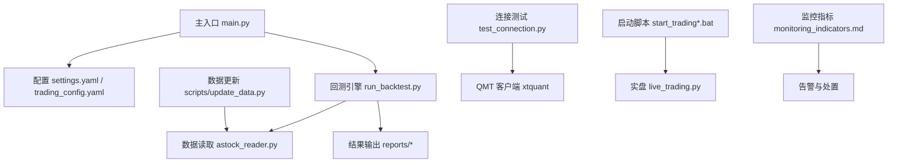
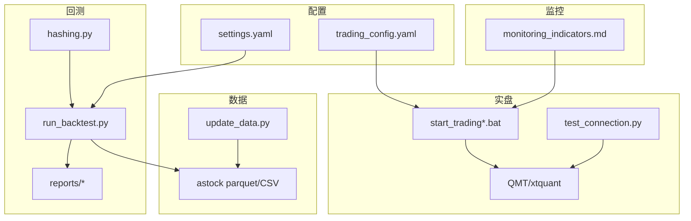
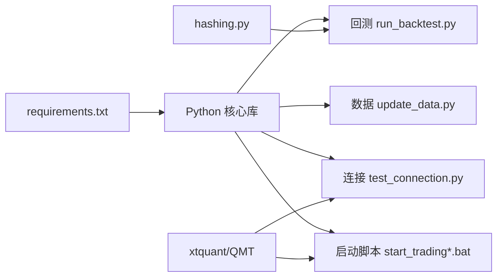
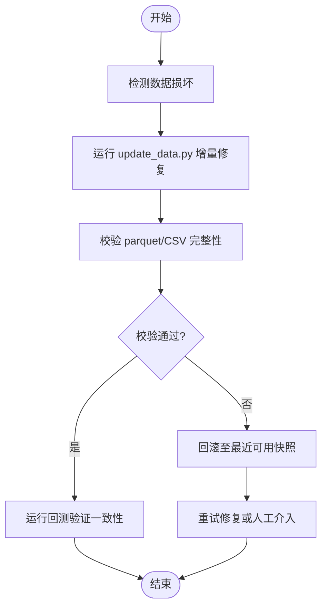
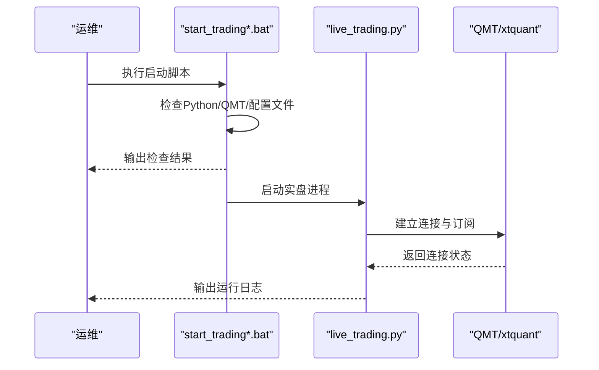
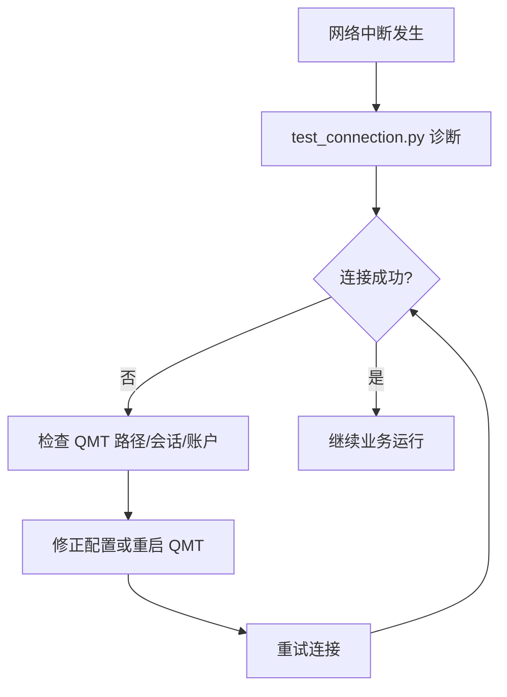
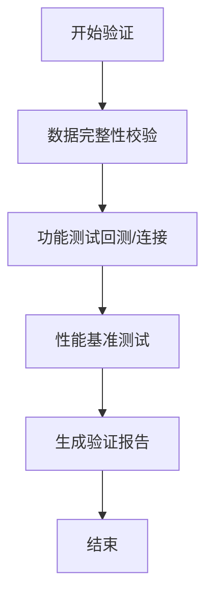

# 恢复演练计划

<cite>
**本文引用的文件**   
- [main.py](file://main.py)
- [AGENTS.md](file://AGENTS.md)
- [requirements.txt](file://requirements.txt)
- [setup.py](file://setup.py)
- [scripts/update_data.py](file://scripts/update_data.py)
- [test_connection.py](file://test_connection.py)
- [config/settings.yaml](file://config/settings.yaml)
- [config/trading_config.yaml](file://config/trading_config.yaml)
- [scripts/run_backtest.py](file://scripts/run_backtest.py)
- [start_trading.bat](file://start_trading.bat)
- [start_trading_qmt.bat](file://start_trading_qmt.bat)
- [backtest/hashin g.py](file://backtest/hashing.py)
- [projects/verification/results/monitoring_indicators.md](file://projects/verification/results/monitoring_indicators.md)
</cite>

## 目录
1. [引言](#引言)
2. [项目结构](#项目结构)
3. [核心组件](#核心组件)
4. [架构总览](#架构总览)
5. [详细组件分析](#详细组件分析)
6. [依赖关系分析](#依赖关系分析)
7. [性能考虑](#性能考虑)
8. [故障演练与恢复流程](#故障演练与恢复流程)
9. [恢复验证流程](#恢复验证流程)
10. [预案更新机制](#预案更新机制)
11. [演练记录与评估模板](#演练记录与评估模板)
12. [结论](#结论)

## 引言
本文件为 QuantLab 制定“恢复演练计划”，覆盖月度、季度、年度演练时间表；设计数据损坏、系统崩溃、网络中断、硬件故障等故障模拟场景；给出恢复验证（数据完整性、功能测试、性能基准）；并建立基于演练结果的预案更新机制，配套演练记录与评估报告模板，持续改进恢复能力。

## 项目结构
QuantLab 以“研究-回测-实盘”为主线：
- 配置层：全局设置与交易参数分离，便于切换与审计
- 数据层：astock parquet + CSV 预生成，增量更新脚本
- 回测层：统一入口与结果输出，哈希校验可追溯
- 实盘层：QMT 连接、调度、风控、日志与通知
- 验证层：监控指标定义与鲁棒性测试

图表来源
- [main.py:1-104](file://main.py#L1-L104)
- [config/settings.yaml:1-69](file://config/settings.yaml#L1-L69)
- [config/trading_config.yaml:1-62](file://config/trading_config.yaml#L1-L62)
- [scripts/run_backtest.py:1-132](file://scripts/run_backtest.py#L1-L132)
- [scripts/update_data.py:1-135](file://scripts/update_data.py#L1-L135)
- [test_connection.py:1-117](file://test_connection.py#L1-L117)
- [start_trading.bat:1-51](file://start_trading.bat#L1-L51)
- [start_trading_qmt.bat:1-66](file://start_trading_qmt.bat#L1-L66)
- [projects/verification/results/monitoring_indicators.md:1-63](file://projects/verification/results/monitoring_indicators.md#L1-L63)

章节来源
- [AGENTS.md:1-194](file://AGENTS.md#L1-L194)
- [requirements.txt:1-29](file://requirements.txt#L1-L29)
- [setup.py:1-82](file://setup.py#L1-L82)

## 核心组件
- 配置管理
  - 全局配置：settings.yaml（数据源、缓存、回测默认值、因子预处理、策略默认股票池）
  - 交易配置：trading_config.yaml（账号、交易参数、风控阈值、委托管理、调度计划、通知）
- 数据管道
  - 增量更新：update_data.py（astock parquet 增量合并、CSV 重算）
  - 回测数据：run_backtest.py（只读 astock，写 reports）
- 连接与运行
  - 连接测试：test_connection.py（xtquant、路径、账户、持仓）
  - 启动脚本：start_trading*.bat（环境检查、日志目录、配置文件校验）
- 可追溯性
  - 哈希校验：hashing.py（配置、宇宙、数据集哈希）
- 监控与告警
  - 指标定义：monitoring_indicators.md（日/周/月/季监控与阈值）

章节来源
- [config/settings.yaml:1-69](file://config/settings.yaml#L1-L69)
- [config/trading_config.yaml:1-62](file://config/trading_config.yaml#L1-L62)
- [scripts/update_data.py:1-135](file://scripts/update_data.py#L1-L135)
- [scripts/run_backtest.py:1-132](file://scripts/run_backtest.py#L1-L132)
- [test_connection.py:1-117](file://test_connection.py#L1-L117)
- [backtest/hashing.py:1-23](file://backtest/hashing.py#L1-L23)
- [projects/verification/results/monitoring_indicators.md:1-63](file://projects/verification/results/monitoring_indicators.md#L1-L63)

## 架构总览
下图展示从配置到数据、回测、实盘与监控的整体链路，以及演练中关键断点与恢复抓手。

图表来源
- [config/settings.yaml:1-69](file://config/settings.yaml#L1-L69)
- [config/trading_config.yaml:1-62](file://config/trading_config.yaml#L1-L62)
- [scripts/update_data.py:1-135](file://scripts/update_data.py#L1-L135)
- [scripts/run_backtest.py:1-132](file://scripts/run_backtest.py#L1-L132)
- [backtest/hashing.py:1-23](file://backtest/hashing.py#L1-L23)
- [test_connection.py:1-117](file://test_connection.py#L1-L117)
- [start_trading.bat:1-51](file://start_trading.bat#L1-L51)
- [start_trading_qmt.bat:1-66](file://start_trading_qmt.bat#L1-L66)
- [projects/verification/results/monitoring_indicators.md:1-63](file://projects/verification/results/monitoring_indicators.md#L1-L63)

## 详细组件分析
- 配置加载与回测入口
  - main.py 负责加载 settings.yaml 并调用 Project_01 的评分与回测模块；支持旧版兼容路径
- 回测执行器
  - run_backtest.py 解析 YAML、构建 Universe、初始化 AstockParquetReader、执行回测并写入 reports；包含配置与宇宙哈希
- 数据更新
  - update_data.py 扫描增量目录，去重合并 parquet，并基于最新日期重算 CSV（含 ROE 派生字段）
- 连接测试
  - test_connection.py 校验 xtquant、QMT 路径、会话与账户信息，打印资产与持仓摘要
- 启动脚本
  - start_trading*.bat 检查 Python/QMT 进程、创建日志目录、校验配置文件后启动 live_trading.py
- 监控指标
  - monitoring_indicators.md 定义净值、回撤、持仓集中度、换手率、信号质量、容量与策略有效性等阈值与处置

章节来源
- [main.py:1-104](file://main.py#L1-L104)
- [scripts/run_backtest.py:1-132](file://scripts/run_backtest.py#L1-L132)
- [scripts/update_data.py:1-135](file://scripts/update_data.py#L1-L135)
- [test_connection.py:1-117](file://test_connection.py#L1-L117)
- [start_trading.bat:1-51](file://start_trading.bat#L1-L51)
- [start_trading_qmt.bat:1-66](file://start_trading_qmt.bat#L1-L66)
- [projects/verification/results/monitoring_indicators.md:1-63](file://projects/verification/results/monitoring_indicators.md#L1-L63)

## 依赖关系分析
- 运行时依赖
  - pandas/numpy/pyyaml/scipy/lightgbm 等（见 requirements.txt）
  - xtquant（QMT 内置或外部安装）
- 组件耦合
  - 回测仅读 astock，不依赖 xtquant；实盘通过 test_connection.py 与 start_trading*.bat 强依赖 QMT 进程
- 可观测性
  - hashing.py 提供配置/宇宙/数据集哈希，用于一致性校验与复现实验

图表来源
- [requirements.txt:1-29](file://requirements.txt#L1-L29)
- [scripts/run_backtest.py:1-132](file://scripts/run_backtest.py#L1-L132)
- [scripts/update_data.py:1-135](file://scripts/update_data.py#L1-L135)
- [test_connection.py:1-117](file://test_connection.py#L1-L117)
- [start_trading.bat:1-51](file://start_trading.bat#L1-L51)
- [backtest/hashing.py:1-23](file://backtest/hashing.py#L1-L23)

章节来源
- [requirements.txt:1-29](file://requirements.txt#L1-L29)

## 性能考虑
- 数据读写
  - astock parquet 作为主数据源，增量合并时注意去重与排序开销；CSV 重算仅在最新交易日进行
- 回测性能
  - 合理设置 initial_cash、benchmark_code、industry_map 按需加载；避免不必要的行业映射计算
- 实盘稳定性
  - 使用 QMT 内置 Python 3.6.8 保证兼容性；避免在产物中引入不支持语法
- 缓存策略
  - data/cache 启用且过期时间为 1 天，减少重复 IO

[本节为通用指导，无需特定文件引用]

## 故障演练与恢复流程
以下按故障类型设计演练目标、步骤、恢复动作与验证要点。

### 数据损坏模拟（parquet/CSV 损坏或缺失）
- 演练目标
  - 验证增量更新与 CSV 重建的健壮性；确保回测与实盘数据一致性
- 模拟步骤
  - 随机破坏 stock_daily.parquet 部分行或索引
  - 删除最新交易日 CSV（D:/QMT_POOL/mfic_fin_data.csv）
- 恢复步骤
  - 重新运行 scripts/update_data.py 进行增量合并与 CSV 重算
  - 校验 parquet 行数与最新日期、CSV 字段完整性
- 验证要点
  - 回测可正常跑通且结果哈希稳定
  - 连接测试与实盘启动无数据异常报错

图表来源
- [scripts/update_data.py:1-135](file://scripts/update_data.py#L1-L135)
- [scripts/run_backtest.py:1-132](file://scripts/run_backtest.py#L1-L132)

章节来源
- [scripts/update_data.py:1-135](file://scripts/update_data.py#L1-L135)
- [scripts/run_backtest.py:1-132](file://scripts/run_backtest.py#L1-L132)

### 系统崩溃模拟（进程/服务异常退出）
- 演练目标
  - 验证启动脚本与环境自检能力；确保快速恢复
- 模拟步骤
  - 终止 live_trading.py 或 QMT 进程
  - 模拟 Python 未加入 PATH 或缺少依赖
- 恢复步骤
  - 执行 start_trading*.bat 自动检查环境与依赖
  - 若缺失依赖，使用 setup.py 一键配置（复制 xtquant、创建目录）
- 验证要点
  - 启动脚本成功拉起进程；日志目录与配置文件存在

图表来源
- [start_trading.bat:1-51](file://start_trading.bat#L1-L51)
- [start_trading_qmt.bat:1-66](file://start_trading_qmt.bat#L1-L66)
- [setup.py:1-82](file://setup.py#L1-L82)
- [test_connection.py:1-117](file://test_connection.py#L1-L117)

章节来源
- [start_trading.bat:1-51](file://start_trading.bat#L1-L51)
- [start_trading_qmt.bat:1-66](file://start_trading_qmt.bat#L1-L66)
- [setup.py:1-82](file://setup.py#L1-L82)

### 网络中断模拟（QMT/数据源不可达）
- 演练目标
  - 验证连接失败时的错误处理与重试策略；保障最小可用服务
- 模拟步骤
  - 断开 miniQMT 或修改 trading_config.yaml 中的 path/session_id
  - 阻断 astock 数据路径访问
- 恢复步骤
  - 使用 test_connection.py 诊断连接问题
  - 修正配置或重启 QMT；必要时切换到本地缓存数据
- 验证要点
  - 连接测试输出明确错误码与解决建议；回测可离线运行

图表来源
- [test_connection.py:1-117](file://test_connection.py#L1-L117)
- [config/trading_config.yaml:1-62](file://config/trading_config.yaml#L1-L62)

章节来源
- [test_connection.py:1-117](file://test_connection.py#L1-L117)
- [config/trading_config.yaml:1-62](file://config/trading_config.yaml#L1-L62)

### 硬件故障模拟（磁盘损坏/存储介质失效）
- 演练目标
  - 验证数据备份与恢复流程；确保关键目录与文件可恢复
- 模拟步骤
  - 模拟 E:/astock 或 E:/QuantLab/data/cache 不可用
- 恢复步骤
  - 从备份恢复 astock 与缓存目录
  - 运行 update_data.py 补齐增量数据
  - 运行回测与连接测试验证
- 验证要点
  - 数据一致性与回测结果哈希不变；实盘连接正常

[本节为通用流程，无需特定文件引用]

## 恢复验证流程
- 数据完整性验证
  - 校验 astock parquet 行数、最新日期、去重计数
  - 校验 CSV 字段完整（ts_code/pb/pe_ttm/circ_mv/amount/roe）
- 功能测试
  - 运行回测脚本，确认输出目录与关键指标（年化、夏普、最大回撤、成交笔数）
  - 执行连接测试，确认账户资产与持仓查询正常
- 性能基准测试
  - 固定配置与宇宙，记录回测耗时与资源占用
  - 对比不同调整方式（raw/qfq/hfq）对性能的影响

[本节为通用流程，无需特定文件引用]

## 预案更新机制
- 演练后复盘
  - 汇总演练记录与问题清单，识别薄弱环节
- 流程优化
  - 根据演练结果修订 update_data.py 与回测脚本的参数与容错逻辑
- 操作手册更新
  - 更新 AGENTS.md 与相关说明文档，补充新场景与操作步骤
- 监控告警改进
  - 依据 monitoring_indicators.md 的阈值与处置策略，完善告警规则与自动化处置

章节来源
- [AGENTS.md:1-194](file://AGENTS.md#L1-L194)
- [projects/verification/results/monitoring_indicators.md:1-63](file://projects/verification/results/monitoring_indicators.md#L1-L63)

## 演练记录与评估模板
- 演练记录表（字段建议）
  - 演练编号、名称、时间、负责人、参与人
  - 故障类型、影响范围、预期恢复时间（RTO）、实际恢复时间
  - 演练步骤、关键命令与脚本、遇到的问题与解决方案
  - 数据校验结果、功能测试结果、性能基准对比
  - 风险等级、是否触发告警、是否需要升级预案
- 评估报告模板（内容建议）
  - 演练概述与目标
  - 过程回顾与关键发现
  - 数据与功能验证结论
  - 性能与容量评估
  - 改进项与责任人、完成时限
  - 后续演练计划与关注点

[本节为模板建议，无需特定文件引用]

## 结论
本恢复演练计划围绕 QuantLab 的数据、回测、实盘与监控四大环节，设计了可操作的演练场景与恢复流程，并通过哈希校验与标准化验证确保一致性。结合监控指标与复盘机制，持续优化恢复能力与运营稳健性。建议按月执行轻量演练、按季开展综合演练、按年进行全量恢复演练，形成闭环改进。