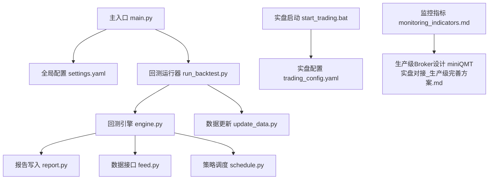
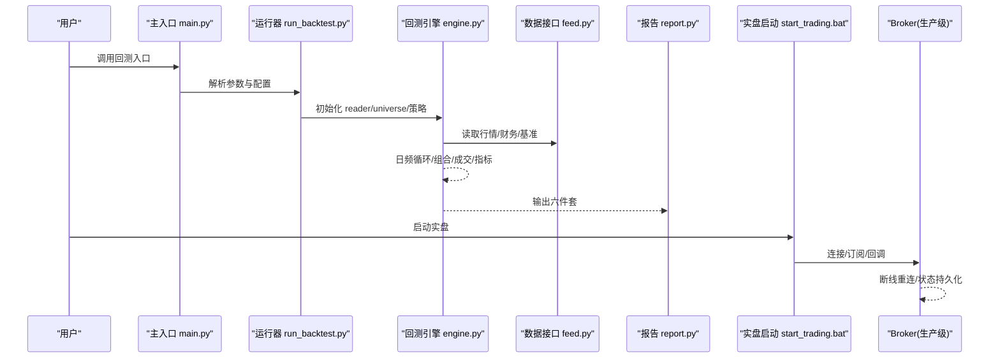
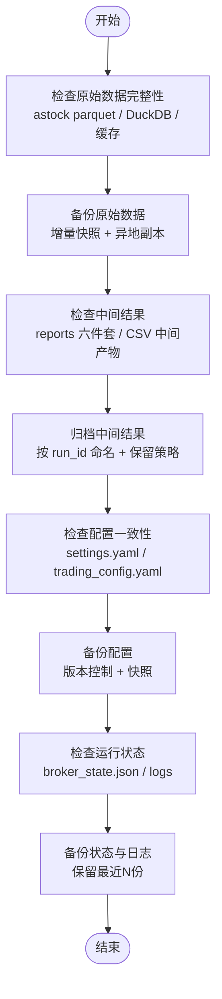
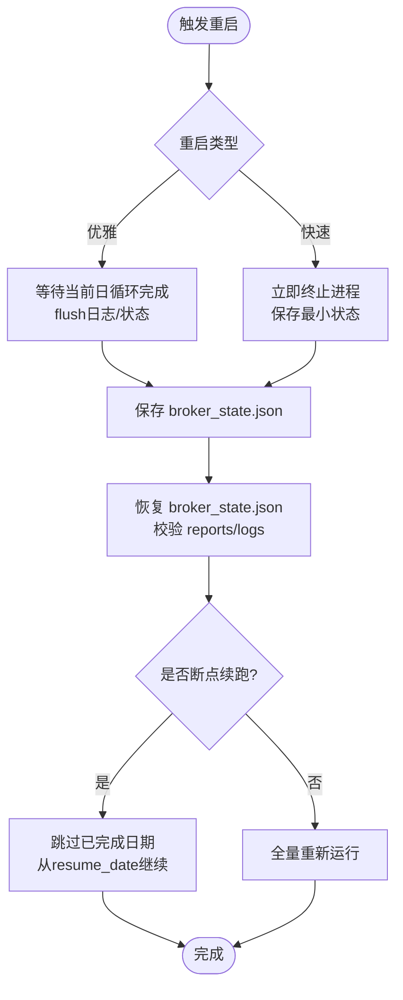
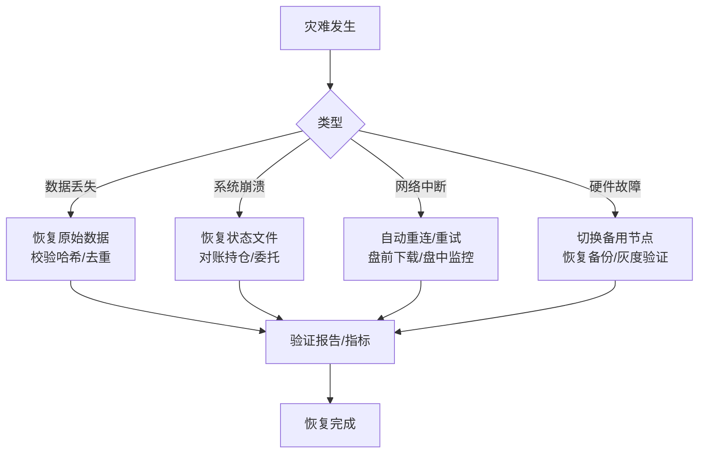
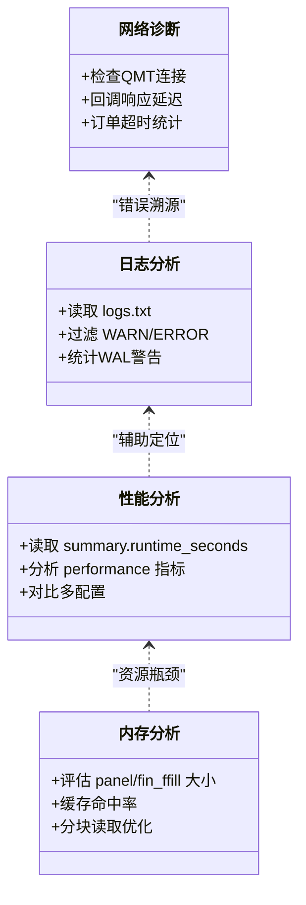
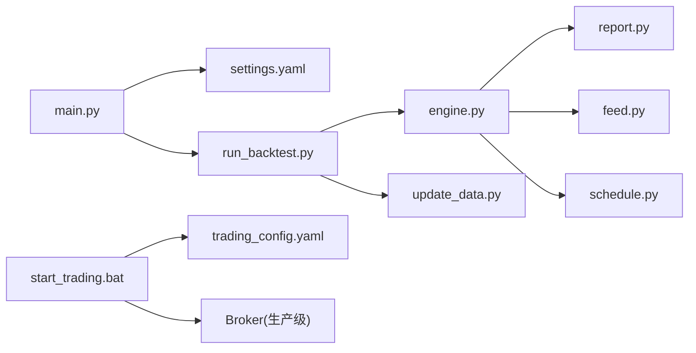
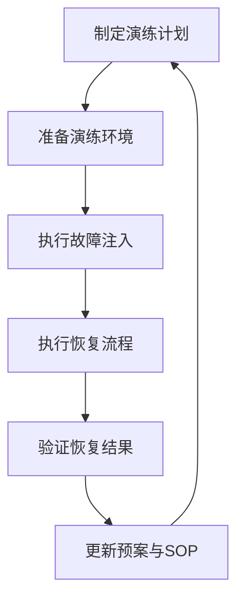

# 故障恢复方案

<cite>
**本文引用的文件**   
- [main.py](file://main.py)
- [settings.yaml](file://config\settings.yaml)
- [engine.py](file://backtest\engine.py)
- [report.py](file://backtest\report.py)
- [feed.py](file://data\feed.py)
- [schedule.py](file://strategy\schedule.py)
- [update_data.py](file://scripts\update_data.py)
- [run_backtest.py](file://scripts\run_backtest.py)
- [trading_config.yaml](file://config\trading_config.yaml)
- [start_trading.bat](file://start_trading.bat)
- [monitoring_indicators.md](file://projects\verification\results\monitoring_indicators.md)
- [miniQMT实盘对接_生产级完善方案.md](file://miniQMT实盘对接_生产级完善方案.md)
</cite>

## 目录
1. [引言](#引言)
2. [项目结构](#项目结构)
3. [核心组件](#核心组件)
4. [架构总览](#架构总览)
5. [详细组件分析](#详细组件分析)
6. [依赖关系分析](#依赖关系分析)
7. [性能与稳定性考量](#性能与稳定性考量)
8. [故障诊断工具](#故障诊断工具)
9. [故障恢复演练计划](#故障恢复演练计划)
10. [结论](#结论)

## 引言
本方案面向 QuantLab 的“回测+实盘”一体化系统，围绕数据备份、策略重启、灾难恢复、故障诊断与演练五大目标，给出可落地的自动化流程与操作指引。方案以现有代码为基础，结合配置与脚本能力，形成从数据到策略再到交易执行的全链路恢复保障。

## 项目结构
QuantLab 采用模块化组织：入口与配置在根目录，回测引擎与报告在 backtest，数据读取在 data，策略注册与调度在 strategy，脚本与批处理在 scripts，实盘相关配置与文档在 config 与文档中。

**图示来源** 
- [main.py:1-104](file://main.py#L1-L104)
- [settings.yaml:1-69](file://config\settings.yaml#L1-L69)
- [run_backtest.py:1-132](file://scripts\run_backtest.py#L1-L132)
- [engine.py:1-619](file://backtest\engine.py#L1-L619)
- [report.py:1-264](file://backtest\report.py#L1-L264)
- [feed.py:1-197](file://data\feed.py#L1-L197)
- [schedule.py:1-47](file://strategy\schedule.py#L1-L47)
- [update_data.py:1-135](file://scripts\update_data.py#L1-L135)
- [start_trading.bat:1-51](file://start_trading.bat#L1-L51)
- [trading_config.yaml:1-62](file://config\trading_config.yaml#L1-L62)
- [monitoring_indicators.md:1-69](file://projects\verification\results\monitoring_indicators.md#L1-L69)
- [miniQMT实盘对接_生产级完善方案.md:73-756](file://miniQMT实盘对接_生产级完善方案.md#L73-L756)

**章节来源**
- [main.py:1-104](file://main.py#L1-L104)
- [settings.yaml:1-69](file://config\settings.yaml#L1-L69)
- [run_backtest.py:1-132](file://scripts\run_backtest.py#L1-L132)
- [engine.py:1-619](file://backtest\engine.py#L1-L619)
- [report.py:1-264](file://backtest\report.py#L1-L264)
- [feed.py:1-197](file://data\feed.py#L1-L197)
- [schedule.py:1-47](file://strategy\schedule.py#L1-L47)
- [update_data.py:1-135](file://scripts\update_data.py#L1-L135)
- [start_trading.bat:1-51](file://start_trading.bat#L1-L51)
- [trading_config.yaml:1-62](file://config\trading_config.yaml#L1-L62)
- [monitoring_indicators.md:1-69](file://projects\verification\results\monitoring_indicators.md#L1-L69)
- [miniQMT实盘对接_生产级完善方案.md:73-756](file://miniQMT实盘对接_生产级完善方案.md#L73-L756)

## 核心组件
- 主入口与配置加载：负责加载全局配置并选择策略路径，统一回测入口。
- 回测引擎：实现日频循环、基准对齐、组合状态、成交填充、指标计算与摘要生成。
- 报告写入：将结果持久化为标准六件套（summary.json、trades.csv、equity_curve.csv、positions.csv、logs.txt、report.md）。
- 数据接口：统一 astock/duckdb 数据源访问，提供面板数据构建与缓存。
- 策略调度：统一的调仓日历判断（周/月/季首交易日）。
- 数据更新：增量更新 astock parquet 并重建 CSV 中间产物。
- 实盘启动与配置：批处理检查环境、创建日志目录、校验配置文件后启动实盘进程。
- 监控指标与生产级 Broker：定义监控阈值与自动重连、委托追踪、状态持久化等能力。

**章节来源**
- [main.py:21-104](file://main.py#L21-L104)
- [engine.py:237-619](file://backtest\engine.py#L237-L619)
- [report.py:245-264](file://backtest\report.py#L245-L264)
- [feed.py:17-135](file://data\feed.py#L17-L135)
- [schedule.py:10-47](file://strategy\schedule.py#L10-L47)
- [update_data.py:37-135](file://scripts\update_data.py#L37-L135)
- [start_trading.bat:1-51](file://start_trading.bat#L1-L51)
- [trading_config.yaml:1-62](file://config\trading_config.yaml#L1-L62)
- [monitoring_indicators.md:1-69](file://projects\verification\results\monitoring_indicators.md#L1-L69)
- [miniQMT实盘对接_生产级完善方案.md:73-756](file://miniQMT实盘对接_生产级完善方案.md#L73-L756)

## 架构总览
下图展示从配置加载、数据读取、回测执行到报告产出的完整链路，以及实盘启动与 Broker 回调的关键节点。

**图示来源** 
- [main.py:21-104](file://main.py#L21-L104)
- [run_backtest.py:42-132](file://scripts\run_backtest.py#L42-L132)
- [engine.py:237-619](file://backtest\engine.py#L237-L619)
- [feed.py:17-135](file://data\feed.py#L17-L135)
- [report.py:245-264](file://backtest\report.py#L245-L264)
- [start_trading.bat:1-51](file://start_trading.bat#L1-L51)
- [miniQMT实盘对接_生产级完善方案.md:73-756](file://miniQMT实盘对接_生产级完善方案.md#L73-L756)

## 详细组件分析

### 数据备份策略（原始数据、中间结果、配置、状态）
- 原始数据备份
  - astock parquet 作为主数据源，支持增量更新；建议对 E:/astock/daily/stock_daily.parquet 进行定时快照与异地备份。
  - DuckDB 基准库与缓存目录也应纳入备份范围。
- 中间结果备份
  - 回测产物（reports/<run_id>_config/）包含六件套，需按 run_id 归档；CSV 中间产物（如 mfic_fin_data.csv）应保留最近若干版本。
- 配置备份
  - settings.yaml、trading_config.yaml 及各策略 YAML 变更需纳入版本控制与定期快照。
- 状态备份
  - Broker 状态文件 data/broker_state.json 记录委托与成交快照，用于崩溃恢复；建议每日归档并保留最近 N 份。

**图示来源** 
- [update_data.py:37-135](file://scripts\update_data.py#L37-L135)
- [report.py:245-264](file://backtest\report.py#L245-L264)
- [settings.yaml:1-69](file://config\settings.yaml#L1-L69)
- [trading_config.yaml:1-62](file://config\trading_config.yaml#L1-L62)
- [miniQMT实盘对接_生产级完善方案.md:650-686](file://miniQMT实盘对接_生产级完善方案.md#L650-L686)

**章节来源**
- [update_data.py:37-135](file://scripts\update_data.py#L37-L135)
- [report.py:245-264](file://backtest\report.py#L245-L264)
- [settings.yaml:1-69](file://config\settings.yaml#L1-L69)
- [trading_config.yaml:1-62](file://config\trading_config.yaml#L1-L62)
- [miniQMT实盘对接_生产级完善方案.md:650-686](file://miniQMT实盘对接_生产级完善方案.md#L650-L686)

### 策略重启机制（优雅重启、快速重启、断点续跑、状态恢复）
- 优雅重启
  - 通过批处理或进程管理器发送信号，等待当前日频循环完成后再退出；确保 pending 决策已处理完毕。
- 快速重启
  - 直接终止进程并重新启动；依赖 broker_state.json 与 reports 产物进行状态恢复与结果校验。
- 断点续跑
  - 基于 calendar 与 cut_index 的窗口切片，可在恢复时跳过已完成日期；建议在 run_backtest 层增加 resume_date 参数。
- 状态恢复
  - 使用 broker_state.json 恢复未完成委托与最近成交；结合 reports/logs 校验一致性。

**图示来源** 
- [engine.py:237-619](file://backtest\engine.py#L237-L619)
- [miniQMT实盘对接_生产级完善方案.md:650-686](file://miniQMT实盘对接_生产级完善方案.md#L650-L686)
- [report.py:245-264](file://backtest\report.py#L245-L264)

**章节来源**
- [engine.py:237-619](file://backtest\engine.py#L237-L619)
- [miniQMT实盘对接_生产级完善方案.md:650-686](file://miniQMT实盘对接_生产级完善方案.md#L650-L686)
- [report.py:245-264](file://backtest\report.py#L245-L264)

### 灾难恢复流程（数据丢失、系统崩溃、网络中断、硬件故障）
- 数据丢失恢复
  - 从备份恢复 astock parquet/DuckDB/CSV 中间产物；校验去重与时间戳连续性。
- 系统崩溃恢复
  - 恢复 broker_state.json 与 logs；核对未成交委托与持仓差异；必要时触发对账与减仓。
- 网络中断恢复
  - Broker 自动重连（指数退避），重试上限后告警；盘前下载历史数据，盘中监控委托超时。
- 硬件故障恢复
  - 切换至备用节点，恢复最新备份；验证配置一致性与数据哈希；灰度上线并观察监控指标。

**图示来源** 
- [update_data.py:37-135](file://scripts\update_data.py#L37-L135)
- [miniQMT实盘对接_生产级完善方案.md:290-313](file://miniQMT实盘对接_生产级完善方案.md#L290-L313)
- [monitoring_indicators.md:1-69](file://projects\verification\results\monitoring_indicators.md#L1-L69)

**章节来源**
- [update_data.py:37-135](file://scripts\update_data.py#L37-L135)
- [miniQMT实盘对接_生产级完善方案.md:290-313](file://miniQMT实盘对接_生产级完善方案.md#L290-L313)
- [monitoring_indicators.md:1-69](file://projects\verification\results\monitoring_indicators.md#L1-L69)

### 故障诊断工具（日志分析、性能分析、内存分析、网络诊断）
- 日志分析
  - 查看 reports/<run>/logs.txt 与系统日志；关注 [WARN]/[ERROR] 行与 WAL 检测提示。
- 性能分析
  - 依据 summary.runtime_seconds 与 performance 指标定位瓶颈；对比不同配置的耗时与收益。
- 内存分析
  - 针对大数据集（panel/fin_ffill）进行内存占用评估；必要时分块读取与清理缓存。
- 网络诊断
  - 检查 QMT 连接状态、回调响应、订单超时；利用 Broker 的 _notify 与 on_disconnected 事件。

**图示来源** 
- [report.py:78-121](file://backtest\report.py#L78-L121)
- [engine.py:545-619](file://backtest\engine.py#L545-L619)
- [miniQMT实盘对接_生产级完善方案.md:140-193](file://miniQMT实盘对接_生产级完善方案.md#L140-L193)

**章节来源**
- [report.py:78-121](file://backtest\report.py#L78-L121)
- [engine.py:545-619](file://backtest\engine.py#L545-L619)
- [miniQMT实盘对接_生产级完善方案.md:140-193](file://miniQMT实盘对接_生产级完善方案.md#L140-L193)

## 依赖关系分析
- 模块耦合
  - main.py 依赖 settings.yaml 与策略模块；run_backtest.py 依赖 engine.py、report.py、data readers。
  - engine.py 依赖 portfolio/analyzer/rebalance/execution 及 benchmark_reader。
  - feed.py 抽象 astock/duckdb 数据源，供上层回测与策略使用。
- 外部依赖
  - xtquant（QMT）、DuckDB、Pandas/Numpy/YAML 等。
- 潜在环路
  - 扁平化包结构避免深层嵌套导入；注意 industry_map 按需加载。

**图示来源** 
- [main.py:1-104](file://main.py#L1-L104)
- [run_backtest.py:1-132](file://scripts\run_backtest.py#L1-L132)
- [engine.py:1-619](file://backtest\engine.py#L1-L619)
- [report.py:1-264](file://backtest\report.py#L1-L264)
- [feed.py:1-197](file://data\feed.py#L1-L197)
- [schedule.py:1-47](file://strategy\schedule.py#L1-L47)
- [update_data.py:1-135](file://scripts\update_data.py#L1-L135)
- [start_trading.bat:1-51](file://start_trading.bat#L1-L51)
- [trading_config.yaml:1-62](file://config\trading_config.yaml#L1-L62)

**章节来源**
- [main.py:1-104](file://main.py#L1-L104)
- [run_backtest.py:1-132](file://scripts\run_backtest.py#L1-L132)
- [engine.py:1-619](file://backtest\engine.py#L1-L619)
- [report.py:1-264](file://backtest\report.py#L1-L264)
- [feed.py:1-197](file://data\feed.py#L1-L197)
- [schedule.py:1-47](file://strategy\schedule.py#L1-L47)
- [update_data.py:1-135](file://scripts\update_data.py#L1-L135)
- [start_trading.bat:1-51](file://start_trading.bat#L1-L51)
- [trading_config.yaml:1-62](file://config\trading_config.yaml#L1-L62)

## 性能与稳定性考量
- 数据读取
  - 使用 parquet 与 DuckDB 提升读取效率；合理设置 cache 与过期策略。
- 回测循环
  - 预计算 cut_index 实现 O(1) 窗口切片；基准序列对齐与缺失处理。
- 报告写入
  - 固定列顺序与 UTF-8 编码，保证跨平台一致性。
- 实盘稳定性
  - Broker 指数退避重连、委托超时监控、状态持久化与通知。

**章节来源**
- [feed.py:106-135](file://data\feed.py#L106-L135)
- [engine.py:121-146](file://backtest\engine.py#L121-L146)
- [report.py:52-75](file://backtest\report.py#L52-L75)
- [miniQMT实盘对接_生产级完善方案.md:290-313](file://miniQMT实盘对接_生产级完善方案.md#L290-L313)

## 故障诊断工具
- 日志分析
  - 重点查看 logs.txt 中的 [WARN]/[ERROR] 与 WAL 检测信息。
- 性能分析
  - 依据 summary.runtime_seconds 与 performance 指标，定位慢点。
- 内存分析
  - 评估 panel/fin_ffill 大小，必要时分块读取与清理缓存。
- 网络诊断
  - 检查 QMT 连接、回调响应、订单超时；利用 Broker 的通知与事件。

**章节来源**
- [report.py:78-121](file://backtest\report.py#L78-L121)
- [engine.py:545-619](file://backtest\engine.py#L545-L619)
- [miniQMT实盘对接_生产级完善方案.md:140-193](file://miniQMT实盘对接_生产级完善方案.md#L140-L193)

## 故障恢复演练计划
- 定期演练
  - 每周进行一次数据恢复演练，每月进行一次全链路恢复演练。
- 故障模拟
  - 模拟数据损坏、进程崩溃、网络中断、硬件故障等场景。
- 恢复验证
  - 校验 reports/logs 一致性、broker_state.json 恢复效果、监控指标阈值。
- 预案更新
  - 根据演练结果更新 SOP 与配置项，确保可复现与可追溯。

**图示来源** 
- [monitoring_indicators.md:1-69](file://projects\verification\results\monitoring_indicators.md#L1-L69)
- [report.py:78-121](file://backtest\report.py#L78-L121)
- [miniQMT实盘对接_生产级完善方案.md:650-686](file://miniQMT实盘对接_生产级完善方案.md#L650-L686)

**章节来源**
- [monitoring_indicators.md:1-69](file://projects\verification\results\monitoring_indicators.md#L1-L69)
- [report.py:78-121](file://backtest\report.py#L78-L121)
- [miniQMT实盘对接_生产级完善方案.md:650-686](file://miniQMT实盘对接_生产级完善方案.md#L650-L686)

## 结论
本方案以现有代码与配置为依据，构建了覆盖数据、策略、交易执行的完整故障恢复体系。通过自动化备份、稳健的重启与恢复机制、完善的诊断工具与演练计划，显著提升系统的可用性与可维护性。建议持续迭代监控与告警能力，确保在生产环境中稳定运行。