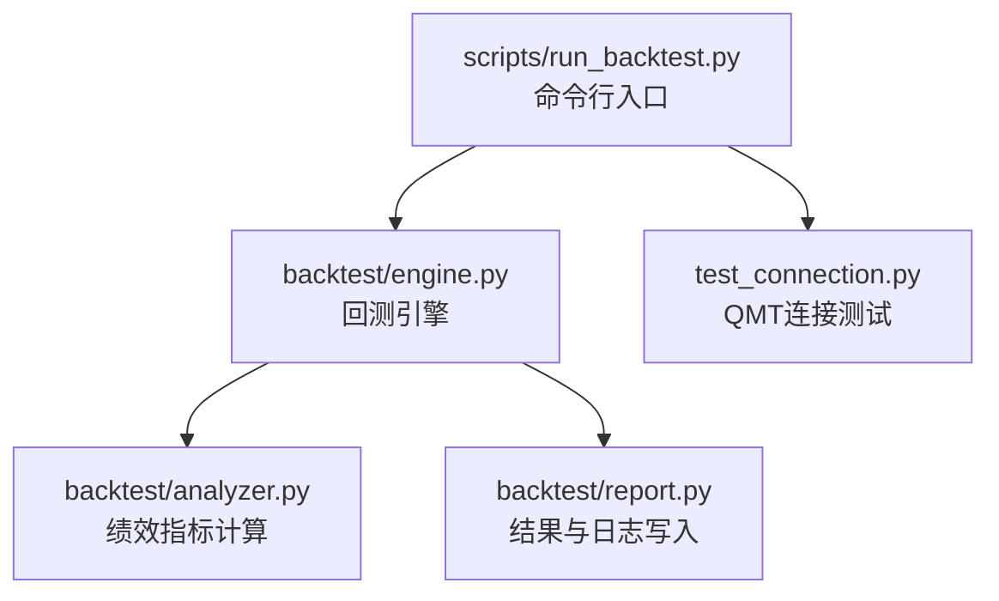
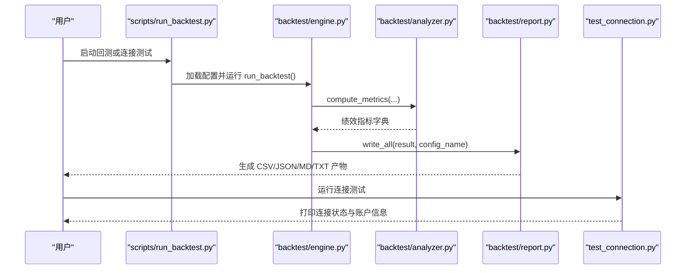
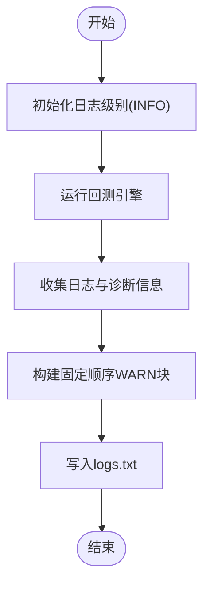
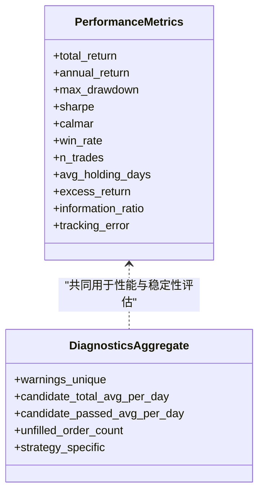
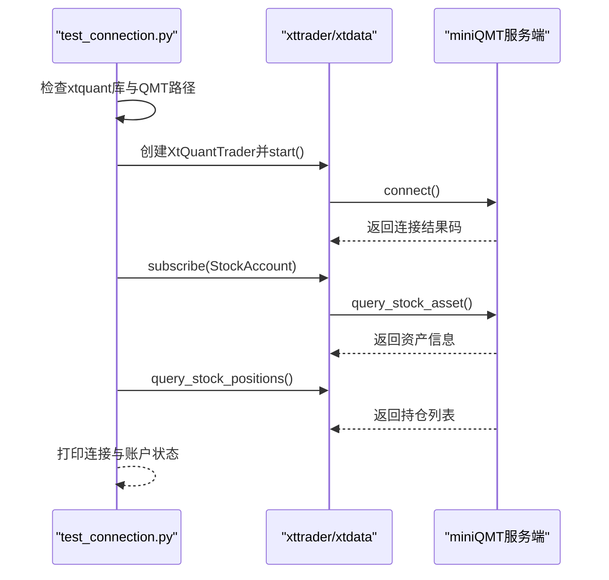
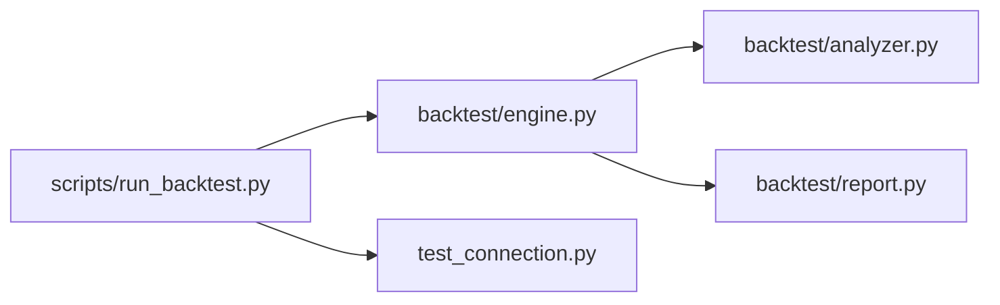

# 故障诊断工具

<cite>
**本文引用的文件**   
- [backtest/engine.py](file://backtest/engine.py)
- [backtest/report.py](file://backtest/report.py)
- [backtest/analyzer.py](file://backtest/analyzer.py)
- [scripts/run_backtest.py](file://scripts/run_backtest.py)
- [test_connection.py](file://test_connection.py)
</cite>

## 目录
1. [简介](#简介)
2. [项目结构](#项目结构)
3. [核心组件](#核心组件)
4. [架构总览](#架构总览)
5. [详细组件分析](#详细组件分析)
6. [依赖关系分析](#依赖关系分析)
7. [性能注意事项](#性能注意事项)
8. [故障排查指南](#故障排查指南)
9. [结论](#结论)
10. [附录：常用诊断命令与脚本](#附录：常用诊断命令与脚本)

## 简介
本文件为 QuantLab 的“故障诊断工具集”文档，聚焦于回测与运行过程中的日志、性能与网络连接的诊断能力。内容覆盖：
- 日志分析工具：日志级别设置、关键错误识别、性能瓶颈定位
- 性能分析工具：内存使用监控、CPU 利用率分析、I/O 性能检测（基于现有输出与可观测性）
- 内存分析功能：内存泄漏检测、对象引用分析、垃圾回收监控（结合运行时指标与外部工具建议）
- 网络诊断工具：连接状态检查、数据传输监控、延迟分析（以 QMT/miniQMT 连接测试为核心）
- 常用诊断命令与脚本：快速定位和解决问题

## 项目结构
QuantLab 的诊断能力主要分布在以下模块：
- backtest/engine.py：回测主循环、日志收集、诊断聚合、基准数据可用性判断
- backtest/report.py：结果写入（含 logs.txt、report.md、summary.json 等），固定顺序的 WARN 块生成
- backtest/analyzer.py：绩效指标计算（夏普、最大回撤、年化等），用于性能评估
- scripts/run_backtest.py：CLI 入口，统一配置加载、日志初始化、结果输出
- test_connection.py：miniQMT 连接测试与基础网络连通性诊断

**图表来源** 
- [scripts/run_backtest.py:1-132](file://scripts/run_backtest.py#L1-L132)
- [backtest/engine.py:237-619](file://backtest/engine.py#L237-L619)
- [backtest/analyzer.py:96-176](file://backtest/analyzer.py#L96-L176)
- [backtest/report.py:1-264](file://backtest/report.py#L1-L264)
- [test_connection.py:1-117](file://test_connection.py#L1-L117)

**章节来源**
- [scripts/run_backtest.py:1-132](file://scripts/run_backtest.py#L1-L132)
- [backtest/engine.py:237-619](file://backtest/engine.py#L237-L619)
- [backtest/report.py:1-264](file://backtest/report.py#L1-L264)
- [backtest/analyzer.py:96-176](file://backtest/analyzer.py#L96-L176)
- [test_connection.py:1-117](file://test_connection.py#L1-L117)

## 核心组件
- 回测引擎（engine.py）
  - 负责每日循环、策略调用、执行撮合、组合更新、日志与诊断信息收集
  - 记录未成交订单、警告、候选数量、策略特定指标，并汇总为 diagnostics_aggregate
  - 基准可用性校验与回退逻辑，确保指标计算稳健
- 报告写入（report.py）
  - 将回测结果持久化为 trades.csv、equity_curve.csv、positions.csv、logs.txt、report.md、summary.json
  - 生成固定顺序的 WARN 块，便于自动化解析与告警
- 绩效分析（analyzer.py）
  - 计算总收益、年化收益、最大回撤、夏普比率、Calmar、胜率、平均持仓天数
  - 在基准可用时计算超额收益、信息比率、跟踪误差
- CLI 入口（run_backtest.py）
  - 统一日志级别初始化（INFO），参数解析、配置加载、运行与结果输出
- 连接测试（test_connection.py）
  - 检查 xtquant 库、QMT 路径、连接 miniQMT、查询账户与持仓，提供基础网络诊断

**章节来源**
- [backtest/engine.py:237-619](file://backtest/engine.py#L237-L619)
- [backtest/report.py:78-121](file://backtest/report.py#L78-L121)
- [backtest/analyzer.py:96-176](file://backtest/analyzer.py#L96-L176)
- [scripts/run_backtest.py:42-132](file://scripts/run_backtest.py#L42-L132)
- [test_connection.py:1-117](file://test_connection.py#L1-L117)

## 架构总览
下图展示了从 CLI 到引擎、分析器、报告与连接测试的整体流程，以及关键的可观测性产出点。

**图表来源** 
- [scripts/run_backtest.py:42-132](file://scripts/run_backtest.py#L42-L132)
- [backtest/engine.py:237-619](file://backtest/engine.py#L237-L619)
- [backtest/analyzer.py:96-176](file://backtest/analyzer.py#L96-L176)
- [backtest/report.py:245-264](file://backtest/report.py#L245-L264)
- [test_connection.py:1-117](file://test_connection.py#L1-L117)

## 详细组件分析

### 日志分析工具
- 日志级别设置
  - CLI 通过 logging.basicConfig(level=logging.INFO, ...) 初始化日志级别，便于统一输出
- 关键错误识别
  - engine.py 在每日循环中记录 [ERROR] 未成交订单原因（如 position_gone、reason=...）
  - report.py 生成固定顺序的 WARN 块（样本期过短、基准不可用、去重应用、sector_heat_mode=zero、WAL 检测等）
- 性能瓶颈定位
  - engine.py 记录 daily_logs 中的 [INFO] 成交明细与决策日志；diagnostics_aggregate 汇总候选通过率、未成交计数
  - analyzer.py 提供夏普、最大回撤、年化等指标，辅助定位收益波动与风险暴露

**图表来源** 
- [scripts/run_backtest.py:42-50](file://scripts/run_backtest.py#L42-L50)
- [backtest/engine.py:324-443](file://backtest/engine.py#L324-L443)
- [backtest/report.py:78-121](file://backtest/report.py#L78-L121)

**章节来源**
- [scripts/run_backtest.py:42-50](file://scripts/run_backtest.py#L42-L50)
- [backtest/engine.py:324-443](file://backtest/engine.py#L324-L443)
- [backtest/report.py:78-121](file://backtest/report.py#L78-L121)

### 性能分析工具
- 内存使用监控
  - 当前代码未直接采集进程内存；可通过外部工具（如 tracemalloc、memory_profiler）配合日志进行定位
  - engine.py 记录 runtime_seconds 作为整体运行时长参考
- CPU 利用率分析
  - 无内置 CPU 采样；建议结合系统工具（如 perf、top、htop）与日志时间戳定位热点
- I/O 性能检测
  - report.py 对 CSV/JSON/MD/TXT 的写入耗时可作为 I/O 负载参考；engine.py 记录 data_path、data_mtime、benchmark_db_path 等元信息，便于追踪数据源 I/O

**图表来源** 
- [backtest/analyzer.py:96-176](file://backtest/analyzer.py#L96-L176)
- [backtest/engine.py:493-501](file://backtest/engine.py#L493-L501)

**章节来源**
- [backtest/analyzer.py:96-176](file://backtest/analyzer.py#L96-L176)
- [backtest/engine.py:493-501](file://backtest/engine.py#L493-L501)
- [backtest/report.py:245-264](file://backtest/report.py#L245-L264)

### 内存分析功能
- 内存泄漏检测
  - 建议在策略与执行层加入 tracemalloc 快照对比，结合日志输出差异定位增长对象
- 对象引用分析
  - 使用 objgraph 或 py-spy 抓取引用图，关注长期持有的 DataFrame/缓存字典
- 垃圾回收监控
  - 启用 gc.set_debug(gc.DEBUG_SAVEALL) 并在异常路径导出 GC 统计，配合日志时间戳关联问题时段

[本节为通用指导，不直接分析具体文件]

### 网络诊断工具
- 连接状态检查
  - test_connection.py 检查 xtquant 库、QMT 路径、连接 miniQMT、订阅账户与查询资产/持仓
- 数据传输监控
  - 通过交易端返回码与查询结果判断数据流是否通畅；失败时打印可能原因与解决方案
- 延迟分析
  - 可在连接与查询步骤前后打点计时，结合日志输出估算端到端延迟

**图表来源** 
- [test_connection.py:1-117](file://test_connection.py#L1-L117)

**章节来源**
- [test_connection.py:1-117](file://test_connection.py#L1-L117)

## 依赖关系分析
- CLI 依赖 engine、report、analyzer 完成回测与结果输出
- engine 依赖 analyzer 计算绩效指标，依赖 report 写入结果
- report 依赖 engine 产出的 summary、trades、equity_rows、positions_rows、logs
- test_connection 独立于回测管线，专注网络连接与账户查询

**图表来源** 
- [scripts/run_backtest.py:1-132](file://scripts/run_backtest.py#L1-L132)
- [backtest/engine.py:237-619](file://backtest/engine.py#L237-L619)
- [backtest/analyzer.py:96-176](file://backtest/analyzer.py#L96-L176)
- [backtest/report.py:1-264](file://backtest/report.py#L1-L264)
- [test_connection.py:1-117](file://test_connection.py#L1-L117)

**章节来源**
- [scripts/run_backtest.py:1-132](file://scripts/run_backtest.py#L1-L132)
- [backtest/engine.py:237-619](file://backtest/engine.py#L237-L619)
- [backtest/analyzer.py:96-176](file://backtest/analyzer.py#L96-L176)
- [backtest/report.py:1-264](file://backtest/report.py#L1-L264)
- [test_connection.py:1-117](file://test_connection.py#L1-L117)

## 性能注意事项
- 日志级别与输出量
  - 默认 INFO 级别已足够日常诊断；如需更细粒度，可在策略层增加 DEBUG 日志并控制开关
- 基准数据可用性
  - 当基准缺失或存在断点时，engine.py 会禁用 IR/excess 等指标，避免误导
- 数据去重与 WAL 检测
  - report.py 的 WARN 块会提示 DATA_DEDUP_APPLIED 与 DATA_WAL_DETECTED，需关注数据同步与一致性
- 运行时长与 I/O
  - engine.py 记录 runtime_seconds；report.py 的多次文件写入是主要 I/O 开销，批量写入可减少碎片

[本节为通用指导，不直接分析具体文件]

## 故障排查指南
- 常见问题与定位
  - 未成交订单：查看 logs.txt 中 [ERROR] unfilled_order 的原因字段，确认仓位与资金约束
  - 基准不可用：检查 benchmark_code 与 benchmark_db_path 配置，确认数据库路径与数据完整性
  - 数据去重与 WAL：若出现 DATA_DEDUP_APPLIED 或 DATA_WAL_DETECTED，需等待数据同步完成或清理 .wal
  - 样本期过短：SHORT_SAMPLE_PERIOD 警告表明回测区间不足，仅用于 MVP 验证，不可作为最终结论
- 连接问题
  - 使用 test_connection.py 检查 xtquant 安装、QMT 路径、连接结果码与账户查询响应
  - 若连接失败，优先确认 miniQMT 服务状态与账号登录状态
- 性能问题
  - 结合 runtime_seconds 与 equity_curve.csv 的时间序列，定位慢周期与高 I/O 时段
  - 使用系统工具观察 CPU/内存峰值，结合日志时间戳缩小范围

**章节来源**
- [backtest/report.py:78-121](file://backtest/report.py#L78-L121)
- [backtest/engine.py:324-443](file://backtest/engine.py#L324-L443)
- [test_connection.py:1-117](file://test_connection.py#L1-L117)

## 结论
QuantLab 的诊断能力以回测引擎为核心，围绕日志收集、绩效分析与结果输出形成闭环。通过固定顺序的 WARN 块、详细的日志条目与标准化的结果文件，能够快速定位数据、执行与基准相关问题。网络连接诊断由独立的连接测试脚本提供，保障实盘对接的基础连通性。对于内存与 CPU 层面的深度诊断，建议结合外部工具与日志时间戳进行补充。

[本节为总结性内容，不直接分析具体文件]

## 附录：常用诊断命令与脚本
- 运行回测并生成报告
  - python -m scripts.run_backtest --config config/atr_lowvol_fw.yaml
  - 可选 --results-dir 指定输出目录
- 连接测试
  - python test_connection.py
  - 检查 xtquant 库、QMT 路径、连接 miniQMT、查询账户与持仓
- 查看关键日志与报告
  - reports/<run_id>_<config>/logs.txt：包含 WARN 块与 [ERROR]/[INFO] 日志
  - reports/<run_id>_<config>/report.md：业绩指标与关键日志摘录
  - reports/<run_id>_<config>/summary.json：运行元信息与诊断聚合

**章节来源**
- [scripts/run_backtest.py:42-132](file://scripts/run_backtest.py#L42-L132)
- [test_connection.py:1-117](file://test_connection.py#L1-L117)
- [backtest/report.py:245-264](file://backtest/report.py#L245-L264)