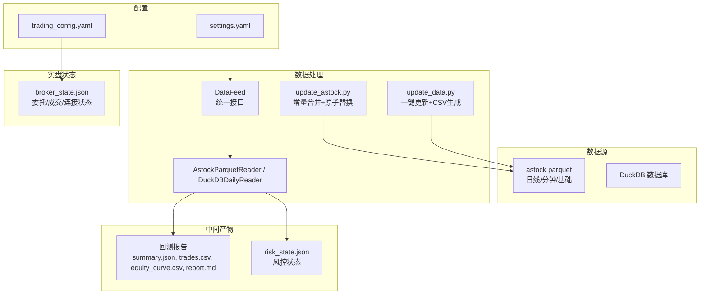
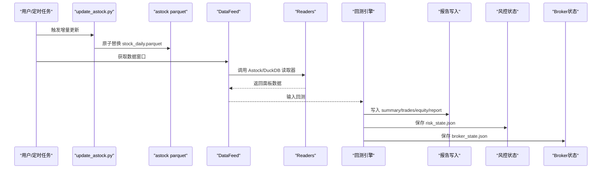
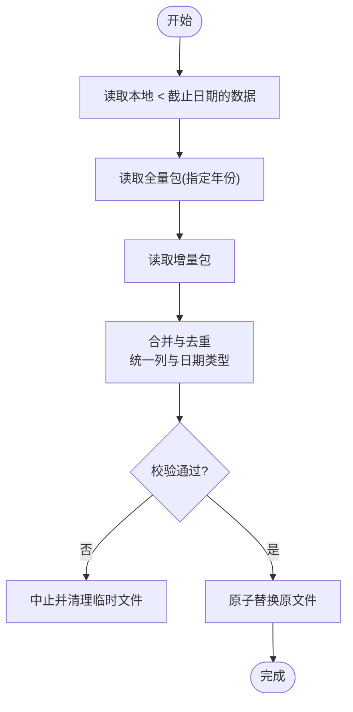
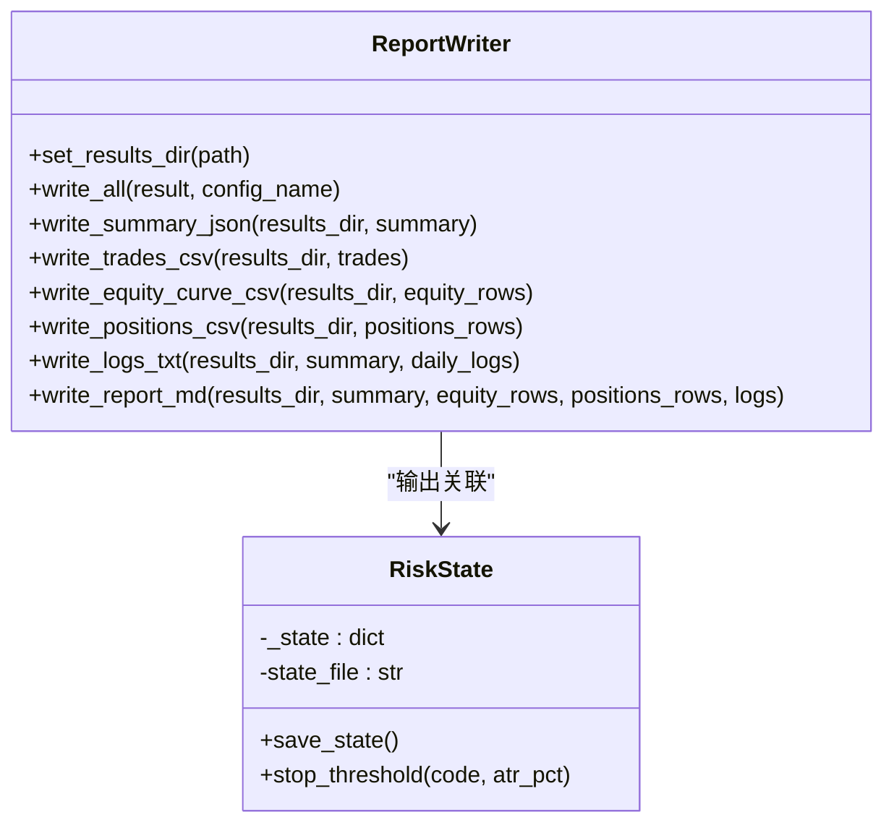
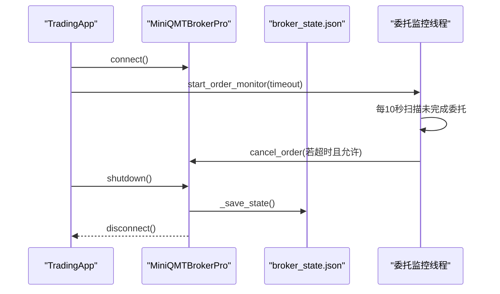
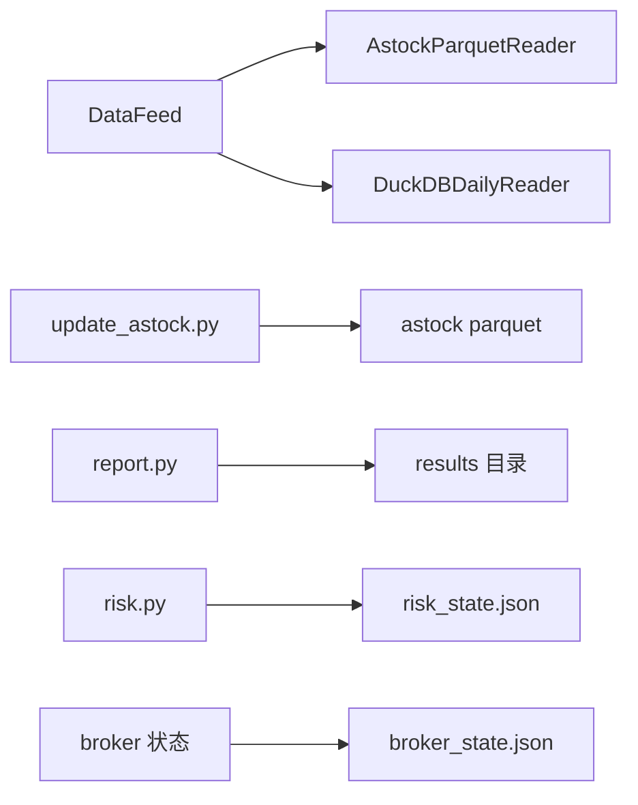
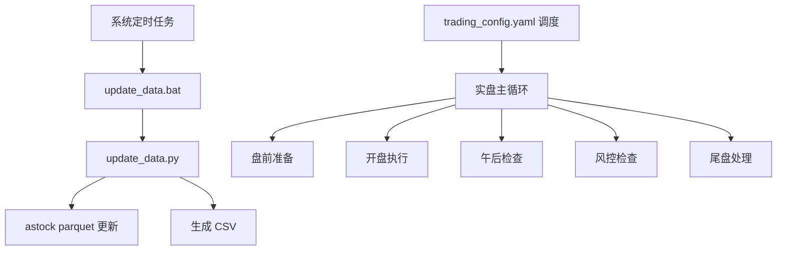

# 数据备份策略

<cite>
**本文引用的文件**   
- [data/astock_reader.py](file://data\astock_reader.py)
- [data/feed.py](file://data\feed.py)
- [data/duckdb_reader.py](file://data\duckdb_reader.py)
- [scripts/update_astock.py](file://scripts\update_astock.py)
- [scripts/update_data.py](file://scripts\update_data.py)
- [scripts/update_data.bat](file://scripts\update_data.bat)
- [config/settings.yaml](file://config\settings.yaml)
- [config/trading_config.yaml](file://config\trading_config.yaml)
- [backtest/report.py](file://backtest\report.py)
- [projects/Project_10_价值小盘V2/strategy/risk.py](file://projects\Project_10_价值小盘V2\strategy\risk.py)
- [projects/Project_10_价值小盘V2/results/risk_state.json](file://projects\Project_10_价值小盘V2\results\risk_state.json)
- [miniQMT实盘对接_生产级完善方案.md](file://miniQMT实盘对接_生产级完善方案.md)
</cite>

## 目录
1. [引言](#引言)
2. [项目结构](#项目结构)
3. [核心组件](#核心组件)
4. [架构总览](#架构总览)
5. [详细组件分析](#详细组件分析)
6. [依赖关系分析](#依赖关系分析)
7. [性能考虑](#性能考虑)
8. [故障排查指南](#故障排查指南)
9. [结论](#结论)
10. [附录](#附录)

## 引言
本文件为 QuantLab 的数据备份策略提供完整说明，覆盖原始数据、中间结果、配置与运行状态的备份与恢复机制。目标是在保证数据一致性与可恢复性的前提下，实现自动化、可验证、低侵入的备份体系，支撑回测、研究与实盘稳定运行。

## 项目结构
围绕备份相关的关键路径与职责：
- 原始数据源
  - astock parquet（日线、分钟线、基础信息）由更新脚本增量合并并原子替换
  - DuckDB 数据库作为统一数据层，读取器具备 WAL 检测与只读保护
- 中间结果
  - 回测报告与交易明细写入固定目录，便于归档与版本化
  - 因子计算结果与策略状态通过 JSON/CSV 落盘
- 配置管理
  - settings.yaml 与 trading_config.yaml 集中管理数据源、回测与实盘参数
- 状态持久化
  - 风控状态、Broker 委托与成交记录、持仓快照等以 JSON 形式保存，支持异常恢复

**图表来源** 
- [scripts/update_astock.py:42-92](file://scripts\update_astock.py#L42-L92)
- [scripts/update_data.py:37-82](file://scripts\update_data.py#L37-L82)
- [data/feed.py:17-40](file://data\feed.py#L17-L40)
- [data/astock_reader.py:25-69](file://data\astock_reader.py#L25-L69)
- [data/duckdb_reader.py:42-68](file://data\duckdb_reader.py#L42-L68)
- [backtest/report.py:245-263](file://backtest\report.py#L245-L263)
- [projects/Project_10_价值小盘V2/strategy/risk.py:56-61](file://projects\Project_10_价值小盘V2\strategy\risk.py#L56-L61)
- [miniQMT实盘对接_生产级完善方案.md:650-686](file://miniQMT实盘对接_生产级完善方案.md#L650-L686)

**章节来源**
- [scripts/update_astock.py:1-219](file://scripts\update_astock.py#L1-L219)
- [scripts/update_data.py:1-135](file://scripts\update_data.py#L1-L135)
- [data/feed.py:1-139](file://data\feed.py#L1-L139)
- [data/astock_reader.py:1-178](file://data\astock_reader.py#L1-L178)
- [data/duckdb_reader.py:39-68](file://data\duckdb_reader.py#L39-L68)
- [backtest/report.py:1-263](file://backtest\report.py#L1-L263)
- [projects/Project_10_价值小盘V2/strategy/risk.py:39-63](file://projects\Project_10_价值小盘V2\strategy\risk.py#L39-L63)
- [miniQMT实盘对接_生产级完善方案.md:650-686](file://miniQMT实盘对接_生产级完善方案.md#L650-L686)

## 核心组件
- 原始数据备份
  - astock parquet 增量更新与原子替换，确保一致性
  - DuckDB 数据库只读访问与 WAL 检测，避免同步中读取不一致
- 中间结果备份
  - 回测产物按 run_id 分目录归档，包含 summary.json、trades.csv、equity_curve.csv、report.md 等
  - 因子与策略状态以 JSON/CSV 落盘，便于复现与审计
- 配置备份
  - settings.yaml、trading_config.yaml 纳入版本控制，变更留痕
- 状态备份
  - 风控状态 risk_state.json 定期保存
  - Broker 委托、成交、连接状态 broker_state.json 在退出或关键节点保存

**章节来源**
- [scripts/update_astock.py:42-92](file://scripts\update_astock.py#L42-L92)
- [data/duckdb_reader.py:54-68](file://data\duckdb_reader.py#L54-L68)
- [backtest/report.py:245-263](file://backtest\report.py#L245-L263)
- [projects/Project_10_价值小盘V2/strategy/risk.py:56-61](file://projects\Project_10_价值小盘V2\strategy\risk.py#L56-L61)
- [miniQMT实盘对接_生产级完善方案.md:650-686](file://miniQMT实盘对接_生产级完善方案.md#L650-L686)

## 架构总览
下图展示从数据更新到回测与状态持久化的整体流程，以及备份落点。

**图表来源** 
- [scripts/update_astock.py:42-92](file://scripts\update_astock.py#L42-L92)
- [data/feed.py:17-40](file://data\feed.py#L17-L40)
- [data/astock_reader.py:71-92](file://data\astock_reader.py#L71-L92)
- [data/duckdb_reader.py:42-68](file://data\duckdb_reader.py#L42-L68)
- [backtest/report.py:245-263](file://backtest\report.py#L245-L263)
- [projects/Project_10_价值小盘V2/strategy/risk.py:56-61](file://projects\Project_10_价值小盘V2\strategy\risk.py#L56-L61)
- [miniQMT实盘对接_生产级完善方案.md:650-686](file://miniQMT实盘对接_生产级完善方案.md#L650-L686)

## 详细组件分析

### 原始数据备份：astock parquet 与 DuckDB
- astock parquet 增量更新
  - 使用临时文件 + os.replace 原子替换，避免部分写入导致损坏
  - 对 daily/minute/basic 分别处理，去重与排序保证一致性
- DuckDB 只读与 WAL 检测
  - 打开只读连接，记录 mtime，检测 .wal 文件并发出警告
  - 建议在数据同步完成后进行回测或导出

**图表来源** 
- [scripts/update_astock.py:52-92](file://scripts\update_astock.py#L52-L92)
- [scripts/update_astock.py:95-119](file://scripts\update_astock.py#L95-L119)
- [scripts/update_astock.py:181-199](file://scripts\update_astock.py#L181-L199)
- [data/duckdb_reader.py:54-68](file://data\duckdb_reader.py#L54-L68)

**章节来源**
- [scripts/update_astock.py:1-219](file://scripts\update_astock.py#L1-L219)
- [data/duckdb_reader.py:39-68](file://data\duckdb_reader.py#L39-L68)

### 中间结果备份：因子计算、回测数据与策略状态
- 回测报告
  - 统一写入 results_dir，包含 summary.json、trades.csv、equity_curve.csv、positions.csv、logs.txt、report.md
  - 每次运行生成独立目录，便于版本管理与回溯
- 因子与策略状态
  - risk_state.json 保存 holdings、nav_peak、禁入列表、回撤分层等
  - 定期调用 save_state() 落盘，异常重启后可恢复

**图表来源** 
- [backtest/report.py:245-263](file://backtest\report.py#L245-L263)
- [projects/Project_10_价值小盘V2/strategy/risk.py:39-63](file://projects\Project_10_价值小盘V2\strategy\risk.py#L39-L63)

**章节来源**
- [backtest/report.py:1-263](file://backtest\report.py#L1-L263)
- [projects/Project_10_价值小盘V2/strategy/risk.py:39-63](file://projects\Project_10_价值小盘V2\strategy\risk.py#L39-L63)
- [projects/Project_10_价值小盘V2/results/risk_state.json:1-773](file://projects\Project_10_价值小盘V2\results\risk_state.json#L1-L773)

### 配置备份：settings.yaml 与 trading_config.yaml
- 全局配置
  - settings.yaml 定义数据源路径、缓存、回测参数、日志与策略默认值
- 实盘配置
  - trading_config.yaml 定义账户、交易参数、风控阈值、订单超时、调度时间与通知
- 版本管理建议
  - 将配置文件纳入 Git，配合变更说明；生产环境使用只读副本，避免误改

**章节来源**
- [config/settings.yaml:1-69](file://config\settings.yaml#L1-L69)
- [config/trading_config.yaml:1-62](file://config\trading_config.yaml#L1-L62)

### 状态备份：运行状态、持仓、订单与委托监控
- 风控状态
  - risk_state.json 持久化持仓入场价、净值峰值、禁入列表与回撤分层
- Broker 状态
  - broker_state.json 保存连接状态、未完成委托、最近成交记录
  - 优雅退出时自动保存，支持崩溃恢复
- 委托监控
  - 后台线程检查超时未成交委托，按配置自动撤单并记录

**图表来源** 
- [miniQMT实盘对接_生产级完善方案.md:1131-1344](file://miniQMT实盘对接_生产级完善方案.md#L1131-L1344)
- [miniQMT实盘对接_生产级完善方案.md:650-686](file://miniQMT实盘对接_生产级完善方案.md#L650-L686)

**章节来源**
- [miniQMT实盘对接_生产级完善方案.md:1131-1344](file://miniQMT实盘对接_生产级完善方案.md#L1131-L1344)
- [miniQMT实盘对接_生产级完善方案.md:650-686](file://miniQMT实盘对接_生产级完善方案.md#L650-L686)

## 依赖关系分析
- DataFeed 根据 source 选择 AstockParquetReader 或 DuckDBDailyReader
- update_astock.py 直接操作 astock parquet 文件，不依赖 DataFeed
- backtest/report.py 仅负责序列化结果，不依赖外部交易系统
- risk.py 与 broker 状态文件相互独立，通过 JSON 持久化

**图表来源** 
- [data/feed.py:17-40](file://data\feed.py#L17-L40)
- [data/astock_reader.py:25-69](file://data\astock_reader.py#L25-L69)
- [data/duckdb_reader.py:42-68](file://data\duckdb_reader.py#L42-L68)
- [scripts/update_astock.py:42-92](file://scripts\update_astock.py#L42-L92)
- [backtest/report.py:245-263](file://backtest\report.py#L245-L263)
- [projects/Project_10_价值小盘V2/strategy/risk.py:56-61](file://projects\Project_10_价值小盘V2\strategy\risk.py#L56-L61)
- [miniQMT实盘对接_生产级完善方案.md:650-686](file://miniQMT实盘对接_生产级完善方案.md#L650-L686)

**章节来源**
- [data/feed.py:1-139](file://data\feed.py#L1-L139)
- [scripts/update_astock.py:1-219](file://scripts\update_astock.py#L1-L219)
- [backtest/report.py:1-263](file://backtest\report.py#L1-L263)
- [projects/Project_10_价值小盘V2/strategy/risk.py:39-63](file://projects\Project_10_价值小盘V2\strategy\risk.py#L39-L63)
- [miniQMT实盘对接_生产级完善方案.md:650-686](file://miniQMT实盘对接_生产级完善方案.md#L650-L686)

## 性能考虑
- 增量更新
  - 使用 filters 与 MultiIndex 加速查询，减少内存占用
  - 逐 code 并行处理分钟线，提升吞吐
- 只读与 WAL
  - DuckDB 只读连接避免锁竞争；WAL 存在时提示等待同步完成
- 原子写入
  - 临时文件 + os.replace 避免部分写入导致的损坏与回滚成本
- 报告写入
  - 批量写入 CSV/JSON，减少 I/O 次数

[本节为通用指导，不直接分析具体文件]

## 故障排查指南
- 数据更新失败
  - 检查增量包路径与文件名是否正确
  - 查看 dry-run 输出确认合并逻辑
  - 确认磁盘空间与权限
- DuckDB 同步冲突
  - 检测到 .wal 文件时暂停回测，等待同步完成
  - 核对 mtime 与数据范围是否一致
- 回测产物缺失
  - 确认 results_dir 是否存在与写入权限
  - 检查 write_all 调用链是否执行
- 状态恢复异常
  - 校验 JSON 文件格式与字段完整性
  - 启动时加载状态并打印时间戳，确认上次保存成功

**章节来源**
- [scripts/update_astock.py:151-178](file://scripts\update_astock.py#L151-L178)
- [data/duckdb_reader.py:54-68](file://data\duckdb_reader.py#L54-L68)
- [backtest/report.py:245-263](file://backtest\report.py#L245-L263)
- [miniQMT实盘对接_生产级完善方案.md:650-686](file://miniQMT实盘对接_生产级完善方案.md#L650-L686)

## 结论
通过增量更新与原子替换保障原始数据一致性，结合只读与 WAL 检测降低并发风险；回测与策略状态以结构化文件落盘，便于版本管理与恢复；Broker 状态在关键节点持久化，支持崩溃恢复。建议将配置与关键产出纳入版本控制，并通过定时任务与完整性校验形成闭环备份体系。

[本节为总结性内容，不直接分析具体文件]

## 附录

### 备份自动化脚本与定时任务
- 数据更新
  - scripts/update_astock.py：增量合并 daily/minute/basic，原子替换
  - scripts/update_data.py：一键更新 astock parquet 并生成 CSV
  - scripts/update_data.bat：Windows 批处理入口
- 实盘调度
  - trading_config.yaml 中的 schedule 字段定义盘前、开盘、午后、风控与尾盘任务
  - 主程序通过 schedule 库注册任务，周期性执行

**图表来源** 
- [scripts/update_data.bat:1-15](file://scripts\update_data.bat#L1-L15)
- [scripts/update_data.py:117-135](file://scripts\update_data.py#L117-L135)
- [config/trading_config.yaml:30-35](file://config\trading_config.yaml#L30-L35)
- [miniQMT实盘对接_生产级完善方案.md:1225-1260](file://miniQMT实盘对接_生产级完善方案.md#L1225-L1260)

**章节来源**
- [scripts/update_data.bat:1-15](file://scripts\update_data.bat#L1-L15)
- [scripts/update_data.py:1-135](file://scripts\update_data.py#L1-L135)
- [config/trading_config.yaml:1-62](file://config\trading_config.yaml#L1-L62)
- [miniQMT实盘对接_生产级完善方案.md:1225-1260](file://miniQMT实盘对接_生产级完善方案.md#L1225-L1260)

### 备份验证与完整性检查
- 数据完整性
  - 对比更新前后最新交易日与行数，确认增量有效
  - 校验 parquet 索引与列名一致性
- 报告完整性
  - 检查 summary.json 是否存在且字段完整
  - 校验 trades.csv、equity_curve.csv 列顺序与行数
- 状态一致性
  - 校验 risk_state.json 与 broker_state.json 的时间戳
  - 启动时加载状态并比对上次保存时间

[本节为通用指导，不直接分析具体文件]