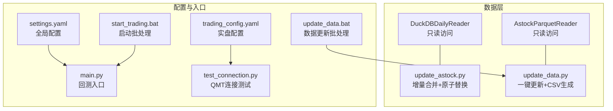
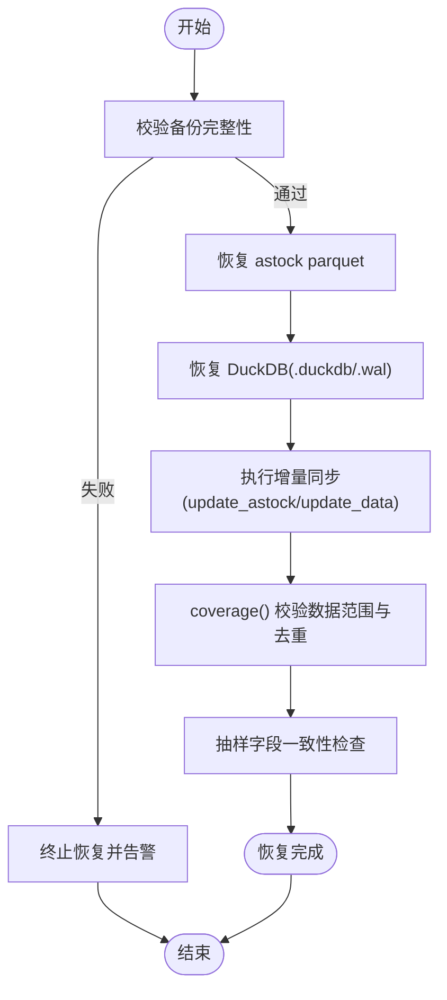
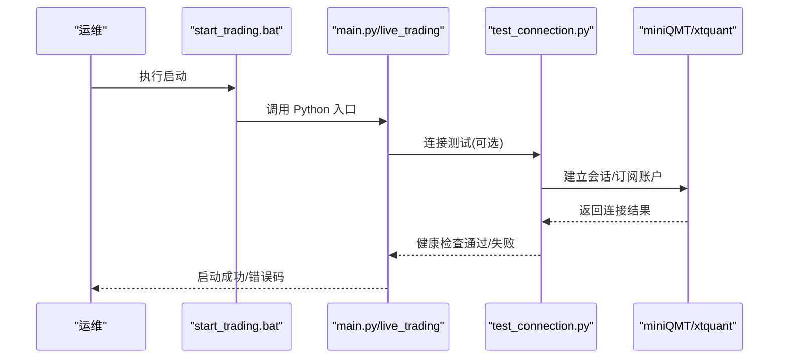
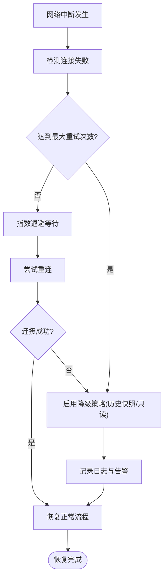
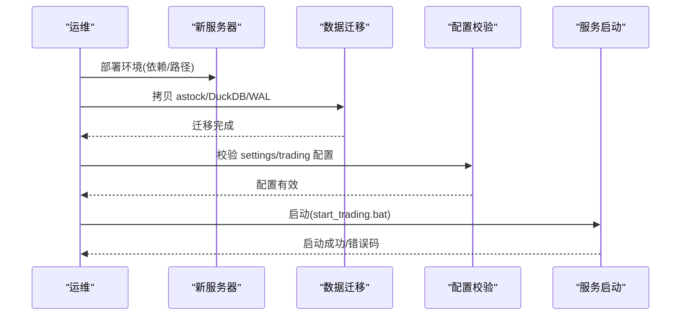
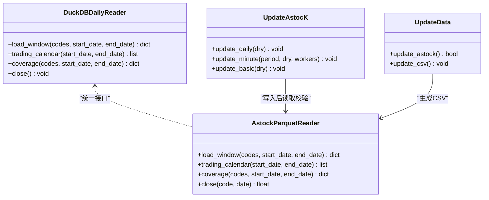

# 灾难恢复流程

<cite>
**本文引用的文件**   
- [data/duckdb_reader.py](file://data\duckdb_reader.py)
- [data/astock_reader.py](file://data\astock_reader.py)
- [scripts/update_astock.py](file://scripts\update_astock.py)
- [scripts/update_data.py](file://scripts\update_data.py)
- [config/settings.yaml](file://config\settings.yaml)
- [config/trading_config.yaml](file://config\trading_config.yaml)
- [main.py](file://main.py)
- [test_connection.py](file://test_connection.py)
- [start_trading.bat](file://start_trading.bat)
- [scripts/update_data.bat](file://scripts\update_data.bat)
</cite>

## 目录
1. [引言](#引言)
2. [项目结构](#项目结构)
3. [核心组件](#核心组件)
4. [架构总览](#架构总览)
5. [详细组件分析](#详细组件分析)
6. [依赖关系分析](#依赖关系分析)
7. [性能考虑](#性能考虑)
8. [故障排查指南](#故障排查指南)
9. [结论](#结论)
10. [附录](#附录)

## 引言
本文件为 QuantLab 制定全面的灾难恢复（DR）流程，覆盖数据丢失恢复、系统崩溃恢复、网络中断恢复与硬件故障恢复四大场景。文档明确 RTO/RPO 目标，给出可操作的恢复步骤、验证方法与演练流程，确保在极端情况下能快速恢复交易与回测能力，保障数据一致性与业务连续性。

## 项目结构
QuantLab 的数据层由两类读取器组成：DuckDB 只读读取器与 astock Parquet 读取器；数据更新通过脚本完成；运行入口与配置分别由主程序与 YAML 配置管理。关键路径如下：
- 数据读取：DuckDBDailyReader、AstockParquetReader
- 数据更新：update_astock.py、update_data.py
- 配置：settings.yaml、trading_config.yaml
- 启动与测试：main.py、test_connection.py、start_trading.bat、update_data.bat



图表来源
- [data/duckdb_reader.py:1-215](file://data\duckdb_reader.py#L1-L215)
- [data/astock_reader.py:1-192](file://data\astock_reader.py#L1-L192)
- [scripts/update_astock.py:1-219](file://scripts\update_astock.py#L1-L219)
- [scripts/update_data.py:1-135](file://scripts\update_data.py#L1-L135)
- [config/settings.yaml:1-69](file://config\settings.yaml#L1-L69)
- [config/trading_config.yaml:1-62](file://config\trading_config.yaml#L1-L62)
- [main.py:1-104](file://main.py#L1-L104)
- [test_connection.py:1-117](file://test_connection.py#L1-L117)
- [start_trading.bat:1-51](file://start_trading.bat#L1-L51)
- [scripts/update_data.bat:1-15](file://scripts\update_data.bat#L1-L15)

章节来源
- [config/settings.yaml:1-69](file://config\settings.yaml#L1-L69)
- [config/trading_config.yaml:1-62](file://config\trading_config.yaml#L1-L62)
- [main.py:1-104](file://main.py#L1-L104)

## 核心组件
- DuckDBDailyReader：只读访问 DuckDB 数据库，支持多 schema 切换、WAL 检测、覆盖率统计与窗口加载。
- AstockParquetReader：只读访问 astock Parquet 文件，提供与 DuckDB 一致的接口，支持复权计算与日期过滤。
- update_astock.py：按日/分钟/基础信息三类数据执行增量合并，采用临时文件+原子替换保证一致性。
- update_data.py：一键更新 astock parquet 并重新生成 CSV，用于下游快速消费。
- settings.yaml / trading_config.yaml：集中管理数据源、缓存、回测参数、实盘风控与订单策略等。
- main.py：回测入口，加载配置并驱动数据与策略模块。
- test_connection.py：检查 xtquant 库、QMT 路径、会话与账户连通性。
- start_trading.bat / update_data.bat：启动与数据更新的批处理封装。

章节来源
- [data/duckdb_reader.py:1-215](file://data\duckdb_reader.py#L1-L215)
- [data/astock_reader.py:1-192](file://data\astock_reader.py#L1-L192)
- [scripts/update_astock.py:1-219](file://scripts\update_astock.py#L1-L219)
- [scripts/update_data.py:1-135](file://scripts\update_data.py#L1-L135)
- [config/settings.yaml:1-69](file://config\settings.yaml#L1-L69)
- [config/trading_config.yaml:1-62](file://config\trading_config.yaml#L1-L62)
- [main.py:1-104](file://main.py#L1-L104)
- [test_connection.py:1-117](file://test_connection.py#L1-L117)
- [start_trading.bat:1-51](file://start_trading.bat#L1-L51)
- [scripts/update_data.bat:1-15](file://scripts\update_data.bat#L1-L15)

## 架构总览
灾难恢复涉及“数据层—配置层—运行层”的协同。下图展示在恢复过程中各组件的职责与交互。

```mermaid
sequenceDiagram
participant Ops as "运维/值班人员"
participant DR as "恢复流程(本文)"
participant Data as "数据层(DuckDB/Parquet)"
Cfg as "配置(settings/trading)"
Run as "运行(main/start)"
QMT as "外部依赖(QMT/xtquant)"
Ops->>DR : 触发恢复(数据丢失/崩溃/断网/硬件故障)
DR->>Data : 校验备份完整性与一致性
DR->>Cfg : 校验配置文件与路径有效性
DR->>Run : 启动服务/进程
Run->>QMT : 连接与心跳检测
QMT-->>Run : 返回连接状态
Run-->>DR : 健康检查结果
DR-->>Ops : 输出恢复报告与RTO/RPO达成情况
```

图表来源
- [data/duckdb_reader.py:1-215](file://data\duckdb_reader.py#L1-L215)
- [data/astock_reader.py:1-192](file://data\astock_reader.py#L1-L192)
- [config/settings.yaml:1-69](file://config\settings.yaml#L1-L69)
- [config/trading_config.yaml:1-62](file://config\trading_config.yaml#L1-L62)
- [main.py:1-104](file://main.py#L1-L104)
- [test_connection.py:1-117](file://test_connection.py#L1-L117)

## 详细组件分析

### 数据丢失恢复流程
目标：从备份恢复 astock 数据、重建 DuckDB 数据库、执行增量同步，确保数据一致性与可用性。

- 备份与校验
  - 备份对象：astock daily parquet、minute 数据、basic 基础信息、DuckDB 数据库文件及 WAL。
  - 校验方法：核对文件大小、哈希值、元数据时间戳；对 DuckDB 使用 coverage() 获取 min_date/max_date/n_codes 等指标进行比对。
- 恢复步骤
  - 恢复 astock parquet：将备份中的 stock_daily.parquet 还原至 E:/astock/daily/stock_daily.parquet。
  - 恢复 DuckDB：还原 quantifydata.duckdb 及其 .wal（若存在），确认 read_only 模式打开成功。
  - 增量同步：运行 update_astock.py 或 update_data.py，基于“行情数据更新池”的增量包进行合并，使用原子替换避免中间态污染。
- 验证
  - 使用 readers.coverage() 对比恢复前后数据范围与去重计数。
  - 抽样查询 OHLCV 字段一致性，确保 date/open/high/low/close/vol/amount 对齐。
  - 对 astock 复权逻辑进行回归验证（raw/qfq/hfq）。



图表来源
- [data/astock_reader.py:128-161](file://data\astock_reader.py#L128-L161)
- [data/duckdb_reader.py:146-205](file://data\duckdb_reader.py#L146-L205)
- [scripts/update_astock.py:42-92](file://scripts\update_astock.py#L42-L92)
- [scripts/update_data.py:37-82](file://scripts\update_data.py#L37-L82)

章节来源
- [data/astock_reader.py:128-161](file://data\astock_reader.py#L128-L161)
- [data/duckdb_reader.py:146-205](file://data\duckdb_reader.py#L146-L205)
- [scripts/update_astock.py:42-92](file://scripts\update_astock.py#L42-L92)
- [scripts/update_data.py:37-82](file://scripts\update_data.py#L37-L82)

### 系统崩溃恢复步骤
目标：进程重启、依赖服务检查、配置文件验证，确保系统快速恢复运行。

- 进程重启
  - 使用 start_trading.bat 启动实盘；如异常退出，记录错误码并定位日志。
  - 回测模式通过 main.py 启动，检查 Python 环境与 PATH。
- 依赖服务检查
  - 使用 test_connection.py 检查 xtquant 库、QMT 路径、会话与账户连通性。
  - 确认 miniQMT 进程是否运行（批处理中已包含进程检测）。
- 配置文件验证
  - 校验 settings.yaml 与 trading_config.yaml 是否存在且格式正确。
  - 校验 data.source、astock_path、cache_dir、account.path 等关键路径有效。



图表来源
- [start_trading.bat:1-51](file://start_trading.bat#L1-L51)
- [main.py:1-104](file://main.py#L1-L104)
- [test_connection.py:1-117](file://test_connection.py#L1-L117)

章节来源
- [start_trading.bat:1-51](file://start_trading.bat#L1-L51)
- [main.py:1-104](file://main.py#L1-L104)
- [test_connection.py:1-117](file://test_connection.py#L1-L117)
- [config/settings.yaml:1-69](file://config\settings.yaml#L1-L69)
- [config/trading_config.yaml:1-62](file://config\trading_config.yaml#L1-L62)

### 网络中断恢复机制
目标：数据源连接重试、超时处理、降级策略，确保在网络不稳定时仍能维持最小可用能力。

- 连接重试与超时
  - 参考 trading_config.yaml 中 order.timeout_seconds 与 max_retry，结合 test_connection.py 的连接流程实现指数退避重试。
  - 对 DuckDB/Parquet 读取设置 I/O 超时与重试次数，避免阻塞。
- 降级策略
  - 当实时数据源不可用时，切换到历史快照（astock parquet 或 DuckDB 最近备份）。
  - 关闭非关键功能（如通知 webhook），优先保证数据读取与回测能力。
- 监控与告警
  - 在连接失败时记录错误码与堆栈，输出到 logs 目录，便于后续分析。



[本图为概念流程图，不直接映射具体代码文件]

### 硬件故障恢复方案
目标：服务器迁移、数据迁移、服务切换，确保在硬件故障时快速恢复业务。

- 服务器迁移
  - 准备新服务器，安装 Python 与依赖，复制项目根目录与配置文件。
  - 校验 Python 版本与 PATH，确保 xtquant 库可用。
- 数据迁移
  - 迁移 astock parquet、DuckDB 文件与 WAL 到目标路径，保持路径与 settings.yaml/trading_config.yaml 一致。
  - 运行 update_astock.py 或 update_data.py 进行增量补齐。
- 服务切换
  - 在新服务器上执行 start_trading.bat 启动服务，使用 test_connection.py 验证连接。
  - 切换 DNS/路由（如涉及外部数据源），更新缓存目录与日志目录权限。



[本图为概念流程图，不直接映射具体代码文件]

## 依赖关系分析
- 数据读取器之间通过统一的 duck-typed 接口解耦，上层无需关心底层是 DuckDB 还是 Parquet。
- 更新脚本独立于读取器，负责数据合并与原子替换，降低恢复过程中的不一致风险。
- 配置集中管理，启动脚本与测试脚本依赖配置路径与内容。



图表来源
- [data/duckdb_reader.py:35-58](file://data\duckdb_reader.py#L35-L58)
- [data/astock_reader.py:25-69](file://data\astock_reader.py#L25-L69)
- [scripts/update_astock.py:52-92](file://scripts\update_astock.py#L52-L92)
- [scripts/update_data.py:37-82](file://scripts\update_data.py#L37-L82)

章节来源
- [data/duckdb_reader.py:35-58](file://data\duckdb_reader.py#L35-L58)
- [data/astock_reader.py:25-69](file://data\astock_reader.py#L25-L69)
- [scripts/update_astock.py:52-92](file://scripts\update_astock.py#L52-L92)
- [scripts/update_data.py:37-82](file://scripts\update_data.py#L37-L82)

## 性能考虑
- 读取优化：astock Parquet 仅读取必要列，减少内存占用；DuckDB 使用只读连接与覆盖缓存。
- 增量合并：update_astock.py 按 code 拆分增量包，并行处理提升效率；原子替换避免锁竞争。
- 缓存策略：settings.yaml 中 cache.enabled 与 expire_days 控制缓存生命周期，降低重复 I/O。
- 日志轮转：logging.max_file_size 与 backup_count 控制日志大小，避免磁盘占满。

章节来源
- [data/astock_reader.py:47-69](file://data\astock_reader.py#L47-L69)
- [data/duckdb_reader.py:54-58](file://data\duckdb_reader.py#L54-L58)
- [scripts/update_astock.py:121-178](file://scripts\update_astock.py#L121-L178)
- [config/settings.yaml:16-19](file://config\settings.yaml#L16-L19)
- [config/settings.yaml:31-35](file://config\settings.yaml#L31-L35)

## 故障排查指南
- 常见错误
  - DuckDB WAL 警告：检测到 .wal 文件表示上游同步进行中，需等待同步完成后重跑。
  - astock parquet 缺失列：trade_date/ts_code 不存在导致索引构建失败，需检查数据源格式。
  - QMT 连接失败：检查 xtquant 库安装、QMT 路径、会话 ID 与账号登录状态。
- 排查步骤
  - 使用 coverage() 检查数据范围与去重计数，定位数据缺失或重复。
  - 查看 logs 目录下的错误日志，定位异常堆栈与错误码。
  - 运行 test_connection.py 逐步验证依赖服务连通性。

章节来源
- [data/duckdb_reader.py:63-75](file://data\duckdb_reader.py#L63-L75)
- [data/astock_reader.py:60-66](file://data\astock_reader.py#L60-L66)
- [test_connection.py:18-51](file://test_connection.py#L18-L51)

## 结论
通过明确的恢复流程、严格的配置校验与健壮的读取/更新机制，QuantLab 能够在数据丢失、系统崩溃、网络中断与硬件故障等场景下快速恢复。建议定期执行恢复演练，持续优化 RTO/RPO 指标，确保业务连续性与数据一致性。

## 附录

### RTO/RPO 定义与目标
- RTO（恢复时间目标）：从故障发生到系统恢复可用的最长时间。建议：
  - 数据恢复：≤ 2 小时（含备份校验与增量同步）
  - 服务启动：≤ 15 分钟（含依赖检查与配置验证）
- RPO（恢复点目标）：允许丢失数据的最大时间窗口。建议：
  - astock parquet：≤ 1 天（基于每日增量包）
  - DuckDB：≤ 1 小时（基于 WAL 与频繁备份）

### 恢复演练流程
- 演练前准备
  - 准备隔离环境，复制备份数据与配置文件。
  - 明确演练目标与验收标准（RTO/RPO 达标、数据一致性验证通过）。
- 演练步骤
  - 模拟数据丢失：删除 astock parquet 或 DuckDB 文件。
  - 执行恢复：按本文“数据丢失恢复流程”操作，记录耗时与问题。
  - 服务恢复：启动 start_trading.bat，运行 test_connection.py 验证连接。
  - 数据验证：使用 coverage() 与抽样查询验证数据一致性。
- 演练总结
  - 输出演练报告，包括 RTO/RPO 达成情况、问题清单与改进措施。
  - 更新恢复手册与自动化脚本，提升恢复效率。

[本节为概念性内容，不直接分析具体文件]