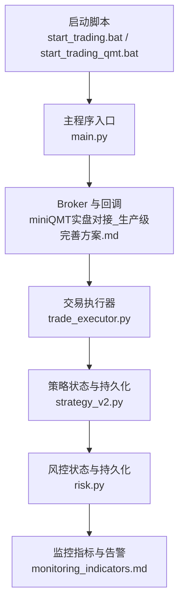
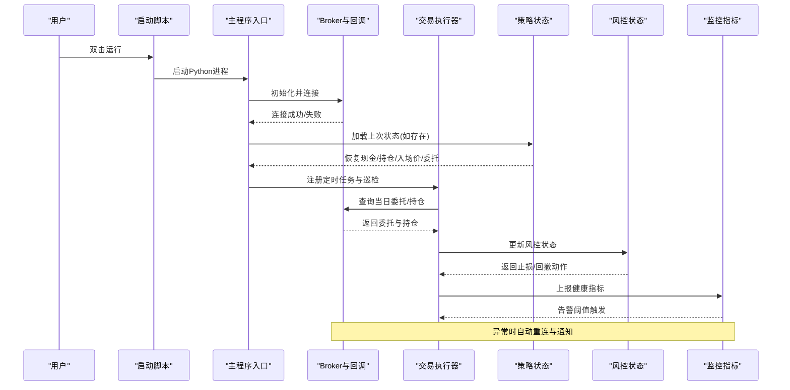
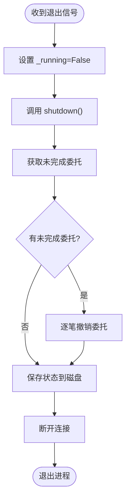
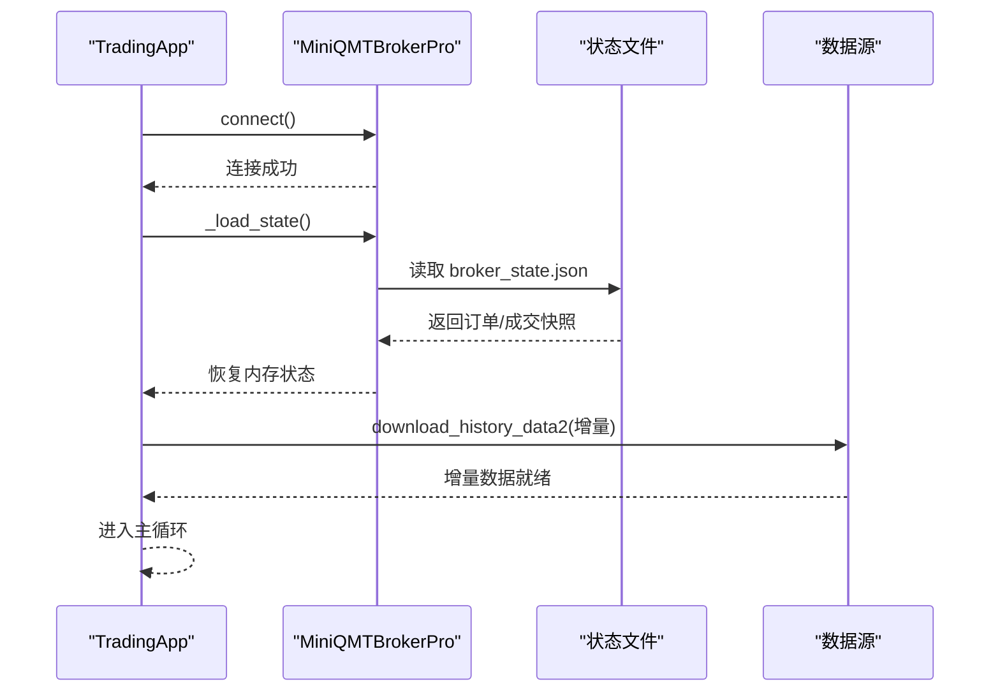
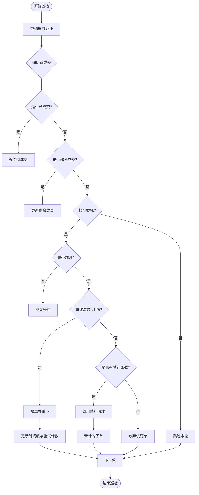
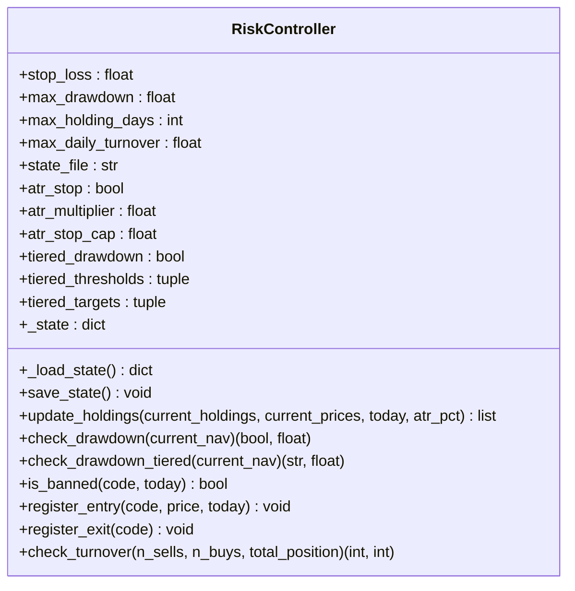
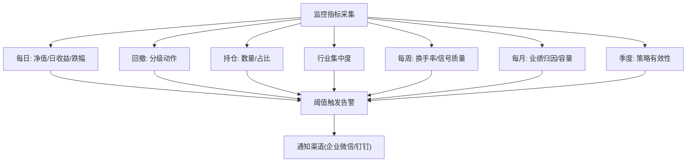
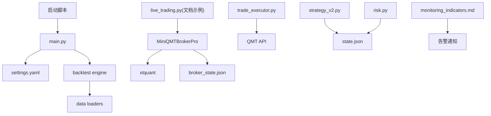

# 策略重启机制

<cite>
**本文引用的文件**   
- [main.py](file://main.py)
- [start_trading.bat](file://start_trading.bat)
- [start_trading_qmt.bat](file://start_trading_qmt.bat)
- [miniQMT实盘对接_生产级完善方案.md](file://miniQMT实盘对接_生产级完善方案.md)
- [trade_executor.py](file://projects/Project_10_价值小盘V2/trade_executor.py)
- [strategy_v2.py](file://projects/Project_10_价值小盘V2/strategy_v2.py)
- [risk.py](file://projects/Project_10_价值小盘V2/strategy/risk.py)
- [monitoring_indicators.md](file://projects/verification/results/monitoring_indicators.md)
- [engine_tests.py](file://projects/verification/engine_tests.py)
</cite>

## 目录
1. [引言](#引言)
2. [项目结构](#项目结构)
3. [核心组件](#核心组件)
4. [架构总览](#架构总览)
5. [详细组件分析](#详细组件分析)
6. [依赖关系分析](#依赖关系分析)
7. [性能考量](#性能考量)
8. [故障排查指南](#故障排查指南)
9. [结论](#结论)
10. [附录](#附录)

## 引言
本文件为 QuantLab 的策略重启机制提供完整说明，覆盖以下目标：
- 优雅重启流程：当前交易完成后安全退出、状态保存、资源清理
- 快速重启机制：内存状态恢复、连接重建、增量数据加载
- 断点续跑功能：执行位置记录、未完成订单处理、数据一致性保证
- 状态恢复机制：持仓状态恢复、资金状态恢复、风控状态恢复
- 重启监控与告警：确保系统稳定性与可观测性

## 项目结构
QuantLab 的实盘与回测入口、Broker 层、交易执行模块、风控模块以及监控指标定义共同构成重启机制的基础设施。关键路径包括：
- 启动脚本：start_trading.bat / start_trading_qmt.bat
- 主程序入口（回测）：main.py
- Broker 与回调：miniQMT实盘对接_生产级完善方案.md
- 交易执行器：trade_executor.py
- 策略状态与持久化：strategy_v2.py
- 风控状态与持久化：risk.py
- 监控指标：monitoring_indicators.md

**图表来源** 
- [start_trading.bat:1-51](file://start_trading.bat#L1-L51)
- [start_trading_qmt.bat:1-66](file://start_trading_qmt.bat#L1-L66)
- [main.py:1-104](file://main.py#L1-L104)
- [miniQMT实盘对接_生产级完善方案.md:73-756](file://miniQMT实盘对接_生产级完善方案.md#L73-L756)
- [trade_executor.py:1-295](file://projects/Project_10_价值小盘V2/trade_executor.py#L1-L295)
- [strategy_v2.py:378-449](file://projects/Project_10_价值小盘V2/strategy_v2.py#L378-L449)
- [risk.py:1-195](file://projects/Project_10_价值小盘V2/strategy/risk.py#L1-L195)
- [monitoring_indicators.md:1-69](file://projects/verification/results/monitoring_indicators.md#L1-L69)

**章节来源**
- [start_trading.bat:1-51](file://start_trading.bat#L1-L51)
- [start_trading_qmt.bat:1-66](file://start_trading_qmt.bat#L1-L66)
- [main.py:1-104](file://main.py#L1-L104)

## 核心组件
- Broker 与回调：负责连接管理、委托追踪、成交回报、断线重连、状态持久化与通知
- 交易执行器：统一下单、反查委托、超时撤单重下、重试与替补逻辑
- 策略状态：现金、持仓、入场价、今日委托、暂停卖出等状态的持久化与恢复
- 风控状态：止损阈值、回撤分层、禁入列表、换手限制的状态持久化
- 监控指标：净值、回撤、持仓集中度、行业集中度、换手率、信号质量等

**章节来源**
- [miniQMT实盘对接_生产级完善方案.md:73-756](file://miniQMT实盘对接_生产级完善方案.md#L73-L756)
- [trade_executor.py:1-295](file://projects/Project_10_价值小盘V2/trade_executor.py#L1-L295)
- [strategy_v2.py:378-449](file://projects/Project_10_价值小盘V2/strategy_v2.py#L378-L449)
- [risk.py:1-195](file://projects/Project_10_价值小盘V2/strategy/risk.py#L1-L195)
- [monitoring_indicators.md:1-69](file://projects/verification/results/monitoring_indicators.md#L1-L69)

## 架构总览
下图展示从启动到重启恢复的关键流程，涵盖信号处理、状态保存、连接重建、委托恢复与对账。

**图表来源** 
- [start_trading.bat:1-51](file://start_trading.bat#L1-L51)
- [start_trading_qmt.bat:1-66](file://start_trading_qmt.bat#L1-L66)
- [main.py:1-104](file://main.py#L1-L104)
- [miniQMT实盘对接_生产级完善方案.md:73-756](file://miniQMT实盘对接_生产级完善方案.md#L73-L756)
- [trade_executor.py:1-295](file://projects/Project_10_价值小盘V2/trade_executor.py#L1-L295)
- [strategy_v2.py:378-449](file://projects/Project_10_价值小盘V2/strategy_v2.py#L378-L449)
- [risk.py:1-195](file://projects/Project_10_价值小盘V2/strategy/risk.py#L1-L195)
- [monitoring_indicators.md:1-69](file://projects/verification/results/monitoring_indicators.md#L1-L69)

## 详细组件分析

### 优雅重启流程
- 信号处理：捕获 SIGINT/SIGTERM，设置退出标志并调用 shutdown()
- 未完成订单处理：获取 pending 订单并逐一撤销
- 状态保存：将订单、成交记录、连接状态写入 data/broker_state.json
- 资源清理：停止 xttrader、断开连接、释放锁与线程

**图表来源** 
- [miniQMT实盘对接_生产级完善方案.md:1131-1344](file://miniQMT实盘对接_生产级完善方案.md#L1131-L1344)
- [miniQMT实盘对接_生产级完善方案.md:650-686](file://miniQMT实盘对接_生产级完善方案.md#L650-L686)

**章节来源**
- [miniQMT实盘对接_生产级完善方案.md:1131-1344](file://miniQMT实盘对接_生产级完善方案.md#L1131-L1344)
- [miniQMT实盘对接_生产级完善方案.md:650-686](file://miniQMT实盘对接_生产级完善方案.md#L650-L686)

### 快速重启机制
- 内存状态恢复：从 data/broker_state.json 或 strategy 状态文件恢复现金、持仓、入场价、今日委托、暂停卖出等
- 连接重建：Broker.connect() 重新建立 xttrader 与账户订阅
- 增量数据加载：通过 download_history_data2 拉取缺失历史数据，避免全量重复下载

**图表来源** 
- [miniQMT实盘对接_生产级完善方案.md:236-288](file://miniQMT实盘对接_生产级完善方案.md#L236-L288)
- [miniQMT实盘对接_生产级完善方案.md:678-686](file://miniQMT实盘对接_生产级完善方案.md#L678-L686)
- [miniQMT实盘对接_生产级完善方案.md:738-746](file://miniQMT实盘对接_生产级完善方案.md#L738-L746)
- [strategy_v2.py:396-427](file://projects/Project_10_价值小盘V2/strategy_v2.py#L396-L427)

**章节来源**
- [miniQMT实盘对接_生产级完善方案.md:236-288](file://miniQMT实盘对接_生产级完善方案.md#L236-L288)
- [miniQMT实盘对接_生产级完善方案.md:678-686](file://miniQMT实盘对接_生产级完善方案.md#L678-L686)
- [strategy_v2.py:396-427](file://projects/Project_10_价值小盘V2/strategy_v2.py#L396-L427)

### 断点续跑功能
- 执行位置记录：通过 _TE_pending 与 _today_orders 跟踪未成交订单与已执行操作
- 未完成订单处理：巡检发现超时则撤单重下，达到最大重试次数后尝试替补标的
- 数据一致性保证：每次反查委托与成交后更新本地状态，确保与券商一致

**图表来源** 
- [trade_executor.py:205-279](file://projects/Project_10_价值小盘V2/trade_executor.py#L205-L279)
- [strategy_v2.py:378-395](file://projects/Project_10_价值小盘V2/strategy_v2.py#L378-L395)

**章节来源**
- [trade_executor.py:205-279](file://projects/Project_10_价值小盘V2/trade_executor.py#L205-L279)
- [strategy_v2.py:378-395](file://projects/Project_10_价值小盘V2/strategy_v2.py#L378-L395)

### 状态恢复机制
- 持仓状态恢复：从 state_file 加载 holdings、entry_prices、entry_dates
- 资金状态恢复：恢复 cash 与 nav_peak，用于后续风控计算
- 风控状态恢复：加载 dd_tier、禁入列表，确保止损与回撤分层不重复触发

**图表来源** 
- [risk.py:15-195](file://projects/Project_10_价值小盘V2/strategy/risk.py#L15-L195)

**章节来源**
- [risk.py:15-195](file://projects/Project_10_价值小盘V2/strategy/risk.py#L15-L195)
- [strategy_v2.py:396-427](file://projects/Project_10_价值小盘V2/strategy_v2.py#L396-L427)

### 重启监控与告警机制
- 每日监控：净值、日收益率、单日跌幅阈值
- 回撤监控：最大回撤与当前回撤，分级减仓/清仓
- 持仓监控：持仓数量与单只占比，集中度预警
- 行业集中度：单行业占比超限预警
- 每周/每月/季度监控：换手率、信号质量、业绩归因、容量检查、策略有效性

**图表来源** 
- [monitoring_indicators.md:1-69](file://projects/verification/results/monitoring_indicators.md#L1-L69)
- [miniQMT实盘对接_生产级完善方案.md:692-713](file://miniQMT实盘对接_生产级完善方案.md#L692-L713)

**章节来源**
- [monitoring_indicators.md:1-69](file://projects/verification/results/monitoring_indicators.md#L1-L69)
- [miniQMT实盘对接_生产级完善方案.md:692-713](file://miniQMT实盘对接_生产级完善方案.md#L692-L713)

## 依赖关系分析
- 启动脚本依赖 Python 环境与 QMT 客户端
- main.py 作为回测入口，加载配置与数据，调用 backtest
- Broker 依赖 xtquant 库进行连接与下单
- trade_executor 依赖 QMT passorder/get_trade_detail_data
- strategy_v2 与 risk 依赖 JSON 状态文件进行持久化
- monitoring_indicators 定义告警阈值与处理策略

**图表来源** 
- [start_trading.bat:1-51](file://start_trading.bat#L1-L51)
- [start_trading_qmt.bat:1-66](file://start_trading_qmt.bat#L1-L66)
- [main.py:1-104](file://main.py#L1-L104)
- [miniQMT实盘对接_生产级完善方案.md:73-756](file://miniQMT实盘对接_生产级完善方案.md#L73-L756)
- [trade_executor.py:1-295](file://projects/Project_10_价值小盘V2/trade_executor.py#L1-L295)
- [strategy_v2.py:378-449](file://projects/Project_10_价值小盘V2/strategy_v2.py#L378-L449)
- [risk.py:1-195](file://projects/Project_10_价值小盘V2/strategy/risk.py#L1-L195)
- [monitoring_indicators.md:1-69](file://projects/verification/results/monitoring_indicators.md#L1-L69)

**章节来源**
- [main.py:1-104](file://main.py#L1-L104)
- [miniQMT实盘对接_生产级完善方案.md:73-756](file://miniQMT实盘对接_生产级完善方案.md#L73-L756)
- [trade_executor.py:1-295](file://projects/Project_10_价值小盘V2/trade_executor.py#L1-L295)
- [strategy_v2.py:378-449](file://projects/Project_10_价值小盘V2/strategy_v2.py#L378-L449)
- [risk.py:1-195](file://projects/Project_10_价值小盘V2/strategy/risk.py#L1-L195)
- [monitoring_indicators.md:1-69](file://projects/verification/results/monitoring_indicators.md#L1-L69)

## 性能考量
- 委托监控线程：每10秒扫描一次，避免频繁IO；使用指数退避重连降低网络压力
- 状态持久化：仅保存最近100笔成交，控制文件大小与读写开销
- 增量数据加载：按日期范围拉取，减少带宽与存储占用
- 风控计算：分层回撤避免重复动作，降低不必要的交易频率

[本节为通用指导，无需特定文件引用]

## 故障排查指南
- 连接问题：检查 xtquant 库安装与 QMT 客户端运行状态；查看日志中的错误码
- 委托失败：确认交易时段、资金/持仓充足、数量取整；查看委托反查结果
- 状态不一致：对比 broker_state.json 与券商实际委托/持仓；执行 reconcile_positions
- 风控误触发：检查止损阈值与ATR参数；核对禁入列表与持有期
- 监控告警：根据阈值定位异常指标，人工确认或自动减仓/清仓

**章节来源**
- [engine_tests.py:130-193](file://projects/verification/engine_tests.py#L130-L193)
- [monitoring_indicators.md:1-69](file://projects/verification/results/monitoring_indicators.md#L1-L69)
- [miniQMT实盘对接_生产级完善方案.md:603-644](file://miniQMT实盘对接_生产级完善方案.md#L603-L644)

## 结论
QuantLab 的重启机制以 Broker 为核心，结合交易执行器、策略与风控状态持久化，实现了优雅重启、快速恢复、断点续跑与监控告警的完整闭环。通过信号处理、状态保存、连接重建与对账校验，系统在异常情况下仍能保持数据一致性与业务连续性。

[本节为总结，无需特定文件引用]

## 附录
- 启动脚本使用说明：start_trading.bat 与 start_trading_qmt.bat 分别支持系统Python与QMT内置Python
- 配置文件路径：config/settings.yaml 与 config/trading_config.yaml
- 状态文件位置：data/broker_state.json 与策略状态文件（如 risk_state.json）

**章节来源**
- [start_trading.bat:1-51](file://start_trading.bat#L1-L51)
- [start_trading_qmt.bat:1-66](file://start_trading_qmt.bat#L1-L66)
- [main.py:1-104](file://main.py#L1-L104)
- [miniQMT实盘对接_生产级完善方案.md:650-686](file://miniQMT实盘对接_生产级完善方案.md#L650-L686)