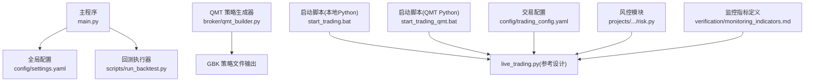
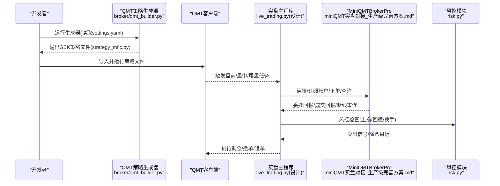
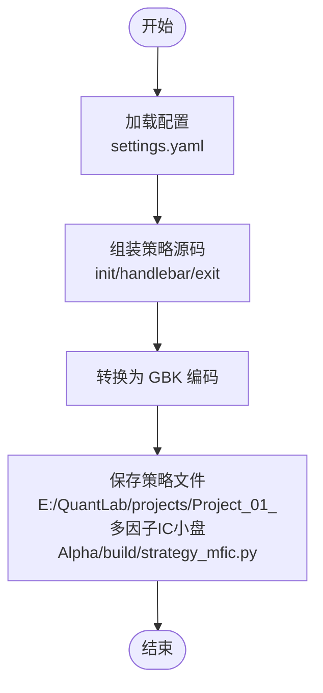
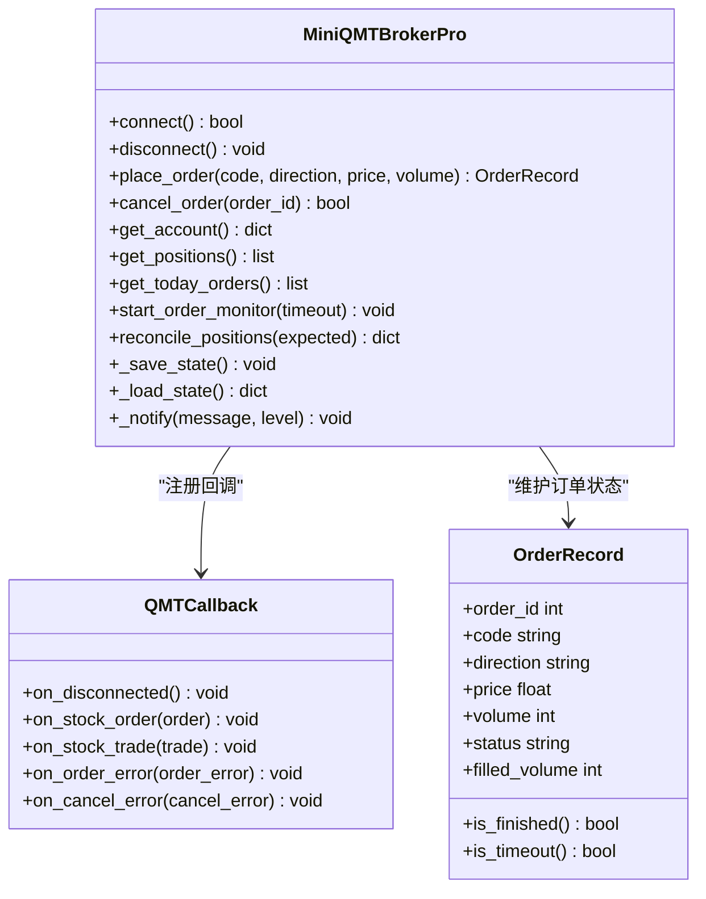
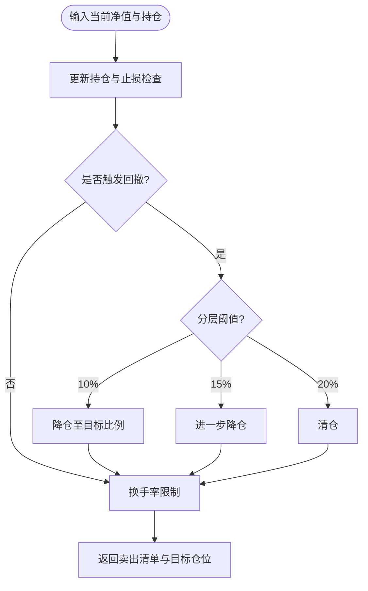
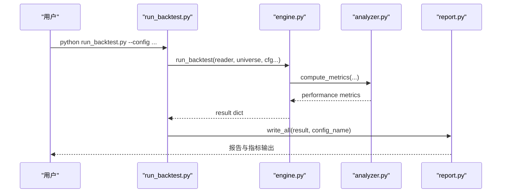
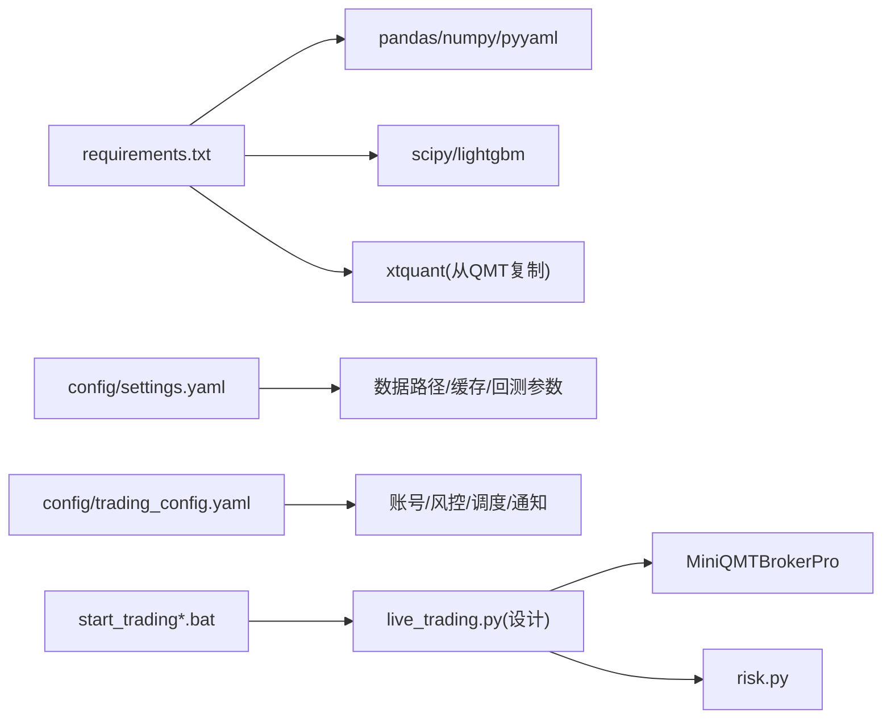

# 生产环境部署

<cite>
**本文引用的文件**   
- [main.py](file://main.py)
- [requirements.txt](file://requirements.txt)
- [config/settings.yaml](file://config/settings.yaml)
- [config/trading_config.yaml](file://config/trading_config.yaml)
- [broker/qmt_builder.py](file://broker/qmt_builder.py)
- [scripts/run_backtest.py](file://scripts/run_backtest.py)
- [start_trading.bat](file://start_trading.bat)
- [start_trading_qmt.bat](file://start_trading_qmt.bat)
- [miniQMT实盘对接_生产级完善方案.md](file://miniQMT实盘对接_生产级完善方案.md)
- [scripts/check_order_status.py](file://scripts/check_order_status.py)
- [scripts/daily_order_test.py](file://scripts/daily_order_test.py)
- [projects/Project_10_价值小盘V2/strategy/risk.py](file://projects/Project_10_价值小盘V2/strategy/risk.py)
- [backtest/engine.py](file://backtest/engine.py)
- [backtest/analyzer.py](file://backtest/analyzer.py)
- [backtest/report.py](file://backtest/report.py)
- [projects/verification/results/monitoring_indicators.md](file://projects/verification/results/monitoring_indicators.md)
</cite>

## 目录
1. [简介](#简介)
2. [项目结构](#项目结构)
3. [核心组件](#核心组件)
4. [架构总览](#架构总览)
5. [详细组件分析](#详细组件分析)
6. [依赖关系分析](#依赖关系分析)
7. [性能与容量规划](#性能与容量规划)
8. [故障恢复与灾难恢复](#故障恢复与灾难恢复)
9. [运维自动化](#运维自动化)
10. [监控与告警](#监控与告警)
11. [风险控制机制](#风险控制机制)
12. [结论](#结论)

## 简介
本指南面向 QuantLab 的生产环境部署，覆盖 QMT 平台策略生成与运行、GBK 编码要求、Python 环境与依赖安装、日志与指标监控、风控与熔断、故障恢复与灾备、以及自动化运维与健康检查。文档以仓库现有实现为依据，提供可操作的步骤、关键配置项说明与可视化架构图，帮助读者快速搭建稳定可靠的量化交易系统。

## 项目结构
QuantLab 采用“回测 + 实盘”双模式组织：
- 回测入口与脚本位于根目录与 scripts 目录；
- 实盘相关逻辑集中在 broker 与启动脚本中；
- 配置文件集中于 config；
- 策略与因子在 projects 下按项目划分；
- 监控与验证结果在 verification 与 reports 目录。

图表来源
- [main.py:1-104](file://main.py#L1-L104)
- [config/settings.yaml:1-69](file://config/settings.yaml#L1-L69)
- [scripts/run_backtest.py:1-132](file://scripts/run_backtest.py#L1-L132)
- [broker/qmt_builder.py:1-386](file://broker/qmt_builder.py#L1-L386)
- [start_trading.bat:1-51](file://start_trading.bat#L1-L51)
- [start_trading_qmt.bat:1-66](file://start_trading_qmt.bat#L1-L66)
- [config/trading_config.yaml:1-62](file://config/trading_config.yaml#L1-L62)
- [projects/Project_10_价值小盘V2/strategy/risk.py:1-195](file://projects/Project_10_价值小盘V2/strategy/risk.py#L1-L195)
- [projects/verification/results/monitoring_indicators.md:1-69](file://projects/verification/results/monitoring_indicators.md#L1-L69)

章节来源
- [main.py:1-104](file://main.py#L1-L104)
- [config/settings.yaml:1-69](file://config/settings.yaml#L1-L69)
- [scripts/run_backtest.py:1-132](file://scripts/run_backtest.py#L1-L132)
- [broker/qmt_builder.py:1-386](file://broker/qmt_builder.py#L1-L386)
- [start_trading.bat:1-51](file://start_trading.bat#L1-L51)
- [start_trading_qmt.bat:1-66](file://start_trading_qmt.bat#L1-L66)
- [config/trading_config.yaml:1-62](file://config/trading_config.yaml#L1-L62)
- [projects/Project_10_价值小盘V2/strategy/risk.py:1-195](file://projects/Project_10_价值小盘V2/strategy/risk.py#L1-L195)
- [projects/verification/results/monitoring_indicators.md:1-69](file://projects/verification/results/monitoring_indicators.md#L1-L69)

## 核心组件
- 回测引擎与报告：通过脚本统一入口加载配置、读取数据、执行回测并输出报告与指标。
- QMT 策略生成器：将策略逻辑与因子计算组装为单文件 GBK 策略，便于在 QMT 环境中直接运行。
- 实盘交易框架（设计参考）：基于 miniQMT 的 Broker、回调、订单追踪、自动重连、状态持久化与通知。
- 风控模块：支持个股止损、组合回撤分层降仓、持有期与换手限制，并提供状态持久化。
- 启动脚本：分别支持本地 Python 与 QMT 内置 Python 启动，包含环境检查与日志目录初始化。

章节来源
- [scripts/run_backtest.py:1-132](file://scripts/run_backtest.py#L1-L132)
- [broker/qmt_builder.py:1-386](file://broker/qmt_builder.py#L1-L386)
- [miniQMT实盘对接_生产级完善方案.md:73-756](file://miniQMT实盘对接_生产级完善方案.md#L73-L756)
- [projects/Project_10_价值小盘V2/strategy/risk.py:1-195](file://projects/Project_10_价值小盘V2/strategy/risk.py#L1-L195)
- [start_trading.bat:1-51](file://start_trading.bat#L1-L51)
- [start_trading_qmt.bat:1-66](file://start_trading_qmt.bat#L1-L66)

## 架构总览
下图展示从配置到策略生成、再到 QMT 运行的整体流程，以及回测与实盘的并行路径。

图表来源
- [broker/qmt_builder.py:1-386](file://broker/qmt_builder.py#L1-L386)
- [miniQMT实盘对接_生产级完善方案.md:1131-1344](file://miniQMT实盘对接_生产级完善方案.md#L1131-L1344)
- [projects/Project_10_价值小盘V2/strategy/risk.py:1-195](file://projects/Project_10_价值小盘V2/strategy/risk.py#L1-L195)

## 详细组件分析

### QMT 策略生成器（GBK 编码）
- 功能要点
  - 读取全局配置 settings.yaml，提取策略参数与因子权重。
  - 组装 QMT 生命周期 init/handlebar/exit，包含止损、调仓日判断、因子计算与下单。
  - 输出 GBK 编码的单文件策略，确保与 QMT 环境兼容。
- 关键实现点
  - 使用 GBK 编码写入策略文件，避免中文乱码。
  - 内置 VWAP-成交量相关性因子与多因子评分。
  - 持仓持久化 JSON 文件，用于重启后恢复。
- 建议
  - 在生产环境固定输出路径，定期备份策略文件与持仓状态。
  - 对因子阈值与权重进行版本化管理，便于回溯与审计。

图表来源
- [broker/qmt_builder.py:1-386](file://broker/qmt_builder.py#L1-L386)

章节来源
- [broker/qmt_builder.py:1-386](file://broker/qmt_builder.py#L1-L386)

### 实盘交易框架（miniQMT Broker 与回调）
- 功能要点
  - 连接管理：创建 xttrader/xtdata，注册回调，启动与连接校验。
  - 订单追踪：记录委托状态、部分成交、超时撤单。
  - 自动重连：指数退避重试，失败上限后通知。
  - 状态持久化：保存订单与最近成交，崩溃后可恢复。
  - 通知：企业微信/钉钉 webhook 推送。
- 关键实现点
  - on_disconnected/on_stock_order/on_stock_trade/on_order_error 等回调处理。
  - place_order/cancel_order/reconcile_positions 等生产级方法。
  - start_order_monitor 后台线程监控未成交订单。
- 建议
  - 生产环境启用通知与日志轮转，设置合理的超时与重试参数。
  - 每日盘前下载历史数据，盘中仅做增量更新。

图表来源
- [miniQMT实盘对接_生产级完善方案.md:73-756](file://miniQMT实盘对接_生产级完善方案.md#L73-L756)

章节来源
- [miniQMT实盘对接_生产级完善方案.md:73-756](file://miniQMT实盘对接_生产级完善方案.md#L73-L756)

### 风控模块（止损/回撤/持有期/换手）
- 功能要点
  - 个股止损：固定阈值或 ATR 自适应止损。
  - 组合回撤：旧口径一刀切清仓，新口径分层降仓（10%/15%/20%）。
  - 持有期与禁入列表：最长持有天数与止损后短期禁入。
  - 换手率限制：按当日买卖笔数与仓位比例缩放操作量。
  - 状态持久化：JSON 文件保存 holdings/nav_peak/dd_tier 等。
- 关键实现点
  - stop_threshold/update_holdings/check_drawdown_tiered/check_turnover。
  - register_entry/register_exit/is_banned。
- 建议
  - 生产环境开启分层降仓，避免极端行情下的流动性冲击。
  - 结合监控指标，动态调整阈值与禁入周期。

图表来源
- [projects/Project_10_价值小盘V2/strategy/risk.py:1-195](file://projects/Project_10_价值小盘V2/strategy/risk.py#L1-L195)

章节来源
- [projects/Project_10_价值小盘V2/strategy/risk.py:1-195](file://projects/Project_10_价值小盘V2/strategy/risk.py#L1-L195)

### 回测引擎与报告
- 功能要点
  - 统一 CLI 入口，加载 YAML 配置、读取 astock parquet 数据、执行回测。
  - 输出绩效指标、交易明细、权益曲线与警告信息。
  - 基准可用性与样本期警告提示。
- 关键实现点
  - compute_metrics/_benchmark_metrics 计算超额收益与信息比率。
  - report.write_all 汇总报告与 WARN 块。
- 建议
  - 生产环境回测需固定数据源与调整方式，保证可重复性。
  - 对短样本期与基准不可用场景增加告警。

图表来源
- [scripts/run_backtest.py:1-132](file://scripts/run_backtest.py#L1-L132)
- [backtest/engine.py:479-522](file://backtest/engine.py#L479-L522)
- [backtest/analyzer.py:78-99](file://backtest/analyzer.py#L78-L99)
- [backtest/report.py:78-108](file://backtest/report.py#L78-L108)

章节来源
- [scripts/run_backtest.py:1-132](file://scripts/run_backtest.py#L1-L132)
- [backtest/engine.py:479-522](file://backtest/engine.py#L479-L522)
- [backtest/analyzer.py:78-99](file://backtest/analyzer.py#L78-L99)
- [backtest/report.py:78-108](file://backtest/report.py#L78-L108)

### 启动脚本与环境检查
- 本地 Python 启动脚本
  - 检查 Python 版本与 PATH。
  - 检查 QMT 进程是否运行，未运行则提示手动启动。
  - 创建日志与数据目录，校验配置文件存在。
- QMT Python 启动脚本
  - 指定 QMT 内置 Python 路径，自动拉起 QMT 客户端。
  - 同样进行目录与配置检查，并以 QMT Python 执行 live_trading.py。
- 建议
  - 生产环境建议使用系统服务或容器编排管理进程，配合健康检查与自动重启。

章节来源
- [start_trading.bat:1-51](file://start_trading.bat#L1-L51)
- [start_trading_qmt.bat:1-66](file://start_trading_qmt.bat#L1-L66)

## 依赖关系分析
- Python 依赖
  - 核心库：pandas、numpy、pyyaml。
  - 回测与 ML：scipy、lightgbm（可选）。
  - 数据源与可视化：tushare/akshare/streamlit/plotly（可选）。
  - QMT 实盘：xtquant（从 QMT 安装目录复制）。
- 配置依赖
  - settings.yaml：全局数据路径、缓存、回测参数、日志与策略默认池。
  - trading_config.yaml：账号、资金、佣金、滑点、风控、调度与通知。
- 运行时依赖
  - QMT 客户端进程与 xtquant 库必须可用。
  - 日志目录与数据目录需具备读写权限。

图表来源
- [requirements.txt:1-29](file://requirements.txt#L1-L29)
- [config/settings.yaml:1-69](file://config/settings.yaml#L1-L69)
- [config/trading_config.yaml:1-62](file://config/trading_config.yaml#L1-L62)
- [start_trading.bat:1-51](file://start_trading.bat#L1-L51)
- [start_trading_qmt.bat:1-66](file://start_trading_qmt.bat#L1-L66)
- [miniQMT实盘对接_生产级完善方案.md:73-756](file://miniQMT实盘对接_生产级完善方案.md#L73-L756)
- [projects/Project_10_价值小盘V2/strategy/risk.py:1-195](file://projects/Project_10_价值小盘V2/strategy/risk.py#L1-L195)

章节来源
- [requirements.txt:1-29](file://requirements.txt#L1-L29)
- [config/settings.yaml:1-69](file://config/settings.yaml#L1-L69)
- [config/trading_config.yaml:1-62](file://config/trading_config.yaml#L1-L62)
- [start_trading.bat:1-51](file://start_trading.bat#L1-L51)
- [start_trading_qmt.bat:1-66](file://start_trading_qmt.bat#L1-L66)
- [miniQMT实盘对接_生产级完善方案.md:73-756](file://miniQMT实盘对接_生产级完善方案.md#L73-L756)
- [projects/Project_10_价值小盘V2/strategy/risk.py:1-195](file://projects/Project_10_价值小盘V2/strategy/risk.py#L1-L195)

## 性能与容量规划
- 数据层
  - 使用 astock parquet 作为只读数据源，避免写锁冲突。
  - 启用缓存目录与过期策略，减少重复 IO。
- 计算层
  - 因子计算与评分尽量向量化，避免逐行循环。
  - 控制选股数量与频率，降低实时行情与网络压力。
- 交易层
  - 委托超时与自动撤单，防止挂单堆积。
  - 分批下单与价格容差，降低冲击成本。
- 容量规划
  - 根据管理规模估算冲击成本，超过阈值时减缓加仓速度。
  - 监控 CPU/内存/磁盘 IO，预留冗余资源。

[本节为通用指导，不直接分析具体文件]

## 故障恢复与灾难恢复
- 数据备份
  - 定期备份 astock 数据与缓存目录。
  - 备份策略文件与持仓状态 JSON。
- 策略重启
  - 启动脚本自动检测 QMT 进程，未运行则提示或自动拉起。
  - live_trading.py 启动时加载上次状态，恢复未完成委托与近期成交。
- 状态恢复
  - MiniQMTBrokerPro._load_state 恢复订单与交易快照。
  - risk.py 的 state_file 恢复持仓与回撤层级。
- 灾难恢复
  - 若 QMT 客户端异常，优先重启客户端并重新连接。
  - 若数据损坏，从备份恢复 astock 与缓存，再执行盘前数据下载。

章节来源
- [start_trading.bat:1-51](file://start_trading.bat#L1-L51)
- [start_trading_qmt.bat:1-66](file://start_trading_qmt.bat#L1-L66)
- [miniQMT实盘对接_生产级完善方案.md:1131-1344](file://miniQMT实盘对接_生产级完善方案.md#L1131-L1344)
- [projects/Project_10_价值小盘V2/strategy/risk.py:39-63](file://projects/Project_10_价值小盘V2/strategy/risk.py#L39-L63)

## 运维自动化
- 部署脚本
  - start_trading.bat/start_trading_qmt.bat：环境检查、目录创建、配置文件校验、进程启动。
- 监控脚本
  - check_order_status.py：解析 QMT 日志，输出委托与成交状态。
  - daily_order_test.py：每日限价下单与超时改市价测试，验证通道可用性。
- 维护任务
  - 盘前数据下载与缓存清理。
  - 日志轮转与归档。
- 健康检查
  - 进程存活检查、QMT 连接状态、账户资产查询、委托队列长度。

章节来源
- [start_trading.bat:1-51](file://start_trading.bat#L1-L51)
- [start_trading_qmt.bat:1-66](file://start_trading_qmt.bat#L1-L66)
- [scripts/check_order_status.py:1-50](file://scripts/check_order_status.py#L1-L50)
- [scripts/daily_order_test.py:1-227](file://scripts/daily_order_test.py#L1-L227)

## 监控与告警
- 日志收集
  - 统一日志目录与级别，区分 INFO/WARNING/ERROR。
  - QMT FormulaOutput 日志解析，定位委托与成交问题。
- 指标监控
  - 净值与日收益率、最大回撤、行业集中度、换手率、信号质量、业绩归因、容量检查、风控回顾。
- 告警规则
  - 单日跌幅 > 3% 预警。
  - 回撤 > 10%/15%/20% 分级处理（减仓/清仓）。
  - 单股占比 > 5% 预警，单行业 > 25% 预警。
  - 周换手 > 30% 预警，平均 ROE < 3% 或负债率 > 70% 预警。
- 性能追踪
  - 委托超时与失败率、数据下载耗时、因子计算耗时。

章节来源
- [projects/verification/results/monitoring_indicators.md:1-69](file://projects/verification/results/monitoring_indicators.md#L1-L69)
- [scripts/check_order_status.py:1-50](file://scripts/check_order_status.py#L1-L50)

## 风险控制机制
- 仓位管理
  - 单股最大仓位与总仓位上限，资金不足时自动调整下单量。
- 止损止盈
  - 固定止损或 ATR 自适应止损，触发后加入禁入列表。
- 异常处理
  - 委托失败与撤单失败记录错误信息，通知与重试策略。
- 熔断机制
  - 组合回撤分层降仓，达到阈值清仓，保护净值。
  - 换手率限制，避免过度交易。

章节来源
- [config/trading_config.yaml:1-62](file://config/trading_config.yaml#L1-L62)
- [projects/Project_10_价值小盘V2/strategy/risk.py:1-195](file://projects/Project_10_价值小盘V2/strategy/risk.py#L1-L195)
- [miniQMT实盘对接_生产级完善方案.md:73-756](file://miniQMT实盘对接_生产级完善方案.md#L73-L756)

## 结论
QuantLab 的生产环境部署围绕“策略生成—QMT 运行—风控与监控—自动化运维”形成闭环。通过 GBK 策略生成、稳健的 Broker 与回调、分层风控与状态持久化、完善的启动脚本与监控工具，可在保障稳定性的前提下实现高效的量化交易。建议在生产环境中严格执行配置版本化、数据备份与演练、指标监控与告警联动，持续优化容量与性能，确保系统在极端行情下的鲁棒性。