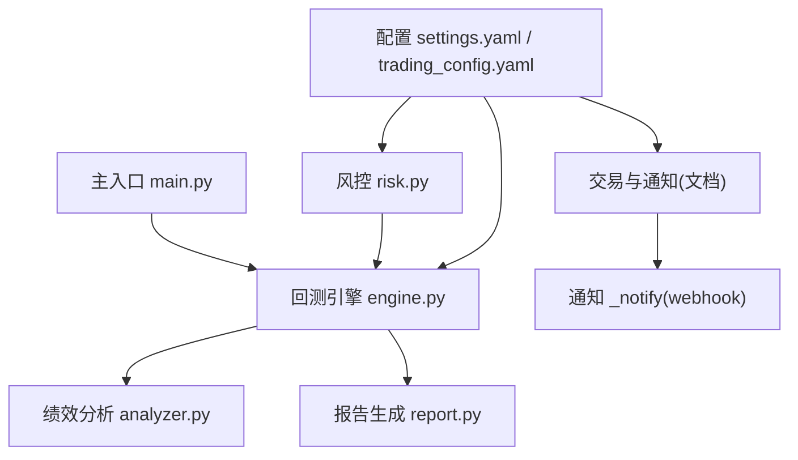
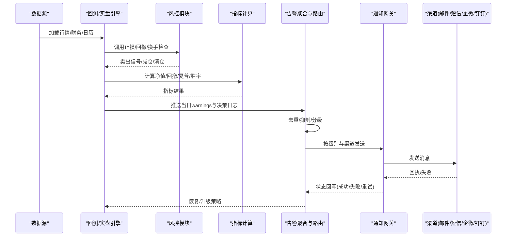
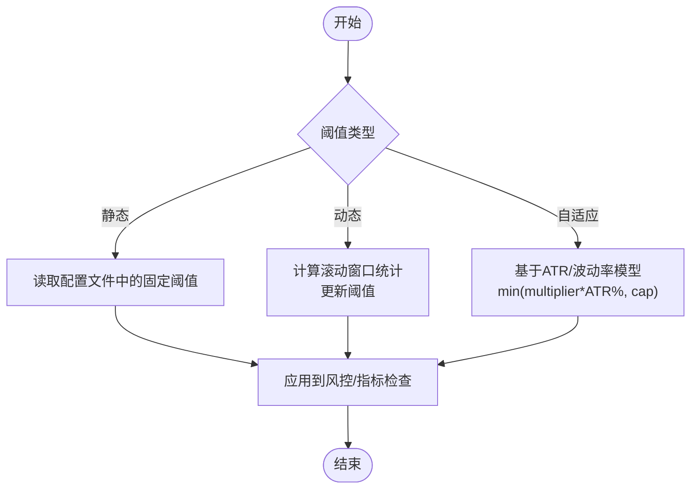
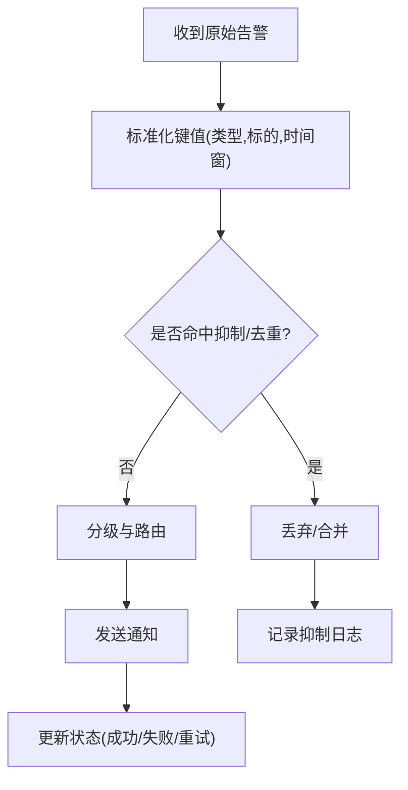
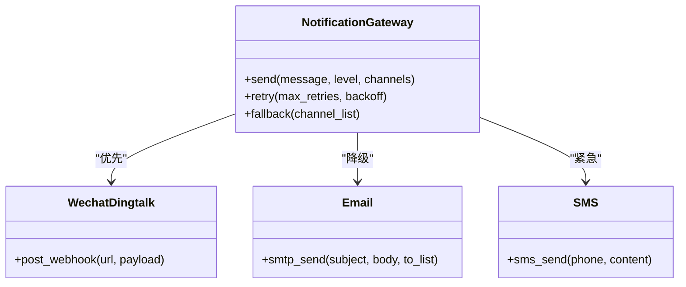
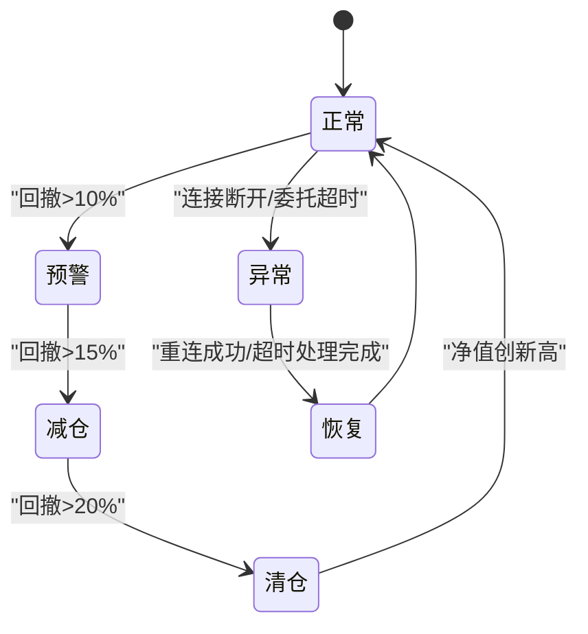
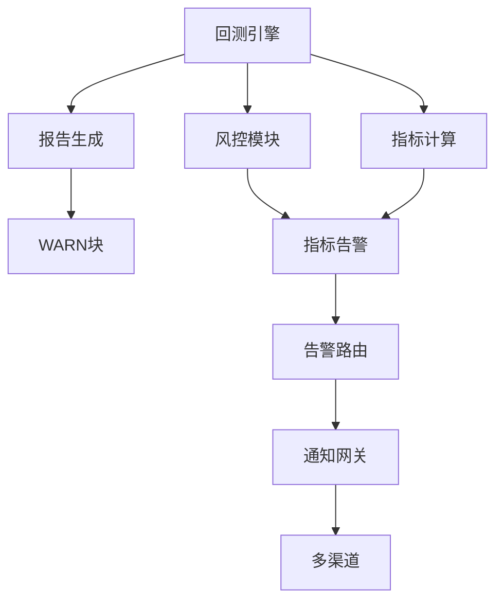

# 告警机制设计

<cite>
**本文引用的文件**   
- [main.py](file://main.py)
- [settings.yaml](file://config/settings.yaml)
- [trading_config.yaml](file://config/trading_config.yaml)
- [engine.py](file://backtest/engine.py)
- [analyzer.py](file://backtest/analyzer.py)
- [report.py](file://backtest/report.py)
- [risk.py](file://projects/Project_10_价值小盘V2/strategy/risk.py)
- [monitoring_indicators.md](file://projects/verification/results/monitoring_indicators.md)
- [production_config.yaml](file://projects/verification/results/production_config.yaml)
- [miniQMT实盘对接_生产级完善方案.md](file://miniQMT实盘对接_生产级完善方案.md)
</cite>

## 目录
1. [引言](#引言)
2. [项目结构](#项目结构)
3. [核心组件](#核心组件)
4. [架构总览](#架构总览)
5. [详细组件分析](#详细组件分析)
6. [依赖关系分析](#依赖关系分析)
7. [性能与稳定性考虑](#性能与稳定性考虑)
8. [故障排查指南](#故障排查指南)
9. [结论](#结论)
10. [附录：阈值与规则配置清单](#附录阈值与规则配置清单)

## 引言
本文件为 QuantLab 构建“生产级告警机制”的完整设计方案，覆盖阈值策略（静态、动态、自适应）、告警规则（条件判断、触发逻辑、抑制与去重）、通知渠道（邮件、短信、企业微信、钉钉）、升级机制（多级、超时升级、自动恢复），以及效果评估（误报率、响应时间、告警疲劳度）和故障排查与性能优化建议。方案基于现有代码库中的回测引擎、风控模块、报告生成与 miniQMT 实盘集成能力进行扩展设计，确保可落地、可扩展、可观测。

## 项目结构
QuantLab 当前具备以下与告警相关的基础能力：
- 回测引擎与日志/告警聚合：engine.py 中每日警告收集与去重；report.py 输出固定顺序的 WARN 块。
- 风控与止损：risk.py 提供个股止损、组合回撤分层降仓、持有期与换手限制等。
- 指标计算：analyzer.py 提供最大回撤、夏普、胜率等关键指标。
- 交易与通知：miniQMT 文档中包含 _notify 方法（企业微信/钉钉 webhook）及委托监控线程。
- 配置：settings.yaml 与 trading_config.yaml 提供全局与实盘参数入口，notification 字段预留通道开关与 webhook。

图表来源
- [engine.py:237-339](file://backtest/engine.py#L237-L339)
- [analyzer.py:96-176](file://backtest/analyzer.py#L96-L176)
- [report.py:78-108](file://backtest/report.py#L78-L108)
- [risk.py:15-195](file://projects/Project_10_价值小盘V2/strategy/risk.py#L15-L195)
- [settings.yaml:1-69](file://config/settings.yaml#L1-L69)
- [trading_config.yaml:37-41](file://config/trading_config.yaml#L37-L41)
- [miniQMT实盘对接_生产级完善方案.md:692-713](file://miniQMT实盘对接_生产级完善方案.md#L692-L713)

章节来源
- [main.py:1-104](file://main.py#L1-L104)
- [settings.yaml:1-69](file://config/settings.yaml#L1-L69)
- [trading_config.yaml:1-62](file://config/trading_config.yaml#L1-L62)

## 核心组件
- 告警采集器（EngineWarningAggregator）
  - 职责：在回测/实盘运行过程中收集每日 warnings，执行去重与聚合，形成结构化告警事件流。
  - 依据：engine.py 的 _unique_warnings 与 daily_warnings 收集；report.py 的 _build_warn_block 输出固定顺序的 WARN 块。
- 风控告警器（RiskAlertController）
  - 职责：基于 risk.py 的止损、回撤分层、持有期、换手限制等规则，产生风控类告警并驱动动作（减仓/清仓）。
  - 依据：risk.py 的 stop_threshold、check_drawdown_tiered、check_turnover 等方法。
- 指标监测器（MetricsMonitor）
  - 职责：基于 analyzer.py 计算的指标（最大回撤、夏普、胜率、持仓天数等）设定阈值，触发预警或升级。
  - 依据：analyzer.py 的 compute_metrics 与 _max_drawdown/_sharpe 等。
- 通知网关（NotificationGateway）
  - 职责：统一封装邮件、短信、企业微信、钉钉等渠道发送；支持模板、级别、重试与失败降级。
  - 依据：miniQMT 文档中的 _notify 实现思路与 trading_config.yaml 的 notification 配置。
- 告警路由与升级（AlertRouter & EscalationPolicy）
  - 职责：根据告警类型、严重级别、上下文（账户、策略、标的）选择渠道与接收人；按策略进行多级升级与超时处理。
  - 依据：结合 trading_config.yaml 的 schedule 与 risk 参数，以及工程化实践。

章节来源
- [engine.py:149-157](file://backtest/engine.py#L149-L157)
- [report.py:78-108](file://backtest/report.py#L78-L108)
- [risk.py:15-195](file://projects/Project_10_价值小盘V2/strategy/risk.py#L15-L195)
- [analyzer.py:96-176](file://backtest/analyzer.py#L96-L176)
- [trading_config.yaml:37-41](file://config/trading_config.yaml#L37-L41)
- [miniQMT实盘对接_生产级完善方案.md:692-713](file://miniQMT实盘对接_生产级完善方案.md#L692-L713)

## 架构总览
下图展示从数据到告警的全链路：数据读取与回测/实盘运行 → 风控与指标计算 → 告警聚合与路由 → 通知渠道 → 反馈与恢复。

图表来源
- [engine.py:237-339](file://backtest/engine.py#L237-L339)
- [risk.py:15-195](file://projects/Project_10_价值小盘V2/strategy/risk.py#L15-L195)
- [analyzer.py:96-176](file://backtest/analyzer.py#L96-L176)
- [report.py:78-108](file://backtest/report.py#L78-L108)
- [miniQMT实盘对接_生产级完善方案.md:692-713](file://miniQMT实盘对接_生产级完善方案.md#L692-L713)

## 详细组件分析

### 阈值设置策略（静态、动态、自适应）
- 静态阈值
  - 适用场景：基础风控（如组合最大回撤、单股止损、行业集中度、换手上限）。
  - 配置位置：trading_config.yaml 的 risk.stop_loss_pct、risk.max_drawdown、order.timeout_seconds 等；production_config.yaml 的风险控制段。
  - 示例参考：risk.py 的默认 stop_loss=0.08、max_drawdown=0.15。
- 动态阈值
  - 适用场景：随市场波动调整，如基于近期波动率的回撤阈值、基于成交量的流动性阈值。
  - 实现思路：在 MetricsMonitor 中引入滚动窗口统计（如近N日波动率、成交量分位数），动态更新阈值。
- 自适应阈值
  - 适用场景：ATR 自适应止损、分层降仓目标比例随回撤加深变化。
  - 依据：risk.py 的 atr_stop、atr_multiplier、atr_stop_cap 与 check_drawdown_tiered 的分层目标。

图表来源
- [risk.py:62-72](file://projects/Project_10_价值小盘V2/strategy/risk.py#L62-L72)
- [risk.py:125-157](file://projects/Project_10_价值小盘V2/strategy/risk.py#L125-L157)
- [trading_config.yaml:18-28](file://config/trading_config.yaml#L18-L28)
- [production_config.yaml:74-85](file://projects/verification/results/production_config.yaml#L74-L85)

章节来源
- [risk.py:15-195](file://projects/Project_10_价值小盘V2/strategy/risk.py#L15-L195)
- [trading_config.yaml:18-28](file://config/trading_config.yaml#L18-L28)
- [production_config.yaml:74-85](file://projects/verification/results/production_config.yaml#L74-L85)

### 告警规则定义（条件、触发、抑制、去重）
- 条件判断
  - 指标类：净值单日跌幅、最大回撤、夏普低于阈值、胜率过低、换手过高。
  - 风控类：个股止损、组合回撤分层、最长持有期、行业集中度超限。
  - 系统类：连接断开、委托超时、数据 WAL 检测、基准不可用。
- 触发逻辑
  - 实时触发：委托超时、断线重连失败、持仓对账差异。
  - 周期触发：每日/每周/每月/每季度监控项（见 monitoring_indicators.md）。
- 抑制规则
  - 同一天内相同告警仅保留一次（engine._unique_warnings）。
  - 分层回撤防重触发（risk.check_drawdown_tiered 的状态 dd_tier）。
- 去重机制
  - 基于告警键（类型+标的+时间窗口）去重，避免重复通知。
  - 支持冷却时间（cooldown）与滑动窗口计数（burst limit）。

图表来源
- [engine.py:149-157](file://backtest/engine.py#L149-L157)
- [risk.py:125-157](file://projects/Project_10_价值小盘V2/strategy/risk.py#L125-L157)
- [report.py:78-108](file://backtest/report.py#L78-L108)

章节来源
- [engine.py:149-157](file://backtest/engine.py#L149-L157)
- [monitoring_indicators.md:1-69](file://projects/verification/results/monitoring_indicators.md#L1-L69)
- [report.py:78-108](file://backtest/report.py#L78-L108)

### 通知渠道配置（邮件、短信、企业微信、钉钉）
- 企业微信/钉钉
  - 通过 webhook 发送文本消息，包含级别、时间、账号信息。
  - 参考：miniQMT 文档中的 _notify 方法与 trading_config.yaml 的 notification.webhook_url。
- 邮件
  - 使用 SMTP 发送 HTML/Markdown 报告，适合日报/周报/月报。
- 短信
  - 用于紧急告警（如连接失败、清仓触发），需接入短信网关。
- 配置要点
  - 在 trading_config.yaml 的 notification 段开启 enabled、method、webhook_url。
  - 支持多通道并行发送与失败降级（优先企微/钉钉，失败再发邮件/短信）。

图表来源
- [trading_config.yaml:37-41](file://config/trading_config.yaml#L37-L41)
- [miniQMT实盘对接_生产级完善方案.md:692-713](file://miniQMT实盘对接_生产级完善方案.md#L692-L713)

章节来源
- [trading_config.yaml:37-41](file://config/trading_config.yaml#L37-L41)
- [miniQMT实盘对接_生产级完善方案.md:692-713](file://miniQMT实盘对接_生产级完善方案.md#L692-L713)

### 告警升级机制（多级、超时升级、自动恢复）
- 多级告警
  - 级别划分：info/warning/error/critical，对应不同渠道与接收人。
  - 依据：monitoring_indicators.md 的回撤分级（10%/15%/20%）与风险策略。
- 超时升级
  - 委托超时未成交 → 自动撤单并升级告警（参考 miniQMT 订单监控线程）。
  - 连接断开 → 指数退避重连，多次失败后升级为 critical。
- 自动恢复
  - 净值创新高时重置分层层级（risk.check_drawdown_tiered）。
  - 连接恢复后自动通知恢复。

图表来源
- [risk.py:125-157](file://projects/Project_10_价值小盘V2/strategy/risk.py#L125-L157)
- [miniQMT实盘对接_生产级完善方案.md:290-312](file://miniQMT实盘对接_生产级完善方案.md#L290-L312)
- [monitoring_indicators.md:10-16](file://projects/verification/results/monitoring_indicators.md#L10-L16)

章节来源
- [risk.py:125-157](file://projects/Project_10_价值小盘V2/strategy/risk.py#L125-L157)
- [miniQMT实盘对接_生产级完善方案.md:290-312](file://miniQMT实盘对接_生产级完善方案.md#L290-L312)
- [monitoring_indicators.md:10-16](file://projects/verification/results/monitoring_indicators.md#L10-L16)

### 告警效果评估（误报率、响应时间、疲劳度）
- 误报率分析
  - 统计告警总数与实际风险事件数，计算误报率 = 误报数/告警总数。
  - 关注数据源问题（WAL 检测）、基准不可用导致的误报。
- 响应时间统计
  - 从告警产生到通知送达的平均时长；区分渠道延迟。
- 告警疲劳度监控
  - 单位时间内告警数量趋势；高频告警需启用抑制与去重。
- 数据来源
  - engine.py 的 daily_warnings 与 report.py 的 WARN 块可用于回溯统计。
  - monitoring_indicators.md 定义了各类监控阈值与处理流程，便于对比实际表现。

章节来源
- [engine.py:149-157](file://backtest/engine.py#L149-L157)
- [report.py:78-108](file://backtest/report.py#L78-L108)
- [monitoring_indicators.md:1-69](file://projects/verification/results/monitoring_indicators.md#L1-L69)

## 依赖关系分析
- 回测引擎依赖风控与指标计算，产出日志与警告。
- 报告模块依赖引擎的 summary 与 warnings，生成可读性强的 WARN 块。
- 通知网关依赖配置与第三方接口（webhook/SMTP/SMS）。
- 风控模块依赖价格与持仓数据，输出止损/减仓/清仓动作。

图表来源
- [engine.py:237-339](file://backtest/engine.py#L237-L339)
- [analyzer.py:96-176](file://backtest/analyzer.py#L96-L176)
- [report.py:78-108](file://backtest/report.py#L78-L108)
- [risk.py:15-195](file://projects/Project_10_价值小盘V2/strategy/risk.py#L15-L195)

章节来源
- [engine.py:237-339](file://backtest/engine.py#L237-L339)
- [analyzer.py:96-176](file://backtest/analyzer.py#L96-L176)
- [report.py:78-108](file://backtest/report.py#L78-L108)
- [risk.py:15-195](file://projects/Project_10_价值小盘V2/strategy/risk.py#L15-L195)

## 性能与稳定性考虑
- 告警去重与抑制
  - 使用集合与滑动窗口降低重复告警，减少通知压力。
- 异步通知
  - 通知发送采用独立线程/队列，避免阻塞主流程。
- 失败降级
  - 主渠道失败自动切换备用渠道，保证关键告警可达。
- 资源限制
  - 限制并发请求与重试次数，防止雪崩。
- 持久化与恢复
  - 告警状态与通知回执持久化，崩溃后可恢复。

[本节为通用指导，不直接分析具体文件]

## 故障排查指南
- 常见问题
  - 连接失败：检查 miniQMT 路径、session_id、xtquant 库安装。
  - 委托超时：确认交易时段、价格容差、资金/持仓检查。
  - 数据问题：WAL 检测、基准不可用、样本期过短。
- 定位步骤
  - 查看 engine.py 的 daily_warnings 与 report.py 的 WARN 块。
  - 检查 risk.py 的止损/回撤分层状态与禁入列表。
  - 核对 trading_config.yaml 的 notification 配置与 webhook 连通性。
- 修复建议
  - 调整阈值与冷却时间，减少误报。
  - 增加重试与降级策略，提升可靠性。
  - 完善日志与监控，缩短定位时间。

章节来源
- [engine.py:286-286](file://backtest/engine.py#L286-L286)
- [report.py:78-108](file://backtest/report.py#L78-L108)
- [risk.py:159-165](file://projects/Project_10_价值小盘V2/strategy/risk.py#L159-L165)
- [trading_config.yaml:37-41](file://config/trading_config.yaml#L37-L41)

## 结论
本方案在现有 QuantLab 基础上，构建了完整的告警机制：以风控与指标为核心，结合回测引擎的警告聚合与报告输出，实现静态、动态、自适应阈值策略；通过通知网关与多渠道集成，保障关键告警可达；借助多级升级与自动恢复，提升系统鲁棒性；并通过误报率、响应时间与疲劳度评估，持续优化告警质量。建议在实盘前完成全量测试与 Checklist 验证，确保集成层稳定可靠。

[本节为总结，不直接分析具体文件]

## 附录：阈值与规则配置清单
- 静态阈值
  - 个股止损：trading_config.yaml 的 risk.stop_loss_pct 或 risk.py 的 stop_loss。
  - 组合最大回撤：trading_config.yaml 的 risk.max_drawdown 或 production_config.yaml 的 risk_control.max_drawdown。
  - 委托超时：trading_config.yaml 的 order.timeout_seconds。
- 动态阈值
  - 基于波动率/成交量的滚动阈值，需在 MetricsMonitor 中实现。
- 自适应阈值
  - ATR 自适应止损：risk.py 的 atr_stop、atr_multiplier、atr_stop_cap。
  - 分层降仓：risk.py 的 tiered_thresholds 与 tiered_targets。
- 抑制与去重
  - engine._unique_warnings 与自定义冷却时间。
- 通知渠道
  - trading_config.yaml 的 notification.enabled/method/webhook_url。

章节来源
- [trading_config.yaml:18-28](file://config/trading_config.yaml#L18-L28)
- [production_config.yaml:74-85](file://projects/verification/results/production_config.yaml#L74-L85)
- [risk.py:62-72](file://projects/Project_10_价值小盘V2/strategy/risk.py#L62-L72)
- [engine.py:149-157](file://backtest/engine.py#L149-L157)