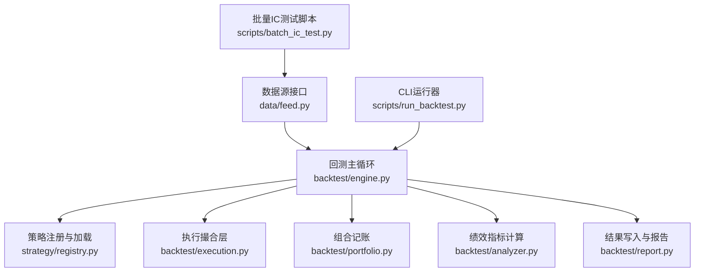
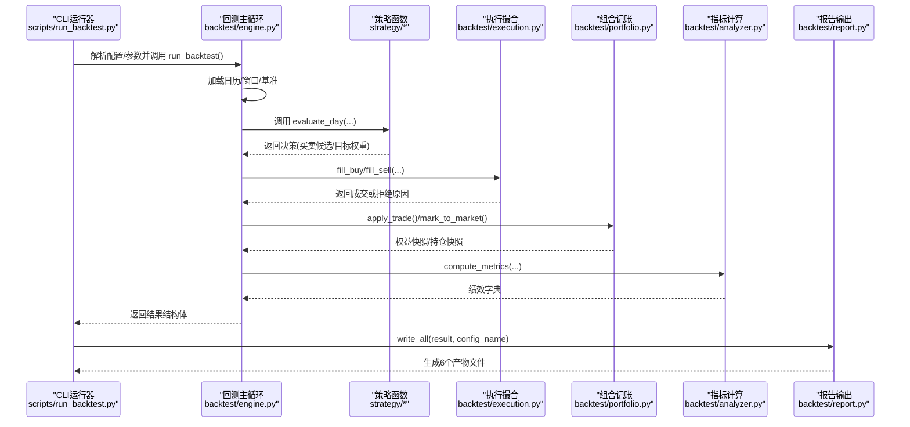
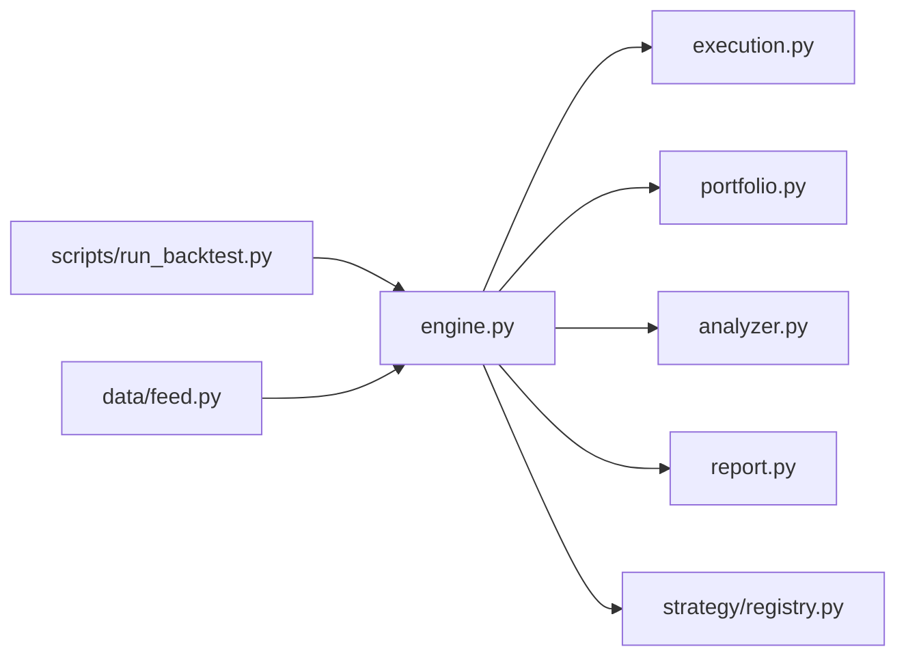

# 性能追踪方案

<cite>
**本文引用的文件**   
- [engine.py](file://backtest/engine.py)
- [analyzer.py](file://backtest/analyzer.py)
- [execution.py](file://backtest/execution.py)
- [portfolio.py](file://backtest/portfolio.py)
- [report.py](file://backtest/report.py)
- [engine_tests.py](file://projects/verification/engine_tests.py)
- [batch_ic_test.py](file://scripts/batch_ic_test.py)
- [run_backtest.py](file://scripts/run_backtest.py)
- [feed.py](file://data/feed.py)
- [registry.py](file://strategy/registry.py)
</cite>

## 目录
1. [引言](#引言)
2. [项目结构](#项目结构)
3. [核心组件](#核心组件)
4. [架构总览](#架构总览)
5. [详细组件分析](#详细组件分析)
6. [依赖关系分析](#依赖关系分析)
7. [性能考量与优化建议](#性能考量与优化建议)
8. [故障排查指南](#故障排查指南)
9. [结论](#结论)
10. [附录：基准测试与监控落地清单](#附录基准测试与监控落地清单)

## 引言
本方案为 QuantLab 构建“端到端”的性能追踪体系，覆盖回测与实盘两大场景：
- 回测性能追踪：数据处理速度、因子计算效率、策略执行延迟、订单模拟开销的监控与分析。
- 实盘延迟监控：数据采集延迟、信号生成时间、订单发送耗时、成交回报时间的端到端追踪。
- 资源使用监控：CPU、内存、磁盘I/O、网络带宽的系统级监控。
- 瓶颈分析方法：热点代码定位、并发问题、锁竞争检测、GC调优。
- 性能基准测试框架：回归测试、压力测试、容量规划的自动化执行。
- 最佳实践与常见问题解决方案。

本方案以现有回测引擎为核心基线，结合脚本与验证用例，给出可落地的指标采集点、埋点位置、输出格式与自动化流程。

## 项目结构
QuantLab 的核心回测链路由数据读取、策略注册与调用、执行撮合、组合记账、指标计算与报告输出组成。下图映射到具体源码文件：

**图表来源** 
- [engine.py:237-619](file://backtest/engine.py#L237-L619)
- [registry.py:1-115](file://strategy/registry.py#L1-L115)
- [execution.py:1-204](file://backtest/execution.py#L1-L204)
- [portfolio.py:1-189](file://backtest/portfolio.py#L1-L189)
- [analyzer.py:1-176](file://backtest/analyzer.py#L1-L176)
- [report.py:1-264](file://backtest/report.py#L1-L264)
- [run_backtest.py:1-132](file://scripts/run_backtest.py#L1-L132)
- [feed.py:1-197](file://data/feed.py#L1-L197)
- [batch_ic_test.py:1-266](file://scripts/batch_ic_test.py#L1-L266)

**章节来源**
- [engine.py:237-619](file://backtest/engine.py#L237-L619)
- [run_backtest.py:1-132](file://scripts/run_backtest.py#L1-L132)

## 核心组件
- 回测主循环（engine）：负责日历推进、窗口切片、策略调用、执行撮合、组合更新、指标计算与汇总。
- 执行撮合（execution）：实现 next_open 模型下的涨跌停、停牌、最小交易单位、滑点与手续费处理。
- 组合记账（portfolio）：维护现金、持仓、T+1可用规则、逐日盯市与权益曲线。
- 指标计算（analyzer）：年化收益、最大回撤、夏普、Calmar、胜率、持有天数、超额与跟踪误差等。
- 报告输出（report）：统一产出 trades.csv、equity_curve.csv、positions.csv、logs.txt、report.md、summary.json。
- 数据接口（feed）：统一 astock/duckdb 日线读取与面板构建。
- 策略注册（registry）：装饰器式注册 evaluate_day，自动发现策略模块。

**章节来源**
- [engine.py:237-619](file://backtest/engine.py#L237-L619)
- [execution.py:1-204](file://backtest/execution.py#L1-L204)
- [portfolio.py:1-189](file://backtest/portfolio.py#L1-L189)
- [analyzer.py:1-176](file://backtest/analyzer.py#L1-L176)
- [report.py:1-264](file://backtest/report.py#L1-L264)
- [feed.py:1-197](file://data/feed.py#L1-L197)
- [registry.py:1-115](file://strategy/registry.py#L1-L115)

## 架构总览
下图展示一次完整回测从 CLI 到报告的时序与关键埋点，便于后续接入性能计时与日志。

**图表来源** 
- [run_backtest.py:42-132](file://scripts/run_backtest.py#L42-L132)
- [engine.py:237-619](file://backtest/engine.py#L237-L619)
- [execution.py:95-204](file://backtest/execution.py#L95-L204)
- [portfolio.py:103-189](file://backtest/portfolio.py#L103-L189)
- [analyzer.py:96-176](file://backtest/analyzer.py#L96-L176)
- [report.py:245-264](file://backtest/report.py#L245-L264)

## 详细组件分析

### 回测主循环（engine）性能追踪要点
- 关键计时点
  - 数据加载与窗口切片：reader.load_window + _build_cut_index/_slice_window_fast
  - 基准序列加载：_load_benchmark_series
  - 策略调用：_evaluate_day
  - 执行撮合：fill_buy/fill_sell
  - 组合记账：apply_trade/mark_to_market
  - 指标计算：compute_metrics
  - 总运行时：started_at 与结束时间差
- 建议埋点
  - 在 engine.run_backtest 入口记录 start_ts；在每个阶段前后打点，累计各阶段耗时与样本量（如每日候选数、成交笔数）。
  - 将 daily_logs 扩展为结构化事件（含 ts、stage、duration_ms、n_candidates、n_filled 等），便于聚合分析。
- 输出增强
  - summary.runtime_seconds 已存在，可扩展为 per_stage 明细（例如 data_load_ms、factor_compute_ms、strategy_ms、execution_ms、portfolio_ms、metrics_ms）。
  - diagnostics_aggregate 中新增 performance_latency 字段，包含分位延迟（P50/P95/P99）与吞吐（条/秒）。

**章节来源**
- [engine.py:237-619](file://backtest/engine.py#L237-L619)

### 执行撮合（execution）开销与延迟
- 成本与拒绝路径
  - 涨跌停判断、停牌、无效价格、不足一手、涨停买入拒绝、跌停卖出拒绝等分支均可能产生“未成交”路径，需统计拒绝原因分布。
- 建议埋点
  - 对每次 fill_buy/fill_sell 记录：请求时间戳、匹配到的 bar、open_pct、limit、price、volume、slippage_amt、commission、tax、reason。
  - 统计拒绝率与平均撮合耗时，按 code/日期维度下钻。
- 指标建议
  - 成交成功率、平均滑点、平均佣金/税费、单笔撮合耗时分布、涨停/跌停拒绝占比。

**章节来源**
- [execution.py:1-204](file://backtest/execution.py#L1-L204)

### 组合记账（portfolio）内存与CPU影响
- T+1 可用规则与逐日盯市
  - advance_holding_days 解冻可用数量；mark_to_market 更新 last_price 与 unrealized_pnl。
- 建议埋点
  - 记录每步操作涉及的 code 数量、内存增长（可通过对象计数估算）、CPU 自旋次数（如循环迭代规模）。
- 指标建议
  - 持仓条目数、平均持仓天数、逐日盯市耗时、内存峰值估计。

**章节来源**
- [portfolio.py:1-189](file://backtest/portfolio.py#L1-L189)

### 指标计算（analyzer）性能特征
- 纯数值计算，无外部依赖，复杂度与交易日长度线性相关。
- 建议埋点
  - compute_metrics 起止时间、输入规模（equity_rows/trades 长度）、benchmark_available 分支耗时差异。
- 指标建议
  - 指标计算耗时、是否启用基准对比、基准对齐失败次数。

**章节来源**
- [analyzer.py:1-176](file://backtest/analyzer.py#L1-L176)

### 报告输出（report）I/O 与稳定性
- 固定列顺序与 WARN 块，保证产物一致性。
- 建议埋点
  - 每个 write_* 函数的开始/结束时间、文件大小、编码与行计数校验。
- 指标建议
  - 写入总耗时、单文件大小、WARN/ERROR 行数统计。

**章节来源**
- [report.py:1-264](file://backtest/report.py#L1-L264)

### 数据接口（feed）与因子计算
- DataFeed 支持 astock parquet 与 duckdb 两种后端，get_panel 用于快速构建面板。
- 因子引擎 FactorEngine.compute_all/compute_ic 提供批量因子计算与 IC 评估。
- 建议埋点
  - 数据读取耗时、面板构建耗时、因子计算耗时、IC 计算耗时与失败率。
- 指标建议
  - 数据吞吐（行/秒）、面板构建时间、因子计算时间、IC 计算稳定性。

**章节来源**
- [feed.py:1-197](file://data/feed.py#L1-L197)
- [batch_ic_test.py:1-266](file://scripts/batch_ic_test.py#L1-L266)

### 策略注册（registry）与动态加载
- 通过装饰器注册 evaluate_day，自动扫描 strategy 包触发导入。
- 建议埋点
  - 模块导入耗时、策略查找耗时、trading_model 校验耗时。
- 指标建议
  - 策略加载失败率、模块导入耗时分布。

**章节来源**
- [registry.py:1-115](file://strategy/registry.py#L1-L115)

## 依赖关系分析
- 低耦合分层：engine 作为编排者，依赖 execution、portfolio、analyzer、report；strategy 通过 registry 解耦。
- 数据流：reader -> window slice -> strategy decision -> execution match -> portfolio update -> metrics -> report。
- 潜在环：无直接循环依赖；registry 仅被 engine 调用。

**图表来源** 
- [engine.py:237-619](file://backtest/engine.py#L237-L619)
- [execution.py:1-204](file://backtest/execution.py#L1-L204)
- [portfolio.py:1-189](file://backtest/portfolio.py#L1-L189)
- [analyzer.py:1-176](file://backtest/analyzer.py#L1-L176)
- [report.py:1-264](file://backtest/report.py#L1-L264)
- [registry.py:1-115](file://strategy/registry.py#L1-L115)
- [run_backtest.py:1-132](file://scripts/run_backtest.py#L1-L132)
- [feed.py:1-197](file://data/feed.py#L1-L197)

**章节来源**
- [engine.py:237-619](file://backtest/engine.py#L237-L619)

## 性能考量与优化建议
- 数据处理
  - 预计算 cut_index 避免每日 searchsorted；减少 DataFrame 拷贝，尽量视图切片。
  - 对大面板采用惰性读取（DuckDB）与列裁剪，降低内存占用。
- 因子计算
  - 向量化优先，避免逐行 Python 循环；缓存中间结果；并行化因子计算（进程池）。
  - 控制因子面板内存布局（MultiIndex vs wide），选择更高效的索引方式。
- 策略执行
  - 限制候选集合规模，提前过滤低流动性标的；批量化计算评分与排序。
  - 将昂贵的 I/O 或网络请求移出热路径。
- 执行撮合
  - 批量处理订单，减少重复计算；缓存涨跌停阈值与 ST 标记。
  - 对高频拒绝路径进行短路判断，降低分支开销。
- 组合记账
  - 使用紧凑数据结构（如 numpy 数组或 pyarrow table）替代大量 dict；减少字符串拼接。
- 指标计算
  - 使用向量化统计（mean/var/std）替代循环；仅在需要时计算基准对比。
- 报告输出
  - 合并写入、异步落盘；压缩存储以减少磁盘 I/O。

[本节为通用指导，不直接分析具体文件]

## 故障排查指南
- 常见错误与定位
  - 数据缺失/对齐失败：检查 calendar、window 切片与 benchmark 对齐逻辑。
  - 涨跌停/停牌导致无法成交：查看 execution 拒绝原因分布。
  - 资金不足/不足一手：检查 target_cash 与 lot_floor 逻辑。
  - 基准不可用：确认 benchmark_db_path 与数据完整性。
- 诊断手段
  - 利用 logs.txt 中的 [WARN]/[ERROR] 行快速定位问题。
  - 扩展 daily_logs 为结构化事件，按 stage/duration_ms/n_candidates 聚合。
  - 使用 engine_tests.py 的已知结果与边界用例进行回归验证。

**章节来源**
- [report.py:78-108](file://backtest/report.py#L78-L108)
- [engine_tests.py:1-309](file://projects/verification/engine_tests.py#L1-L309)

## 结论
通过在 engine 主循环的关键阶段埋点、在 execution 与 portfolio 细化开销统计、在 analyzer 与 report 完善指标与产物质量校验，并结合 feed 与 batch_ic_test 的数据与因子性能观测，可以形成覆盖“数据-因子-策略-执行-组合-指标-报告”的全链路性能追踪体系。配合系统级监控与基准测试框架，可实现持续的性能回归与容量规划。

[本节为总结性内容，不直接分析具体文件]

## 附录：基准测试与监控落地清单
- 回测性能追踪（埋点与指标）
  - 数据加载：start/end、rows_read、bytes_read、read_time_ms
  - 因子计算：factor_names、panel_shape、compute_time_ms、fail_count
  - 策略执行：evaluate_time_ms、candidate_total/candidate_passed
  - 执行撮合：fill_time_ms、filled/unfilled counts、reject_reasons
  - 组合记账：apply_time_ms、holdings_size、memory_peak_est
  - 指标计算：metrics_time_ms、benchmark_available
  - 报告输出：write_time_ms、file_sizes、warn/error_counts
  - 汇总：runtime_seconds、per_stage_times、throughput（条/秒）
- 实盘延迟监控（端到端）
  - 数据采集延迟：market_data_timestamp - event_timestamp
  - 信号生成时间：signal_generation_time_ms
  - 订单发送耗时：order_send_time_ms（含重试）
  - 成交回报时间：fill_report_time_ms（含回报解析）
  - 全链路延迟：end-to-end latency P50/P95/P99
- 资源使用监控（系统级）
  - CPU：利用率、用户态/内核态、上下文切换
  - 内存：RSS、VMS、对象计数、GC 暂停
  - 磁盘：IOPS、吞吐、队列长度
  - 网络：带宽、重传率、连接池状态
- 瓶颈分析方法
  - 热点代码：cProfile/py-spy 采样，识别 top 消耗函数
  - 并发问题：线程/进程池利用率、任务排队时长
  - 锁竞争：threading.Lock 等待时间、死锁检测
  - GC 调优：触发频率、回收耗时、碎片率
- 基准测试框架
  - 回归测试：engine_tests.py 扩展为性能回归（耗时上限、拒绝率上限）
  - 压力测试：增大 universe/日历长度/因子数量，观察线性度与拐点
  - 容量规划：不同规模下的吞吐与延迟曲线，确定资源配额
  - 自动化：CI 集成，失败告警与报告归档

[本节为实施清单，不直接分析具体文件]