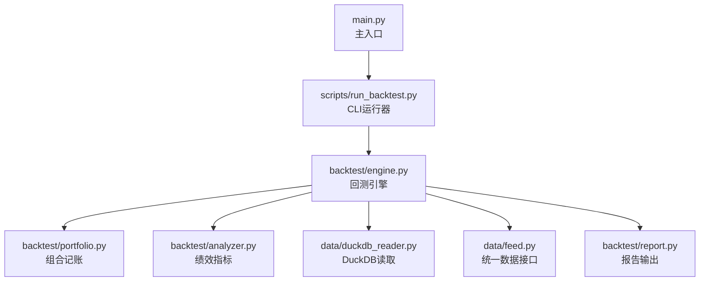
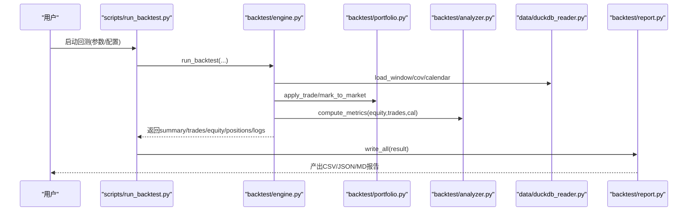
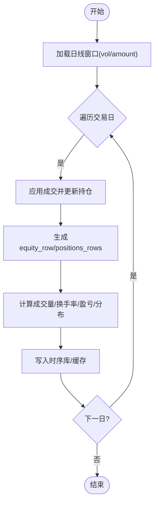
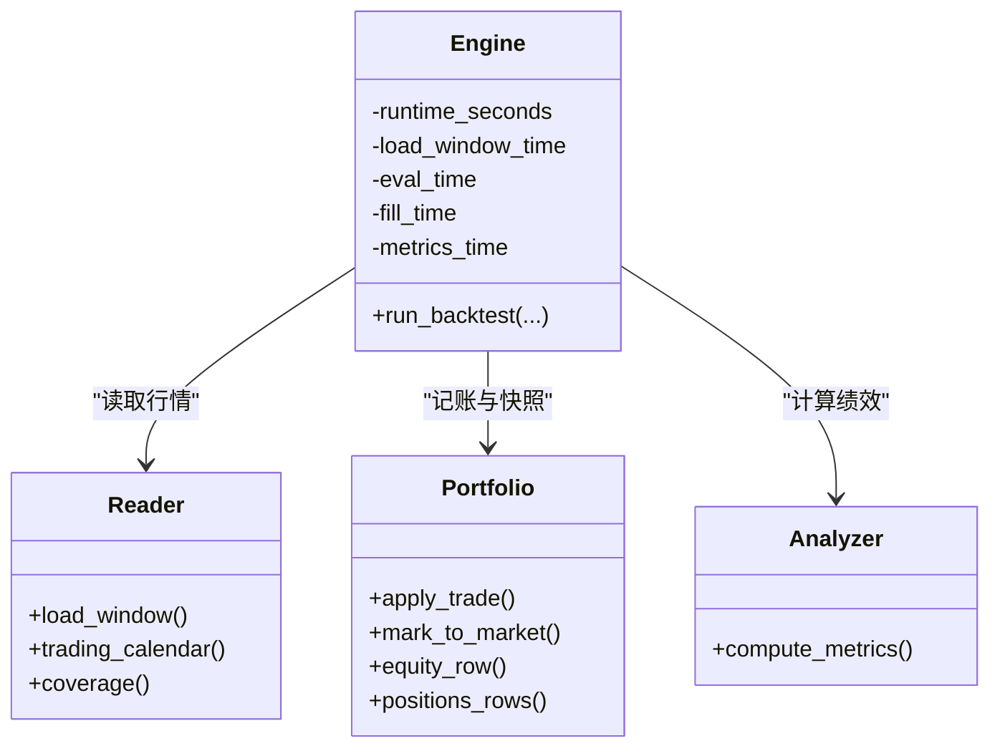
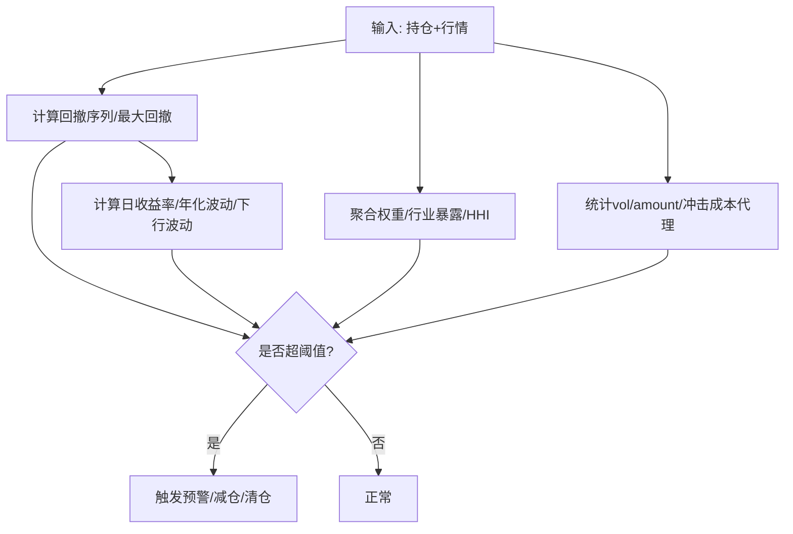
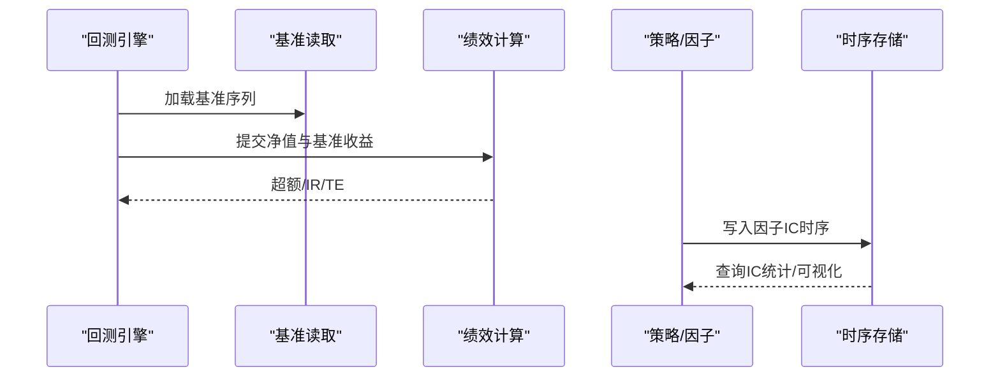
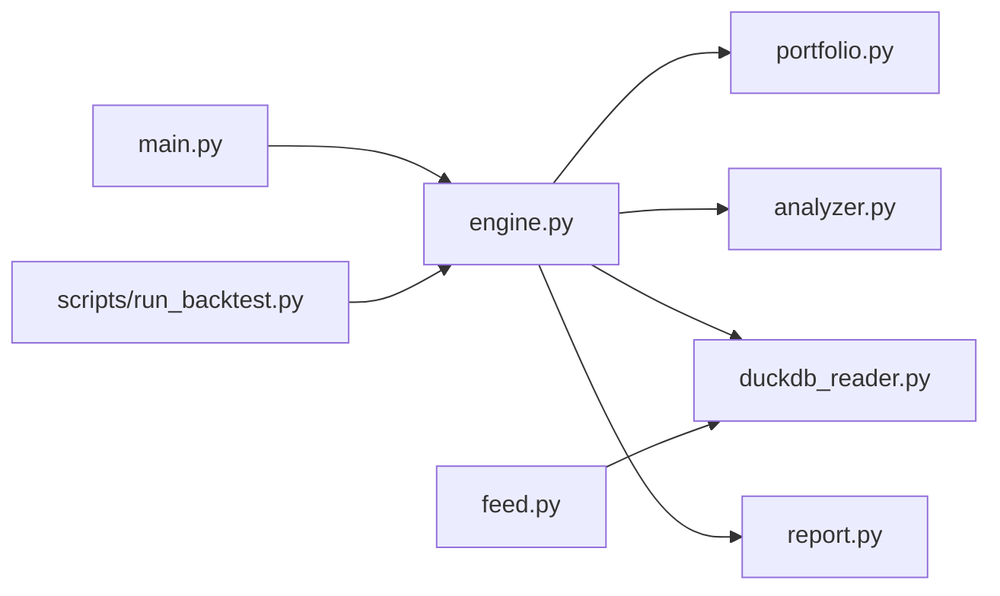

# 指标监控方案

<cite>
**本文引用的文件**   
- [main.py](file://main.py)
- [backtest/engine.py](file://backtest/engine.py)
- [backtest/analyzer.py](file://backtest/analyzer.py)
- [backtest/report.py](file://backtest/report.py)
- [backtest/portfolio.py](file://backtest/portfolio.py)
- [data/duckdb_reader.py](file://data/duckdb_reader.py)
- [data/feed.py](file://data/feed.py)
- [scripts/run_backtest.py](file://scripts/run_backtest.py)
- [config/settings.yaml](file://config/settings.yaml)
- [A股量化框架_五大扩展模块.md](file://A股量化框架_五大扩展模块.md)
- [projects/verification/results/monitoring_indicators.md](file://projects/verification/results/monitoring_indicators.md)
</cite>

## 目录
1. [引言](#引言)
2. [项目结构](#项目结构)
3. [核心组件](#核心组件)
4. [架构总览](#架构总览)
5. [详细组件分析](#详细组件分析)
6. [依赖关系分析](#依赖关系分析)
7. [性能考虑](#性能考虑)
8. [故障排查指南](#故障排查指南)
9. [结论](#结论)
10. [附录](#附录)

## 引言
本方案为 QuantLab 设计一套完整的指标监控体系，覆盖交易指标、性能指标、风控指标与业务指标的采集、计算、存储与可视化。结合现有回测引擎、组合记账、报告输出与数据读取能力，提出可落地的实时/准实时监控方案，并给出数据存储选型、压缩与查询优化建议，以及可视化最佳实践与性能调优要点。

## 项目结构
QuantLab 当前具备完善的回测执行与结果输出能力：
- 主入口与配置加载：main.py、config/settings.yaml
- 回测引擎与指标计算：backtest/engine.py、backtest/analyzer.py
- 组合记账与日快照：backtest/portfolio.py
- 数据读取（DuckDB/Parquet）：data/duckdb_reader.py、data/feed.py
- 报告写入（CSV/JSON/Markdown）：backtest/report.py
- CLI 运行器：scripts/run_backtest.py
- 监控看板参考实现（Streamlit）：A股量化框架_五大扩展模块.md

**图表来源** 
- [main.py:28-92](file://main.py#L28-L92)
- [scripts/run_backtest.py:42-121](file://scripts/run_backtest.py#L42-L121)
- [backtest/engine.py:237-618](file://backtest/engine.py#L237-L618)
- [backtest/portfolio.py:38-189](file://backtest/portfolio.py#L38-L189)
- [backtest/analyzer.py:96-176](file://backtest/analyzer.py#L96-L176)
- [data/duckdb_reader.py:35-215](file://data/duckdb_reader.py#L35-L215)
- [data/feed.py:17-197](file://data/feed.py#L17-L197)
- [backtest/report.py:245-264](file://backtest/report.py#L245-L264)

**章节来源**
- [main.py:28-92](file://main.py#L28-L92)
- [scripts/run_backtest.py:42-121](file://scripts/run_backtest.py#L42-L121)
- [config/settings.yaml:21-28](file://config/settings.yaml#L21-L28)

## 核心组件
- 回测引擎（engine.py）：负责日历构建、数据窗口切片、策略调用、成交填充、组合更新、基准对齐、指标汇总与摘要生成。
- 组合记账（portfolio.py）：维护现金、持仓、市值、未实现盈亏、持有天数，并提供净值曲线与持仓快照行。
- 指标计算（analyzer.py）：基于净值与交易记录计算收益、回撤、夏普、胜率、年化、超额、信息比率、跟踪误差等。
- 数据读取（duckdb_reader.py / feed.py）：提供按日期窗口的日线数据、交易日历、覆盖率统计，支持多源与去重。
- 报告输出（report.py）：将交易、净值、持仓、日志、摘要持久化为 CSV/JSON/Markdown，便于后续监控与可视化。

**章节来源**
- [backtest/engine.py:237-618](file://backtest/engine.py#L237-L618)
- [backtest/portfolio.py:38-189](file://backtest/portfolio.py#L38-L189)
- [backtest/analyzer.py:96-176](file://backtest/analyzer.py#L96-L176)
- [data/duckdb_reader.py:90-205](file://data/duckdb_reader.py#L90-L205)
- [data/feed.py:17-197](file://data/feed.py#L17-L197)
- [backtest/report.py:245-264](file://backtest/report.py#L245-L264)

## 架构总览
下图展示从数据到指标再到可视化的端到端流程，强调“采集—计算—存储—展示”的闭环。

**图表来源** 
- [scripts/run_backtest.py:96-121](file://scripts/run_backtest.py#L96-L121)
- [backtest/engine.py:237-618](file://backtest/engine.py#L237-L618)
- [backtest/portfolio.py:103-189](file://backtest/portfolio.py#L103-L189)
- [backtest/analyzer.py:96-176](file://backtest/analyzer.py#L96-L176)
- [data/duckdb_reader.py:90-205](file://data/duckdb_reader.py#L90-L205)
- [backtest/report.py:245-264](file://backtest/report.py#L245-L264)

## 详细组件分析

### 交易指标监控（成交量、换手率、盈亏统计、持仓分布）
- 数据采集
  - 日线量价字段由 DuckDBReader 统一输出 date/open/high/low/close/vol/amount，可直接用于成交量与成交额统计。
  - 换手率可由 amount/volume 与流通市值或前值价格推导；若需精确换手率，建议在数据层补充 turnover_rate 字段。
- 实时/准实时计算
  - 在 engine 每日循环中，通过 portfolio.equity_row/positions_rows 获取当日资产与持仓快照，作为时序基础。
  - 对每个 code 累计 vol/amount，按日滚动计算换手率与流动性指标（如 Amihud、买卖价差代理）。
- 盈亏统计
  - analyzer._pair_trades 配对买入卖出，计算胜率、平均持有期、单笔盈亏分布；可进一步扩展为按行业/风格归因。
- 持仓分布
  - positions_rows 提供逐日持仓明细，可聚合为个股权重、行业权重、集中度（HHI）、TopN 暴露。

**图表来源** 
- [data/duckdb_reader.py:90-132](file://data/duckdb_reader.py#L90-L132)
- [backtest/portfolio.py:155-189](file://backtest/portfolio.py#L155-L189)
- [backtest/analyzer.py:46-76](file://backtest/analyzer.py#L46-L76)

**章节来源**
- [data/duckdb_reader.py:90-132](file://data/duckdb_reader.py#L90-L132)
- [backtest/portfolio.py:155-189](file://backtest/portfolio.py#L155-L189)
- [backtest/analyzer.py:46-76](file://backtest/analyzer.py#L46-L76)

### 性能指标监控（回测执行时间、内存、CPU、I/O）
- 执行时间
  - engine 已记录 runtime_seconds；可在 CLI 层增加分阶段计时（数据加载、策略评估、成交填充、指标计算、报告写入）。
- 内存/CPU
  - 建议在 Python 进程内使用 psutil 采样 RSS、CPU 占用，按日/批次写入时序库。
- I/O 性能
  - DuckDBReader 使用 read_only 模式与预切索引（cut_index），减少重复扫描；可记录每次 load_window 的耗时与行数。
- 监控落地
  - 将运行时指标追加至 summary 或独立 metrics 表，供看板展示与告警。

**图表来源** 
- [backtest/engine.py:237-618](file://backtest/engine.py#L237-L618)
- [data/duckdb_reader.py:90-205](file://data/duckdb_reader.py#L90-L205)
- [backtest/portfolio.py:103-189](file://backtest/portfolio.py#L103-L189)
- [backtest/analyzer.py:96-176](file://backtest/analyzer.py#L96-L176)

**章节来源**
- [backtest/engine.py:543-549](file://backtest/engine.py#L543-L549)
- [data/duckdb_reader.py:90-132](file://data/duckdb_reader.py#L90-L132)

### 风控指标监控（最大回撤、波动率、集中度风险、流动性风险）
- 最大回撤与波动率
  - analyzer 已计算 max_drawdown、sharpe；可新增年化波动率、下行波动率、VaR/CVaR。
- 集中度风险
  - 基于 positions_rows 聚合个股权重、行业权重，计算 HHI、Top1/Top5 暴露、行业偏离度。
- 流动性风险
  - 基于 vol/amount 估算冲击成本（如 VWAP 偏离、Amihud 非流动性）、日均成交额分位数、停牌占比。
- 预警机制
  - 结合验证文档中的阈值定义，设置多级预警（黄/橙/红）与自动减仓/清仓动作。

**图表来源** 
- [backtest/analyzer.py:18-43](file://backtest/analyzer.py#L18-L43)
- [backtest/portfolio.py:155-189](file://backtest/portfolio.py#L155-L189)
- [projects/verification/results/monitoring_indicators.md:1-63](file://projects/verification/results/monitoring_indicators.md#L1-L63)

**章节来源**
- [backtest/analyzer.py:18-43](file://backtest/analyzer.py#L18-L43)
- [projects/verification/results/monitoring_indicators.md:1-63](file://projects/verification/results/monitoring_indicators.md#L1-L63)

### 业务指标监控（策略收益、基准对比、因子IC、行业表现）
- 策略收益与基准对比
  - engine 已对齐基准收盘价与日收益，analyzer 计算 excess_return、information_ratio、tracking_error。
- 因子IC
  - 可在研究管线中输出因子IC时序，存入时序库；看板展示 IC均值/标准差/ICIR、滚动均值与相关性矩阵。
- 行业表现
  - 基于 industry_map 与 positions 聚合行业收益贡献与暴露，进行归因分析。

**图表来源** 
- [backtest/engine.py:38-99](file://backtest/engine.py#L38-L99)
- [backtest/analyzer.py:78-93](file://backtest/analyzer.py#L78-L93)
- [A股量化框架_五大扩展模块.md:1705-2117](file://A股量化框架_五大扩展模块.md#L1705-L2117)

**章节来源**
- [backtest/engine.py:38-99](file://backtest/engine.py#L38-L99)
- [backtest/analyzer.py:78-93](file://backtest/analyzer.py#L78-L93)
- [A股量化框架_五大扩展模块.md:1705-2117](file://A股量化框架_五大扩展模块.md#L1705-L2117)

### 指标数据存储方案（时序数据库、压缩、历史查询优化）
- 存储选型
  - 推荐时序数据库（如 InfluxDB/TimescaleDB/DuckDB 时序扩展），以 time-series 为主键，支持高吞吐写入与高效聚合。
- 数据模型
  - 交易指标：date, code, vol, amount, turnover_rate, pnl, holding_days
  - 组合指标：date, total_asset, cash, market_value, daily_return, benchmark_close, benchmark_return
  - 风控指标：date, mdd, volatility, concentration_hhi, liquidity_amihud
  - 业务指标：date, strategy_return, benchmark_return, excess_return, ic_series, sector_exposure
- 压缩与归档
  - 原始高频数据采用列式压缩（ZSTD/LZ4），按月/季度归档；热点数据保留近 12 个月。
- 查询优化
  - 建立 (date, code) 复合索引；常用聚合（sum/mean/max/min）物化视图；分区表按 date 分区。

[本节为概念性内容，不直接分析具体文件]

### 指标可视化展示与性能调优
- 可视化最佳实践
  - 净值曲线与回撤同屏展示；月度收益热力图；因子IC时序与相关性矩阵；持仓分布饼图/条形图。
  - 使用 Streamlit 看板，结合 Plotly 交互筛选（日期范围、标的、因子）。
- 性能调优
  - 数据层：DuckDB 只读连接、批量 SQL、避免全表扫描；缓存 coverage 与 cut_index。
  - 计算层：向量化计算（pandas/numpy），避免逐条循环；增量更新指标而非全量重算。
  - 展示层：前端分页/懒加载，后端缓存（TTL），按需刷新。

**章节来源**
- [A股量化框架_五大扩展模块.md:1705-2117](file://A股量化框架_五大扩展模块.md#L1705-L2117)

## 依赖关系分析
- 模块耦合
  - engine 强依赖 portfolio、analyzer、reader；report 仅消费 engine 输出。
- 外部依赖
  - DuckDB 读取、Pandas/Numpy 计算、YAML 配置、Plotly/Streamlit 可视化。
- 潜在循环依赖
  - 当前无循环导入；保持 reader/engine/report 单向依赖。

**图表来源** 
- [backtest/engine.py:237-618](file://backtest/engine.py#L237-L618)
- [backtest/portfolio.py:38-189](file://backtest/portfolio.py#L38-L189)
- [backtest/analyzer.py:96-176](file://backtest/analyzer.py#L96-L176)
- [data/duckdb_reader.py:35-215](file://data/duckdb_reader.py#L35-L215)
- [data/feed.py:17-197](file://data/feed.py#L17-L197)
- [main.py:28-92](file://main.py#L28-L92)
- [scripts/run_backtest.py:42-121](file://scripts/run_backtest.py#L42-L121)

**章节来源**
- [backtest/engine.py:237-618](file://backtest/engine.py#L237-L618)
- [data/duckdb_reader.py:35-215](file://data/duckdb_reader.py#L35-L215)

## 性能考虑
- 数据读取
  - 使用 DuckDB 只读模式与预切索引，减少重复扫描；合理选择 adjustment/source 过滤条件。
- 计算效率
  - 指标计算尽量向量化；避免在每日循环中进行昂贵操作（如全量排序/合并）。
- 存储与查询
  - 时序库分区与索引；冷热数据分离；常用指标物化。
- 可视化
  - 前端分页与缓存；后端 TTL 缓存；按需刷新。

[本节为通用指导，不直接分析具体文件]

## 故障排查指南
- 常见问题
  - 基准不可用：检查 benchmark_db_path 与数据可用性；engine 会记录 benchmark_note。
  - 数据同步冲突：DuckDB WAL 检测提示数据可能正在同步，需等待同步完成并重跑。
  - 样本期过短：summary.sample_period_warning 提示样本不足，谨慎解读年化指标。
- 定位方法
  - 查看 logs.txt 与 report.md 的 WARN/ERROR 摘录；核对 trades.csv/equity_curve.csv/positions.csv 一致性。
  - 使用 CLI 打印的关键指标快速校验（total_return/annual_return/max_drawdown/sharpe/n_trades）。

**章节来源**
- [backtest/engine.py:485-489](file://backtest/engine.py#L485-L489)
- [data/duckdb_reader.py:63-75](file://data/duckdb_reader.py#L63-L75)
- [backtest/report.py:78-108](file://backtest/report.py#L78-L108)
- [scripts/run_backtest.py:118-127](file://scripts/run_backtest.py#L118-L127)

## 结论
本方案在现有回测与报告基础上，构建了覆盖交易、性能、风控与业务的完整指标监控体系。通过标准化数据模型、时序存储与可视化看板，可实现从数据采集到决策支持的闭环。建议优先落地“净值/回撤/波动/集中度/流动性”等关键指标，逐步扩展因子IC与行业归因，形成持续演进的监控平台。

[本节为总结性内容，不直接分析具体文件]

## 附录
- 监控看板参考实现（Streamlit）：包含策略概览、因子分析、持仓管理、交易记录与系统设置页面，可作为可视化模板。
- 实盘监控指标定义：涵盖每日/每周/每月/每季度监控项与阈值，指导预警与处置流程。

**章节来源**
- [A股量化框架_五大扩展模块.md:1705-2117](file://A股量化框架_五大扩展模块.md#L1705-L2117)
- [projects/verification/results/monitoring_indicators.md:1-63](file://projects/verification/results/monitoring_indicators.md#L1-L63)