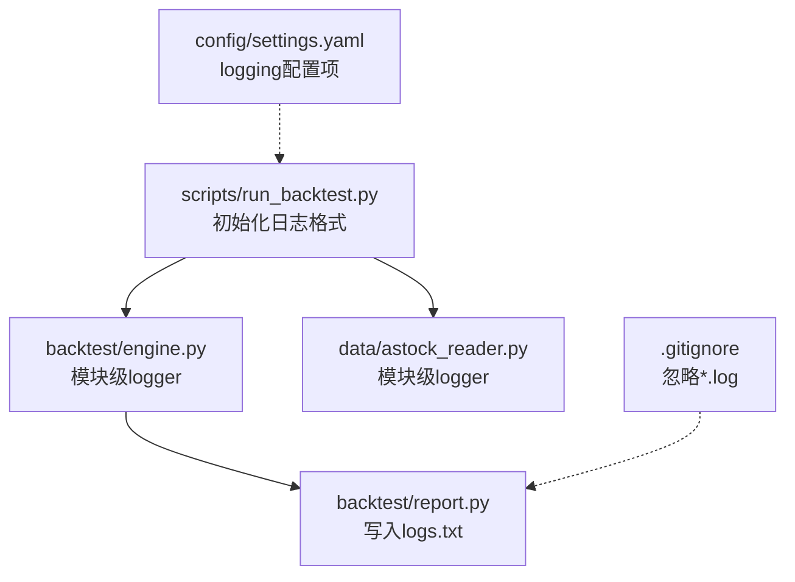
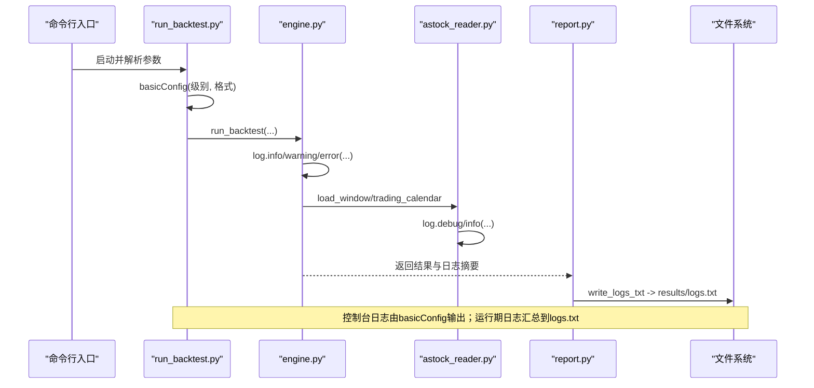
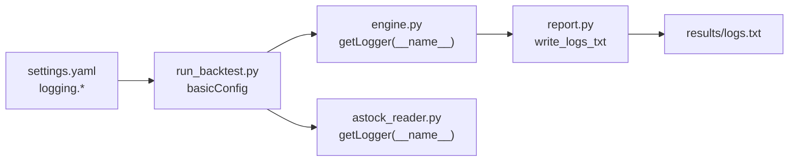

# 日志系统配置

<cite>
**本文引用的文件**   
- [config/settings.yaml](file://config/settings.yaml)
- [scripts/run_backtest.py](file://scripts/run_backtest.py)
- [backtest/engine.py](file://backtest/engine.py)
- [backtest/report.py](file://backtest/report.py)
- [data/astock_reader.py](file://data/astock_reader.py)
- [miniQMT实盘对接_生产级完善方案.md](file://miniQMT实盘对接_生产级完善方案.md)
- [.gitignore](file://.gitignore)
</cite>

## 目录
1. [简介](#简介)
2. [项目结构](#项目结构)
3. [核心组件](#核心组件)
4. [架构总览](#架构总览)
5. [详细组件分析](#详细组件分析)
6. [依赖关系分析](#依赖关系分析)
7. [性能考虑](#性能考虑)
8. [故障排查指南](#故障排查指南)
9. [结论](#结论)
10. [附录](#附录)

## 简介
本指南面向 QuantLab 的日志系统，提供从格式规范、分级策略、文件轮转、远程收集到查询分析与性能优化的完整配置与使用建议。当前仓库中：
- 回测脚本通过 logging.basicConfig 统一输出控制台日志；
- 各模块通过 logging.getLogger(__name__) 获取模块级 logger；
- 全局配置文件 settings.yaml 包含 logging 相关字段（级别、目录、文件大小、保留数量）；
- 报告模块将运行期日志汇总为 logs.txt 并写入结果目录；
- 文档示例展示了生产环境按日切分文件的 FileHandler 用法。

本指南基于上述实现进行系统化整理，并给出可落地的最佳实践与扩展方案。

## 项目结构
QuantLab 的日志相关代码分布在入口脚本、引擎与数据读取模块，以及报告生成模块中。整体组织方式如下：
- 入口脚本负责初始化日志格式与级别；
- 业务模块通过标准库 logging 记录结构化信息；
- 报告模块聚合运行期日志与告警，形成可归档的 logs.txt；
- 全局配置集中管理日志路径与轮转参数（待落地）。

图表来源 
- [scripts/run_backtest.py:42-44](file://scripts/run_backtest.py#L42-L44)
- [backtest/engine.py:27](file://backtest/engine.py#L27)
- [data/astock_reader.py:19](file://data/astock_reader.py#L19)
- [backtest/report.py:111-121](file://backtest/report.py#L111-L121)
- [config/settings.yaml:31-35](file://config/settings.yaml#L31-L35)
- [.gitignore:12-13](file://.gitignore#L12-L13)

章节来源
- [scripts/run_backtest.py:42-44](file://scripts/run_backtest.py#L42-L44)
- [backtest/engine.py:27](file://backtest/engine.py#L27)
- [data/astock_reader.py:19](file://data/astock_reader.py#L19)
- [backtest/report.py:111-121](file://backtest/report.py#L111-L121)
- [config/settings.yaml:31-35](file://config/settings.yaml#L31-L35)
- [.gitignore:12-13](file://.gitignore#L12-L13)

## 核心组件
- 日志初始化与格式
  - 入口脚本通过 basicConfig 设置级别与格式化模板，确保控制台输出一致可读。
- 模块级 Logger
  - 各模块使用 getLogger(__name__) 获得命名空间隔离的 logger，便于定位来源。
- 报告聚合
  - report.write_logs_txt 将警告与每日日志行写入 results_dir/logs.txt，便于归档与分析。
- 配置项
  - settings.yaml 定义了 logging.level、dir、max_file_size、backup_count，作为后续轮转与存储策略的配置基础。

章节来源
- [scripts/run_backtest.py:42-44](file://scripts/run_backtest.py#L42-L44)
- [backtest/engine.py:27](file://backtest/engine.py#L27)
- [data/astock_reader.py:19](file://data/astock_reader.py#L19)
- [backtest/report.py:111-121](file://backtest/report.py#L111-L121)
- [config/settings.yaml:31-35](file://config/settings.yaml#L31-L35)

## 架构总览
下图展示回测执行过程中日志的产生、流转与落盘路径，以及配置的作用点。

图表来源 
- [scripts/run_backtest.py:42-44](file://scripts/run_backtest.py#L42-L44)
- [backtest/engine.py:27](file://backtest/engine.py#L27)
- [data/astock_reader.py:19](file://data/astock_reader.py#L19)
- [backtest/report.py:111-121](file://backtest/report.py#L111-L121)

## 详细组件分析

### 日志格式规范
- 时间戳
  - 使用 Python 标准库 time 或 datetime 生成的 ISO/可读时间串，建议在格式中包含时区或偏移说明（如 UTC+8），以便跨机器对齐。
- 级别
  - DEBUG：调试细节（变量快照、中间状态），仅在开发或问题复现时开启。
  - INFO：关键流程节点（开始/结束、加载数据、策略切换等）。
  - WARNING：潜在风险（数据缺失、阈值接近、重试次数增加）。
  - ERROR：错误事件（异常堆栈、外部依赖失败）。
  - CRITICAL：致命错误（进程退出前必须记录）。
- 模块名
  - 使用 __name__ 作为 logger 名称，保证来源可追溯。
- 消息内容
  - 结构化优先：键值对形式（JSON 片段）便于检索；非结构化文本需保持简洁、含上下文（日期、标的、窗口、指标）。
- 编码
  - 统一 UTF-8，避免 Windows 终端 codepage 差异导致乱码。

章节来源
- [scripts/run_backtest.py:42-44](file://scripts/run_backtest.py#L42-L44)
- [backtest/engine.py:27](file://backtest/engine.py#L27)
- [data/astock_reader.py:19](file://data/astock_reader.py#L19)

### 日志分级机制与最佳实践
- 使用场景
  - DEBUG：数据加载进度、中间 DataFrame 形状、循环迭代计数。
  - INFO：回测起止、基准加载、策略初始化、交易信号触发。
  - WARNING：行情缺失、未覆盖标的、指标计算异常回退。
  - ERROR：IO 失败、网络超时、序列化异常。
  - CRITICAL：主循环崩溃、资金账户不可用。
- 最佳实践
  - 避免在高频循环中打印大量 INFO/DEBUG，必要时采样或降频。
  - 对敏感信息脱敏（账号、密钥）。
  - 统一异常捕获并在 ERROR/CRITICAL 层记录堆栈。
  - 结合上下文字段（date、code、strategy_name）提升可检索性。

章节来源
- [backtest/engine.py:27](file://backtest/engine.py#L27)
- [data/astock_reader.py:19](file://data/astock_reader.py#L19)

### 文件轮转配置
- 现状
  - settings.yaml 已定义 logging.dir、max_file_size、backup_count，但尚未被运行时自动应用。
- 推荐实现
  - 使用 RotatingFileHandler 或 TimedRotatingFileHandler，依据 max_file_size 与 backup_count 控制大小与保留数；可按日切分以简化归档。
  - 将 dir 指向独立日志目录，避免与结果目录混放。
  - 压缩策略：对超过 N 天的历史日志启用 gzip 压缩，降低磁盘占用。
- 配置映射
  - level → basicConfig(level=...)
  - dir → handler(baseFilename=...)
  - max_file_size → RotatingFileHandler(maxBytes=...)
  - backup_count → RotatingFileHandler(backupCount=...)

章节来源
- [config/settings.yaml:31-35](file://config/settings.yaml#L31-L35)

### 远程日志收集方案
- 目标
  - 聚合多机日志、实时传输、统一存储与检索。
- 可选方案
  - 本地文件 + 采集器：Filebeat/Fluent Bit 监控日志目录，转发至 Kafka/Elasticsearch/对象存储。
  - 直接发送：HTTP/UDP/Syslog 客户端将日志推送到远端服务（如 Logstash、OpenSearch、云厂商日志服务）。
- 存储后端
  - Elasticsearch/OpenSearch：结构化索引、全文检索、可视化看板。
  - 时序数据库：用于指标型日志（延迟、吞吐、错误率）。
- 安全与合规
  - 传输加密（TLS）、鉴权（Token/证书）、脱敏规则。

章节来源
- [miniQMT实盘对接_生产级完善方案.md:1148-1156](file://miniQMT实盘对接_生产级完善方案.md#L1148-L1156)

### 日志查询与分析工具
- 本地快速检索
  - grep/awk：按级别、模块、关键字过滤；结合正则提取字段。
  - jq：处理 JSON 日志片段。
- 集中式分析
  - ELK Stack（Elasticsearch + Logstash + Kibana）：索引、聚合、可视化。
  - Grafana + Loki：轻量时序化日志与仪表盘。
- 常用模式
  - 按日期范围与级别筛选错误；统计某模块错误占比；关联交易时段与异常峰值。

章节来源
- [backtest/report.py:111-121](file://backtest/report.py#L111-L121)

### 回测日志落盘与归档
- 运行期日志
  - report.write_logs_txt 将警告块与每日日志行写入 results_dir/logs.txt，便于单次运行归档。
- 归档建议
  - 每次运行生成独立结果目录（含 summary.json、trades.csv、equity_curve.csv、positions.csv、logs.txt、report.md）。
  - 将 logs.txt 纳入版本化管理或对象存储，配合元数据（策略名、哈希、时间戳）检索。

章节来源
- [backtest/report.py:111-121](file://backtest/report.py#L111-L121)

## 依赖关系分析
- 入口脚本依赖 logging 标准库，设置全局格式；
- 引擎与数据读取模块依赖模块级 logger；
- 报告模块依赖文件系统写入；
- 配置项来自 settings.yaml，供上层集成轮转处理器。

图表来源 
- [config/settings.yaml:31-35](file://config/settings.yaml#L31-L35)
- [scripts/run_backtest.py:42-44](file://scripts/run_backtest.py#L42-L44)
- [backtest/engine.py:27](file://backtest/engine.py#L27)
- [data/astock_reader.py:19](file://data/astock_reader.py#L19)
- [backtest/report.py:111-121](file://backtest/report.py#L111-L121)

章节来源
- [config/settings.yaml:31-35](file://config/settings.yaml#L31-L35)
- [scripts/run_backtest.py:42-44](file://scripts/run_backtest.py#L42-L44)
- [backtest/engine.py:27](file://backtest/engine.py#L27)
- [data/astock_reader.py:19](file://data/astock_reader.py#L19)
- [backtest/report.py:111-121](file://backtest/report.py#L111-L121)

## 性能考虑
- 日志 I/O 开销
  - 减少高频 INFO/DEBUG 输出；批量合并日志；异步写入（线程池/队列）。
- 缓冲与刷新
  - 合理设置缓冲区大小与刷新频率，避免频繁 fsync。
- 轮转与压缩
  - 按大小/时间切分，历史日志压缩归档，降低磁盘压力。
- 编码与字符集
  - 统一 UTF-8，避免解码失败导致的额外开销。
- 采样与限流
  - 对热点路径采用采样策略（如每 N 条记录一次）。

[本节为通用指导，不直接分析具体文件]

## 故障排查指南
- 常见问题
  - 日志为空：检查 basicConfig 是否调用成功、handler 是否挂载、权限与路径是否正确。
  - 中文乱码：确认终端与文件编码均为 UTF-8。
  - 文件过大：调整 max_file_size 与 backup_count，启用压缩。
  - 无法定位来源：确保每个模块使用 getLogger(__name__)。
- 定位方法
  - 先查 ERROR/CRITICAL，再回溯 WARNING；结合时间戳与模块名缩小范围。
  - 使用 grep/awk 过滤关键字与模块名；ELK/Kibana 做聚合与趋势分析。
- 恢复策略
  - 临时提高级别至 DEBUG 复现问题；完成后回退至 INFO/WARNING。

章节来源
- [scripts/run_backtest.py:42-44](file://scripts/run_backtest.py#L42-L44)
- [backtest/report.py:111-121](file://backtest/report.py#L111-L121)
- [.gitignore:12-13](file://.gitignore#L12-L13)

## 结论
QuantLab 当前日志体系以标准库 logging 为核心，入口脚本统一格式，模块级 logger 隔离来源，报告模块聚合运行期日志。建议在此基础上引入文件轮转、压缩与远程收集，构建统一的日志基础设施，提升可观测性与可维护性。

[本节为总结性内容，不直接分析具体文件]

## 附录

### 日志格式模板建议
- 控制台模板
  - 包含时间戳、级别、模块名、消息内容，便于快速阅读。
- 文件模板
  - 建议结构化（JSON）为主，辅以必要的人类可读字段（时间、级别、模块、消息）。

章节来源
- [scripts/run_backtest.py:42-44](file://scripts/run_backtest.py#L42-L44)

### 文件轮转配置要点
- 大小限制：根据运行规模设定单文件大小上限。
- 保留策略：保留最近 N 个文件，超出则删除或归档。
- 压缩设置：对历史日志启用 gzip，平衡检索与存储成本。

章节来源
- [config/settings.yaml:31-35](file://config/settings.yaml#L31-L35)

### 远程收集与存储
- 采集器：Filebeat/Fluent Bit 监控日志目录。
- 传输：Kafka/HTTP/Syslog。
- 存储：Elasticsearch/OpenSearch 或云日志服务。
- 可视化：Kibana/Grafana 看板。

章节来源
- [miniQMT实盘对接_生产级完善方案.md:1148-1156](file://miniQMT实盘对接_生产级完善方案.md#L1148-L1156)

### 常见查询命令参考
- 按级别过滤
  - grep -i "ERROR\|WARNING" logs.txt
- 按模块过滤
  - grep "engine.py\|astock_reader.py" logs.txt
- 时间段筛选
  - awk '/2026-08-03/,/2026-08-04/' logs.txt

[本节为通用指导，不直接分析具体文件]