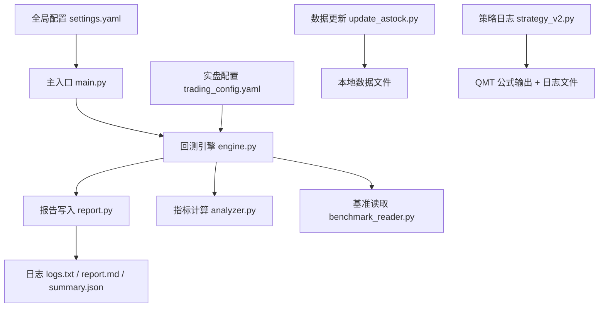
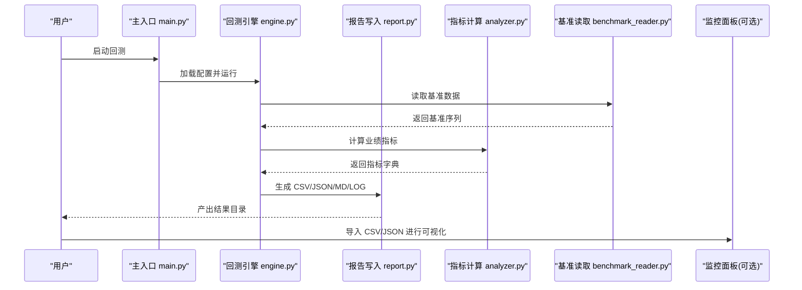
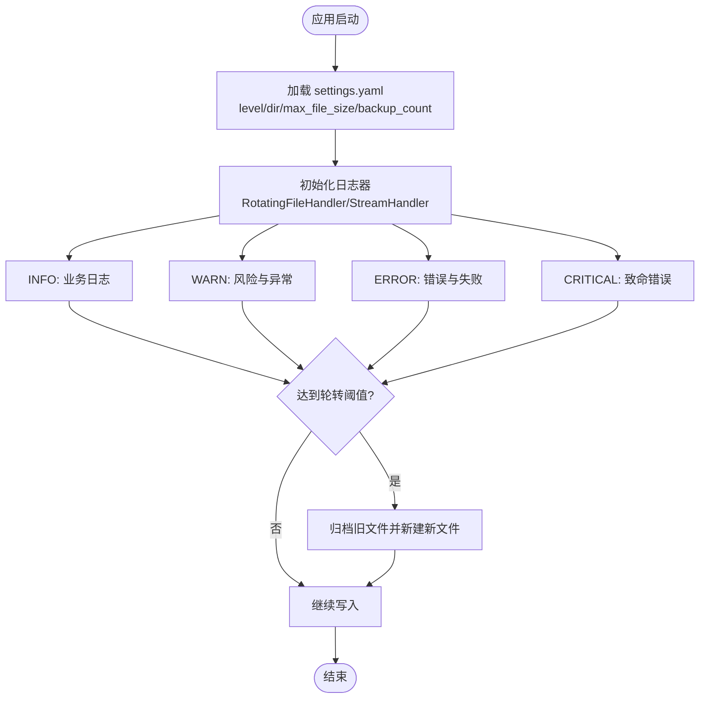
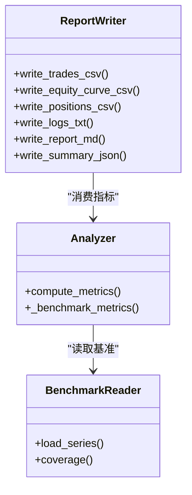
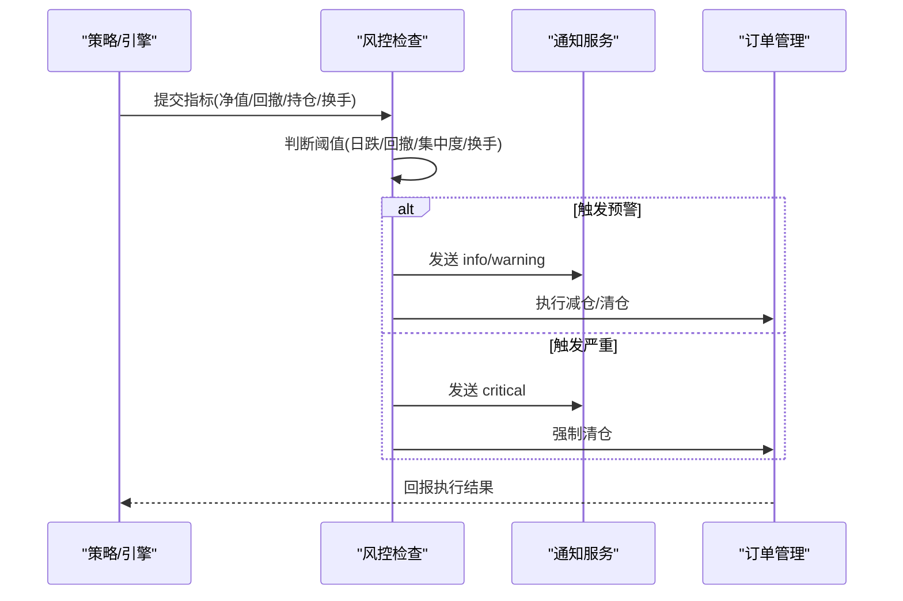
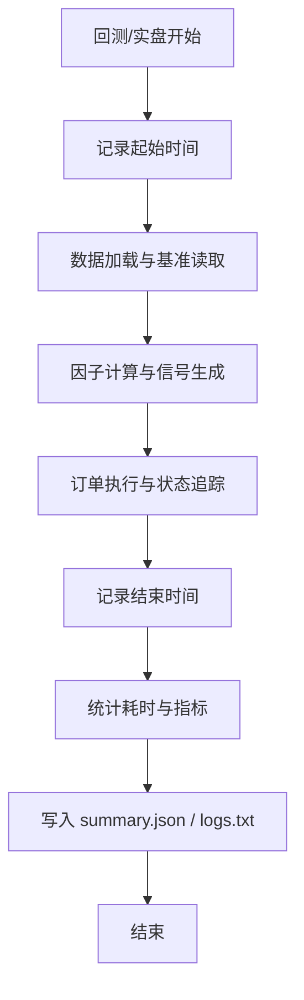
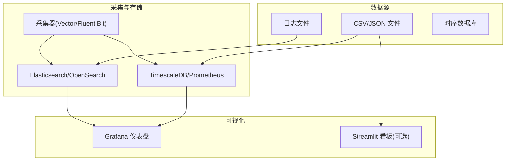
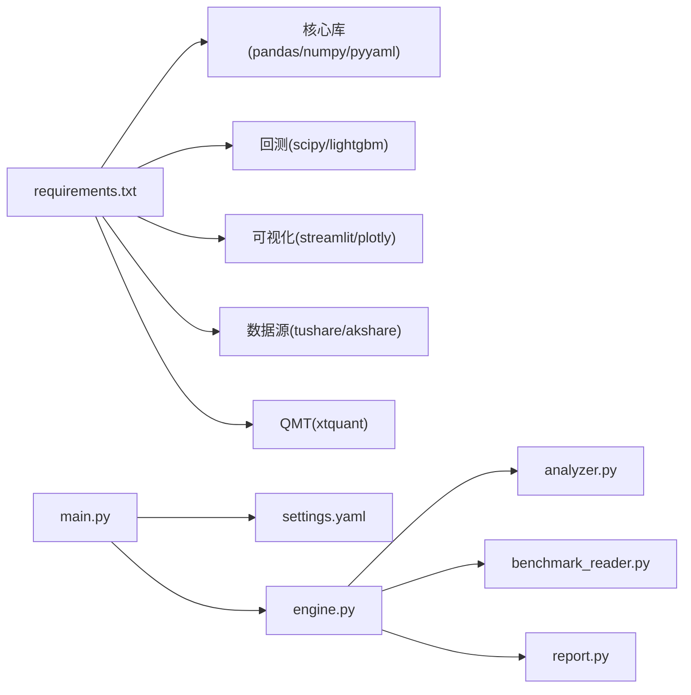

# 监控系统搭建

<cite>
**本文引用的文件**   
- [main.py](file://main.py)
- [settings.yaml](file://config/settings.yaml)
- [trading_config.yaml](file://config/trading_config.yaml)
- [report.py](file://backtest/report.py)
- [engine.py](file://backtest/engine.py)
- [analyzer.py](file://backtest/analyzer.py)
- [benchmark_reader.py](file://data/benchmark_reader.py)
- [update_astock.py](file://scripts/update_astock.py)
- [daily_order_test.py](file://scripts/daily_order_test.py)
- [strategy_v2.py](file://projects/Project_10_价值小盘V2/strategy_v2.py)
- [monitoring_indicators.md](file://projects/verification/results/monitoring_indicators.md)
- [A股量化框架_五大扩展模块.md](file://A股量化框架_五大扩展模块.md)
- [requirements.txt](file://requirements.txt)
</cite>

## 目录
1. [简介](#简介)
2. [项目结构](#项目结构)
3. [核心组件](#核心组件)
4. [架构总览](#架构总览)
5. [详细组件分析](#详细组件分析)
6. [依赖关系分析](#依赖关系分析)
7. [性能考量](#性能考量)
8. [故障排查指南](#故障排查指南)
9. [结论](#结论)
10. [附录](#附录)

## 简介
本指南面向 QuantLab 的监控体系搭建，覆盖日志系统、指标监控、告警机制、性能追踪与监控面板（Grafana）配置。内容基于仓库现有实现与文档进行系统化梳理，并给出可落地的落地方案与最佳实践，帮助读者从零构建生产级监控。

## 项目结构
QuantLab 当前已具备回测报告输出、基础日志记录、交易配置与通知通道等能力，可作为监控体系的基石：
- 回测产物与日志：backtest/report.py 负责生成 trades.csv、equity_curve.csv、positions.csv、logs.txt、report.md、summary.json，并在 logs.txt 中固定顺序输出 WARN 块。
- 全局配置：config/settings.yaml 定义了日志级别、日志目录、轮转大小与备份数量；config/trading_config.yaml 定义实盘参数、风控阈值、调度与通知渠道。
- 引擎与指标：backtest/engine.py 与 backtest/analyzer.py 计算业绩指标、基准对比、样本期警告等；data/benchmark_reader.py 提供基准数据读取。
- 脚本与日志：scripts/update_astock.py 使用 print 输出进度；策略侧 strategy_v2.py 将业务日志写入文件并打印到 QMT 公式输出窗口。
- 监控看板参考：A股量化框架_五大扩展模块.md 提供了 Streamlit 监控看板示例，便于快速搭建可视化界面。

**图表来源** 
- [main.py:21-35](file://main.py#L21-L35)
- [engine.py:41-71](file://backtest/engine.py#L41-L71)
- [report.py:111-121](file://backtest/report.py#L111-L121)
- [analyzer.py:78-99](file://backtest/analyzer.py#L78-L99)
- [benchmark_reader.py:21-42](file://data/benchmark_reader.py#L21-L42)
- [update_astock.py:38-50](file://scripts/update_astock.py#L38-L50)
- [strategy_v2.py:74-93](file://projects/Project_10_价值小盘V2/strategy_v2.py#L74-L93)

**章节来源**
- [main.py:21-35](file://main.py#L21-L35)
- [settings.yaml:31-36](file://config/settings.yaml#L31-L36)
- [trading_config.yaml:37-41](file://config/trading_config.yaml#L37-L41)
- [report.py:111-121](file://backtest/report.py#L111-L121)
- [engine.py:479-522](file://backtest/engine.py#L479-L522)
- [analyzer.py:78-99](file://backtest/analyzer.py#L78-L99)
- [benchmark_reader.py:21-42](file://data/benchmark_reader.py#L21-L42)
- [update_astock.py:38-50](file://scripts/update_astock.py#L38-L50)
- [strategy_v2.py:74-93](file://projects/Project_10_价值小盘V2/strategy_v2.py#L74-L93)

## 核心组件
- 日志系统
  - 全局日志配置：settings.yaml 指定 level、dir、max_file_size、backup_count，为后续轮转与归档提供依据。
  - 回测日志：report.py 在 logs.txt 中按固定顺序输出 WARN 块，随后追加每日日志行。
  - 策略日志：strategy_v2.py 将时间戳与消息写入 UTF-8 日志文件，同时打印到 QMT 公式输出窗口。
  - 数据更新日志：update_astock.py 通过 print 输出关键步骤，便于控制台观察。
- 指标监控
  - 回测指标：engine.py 与 analyzer.py 计算收益、回撤、夏普、跟踪误差、信息比率等，并输出至 report.md 与 summary.json。
  - 基准数据：benchmark_reader.py 提供只读接口，确保基准可用性与数据完整性。
- 告警机制
  - 配置化通知：trading_config.yaml 支持 wechat/dingtalk/email 及 webhook_url，结合 broker 回调发送通知。
  - 风控阈值：trading_config.yaml 定义止损、最大回撤、换手率等阈值，作为告警触发条件。
- 性能追踪
  - 回测耗时：engine.py 统计 runtime_seconds 并写入 summary.json。
  - 数据更新耗时：update_astock.py 输出处理耗时与进度。
  - 延迟观测：strategy_v2.py 使用市场时间戳，便于评估执行时延。

**章节来源**
- [settings.yaml:31-36](file://config/settings.yaml#L31-L36)
- [report.py:78-108](file://backtest/report.py#L78-L108)
- [report.py:111-121](file://backtest/report.py#L111-L121)
- [strategy_v2.py:74-93](file://projects/Project_10_价值小盘V2/strategy_v2.py#L74-L93)
- [update_astock.py:38-50](file://scripts/update_astock.py#L38-L50)
- [engine.py:479-522](file://backtest/engine.py#L479-L522)
- [analyzer.py:78-99](file://backtest/analyzer.py#L78-L99)
- [benchmark_reader.py:21-42](file://data/benchmark_reader.py#L21-L42)
- [trading_config.yaml:37-41](file://config/trading_config.yaml#L37-L41)

## 架构总览
下图展示从配置加载、回测运行、指标计算、日志输出到监控可视化的整体流程。

**图表来源** 
- [main.py:21-35](file://main.py#L21-L35)
- [engine.py:41-71](file://backtest/engine.py#L41-L71)
- [analyzer.py:78-99](file://backtest/analyzer.py#L78-L99)
- [benchmark_reader.py:21-42](file://data/benchmark_reader.py#L21-L42)
- [report.py:111-121](file://backtest/report.py#L111-L121)

## 详细组件分析

### 日志系统设计与配置
- 日志格式规范
  - 统一时间戳：优先使用市场时间（如 QMT 提供的 tick/bar 时间），否则回退到系统时间。
  - 结构化字段：包含 run_id、date、code、side、volume、price、amount、slippage_amt、commission、tax、reason、layer、model 等关键字段，便于解析与聚合。
  - 固定 WARN 块：logs.txt 开头按固定顺序输出样本期警告、基准不可用、去重计数、sector_heat_mode=zero、.wal 检测等告警。
- 分级记录
  - 建议采用 INFO/WARN/ERROR/CRITICAL 四级，策略层以 INFO 为主，异常与失败以 ERROR/CRITICAL 输出。
  - 回测引擎与数据读取模块统一使用 logging.getLogger(__name__) 输出，避免重复 handler。
- 文件轮转
  - 通过 settings.yaml 的 max_file_size 与 backup_count 控制单文件大小与历史保留数量。
  - 建议使用 Python logging.handlers.RotatingFileHandler 或第三方库（如 loguru）实现自动轮转与压缩归档。
- 远程收集
  - 推荐将日志输出到标准输出（stdout），由容器或进程管理器（systemd/supervisor）转发至 ELK/Fluent Bit/Vector。
  - 对 QMT 策略日志，可将 FormulaOutput 与业务日志分别采集，注意编码差异（UTF-8 vs GBK）。

**图表来源** 
- [settings.yaml:31-36](file://config/settings.yaml#L31-L36)
- [report.py:78-108](file://backtest/report.py#L78-L108)
- [report.py:111-121](file://backtest/report.py#L111-L121)
- [strategy_v2.py:74-93](file://projects/Project_10_价值小盘V2/strategy_v2.py#L74-L93)
- [update_astock.py:38-50](file://scripts/update_astock.py#L38-L50)

**章节来源**
- [settings.yaml:31-36](file://config/settings.yaml#L31-L36)
- [report.py:78-108](file://backtest/report.py#L78-L108)
- [report.py:111-121](file://backtest/report.py#L111-L121)
- [strategy_v2.py:74-93](file://projects/Project_10_价值小盘V2/strategy_v2.py#L74-L93)
- [update_astock.py:38-50](file://scripts/update_astock.py#L38-L50)

### 指标监控方案
- 交易指标
  - 净值曲线：equity_curve.csv 包含 total_asset、cash、market_value、daily_return、benchmark_close、benchmark_return。
  - 交易明细：trades.csv 包含 run_id、date、code、side、volume、price、amount、slippage_amt、commission、tax、reason、layer、model。
  - 持仓快照：positions.csv 包含 run_id、date、code、volume、available_volume、cost_price、last_price、unrealized_pnl、holding_days。
- 性能指标
  - 年化收益、最大回撤、夏普比率、Calmar 比率、胜率、交易次数等由 analyzer.py 计算并写入 report.md 与 summary.json。
  - 基准对比：基准收益率、超额收益、信息比率、跟踪误差由 engine.py 与 analyzer.py 协同计算。
- 风控指标
  - 组合最大回撤、单日跌幅、行业集中度、换手率等阈值在 trading_config.yaml 中定义，用于触发告警与自动减仓/清仓。
- 业务指标
  - 因子 IC、信号质量（平均 ROE、负债率）、容量检查（冲击成本估算）等由 verification 文档定义，可按周/月/季维度汇总。

**图表来源** 
- [report.py:60-75](file://backtest/report.py#L60-L75)
- [report.py:138-233](file://backtest/report.py#L138-L233)
- [analyzer.py:78-99](file://backtest/analyzer.py#L78-L99)
- [benchmark_reader.py:21-42](file://data/benchmark_reader.py#L21-L42)

**章节来源**
- [report.py:60-75](file://backtest/report.py#L60-L75)
- [report.py:138-233](file://backtest/report.py#L138-L233)
- [analyzer.py:78-99](file://backtest/analyzer.py#L78-L99)
- [engine.py:479-522](file://backtest/engine.py#L479-L522)
- [monitoring_indicators.md:1-69](file://projects/verification/results/monitoring_indicators.md#L1-L69)

### 告警机制设计
- 阈值设置
  - 净值单日跌幅 > 3% 预警；回撤 > 10%/15%/20% 分别触发黄/橙/红三级；单股占比 > 5% 预警；行业集中度 > 25% 预警。
  - 换手率周度 > 30% 预警；平均 ROE < 3% 或平均负债率 > 70% 预警；连续2个月跑输基准评估权重调整。
- 告警规则
  - 基于 trading_config.yaml 中的 risk 与 order 配置，结合实时指标（净值、回撤、持仓、换手）判定是否触发。
  - 对未成交委托启用超时监控（默认 300s），自动撤单并通知。
- 通知渠道
  - 支持企业微信/钉钉 Webhook，trading_config.yaml 配置 webhook_url 与 method。
  - 建议在 broker 回调中统一封装 _notify，保证通知失败不影响主流程。
- 告警升级
  - 多级阈值对应不同处理动作（记录、减仓、清仓），并通过通知渠道逐级升级（info/warning/critical）。

**图表来源** 
- [trading_config.yaml:37-41](file://config/trading_config.yaml#L37-L41)
- [monitoring_indicators.md:1-69](file://projects/verification/results/monitoring_indicators.md#L1-L69)

**章节来源**
- [trading_config.yaml:37-41](file://config/trading_config.yaml#L37-L41)
- [monitoring_indicators.md:1-69](file://projects/verification/results/monitoring_indicators.md#L1-L69)

### 性能追踪方案
- 回测性能
  - engine.py 统计 runtime_seconds 并写入 summary.json，便于比较不同配置的回测耗时。
  - 数据读取与基准加载过程应记录耗时与异常，便于定位瓶颈。
- 实盘延迟
  - 使用 QMT 市场时间戳（tick/bar time）计算下单、成交、撤单的端到端延迟。
  - 对未成交委托启用超时监控，记录等待时长与重试次数。
- 资源使用
  - 监控 CPU、内存、磁盘 IO 与网络请求（Webhook）耗时，必要时引入 psutil/prometheus 客户端。
- 瓶颈分析
  - 通过日志中的耗时字段与指标计算路径，识别数据加载、因子计算、基准读取、订单执行的热点。

**图表来源** 
- [engine.py:479-522](file://backtest/engine.py#L479-L522)
- [strategy_v2.py:74-93](file://projects/Project_10_价值小盘V2/strategy_v2.py#L74-L93)
- [update_astock.py:38-50](file://scripts/update_astock.py#L38-L50)

**章节来源**
- [engine.py:479-522](file://backtest/engine.py#L479-L522)
- [strategy_v2.py:74-93](file://projects/Project_10_价值小盘V2/strategy_v2.py#L74-L93)
- [update_astock.py:38-50](file://scripts/update_astock.py#L38-L50)

### 监控面板搭建（Grafana）
- 数据源准备
  - 将 equity_curve.csv、trades.csv、positions.csv、summary.json 导入时序数据库（Prometheus/TimescaleDB）或对象存储（S3/OSS）供 Grafana 查询。
  - 对 logs.txt 与策略日志文件，使用 Vector/Fluent Bit 采集并索引至 Elasticsearch/OpenSearch。
- 关键图表
  - 净值曲线与基准对比、回撤图、月度收益热力图。
  - 因子 IC 时序与相关性矩阵、持仓分布与个股权重。
  - 交易统计（胜率、盈亏比）、委托状态与超时监控。
- 实时监控与历史查询
  - 使用 Grafana 仪表盘展示实时净值、回撤、换手率与委托状态。
  - 通过时间范围选择器与过滤条件进行历史回溯与归因分析。
- 参考实现
  - A股量化框架_五大扩展模块.md 提供了 Streamlit 监控看板示例，可作为快速验证与原型开发的基础。

[此图为概念性架构图，不直接映射具体源码文件]

**章节来源**
- [A股量化框架_五大扩展模块.md:1705-2117](file://A股量化框架_五大扩展模块.md#L1705-L2117)

## 依赖关系分析
- 外部依赖
  - requirements.txt 列出核心库（pandas、numpy、pyyaml、scipy、lightgbm），可选可视化（streamlit、plotly）与数据源（tushare、akshare）。
  - QMT 实盘依赖 xtquant，需从 QMT 安装目录复制至 site-packages。
- 内部依赖
  - main.py 加载 settings.yaml 并调用回测引擎。
  - engine.py 依赖 analyzer.py 与 benchmark_reader.py。
  - report.py 依赖 CSV/JSON/MD 写入逻辑。
  - 策略与脚本通过 logging 与 print 输出日志。

**图表来源** 
- [requirements.txt:1-29](file://requirements.txt#L1-L29)
- [main.py:21-35](file://main.py#L21-L35)
- [engine.py:41-71](file://backtest/engine.py#L41-L71)
- [analyzer.py:78-99](file://backtest/analyzer.py#L78-L99)
- [benchmark_reader.py:21-42](file://data/benchmark_reader.py#L21-L42)
- [report.py:111-121](file://backtest/report.py#L111-L121)

**章节来源**
- [requirements.txt:1-29](file://requirements.txt#L1-L29)
- [main.py:21-35](file://main.py#L21-L35)
- [engine.py:41-71](file://backtest/engine.py#L41-L71)
- [analyzer.py:78-99](file://backtest/analyzer.py#L78-L99)
- [benchmark_reader.py:21-42](file://data/benchmark_reader.py#L21-L42)
- [report.py:111-121](file://backtest/report.py#L111-L121)

## 性能考量
- 日志写入优化
  - 使用异步写入或缓冲队列减少 I/O 阻塞；对高频日志进行采样与合并。
  - 合理设置 max_file_size 与 backup_count，避免磁盘占用过大。
- 指标计算优化
  - 基准读取与因子计算尽量向量化，减少循环与重复计算。
  - 对大数据集使用分块读取与增量更新。
- 监控与告警开销
  - 告警规则应避免频繁触发，采用滑动窗口与去抖机制。
  - 通知服务调用增加超时与重试限制，防止阻塞主流程。
- 资源监控
  - 引入系统资源监控（CPU、内存、磁盘、网络），结合日志与指标进行综合诊断。

[本节为通用指导，不直接分析具体文件]

## 故障排查指南
- 常见问题
  - 日志乱码：QMT FormulaOutput 编码为 UTF-8，避免使用 GBK 解码。
  - 换手率方法缺失：C.get_turnover_rate() 不存在，需在回测 DataFrame 中获取 turnover_rate。
  - 导出逻辑独立：数据导出脚本独立部署，避免影响主策略稳定性。
  - 最小部署集：QMT Python 解释器路径与依赖（pyyaml）需正确配置。
- 排查步骤
  - 检查 logs.txt 与 report.md 中的 WARN/ERROR 块。
  - 核对 trading_config.yaml 的通知与风控阈值配置。
  - 验证数据源路径与缓存目录权限。
  - 使用 Streamlit/Grafana 快速定位异常时间点与指标波动。

**章节来源**
- [全局复利与踩坑日志.md:147-168](file://全局复利与踩坑日志.md#L147-L168)
- [daily_order_test.py:1-48](file://scripts/daily_order_test.py#L1-L48)
- [trading_config.yaml:37-41](file://config/trading_config.yaml#L37-L41)
- [report.py:78-108](file://backtest/report.py#L78-L108)

## 结论
QuantLab 已具备完善的回测产物输出、基础日志记录与交易配置能力，可作为监控体系的核心支撑。通过统一的日志规范、指标采集、告警规则与可视化面板，可实现从回测到实盘的端到端监控。建议在生产环境中引入日志采集、时序数据库与 Grafana 仪表盘，提升可观测性与运维效率。

[本节为总结性内容，不直接分析具体文件]

## 附录
- 快速启动与依赖安装
  - 使用 requirements.txt 安装核心依赖，按需启用可视化与数据源库。
  - QMT 实盘需配置 xtquant 与账户路径。
- 监控看板参考
  - A股量化框架_五大扩展模块.md 提供 Streamlit 监控看板示例，便于快速搭建与验证。

**章节来源**
- [requirements.txt:1-29](file://requirements.txt#L1-L29)
- [A股量化框架_五大扩展模块.md:1705-2117](file://A股量化框架_五大扩展模块.md#L1705-L2117)