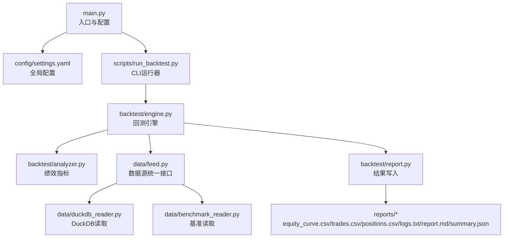
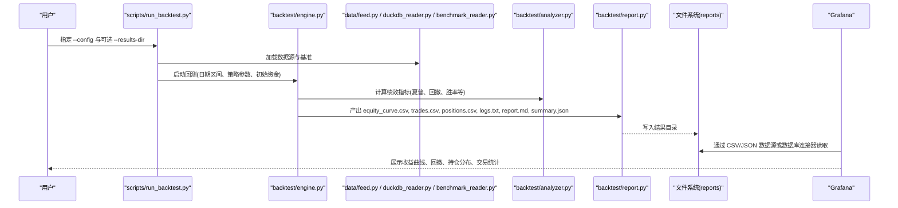
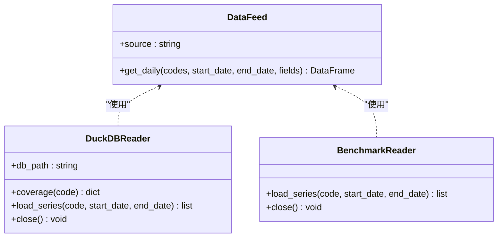
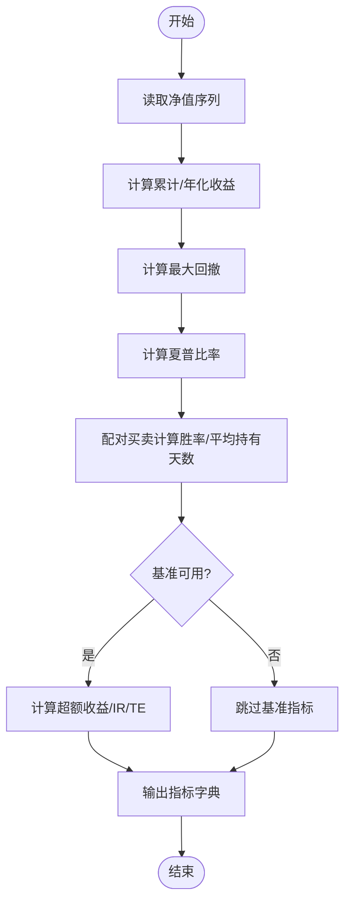
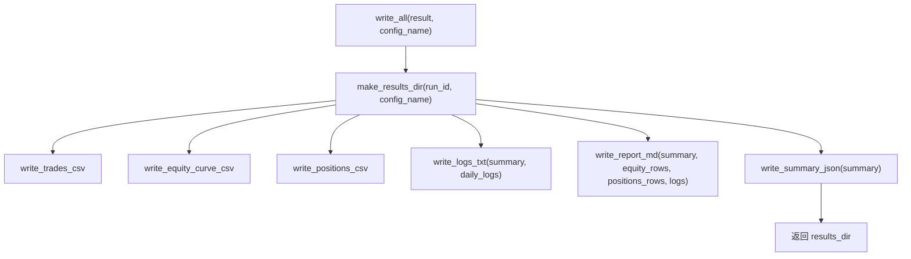
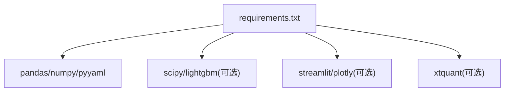

# 监控面板搭建

<cite>
**本文引用的文件**   
- [main.py](file://main.py)
- [requirements.txt](file://requirements.txt)
- [settings.yaml](file://config/settings.yaml)
- [feed.py](file://data/feed.py)
- [duckdb_reader.py](file://data/duckdb_reader.py)
- [benchmark_reader.py](file://data/benchmark_reader.py)
- [engine.py](file://backtest/engine.py)
- [analyzer.py](file://backtest/analyzer.py)
- [report.py](file://backtest/report.py)
- [run_backtest.py](file://scripts/run_backtest.py)
- [monitoring_indicators.md](file://projects/verification/results/monitoring_indicators.md)
- [report.md](file://reports/20260803_204830_513b7f_atr_lowvol_fw/report.md)
- [A股量化框架_五大扩展模块.md](file://A股量化框架_五大扩展模块.md)
</cite>

## 目录
1. [简介](#简介)
2. [项目结构](#项目结构)
3. [核心组件](#核心组件)
4. [架构总览](#架构总览)
5. [详细组件分析](#详细组件分析)
6. [依赖关系分析](#依赖关系分析)
7. [性能与优化建议](#性能与优化建议)
8. [故障排查指南](#故障排查指南)
9. [结论](#结论)
10. [附录](#附录)

## 简介
本文件面向 QuantLab 的监控面板搭建，目标是基于现有回测引擎、数据源与报告体系，构建以 Grafana 为核心的专业监控看板。文档覆盖：
- Grafana 数据源连接（CSV/Parquet 导出、DuckDB 直连等）
- 仪表板创建与图表配置（收益曲线、回撤、持仓分布、交易统计）
- 权限管理与访问控制
- 实时监控（刷新频率、动态更新、交互）
- 历史查询（时间范围、多维度筛选、导出）
- 移动端适配（响应式、移动应用集成、推送通知）
- 维护管理与性能优化

## 项目结构
QuantLab 提供完整的回测与报告能力，关键路径包括：
- 入口与配置加载：main.py、config/settings.yaml
- 数据源接口：data/feed.py、data/duckdb_reader.py、data/benchmark_reader.py
- 回测引擎与指标计算：backtest/engine.py、backtest/analyzer.py
- 结果输出：backtest/report.py（equity_curve.csv、trades.csv、positions.csv、logs.txt、report.md、summary.json）
- CLI 运行器：scripts/run_backtest.py
- 监控指标定义：projects/verification/results/monitoring_indicators.md
- Streamlit 参考看板（可作为可视化思路参考）：A股量化框架_五大扩展模块.md

**图示来源** 
- [main.py:21-35](file://main.py#L21-L35)
- [settings.yaml:1-69](file://config/settings.yaml#L1-L69)
- [run_backtest.py:42-127](file://scripts/run_backtest.py#L42-L127)
- [engine.py:479-522](file://backtest/engine.py#L479-L522)
- [analyzer.py:96-176](file://backtest/analyzer.py#L96-L176)
- [feed.py:17-41](file://data/feed.py#L17-L41)
- [duckdb_reader.py:39-214](file://data/duckdb_reader.py#L39-L214)
- [benchmark_reader.py:39-72](file://data/benchmark_reader.py#L39-L72)
- [report.py:245-264](file://backtest/report.py#L245-L264)

**章节来源**
- [main.py:21-35](file://main.py#L21-L35)
- [settings.yaml:1-69](file://config/settings.yaml#L1-L69)
- [run_backtest.py:42-127](file://scripts/run_backtest.py#L42-L127)

## 核心组件
- 数据源层
  - feed.py 提供统一接口，支持 astock/duckdb 两种数据源
  - duckdb_reader.py 对接 DuckDB，支持 WAL 检测与覆盖度检查
  - benchmark_reader.py 读取指数日线序列用于基准对比
- 回测引擎层
  - engine.py 驱动回测流程，组装交易日历、基准收益、组合净值
  - analyzer.py 计算夏普、最大回撤、胜率、跟踪误差等信息比率
- 报告输出层
  - report.py 将 equity_rows、trades、positions、logs、summary 持久化为 CSV/JSON/Markdown
- 运行器
  - run_backtest.py 解析 YAML 配置、加载数据、执行回测并生成报告

**章节来源**
- [feed.py:17-41](file://data/feed.py#L17-L41)
- [duckdb_reader.py:39-214](file://data/duckdb_reader.py#L39-L214)
- [benchmark_reader.py:39-72](file://data/benchmark_reader.py#L39-L72)
- [engine.py:479-522](file://backtest/engine.py#L479-L522)
- [analyzer.py:96-176](file://backtest/analyzer.py#L96-L176)
- [report.py:245-264](file://backtest/report.py#L245-L264)
- [run_backtest.py:42-127](file://scripts/run_backtest.py#L42-L127)

## 架构总览
下图展示从配置到数据、回测、指标计算、报告落盘，再到 Grafana 可视化的端到端链路。

**图示来源** 
- [run_backtest.py:42-127](file://scripts/run_backtest.py#L42-L127)
- [engine.py:479-522](file://backtest/engine.py#L479-L522)
- [analyzer.py:96-176](file://backtest/analyzer.py#L96-L176)
- [report.py:245-264](file://backtest/report.py#L245-L264)

## 详细组件分析

### 数据源与基准接入
- feed.py 抽象了 get_daily 接口，按 source 切换 astock 或 duckdb 实现
- duckdb_reader.py 负责连接 DuckDB、校验 WAL、返回覆盖度信息
- benchmark_reader.py 提供 load_series 获取基准收盘价序列

**图示来源** 
- [feed.py:17-41](file://data/feed.py#L17-L41)
- [duckdb_reader.py:39-214](file://data/duckdb_reader.py#L39-L214)
- [benchmark_reader.py:39-72](file://data/benchmark_reader.py#L39-L72)

**章节来源**
- [feed.py:17-41](file://data/feed.py#L17-L41)
- [duckdb_reader.py:39-214](file://data/duckdb_reader.py#L39-L214)
- [benchmark_reader.py:39-72](file://data/benchmark_reader.py#L39-L72)

### 回测引擎与指标计算
- engine.py 在回测过程中收集 equity_rows、trades、日志，并调用 compute_metrics
- analyzer.py 计算 total_return、annual_return、max_drawdown、sharpe、win_rate、avg_holding_days，以及超额收益、信息比率、跟踪误差

**图示来源** 
- [engine.py:479-522](file://backtest/engine.py#L479-L522)
- [analyzer.py:96-176](file://backtest/analyzer.py#L96-L176)

**章节来源**
- [engine.py:479-522](file://backtest/engine.py#L479-L522)
- [analyzer.py:96-176](file://backtest/analyzer.py#L96-L176)

### 报告输出与产物规范
- report.py 固定列顺序输出 trades.csv、equity_curve.csv、positions.csv，并生成 logs.txt、report.md、summary.json
- 产物目录默认位于 reports，可通过 set_results_dir 覆盖

**图示来源** 
- [report.py:245-264](file://backtest/report.py#L245-L264)

**章节来源**
- [report.py:245-264](file://backtest/report.py#L245-L264)

### 监控指标定义与阈值
- monitoring_indicators.md 定义了每日/每周/每月/季度监控指标与告警阈值，如净值跌幅、回撤分级、行业集中度、换手率、信号质量、容量检查、策略有效性、风控回顾等

**章节来源**
- [monitoring_indicators.md:1-69](file://projects/verification/results/monitoring_indicators.md#L1-L69)

### Streamlit 参考看板（可视化思路）
- A股量化框架_五大扩展模块.md 提供了 Streamlit 监控看板的完整示例，包含净值曲线、回撤、因子IC时序、相关性矩阵、持仓明细与行业分布、交易记录筛选与统计、系统设置页等，可作为 Grafana 图表设计的参考

**章节来源**
- [A股量化框架_五大扩展模块.md:1705-2117](file://A股量化框架_五大扩展模块.md#L1705-L2117)

## 依赖关系分析
- 运行依赖：pandas、numpy、pyyaml、scipy（可选）、lightgbm（可选）、plotly/streamlit（可选）
- 数据依赖：astock parquet、DuckDB 数据库、基准指数数据
- 报告依赖：标准 CSV/JSON/Markdown 格式

**图示来源** 
- [requirements.txt:1-29](file://requirements.txt#L1-L29)

**章节来源**
- [requirements.txt:1-29](file://requirements.txt#L1-L29)

## 性能与优化建议
- 数据层
  - 优先使用 DuckDB 进行高效查询与过滤；避免全量拉取大表
  - 对 equity_curve.csv、trades.csv、positions.csv 建立索引或分区（若迁移至数据库）
- 指标计算
  - analyzer.py 已采用纯数值计算，避免额外库依赖；短样本年化需保守处理
- 报告与存储
  - 使用 CSV/JSON 作为中间产物，便于 Grafana 直接读取；必要时转换为 Parquet 提升 IO
- 可视化
  - 在 Grafana 中启用缓存与分页，减少大数据集渲染压力
  - 对高频刷新场景，使用增量更新与只读视图

[本节为通用指导，不直接分析具体文件]

## 故障排查指南
- 数据源问题
  - DuckDB WAL 检测：duckdb_reader.py 会提示 .wal 存在时的同步风险
  - 基准不可用：engine.py 会在无基准时禁用 IR/excess 计算
- 报告异常
  - report.py 的 WARN/ERROR 块会汇总样本期警告、基准禁用、去重计数、WAL 检测等
- 日志定位
  - logs.txt 与 report.md 中的“关键日志摘录”可快速定位错误原因

**章节来源**
- [duckdb_reader.py:39-214](file://data/duckdb_reader.py#L39-L214)
- [engine.py:479-522](file://backtest/engine.py#L479-L522)
- [report.py:78-122](file://backtest/report.py#L78-L122)
- [report.md:100-130](file://reports/20260803_204830_513b7f_atr_lowvol_fw/report.md#L100-L130)

## 结论
基于 QuantLab 的回测引擎与报告体系，可以稳定地生成 equit y_curve.csv、trades.csv、positions.csv、logs.txt、report.md、summary.json 等标准化产物。结合 Grafana 的数据源能力，即可搭建专业的监控面板，覆盖收益曲线、回撤分析、持仓分布、交易统计等关键图表，并支持实时刷新、历史查询、权限管理与移动端适配。建议在工程化落地时，优先确保数据源稳定性、指标一致性、报告规范性与可视化性能。

[本节为总结性内容，不直接分析具体文件]

## 附录

### Grafana 数据源连接与仪表板搭建（实操步骤）
- 数据源选择
  - CSV/JSON 数据源：直接挂载 reports 目录下的 equity_curve.csv、trades.csv、positions.csv、summary.json
  - DuckDB 数据源：通过 Grafana DuckDB 插件直连 quantifydata.duckdb，使用 SQL 查询
- 仪表板创建
  - 新建 Dashboard，添加 Panel，选择对应数据源
  - 时间轴字段：date（equity_curve.csv）
  - 值字段：total_asset、daily_return、benchmark_close、benchmark_return
- 图表配置
  - 收益曲线图：折线图，X=date，Y=total_asset，叠加 benchmark_close
  - 回撤分析图：面积图，X=date，Y=(total_asset/cummax)-1
  - 持仓分布图：饼图/环形图，分组 by code 或 industry（需 positions.csv 扩展字段）
  - 交易统计图：柱状图/热力图，按 date 聚合 n_trades、n_buy、n_sell
- 权限管理
  - 使用 Grafana 组织与角色（Viewer/Editor/Admin），限制敏感数据访问
  - 通过 OAuth 或 LDAP 集成企业身份认证

[本节为概念性说明，不直接映射具体代码文件]

### 关键图表设计要点
- 收益曲线图
  - 叠加基准线，标注关键事件（调仓日、重大涨跌）
  - 支持多策略对比（多 series）
- 回撤分析图
  - 显示最大回撤区间与恢复时间
  - 联动交易日历，标注触发风控的事件
- 持仓分布图
  - 行业分布与个股权重双视图
  - 颜色映射盈亏比例，突出风险暴露
- 交易统计图
  - 胜率、盈亏比、平均持有天数的趋势
  - 月度/周度热力图展示交易活跃度

[本节为概念性说明，不直接映射具体代码文件]

### 实时监控功能配置
- 刷新策略
  - 使用 Grafana 自动刷新（如 30s/1min），配合后端增量写入
- 动态更新
  - 将最新 equity_curve.csv 追加写入，避免全量替换
- 交互操作
  - 时间范围选择、图例过滤、钻取到交易明细

[本节为概念性说明，不直接映射具体代码文件]

### 历史查询能力
- 时间范围选择
  - 利用 date 字段进行区间筛选
- 多维度筛选
  - 按 code、action、industry 等维度过滤
- 数据导出
  - 在 Grafana 中导出 CSV/JSON，或通过脚本批量导出 reports 目录

[本节为概念性说明，不直接映射具体代码文件]

### 移动端适配方案
- 响应式设计
  - 使用 Grafana 的自适应布局与紧凑面板
- 移动应用集成
  - 通过 Grafana Cloud App 或第三方客户端查看
- 推送通知
  - 集成 Alertmanager 或企业微信/钉钉机器人，按阈值告警

[本节为概念性说明，不直接映射具体代码文件]

### 维护管理与性能优化建议
- 定期清理旧报告，保留最近 N 次运行结果
- 对 CSV 文件进行压缩与归档
- 在 Grafana 中启用查询缓存与懒加载
- 监控数据源健康状态（DuckDB WAL、基准可用性）

[本节为通用指导，不直接分析具体文件]