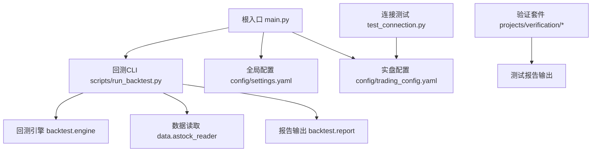
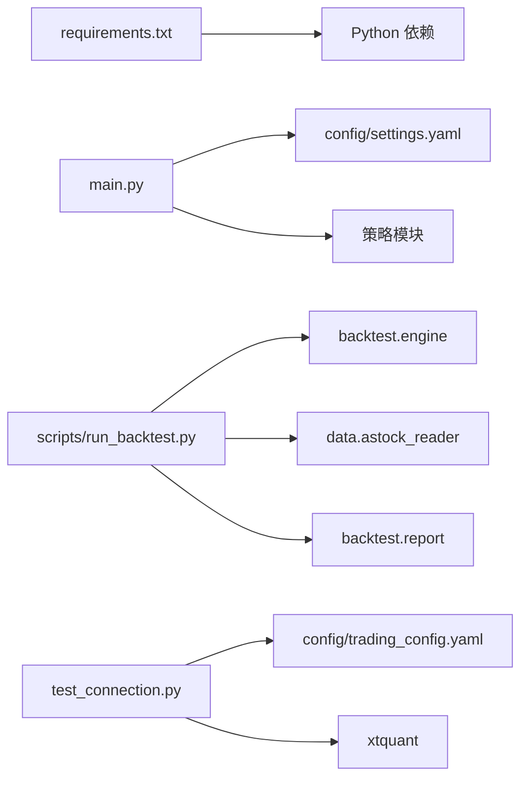

# CI/CD流水线

<cite>
**本文引用的文件**   
- [requirements.txt](file://requirements.txt)
- [setup.py](file://setup.py)
- [main.py](file://main.py)
- [config/settings.yaml](file://config/settings.yaml)
- [config/trading_config.yaml](file://config/trading_config.yaml)
- [scripts/run_backtest.py](file://scripts/run_backtest.py)
- [test_connection.py](file://test_connection.py)
- [projects/verification/engine_tests.py](file://projects/verification/engine_tests.py)
- [projects/verification/portfolio_tests.py](file://projects/verification/portfolio_tests.py)
- [projects/verification/robustness_tests.py](file://projects/verification/robustness_tests.py)
- [projects/Project_10_价值小盘V2/build.py](file://projects/Project_10_价值小盘V2/build.py)
</cite>

## 目录
1. [简介](#简介)
2. [项目结构](#项目结构)
3. [核心组件](#核心组件)
4. [架构总览](#架构总览)
5. [详细组件分析](#详细组件分析)
6. [依赖分析](#依赖分析)
7. [性能考虑](#性能考虑)
8. [故障排查指南](#故障排查指南)
9. [结论](#结论)
10. [附录](#附录)

## 简介
本指南面向 QuantLab 的持续集成与持续交付（CI/CD）流水线设计，覆盖以下目标：
- 代码检查流水线：Python 风格检查、静态分析、安全扫描、依赖审计
- 单元测试流水线：用例执行、覆盖率统计、报告生成、环境隔离
- 集成测试流水线：端到端回测、接口连通性、性能基准、兼容性矩阵
- 自动化部署流水线：Docker 镜像构建与推送、Kubernetes 部署、蓝绿发布
- 发布管理：版本标签、变更日志、发布通知、回滚机制

本指南基于仓库现有脚本与配置进行落地设计，确保可操作、可观测、可回滚。

## 项目结构
QuantLab 采用“策略项目 + 公共库”的组织方式：
- 公共库：backtest、data、factors、strategy、risk 等模块提供回测引擎、数据读取、因子计算与策略框架
- 策略项目：projects 下多个独立策略项目，包含各自的运行脚本、配置与结果
- 配置中心：config 目录集中管理全局与交易相关配置
- 脚本与工具：scripts 提供回测 CLI、批量任务与测试辅助
- 验证套件：projects/verification 提供引擎、组合与鲁棒性测试及报告生成



图表来源 
- [main.py:1-104](file://main.py#L1-L104)
- [scripts/run_backtest.py:1-132](file://scripts/run_backtest.py#L1-L132)
- [config/settings.yaml:1-69](file://config/settings.yaml#L1-L69)
- [config/trading_config.yaml:1-62](file://config/trading_config.yaml#L1-L62)
- [test_connection.py:1-117](file://test_connection.py#L1-L117)

章节来源
- [main.py:1-104](file://main.py#L1-L104)
- [scripts/run_backtest.py:1-132](file://scripts/run_backtest.py#L1-L132)
- [config/settings.yaml:1-69](file://config/settings.yaml#L1-L69)
- [config/trading_config.yaml:1-62](file://config/trading_config.yaml#L1-L62)
- [test_connection.py:1-117](file://test_connection.py#L1-L117)

## 核心组件
- 回测入口与CLI
  - main.py：统一入口，加载配置并调度策略回测
  - scripts/run_backtest.py：参数化回测运行器，负责配置解析、数据读取、回测执行与报告输出
- 配置管理
  - config/settings.yaml：全局设置（数据路径、缓存、回测参数、日志、因子处理、策略默认集合）
  - config/trading_config.yaml：实盘账户、风控、订单、调度、通知与数据源
- 连接与验证
  - test_connection.py：miniQMT 连接测试、账户查询、持仓校验
  - projects/verification/*：引擎、组合、鲁棒性测试与报告生成

章节来源
- [main.py:21-92](file://main.py#L21-L92)
- [scripts/run_backtest.py:35-127](file://scripts/run_backtest.py#L35-L127)
- [config/settings.yaml:10-69](file://config/settings.yaml#L10-L69)
- [config/trading_config.yaml:10-62](file://config/trading_config.yaml#L10-L62)
- [test_connection.py:18-116](file://test_connection.py#L18-L116)
- [projects/verification/engine_tests.py:260-308](file://projects/verification/engine_tests.py#L260-L308)
- [projects/verification/portfolio_tests.py:214-231](file://projects/verification/portfolio_tests.py#L214-L231)
- [projects/verification/robustness_tests.py:251-266](file://projects/verification/robustness_tests.py#L251-L266)

## 架构总览
下图展示从提交到部署的关键阶段与产物流转：

```mermaid
sequenceDiagram
participant Dev as "开发者"
participant CI as "CI 服务"
participant Lint as "代码检查"
unit as "单元测试"
integ as "集成测试"
build as "镜像构建"
reg as "镜像仓库"
k8s as "Kubernetes"
notify as "通知"
Dev->>CI : 推送代码/创建PR
CI->>Lint : 运行风格与安全扫描
Lint-->>CI : 检查结果
CI->>unit : 运行测试与覆盖率
unit-->>CI : 测试报告
CI->>integ : 端到端回测/接口连通/基准
integ-->>CI : 指标与报告
CI->>build : 构建Docker镜像
build-->>CI : 镜像ID
CI->>reg : 推送镜像(打标签)
CI->>k8s : 应用蓝绿部署
k8s-->>CI : 部署状态
CI->>notify : 发送发布通知
```

图表来源 
- [scripts/run_backtest.py:42-127](file://scripts/run_backtest.py#L42-L127)
- [test_connection.py:54-103](file://test_connection.py#L54-L103)
- [projects/Project_10_价值小盘V2/build.py:44-68](file://projects/Project_10_价值小盘V2/build.py#L44-L68)

## 详细组件分析

### 代码检查流水线
- 目标
  - Python 风格检查（如 flake8/pycodestyle/black/ruff）
  - 静态分析（如 pylint/mypy）
  - 安全漏洞扫描（如 bandit/safety）
  - 依赖包审计（如 pip-audit/dependency-check）
- 输入
  - 全量源码与 requirements.txt
- 步骤
  - 安装依赖：使用 requirements.txt 安装基础依赖
  - 风格检查：对 backtest、data、factors、strategy、scripts、projects 等目录扫描
  - 静态分析：类型检查与复杂度阈值控制
  - 安全扫描：检测硬编码密钥、危险函数调用
  - 依赖审计：锁定依赖版本并扫描已知漏洞
- 输出
  - 检查报告（JSON/HTML）、失败即阻断合并
- 建议
  - 将严格规则写入配置文件，避免在命令行堆砌参数
  - 对第三方或遗留代码添加例外清单

章节来源
- [requirements.txt:1-29](file://requirements.txt#L1-L29)

### 单元测试流水线
- 目标
  - 快速反馈：核心逻辑与边界条件
  - 覆盖率统计：关键模块达到阈值
  - 报告生成：JUnit/HTML 便于归档
  - 环境隔离：虚拟环境与只读数据
- 输入
  - 源码、测试脚本与最小数据集
- 步骤
  - 创建隔离环境（venv/conda），仅安装测试所需依赖
  - 运行验证套件：engine_tests、portfolio_tests、robustness_tests
  - 收集覆盖率（pytest-cov）与测试报告
  - 断言阈值：通过率、覆盖率、耗时上限
- 输出
  - 测试报告、覆盖率报告、失败详情

章节来源
- [projects/verification/engine_tests.py:260-308](file://projects/verification/engine_tests.py#L260-L308)
- [projects/verification/portfolio_tests.py:214-231](file://projects/verification/portfolio_tests.py#L214-L231)
- [projects/verification/robustness_tests.py:251-266](file://projects/verification/robustness_tests.py#L251-L266)

### 集成测试流水线
- 目标
  - 端到端回测：以真实配置驱动完整流程
  - 接口连通性：miniQMT 连接与账户/持仓查询
  - 性能基准：回测耗时、内存峰值、吞吐
  - 兼容性测试：不同 Python/依赖版本矩阵
- 输入
  - 配置集（settings.yaml、trading_config.yaml）、示例数据
- 步骤
  - 运行 scripts/run_backtest.py 指定配置，产出报告
  - 执行 test_connection.py 验证 QMT 连接与账户信息
  - 记录性能指标（时间、资源占用）
  - 多版本矩阵并行执行，汇总差异
- 输出
  - 回测报告、连通性报告、性能基线、兼容性矩阵

章节来源
- [scripts/run_backtest.py:42-127](file://scripts/run_backtest.py#L42-L127)
- [test_connection.py:54-103](file://test_connection.py#L54-L103)
- [config/settings.yaml:22-36](file://config/settings.yaml#L22-L36)
- [config/trading_config.yaml:10-36](file://config/trading_config.yaml#L10-L36)

### 自动化部署流水线
- 目标
  - 构建 Docker 镜像（含运行时与依赖）
  - 推送镜像至仓库（带语义化版本标签）
  - Kubernetes 部署（Deployment/Service/ConfigMap/Secret）
  - 蓝绿发布策略（双环境切换、健康检查、自动回滚）
- 输入
  - 源码、requirements.txt、Dockerfile（需新增）、K8s 清单（需新增）
- 步骤
  - 构建镜像：冻结依赖、最小化镜像体积
  - 推送镜像：按分支/标签命名规范
  - 更新 K8s：滚动升级或蓝绿切换
  - 健康检查：探针就绪后切流
  - 回滚：失败自动回退至上一稳定版本
- 输出
  - 镜像制品、部署状态、健康检查报告

说明
- 当前仓库未包含 Dockerfile 与 K8s 清单，建议在流水线中按需生成或模板化注入

章节来源
- [requirements.txt:1-29](file://requirements.txt#L1-L29)

### 发布管理
- 目标
  - 版本标签创建（Git tag）
  - 变更日志生成（基于提交消息或 PR）
  - 发布通知（邮件/IM webhook）
  - 回滚机制（一键回退到上一个稳定版本）
- 输入
  - Git 历史、版本号约定（语义化版本）
- 步骤
  - 打标签：vX.Y.Z
  - 生成变更日志：过滤提交范围与类别
  - 触发发布：推送镜像、更新 K8s 版本
  - 通知：通过 webhook 推送成功/失败
  - 回滚：若健康检查失败，自动回退到前一标签镜像
- 输出
  - 版本标签、变更日志、通知记录、回滚快照

章节来源
- [config/trading_config.yaml:37-41](file://config/trading_config.yaml#L37-L41)

### 构建与打包（项目级）
- 目标
  - 为特定策略项目生成可部署产物（如替换构建标记、转码）
- 输入
  - 策略源码与构建脚本
- 步骤
  - 运行 build.py 注入构建标签与编码转换
  - 校验产物头部与大小
- 输出
  - 构建产物（build/ 目录）

章节来源
- [projects/Project_10_价值小盘V2/build.py:44-68](file://projects/Project_10_价值小盘V2/build.py#L44-L68)

## 依赖分析
- 外部依赖
  - pandas、numpy、pyyaml、scipy、lightgbm 等由 requirements.txt 声明
- 内部依赖
  - main.py 依赖配置与策略模块
  - scripts/run_backtest.py 依赖 backtest.engine、data.astock_reader、backtest.report
  - test_connection.py 依赖 xtquant 与 trading_config.yaml
- 风险点
  - 强耦合于本地路径与 QMT 安装位置
  - 依赖版本漂移可能导致行为不一致



图表来源 
- [requirements.txt:1-29](file://requirements.txt#L1-L29)
- [main.py:21-92](file://main.py#L21-L92)
- [scripts/run_backtest.py:26-116](file://scripts/run_backtest.py#L26-L116)
- [test_connection.py:34-61](file://test_connection.py#L34-L61)

章节来源
- [requirements.txt:1-29](file://requirements.txt#L1-L29)
- [main.py:21-92](file://main.py#L21-L92)
- [scripts/run_backtest.py:26-116](file://scripts/run_backtest.py#L26-L116)
- [test_connection.py:34-61](file://test_connection.py#L34-L61)

## 性能考虑
- 回测性能
  - 数据读取优化：Parquet 列裁剪、分区读取
  - 因子计算：向量化与并行化
  - 报告写入：异步落盘与压缩
- 测试性能
  - 单元测试：最小数据集、Mock 外部依赖
  - 集成测试：限定时长与资源配额，超时中断
- 部署性能
  - 镜像分层优化：缓存层与依赖层分离
  - K8s 资源限制：CPU/Memory 请求与限制

[本节为通用指导，不直接分析具体文件]

## 故障排查指南
- 常见问题
  - 依赖缺失或版本冲突：检查 requirements.txt 与虚拟环境
  - 路径错误：确认 settings.yaml 与 trading_config.yaml 中的路径
  - QMT 连接失败：确认 miniQMT 进程、账号登录与路径正确
  - 回测异常：检查数据完整性、调整参数与日志级别
- 定位方法
  - 启用详细日志（logging.level=DEBUG）
  - 分阶段执行：先连通性测试，再回测，最后报告校验
  - 查看测试报告与回测摘要指标

章节来源
- [config/settings.yaml:31-36](file://config/settings.yaml#L31-L36)
- [config/trading_config.yaml:4-16](file://config/trading_config.yaml#L4-L16)
- [test_connection.py:54-103](file://test_connection.py#L54-L103)
- [scripts/run_backtest.py:42-127](file://scripts/run_backtest.py#L42-L127)

## 结论
本指南围绕 QuantLab 的代码质量、测试、集成、部署与发布构建了完整的 CI/CD 方案。通过严格的代码检查、隔离的测试环境、稳健的集成验证与可控的蓝绿发布，保障策略迭代的安全性与效率。建议逐步引入 Docker 与 K8s 清单，完善镜像与部署模板，形成端到端的自动化闭环。

[本节为总结性内容，不直接分析具体文件]

## 附录
- 建议的流水线阶段顺序
  - 代码检查 → 单元测试 → 集成测试 → 构建镜像 → 推送镜像 → 蓝绿部署 → 健康检查 → 通知
- 关键产物归档
  - 测试报告、覆盖率报告、回测报告、镜像制品、部署清单、变更日志
- 回滚策略
  - 自动回退到上一稳定标签镜像；保留最近 N 个版本用于快速恢复

[本节为补充信息，不直接分析具体文件]