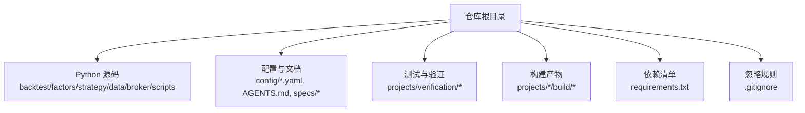
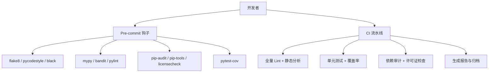
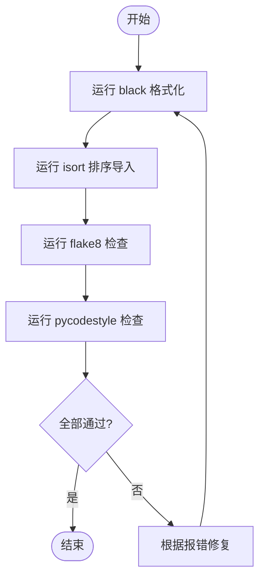
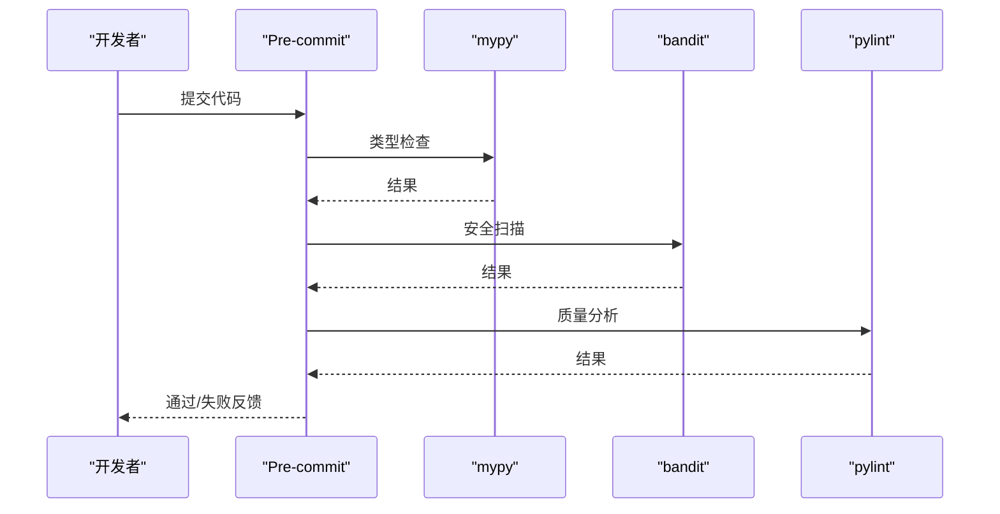
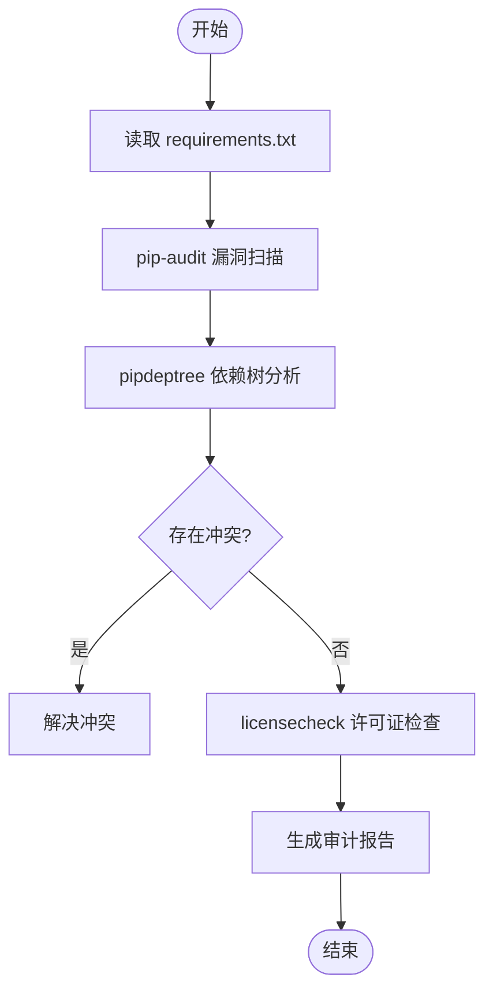
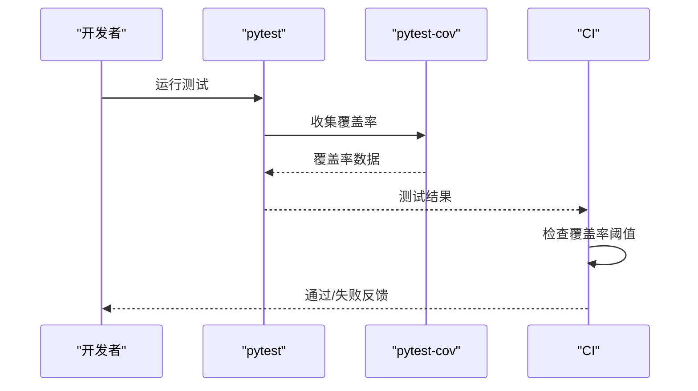
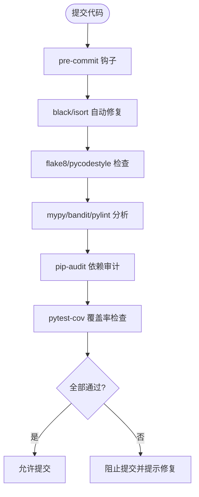
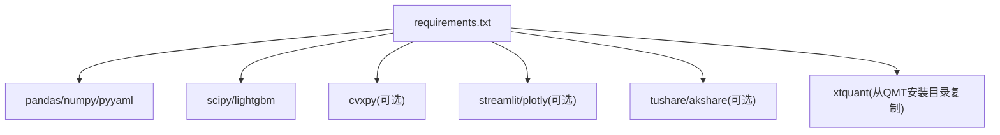

# 代码质量检查

<cite>
**本文引用的文件**
- [requirements.txt](file://requirements.txt)
- [setup.py](file://setup.py)
- [config/settings.yaml](file://config/settings.yaml)
- [.gitignore](file://.gitignore)
- [AGENTS.md](file://AGENTS.md)
- [main.py](file://main.py)
- [projects/Project_10_价值小盘V2/build.py](file://projects/Project_10_价值小盘V2/build.py)
- [projects/verification/engine_tests.py](file://projects/verification/engine_tests.py)
</cite>

## 目录
1. [简介](#简介)
2. [项目结构](#项目结构)
3. [核心组件](#核心组件)
4. [架构总览](#架构总览)
5. [详细组件分析](#详细组件分析)
6. [依赖分析](#依赖分析)
7. [性能考虑](#性能考虑)
8. [故障排查指南](#故障排查指南)
9. [结论](#结论)
10. [附录](#附录)

## 简介
本文件为 QuantLab 项目的“代码质量检查流水线”配置与使用指南，覆盖以下目标：
- Python 代码风格检查：flake8、pycodestyle、black 的配置与执行方式
- 静态代码分析：mypy 类型检查、bandit 安全扫描、pylint 代码质量分析
- 依赖包审计：pip-audit 安全漏洞检测、依赖版本冲突检查、许可证合规性验证
- 代码覆盖率统计：pytest-cov 配置、覆盖率阈值设置、覆盖率报告生成
- 代码审查自动化：pre-commit 钩子配置、代码格式自动修复、提交前检查流程

本指南面向不同技术背景的读者，提供从概念到落地的完整说明，并给出与现有仓库结构的映射关系。

## 项目结构
QuantLab 当前仓库未包含专门的 CI/CD 或质量工具配置文件（如 .pre-commit-config.yaml、tox.ini、pyproject.toml 等）。因此，建议在仓库根目录新增统一的质量检查配置，并与现有脚本和构建流程集成。

**图表来源**
- [requirements.txt:1-29](file://requirements.txt#L1-L29)
- [config/settings.yaml:1-69](file://config/settings.yaml#L1-L69)
- [.gitignore:1-21](file://.gitignore#L1-L21)
- [AGENTS.md:1-194](file://AGENTS.md#L1-L194)

**章节来源**
- [requirements.txt:1-29](file://requirements.txt#L1-L29)
- [config/settings.yaml:1-69](file://config/settings.yaml#L1-L69)
- [.gitignore:1-21](file://.gitignore#L1-L21)
- [AGENTS.md:1-194](file://AGENTS.md#L1-L194)

## 核心组件
- 代码风格检查
  - flake8：统一语法与风格错误提示
  - pycodestyle：PEP8 基础规范检查
  - black：强制格式化，保证一致风格
- 静态代码分析
  - mypy：类型注解校验
  - bandit：安全漏洞扫描
  - pylint：代码质量与复杂度分析
- 依赖包审计
  - pip-audit：依赖漏洞检测
  - pip-tools/pipdeptree：依赖版本冲突检查
  - licensecheck/spdx-tools：许可证合规性验证
- 代码覆盖率
  - pytest-cov：覆盖率采集与报告
  - 覆盖率阈值：在 CI 中设置最小覆盖率门槛
- 代码审查自动化
  - pre-commit：提交前自动运行上述工具
  - 自动修复：black --safe 与 isort 等
  - 提交流程：失败即阻断提交

**章节来源**
- [AGENTS.md:1-194](file://AGENTS.md#L1-L194)

## 架构总览
下图展示质量检查流水线在本地与 CI 中的整体交互关系，以及各工具的职责边界。

[此图为概念性流程图，不直接映射具体源文件]

## 详细组件分析

### 代码风格检查（flake8、pycodestyle、black）
- 目标
  - 统一编码风格，减少评审成本
  - 避免常见语法与风格问题
- 建议配置要点
  - flake8：启用常用插件（如 pep8-naming、flake8-bugbear），设置最大行宽
  - pycodestyle：遵循 PEP8 默认规则
  - black：固定换行与缩进策略，配合 isort 管理导入顺序
- 执行方式
  - 本地：通过 pre-commit 自动触发
  - CI：作为独立步骤运行，失败即阻断

[此图为概念性流程图，不直接映射具体源文件]

**章节来源**
- [AGENTS.md:1-194](file://AGENTS.md#L1-L194)

### 静态代码分析（mypy、bandit、pylint）
- 目标
  - mypy：确保类型注解正确，降低运行时错误
  - bandit：识别潜在安全问题（如硬编码密钥、不安全函数调用）
  - pylint：评估代码质量（复杂度、命名、重复度等）
- 建议配置要点
  - mypy：开启严格模式，忽略第三方库的类型缺失
  - bandit：启用关键规则集，排除已知误报
  - pylint：自定义评分阈值，忽略历史遗留问题
- 执行方式
  - 本地：pre-commit 阶段运行
  - CI：全量扫描，输出报告

[此图为概念性流程图，不直接映射具体源文件]

**章节来源**
- [AGENTS.md:1-194](file://AGENTS.md#L1-L194)

### 依赖包审计（pip-audit、版本冲突、许可证）
- 目标
  - 发现已知漏洞的依赖包
  - 检查依赖版本冲突
  - 验证许可证合规性
- 建议配置要点
  - pip-audit：基于 requirements.txt 扫描
  - pip-tools/pipdeptree：解析依赖树，定位冲突
  - licensecheck/spdx-tools：汇总许可证信息
- 执行方式
  - 本地：开发时快速检查
  - CI：每次变更依赖时触发

[此图为概念性流程图，不直接映射具体源文件]

**章节来源**
- [requirements.txt:1-29](file://requirements.txt#L1-L29)

### 代码覆盖率统计（pytest-cov）
- 目标
  - 量化测试覆盖范围
  - 设定最低覆盖率门槛
- 建议配置要点
  - pytest-cov：指定覆盖率阈值（如 >=80%）
  - 报告格式：HTML、XML 等，便于归档
- 执行方式
  - 本地：运行测试后自动生成报告
  - CI：失败即阻断合并

[此图为概念性流程图，不直接映射具体源文件]

**章节来源**
- [AGENTS.md:1-194](file://AGENTS.md#L1-L194)

### 代码审查自动化（pre-commit）
- 目标
  - 在提交前自动运行所有检查
  - 自动修复可修复的问题
- 建议配置要点
  - pre-commit：定义 hooks，绑定 flake8/black/mypy/bandit/pylint/pip-audit/pytest-cov
  - 跳过条件：针对特定文件或目录跳过检查
- 执行方式
  - 本地：安装 pre-commit 并初始化
  - CI：可选地再次运行以确保一致性

[此图为概念性流程图，不直接映射具体源文件]

**章节来源**
- [AGENTS.md:1-194](file://AGENTS.md#L1-L194)

## 依赖分析
当前仓库的依赖清单位于 requirements.txt，主要包含数据分析、回测与机器学习相关库。质量检查工具应作为开发依赖单独管理，避免污染生产环境。

**图表来源**
- [requirements.txt:1-29](file://requirements.txt#L1-L29)

**章节来源**
- [requirements.txt:1-29](file://requirements.txt#L1-L29)

## 性能考虑
- 并行执行：在 CI 中使用并行 runner 加速 lint、测试与审计
- 缓存依赖：缓存 pip 包与 mypy 缓存目录
- 增量检查：仅对变更文件运行检查（如 git diff）
- 资源限制：为大型任务设置超时与内存上限

[本节为通用指导，无需引用具体文件]

## 故障排查指南
- 常见问题
  - flake8/pycodestyle 报错：检查编码、行尾符、导入顺序
  - black 格式化失败：确认 Python 版本与 black 版本兼容
  - mypy 类型错误：补充类型注解或忽略特定行
  - bandit 误报：添加注释忽略或调整规则
  - pip-audit 漏洞：升级依赖或寻找替代包
  - pytest-cov 覆盖率不足：补充测试用例
- 调试技巧
  - 逐步禁用 hooks 定位问题
  - 查看日志输出与报告文件
  - 使用 --verbose 参数获取详细信息

**章节来源**
- [AGENTS.md:1-194](file://AGENTS.md#L1-L194)

## 结论
通过引入统一的代码质量检查流水线，QuantLab 项目可实现：
- 一致的代码风格与质量
- 早期发现安全与类型问题
- 依赖安全与许可证合规
- 高覆盖率的测试保障
- 自动化的代码审查流程

建议尽快落地 pre-commit 与 CI 集成，持续优化配置与规则。

[本节为总结性内容，无需引用具体文件]

## 附录
- 推荐工具版本
  - flake8: 最新稳定版
  - black: 与 Python 版本匹配
  - mypy: 支持 Python 3.11
  - bandit: 最新稳定版
  - pylint: 最新稳定版
  - pip-audit: 最新稳定版
  - pytest-cov: 最新稳定版
- 参考命令
  - 本地运行：pre-commit run --all-files
  - 覆盖率：pytest --cov=src --cov-report=html
  - 依赖审计：pip-audit -r requirements.txt

[本节为补充信息，无需引用具体文件]