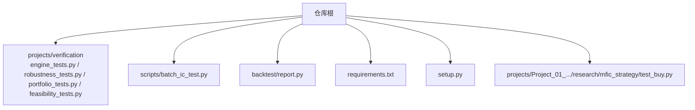
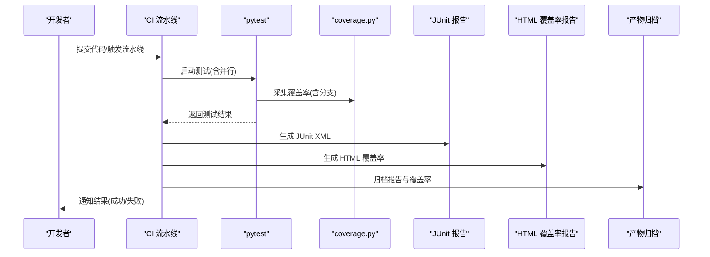
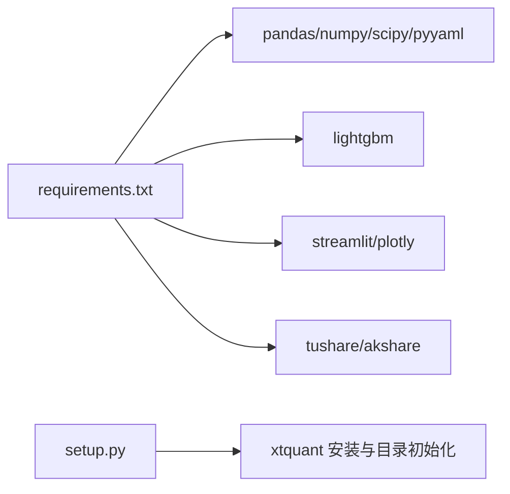

# 单元测试流水线

<cite>
**本文引用的文件**   
- [engine_tests.py](file://projects/verification/engine_tests.py)
- [robustness_tests.py](file://projects/verification/robustness_tests.py)
- [portfolio_tests.py](file://projects/verification/portfolio_tests.py)
- [feasibility_tests.py](file://projects/verification/feasibility_tests.py)
- [batch_ic_test.py](file://scripts/batch_ic_test.py)
- [report.py](file://backtest/report.py)
- [requirements.txt](file://requirements.txt)
- [setup.py](file://setup.py)
- [test_buy.py](file://projects/Project_01_多因子IC小盘Alpha/research/mfic_strategy/test_buy.py)
</cite>

## 目录
1. [简介](#简介)
2. [项目结构](#项目结构)
3. [核心组件](#核心组件)
4. [架构总览](#架构总览)
5. [详细组件分析](#详细组件分析)
6. [依赖关系分析](#依赖关系分析)
7. [性能考虑](#性能考虑)
8. [故障排查指南](#故障排查指南)
9. [结论](#结论)
10. [附录](#附录)

## 简介
本文件为 QuantLab 的“单元测试流水线”配置与实施指南，覆盖以下目标：
- 测试用例执行：pytest 配置、测试发现机制、并行执行、环境隔离
- 覆盖率统计：coverage.py 配置、分支覆盖率计算、阈值验证、报告生成
- 测试报告：JUnit XML、HTML 覆盖率报告、测试趋势分析、失败用例归档
- 测试数据管理：数据准备、Mock 数据、数据库测试环境、外部服务模拟
- 性能基准：基准框架配置、回归检测、结果对比、报告生成

本项目已具备若干验证脚本（B/D/E/F 模块）与批量 IC 测试脚本，可作为 pytest 化与流水线集成的基础。

## 项目结构
QuantLab 当前未内置 pytest/coverage 配置文件，但存在大量可被 pytest 发现的测试脚本与报告输出逻辑。建议将现有脚本逐步重构为 pytest 风格，并在仓库根目录添加统一配置。

**图表来源** 
- [engine_tests.py:1-309](file://projects/verification/engine_tests.py#L1-L309)
- [robustness_tests.py:1-267](file://projects/verification/robustness_tests.py#L1-L267)
- [portfolio_tests.py:1-232](file://projects/verification/portfolio_tests.py#L1-L232)
- [feasibility_tests.py:134-177](file://projects/verification/feasibility_tests.py#L134-L177)
- [batch_ic_test.py:1-266](file://scripts/batch_ic_test.py#L1-L266)
- [report.py:111-147](file://backtest/report.py#L111-L147)
- [requirements.txt:1-29](file://requirements.txt#L1-L29)
- [setup.py:1-82](file://setup.py#L1-L82)
- [test_buy.py:1-46](file://projects/Project_01_多因子IC小盘Alpha/research/mfic_strategy/test_buy.py#L1-L46)

**章节来源**
- [engine_tests.py:1-309](file://projects/verification/engine_tests.py#L1-L309)
- [robustness_tests.py:1-267](file://projects/verification/robustness_tests.py#L1-L267)
- [portfolio_tests.py:1-232](file://projects/verification/portfolio_tests.py#L1-L232)
- [feasibility_tests.py:134-177](file://projects/verification/feasibility_tests.py#L134-L177)
- [batch_ic_test.py:1-266](file://scripts/batch_ic_test.py#L1-L266)
- [report.py:111-147](file://backtest/report.py#L111-L147)
- [requirements.txt:1-29](file://requirements.txt#L1-L29)
- [setup.py:1-82](file://setup.py#L1-L82)
- [test_buy.py:1-46](file://projects/Project_01_多因子IC小盘Alpha/research/mfic_strategy/test_buy.py#L1-L46)

## 核心组件
- 验证脚本集合（B/D/E/F 模块）：提供结构化测试结果与 Markdown 报告输出，适合作为 pytest 用例的基础。
- 批量 IC 测试脚本：面向因子库的批处理流程，适合封装为 pytest 参数化用例或独立 CI Job。
- 回测报告写入：用于生成 logs.txt 与 report.md，可在流水线中作为产物归档。
- 依赖与环境：requirements.txt 定义核心依赖；setup.py 用于 QMT 环境初始化（非测试必需）。

**章节来源**
- [engine_tests.py:260-308](file://projects/verification/engine_tests.py#L260-L308)
- [robustness_tests.py:221-266](file://projects/verification/robustness_tests.py#L221-L266)
- [portfolio_tests.py:184-231](file://projects/verification/portfolio_tests.py#L184-L231)
- [feasibility_tests.py:134-177](file://projects/verification/feasibility_tests.py#L134-L177)
- [batch_ic_test.py:1-266](file://scripts/batch_ic_test.py#L1-L266)
- [report.py:111-147](file://backtest/report.py#L111-L147)
- [requirements.txt:1-29](file://requirements.txt#L1-L29)
- [setup.py:1-82](file://setup.py#L1-L82)

## 架构总览
下图展示从“触发运行”到“产出报告”的端到端流水线，包含 pytest 执行、覆盖率采集、JUnit/HTML 报告生成与产物归档。

[该图为概念性流程图，不直接映射具体源码文件]

## 详细组件分析

### 测试用例执行（pytest）
- 测试发现机制
  - 默认按文件名模式 test_*.py 或 *_test.py 发现函数式用例。
  - 现有验证脚本以 run_all_tests() 聚合多个测试项并输出 Markdown 报告，可直接包装为 pytest 用例。
- 并行执行
  - 使用 pytest-xdist 实现进程级并行，结合 --forked 隔离外部依赖（如 QMT）。
- 环境隔离
  - 通过 pytest-env、pytest-mock、临时工作目录隔离路径与外部状态。
  - 对需要真实数据的测试，使用固定数据集路径或内存 DataFrame。

建议的 pytest 配置要点（供参考）：
- 插件：pytest, pytest-xdist, pytest-env, pytest-mock, pytest-timeout, pytest-cov
- 命令行示例：
  - 全量并行：pytest -n auto -v --tb=short
  - 仅验证模块：pytest projects/verification -v
  - 带超时：pytest --timeout=300
  - 过滤标签：pytest -m "fast or slow"

**章节来源**
- [engine_tests.py:260-308](file://projects/verification/engine_tests.py#L260-L308)
- [robustness_tests.py:221-266](file://projects/verification/robustness_tests.py#L221-L266)
- [portfolio_tests.py:184-231](file://projects/verification/portfolio_tests.py#L184-L231)
- [feasibility_tests.py:134-177](file://projects/verification/feasibility_tests.py#L134-L177)

### 覆盖率统计（coverage.py）
- 配置要点（供参考）
  - 启用分支覆盖率：branch = True
  - 忽略第三方与样板代码
  - 设置最小阈值（例如整体≥80%，关键模块≥90%）
- 执行命令（供参考）
  - coverage run -m pytest -n auto
  - coverage report --show-missing
  - coverage html -d reports/coverage
- 阈值校验
  - 在 CI 中通过 coverage xml 生成 junit 兼容报告，配合质量门禁

**章节来源**
- [requirements.txt:1-29](file://requirements.txt#L1-L29)

### 测试报告生成
- JUnit XML
  - 使用 pytest-junit 或内置 junitxml 插件，输出到 artifacts/junit.xml
- HTML 覆盖率报告
  - 使用 coverage html 生成，输出到 artifacts/coverage
- 测试趋势分析
  - 基于历史 JUnit 与覆盖率指标构建趋势图（CI 侧集成）
- 失败用例归档
  - 保存日志、截图、异常堆栈与中间产物

**章节来源**
- [report.py:111-147](file://backtest/report.py#L111-L147)

### 测试数据管理
- 数据准备
  - 使用固定路径的 parquet/csv 数据源，或在用例内构造最小数据集
- Mock 数据生成
  - 使用 pytest-mock 替换外部依赖（QMT、行情接口等）
- 数据库测试环境
  - 使用内存数据库或临时实例，确保用例幂等与可重复
- 外部服务模拟
  - 使用本地 mock server 或 pytest-httpx/httpretty 拦截网络请求

**章节来源**
- [batch_ic_test.py:1-266](file://scripts/batch_ic_test.py#L1-L266)

### 性能基准测试
- 基准框架
  - 使用 pytest-benchmark 或 standalone benchmark 脚本
- 回归检测
  - 设定性能基线（p95/p99），CI 比较本次与基线差异
- 结果对比
  - 输出 CSV/JSON 并与历史基线比对
- 报告生成
  - 生成 HTML 或 Markdown 报告，纳入产物归档

[本节为通用指导，不直接分析具体文件]

## 依赖关系分析
- 运行时依赖
  - pandas、numpy、scipy、pyyaml 为核心依赖
- 可选依赖
  - ML（lightgbm）、可视化（streamlit/plotly）、数据源（tushare/akshare）、QMT（xtquant）
- 环境初始化
  - setup.py 负责 xtquant 安装与目录创建（与测试解耦）

**图表来源** 
- [requirements.txt:1-29](file://requirements.txt#L1-L29)
- [setup.py:1-82](file://setup.py#L1-L82)

**章节来源**
- [requirements.txt:1-29](file://requirements.txt#L1-L29)
- [setup.py:1-82](file://setup.py#L1-L82)

## 性能考虑
- 测试并行化
  - 使用 pytest-xdist 提升吞吐；对 IO 密集任务拆分 Job
- 数据加载优化
  - 预缓存 panel/索引，避免重复读取磁盘
- 资源隔离
  - 每个 worker 使用独立临时目录与虚拟环境，避免冲突
- 超时与重试
  - 对外部依赖设置合理超时与重试策略

[本节为通用指导，不直接分析具体文件]

## 故障排查指南
- 常见问题
  - 路径错误：硬编码绝对路径导致跨平台不可用，应改为相对路径或环境变量
  - 外部依赖缺失：QMT/xtquant 未安装或版本不匹配
  - 数据缺失：parquet/csv 路径不存在或字段不一致
- 定位方法
  - 开启详细日志与堆栈输出
  - 使用最小数据集复现问题
  - 分模块逐步执行定位

**章节来源**
- [engine_tests.py:260-308](file://projects/verification/engine_tests.py#L260-L308)
- [robustness_tests.py:221-266](file://projects/verification/robustness_tests.py#L221-L266)
- [portfolio_tests.py:184-231](file://projects/verification/portfolio_tests.py#L184-L231)
- [feasibility_tests.py:134-177](file://projects/verification/feasibility_tests.py#L134-L177)
- [batch_ic_test.py:1-266](file://scripts/batch_ic_test.py#L1-L266)
- [setup.py:1-82](file://setup.py#L1-L82)

## 结论
通过将现有验证脚本逐步 pytest 化，并结合 coverage、JUnit/HTML 报告与 CI 产物归档，可构建稳定、可观测、可扩展的单元测试流水线。建议在 CI 中分层执行：快速冒烟、全量并行、覆盖率门禁、基准回归，确保质量与效率兼顾。

## 附录
- 快速启动建议
  - 安装依赖：pip install -r requirements.txt
  - 运行单模块：pytest projects/verification -v
  - 并行运行：pytest -n auto -v
  - 覆盖率：coverage run -m pytest && coverage report && coverage html
- 相关脚本入口
  - 验证模块：engine_tests.py / robustness_tests.py / portfolio_tests.py / feasibility_tests.py
  - 批量 IC：batch_ic_test.py
  - 报告写入：backtest/report.py

**章节来源**
- [engine_tests.py:1-309](file://projects/verification/engine_tests.py#L1-L309)
- [robustness_tests.py:1-267](file://projects/verification/robustness_tests.py#L1-L267)
- [portfolio_tests.py:1-232](file://projects/verification/portfolio_tests.py#L1-L232)
- [feasibility_tests.py:134-177](file://projects/verification/feasibility_tests.py#L134-L177)
- [batch_ic_test.py:1-266](file://scripts/batch_ic_test.py#L1-L266)
- [report.py:111-147](file://backtest/report.py#L111-L147)
- [requirements.txt:1-29](file://requirements.txt#L1-L29)
- [setup.py:1-82](file://setup.py#L1-L82)
- [test_buy.py:1-46](file://projects/Project_01_多因子IC小盘Alpha/research/mfic_strategy/test_buy.py#L1-L46)