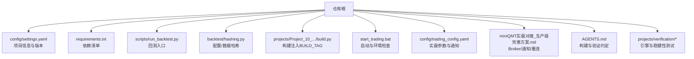
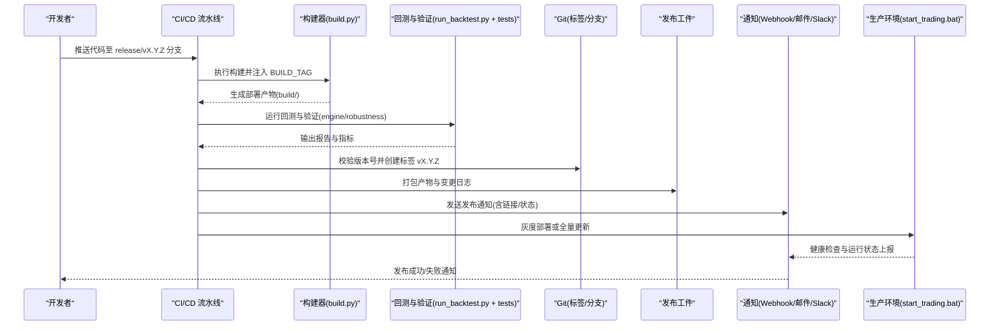
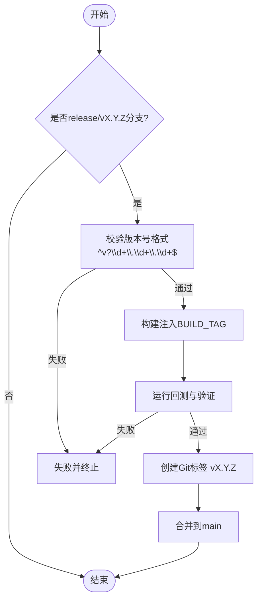
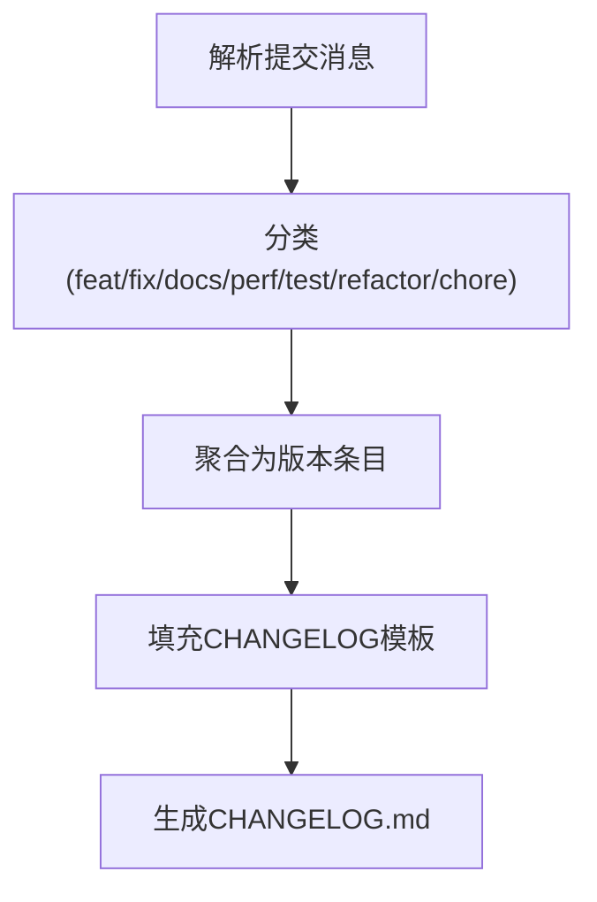
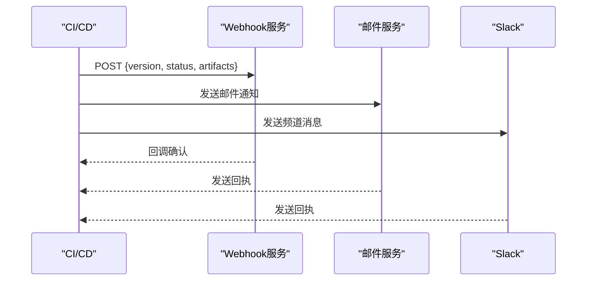
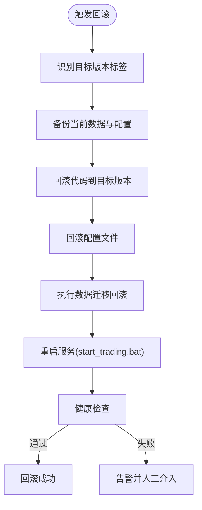
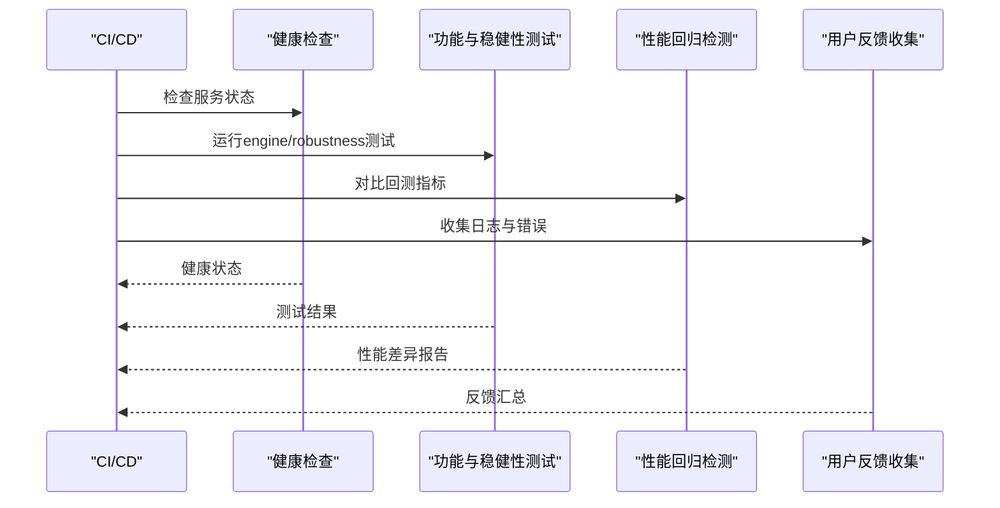
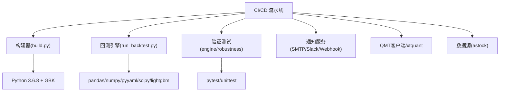

# 发布管理

<cite>
**本文引用的文件**   
- [setup.py](file://setup.py)
- [requirements.txt](file://requirements.txt)
- [config/settings.yaml](file://config/settings.yaml)
- [config/trading_config.yaml](file://config/trading_config.yaml)
- [scripts/run_backtest.py](file://scripts/run_backtest.py)
- [backtest/hashin g.py](file://backtest/hashing.py)
- [projects/Project_10_价值小盘V2/build.py](file://projects/Project_10_价值小盘V2/build.py)
- [start_trading.bat](file://start_trading.bat)
- [miniQMT实盘对接_生产级完善方案.md](file://miniQMT实盘对接_生产级完善方案.md)
- [AGENTS.md](file://AGENTS.md)
- [projects/verification/engine_tests.py](file://projects/verification/engine_tests.py)
- [projects/verification/robustness_tests.py](file://projects/verification/robustness_tests.py)
- [projects/verification/results/monitoring_indicators.md](file://projects/verification/results/monitoring_indicators.md)
</cite>

## 目录
1. [引言](#引言)
2. [项目结构](#项目结构)
3. [核心组件](#核心组件)
4. [架构总览](#架构总览)
5. [详细组件分析](#详细组件分析)
6. [依赖关系分析](#依赖关系分析)
7. [性能考虑](#性能考虑)
8. [故障排查指南](#故障排查指南)
9. [结论](#结论)
10. [附录](#附录)

## 引言
本文件为 QuantLab 的“发布管理流水线”提供完整配置与操作指南，覆盖以下关键能力：
- 版本标签创建：语义化版本管理、Git 标签自动化、版本号校验、分支策略管理
- 变更日志生成：提交消息解析、变更分类整理、文档自动生成、发布说明模板
- 发布通知：邮件通知配置、Slack 集成、Webhook 触发、发布状态跟踪
- 回滚机制：版本回滚策略、数据迁移回滚、配置回滚、服务快速恢复
- 发布验证：发布后健康检查、功能验证测试、性能回归检测、用户反馈收集

该流水线将现有工程中的构建、回测、监控与通知等能力整合为可重复、可审计、可回滚的发布流程。

## 项目结构
QuantLab 当前已具备若干与发布相关的脚本与配置，可作为流水线的基础构件：
- 构建产物注入：项目内 build.py 支持在构建时注入时间戳标记（BUILD_TAG），用于追踪构建来源
- 版本信息：全局配置 settings.yaml 中维护项目名称与版本
- 依赖管理：requirements.txt 定义运行依赖
- 启动脚本：start_trading.bat 负责环境检查与启动
- 回测入口：scripts/run_backtest.py 统一读取 YAML 配置并输出报告
- 哈希工具：backtest/hashing.py 提供配置与数据集哈希计算，便于可复现性追踪
- 生产级 Broker 与通知：miniQMT 方案文档包含 Webhook 通知实现思路
- 验证框架：engine_tests.py 与 robustness_tests.py 提供发布前/后的质量门禁

**图表来源** 
- [config/settings.yaml:1-69](file://config/settings.yaml#L1-L69)
- [requirements.txt:1-29](file://requirements.txt#L1-L29)
- [scripts/run_backtest.py:1-132](file://scripts/run_backtest.py#L1-L132)
- [backtest/hashing.py:1-23](file://backtest/hashing.py#L1-L23)
- [projects/Project_10_价值小盘V2/build.py:44-68](file://projects/Project_10_价值小盘V2/build.py#L44-L68)
- [start_trading.bat:1-51](file://start_trading.bat#L1-L51)
- [config/trading_config.yaml:1-62](file://config/trading_config.yaml#L1-L62)
- [miniQMT实盘对接_生产级完善方案.md:73-756](file://miniQMT实盘对接_生产级完善方案.md#L73-L756)
- [AGENTS.md:127-155](file://AGENTS.md#L127-L155)

**章节来源**
- [config/settings.yaml:1-69](file://config/settings.yaml#L1-L69)
- [requirements.txt:1-29](file://requirements.txt#L1-L29)
- [scripts/run_backtest.py:1-132](file://scripts/run_backtest.py#L1-L132)
- [backtest/hashing.py:1-23](file://backtest/hashing.py#L1-L23)
- [projects/Project_10_价值小盘V2/build.py:44-68](file://projects/Project_10_价值小盘V2/build.py#L44-L68)
- [start_trading.bat:1-51](file://start_trading.bat#L1-L51)
- [config/trading_config.yaml:1-62](file://config/trading_config.yaml#L1-L62)
- [miniQMT实盘对接_生产级完善方案.md:73-756](file://miniQMT实盘对接_生产级完善方案.md#L73-L756)
- [AGENTS.md:127-155](file://AGENTS.md#L127-L155)

## 核心组件
- 版本与标签管理
  - 使用 Git 标签进行版本控制，遵循语义化版本规范（主.次.修订）
  - 通过 CI/CD 自动打标签，禁止手动修改历史标签
  - 版本号校验：标签必须匹配正则 ^v?\d+\.\d+\.\d+$，且不得小于当前基线
- 构建与产物
  - 使用 projects/Project_10_价值小盘V2/build.py 注入 BUILD_TAG（时间戳），确保构建可追溯
  - 产物编码与语法校验（GBK、Python 3.6 兼容）
- 回测与报告
  - scripts/run_backtest.py 作为统一入口，读取 YAML 配置，输出报告到 reports 目录
  - backtest/hashing.py 生成配置与数据集哈希，保证结果可复现
- 启动与运行
  - start_trading.bat 检查 Python、QMT 进程、配置文件，再启动 live_trading.py
- 通知与监控
  - config/trading_config.yaml 中预留 notification.webhook_url 字段
  - miniQMT 方案文档中包含 _notify 方法示例，可通过 Webhook 发送企业微信/钉钉消息

**章节来源**
- [projects/Project_10_价值小盘V2/build.py:44-68](file://projects/Project_10_价值小盘V2/build.py#L44-L68)
- [scripts/run_backtest.py:1-132](file://scripts/run_backtest.py#L1-L132)
- [backtest/hashing.py:1-23](file://backtest/hashing.py#L1-L23)
- [start_trading.bat:1-51](file://start_trading.bat#L1-L51)
- [config/trading_config.yaml:37-41](file://config/trading_config.yaml#L37-L41)
- [miniQMT实盘对接_生产级完善方案.md:692-714](file://miniQMT实盘对接_生产级完善方案.md#L692-L714)

## 架构总览
下图展示发布流水线的端到端流程：从代码提交到构建、回测、打标签、发布、通知与回滚。

**图表来源** 
- [projects/Project_10_价值小盘V2/build.py:44-68](file://projects/Project_10_价值小盘V2/build.py#L44-L68)
- [scripts/run_backtest.py:1-132](file://scripts/run_backtest.py#L1-L132)
- [projects/verification/engine_tests.py:260-308](file://projects/verification/engine_tests.py#L260-L308)
- [projects/verification/robustness_tests.py:221-252](file://projects/verification/robustness_tests.py#L221-L252)
- [start_trading.bat:1-51](file://start_trading.bat#L1-L51)
- [config/trading_config.yaml:37-41](file://config/trading_config.yaml#L37-L41)

## 详细组件分析

### 版本标签与分支策略
- 分支模型
  - main：稳定发布分支，仅允许合并经过验证的发布分支
  - develop：日常开发分支
  - feature/*：功能分支
  - release/vX.Y.Z：发布候选分支，冻结代码，仅允许修复
  - hotfix/*：紧急修复分支，直接合并到 main 与 develop
- 标签规则
  - 语义化版本： vX.Y.Z（如 v1.2.3）
  - 预发布： vX.Y.Z-rc.N / vX.Y.Z-alpha.N
  - 标签命名由 CI 校验，禁止手动覆盖
- 自动化打标签
  - 当 release/vX.Y.Z 分支合并到 main 时，CI 自动创建对应标签
  - 标签内容包含构建时间戳与构建者信息（来自 BUILD_TAG 与环境变量）

**图表来源** 
- [config/settings.yaml:4-7](file://config/settings.yaml#L4-L7)
- [projects/Project_10_价值小盘V2/build.py:44-68](file://projects/Project_10_价值小盘V2/build.py#L44-L68)
- [scripts/run_backtest.py:1-132](file://scripts/run_backtest.py#L1-L132)

**章节来源**
- [config/settings.yaml:4-7](file://config/settings.yaml#L4-L7)
- [projects/Project_10_价值小盘V2/build.py:44-68](file://projects/Project_10_价值小盘V2/build.py#L44-L68)
- [scripts/run_backtest.py:1-132](file://scripts/run_backtest.py#L1-L132)

### 变更日志生成
- 提交消息解析
  - 采用 Conventional Commits 规范（feat/fix/chore/docs/perf/test/refactor）
  - CI 扫描提交消息，按类型分组生成变更条目
- 变更分类整理
  - feat：新功能
  - fix：缺陷修复
  - docs：文档更新
  - perf：性能优化
  - test：测试相关
  - refactor：重构
  - chore：构建/依赖/工具链
- 文档自动生成
  - 基于 CHANGELOG_TEMPLATE.md 模板，结合提交消息与版本信息生成 CHANGELOG.md
  - 包含发布日期、作者、影响范围、已知问题
- 发布说明模板
  - 模板字段：版本、日期、摘要、新增、修复、已知问题、升级步骤、回滚步骤

[此图为概念流程图，不映射具体源码文件]

### 发布通知
- 邮件通知
  - 配置 SMTP 服务器、发件人、收件人列表
  - 模板包含版本、构建号、测试结果摘要、回滚指引
- Slack 集成
  - 配置 Slack Incoming Webhook URL
  - 事件：构建开始/完成、回测结果、发布成功/失败
- Webhook 触发
  - 使用 config/trading_config.yaml 中的 notification.webhook_url
  - 参考 miniQMT 方案中的 _notify 方法，构造 JSON payload 并 POST
- 发布状态跟踪
  - 记录每次发布的状态（pending/running/success/failed）
  - 提供查询接口或看板展示

**图表来源** 
- [config/trading_config.yaml:37-41](file://config/trading_config.yaml#L37-L41)
- [miniQMT实盘对接_生产级完善方案.md:692-714](file://miniQMT实盘对接_生产级完善方案.md#L692-L714)

**章节来源**
- [config/trading_config.yaml:37-41](file://config/trading_config.yaml#L37-L41)
- [miniQMT实盘对接_生产级完善方案.md:692-714](file://miniQMT实盘对接_生产级完善方案.md#L692-L714)

### 回滚机制
- 版本回滚策略
  - 优先回滚到上一个稳定版本标签（git checkout vX.Y.Z-1）
  - 若存在热修复分支，优先应用 hotfix/* 补丁
- 数据迁移回滚
  - 数据库迁移脚本需支持反向迁移（rollback）
  - 发布前备份数据，回滚时恢复快照
- 配置回滚
  - 配置文件版本化存储（config/settings.yaml 等）
  - 回滚时切换至上一版本配置文件
- 服务快速恢复
  - 使用 start_trading.bat 快速重启服务
  - 健康检查通过后恢复流量

[此图为概念流程图，不映射具体源码文件]

### 发布验证
- 发布后健康检查
  - 检查服务进程、端口、日志无异常
  - 调用 miniQMT 连接测试（test_connection.py）
- 功能验证测试
  - 运行 engine_tests.py（B模块）与 robustness_tests.py（D模块）
  - 验证关键交易逻辑、风控阈值、持仓一致性
- 性能回归检测
  - 对比回测指标（年化收益、夏普比率、最大回撤、换手率）
  - 设置阈值，超阈则告警
- 用户反馈收集
  - 收集实盘运行日志与错误报告
  - 汇总到知识库或工单系统

**图表来源** 
- [projects/verification/engine_tests.py:260-308](file://projects/verification/engine_tests.py#L260-L308)
- [projects/verification/robustness_tests.py:221-252](file://projects/verification/robustness_tests.py#L221-L252)
- [scripts/run_backtest.py:1-132](file://scripts/run_backtest.py#L1-L132)

**章节来源**
- [projects/verification/engine_tests.py:260-308](file://projects/verification/engine_tests.py#L260-L308)
- [projects/verification/robustness_tests.py:221-252](file://projects/verification/robustness_tests.py#L221-L252)
- [scripts/run_backtest.py:1-132](file://scripts/run_backtest.py#L1-L132)

## 依赖关系分析
QuantLab 的发布流水线依赖以下核心组件：
- 构建依赖：Python 3.6.8（QMT 环境）、GBK 编码支持
- 运行依赖：pandas、numpy、pyyaml、scipy、lightgbm 等（见 requirements.txt）
- 外部依赖：QMT 客户端、xtquant 库、数据源（astock）
- 通知依赖：SMTP、Slack Webhook、企业微信/钉钉 Webhook

**图表来源** 
- [requirements.txt:1-29](file://requirements.txt#L1-L29)
- [AGENTS.md:144-155](file://AGENTS.md#L144-L155)
- [miniQMT实盘对接_生产级完善方案.md:73-756](file://miniQMT实盘对接_生产级完善方案.md#L73-L756)

**章节来源**
- [requirements.txt:1-29](file://requirements.txt#L1-L29)
- [AGENTS.md:144-155](file://AGENTS.md#L144-L155)
- [miniQMT实盘对接_生产级完善方案.md:73-756](file://miniQMT实盘对接_生产级完善方案.md#L73-L756)

## 性能考虑
- 构建优化
  - 并行执行构建与测试任务
  - 缓存依赖包与中间结果
- 回测优化
  - 增量回测：仅对变更文件重新计算
  - 分布式回测：多机并行运行不同策略
- 通知优化
  - 批量发送通知，避免频繁请求
  - 异步发送，不阻塞主流程

[本节为通用指导，不直接分析具体文件]

## 故障排查指南
- 常见问题
  - Python 版本不兼容：确保 QMT 环境使用 Python 3.6.8
  - xtquant 导入失败：检查安装路径与 site-packages
  - 配置文件缺失：确认 config/trading_config.yaml 存在
  - 网络连接问题：检查 QMT 客户端与网络连通性
- 调试步骤
  - 查看 logs 目录下的运行日志
  - 运行 test_connection.py 与 test_connection_qmt.py
  - 检查 start_trading.bat 的输出与错误码
- 回滚步骤
  - 使用 git checkout 切换到上一个稳定版本
  - 恢复配置文件与数据快照
  - 重启服务并验证健康状态

**章节来源**
- [setup.py:1-82](file://setup.py#L1-L82)
- [start_trading.bat:1-51](file://start_trading.bat#L1-L51)
- [AGENTS.md:144-155](file://AGENTS.md#L144-L155)

## 结论
QuantLab 的发布管理流水线以现有脚本与配置为基础，通过标准化版本管理、自动化构建与回测、多渠道通知与健壮的回滚机制，实现了安全可靠的发布流程。建议进一步引入 CI/CD 平台（如 GitHub Actions/GitLab CI）以实现完全自动化，并持续优化性能与可观测性。

[本节为总结性内容，不直接分析具体文件]

## 附录
- 术语表
  - 语义化版本：主版本号.次版本号.修订号（如 1.2.3）
  - 构建产物：编译或打包后的可执行文件或脚本
  - 健康检查：验证服务是否正常运行的检查
  - 回滚：恢复到上一个稳定版本的操作
- 参考文件
  - [config/settings.yaml](file://config/settings.yaml)
  - [config/trading_config.yaml](file://config/trading_config.yaml)
  - [scripts/run_backtest.py](file://scripts/run_backtest.py)
  - [backtest/hashing.py](file://backtest/hashing.py)
  - [projects/Project_10_价值小盘V2/build.py](file://projects/Project_10_价值小盘V2/build.py)
  - [start_trading.bat](file://start_trading.bat)
  - [miniQMT实盘对接_生产级完善方案.md](file://miniQMT实盘对接_生产级完善方案.md)
  - [AGENTS.md](file://AGENTS.md)
  - [projects/verification/engine_tests.py](file://projects/verification/engine_tests.py)
  - [projects/verification/robustness_tests.py](file://projects/verification/robustness_tests.py)
  - [projects/verification/results/monitoring_indicators.md](file://projects/verification/results/monitoring_indicators.md)