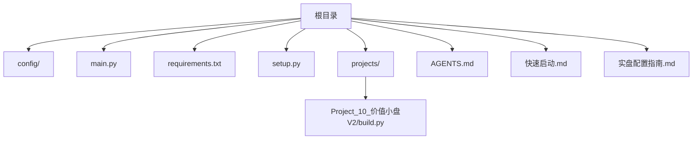
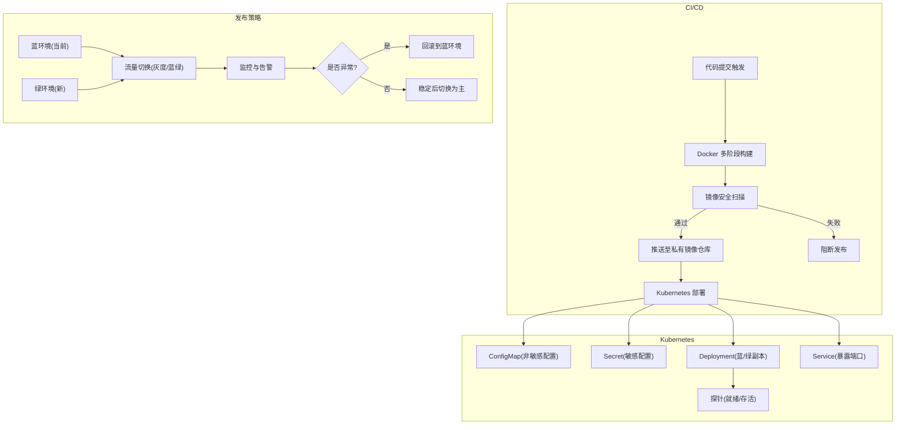
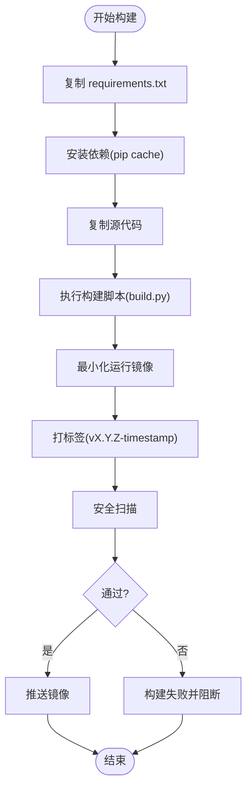
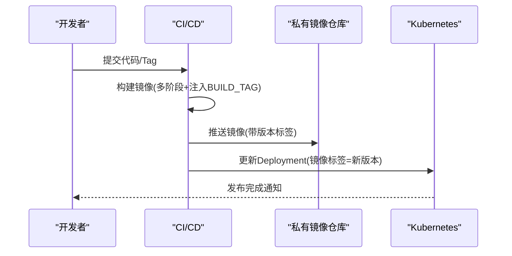
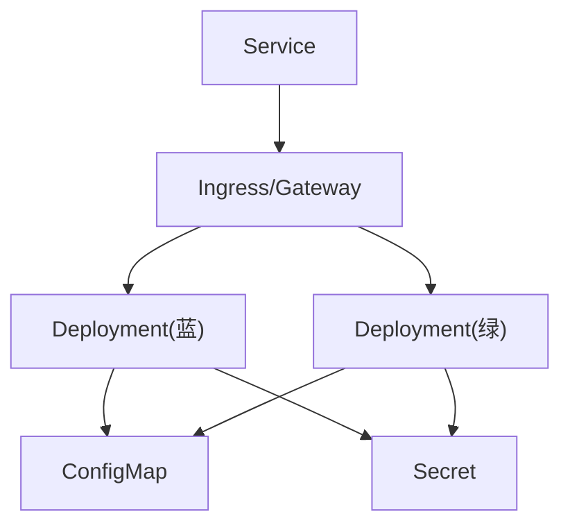
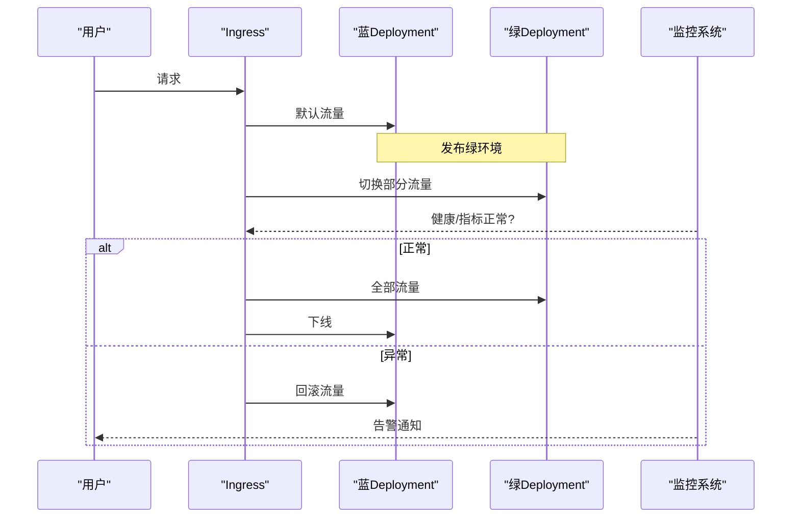
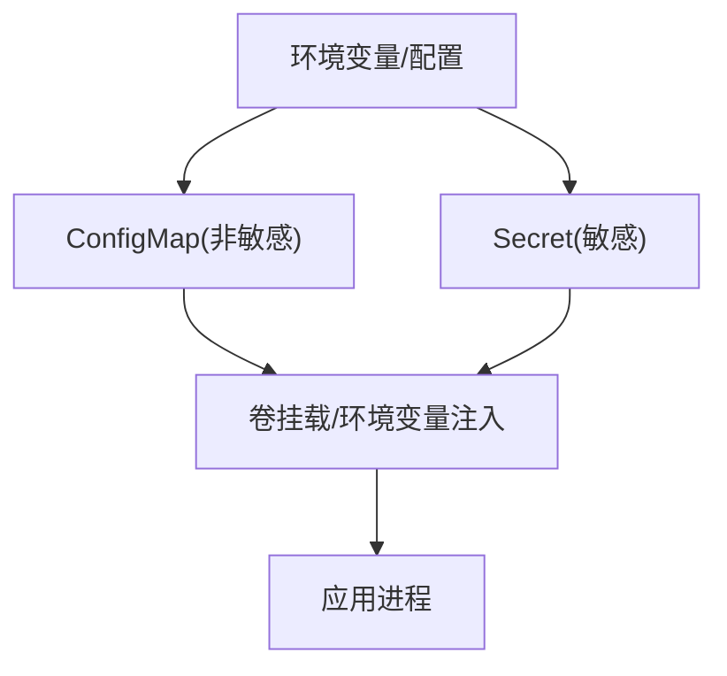
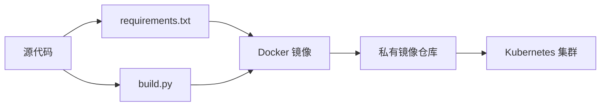

# 自动化部署

<cite>
**本文引用的文件**   
- [requirements.txt](file://requirements.txt)
- [setup.py](file://setup.py)
- [main.py](file://main.py)
- [settings.yaml](file://config\settings.yaml)
- [trading_config.yaml](file://config\trading_config.yaml)
- [AGENTS.md](file://AGENTS.md)
- [快速启动.md](file://快速启动.md)
- [实盘配置指南.md](file://实盘配置指南.md)
- [build.py](file://projects\Project_10_价值小盘V2\build.py)
</cite>

## 目录
1. [简介](#简介)
2. [项目结构](#项目结构)
3. [核心组件](#核心组件)
4. [架构总览](#架构总览)
5. [详细组件分析](#详细组件分析)
6. [依赖分析](#依赖分析)
7. [性能考虑](#性能考虑)
8. [故障排查指南](#故障排查指南)
9. [结论](#结论)
10. [附录](#附录)

## 简介
本文件为 QuantLab 的自动化部署流水线设计文档，覆盖以下目标：
- Docker 镜像构建：多阶段构建优化、镜像层缓存利用、镜像安全扫描、镜像标签管理
- 镜像仓库推送：私有仓库配置、镜像版本管理、拉取权限控制、镜像清理策略
- Kubernetes 部署：Deployment、Service、ConfigMap、Secret
- 蓝绿发布：流量切换机制、健康检查、回滚策略、发布状态监控
- 环境配置管理：环境变量注入、配置文件挂载、密钥管理、环境隔离

本方案基于仓库现有代码与配置（Python 依赖、QMT 集成、策略构建产物等）进行编排，确保从源码到生产运行的全链路可重复、可审计、可回滚。

## 项目结构
QuantLab 采用“研究-回测-策略-交易”分层组织，关键目录与职责如下：
- config：全局与实盘配置（settings.yaml、trading_config.yaml）
- main.py：回测入口，加载配置并运行策略
- requirements.txt：Python 依赖声明
- setup.py：本地一键配置脚本（xtquant 安装、路径校验、目录创建）
- projects/...：各策略项目独立目录，含构建产物生成脚本（如 Project_10 的 build.py）
- AGENTS.md：开发规范与 QMT 红线、构建产物约定
- 快速启动.md / 实盘配置指南.md：本地与实盘操作指引

**章节来源**
- [requirements.txt:1-29](file://requirements.txt#L1-L29)
- [setup.py:1-82](file://setup.py#L1-L82)
- [main.py:1-104](file://main.py#L1-L104)
- [settings.yaml:1-69](file://config\settings.yaml#L1-L69)
- [trading_config.yaml:1-62](file://config\trading_config.yaml#L1-L62)
- [AGENTS.md:1-194](file://AGENTS.md#L1-L194)
- [快速启动.md:1-67](file://快速启动.md#L1-L67)
- [实盘配置指南.md:1-258](file://实盘配置指南.md#L1-L258)
- [build.py:44-68](file://projects\Project_10_价值小盘V2\build.py#L44-L68)

## 核心组件
- 依赖与运行时环境
  - Python 依赖通过 requirements.txt 声明，包含 pandas、numpy、pyyaml、scipy、lightgbm 等
  - QMT 依赖 xtquant，需从 QMT 安装目录复制或使用其内置 Python 3.6.8
- 配置系统
  - settings.yaml：全局项目信息、数据源、回测参数、因子预处理、日志
  - trading_config.yaml：账号、交易参数、风控阈值、委托管理、调度计划、通知
- 构建与产物
  - Project_10 的 build.py 负责将策略源码转换为 GBK 编码的单文件部署包，并注入构建时间戳作为版本标记
- 入口与执行
  - main.py 加载 settings.yaml，按策略名称路由至对应模块执行回测流程

**章节来源**
- [requirements.txt:1-29](file://requirements.txt#L1-L29)
- [settings.yaml:1-69](file://config\settings.yaml#L1-L69)
- [trading_config.yaml:1-62](file://config\trading_config.yaml#L1-L62)
- [build.py:44-68](file://projects\Project_10_价值小盘V2\build.py#L44-L68)
- [main.py:21-35](file://main.py#L21-L35)

## 架构总览
下图展示从源码到容器化与 K8s 部署的整体流水线，包括构建、扫描、推送、部署与发布策略。

[本图为概念性架构图，不直接映射具体源码文件]

## 详细组件分析

### Docker 镜像构建（多阶段、缓存、安全、标签）
- 多阶段构建建议
  - 构建阶段：安装依赖、编译或准备构建产物（例如调用 Project_10 的 build.py 生成 GBK 单文件）
  - 运行阶段：仅包含运行所需的最小依赖与构建产物，减少镜像体积与攻击面
- 镜像层缓存利用
  - 先拷贝 requirements.txt 并安装依赖，再拷贝业务代码，最大化复用 pip 缓存层
  - 对频繁变更的文件（如策略构建产物）放在靠后的层，避免破坏上游依赖层缓存
- 镜像安全扫描
  - 在 CI 中集成 Trivy/Clair 等工具，扫描 CVE 与违规配置
  - 设置质量门禁：严重漏洞阻断发布
- 镜像标签管理
  - 使用语义化版本与时间戳组合标签，如 v1.2.3-20260803-123456
  - 同时维护 latest 指向最新稳定版本；保留历史版本用于回滚

**章节来源**
- [requirements.txt:1-29](file://requirements.txt#L1-L29)
- [build.py:44-68](file://projects\Project_10_价值小盘V2\build.py#L44-L68)

### 镜像仓库推送（私有仓库、版本、权限、清理）
- 私有仓库配置
  - 使用 Harbor/阿里云/腾讯云等私有仓库，CI 中通过凭据登录
  - 区分命名空间与环境（dev/staging/prod），限制跨环境推送
- 镜像版本管理
  - 以 Git tag 或分支名驱动镜像版本，保证可追溯
  - 构建时注入 BUILD_TAG（参考 Project_10 的构建逻辑），便于运行时识别版本
- 拉取权限控制
  - 为不同环境创建只读 ServiceAccount，仅允许拉取指定命名空间镜像
  - 启用镜像签名与校验（可选）
- 镜像清理策略
  - 保留最近 N 个版本与最近 M 天内的镜像
  - 自动删除未使用的标签与过期制品

**章节来源**
- [build.py:44-68](file://projects\Project_10_价值小盘V2\build.py#L44-L68)

### Kubernetes 部署（Deployment、Service、ConfigMap、Secret）
- Deployment
  - 定义蓝/绿两套 Deployment，分别承载旧/新版本
  - 使用 readinessProbe/livenessProbe 确保服务可用性
- Service
  - 通过 Service 暴露端口，配合 Ingress/Gateway 实现外部访问
- ConfigMap
  - 存放非敏感配置（如 settings.yaml 中的非机密部分）
- Secret
  - 存放敏感信息（如 QMT 账号、Webhook URL、数据库密码等）
  - 通过环境变量或卷挂载注入应用

[本图为概念性架构图，不直接映射具体源码文件]

### 蓝绿发布策略（流量切换、健康检查、回滚、监控）
- 流量切换机制
  - 通过 Service 的 Selector 或 Ingress 的路由规则切换流量
  - 支持逐步放量（灰度）与快速切回
- 健康检查配置
  - readinessProbe：确保 Pod 就绪后再接收流量
  - livenessProbe：检测进程健康，异常自动重启
- 回滚策略实施
  - 若健康检查失败或监控指标异常，立即回滚到蓝环境
  - 保留历史镜像标签以便快速回滚
- 发布状态监控
  - 监控 Pod 状态、延迟、错误率、资源使用率
  - 结合日志与告警（企业微信/钉钉 Webhook）

**章节来源**
- [AGENTS.md:185-194](file://AGENTS.md#L185-L194)

### 环境配置管理（变量注入、配置挂载、密钥、隔离）
- 环境变量注入
  - 通过 K8s Secret/ConfigMap 注入环境变量（如 QMT 路径、账号 ID）
- 配置文件挂载
  - 将 settings.yaml、trading_config.yaml 以卷形式挂载到容器
  - 支持热更新（谨慎使用，需应用支持）
- 密钥管理
  - 敏感信息统一放入 Secret，禁止硬编码
  - 定期轮换密钥并记录审计
- 环境隔离策略
  - 使用不同 Namespace 隔离 dev/staging/prod
  - 网络策略限制跨 Namespace 访问

[本图为概念性流程图，不直接映射具体源码文件]

## 依赖分析
- 运行时依赖
  - Python 库：pandas、numpy、pyyaml、scipy、lightgbm 等
  - QMT 依赖：xtquant（需从 QMT 安装目录获取）
- 构建依赖
  - Project_10 的 build.py 需要 Python 解释器与文件系统写入权限
- 外部依赖
  - 私有镜像仓库（Harbor/云厂商）
  - Kubernetes 集群（Node、Ingress、Secret、ConfigMap）

**章节来源**
- [requirements.txt:1-29](file://requirements.txt#L1-L29)
- [build.py:44-68](file://projects\Project_10_价值小盘V2\build.py#L44-L68)

## 性能考虑
- 镜像体积优化
  - 使用多阶段构建，仅保留必要依赖与产物
  - 选择轻量基础镜像（如 python:3.11-slim）
- 构建缓存
  - 合理分层，优先安装依赖，再拷贝代码
  - 利用 pip 缓存与 Docker BuildKit
- 运行时性能
  - 合理设置 CPU/内存限制与请求
  - 启用水平扩缩容（HPA）应对负载波动
- 数据与缓存
  - 数据缓存目录（data/cache）与日志目录（logs）使用持久卷
  - 避免在容器内写大文件，必要时使用临时卷

[本节为通用指导，无需特定文件引用]

## 故障排查指南
- 常见问题定位
  - xtquant 导入失败：检查 QMT 路径与 Python 环境
  - 连接失败：确认 QMT 客户端已启动并登录
  - 账户查询返回 0：核对账号 ID 配置
  - 程序崩溃恢复：检查 broker_state.json 状态文件
- 日志与监控
  - 查看交易日志 logs/trading_YYYYMMDD.log
  - 监控持仓 data/positions.json 与净值 data/equity_curve.csv
  - 配置 Webhook 告警（企业微信/钉钉）

**章节来源**
- [setup.py:15-34](file://setup.py#L15-L34)
- [快速启动.md:1-67](file://快速启动.md#L1-L67)
- [实盘配置指南.md:154-208](file://实盘配置指南.md#L154-L208)

## 结论
本方案为 QuantLab 提供了完整的自动化部署流水线设计，涵盖镜像构建、仓库推送、Kubernetes 部署与蓝绿发布策略。通过严格的环境配置管理与安全扫描，确保从开发到生产的可重复性与稳定性。建议在实际落地时结合团队规范与基础设施能力进行细化与扩展。

[本节为总结性内容，无需特定文件引用]

## 附录
- 相关文档与脚本
  - AGENTS.md：开发规范与 QMT 红线
  - 快速启动.md：本地与实盘操作指引
  - 实盘配置指南.md：详细配置步骤与常见问题
  - setup.py：一键配置脚本
  - build.py：策略构建产物生成

**章节来源**
- [AGENTS.md:1-194](file://AGENTS.md#L1-L194)
- [快速启动.md:1-67](file://快速启动.md#L1-L67)
- [实盘配置指南.md:1-258](file://实盘配置指南.md#L1-L258)
- [setup.py:1-82](file://setup.py#L1-L82)
- [build.py:44-68](file://projects\Project_10_价值小盘V2\build.py#L44-L68)