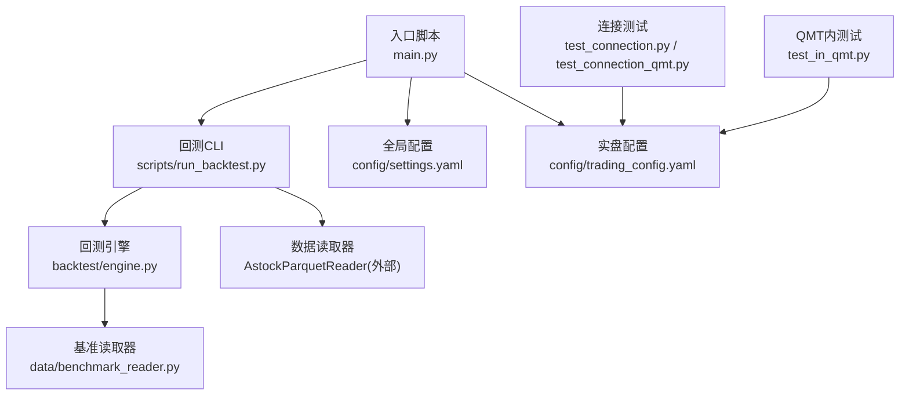
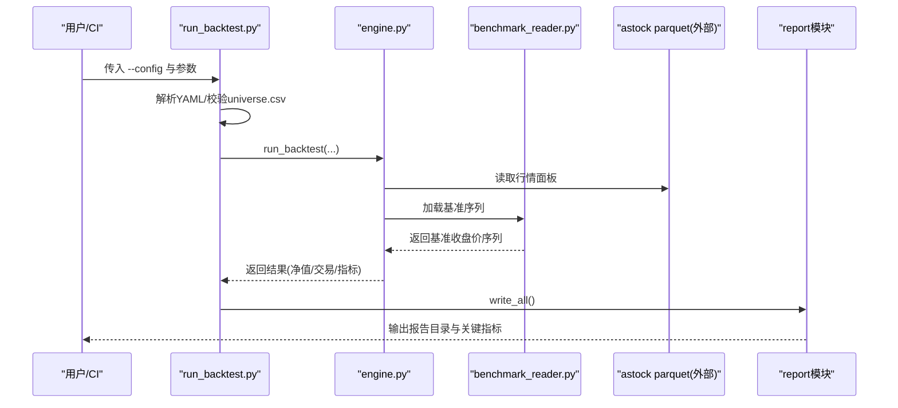
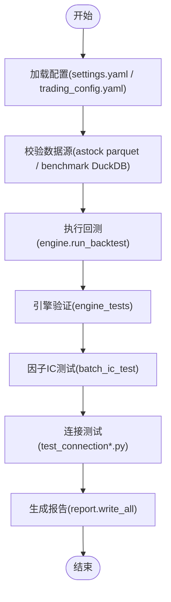
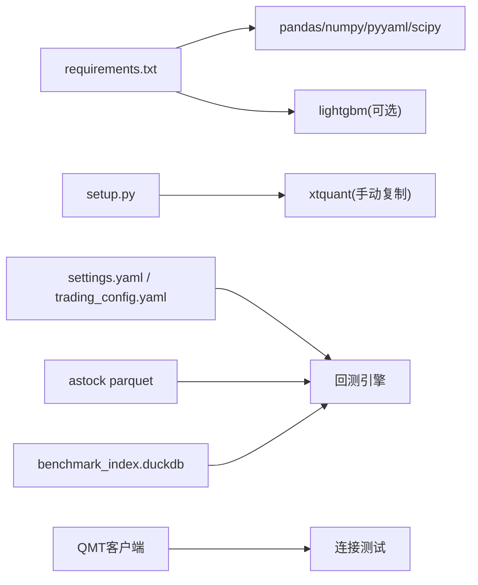

# 集成测试流水线

<cite>
**本文引用的文件**   
- [main.py](file://main.py)
- [requirements.txt](file://requirements.txt)
- [setup.py](file://setup.py)
- [config/settings.yaml](file://config/settings.yaml)
- [config/trading_config.yaml](file://config/trading_config.yaml)
- [scripts/run_backtest.py](file://scripts/run_backtest.py)
- [backtest/engine.py](file://backtest/engine.py)
- [data/benchmark_reader.py](file://data/benchmark_reader.py)
- [projects/verification/engine_tests.py](file://projects/verification/engine_tests.py)
- [projects/verification/portfolio_tests.py](file://projects/verification/portfolio_tests.py)
- [projects/verification/robustness_tests.py](file://projects/verification/robustness_tests.py)
- [scripts/batch_ic_test.py](file://scripts/batch_ic_test.py)
- [test_connection.py](file://test_connection.py)
- [test_connection_qmt.py](file://test_connection_qmt.py)
- [test_in_qmt.py](file://test_in_qmt.py)
- [AGENTS.md](file://AGENTS.md)
- [全局复利与踩坑日志.md](file://全局复利与踩坑日志.md)
</cite>

## 目录
1. [引言](#引言)
2. [项目结构](#项目结构)
3. [核心组件](#核心组件)
4. [架构总览](#架构总览)
5. [详细组件分析](#详细组件分析)
6. [依赖关系分析](#依赖关系分析)
7. [性能考量](#性能考量)
8. [故障排查指南](#故障排查指南)
9. [结论](#结论)
10. [附录](#附录)

## 引言
本文件为 QuantLab 的集成测试流水线配置与说明，覆盖端到端测试、接口测试、兼容性测试、性能基准测试与故障恢复测试。目标是在 CI/CD 或本地自动化环境中，稳定验证回测引擎、数据管线、策略执行、QMT 实盘连接以及关键配置与环境变量的一致性，确保从研究到生产的可重复性与可靠性。

## 项目结构
QuantLab 采用模块化组织：
- 回测引擎与报告：backtest/*, scripts/run_backtest.py
- 数据读取与基准：data/*, data/benchmark_reader.py
- 策略与因子：strategy/*, factors/*, projects/*
- 配置与环境：config/*, requirements.txt, setup.py
- 连接与集成测试：test_connection*.py, test_in_qmt.py
- 验证套件：projects/verification/*

图表来源 
- [main.py:21-92](file://main.py#L21-L92)
- [scripts/run_backtest.py:42-127](file://scripts/run_backtest.py#L42-L127)
- [backtest/engine.py:41-73](file://backtest/engine.py#L41-L73)
- [data/benchmark_reader.py:21-42](file://data/benchmark_reader.py#L21-L42)
- [config/settings.yaml:1-69](file://config/settings.yaml#L1-L69)
- [config/trading_config.yaml:1-62](file://config/trading_config.yaml#L1-L62)

章节来源
- [main.py:1-104](file://main.py#L1-L104)
- [scripts/run_backtest.py:1-132](file://scripts/run_backtest.py#L1-L132)
- [config/settings.yaml:1-69](file://config/settings.yaml#L1-L69)
- [config/trading_config.yaml:1-62](file://config/trading_config.yaml#L1-L62)

## 核心组件
- 回测入口与CLI
  - main.py：加载全局配置，选择策略并运行回测（兼容旧版与新策略）。
  - scripts/run_backtest.py：标准化 CLI，解析 YAML 配置，调用 backtest.engine.run_backtest，输出报告与指标。
- 回测引擎
  - backtest/engine.py：核心回测逻辑，含基准数据加载、样本期诊断、绩效指标计算等。
  - data/benchmark_reader.py：只读基准索引读取器，封装 DuckDB 查询。
- 连接与集成测试
  - test_connection.py：外部 Python 环境 miniQMT 连接测试。
  - test_connection_qmt.py：QMT 内置 Python 的连接测试。
  - test_in_qmt.py：在 QMT 策略研究环境中的连接测试。
- 验证套件
  - projects/verification/engine_tests.py：回测引擎 8 项验证。
  - projects/verification/portfolio_tests.py：组合优化与多策略对比。
  - projects/verification/robustness_tests.py：稳健性检验（子样本、牛熊分拆、压力测试等）。
- 批量因子IC测试
  - scripts/batch_ic_test.py：批量计算 alpha101/gtja191 因子的 IC/ICIR，输出报告。

章节来源
- [main.py:21-92](file://main.py#L21-L92)
- [scripts/run_backtest.py:42-127](file://scripts/run_backtest.py#L42-L127)
- [backtest/engine.py:41-73](file://backtest/engine.py#L41-L73)
- [data/benchmark_reader.py:21-42](file://data/benchmark_reader.py#L21-L42)
- [projects/verification/engine_tests.py:260-308](file://projects/verification/engine_tests.py#L260-L308)
- [projects/verification/portfolio_tests.py:184-231](file://projects/verification/portfolio_tests.py#L184-L231)
- [projects/verification/robustness_tests.py:221-266](file://projects/verification/robustness_tests.py#L221-L266)
- [scripts/batch_ic_test.py:1-266](file://scripts/batch_ic_test.py#L1-L266)

## 架构总览
下图展示从配置加载、数据读取、回测执行到报告输出的完整流程，以及连接测试与 QMT 集成的边界。

图表来源 
- [scripts/run_backtest.py:42-127](file://scripts/run_backtest.py#L42-L127)
- [backtest/engine.py:41-73](file://backtest/engine.py#L41-L73)
- [data/benchmark_reader.py:21-42](file://data/benchmark_reader.py#L21-L42)

## 详细组件分析

### 端到端测试（E2E）
- 完整交易流程测试
  - 使用 scripts/run_backtest.py 驱动全量回测，覆盖数据加载、策略信号、交易执行、风控与报告生成。
  - 通过 engine_tests.py 的 8 项用例验证涨跌停、停牌、资金约束、持仓一致性、先卖后买、止损等关键行为。
- 数据更新流程测试
  - 以 astock parquet 作为只读数据源；基准数据由 benchmark_reader.py 从 DuckDB 读取。
  - 建议在 CI 中定期校验 parquet 与 duckdb 文件存在性与时间戳，失败则阻断流水线。
- 策略回测流程测试
  - 使用不同策略配置文件（如 atr_lowvol_fw.yaml 等）进行回归测试，确保历史结果可重现。
  - 结合 batch_ic_test.py 对因子库进行抽样或全量 IC 测试，保障因子稳定性。
- 实盘连接测试
  - 使用 test_connection.py（外部 Python）与 test_connection_qmt.py（QMT 内置 Python）分别验证连接、账户查询、持仓查询。
  - 在 QMT 策略研究环境用 test_in_qmt.py 做最小连通性检查。

章节来源
- [scripts/run_backtest.py:42-127](file://scripts/run_backtest.py#L42-L127)
- [projects/verification/engine_tests.py:260-308](file://projects/verification/engine_tests.py#L260-L308)
- [scripts/batch_ic_test.py:1-266](file://scripts/batch_ic_test.py#L1-L266)
- [test_connection.py:1-117](file://test_connection.py#L1-L117)
- [test_connection_qmt.py:1-117](file://test_connection_qmt.py#L1-L117)
- [test_in_qmt.py:1-53](file://test_in_qmt.py#L1-L53)

### 接口测试
- QMT API 接口测试
  - 使用 xtquant.xttrader 与 xtdata 完成连接、订阅、资产与持仓查询、下单/撤单（dry-run）等。
  - 分别在外部 Python 与 QMT 内置 Python 环境下执行，确保两套环境一致。
- 数据源接口测试
  - 校验 astock parquet 路径与字段完整性；校验 benchmark_index.duckdb 表结构与时间范围。
- 配置文件验证
  - settings.yaml：回测起止日期、初始资金、手续费滑点、日志路径等。
  - trading_config.yaml：账号、会话ID、交易费率、风控阈值、调度时间表、通知 webhook 等。
- 环境变量检查
  - 检查 Python 版本、xtquant 安装、QMT 路径、必要目录是否存在。

章节来源
- [test_connection.py:1-117](file://test_connection.py#L1-L117)
- [test_connection_qmt.py:1-117](file://test_connection_qmt.py#L1-L117)
- [config/settings.yaml:1-69](file://config/settings.yaml#L1-L69)
- [config/trading_config.yaml:1-62](file://config/trading_config.yaml#L1-L62)

### 兼容性测试
- Python 版本兼容性
  - 研究环境 Python 3.11，QMT 生产需保持 Python 3.6.8 兼容。构建产物需 GBK 编码且无 3.6+ 语法。
- 依赖包版本兼容性
  - 基于 requirements.txt 锁定核心依赖版本，避免升级导致的行为差异。
- 操作系统兼容性
  - Windows 路径分隔符与 QMT 安装路径需正确配置；必要时在 CI 中使用 Windows 镜像。
- 浏览器兼容性
  - 若使用可视化（可选），建议限定主流浏览器版本并在报告中包含渲染截图。

章节来源
- [AGENTS.md:142-155](file://AGENTS.md#L142-L155)
- [requirements.txt:1-29](file://requirements.txt#L1-L29)
- [setup.py:1-82](file://setup.py#L1-L82)

### 性能基准测试
- 回测性能测试
  - 记录 run_backtest.py 的执行时长、内存峰值与 CPU 使用率；比较不同策略与数据规模下的耗时。
- 数据处理性能测试
  - 评估 astock parquet 读取与 panel 构建耗时；监控 DuckDB 基准查询延迟。
- 内存与CPU监控
  - 在 CI 中启用资源监控（如 psutil 或系统工具），输出性能摘要至报告目录。

[本节为通用指导，不直接分析具体文件]

### 故障恢复测试
- 异常处理测试
  - 模拟数据缺失、基准文件不存在、QMT 未启动等场景，验证降级与错误提示。
- 数据恢复测试
  - 校验 parquet/duckdb 损坏时的恢复流程（重建或回滚到最近快照）。
- 服务重启测试
  - 模拟 QMT 进程重启后的重连与状态恢复（订单反查、持仓对齐）。
- 错误恢复验证
  - 委托超时、部分成交、断线重连等场景的自动重试与告警。

章节来源
- [backtest/engine.py:41-73](file://backtest/engine.py#L41-L73)
- [data/benchmark_reader.py:21-42](file://data/benchmark_reader.py#L21-L42)
- [test_connection.py:1-117](file://test_connection.py#L1-L117)
- [test_connection_qmt.py:1-117](file://test_connection_qmt.py#L1-L117)
- [全局复利与踩坑日志.md:379-412](file://全局复利与踩坑日志.md#L379-L412)

## 依赖关系分析
- 核心依赖
  - pandas>=2.0, numpy>=1.24, pyyaml>=6.0, scipy>=1.10
  - lightgbm>=4.0（可选 ML）
  - xtquant（从 QMT 安装目录复制，非 pip 安装）
- 运行时依赖
  - astock parquet 数据文件
  - benchmark_index.duckdb 基准数据库
  - QMT 客户端与登录态

图表来源 
- [requirements.txt:1-29](file://requirements.txt#L1-L29)
- [setup.py:1-82](file://setup.py#L1-L82)
- [config/settings.yaml:1-69](file://config/settings.yaml#L1-L69)
- [config/trading_config.yaml:1-62](file://config/trading_config.yaml#L1-L62)

章节来源
- [requirements.txt:1-29](file://requirements.txt#L1-L29)
- [setup.py:1-82](file://setup.py#L1-L82)

## 性能考量
- 数据读取优化
  - 使用 parquet 列式存储与按需读取；减少不必要的列加载。
- 基准查询优化
  - 限制时间窗口与列投影；缓存常用基准序列。
- 回测批处理
  - 并行化因子计算与 IC 测试；控制并发度避免 OOM。
- 监控与告警
  - 在 CI 中收集耗时、内存、CPU 指标；设置阈值告警。

[本节为通用指导，不直接分析具体文件]

## 故障排查指南
- 常见连接问题
  - xtquant 未安装或路径错误 → 使用 setup.py 或手动复制到 site-packages。
  - QMT 未启动或未登录 → 启动 XtMiniQmt.exe 并登录账号。
  - 配置文件路径不正确 → 核对 config/trading_config.yaml 中的 account.path。
- 数据问题
  - astock parquet 缺失或字段不全 → 重新拉取数据并校验字段。
  - benchmark_index.duckdb 不存在 → 运行同步脚本重建。
- 回测异常
  - 基准数据为空或价格为零 → 检查时间窗口与数据质量。
  - 样本期过短 → 调整 start_date/end_date。
- 日志与定位
  - 查看 logs 目录与 QMT 日志文件（XtClient_FormulaOutput_*.log）。
  - 遵循“遇异常必停”原则，保留堆栈与上下文。

章节来源
- [setup.py:1-82](file://setup.py#L1-L82)
- [test_connection.py:1-117](file://test_connection.py#L1-L117)
- [test_connection_qmt.py:1-117](file://test_connection_qmt.py#L1-L117)
- [backtest/engine.py:41-73](file://backtest/engine.py#L41-L73)
- [全局复利与踩坑日志.md:379-412](file://全局复利与踩坑日志.md#L379-L412)

## 结论
本集成测试流水线将回测、数据、策略与 QMT 实盘连接纳入统一自动化流程，通过端到端验证、接口测试、兼容性检查、性能基准与故障恢复测试，确保系统在研究与生产环境的一致性与稳定性。建议在每次代码变更与数据更新后，按流水线顺序执行相关测试，并将结果归档至 reports 与 verification/results 目录，便于追溯与评审。

## 附录
- 快速命令参考
  - 运行回测：python -m scripts.run_backtest --config config/atr_lowvol_fw.yaml
  - 连接测试（外部 Python）：python test_connection.py
  - 连接测试（QMT 内置 Python）：python test_connection_qmt.py
  - 因子IC批量测试：python scripts/batch_ic_test.py
  - 引擎验证套件：python projects/verification/engine_tests.py
  - 组合优化验证：python projects/verification/portfolio_tests.py
  - 稳健性验证：python projects/verification/robustness_tests.py

[本节为通用指导，不直接分析具体文件]