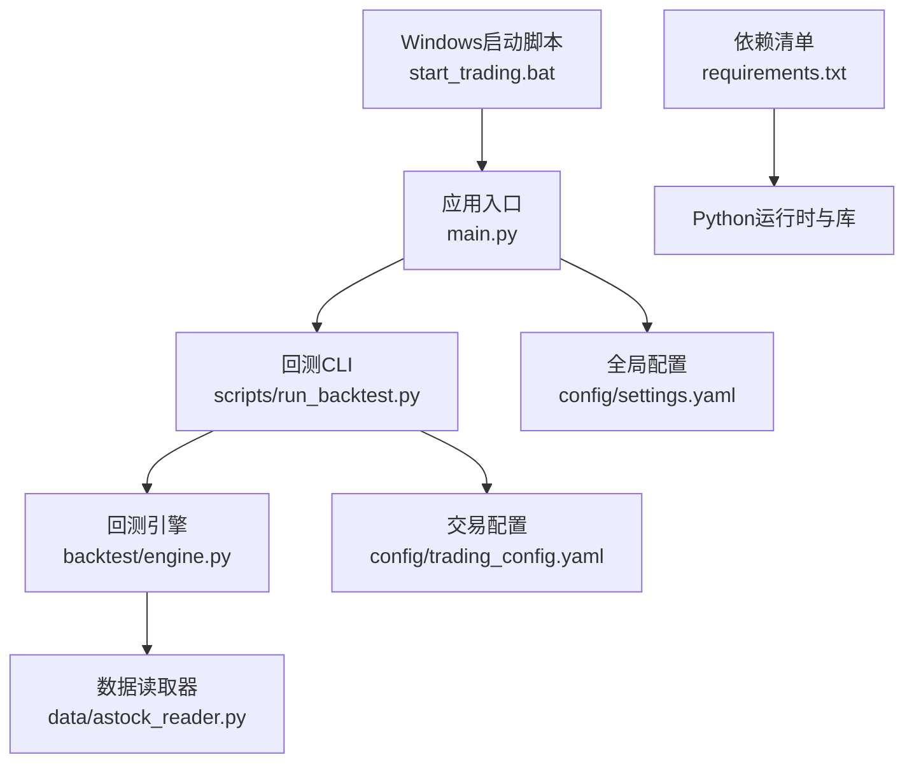
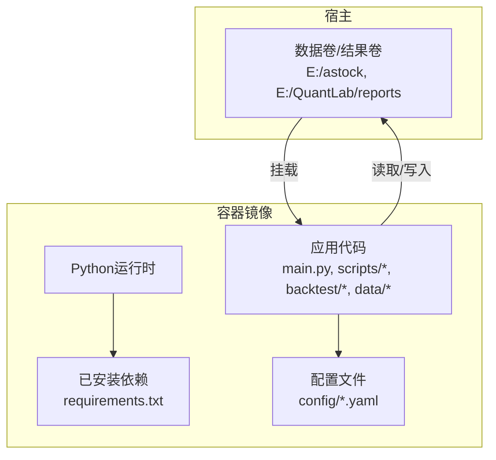
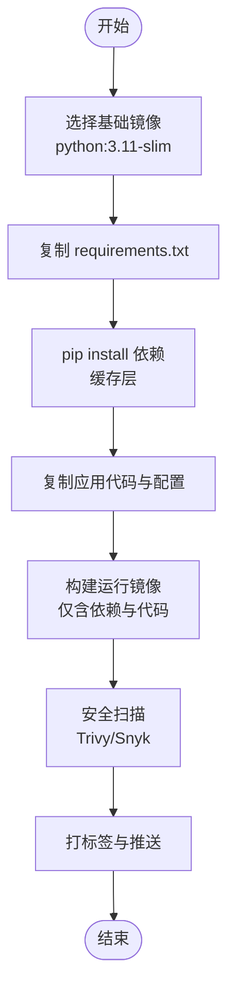
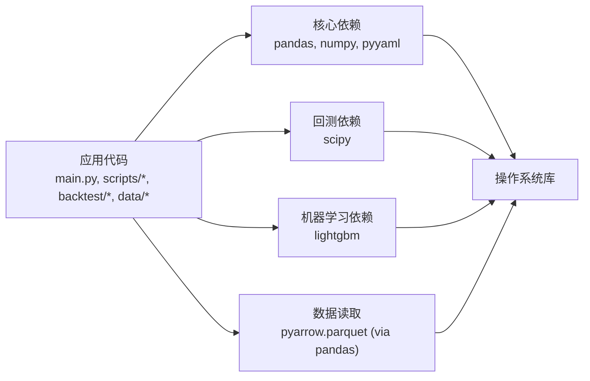

# Docker镜像构建

<cite>
**本文引用的文件**   
- [requirements.txt](file://requirements.txt)
- [setup.py](file://setup.py)
- [main.py](file://main.py)
- [scripts/run_backtest.py](file://scripts\run_backtest.py)
- [config/settings.yaml](file://config\settings.yaml)
- [config/trading_config.yaml](file://config\trading_config.yaml)
- [start_trading.bat](file://start_trading.bat)
- [backtest/engine.py](file://backtest\engine.py)
- [data/astock_reader.py](file://data\astock_reader.py)
</cite>

## 目录
1. [简介](#简介)
2. [项目结构](#项目结构)
3. [核心组件](#核心组件)
4. [架构总览](#架构总览)
5. [详细组件分析](#详细组件分析)
6. [依赖分析](#依赖分析)
7. [性能考虑](#性能考虑)
8. [故障排查指南](#故障排查指南)
9. [结论](#结论)
10. [附录：Dockerfile与构建命令模板](#附录dockerfile与构建命令模板)

## 简介
本指南面向 QuantLab 的容器化与镜像构建，目标是提供一套可复现、可审计、体积可控的多阶段构建方案。内容涵盖基础镜像选择、依赖分层安装、代码复制顺序优化、环境变量与缓存策略、安全扫描集成、标签与版本管理、构建上下文优化以及镜像瘦身技巧。所有建议均基于仓库中的运行入口、配置与依赖声明进行推导，确保落地可行。

## 项目结构
QuantLab 是一个以 Python 为核心的量化回测与实盘框架，关键特征如下：
- 运行入口与脚本：主入口 main.py、回测CLI scripts/run_backtest.py、Windows启动脚本 start_trading.bat
- 配置集中：全局 settings.yaml、交易配置 trading_config.yaml
- 数据读取：AstockParquetReader（parquet只读）、基准数据通过 DuckDB 或外部路径
- 依赖声明：requirements.txt 明确核心与可选依赖
- 本地环境初始化：setup.py 用于 QMT 相关依赖的本地部署（非容器内）

**图表来源** 
- [main.py:1-104](file://main.py#L1-L104)
- [scripts/run_backtest.py:1-132](file://scripts\run_backtest.py#L1-L132)
- [backtest/engine.py:1-200](file://backtest\engine.py#L1-L200)
- [data/astock_reader.py:1-192](file://data\astock_reader.py#L1-L192)
- [config/settings.yaml:1-69](file://config\settings.yaml#L1-L69)
- [config/trading_config.yaml:1-62](file://config\trading_config.yaml#L1-L62)
- [requirements.txt:1-29](file://requirements.txt#L1-L29)
- [start_trading.bat:1-51](file://start_trading.bat#L1-L51)

**章节来源**
- [main.py:1-104](file://main.py#L1-L104)
- [scripts/run_backtest.py:1-132](file://scripts\run_backtest.py#L1-L132)
- [config/settings.yaml:1-69](file://config\settings.yaml#L1-L69)
- [config/trading_config.yaml:1-62](file://config\trading_config.yaml#L1-L62)
- [requirements.txt:1-29](file://requirements.txt#L1-L29)
- [start_trading.bat:1-51](file://start_trading.bat#L1-L51)

## 核心组件
- 依赖与运行时
  - requirements.txt 定义了核心库（pandas、numpy、pyyaml）、回测（scipy）、ML（lightgbm）及可选依赖。容器内应仅安装必要依赖，按需启用可选功能。
- 运行入口与参数
  - main.py 提供回测入口，支持 --strategy 等参数；scripts/run_backtest.py 是更完整的 CLI，接受 --config 指定 YAML 配置，并输出报告到 reports 目录。
- 配置驱动
  - config/settings.yaml 定义数据源、缓存、日志、因子与策略默认值；config/trading_config.yaml 定义账户、风控、调度、通知与数据路径。
- 数据访问
  - data/astock_reader.py 实现只读 parquet 读取，按列裁剪降低内存占用；backtest/engine.py 负责回测主循环与指标计算。
- Windows 启动脚本
  - start_trading.bat 检查 Python、QMT 进程、创建目录并启动 live_trading.py（容器化时通常替换为 docker run）。

**章节来源**
- [requirements.txt:1-29](file://requirements.txt#L1-L29)
- [main.py:1-104](file://main.py#L1-L104)
- [scripts/run_backtest.py:1-132](file://scripts\run_backtest.py#L1-L132)
- [config/settings.yaml:1-69](file://config\settings.yaml#L1-L69)
- [config/trading_config.yaml:1-62](file://config\trading_config.yaml#L1-L62)
- [data/astock_reader.py:1-192](file://data\astock_reader.py#L1-L192)
- [backtest/engine.py:1-200](file://backtest\engine.py#L1-L200)
- [start_trading.bat:1-51](file://start_trading.bat#L1-L51)

## 架构总览
下图展示容器化后的典型运行流程：镜像包含 Python 运行时与依赖，应用代码与配置文件进入镜像，数据通过卷挂载或外部存储访问，回测结果写入持久卷。

[此图为概念性架构图，不直接映射具体源码文件]

## 详细组件分析

### 多阶段构建策略
- 阶段一：构建依赖层
  - 使用官方 Python 镜像作为基础（如 python:3.11-slim），先复制 requirements.txt 并执行 pip install，利用 Docker 缓存加速后续构建。
  - 若需编译型依赖（如 numpy/pandas/lightgbm），优先使用预编译 wheel 的官方镜像，避免在容器中安装系统级编译器。
- 阶段二：最小运行镜像
  - 将依赖层产物复制到新的轻量镜像中，仅拷贝应用代码与配置文件，删除不必要的中间文件与缓存，显著减小镜像体积。
- 可选阶段三：安全扫描
  - 在最终镜像构建后执行 Trivy 或 Snyk 扫描，生成漏洞报告并阻断 CI 流水线。

[此流程图描述通用多阶段构建策略，不直接映射具体源码文件]

### 基础镜像选择与权衡
- 推荐基础镜像
  - 开发/调试：python:3.11（完整工具链，便于调试）
  - 生产：python:3.11-slim（体积小，满足大多数场景）
  - 极致体积：python:3.11-alpine（注意 glibc 兼容性与部分包编译问题）
- 注意事项
  - pandas/numpy/lightgbm 在 Alpine 上可能需要额外依赖或预编译 wheel，建议在 slim 基础上验证稳定性后再评估 alpine。
  - 若需 GPU/CUDA（当前仓库未体现），需切换 nvidia/cuda 基础镜像并安装对应驱动与库。

[本节为通用建议，不直接引用具体源码文件]

### 依赖安装分层与缓存优化
- 分层原则
  - 先复制 requirements.txt，再安装依赖，最后复制代码。这样当代码变更时，依赖层可复用缓存。
- 依赖裁剪
  - 根据实际运行模式（回测/实盘）拆分 requirements，例如：
    - 回测：pandas、numpy、pyyaml、scipy、lightgbm
    - 实盘：仅保留运行所需的最小集，移除 ML/可视化等可选依赖
- 缓存策略
  - 固定依赖版本（>= 改为 ==）提升可重复性
  - 使用 --no-cache-dir 减少镜像体积
  - 使用 .pip 缓存目录并在多阶段间传递（可选）

**章节来源**
- [requirements.txt:1-29](file://requirements.txt#L1-L29)

### 代码复制顺序优化
- 顺序建议
  - 先复制 requirements.txt → 安装依赖 → 再复制整个项目代码与配置
  - 将频繁变更的代码放在依赖安装之后，最大化利用缓存层
- 排除无关文件
  - 使用 .dockerignore 排除 .git、__pycache__、*.pyc、logs、reports、测试数据等，减少构建上下文大小

[本节为通用最佳实践，不直接引用具体源码文件]

### 环境变量配置与运行时注入
- 建议的环境变量
  - ASTOCK_DATA_PATH：指向 astock parquet 数据路径（容器内通过卷挂载）
  - RESULTS_DIR：回测结果输出目录（容器内通过卷挂载）
  - LOG_LEVEL：日志级别（INFO/WARNING/DEBUG）
  - TRADING_ENABLED：是否启用实盘（默认关闭）
- 配置加载
  - main.py 与 scripts/run_backtest.py 从 config 目录加载 YAML；可通过环境变量覆盖路径或开关
- 安全与可移植性
  - 避免硬编码绝对路径，统一通过环境变量或配置文件注入

**章节来源**
- [main.py:1-104](file://main.py#L1-L104)
- [scripts/run_backtest.py:1-132](file://scripts\run_backtest.py#L1-L132)
- [config/settings.yaml:1-69](file://config\settings.yaml#L1-L69)
- [config/trading_config.yaml:1-62](file://config\trading_config.yaml#L1-L62)

### 安全扫描集成
- 在 CI 中于镜像构建完成后执行 Trivy 扫描，设置阈值阻断高危漏洞
- 定期更新基础镜像与依赖，减少已知漏洞暴露面

[本节为通用建议，不直接引用具体源码文件]

### 镜像大小优化技巧
- 删除不必要的文件
  - 清理 pip cache、临时文件、文档与示例
- 使用 .dockerignore
  - 排除 .git、__pycache__、*.pyc、logs、reports、测试数据、IDE 配置等
- 多阶段构建
  - 构建期与运行期分离，运行镜像仅包含必要运行时与代码
- 合并 RUN 指令
  - 减少镜像层数，提高可读性与构建效率

[本节为通用建议，不直接引用具体源码文件]

### 标签管理与版本控制
- 标签策略
  - 语义化版本：v1.2.3
  - 分支标签：feature/x、hotfix/y
  - 提交哈希：commit-sha（保证可追溯）
- 构建参数
  - 使用 --build-arg 传入 BUILD_TAG、PYTHON_VERSION 等
  - 结合 CI/CD 自动生成标签并推送镜像仓库

[本节为通用建议，不直接引用具体源码文件]

### 构建上下文优化
- 仅包含必要文件
  - 使用 .dockerignore 排除无关目录与文件
- 分模块构建
  - 对大型项目可按模块划分构建上下文，减少网络传输与解析时间

[本节为通用建议，不直接引用具体源码文件]

## 依赖分析
QuantLab 的核心依赖集中在 requirements.txt，运行时主要依赖 pandas、numpy、pyyaml、scipy、lightgbm。数据读取依赖 pyarrow.parquet（由 pandas 间接引入）。以下为依赖关系图：

**图表来源** 
- [requirements.txt:1-29](file://requirements.txt#L1-L29)
- [data/astock_reader.py:1-192](file://data\astock_reader.py#L1-L192)

**章节来源**
- [requirements.txt:1-29](file://requirements.txt#L1-L29)
- [data/astock_reader.py:1-192](file://data\astock_reader.py#L1-L192)

## 性能考虑
- 数据读取
  - data/astock_reader.py 已按列裁剪与 MultiIndex 优化，容器内保持相同行为；确保数据卷挂载路径一致
- 内存与并发
  - pandas 操作可能占用较大内存，建议在容器限制内存上限，避免 OOM
- 构建与运行分离
  - 多阶段构建减少运行镜像体积，提升拉取与启动速度
- 缓存与I/O
  - 合理设置日志与结果输出目录，避免频繁磁盘写入影响性能

[本节为通用建议，不直接引用具体源码文件]

## 故障排查指南
- 常见错误
  - 数据路径不存在：检查 ASTOCK_DATA_PATH 与卷挂载是否正确
  - 依赖缺失：确认 requirements.txt 已正确安装，必要时锁定版本
  - 权限问题：确保容器用户有读写结果目录权限
- 诊断步骤
  - 查看容器日志与 logs 目录
  - 使用 docker exec 进入容器验证依赖与环境变量
  - 逐步缩小问题范围（最小化依赖、简化配置）

**章节来源**
- [scripts/run_backtest.py:1-132](file://scripts\run_backtest.py#L1-L132)
- [config/settings.yaml:1-69](file://config\settings.yaml#L1-L69)
- [config/trading_config.yaml:1-62](file://config\trading_config.yaml#L1-L62)

## 结论
通过多阶段构建、依赖分层、代码复制顺序优化、环境变量注入与安全扫描，QuantLab 的 Docker 镜像可实现高可重复性、小体积与强安全性。建议在生产环境中采用 python:3.11-slim 为基础镜像，严格管理依赖版本，结合 CI/CD 自动化构建与扫描，确保交付质量。

[本节为总结性内容，不直接引用具体源码文件]

## 附录：Dockerfile与构建命令模板

### Dockerfile（多阶段构建模板）
- 阶段一：依赖构建
  - 基础镜像：python:3.11-slim
  - 复制 requirements.txt 并安装依赖
  - 清理 pip 缓存
- 阶段二：运行镜像
  - 复制应用代码与配置文件
  - 设置工作目录与入口点
  - 添加环境变量与卷挂载说明

[本节为模板说明，不直接引用具体源码文件]

### 构建命令与参数
- 基本构建
  - docker build -t quantlab:dev .
- 带构建参数
  - docker build --build-arg BUILD_TAG=20260803-120000 -t quantlab:v1.0.0 .
- 推送镜像
  - docker push quantlab:v1.0.0

[本节为通用命令，不直接引用具体源码文件]

### 运行命令与卷挂载
- 回测运行
  - docker run -v /host/data:/data -v /host/reports:/reports quantlab:v1.0.0 python -m scripts.run_backtest --config config/atr_lowvol_fw.yaml
- 环境变量
  - -e ASTOCK_DATA_PATH=/data -e RESULTS_DIR=/reports -e LOG_LEVEL=INFO

[本节为通用命令，不直接引用具体源码文件]

### .dockerignore 建议
- 排除 .git、__pycache__、*.pyc、logs、reports、测试数据、IDE 配置等

[本节为通用建议，不直接引用具体源码文件]