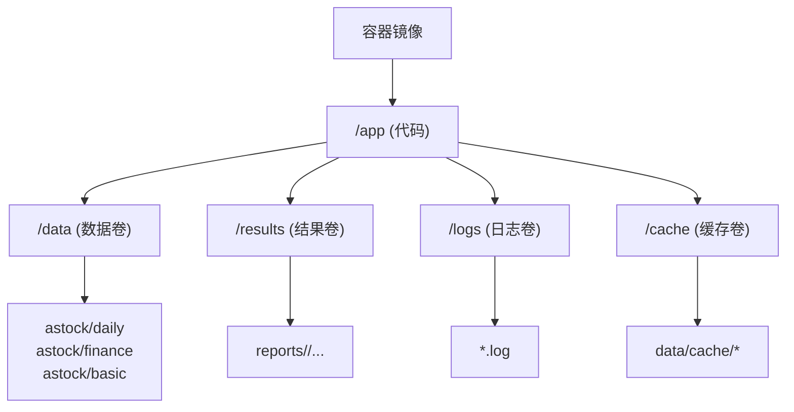
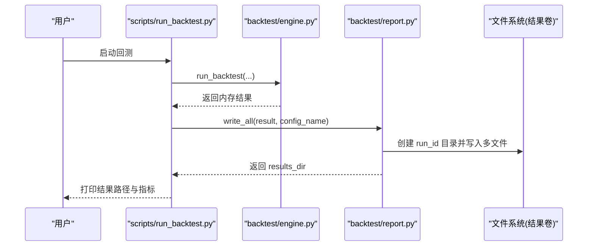
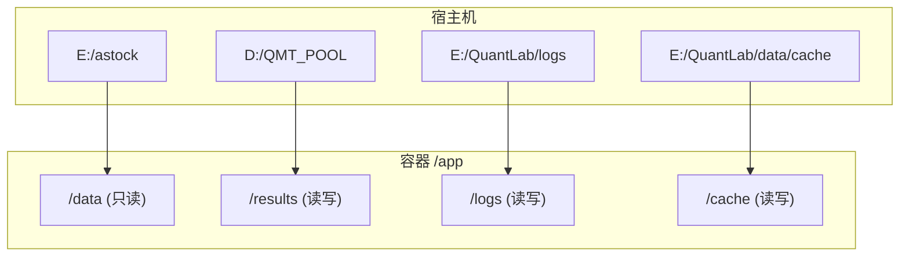
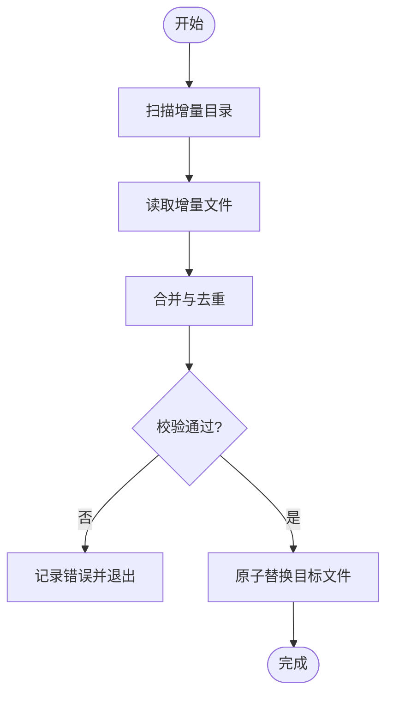
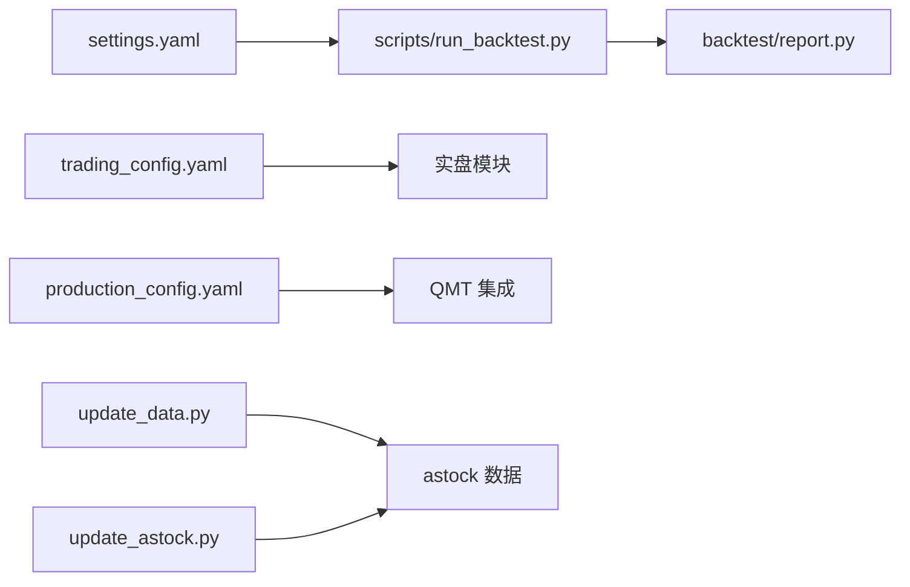

# 存储管理

<cite>
**本文引用的文件**   
- [settings.yaml](file://config/settings.yaml)
- [trading_config.yaml](file://config/trading_config.yaml)
- [production_config.yaml](file://projects/verification/results/production_config.yaml)
- [backtest/report.py](file://backtest/report.py)
- [backtest/engine.py](file://backtest/engine.py)
- [scripts/run_backtest.py](file://scripts/run_backtest.py)
- [scripts/update_data.py](file://scripts/update_data.py)
- [scripts/update_astock.py](file://scripts/update_astock.py)
- [.gitignore](file://.gitignore)
</cite>

## 目录
1. [简介](#简介)
2. [项目结构与存储范围](#项目结构与存储范围)
3. [核心组件与数据流](#核心组件与数据流)
4. [架构总览](#架构总览)
5. [详细组件分析](#详细组件分析)
6. [依赖关系分析](#依赖关系分析)
7. [性能与容量规划](#性能与容量规划)
8. [备份与恢复策略](#备份与恢复策略)
9. [监控与运维最佳实践](#监控与运维最佳实践)
10. [故障排查指南](#故障排查指南)
11. [结论](#结论)

## 简介
本文件面向容器化部署的 QuantLab，提供完整的存储管理方案。内容覆盖：
- 数据卷挂载配置（本地目录、网络存储、临时存储）
- 持久化存储（数据库/行情文件、日志、回测结果、模型与中间产物）
- 存储类定义与动态卷供应（不同后端、性能调优、容量规划）
- 备份与恢复（自动备份脚本、增量备份、灾难恢复流程）
- 存储监控与容量管理最佳实践

说明：仓库中未包含 Docker/Kubernetes 配置文件，因此本方案以“路径映射 + 配置项”的方式给出容器内外的存储映射建议，便于直接落地到任意编排平台。

## 项目结构与存储范围
QuantLab 的存储主要涉及以下目录与文件：
- 数据源与缓存
  - astock 日线/财务/基础信息 parquet 与 CSV
  - data/cache 缓存目录
- 回测输出
  - reports 下按 run_id 划分的子目录（equity_curve.csv、trades.csv、positions.csv、logs.txt、report.md、summary.json）
- 日志
  - logs 目录（由全局配置控制）
- 实盘相关
  - QMT 路径、持仓/净值/日志等文件路径
- 忽略规则
  - .gitignore 排除缓存、日志、临时文件

[本图为概念性结构图，不直接映射具体源码文件]

**章节来源**
- [settings.yaml:10-18](file://config/settings.yaml#L10-L18)
- [backtest/report.py:44-49](file://backtest/report.py#L44-L49)
- [.gitignore:11-21](file://.gitignore#L11-L21)

## 核心组件与数据流
- 配置加载
  - settings.yaml 定义数据源路径、缓存目录、日志目录等
  - trading_config.yaml 定义实盘数据路径与缓存目录
  - production_config.yaml 定义 QMT 相关文件路径（持仓、净值、日志）
- 回测执行与落盘
  - scripts/run_backtest.py 调用 backtest.engine.run_backtest 并写入报告
  - backtest.report.write_all 生成多份结果文件（CSV、JSON、Markdown、日志）
- 数据更新
  - scripts/update_data.py 增量更新 astock parquet 并重新生成 CSV
  - scripts/update_astock.py 安全合并增量数据（原子替换）

**图表来源**
- [scripts/run_backtest.py:93-121](file://scripts/run_backtest.py#L93-L121)
- [backtest/engine.py:237-270](file://backtest/engine.py#L237-L270)
- [backtest/report.py:245-263](file://backtest/report.py#L245-L263)

**章节来源**
- [settings.yaml:10-35](file://config/settings.yaml#L10-L35)
- [trading_config.yaml:42-46](file://config/trading_config.yaml#L42-L46)
- [production_config.yaml:86-100](file://projects/verification/results/production_config.yaml#L86-L100)
- [backtest/report.py:245-263](file://backtest/report.py#L245-L263)
- [scripts/run_backtest.py:93-121](file://scripts/run_backtest.py#L93-L121)

## 架构总览
从容器视角看，存储分为三类：
- 只读数据卷：挂载 astock 原始数据（parquet/csv），供读取
- 读写结果卷：挂载 reports 目录，保存每次运行的结果
- 读写日志卷：挂载 logs 目录，集中收集日志
- 可选缓存卷：挂载 data/cache，提升重复运行性能

[本图为概念性架构图，不直接映射具体源码文件]

## 详细组件分析

### 数据卷挂载配置
- 本地目录挂载
  - astock 数据：将宿主机的 astock 目录映射为容器内的只读数据卷
  - 结果目录：将宿主机的 reports 目录映射为容器内的读写结果卷
  - 日志目录：将宿主机的 logs 目录映射为容器内的读写日志卷
  - 缓存目录：将宿主机的 data/cache 映射为容器内的读写缓存卷
- 网络存储挂载
  - 推荐将 astock 数据置于 NAS/S3 兼容对象存储，通过云厂商提供的 CSI 或 s3fs/fuse 挂载为只读卷
  - 结果与日志可落盘至高性能磁盘或对象存储归档桶
- 临时存储使用
  - 容器内 /tmp 用于中间文件；生产环境建议关闭持久化或使用 ephemeral volume
  - 大数据处理时优先使用内存或分布式存储，避免 I/O 瓶颈

**章节来源**
- [settings.yaml:10-18](file://config/settings.yaml#L10-L18)
- [trading_config.yaml:42-46](file://config/trading_config.yaml#L42-L46)
- [.gitignore:11-21](file://.gitignore#L11-L21)

### 持久化存储配置
- 数据库/行情文件持久化
  - astock daily/finance/basic 文件需持久化，确保增量更新后不丢失
  - 建议使用快照与版本化管理，便于回滚
- 日志文件存储
  - 通过 settings.yaml 的 logging.dir 指定日志根目录
  - 建议按天轮转，保留 N 天，限制单文件大小
- 回测结果保存
  - backtest.report.write_all 会创建 run_id 子目录并写入多文件
  - 建议对结果目录做定期归档与校验
- 模型文件管理
  - 若引入 ML 模型，建议单独建立 models 卷，按版本命名并记录哈希

**章节来源**
- [settings.yaml:30-35](file://config/settings.yaml#L30-L35)
- [backtest/report.py:245-263](file://backtest/report.py#L245-L263)

### 存储类定义与动态卷供应
- 存储类抽象（建议）
  - 定义统一的 StorageBackend 接口：read/write/metadata/cleanup
  - 实现 LocalStorage、NasStorage、ObjectStorage 等后端
- 动态卷供应（Kubernetes 示例思路）
  - 根据任务类型（回测/训练/在线）动态申请不同 IOPS/吞吐的 PVC
  - 结合 StorageClass 选择 SSD/HDD/对象存储
- 不同后端配置
  - 本地：路径直写，低延迟
  - 网络：考虑并发与限流，启用压缩与分块上传
  - 对象存储：适合归档与跨地域复制

[本节为通用设计建议，不直接映射具体源码文件]

### 性能调优与容量规划
- 性能调优
  - 数据读取：优先使用列式格式（parquet），开启并行读取
  - 缓存：启用 data/cache，设置合理过期时间
  - 日志：异步写入，限制大小与数量
- 容量规划
  - astock 数据：按交易日增长估算，预留 2x 冗余
  - 结果目录：按运行次数与周期估算，定期清理历史
  - 日志：按天轮转，保留 7-30 天
  - 缓存：监控命中率与占用，及时清理

**章节来源**
- [settings.yaml:16-19](file://config/settings.yaml#L16-L19)
- [backtest/report.py:245-263](file://backtest/report.py#L245-L263)

### 数据更新与一致性
- 增量更新流程
  - scripts/update_data.py 扫描增量目录，去重合并，原子写入
  - scripts/update_astock.py 先写临时文件，验证成功后原子替换
- 一致性保障
  - 使用事务或原子替换避免半写状态
  - 更新前后进行校验（行数、日期范围、字段完整性）

**图表来源**
- [scripts/update_data.py:37-82](file://scripts/update_data.py#L37-L82)
- [scripts/update_astock.py:1-39](file://scripts/update_astock.py#L1-L39)

**章节来源**
- [scripts/update_data.py:37-82](file://scripts/update_data.py#L37-L82)
- [scripts/update_astock.py:1-39](file://scripts/update_astock.py#L1-L39)

## 依赖关系分析
- 配置依赖
  - settings.yaml 被 main.py 与回测脚本读取
  - trading_config.yaml 被实盘模块读取
  - production_config.yaml 被 QMT 集成模块读取
- 运行时依赖
  - backtest/report.py 依赖文件系统权限与路径存在性
  - update_data.py/update_astock.py 依赖 astock 数据目录结构与权限

**图表来源**
- [main.py:21-25](file://main.py#L21-L25)
- [scripts/run_backtest.py:93-121](file://scripts/run_backtest.py#L93-L121)
- [backtest/report.py:245-263](file://backtest/report.py#L245-L263)
- [scripts/update_data.py:37-82](file://scripts/update_data.py#L37-L82)
- [scripts/update_astock.py:1-39](file://scripts/update_astock.py#L1-L39)

**章节来源**
- [main.py:21-25](file://main.py#L21-L25)
- [scripts/run_backtest.py:93-121](file://scripts/run_backtest.py#L93-L121)
- [backtest/report.py:245-263](file://backtest/report.py#L245-L263)
- [scripts/update_data.py:37-82](file://scripts/update_data.py#L37-L82)
- [scripts/update_astock.py:1-39](file://scripts/update_astock.py#L1-L39)

## 性能与容量规划
- I/O 优化
  - 使用 SSD 或高性能云盘承载 astock 与结果目录
  - 日志与缓存可落 HDD 或冷存储
- 并发与限流
  - 数据更新脚本支持串行合并，避免锁竞争
  - 回测任务可并行但需隔离结果目录
- 容量阈值
  - 设置告警阈值（如 >80% 容量）触发扩容或清理
  - 定期归档旧结果与日志

[本节为通用指导，不直接映射具体源码文件]

## 备份与恢复策略
- 自动备份
  - 每日全量备份 astock 数据与结果目录
  - 每周归档日志与历史结果
- 增量备份
  - 基于 update_astock.py 的原子替换机制，仅备份变更文件
  - 使用对象存储的版本控制特性实现增量快照
- 灾难恢复
  - 恢复顺序：先恢复 astock 数据，再恢复结果与日志
  - 校验：比对哈希与行数，确保一致性
- 脚本建议
  - 编写定时任务（cron/systemd）执行备份脚本
  - 失败重试与告警通知

[本节为通用指导，不直接映射具体源码文件]

## 监控与运维最佳实践
- 监控指标
  - 存储容量使用率、I/O 延迟、错误率
  - 数据更新成功率与耗时
  - 回测任务成功数与失败数
- 告警策略
  - 容量 >80% 告警
  - 数据更新失败立即告警
  - 回测失败率超过阈值告警
- 运维操作
  - 定期清理缓存与临时文件
  - 归档旧结果与日志
  - 检查权限与路径正确性

[本节为通用指导，不直接映射具体源码文件]

## 故障排查指南
- 常见问题
  - 路径不存在：检查容器卷映射与权限
  - 写入失败：检查磁盘空间与权限
  - 数据不一致：检查更新脚本是否原子替换
- 定位步骤
  - 查看日志目录与 logs.txt
  - 检查 astock 数据最新日期与行数
  - 验证结果目录结构与文件完整性

**章节来源**
- [backtest/report.py:111-121](file://backtest/report.py#L111-L121)
- [scripts/update_data.py:37-82](file://scripts/update_data.py#L37-L82)
- [scripts/update_astock.py:1-39](file://scripts/update_astock.py#L1-L39)

## 结论
通过合理的存储卷设计与配置，QuantLab 可在容器环境中稳定运行。建议采用只读数据卷、读写结果卷与日志卷分离的策略，结合增量更新与原子替换保证数据一致性。配合自动化备份、监控告警与容量规划，可实现高可用与易维护的量化研究平台。