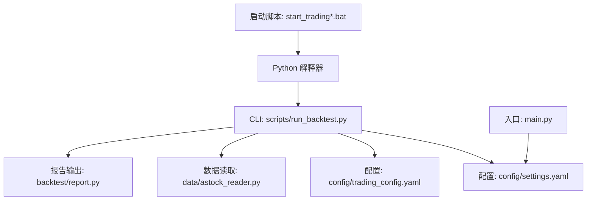
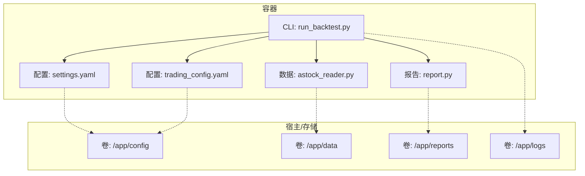
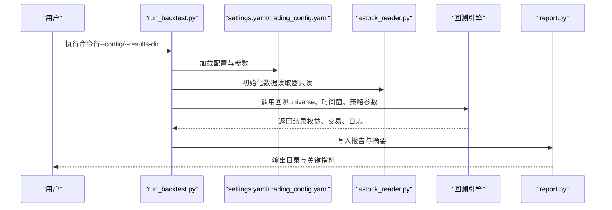
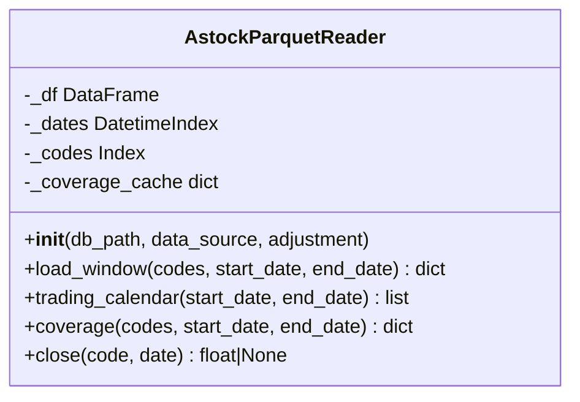
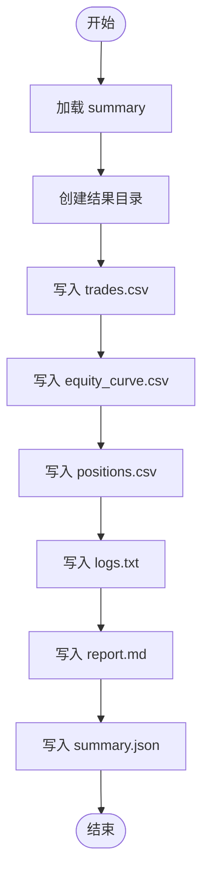
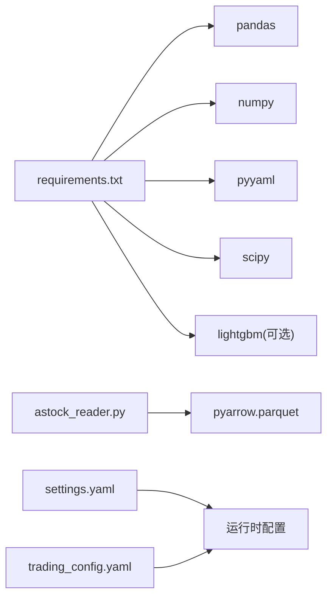

# 容器化部署

<cite>
**本文引用的文件**   
- [requirements.txt](file://requirements.txt)
- [setup.py](file://setup.py)
- [main.py](file://main.py)
- [config/settings.yaml](file://config\settings.yaml)
- [config/trading_config.yaml](file://config\trading_config.yaml)
- [scripts/run_backtest.py](file://scripts\run_backtest.py)
- [data/astock_reader.py](file://data\astock_reader.py)
- [backtest/report.py](file://backtest/report.py)
- [start_trading.bat](file://start_trading.bat)
- [start_trading_qmt.bat](file://start_trading_qmt.bat)
</cite>

## 目录
1. [简介](#简介)
2. [项目结构](#项目结构)
3. [核心组件](#核心组件)
4. [架构总览](#架构总览)
5. [详细组件分析](#详细组件分析)
6. [依赖分析](#依赖分析)
7. [性能考虑](#性能考虑)
8. [故障排查指南](#故障排查指南)
9. [结论](#结论)
10. [附录](#附录)

## 简介
本指南面向 QuantLab 的容器化与编排部署，覆盖以下主题：
- Docker 镜像构建：多阶段构建、缓存优化、安全基础镜像选择、镜像签名验证
- 容器编排：Docker Compose、Kubernetes 清单、服务发现、负载均衡
- 容器网络：容器间通信、外部服务访问、网络策略、DNS 解析
- 存储管理：数据卷挂载、持久化存储、存储类定义、备份策略
- 容器监控：资源监控、日志收集、性能分析、故障诊断

本仓库为 Python 量化回测与实盘框架，核心入口与配置集中在根目录与 config 子目录，数据读取通过 parquet 文件实现。容器化方案将围绕这些入口与配置进行设计。

## 项目结构
QuantLab 的关键路径与职责如下：
- 运行入口与 CLI
  - main.py：回测主入口（支持策略参数）
  - scripts/run_backtest.py：回测引擎 CLI，统一加载配置、数据源、执行回测并输出报告
- 配置中心
  - config/settings.yaml：全局配置（项目信息、数据源、回测参数、因子处理、策略默认股票池、日志）
  - config/trading_config.yaml：实盘配置（账号、交易参数、风控阈值、委托管理、调度计划、通知）
- 数据层
  - data/astock_reader.py：只读 Parquet 数据读取器，提供 OHLCV 窗口、交易日历、覆盖率、收盘价查询等接口
- 报告与结果
  - backtest/report.py：生成交易明细、权益曲线、持仓、日志摘要、Markdown 报告、JSON 摘要
- 启动脚本
  - start_trading.bat / start_trading_qmt.bat：Windows 批处理，检查环境、创建目录、校验配置、启动进程

**图表来源** 
- [scripts/run_backtest.py:1-132](file://scripts\run_backtest.py#L1-L132)
- [config/settings.yaml:1-69](file://config\settings.yaml#L1-L69)
- [config/trading_config.yaml:37-61](file://config\trading_config.yaml#L37-L61)
- [data/astock_reader.py:1-192](file://data\astock_reader.py#L1-L192)
- [backtest/report.py:111-263](file://backtest/report.py#L111-L263)
- [main.py:1-104](file://main.py#L1-L104)
- [start_trading.bat:1-51](file://start_trading.bat#L1-L51)
- [start_trading_qmt.bat:1-66](file://start_trading_qmt.bat#L1-L66)

**章节来源**
- [scripts/run_backtest.py:1-132](file://scripts\run_backtest.py#L1-L132)
- [config/settings.yaml:1-69](file://config\settings.yaml#L1-L69)
- [config/trading_config.yaml:37-61](file://config\trading_config.yaml#L37-L61)
- [data/astock_reader.py:1-192](file://data\astock_reader.py#L1-L192)
- [backtest/report.py:111-263](file://backtest/report.py#L111-L263)
- [main.py:1-104](file://main.py#L1-L104)
- [start_trading.bat:1-51](file://start_trading.bat#L1-L51)
- [start_trading_qmt.bat:1-66](file://start_trading_qmt.bat#L1-L66)

## 核心组件
- 回测 CLI（scripts/run_backtest.py）
  - 功能：解析 YAML 配置、加载股票池、初始化数据读取器、调用回测引擎、写入报告
  - 关键行为：计算配置哈希与股票池哈希；支持 results-dir 覆盖输出目录；关闭 reader 资源
- 数据读取器（data/astock_reader.py）
  - 功能：只读 Parquet 读取，按日期与代码范围返回 OHLCV 窗口；提供交易日历与覆盖率统计；支持复权（raw/qfq/hfq）
  - 约束：仅读取必要列以降低内存占用；对缺失数据与范围无效抛出异常
- 报告模块（backtest/report.py）
  - 功能：生成 trades.csv、equity_curve.csv、positions.csv、logs.txt、report.md、summary.json
  - 特点：包含关键日志摘录、数据元信息、复现命令
- 全局配置（config/settings.yaml）
  - 内容：项目信息、数据源路径、缓存开关、回测时间窗与资金、因子预处理、策略默认股票池、日志级别与目录
- 实盘配置（config/trading_config.yaml）
  - 内容：账号、交易参数、风控阈值、委托超时与重试、调度计划、通知方式与 webhook

**章节来源**
- [scripts/run_backtest.py:1-132](file://scripts\run_backtest.py#L1-L132)
- [data/astock_reader.py:1-192](file://data\astock_reader.py#L1-L192)
- [backtest/report.py:111-263](file://backtest/report.py#L111-L263)
- [config/settings.yaml:1-69](file://config\settings.yaml#L1-L69)
- [config/trading_config.yaml:37-61](file://config\trading_config.yaml#L37-L61)

## 架构总览
下图展示容器化后的系统交互：CLI 作为容器入口，读取配置与数据，执行回测并输出报告；日志与结果通过卷挂载到宿主机；可选地接入外部监控系统。

**图表来源** 
- [scripts/run_backtest.py:1-132](file://scripts\run_backtest.py#L1-L132)
- [config/settings.yaml:1-69](file://config\settings.yaml#L1-L69)
- [config/trading_config.yaml:37-61](file://config\trading_config.yaml#L37-L61)
- [data/astock_reader.py:1-192](file://data\astock_reader.py#L1-L192)
- [backtest/report.py:111-263](file://backtest/report.py#L111-L263)

## 详细组件分析

### 镜像构建与优化（多阶段、缓存、安全、签名）
- 多阶段构建建议
  - 构建阶段：安装依赖（pandas、numpy、pyyaml、scipy、lightgbm 等），编译或准备二进制扩展（如有）
  - 运行阶段：仅拷贝运行时所需文件与依赖，减小镜像体积
- 缓存利用
  - 先复制 requirements.txt 并安装依赖，再复制源码，以最大化 pip 缓存命中
  - 使用 .dockerignore 排除 logs、reports、data 等目录
- 安全基础镜像
  - 优先选择精简且受支持的发行版（如 python:3.x-slim 或 distroless/python），定期更新 CVE
  - 非 root 用户运行容器，最小权限原则
- 镜像签名验证
  - 在 CI 中集成 cosign/sigstore 对镜像进行签名与校验
  - 在集群侧启用镜像准入策略，仅允许已签名镜像运行

[本节为通用指导，不直接分析具体文件]

### 容器编排（Compose/K8s）
- Docker Compose
  - 服务定义：quantlab-backtest（回测）、quantlab-live（实盘，如需）
  - 卷映射：/app/config、/app/data、/app/reports、/app/logs
  - 环境变量：PYTHONPATH、LOG_LEVEL、DATA_PATH、RESULTS_DIR
- Kubernetes 清单
  - Deployment：副本数、资源限制（CPU/Mem）、健康检查（liveness/readiness）
  - Service：ClusterIP/NodePort/LoadBalancer 暴露端口（如需 Web 或 API）
  - ConfigMap/Secret：注入 settings.yaml、trading_config.yaml、敏感信息
  - PersistentVolumeClaim：绑定数据卷（parquet 数据、报告、日志）
  - NetworkPolicy：限制入出站流量，仅允许必要通信
  - HorizontalPodAutoscaler：基于 CPU/自定义指标扩缩容

[本节为通用指导，不直接分析具体文件]

### 容器网络配置
- 容器间通信
  - 同命名空间内通过 Service DNS 访问（如 http://quantlab-service:8080）
  - 跨命名空间需开启 RBAC 与 NetworkPolicy 白名单
- 外部服务访问
  - 通过 Ingress/Service 暴露；或使用 HostNetwork（谨慎）
  - 代理设置：HTTP_PROXY/HTTPS_PROXY 用于外部数据源
- 网络策略
  - 仅开放必要端口（如 8080/443）；禁止默认全通
- DNS 解析
  - 自定义 CoreDNS 配置；确保内部域名可解析

[本节为通用指导，不直接分析具体文件]

### 存储管理（卷、持久化、存储类、备份）
- 数据卷挂载
  - /app/config：挂载配置文件（settings.yaml、trading_config.yaml）
  - /app/data：挂载 astock parquet 数据（只读）
  - /app/reports：挂载回测结果（CSV/MD/JSON）
  - /app/logs：挂载日志文件
- 持久化存储
  - PVC 绑定本地磁盘或云盘；根据 I/O 需求选择存储类（SSD/HDD）
- 备份策略
  - 定时快照（PV Snapshot）或对象存储归档（S3/OSS）
  - 保留策略：按天/周/月保留，自动清理过期数据

[本节为通用指导，不直接分析具体文件]

### 容器监控（资源、日志、性能、诊断）
- 资源监控
  - Prometheus + Grafana：采集 CPU、内存、I/O、网络
  - K8s Metrics Server：查看 Pod/节点资源使用
- 日志收集
  - 容器 stdout/stderr 聚合至 ELK/Loki
  - 应用日志落盘至 /app/logs，便于离线分析
- 性能分析
  - cProfile/py-spy 采样分析热点
  - Pandas/Parquet 读取性能调优（列裁剪、分区、缓存）
- 故障诊断
  - liveness/readiness 探针失败时自动重启或隔离
  - 事件与审计日志关联，快速定位问题

[本节为通用指导，不直接分析具体文件]

### 回测流程时序（CLI 到报告）

**图表来源** 
- [scripts/run_backtest.py:1-132](file://scripts\run_backtest.py#L1-L132)
- [config/settings.yaml:1-69](file://config\settings.yaml#L1-L69)
- [config/trading_config.yaml:37-61](file://config\trading_config.yaml#L37-L61)
- [data/astock_reader.py:1-192](file://data\astock_reader.py#L1-L192)
- [backtest/report.py:111-263](file://backtest/report.py#L111-L263)

### 数据读取器类图（astock_reader）

**图表来源** 
- [data/astock_reader.py:1-192](file://data\astock_reader.py#L1-L192)

### 报告写入流程图（report.py）

**图表来源** 
- [backtest/report.py:111-263](file://backtest/report.py#L111-L263)

## 依赖分析
- 运行时依赖
  - pandas、numpy、pyyaml、scipy、lightgbm（可选）
  - pyarrow（Parquet 读取）
- 配置依赖
  - settings.yaml：数据源路径、回测参数、因子处理、日志
  - trading_config.yaml：账号、交易参数、风控、调度、通知
- 数据依赖
  - astock parquet：只读，列裁剪降低内存占用
- 输出依赖
  - reports 目录：CSV/MD/JSON 报告与日志

**图表来源** 
- [requirements.txt:1-29](file://requirements.txt#L1-L29)
- [data/astock_reader.py:1-192](file://data\astock_reader.py#L1-L192)
- [config/settings.yaml:1-69](file://config\settings.yaml#L1-L69)
- [config/trading_config.yaml:37-61](file://config\trading_config.yaml#L37-L61)

**章节来源**
- [requirements.txt:1-29](file://requirements.txt#L1-L29)
- [data/astock_reader.py:1-192](file://data\astock_reader.py#L1-L192)
- [config/settings.yaml:1-69](file://config\settings.yaml#L1-L69)
- [config/trading_config.yaml:37-61](file://config\trading_config.yaml#L37-L61)

## 性能考虑
- 数据读取
  - 使用列裁剪与 MultiIndex 过滤，减少内存与 I/O
  - 合理设置调整因子（raw/qfq/hfq），避免不必要的计算
- 回测执行
  - 控制 universe 规模与时间窗，避免过大内存占用
  - 并行化因子计算（如适用），注意线程安全
- 报告输出
  - 批量写入 CSV/JSON，减少频繁 IO
  - 压缩日志与结果（按需）
- 容器资源
  - 设置合理的 CPU/Memory 限制与请求
  - 使用本地 SSD 提升 Parquet 读取速度

[本节为通用指导，不直接分析具体文件]

## 故障排查指南
- 常见错误
  - 数据路径不存在或不可读：检查 astock parquet 路径与权限
  - 配置缺失或格式错误：校验 settings.yaml/trading_config.yaml
  - 回测结果为空：确认时间窗与股票池匹配
- 日志定位
  - 查看 logs.txt 与 report.md 中的关键日志摘录
  - 检查 summary.json 的数据元信息与覆盖率
- 启动脚本问题
  - Windows 批处理检查 Python 与 QMT 进程状态
  - 确认配置文件存在与路径正确

**章节来源**
- [backtest/report.py:111-263](file://backtest/report.py#L111-L263)
- [start_trading.bat:1-51](file://start_trading.bat#L1-L51)
- [start_trading_qmt.bat:1-66](file://start_trading_qmt.bat#L1-L66)

## 结论
本指南提供了 QuantLab 容器化与编排的完整蓝图：从镜像构建优化、编排配置、网络与存储设计，到监控与故障排查。结合仓库中的 CLI、配置与数据读取器，可在生产环境中稳定运行回测与实盘任务。建议在 CI/CD 中集成镜像签名与安全扫描，确保交付质量与合规性。

[本节为总结性内容，不直接分析具体文件]

## 附录
- 一键配置脚本（setup.py）
  - 作用：查找 xtquant 源路径、复制到系统 Python、验证导入、创建必要目录
  - 注意：该脚本偏向本机环境配置，容器化场景下应通过镜像与卷替代
- 入口与启动
  - main.py：回测入口，支持策略参数
  - start_trading*.bat：Windows 启动脚本，检查环境与配置后启动进程

**章节来源**
- [setup.py:1-82](file://setup.py#L1-L82)
- [main.py:1-104](file://main.py#L1-L104)
- [start_trading.bat:1-51](file://start_trading.bat#L1-L51)
- [start_trading_qmt.bat:1-66](file://start_trading_qmt.bat#L1-L66)