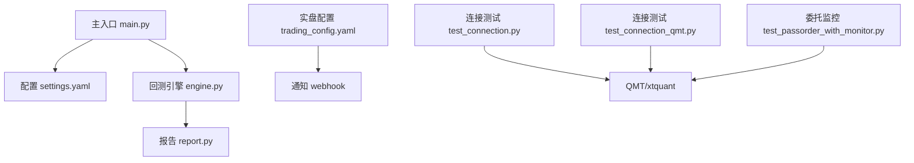
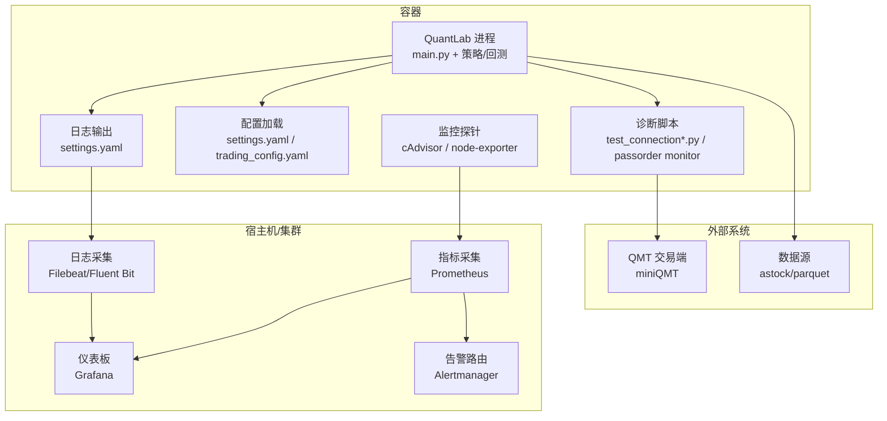
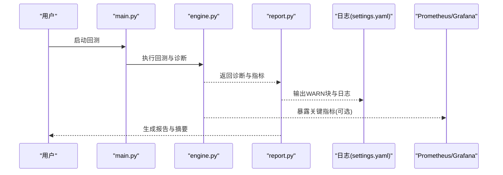
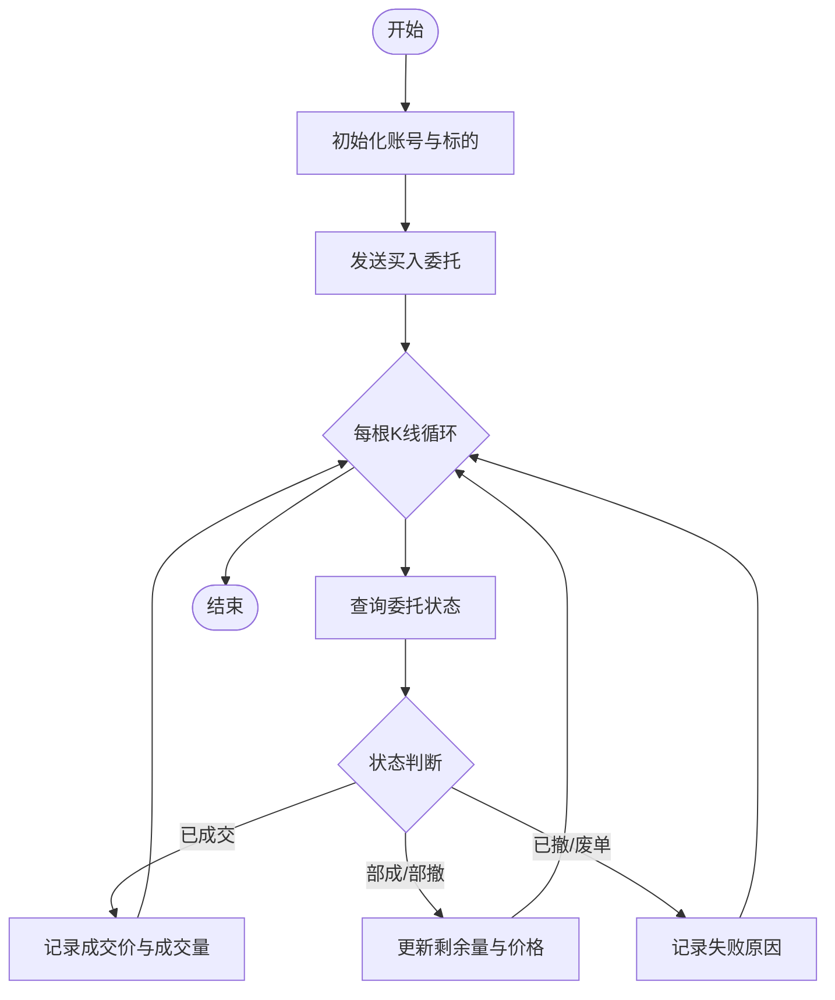
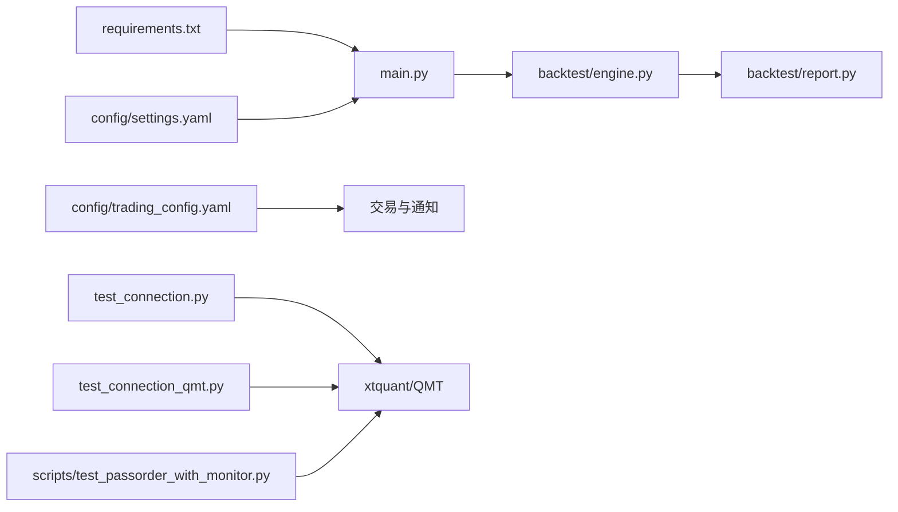

# 容器监控

<cite>
**本文引用的文件**   
- [main.py](file://main.py)
- [requirements.txt](file://requirements.txt)
- [config/settings.yaml](file://config/settings.yaml)
- [config/trading_config.yaml](file://config/trading_config.yaml)
- [projects/verification/results/monitoring_indicators.md](file://projects/verification/results/monitoring_indicators.md)
- [backtest/engine.py](file://backtest/engine.py)
- [backtest/report.py](file://backtest/report.py)
- [scripts/test_passorder_with_monitor.py](file://scripts/test_passorder_with_monitor.py)
- [test_connection.py](file://test_connection.py)
- [test_connection_qmt.py](file://test_connection_qmt.py)
</cite>

## 目录
1. [简介](#简介)
2. [项目结构](#项目结构)
3. [核心组件](#核心组件)
4. [架构总览](#架构总览)
5. [详细组件分析](#详细组件分析)
6. [依赖关系分析](#依赖关系分析)
7. [性能考虑](#性能考虑)
8. [故障诊断指南](#故障诊断指南)
9. [结论](#结论)
10. [附录](#附录)

## 简介
本指南面向在容器中部署与运行 QuantLab 的运维与研发人员，提供端到端的容器监控配置与实践建议。内容覆盖：
- 容器资源监控（CPU、内存、磁盘、网络）与告警阈值设计
- 日志采集与管理（输出格式、聚合、轮转、分析工具集成）
- 性能分析方法（应用性能监控、慢查询定位、瓶颈识别与优化建议）
- 故障诊断工具（容器状态检查、网络连接测试、依赖服务健康检查）
- 监控仪表板与告警规则配置（结合现有指标定义与回测/实盘流程）

本指南以仓库中已有的配置与脚本为基础，给出可落地的容器化监控方案，并尽量将现有代码能力映射到容器运行时监控体系。

## 项目结构
QuantLab 当前为 Python 量化框架，包含回测引擎、策略模块、数据读取、报告生成以及若干连接与测试脚本。与容器监控相关的关键点包括：
- 全局配置与日志路径：settings.yaml 定义了日志级别、目录与轮转参数
- 实盘与通知：trading_config.yaml 定义了交易、风控、调度与通知（webhook）等
- 回测与报告：engine.py 与 report.py 负责诊断信息、警告块与指标计算
- 连接与监控脚本：test_connection*.py 用于 QMT 连接与健康检查；test_passorder_with_monitor.py 用于委托状态监控

图表来源
- [main.py:1-104](file://main.py#L1-L104)
- [config/settings.yaml:1-69](file://config/settings.yaml#L1-L69)
- [config/trading_config.yaml:1-62](file://config/trading_config.yaml#L1-L62)
- [backtest/engine.py:479-522](file://backtest/engine.py#L479-L522)
- [backtest/report.py:78-108](file://backtest/report.py#L78-L108)
- [scripts/test_passorder_with_monitor.py:1-75](file://scripts/test_passorder_with_monitor.py#L1-L75)
- [test_connection.py:1-117](file://test_connection.py#L1-L117)
- [test_connection_qmt.py:1-117](file://test_connection_qmt.py#L1-L117)

章节来源
- [main.py:1-104](file://main.py#L1-L104)
- [config/settings.yaml:1-69](file://config/settings.yaml#L1-L69)
- [config/trading_config.yaml:1-62](file://config/trading_config.yaml#L1-L62)

## 核心组件
- 配置中心
  - settings.yaml：定义日志级别、日志目录、文件大小与备份数量，便于容器内日志轮转与集中收集
  - trading_config.yaml：定义交易参数、风控阈值、调度时间、通知方式（wechat/dingtalk/email）及 webhook URL
- 回测与诊断
  - engine.py：汇总每日警告、候选股票通过率、未成交订单计数、策略特定指标，并计算性能指标
  - report.py：组装固定顺序的 WARN 块，涵盖样本期、基准可用性、去重、行业热度模式、WAL 检测等
- 连接与监控
  - test_connection.py / test_connection_qmt.py：检查 xtquant 库、QMT 路径、会话与账户资产/持仓
  - scripts/test_passorder_with_monitor.py：下单后逐 K 线查询委托状态，打印成交/撤单/废单结果

章节来源
- [config/settings.yaml:1-69](file://config/settings.yaml#L1-L69)
- [config/trading_config.yaml:1-62](file://config/trading_config.yaml#L1-L62)
- [backtest/engine.py:479-522](file://backtest/engine.py#L479-L522)
- [backtest/report.py:78-108](file://backtest/report.py#L78-L108)
- [scripts/test_passorder_with_monitor.py:1-75](file://scripts/test_passorder_with_monitor.py#L1-L75)
- [test_connection.py:1-117](file://test_connection.py#L1-L117)
- [test_connection_qmt.py:1-117](file://test_connection_qmt.py#L1-L117)

## 架构总览
下图展示容器化部署下，QuantLab 与外部系统（QMT、数据源、日志/监控平台）的交互关系，以及监控与告警的数据流。

图表来源
- [main.py:1-104](file://main.py#L1-L104)
- [config/settings.yaml:1-69](file://config/settings.yaml#L1-L69)
- [config/trading_config.yaml:1-62](file://config/trading_config.yaml#L1-L62)
- [test_connection.py:1-117](file://test_connection.py#L1-L117)
- [test_connection_qmt.py:1-117](file://test_connection_qmt.py#L1-L117)
- [scripts/test_passorder_with_monitor.py:1-75](file://scripts/test_passorder_with_monitor.py#L1-L75)

## 详细组件分析

### 容器资源监控与告警
- 监控对象
  - CPU：容器进程 CPU 使用率、内核态/用户态占比
  - 内存：RSS、页缓存、OOM 事件
  - 磁盘：IOPS、吞吐、inode 使用、日志目录大小
  - 网络：入/出带宽、连接数、错误包
- 采集与可视化
  - 使用 cAdvisor 采集容器指标，Prometheus 存储，Grafana 展示
  - 关键面板：CPU 使用率、内存占用、磁盘 I/O、网络流量、Pod/容器重启次数
- 告警规则建议（示例）
  - CPU 持续 > 80% 超过 5 分钟
  - 内存 RSS > 容器限制 90% 或 OOM Kill 发生
  - 磁盘使用率 > 85%，或日志目录增长速率异常
  - 网络丢包率 > 1% 或连接数突增
  - 容器重启次数 > 3 次/小时

说明：以上为通用实践建议，具体阈值需结合实例规格与业务负载调整。

### 日志收集与管理
- 日志输出位置与轮转
  - settings.yaml 已定义日志级别、目录、最大文件大小与备份数量，适合配合 Filebeat/Fluent Bit 进行采集与转发
- 日志格式建议
  - 统一 JSON 格式，包含字段：timestamp、level、service、container_id、trace_id、message
  - 对敏感信息脱敏（账号、密钥、交易流水号）
- 聚合与存储
  - 通过 Filebeat/Fluent Bit 将日志发送至 Elasticsearch/ClickHouse 或云厂商日志服务
  - 按日期与容器名分索引，保留周期由合规要求决定
- 分析与检索
  - 使用 Kibana/ES 控制台进行关键词检索、错误统计、耗时分布
  - 结合 trace_id 串联跨进程调用链

章节来源
- [config/settings.yaml:1-69](file://config/settings.yaml#L1-L69)

### 性能分析方法
- 应用性能监控（APM）
  - 接入 OpenTelemetry 或语言级埋点，记录关键函数耗时、数据库/网络请求延迟
- 慢查询分析
  - 针对数据读取（astock parquet）与因子计算，记录慢查询 SQL/IO 路径，分析热点键与扫描范围
- 瓶颈识别与优化建议
  - CPU 热点：因子计算、排序与聚合，考虑向量化与并行
  - 内存压力：大表 join、缓存膨胀，评估分页与增量更新
  - 磁盘 I/O：频繁小文件读写，合并写入与压缩
  - 网络：QMT 连接建立与订阅消息积压，增加重试与退避

章节来源
- [backtest/engine.py:479-522](file://backtest/engine.py#L479-L522)
- [backtest/report.py:78-108](file://backtest/report.py#L78-L108)

### 故障诊断工具
- 容器状态检查
  - 查看容器运行状态、资源配额、重启原因（OOM/Killed）
  - 检查环境变量与挂载卷是否正确
- 网络连接测试
  - 使用 test_connection.py / test_connection_qmt.py 验证 xtquant 库、QMT 路径、会话与账户资产/持仓
- 依赖服务健康检查
  - astock 数据路径与 parquet 可读性
  - QMT 客户端是否启动、账号是否登录、session_id 是否正确
- 委托状态监控
  - scripts/test_passorder_with_monitor.py 每根 K 线查询委托状态，输出成交/撤单/废单详情

章节来源
- [test_connection.py:1-117](file://test_connection.py#L1-L117)
- [test_connection_qmt.py:1-117](file://test_connection_qmt.py#L1-L117)
- [scripts/test_passorder_with_monitor.py:1-75](file://scripts/test_passorder_with_monitor.py#L1-L75)

### 监控仪表板与告警规则设置
- 指标来源
  - 系统指标：CPU、内存、磁盘、网络（cAdvisor/Prometheus）
  - 业务指标：净值、回撤、换手率、信号质量（来自 monitoring_indicators.md）
  - 回测与诊断：engine.py 的诊断聚合与 report.py 的 WARN 块
- 仪表板建议
  - 系统层：容器资源使用趋势、错误日志量、重启次数
  - 业务层：净值曲线、回撤、换手率、信号质量评分
  - 交易层：委托成功率、平均成交延迟、失败原因分布
- 告警规则建议
  - 系统层：CPU/内存/磁盘/网络阈值
  - 业务层：单日跌幅 > 3%、回撤 > 10%/15%/20%、周换手 > 30%、ROE < 3%、负债率 > 70%
  - 交易层：委托超时、失败率突增、QMT 连接断开

章节来源
- [projects/verification/results/monitoring_indicators.md:1-69](file://projects/verification/results/monitoring_indicators.md#L1-L69)
- [backtest/engine.py:479-522](file://backtest/engine.py#L479-L522)
- [backtest/report.py:78-108](file://backtest/report.py#L78-L108)

### 序列图：回测与诊断流程

图表来源
- [main.py:1-104](file://main.py#L1-L104)
- [backtest/engine.py:479-522](file://backtest/engine.py#L479-L522)
- [backtest/report.py:78-108](file://backtest/report.py#L78-L108)
- [config/settings.yaml:1-69](file://config/settings.yaml#L1-L69)

### 流程图：委托状态监控

图表来源
- [scripts/test_passorder_with_monitor.py:1-75](file://scripts/test_passorder_with_monitor.py#L1-L75)

## 依赖关系分析
- 外部依赖
  - pandas/numpy/pyyaml/scipy/lightgbm 等（requirements.txt）
  - xtquant（QMT 交易接口，需在 QMT 环境或复制至 Python 环境）
- 内部模块
  - main.py 作为入口，加载 settings.yaml 并驱动回测
  - engine.py 与 report.py 负责诊断与报告
  - trading_config.yaml 驱动交易与通知
  - 连接与监控脚本依赖 xtquant 与 QMT 客户端

图表来源
- [requirements.txt:1-29](file://requirements.txt#L1-L29)
- [main.py:1-104](file://main.py#L1-L104)
- [backtest/engine.py:479-522](file://backtest/engine.py#L479-L522)
- [backtest/report.py:78-108](file://backtest/report.py#L78-L108)
- [config/settings.yaml:1-69](file://config/settings.yaml#L1-L69)
- [config/trading_config.yaml:1-62](file://config/trading_config.yaml#L1-L62)
- [test_connection.py:1-117](file://test_connection.py#L1-L117)
- [test_connection_qmt.py:1-117](file://test_connection_qmt.py#L1-L117)
- [scripts/test_passorder_with_monitor.py:1-75](file://scripts/test_passorder_with_monitor.py#L1-L75)

章节来源
- [requirements.txt:1-29](file://requirements.txt#L1-L29)
- [main.py:1-104](file://main.py#L1-L104)
- [backtest/engine.py:479-522](file://backtest/engine.py#L479-L522)
- [backtest/report.py:78-108](file://backtest/report.py#L78-L108)
- [config/settings.yaml:1-69](file://config/settings.yaml#L1-L69)
- [config/trading_config.yaml:1-62](file://config/trading_config.yaml#L1-L62)
- [test_connection.py:1-117](file://test_connection.py#L1-L117)
- [test_connection_qmt.py:1-117](file://test_connection_qmt.py#L1-L117)
- [scripts/test_passorder_with_monitor.py:1-75](file://scripts/test_passorder_with_monitor.py#L1-L75)

## 性能考虑
- 容器资源规划
  - 根据因子计算与数据规模设定 CPU/内存上限，预留峰值余量
  - 使用本地 SSD 存放 parquet 数据，减少 I/O 等待
- 日志与存储
  - 合理设置日志轮转大小与备份数量，避免磁盘打满
  - 将日志异步写入，降低主线程阻塞
- 网络与连接
  - QMT 连接复用与心跳保活，避免频繁重连
  - 监控连接池与队列长度，防止积压导致延迟上升

[本节为通用指导，不直接分析具体文件]

## 故障诊断指南
- 常见问题定位
  - 连接失败：检查 xtquant 库安装、QMT 路径、session_id、账号登录状态
  - 委托异常：查看委托状态、失败原因、是否触发撤单/重试逻辑
  - 数据不可用：校验 astock 路径与 parquet 文件完整性
- 诊断步骤
  - 运行 test_connection.py / test_connection_qmt.py 验证环境与连接
  - 使用 scripts/test_passorder_with_monitor.py 观察委托生命周期
  - 查看日志中的 WARN 块与错误堆栈，定位问题阶段
- 恢复措施
  - 重启 QMT 客户端或修正配置文件
  - 清理临时文件与缓存，释放磁盘空间
  - 调整告警阈值与重试策略，避免误报

章节来源
- [test_connection.py:1-117](file://test_connection.py#L1-L117)
- [test_connection_qmt.py:1-117](file://test_connection_qmt.py#L1-L117)
- [scripts/test_passorder_with_monitor.py:1-75](file://scripts/test_passorder_with_monitor.py#L1-L75)
- [backtest/report.py:78-108](file://backtest/report.py#L78-L108)

## 结论
通过本指南，可在容器环境中为 QuantLab 构建完整的监控与诊断体系：
- 利用 cAdvisor/Prometheus/Grafana 实现系统资源监控与可视化
- 基于 settings.yaml 与日志采集器实现统一的日志管理
- 借助 monitoring_indicators.md 与回测/报告模块定义业务告警
- 使用连接与委托监控脚本快速定位交易链路问题
建议在上线前完成阈值校准与演练，确保告警准确、恢复及时。

[本节为总结性内容，不直接分析具体文件]

## 附录
- 监控指标参考
  - 净值、回撤、换手率、信号质量、业绩归因、容量检查、策略有效性、风控回顾（详见 monitoring_indicators.md）
- 配置要点
  - settings.yaml：日志级别、目录、轮转
  - trading_config.yaml：交易参数、风控、调度、通知 webhook
- 常用命令
  - 连接测试：python test_connection.py / python test_connection_qmt.py
  - 委托监控：在 miniQMT 策略编辑器执行 scripts/test_passorder_with_monitor.py

章节来源
- [projects/verification/results/monitoring_indicators.md:1-69](file://projects/verification/results/monitoring_indicators.md#L1-L69)
- [config/settings.yaml:1-69](file://config/settings.yaml#L1-L69)
- [config/trading_config.yaml:1-62](file://config/trading_config.yaml#L1-L62)
- [test_connection.py:1-117](file://test_connection.py#L1-L117)
- [test_connection_qmt.py:1-117](file://test_connection_qmt.py#L1-L117)
- [scripts/test_passorder_with_monitor.py:1-75](file://scripts/test_passorder_with_monitor.py#L1-L75)