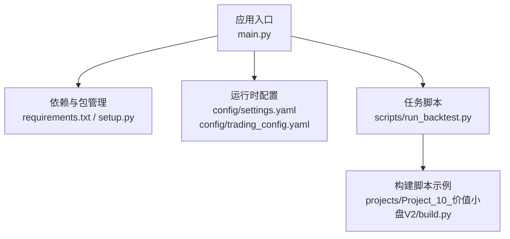
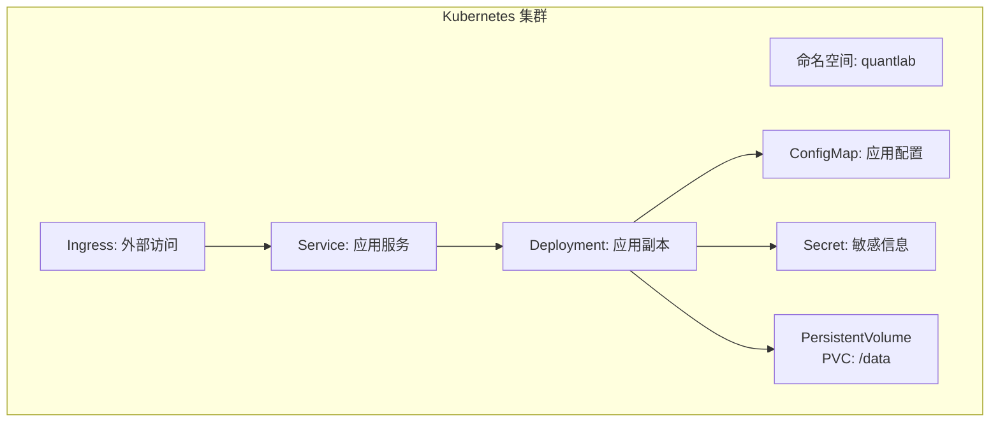
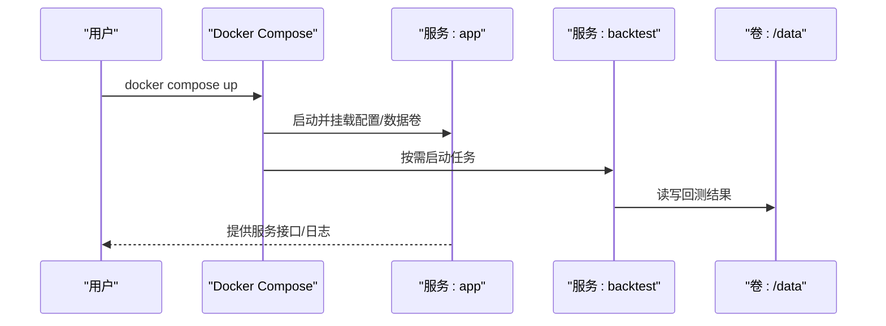
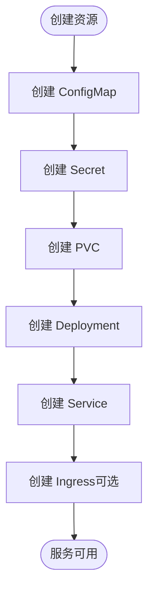
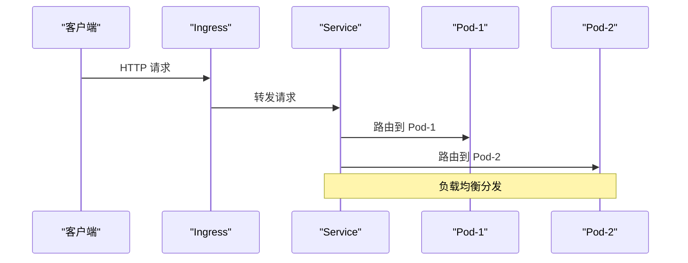
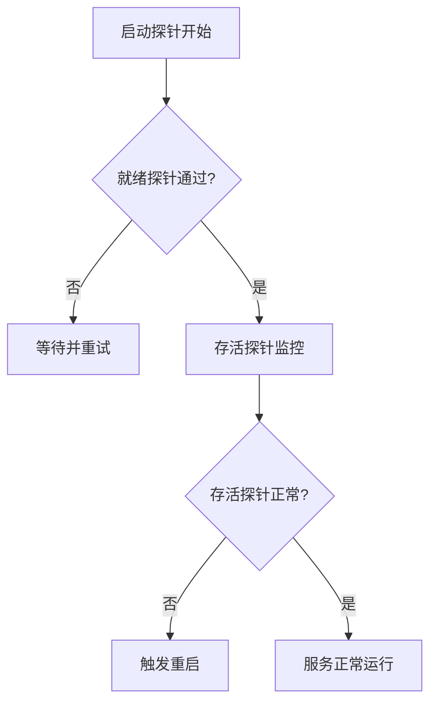
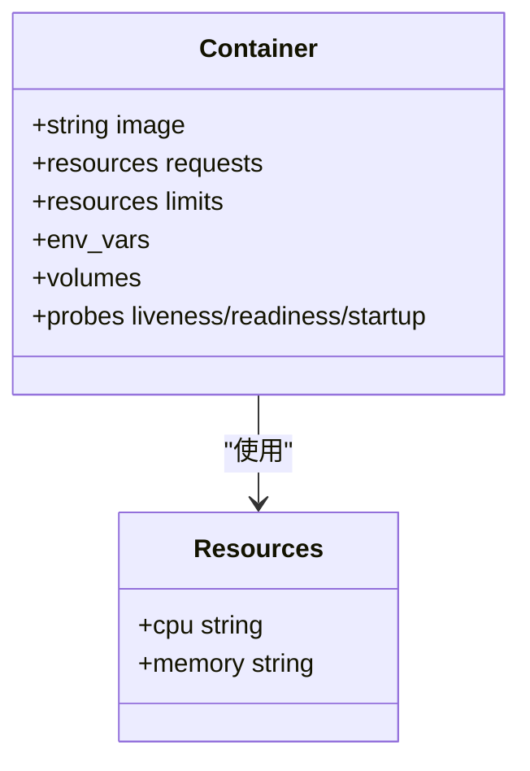
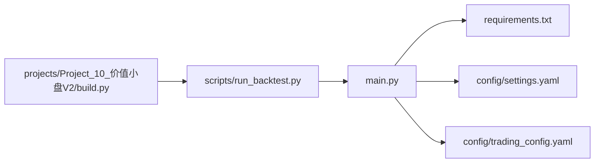

# 容器编排配置

<cite>
**本文引用的文件**   
- [config/settings.yaml](file://config/settings.yaml)
- [config/trading_config.yaml](file://config/trading_config.yaml)
- [main.py](file://main.py)
- [requirements.txt](file://requirements.txt)
- [setup.py](file://setup.py)
- [scripts/run_backtest.py](file://scripts/run_backtest.py)
- [projects/Project_10_价值小盘V2/build.py](file://projects/Project_10_价值小盘V2/build.py)
</cite>

## 目录
1. [简介](#简介)
2. [项目结构](#项目结构)
3. [核心组件](#核心组件)
4. [架构总览](#架构总览)
5. [详细组件分析](#详细组件分析)
6. [依赖关系分析](#依赖关系分析)
7. [性能考虑](#性能考虑)
8. [故障排查指南](#故障排查指南)
9. [结论](#结论)
10. [附录](#附录)

## 简介
本文件为 QuantLab 的容器编排配置文档，目标是在 Docker Compose 与 Kubernetes 环境下完成服务的容器化、网络与存储编排、环境变量管理、服务发现与健康检查、滚动更新与资源限制等。由于仓库未包含现成的 Docker/Kubernetes 清单，本文基于现有 Python 工程结构与配置文件，给出可落地的编排方案与最佳实践，帮助读者快速搭建生产可用的量化回测与交易运行环境。

## 项目结构
QuantLab 是一个以 Python 为核心的量化框架，包含策略、因子、回测引擎、数据读取、报告生成等模块。关键入口与配置如下：
- 应用入口：main.py
- 依赖声明：requirements.txt
- 打包脚本：setup.py
- 批量任务脚本：scripts/run_backtest.py
- 构建脚本（示例）：projects/Project_10_价值小盘V2/build.py
- 全局配置：config/settings.yaml、config/trading_config.yaml

**图表来源** 
- [main.py](file://main.py)
- [requirements.txt](file://requirements.txt)
- [setup.py](file://setup.py)
- [config/settings.yaml](file://config/settings.yaml)
- [config/trading_config.yaml](file://config/trading_config.yaml)
- [scripts/run_backtest.py](file://scripts/run_backtest.py)
- [projects/Project_10_价值小盘V2/build.py](file://projects/Project_10_价值小盘V2/build.py)

**章节来源**
- [main.py](file://main.py)
- [requirements.txt](file://requirements.txt)
- [setup.py](file://setup.py)
- [config/settings.yaml](file://config/settings.yaml)
- [config/trading_config.yaml](file://config/trading_config.yaml)
- [scripts/run_backtest.py](file://scripts/run_backtest.py)
- [projects/Project_10_价值小盘V2/build.py](file://projects/Project_10_价值小盘V2/build.py)

## 核心组件
- 应用镜像构建
  - 基础镜像：建议使用轻量级 Python 镜像（如 python:3.11-slim），安装系统依赖后通过 requirements.txt 安装 Python 依赖。
  - 工作目录：/app，将源码复制到镜像中，设置默认命令指向 main.py 或具体任务脚本。
- 配置注入
  - 使用 ConfigMap 挂载 settings.yaml 与 trading_config.yaml，避免硬编码敏感信息。
  - 敏感项（如数据库密码、API Key）使用 Secret 注入，并通过环境变量或只读卷挂载到容器。
- 持久化存储
  - 回测结果、日志、中间数据通过 PersistentVolumeClaim 挂载到 /data，确保 Pod 重启不丢失。
- 健康检查
  - 对长驻进程提供 HTTP 探针或 TCP 探针；对批处理任务可通过退出码与就绪探针结合实现。
- 资源限制
  - 为每个容器设置 requests/limits 的 CPU 与内存，避免资源争用与 OOM。

**章节来源**
- [requirements.txt](file://requirements.txt)
- [setup.py](file://setup.py)
- [config/settings.yaml](file://config/settings.yaml)
- [config/trading_config.yaml](file://config/trading_config.yaml)

## 架构总览
下图展示在 Kubernetes 中的典型部署形态：应用 Pod 通过 Service 暴露内部访问，外部 API 通过 Ingress/外部 IP 访问，配置与密钥通过 ConfigMap/Secret 注入，数据通过 PVC 持久化。

**图表来源** 
- [config/settings.yaml](file://config/settings.yaml)
- [config/trading_config.yaml](file://config/trading_config.yaml)
- [main.py](file://main.py)
- [scripts/run_backtest.py](file://scripts/run_backtest.py)

## 详细组件分析

### Docker Compose 编排
- 服务定义
  - app：主应用服务，基于 Python 镜像，挂载配置与数据卷，注入环境变量。
  - backtest：回测任务服务，按需启动，完成后退出，输出结果到共享卷。
  - scheduler（可选）：定时调度任务，调用 backtest 或主应用接口。
- 网络配置
  - 自定义桥接网络，隔离外部访问，服务间通过服务名解析通信。
- 卷挂载
  - config-volume：挂载 settings.yaml 与 trading_config.yaml。
  - data-volume：挂载 /data，用于回测结果、日志与中间数据。
- 环境变量管理
  - 通过 .env 文件或 Compose 的 environment 字段注入，敏感值建议从外部密钥管理服务获取。
- 依赖关系
  - backtest 依赖 app 提供的数据或服务接口；scheduler 依赖 backtest 与 app。

**图表来源** 
- [config/settings.yaml](file://config/settings.yaml)
- [config/trading_config.yaml](file://config/trading_config.yaml)
- [scripts/run_backtest.py](file://scripts/run_backtest.py)

**章节来源**
- [config/settings.yaml](file://config/settings.yaml)
- [config/trading_config.yaml](file://config/trading_config.yaml)
- [scripts/run_backtest.py](file://scripts/run_backtest.py)

### Kubernetes 部署清单
- Deployment
  - 定义应用副本数、镜像、环境变量、卷挂载、探针与资源限制。
  - 滚动更新策略：maxUnavailable 与 maxSurge 控制更新节奏。
- Service
  - ClusterIP 类型用于内部服务发现；NodePort/LoadBalancer 用于外部访问。
- ConfigMap
  - 挂载 settings.yaml 与 trading_config.yaml，支持热更新（需应用支持）。
- Secret
  - 注入数据库密码、API Key 等敏感信息，以环境变量或文件形式挂载。
- PersistentVolume/PersistentVolumeClaim
  - 定义存储类与容量，PVC 绑定到 Pod 的 /data 目录。

**图表来源** 
- [config/settings.yaml](file://config/settings.yaml)
- [config/trading_config.yaml](file://config/trading_config.yaml)
- [main.py](file://main.py)

**章节来源**
- [config/settings.yaml](file://config/settings.yaml)
- [config/trading_config.yaml](file://config/trading_config.yaml)
- [main.py](file://main.py)

### 服务发现机制
- 内部服务通信
  - 通过 K8s Service 名称解析，Pod 内直接以服务名访问。
  - Compose 中通过服务名进行容器间通信。
- 外部 API 访问
  - 通过 Ingress 暴露应用服务，或使用 NodePort/LoadBalancer。
  - 外部第三方 API 通过环境变量注入域名与认证信息。
- 负载均衡
  - K8s Service 内置负载均衡，多副本自动分发请求。
  - 对于无状态任务（如回测），按队列或事件驱动方式扩展。

**图表来源** 
- [main.py](file://main.py)

**章节来源**
- [main.py](file://main.py)

### 健康检查配置
- 探针设置
  - 存活探针（livenessProbe）：检测进程是否存活，失败则重启。
  - 就绪探针（readinessProbe）：检测服务是否准备好接收流量。
  - 启动探针（startupProbe）：针对启动较慢的应用，避免过早探测失败。
- 故障恢复策略
  - 重启策略：Always（长驻）、OnFailure（一次性任务）。
  - 退避策略：指数退避避免频繁重启风暴。
- 滚动更新配置
  - 逐步替换旧 Pod，保证服务可用性。
  - 预检查与回滚：更新前执行冒烟测试，失败自动回滚。

**图表来源** 
- [main.py](file://main.py)

**章节来源**
- [main.py](file://main.py)

### 资源限制和请求设置
- CPU 与内存
  - 根据任务特性设置 requests（保证资源）与 limits（上限保护）。
  - 批处理任务（如回测）可设置较高内存上限，CPU 按需分配。
- QoS 等级
  - Guaranteed：requests=limits，最高优先级。
  - Burstable：requests<limits，允许突发。
  - BestEffort：无限制，最低优先级。
- 弹性伸缩
  - HPA：基于 CPU/内存或自定义指标自动扩缩容。

**图表来源** 
- [requirements.txt](file://requirements.txt)
- [setup.py](file://setup.py)

**章节来源**
- [requirements.txt](file://requirements.txt)
- [setup.py](file://setup.py)

## 依赖关系分析
- Python 依赖
  - 通过 requirements.txt 声明，构建镜像时安装。
- 外部依赖
  - 数据库、消息队列、第三方 API 通过环境变量或 Secret 注入。
- 内部依赖
  - 各模块通过函数调用与配置文件耦合，避免强依赖。

**图表来源** 
- [main.py](file://main.py)
- [requirements.txt](file://requirements.txt)
- [config/settings.yaml](file://config/settings.yaml)
- [config/trading_config.yaml](file://config/trading_config.yaml)
- [scripts/run_backtest.py](file://scripts/run_backtest.py)
- [projects/Project_10_价值小盘V2/build.py](file://projects/Project_10_价值小盘V2/build.py)

**章节来源**
- [main.py](file://main.py)
- [requirements.txt](file://requirements.txt)
- [config/settings.yaml](file://config/settings.yaml)
- [config/trading_config.yaml](file://config/trading_config.yaml)
- [scripts/run_backtest.py](file://scripts/run_backtest.py)
- [projects/Project_10_价值小盘V2/build.py](file://projects/Project_10_价值小盘V2/build.py)

## 性能考虑
- 镜像优化
  - 使用多阶段构建减少镜像体积。
  - 缓存依赖层加速构建。
- 资源调优
  - 合理设置 CPU/内存限制，避免 OOM 与 CPU 节流。
  - 使用本地 SSD 作为临时存储提升 I/O 性能。
- 并发与并行
  - 批处理任务采用分布式队列或并行进程池。
- 监控与告警
  - 集成 Prometheus/Grafana 监控资源使用与业务指标。

[本节为通用指导，无需特定文件引用]

## 故障排查指南
- 常见问题
  - 配置加载失败：检查 ConfigMap 挂载路径与键名。
  - 权限问题：确认 PVC 权限与用户 UID/GID。
  - 网络不通：检查 Service 与 Ingress 配置。
- 诊断步骤
  - 查看 Pod 日志与事件。
  - 检查探针状态与重启次数。
  - 验证环境变量与 Secret 注入。
- 恢复策略
  - 回滚到稳定版本。
  - 扩容或降级资源。
  - 清理异常数据与重试任务。

**章节来源**
- [config/settings.yaml](file://config/settings.yaml)
- [config/trading_config.yaml](file://config/trading_config.yaml)
- [main.py](file://main.py)

## 结论
本文基于 QuantLab 的现有代码与配置，提供了完整的容器编排方案，涵盖 Docker Compose 与 Kubernetes 的服务定义、网络与存储、环境变量管理、健康检查、滚动更新与资源限制。通过遵循本文档的实践，可在生产环境中稳定运行量化回测与交易任务，并确保高可用与可扩展性。

[本节为总结，无需特定文件引用]

## 附录
- 最佳实践清单
  - 使用最小化基础镜像。
  - 所有配置通过 ConfigMap/Secret 注入。
  - 启用健康检查与自动重启。
  - 设置合理的资源限制与请求。
  - 使用 PVC 持久化关键数据。
  - 实施滚动更新与回滚策略。
  - 建立完善的监控与告警体系。

[本节为补充内容，无需特定文件引用]