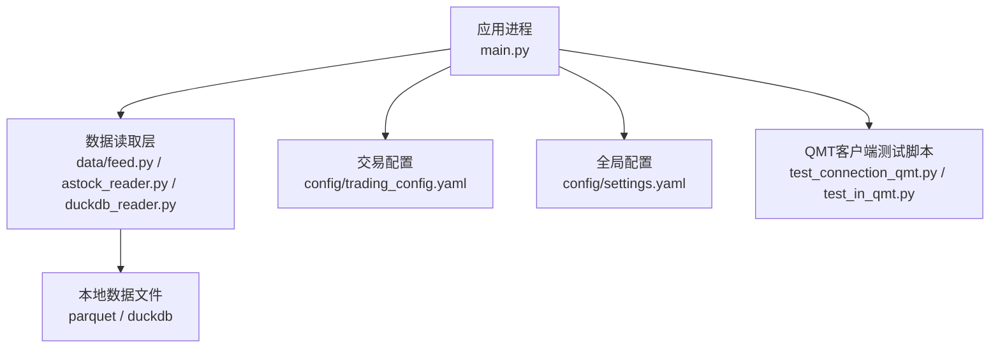
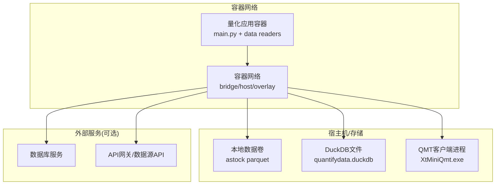
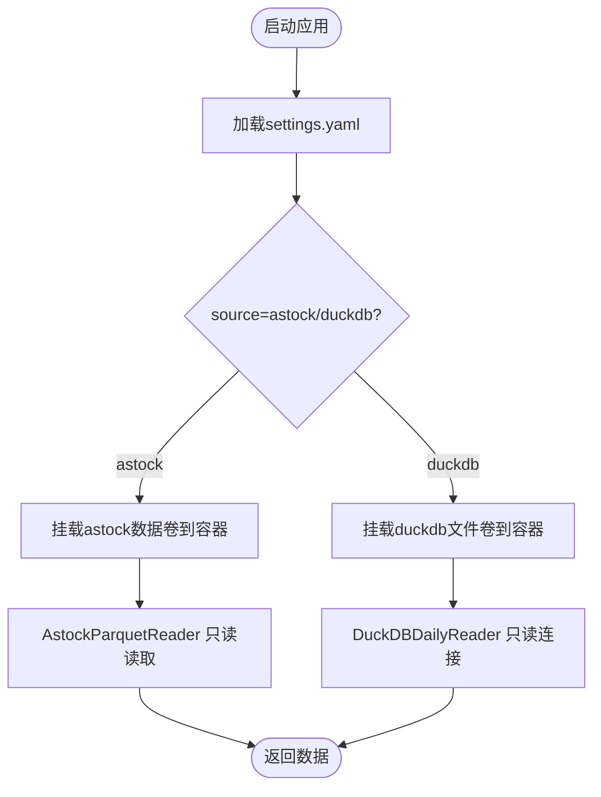
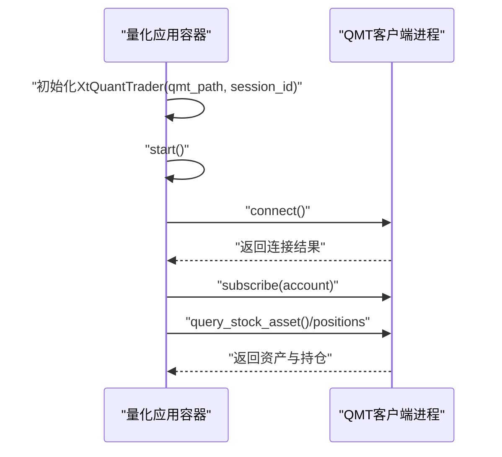
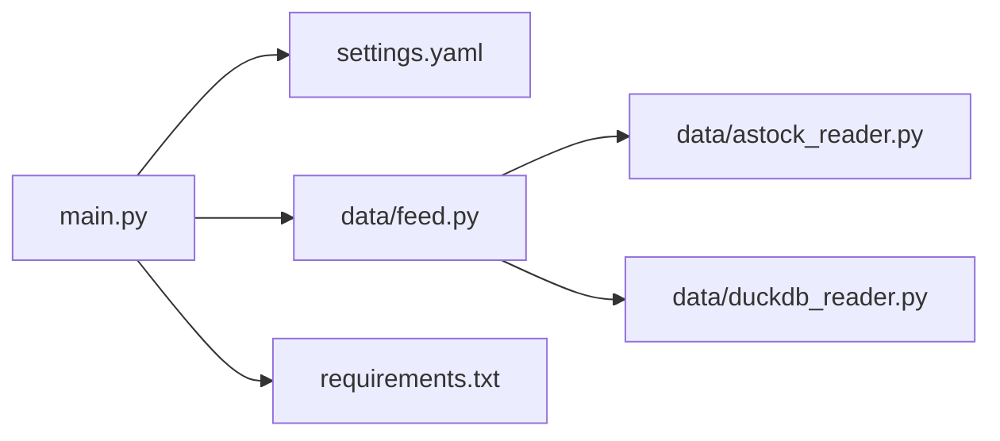

# 容器网络配置

<cite>
**本文引用的文件**
- [config/settings.yaml](file://config/settings.yaml)
- [config/trading_config.yaml](file://config/trading_config.yaml)
- [data/feed.py](file://data/feed.py)
- [data/astock_reader.py](file://data/astock_reader.py)
- [data/duckdb_reader.py](file://data/duckdb_reader.py)
- [data/benchmark_reader.py](file://data/benchmark_reader.py)
- [main.py](file://main.py)
- [requirements.txt](file://requirements.txt)
- [test_connection_qmt.py](file://test_connection_qmt.py)
- [test_in_qmt.py](file://test_in_qmt.py)
- [projects/verification/results/production_config.yaml](file://projects/verification/results/production_config.yaml)
</cite>

## 目录
1. [简介](#简介)
2. [项目结构](#项目结构)
3. [核心组件](#核心组件)
4. [架构总览](#架构总览)
5. [详细组件分析](#详细组件分析)
6. [依赖分析](#依赖分析)
7. [性能考虑](#性能考虑)
8. [故障排查指南](#故障排查指南)
9. [结论](#结论)
10. [附录](#附录)

## 简介
本指南面向在容器中部署 QuantLab 的运维与研发人员，聚焦容器网络配置与外部服务连通性。内容涵盖：
- 容器间通信（bridge、host、overlay 模式选择与适用场景）
- 端口映射与服务发现机制
- 外部服务访问（数据库、QMT接口、数据源、API网关）
- 网络安全策略（防火墙、隔离、ACL）
- DNS解析（自定义域名、内网DNS、服务路由）
- 监控与故障排查方法

说明：仓库未包含 Docker/Kubernetes 编排文件，本文基于代码中的路径与连接方式给出容器化网络建议与最佳实践。

## 项目结构
QuantLab 当前以本地文件路径和进程内库调用为主，关键网络相关点包括：
- 数据源路径硬编码或配置文件指定（如 astock parquet、DuckDB 文件）
- QMT 客户端通过本地路径与进程通信（非 TCP 端口）
- 主入口加载 YAML 配置并启动回测流程

图表来源
- [main.py:21-26](file://main.py#L21-L26)
- [data/feed.py:17-41](file://data/feed.py#L17-L41)
- [data/astock_reader.py:25-40](file://data/astock_reader.py#L25-L40)
- [data/duckdb_reader.py:35-57](file://data/duckdb_reader.py#L35-L57)
- [config/settings.yaml:1-69](file://config/settings.yaml#L1-L69)
- [config/trading_config.yaml:1-62](file://config/trading_config.yaml#L1-L62)

章节来源
- [main.py:21-26](file://main.py#L21-L26)
- [data/feed.py:17-41](file://data/feed.py#L17-L41)
- [data/astock_reader.py:25-40](file://data/astock_reader.py#L25-L40)
- [data/duckdb_reader.py:35-57](file://data/duckdb_reader.py#L35-L57)
- [config/settings.yaml:1-69](file://config/settings.yaml#L1-L69)
- [config/trading_config.yaml:1-62](file://config/trading_config.yaml#L1-L62)

## 核心组件
- 数据源抽象与切换
  - DataFeed 统一接口支持 astock 与 duckdb 两种数据源，按 source 字段分发到具体 reader。
- 数据读取器
  - AstockParquetReader：只读读取 parquet 文件，列对齐 DuckDBDailyReader 接口。
  - DuckDBDailyReader：只读连接本地 .duckdb 文件，支持 WAL 检测与多 schema 路径。
- 基准指数读取器
  - BenchmarkIndexReader：从 DuckDB index_daily 表读取指数序列。
- 配置管理
  - settings.yaml：全局配置（项目信息、数据路径、缓存、日志、因子与策略开关）。
  - trading_config.yaml：实盘参数（账户、风控、订单、调度、通知、数据源路径等）。
- 主入口
  - main.py：加载 settings.yaml，根据策略名称运行回测流程。

章节来源
- [data/feed.py:17-41](file://data/feed.py#L17-L41)
- [data/astock_reader.py:25-40](file://data/astock_reader.py#L25-L40)
- [data/duckdb_reader.py:35-57](file://data/duckdb_reader.py#L35-L57)
- [data/benchmark_reader.py:39-72](file://data/benchmark_reader.py#L39-L72)
- [config/settings.yaml:1-69](file://config/settings.yaml#L1-L69)
- [config/trading_config.yaml:1-62](file://config/trading_config.yaml#L1-L62)
- [main.py:21-26](file://main.py#L21-L26)

## 架构总览
下图展示容器化后典型的数据与外部服务交互关系。由于当前实现主要依赖本地文件与进程内库，容器网络重点在于“共享存储挂载”和“必要的出站访问”。

图表来源
- [data/feed.py:17-41](file://data/feed.py#L17-L41)
- [data/astock_reader.py:25-40](file://data/astock_reader.py#L25-L40)
- [data/duckdb_reader.py:35-57](file://data/duckdb_reader.py#L35-L57)
- [test_connection_qmt.py:52-92](file://test_connection_qmt.py#L52-L92)

## 详细组件分析

### 数据源与容器网络
- 数据源选择
  - 通过 settings.yaml 的 data.source 与 feed.DataFeed(source) 决定使用 astock 或 duckdb。
- 路径与挂载
  - astock parquet 与 duckdb 文件均为本地路径，容器化时应通过卷挂载将宿主路径映射到容器内固定路径，避免硬编码差异。
- 只读约束
  - DuckDB 与 Astock reader 均强调只读，容器内应设置只读挂载以提升安全与一致性。

图表来源
- [config/settings.yaml:10-19](file://config/settings.yaml#L10-L19)
- [data/feed.py:17-41](file://data/feed.py#L17-L41)
- [data/astock_reader.py:25-40](file://data/astock_reader.py#L25-L40)
- [data/duckdb_reader.py:35-57](file://data/duckdb_reader.py#L35-L57)

章节来源
- [config/settings.yaml:10-19](file://config/settings.yaml#L10-L19)
- [data/feed.py:17-41](file://data/feed.py#L17-L41)
- [data/astock_reader.py:25-40](file://data/astock_reader.py#L25-L40)
- [data/duckdb_reader.py:35-57](file://data/duckdb_reader.py#L35-L57)

### QMT 接口访问与容器网络
- 连接方式
  - 通过 XtQuantTrader 初始化并 connect()，依赖本地路径与 session_id；并非 TCP 端口直连。
- 容器化要点
  - 将 QMT userdata_mini 目录挂载至容器内相同路径，确保 xttrader 能找到会话与配置。
  - 若 QMT 进程在宿主机运行，容器需具备访问该目录的权限；必要时使用 host 网络模式减少路径映射复杂度。

图表来源
- [test_connection_qmt.py:52-92](file://test_connection_qmt.py#L52-L92)
- [test_in_qmt.py:10-53](file://test_in_qmt.py#L10-L53)
- [config/trading_config.yaml:4-8](file://config/trading_config.yaml#L4-L8)

章节来源
- [test_connection_qmt.py:52-92](file://test_connection_qmt.py#L52-L92)
- [test_in_qmt.py:10-53](file://test_in_qmt.py#L10-L53)
- [config/trading_config.yaml:4-8](file://config/trading_config.yaml#L4-L8)

### 基准与外部数据源
- 基准指数
  - BenchmarkIndexReader 从 DuckDB 的 index_daily 表读取，要求容器能访问对应 .duckdb 文件。
- 外部 API（可选）
  - 若未来接入在线数据源或 API 网关，需在容器网络中放行出站访问，并通过环境变量或配置中心注入 URL。

章节来源
- [data/benchmark_reader.py:39-72](file://data/benchmark_reader.py#L39-L72)

### 配置管理与容器化
- settings.yaml
  - 定义数据源类型、缓存目录、日志目录等；容器化时建议将路径指向挂载卷。
- trading_config.yaml
  - 定义 QMT 路径、资金与风控参数、数据源路径；容器化时需保证路径一致性与可读性。
- production_config.yaml
  - 组合策略与 QMT 文件路径示例，便于生产环境统一配置。

章节来源
- [config/settings.yaml:1-69](file://config/settings.yaml#L1-L69)
- [config/trading_config.yaml:1-62](file://config/trading_config.yaml#L1-L62)
- [projects/verification/results/production_config.yaml:1-100](file://projects/verification/results/production_config.yaml#L1-L100)

## 依赖分析
- 运行时依赖
  - pandas、numpy、pyyaml、scipy 等；QMT 相关 xtquant 由 QMT 安装目录提供。
- 模块依赖
  - main.py 加载 settings.yaml 并导入策略与数据加载模块；data.feed 作为数据源统一入口。

图表来源
- [main.py:21-26](file://main.py#L21-L26)
- [data/feed.py:17-41](file://data/feed.py#L17-L41)
- [requirements.txt:1-29](file://requirements.txt#L1-L29)

章节来源
- [main.py:21-26](file://main.py#L21-L26)
- [data/feed.py:17-41](file://data/feed.py#L17-L41)
- [requirements.txt:1-29](file://requirements.txt#L1-L29)

## 性能考虑
- 数据读取
  - 优先使用只读挂载与文件系统缓存；避免频繁跨网络访问大文件。
- 并发与锁
  - DuckDB 与 parquet 读取为只读，可并行读取不同日期/标的；注意避免同一文件被多个写进程修改。
- 资源隔离
  - 容器限制 CPU/内存配额，防止数据读取阶段阻塞其他任务。

## 故障排查指南
- 数据源不可达
  - 检查 settings.yaml 的 data.source 与实际数据路径是否匹配；确认容器内挂载卷路径一致且可读。
- DuckDB WAL 警告
  - 当检测到 .wal 文件时，表示上游同步进行中，数据一致性可能不稳定；等待同步完成后再运行。
- QMT 连接失败
  - 确认 QMT 进程已启动、账号已登录；检查 qmt_path 与 session_id 配置是否正确；验证容器对 userdata_mini 目录有读写权限。
- 日志与输出
  - 查看 logs 目录与策略报告，定位错误堆栈与时间线。

章节来源
- [data/duckdb_reader.py:63-68](file://data/duckdb_reader.py#L63-L68)
- [config/settings.yaml:31-35](file://config/settings.yaml#L31-L35)
- [test_connection_qmt.py:52-92](file://test_connection_qmt.py#L52-L92)

## 结论
QuantLab 当前以本地文件与进程内库为主，容器化网络的核心是“正确的路径映射与只读访问”。对于 QMT 集成，需确保 userdata_mini 目录可达且权限正确。若未来引入分布式数据源或 API 网关，再按需启用 overlay 网络与服务发现。

## 附录

### 容器网络模式选择建议
- bridge（默认）
  - 适合单机容器化，通过端口映射暴露必要服务；数据通过卷挂载共享。
- host
  - 适合需要直接访问宿主机设备或简化路径映射的场景（如 QMT 进程在宿主机）。
- overlay
  - 适用于多节点集群与分布式数据源；当前项目未体现跨节点需求，暂不强制。

### 端口映射规则
- 当前实现无显式监听端口；若后续引入 Web 面板或 API 服务，建议在 bridge 模式下仅映射最小必要端口，并限制来源 IP。

### 服务发现机制
- 当前为单进程/单机部署，无需服务发现；若扩展为多容器微服务，建议使用 Kubernetes Service/DNS 或 Docker Compose 网络别名。

### 外部服务访问配置
- 数据库连接
  - 通过挂载 .duckdb 文件实现；如需远程数据库，应在配置中注入连接串并放行出站流量。
- QMT 接口访问
  - 通过本地路径与进程通信；容器内挂载 userdata_mini 并确保权限。
- 数据源连接
  - astock parquet 与 DuckDB 文件均需挂载；若使用在线数据源，配置 URL 并放行出站。
- API 网关配置
  - 通过环境变量或配置中心注入网关地址；容器网络需允许出站访问。

### 网络安全策略
- 防火墙规则
  - 仅开放必要出站端口（如 HTTPS），入站端口最小化。
- 网络隔离
  - 使用独立网络命名空间隔离量化容器与其他业务容器。
- 访问控制列表
  - 对外部 API 与数据库访问进行白名单限制。

### DNS 解析配置
- 自定义域名
  - 在容器内配置 /etc/resolv.conf 或使用编排工具注入 DNS 服务器。
- 内网 DNS
  - 企业内网可通过私有 DNS 解析内部服务名。
- 服务路由
  - 使用 Service 名称或服务别名进行容器间通信。

### 网络监控与故障排查
- 指标采集
  - 记录数据读取耗时、QMT 连接状态、错误码与重试次数。
- 日志聚合
  - 集中收集容器日志，便于问题回溯。
- 健康检查
  - 对数据源与 QMT 连接执行周期性探测，异常时告警。