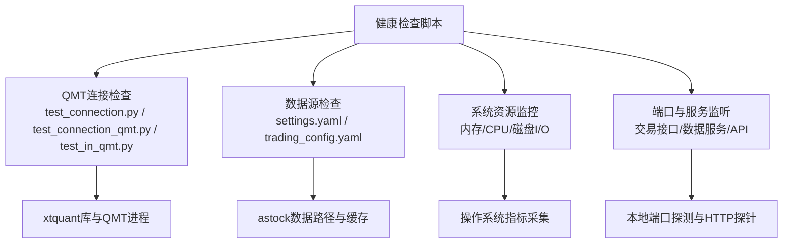
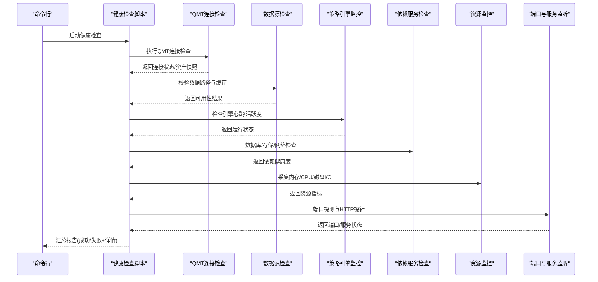
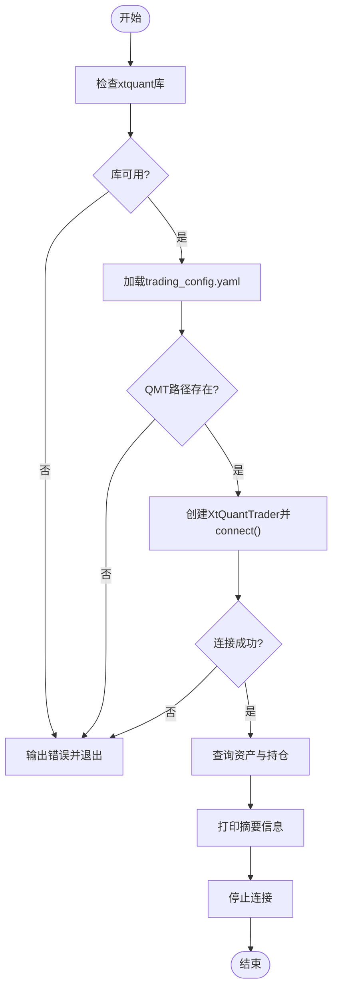
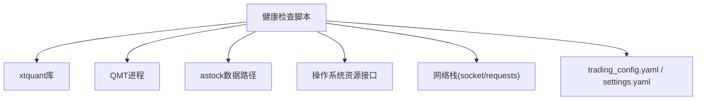

# 健康检查脚本

<cite>
**本文引用的文件**   
- [test_connection.py](file://test_connection.py)
- [test_connection_qmt.py](file://test_connection_qmt.py)
- [test_in_qmt.py](file://test_in_qmt.py)
- [trading_config.yaml](file://config/trading_config.yaml)
- [settings.yaml](file://config/settings.yaml)
- [miniQMT实盘对接_生产级完善方案.md](file://miniQMT实盘对接_生产级完善方案.md)
- [monitoring_indicators.md](file://projects/verification/results/monitoring_indicators.md)
</cite>

## 目录
1. [引言](#引言)
2. [项目结构](#项目结构)
3. [核心组件](#核心组件)
4. [架构总览](#架构总览)
5. [详细组件分析](#详细组件分析)
6. [依赖关系分析](#依赖关系分析)
7. [性能考虑](#性能考虑)
8. [故障排查指南](#故障排查指南)
9. [结论](#结论)
10. [附录](#附录)

## 引言
本指南面向 QuantLab 的健康检查脚本开发，目标是提供一套可落地的“服务状态检测 + 依赖服务检查 + 资源使用监控 + 端口监听验证”的完整方案。内容覆盖：
- QMT连接状态检查、数据源可用性验证、策略引擎运行状态监控
- 数据库连接测试、文件存储空间检测、网络连通性验证
- 内存使用率监控、CPU占用率统计、磁盘I/O性能检测
- 交易接口端口检查、数据服务端口监听、API服务状态检测
并结合仓库中已有的连接测试与配置，给出实现思路、调用流程与错误处理机制。

## 项目结构
QuantLab 已具备若干连接测试与配置样例，可作为健康检查脚本的基础参考：
- 连接测试脚本：用于验证 xtquant 库、QMT路径、会话ID、账号登录、账户查询与持仓查询等
- 配置文件：集中管理账号、路径、数据源、缓存、回测与日志等参数
- 生产级 Broker 文档：包含断线重连、回调、委托监控、通知等能力设计

图表来源
- [test_connection.py:1-117](file://test_connection.py#L1-L117)
- [test_connection_qmt.py:1-117](file://test_connection_qmt.py#L1-L117)
- [test_in_qmt.py:1-54](file://test_in_qmt.py#L1-L54)
- [trading_config.yaml:1-62](file://config/trading_config.yaml#L1-L62)
- [settings.yaml:1-69](file://config/settings.yaml#L1-L69)

章节来源
- [test_connection.py:1-117](file://test_connection.py#L1-L117)
- [test_connection_qmt.py:1-117](file://test_connection_qmt.py#L1-L117)
- [test_in_qmt.py:1-54](file://test_in_qmt.py#L1-L54)
- [trading_config.yaml:1-62](file://config/trading_config.yaml#L1-L62)
- [settings.yaml:1-69](file://config/settings.yaml#L1-L69)

## 核心组件
- QMT连接状态检查
  - 校验 xtquant 库是否可用
  - 读取并校验 QMT 安装路径、会话ID、账号ID
  - 建立连接、订阅账户、查询资产与持仓
  - 异常捕获与退出码规范（成功/失败）
- 数据源可用性验证
  - 校验 astock 数据路径是否存在且可读
  - 校验缓存目录存在性与写权限
  - 可选：尝试读取少量样本数据以确认格式正确
- 策略引擎运行状态监控
  - 通过心跳文件或进程存活检测判断引擎是否运行
  - 结合订单/成交记录更新频率判断是否活跃
- 依赖服务检查
  - 数据库连接测试（如 DuckDB/SQLite/PostgreSQL）
  - 文件存储空间检测（剩余空间阈值告警）
  - 网络连通性验证（DNS解析、HTTP可达性）
- 资源使用监控
  - 内存使用率（RSS/VMS或psutil）
  - CPU占用率（按核统计）
  - 磁盘I/O（读写吞吐、队列长度）
- 端口监听验证
  - 交易接口端口（QMT/券商网关）
  - 数据服务端口（行情/历史数据服务）
  - API服务状态检测（HTTP健康端点）

章节来源
- [test_connection.py:1-117](file://test_connection.py#L1-L117)
- [test_connection_qmt.py:1-117](file://test_connection_qmt.py#L1-L117)
- [test_in_qmt.py:1-54](file://test_in_qmt.py#L1-L54)
- [trading_config.yaml:1-62](file://config/trading_config.yaml#L1-L62)
- [settings.yaml:1-69](file://config/settings.yaml#L1-L69)

## 架构总览
健康检查脚本作为统一入口，串联各子检查项，输出结构化结果（JSON/Markdown），支持定时任务或CI集成。

图表来源
- [test_connection.py:1-117](file://test_connection.py#L1-L117)
- [test_connection_qmt.py:1-117](file://test_connection_qmt.py#L1-L117)
- [test_in_qmt.py:1-54](file://test_in_qmt.py#L1-L54)
- [trading_config.yaml:1-62](file://config/trading_config.yaml#L1-L62)
- [settings.yaml:1-69](file://config/settings.yaml#L1-L69)

## 详细组件分析

### QMT连接状态检查
- 目标：确保 xtquant 可用、QMT路径正确、会话与账号有效、账户可查询
- 关键步骤：
  - 导入 xtquant 模块，失败则提示安装或切换至QMT内置Python
  - 读取 trading_config.yaml 中的 account.path/session_id/id
  - 创建 XtQuantTrader、start、connect，非零错误码视为失败
  - 订阅账户并查询资产/持仓，打印摘要信息
  - 异常捕获并输出堆栈，退出码区分成功/失败
- 错误处理建议：
  - ImportError → 明确指引复制xtquant或使用QMT Python
  - connect() 非零 → 提示QMT未启动/账号未登录/路径错误
  - 查询失败 → 重试一次后仍失败则告警

图表来源
- [test_connection.py:1-117](file://test_connection.py#L1-L117)
- [test_connection_qmt.py:1-117](file://test_connection_qmt.py#L1-L117)
- [test_in_qmt.py:1-54](file://test_in_qmt.py#L1-L54)
- [trading_config.yaml:1-62](file://config/trading_config.yaml#L1-L62)

章节来源
- [test_connection.py:1-117](file://test_connection.py#L1-L117)
- [test_connection_qmt.py:1-117](file://test_connection_qmt.py#L1-L117)
- [test_in_qmt.py:1-54](file://test_in_qmt.py#L1-L54)
- [trading_config.yaml:1-62](file://config/trading_config.yaml#L1-L62)

### 数据源可用性验证
- 目标：确保 astock 数据路径与缓存目录可用，数据可被读取
- 关键步骤：
  - 从 settings.yaml 读取 data.astock.* 路径
  - 检查 daily_path、finance_path、basic_path 是否存在且可读
  - 检查 cache.dir 存在且有写权限
  - 可选：读取首行样本数据，校验列名/类型
- 错误处理建议：
  - 路径不存在 → 输出缺失路径并终止
  - 权限不足 → 提示权限修复
  - 数据格式异常 → 输出列名差异并终止

章节来源
- [settings.yaml:1-69](file://config/settings.yaml#L1-L69)

### 策略引擎运行状态监控
- 目标：判断策略引擎是否正常运行与活跃
- 关键步骤：
  - 心跳文件检测：检查固定路径的心跳文件更新时间
  - 进程存活检测：根据进程名或PID判断
  - 订单/成交记录更新频率：最近N分钟是否有新记录
- 错误处理建议：
  - 心跳超时 → 标记为不健康并告警
  - 进程不存在 → 自动重启（可选）
  - 无新记录 → 触发人工巡检

章节来源
- [miniQMT实盘对接_生产级完善方案.md:73-756](file://miniQMT实盘对接_生产级完善方案.md#L73-L756)

### 依赖服务检查
- 数据库连接测试
  - 根据配置选择驱动（DuckDB/SQLite/PostgreSQL）
  - 执行简单查询（SELECT 1）验证连通性
- 文件存储空间检测
  - 计算根分区/数据分区剩余空间百分比
  - 低于阈值（如10%）告警
- 网络连通性验证
  - DNS解析测试（如交易所域名）
  - HTTP探针（内部API健康端点）

章节来源
- [trading_config.yaml:1-62](file://config/trading_config.yaml#L1-L62)
- [settings.yaml:1-69](file://config/settings.yaml#L1-L69)

### 资源使用监控
- 内存使用率监控
  - 采集进程RSS/VMS或系统整体内存使用率
  - 超过阈值（如85%）告警
- CPU占用率统计
  - 采集总体与单核CPU使用率
  - 持续高负载（>90%）告警
- 磁盘I/O性能检测
  - 读取/写入吞吐、队列长度、延迟
  - 队列过长或延迟升高告警

章节来源
- [monitoring_indicators.md:1-69](file://projects/verification/results/monitoring_indicators.md#L1-L69)

### 端口监听验证
- 交易接口端口检查
  - 探测QMT或券商网关端口（如TCP）
  - 握手成功视为正常
- 数据服务端口监听
  - 探测数据服务端口（如行情/历史数据）
  - 若为HTTP服务，请求健康端点
- API服务状态检测
  - 访问 /health 或 /status 端点
  - 返回200且body含健康标志视为正常

章节来源
- [trading_config.yaml:1-62](file://config/trading_config.yaml#L1-L62)

## 依赖关系分析
健康检查脚本依赖以下外部组件与配置：
- xtquant库与QMT进程
- astock数据路径与缓存目录
- 操作系统资源采集接口（psutil/os）
- 网络栈（socket/requests）
- 配置文件（trading_config.yaml、settings.yaml）

图表来源
- [test_connection.py:1-117](file://test_connection.py#L1-L117)
- [test_connection_qmt.py:1-117](file://test_connection_qmt.py#L1-L117)
- [test_in_qmt.py:1-54](file://test_in_qmt.py#L1-L54)
- [trading_config.yaml:1-62](file://config/trading_config.yaml#L1-L62)
- [settings.yaml:1-69](file://config/settings.yaml#L1-L69)

章节来源
- [test_connection.py:1-117](file://test_connection.py#L1-L117)
- [test_connection_qmt.py:1-117](file://test_connection_qmt.py#L1-L117)
- [test_in_qmt.py:1-54](file://test_in_qmt.py#L1-L54)
- [trading_config.yaml:1-62](file://config/trading_config.yaml#L1-L62)
- [settings.yaml:1-69](file://config/settings.yaml#L1-L69)

## 性能考虑
- 并发与串行
  - 独立检查项可并行执行（如网络探测、资源采集）
  - QMT连接需串行，避免多实例冲突
- 超时与重试
  - 所有外部调用设置合理超时（如5秒）
  - 失败重试不超过2次，避免雪崩
- 采样频率
  - 资源监控建议每10-30秒采样一次
  - 端口探测与HTTP探针间隔不低于5秒
- 输出体积
  - 控制日志与报告大小，仅保留必要字段
  - 定期清理临时文件与缓存

[本节为通用指导，无需代码引用]

## 故障排查指南
- QMT连接失败
  - 检查 xtquant 是否安装或是否使用QMT内置Python
  - 核对 account.path/session_id/id 是否正确
  - 确认QMT进程已启动且账号已登录
- 数据源不可用
  - 检查 astock 路径是否存在且可读
  - 检查缓存目录权限
  - 读取样本数据校验列名与类型
- 策略引擎不活跃
  - 检查心跳文件更新时间
  - 检查进程存活与日志输出
  - 查看订单/成交记录是否更新
- 资源告警
  - 内存/CPU过高：定位热点进程或任务
  - 磁盘空间不足：清理日志与旧数据
  - 磁盘I/O延迟：检查后台任务与磁盘健康
- 端口或服务不可达
  - 检查防火墙与安全组规则
  - 确认服务进程已启动并绑定正确端口
  - 验证HTTP健康端点响应体

章节来源
- [test_connection.py:1-117](file://test_connection.py#L1-L117)
- [test_connection_qmt.py:1-117](file://test_connection_qmt.py#L1-L117)
- [test_in_qmt.py:1-54](file://test_in_qmt.py#L1-L54)
- [miniQMT实盘对接_生产级完善方案.md:73-756](file://miniQMT实盘对接_生产级完善方案.md#L73-L756)

## 结论
通过统一的健检脚本，将QMT连接、数据源、策略引擎、依赖服务、资源与端口纳入标准化检查流程，可有效提升系统的可观测性与稳定性。建议将脚本接入定时任务或CI流水线，结合告警通道（企业微信/钉钉）实现自动化运维闭环。

[本节为总结性内容，无需代码引用]

## 附录
- 示例调用流程
  - 启动健康检查脚本，依次执行各检查项
  - 输出JSON或Markdown报告，包含成功/失败与详细信息
  - 根据阈值触发告警或自动恢复动作
- 扩展建议
  - 增加更多数据源（如Wind/Tushare）可用性检查
  - 增加策略因子IC/换手率等质量指标监控
  - 集成Prometheus/Grafana进行可视化监控

[本节为概念性内容，无需代码引用]