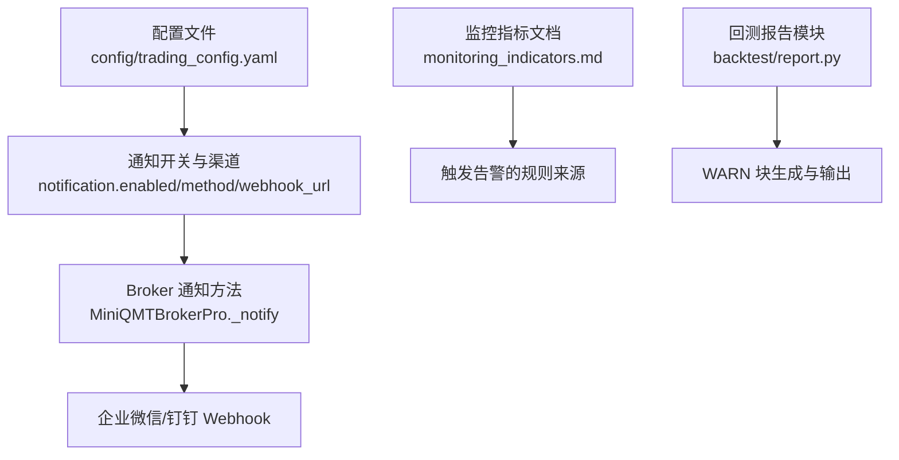
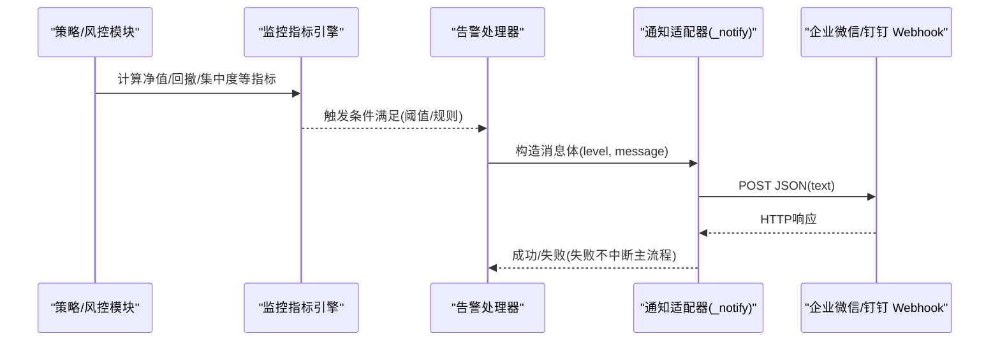
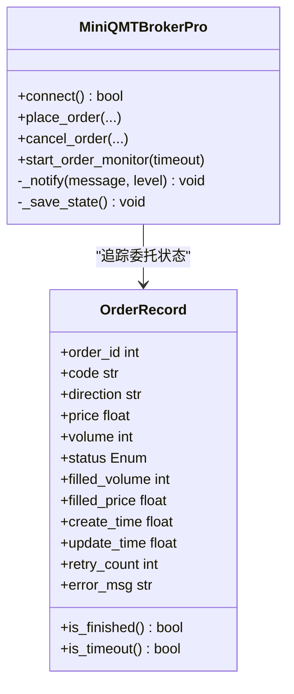
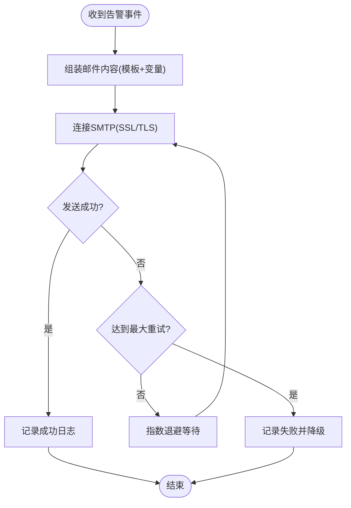
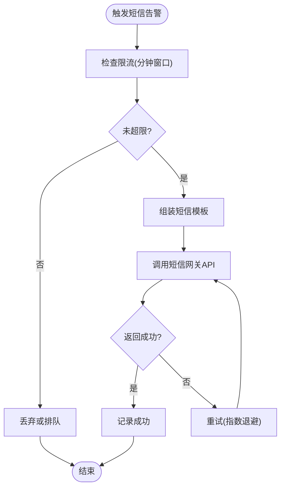
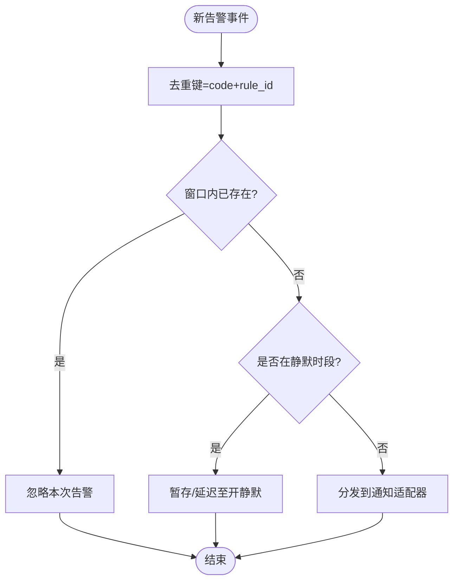

# 告警系统集成

<cite>
**本文引用的文件**   
- [config/trading_config.yaml](file://config/trading_config.yaml)
- [config/settings.yaml](file://config/settings.yaml)
- [miniQMT实盘对接_生产级完善方案.md](file://miniQMT实盘对接_生产级完善方案.md)
- [scripts/test_passorder_with_monitor.py](file://scripts/test_passorder_with_monitor.py)
- [backtest/report.py](file://backtest/report.py)
- [projects/verification/results/monitoring_indicators.md](file://projects/verification/results/monitoring_indicators.md)
</cite>

## 目录
1. [简介](#简介)
2. [项目结构](#项目结构)
3. [核心组件](#核心组件)
4. [架构总览](#架构总览)
5. [详细组件分析](#详细组件分析)
6. [依赖关系分析](#依赖关系分析)
7. [性能与稳定性考虑](#性能与稳定性考虑)
8. [故障排查指南](#故障排查指南)
9. [结论](#结论)
10. [附录：配置清单与最佳实践](#附录配置清单与最佳实践)

## 简介
本指南面向 QuantLab 的告警系统集成，覆盖以下能力与配置要点：
- 邮件通知（SMTP 服务器、模板定制、收件人管理）
- 钉钉机器人（Webhook 配置、消息格式、@提醒）
- 企业微信推送（应用创建、消息类型、群组通知）
- 短信告警（网关接入、紧急级别、发送频率控制）
- 告警规则、去重机制、静默时段设置

当前仓库已提供最小可用的通知通道（企业微信/钉钉 Webhook），并给出配置位置与调用方式。邮件与短信通道为扩展项，本文给出落地方案与集成步骤，便于按需实现。

## 项目结构
与告警相关的关键位置：
- 全局与交易配置：config/trading_config.yaml、config/settings.yaml
- 通知实现入口：MiniQMTBrokerPro._notify（通过 Webhook 发送文本消息）
- 监控指标定义：projects/verification/results/monitoring_indicators.md
- 回测日志与警告块：backtest/report.py
- QMT 委托测试脚本：scripts/test_passorder_with_monitor.py

图表来源
- [config/trading_config.yaml:37-40](file://config/trading_config.yaml#L37-L40)
- [miniQMT实盘对接_生产级完善方案.md:692-713](file://miniQMT实盘对接_生产级完善方案.md#L692-L713)
- [projects/verification/results/monitoring_indicators.md:1-69](file://projects/verification/results/monitoring_indicators.md#L1-L69)
- [backtest/report.py:78-108](file://backtest/report.py#L78-L108)

章节来源
- [config/trading_config.yaml:1-62](file://config/trading_config.yaml#L1-L62)
- [config/settings.yaml:1-69](file://config/settings.yaml#L1-L69)
- [miniQMT实盘对接_生产级完善方案.md:26-72](file://miniQMT实盘对接_生产级完善方案.md#L26-L72)

## 核心组件
- 通知配置项
  - enabled：是否启用通知
  - method：渠道选择（wechat / dingtalk / email）
  - webhook_url：企业微信或钉钉 Webhook 地址
- Broker 通知方法
  - _notify(message, level)：根据配置的 webhook 发送文本消息；失败不影响主流程
- 监控指标与告警阈值
  - 净值回撤、持仓集中度、行业集中度、换手率、信号质量等阈值定义
- 回测日志与警告
  - 固定顺序的 WARN 块，便于统一解析与上报

章节来源
- [config/trading_config.yaml:37-40](file://config/trading_config.yaml#L37-L40)
- [miniQMT实盘对接_生产级完善方案.md:692-713](file://miniQMT实盘对接_生产级完善方案.md#L692-L713)
- [projects/verification/results/monitoring_indicators.md:1-69](file://projects/verification/results/monitoring_indicators.md#L1-L69)
- [backtest/report.py:78-108](file://backtest/report.py#L78-L108)

## 架构总览
下图展示从“事件/指标”到“多渠道通知”的整体流程。当前仓库默认使用 Webhook 通道；邮件与短信可按相同模式扩展。

图表来源
- [miniQMT实盘对接_生产级完善方案.md:692-713](file://miniQMT实盘对接_生产级完善方案.md#L692-L713)
- [projects/verification/results/monitoring_indicators.md:1-69](file://projects/verification/results/monitoring_indicators.md#L1-L69)

## 详细组件分析

### 通知通道：企业微信/钉钉 Webhook（已有实现）
- 配置位置
  - config/trading_config.yaml 中 notification.enabled/method/webhook_url
- 调用点
  - MiniQMTBrokerPro._notify：读取 webhook_url，构造 text 消息，POST 发送
- 支持的消息类型
  - 文本消息（text）
- 错误处理
  - 网络异常捕获，失败不影响主流程

图表来源
- [miniQMT实盘对接_生产级完善方案.md:199-756](file://miniQMT实盘对接_生产级完善方案.md#L199-L756)

章节来源
- [config/trading_config.yaml:37-40](file://config/trading_config.yaml#L37-L40)
- [miniQMT实盘对接_生产级完善方案.md:692-713](file://miniQMT实盘对接_生产级完善方案.md#L692-L713)

### 邮件通知（扩展实现建议）
- SMTP 配置
  - 在 trading_config.yaml 新增 mail 段：smtp_server、port、use_ssl、username、password、from_addr
- 模板定制
  - 支持 HTML/纯文本模板，变量包含：时间、账号、级别、摘要、详情链接
- 收件人列表管理
  - 支持按级别分组（info/warning/critical），动态合并去重
- 发送流程
  - 构建 MIME 邮件，连接 SMTP，发送后记录结果与重试策略

说明
- 该流程图用于指导邮件通道的扩展实现，非现有代码路径

### 钉钉机器人（Webhook）
- Webhook 获取
  - 群设置 → 智能群助手 → 添加机器人 → 自定义 → 复制 Webhook 地址
- 消息格式
  - 文本消息：content 字段；可附加 markdown 片段
- @提醒功能
  - 在 content 中使用 @手机号 或 @指定成员；注意平台限制与权限
- 安全设置
  - 可选签名校验（自定义密钥），服务端需对请求做签名验证

章节来源
- [实盘配置指南.md:82-102](file://实盘配置指南.md#L82-L102)

### 企业微信推送（应用与群组）
- 应用创建
  - 企业微信管理后台 → 应用管理 → 自建应用 → 记录 AgentId、Secret、Token
- 消息类型
  - 文本、Markdown、图文等；推荐文本/Markdown 用于告警
- 群组通知
  - 使用群机器人 Webhook 快速接入；或使用 API 以应用身份推送
- 权限与安全
  - 配置可信 IP、回调 URL、消息加签

章节来源
- [实盘配置指南.md:82-102](file://实盘配置指南.md#L82-L102)

### 短信告警服务（扩展实现建议）
- 网关接入
  - 选择云厂商短信服务（阿里云、腾讯云等），保存 AccessKey/Secret 与签名模板
- 紧急级别分类
  - info/warning/critical，不同级别对应不同模板与接收人
- 发送频率控制
  - 基于滑动窗口限流（如每分钟 N 条）、同号码冷却时间
- 失败重试与降级
  - 指数退避 + 死信队列；失败时切换备用通道（如 Webhook）

说明
- 该流程图用于指导短信通道的扩展实现，非现有代码路径

### 告警规则、去重与静默时段
- 告警规则
  - 基于 monitoring_indicators.md 中的阈值定义（净值回撤、集中度、换手率、信号质量等）
- 去重机制
  - 同一规则键值（如 code+rule_id）在时间窗口内只发一次
- 静默时段
  - 允许配置时间段（如夜间）屏蔽非 critical 告警

说明
- 该流程图用于指导告警去重与静默的实现思路，非现有代码路径

章节来源
- [projects/verification/results/monitoring_indicators.md:1-69](file://projects/verification/results/monitoring_indicators.md#L1-L69)

## 依赖关系分析
- 配置依赖
  - trading_config.yaml 的 notification.* 决定通道开关与目标地址
- 运行时依赖
  - requests 库用于 Webhook 发送
  - logging 用于记录通知结果
- 外部依赖
  - 企业微信/钉钉 Webhook 服务
  - （扩展）SMTP 服务器、短信网关

图表来源
- [config/trading_config.yaml:37-40](file://config/trading_config.yaml#L37-L40)
- [miniQMT实盘对接_生产级完善方案.md:692-713](file://miniQMT实盘对接_生产级完善方案.md#L692-L713)

章节来源
- [config/trading_config.yaml:1-62](file://config/trading_config.yaml#L1-L62)
- [miniQMT实盘对接_生产级完善方案.md:692-713](file://miniQMT实盘对接_生产级完善方案.md#L692-L713)

## 性能与稳定性考虑
- 通知失败隔离
  - _notify 捕获异常，避免影响主流程
- 超时与重试
  - Webhook 请求设置合理超时；短信/邮件采用指数退避
- 并发与锁
  - 委托状态更新使用线程锁，保证一致性
- 资源清理
  - 断开连接时持久化状态，便于恢复

章节来源
- [miniQMT实盘对接_生产级完善方案.md:692-713](file://miniQMT实盘对接_生产级完善方案.md#L692-L713)
- [miniQMT实盘对接_生产级完善方案.md:510-545](file://miniQMT实盘对接_生产级完善方案.md#L510-L545)

## 故障排查指南
- Webhook 无法送达
  - 检查 webhook_url 是否正确；确认网络连通性与白名单
  - 查看日志中 _notify 的异常信息
- 钉钉/企业微信权限问题
  - 确认机器人权限、@成员范围、签名校验配置
- 邮件发送失败
  - 检查 SMTP 端口、SSL/TLS、账号密码、发件人域名 SPF/DKIM
- 短信发送失败
  - 检查签名模板、余额、号码归属地限制、限流策略

章节来源
- [miniQMT实盘对接_生产级完善方案.md:692-713](file://miniQMT实盘对接_生产级完善方案.md#L692-L713)
- [backtest/report.py:78-108](file://backtest/report.py#L78-L108)

## 结论
QuantLab 当前已具备基于 Webhook 的企业微信/钉钉通知能力，并通过 trading_config.yaml 集中管理。邮件与短信通道可按本文方案扩展，结合监控指标文档定义告警规则，配合去重与静默策略，形成稳定可靠的告警体系。建议在生产环境优先启用 Webhook 通道，再逐步接入邮件与短信作为冗余与升级通道。

## 附录：配置清单与最佳实践
- 最小可用配置（Webhook）
  - 在 trading_config.yaml 中设置 notification.enabled=true、method=wechat/dingtalk、webhook_url=你的地址
- 模板与变量
  - 所有通道建议统一模板变量：level、message、time、account_id、detail_link
- 安全与审计
  - 敏感配置（密码、密钥）使用环境变量或密钥管理服务
  - 通知发送记录落盘，便于审计与回溯
- 监控与演练
  - 定期触发测试告警，验证各通道可达性
  - 建立告警分级与升级策略（warning→critical）

章节来源
- [config/trading_config.yaml:37-40](file://config/trading_config.yaml#L37-L40)
- [miniQMT实盘对接_生产级完善方案.md:692-713](file://miniQMT实盘对接_生产级完善方案.md#L692-L713)
- [projects/verification/results/monitoring_indicators.md:1-69](file://projects/verification/results/monitoring_indicators.md#L1-L69)